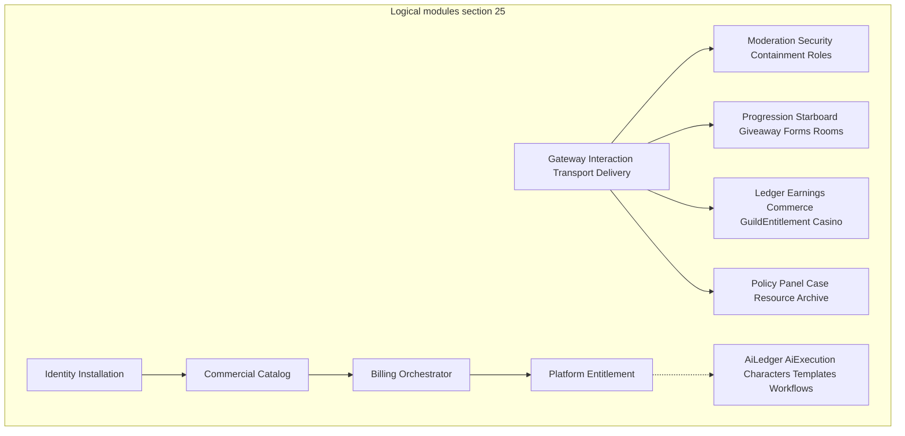

# Tobot Architecture Review

[Architecture index](README.md)

This document is the canonical architecture-review hub. It does **not** replace sections 1–34. Existing specification text remains the Current Specification unless a later Decision Record changes it.

Recommendations, risks, and open decisions here are **not implemented**. They MUST NOT be read as product features, running services, tables, or endpoints.

Classification legend:

| Label | Meaning |
|---|---|
| `SPEC FACT` | Stated explicitly in the current specification |
| `CURRENT DECISION` | Already decided; preserve |
| `RECOMMENDATION` | Proposed improvement; not implemented |
| `RISK` | Technical, operational, security, or product risk |
| `CONTRADICTION` | Two or more spec statements disagree; originals are kept |
| `MISSING DECISION` | A required decision is still undefined |
| `OPEN DECISION` | A later decision is required; both options remain possible |
| `REJECTED OPTION` | Evaluated and discarded, with reason |

Review method: all 25 Markdown files in this directory were read (16,663 lines). Findings were classified, merged, and checked against official Discord, Stripe, OAuth, PostgreSQL, Axum, and Astro documentation. The current TypeScript Adobos codebase is **not** a source of truth for this greenfield specification.

## 1. Executive summary

### Current Specification

The specification defines a greenfield, language-independent, vendor-neutral Discord platform. Eleven product domains share Discord Gateway and HTTP edges, inbox/outbox durability, at-least-once processing with effectively-once Discord effects, and three isolated value planes: guild virtual currency, commercial billing, and AI Credits.

### Architecture Review

Logical module ownership in [14-invariants-and-boundaries.md](14-invariants-and-boundaries.md) §25 is largely coherent. **DR-001** closes the former contradiction between a sixty-row catalog and independently deployable processes: §7 lists **modules**; §6.2 lists **services**. Remaining holes are operational adapters and commercial state machines already closed in later DRs. Dual-writer races on Discord member roles are DR-068. Entitlement prefix fail-closed apply is DR-069. Reservation `Disputed` versus operation `Uncertain` is DR-070. C-02 is closed by DR-002.

## 2. Document inventory

| Order | Document | Lines | Purpose | Review role |
|---:|---|---:|---|---|
| 0 | [README.md](README.md) | 47 | Index and conventions | Navigation |
| 1 | [01-foundations.md](01-foundations.md) | 526 | Scope, ADRs, SLOs | Current decisions |
| 2 | [02-service-topology.md](02-service-topology.md) | 1,751 | Topology and 60-service catalog | Module map |
| 3 | [03-canonical-contracts.md](03-canonical-contracts.md) | 1,049 | Envelopes 8.1–8.51 | Protocol matrix |
| 4 | [04-runtime-flows.md](04-runtime-flows.md) | 1,878 | Flows 9.1–9.52 | Integration and resilience |
| 5 | [05-state-models.md](05-state-models.md) | 1,003 | Lifecycles 10.1–10.42 | Billing and compensation |
| 6 | [06-domain-relationships.md](06-domain-relationships.md) | 753 | Bounded-context graphs | Ownership and cycles |
| 7 | [07-data-core.md](07-data-core.md) | 273 | Delivery and catalog data | Persistence |
| 8 | [08-data-safety-and-access.md](08-data-safety-and-access.md) | 739 | Safety and role data | Persistence |
| 9 | [09-data-community-and-economy.md](09-data-community-and-economy.md) | 1,164 | Community and guild ledger | Persistence |
| 10 | [10-data-support-integrations-automation.md](10-data-support-integrations-automation.md) | 1,029 | Support, integrations, automation | Persistence |
| 11 | [10a-data-platform-access-commercial-ai.md](10a-data-platform-access-commercial-ai.md) | 585 | Identity, billing, AI, templates | Persistence |
| 12 | [11-partitioning-discord-backpressure.md](11-partitioning-discord-backpressure.md) | 458 | Discord, retries, fairness | Discord and messaging |
| 13 | [12-security-observability-deployment.md](12-security-observability-deployment.md) | 444 | Trust, telemetry, ports | Security and ops |
| 14 | [13-recovery-testing-governance.md](13-recovery-testing-governance.md) | 518 | DR, tests, ADRs | Resilience |
| 15 | [14-invariants-and-boundaries.md](14-invariants-and-boundaries.md) | 245 | Invariants and ownership | Canonical module map |
| 16–24 | [15](15-moderation.md)–[23](23-platform-access-commercial-ai.md) | 3,201 | Product specifications | Domain integration |

Related clusters: platform core (01, 02, 14), runtime (03–06, 11), data (07–10a), operations (12–13), product (15–23).

## 3. Module and dependency map

### Current Specification

[01-foundations.md](01-foundations.md) §3.1 (DR-001): a **module** is the unit of ownership; a **service** is the deployable process that hosts one or more modules. [02-service-topology.md](02-service-topology.md) §7 catalogs sixty modules. [02-service-topology.md](02-service-topology.md) §6.2 lists the initial services (affinity workers plus protocol and money edges). [14-invariants-and-boundaries.md](14-invariants-and-boundaries.md) §25 lists consumes / produces / owns / forbidden dependencies. A new service is justified only by an external protocol, a distinct scaling profile, a distinct failure domain, a transactional data boundary, or intensive work that must not affect Gateway health.

The first production deployment uses the §6.2 services. It is not a single process, and it is not one process per module. Further splits MAY occur only when a hosted group fails a §3.1 test.

### Architecture Review

`SPEC FACT`: most §7 entries are product aggregates with inbox, outbox, and guild-keyed workers. They are modules. Their host service is §6.2.

`CONTRADICTION` **C-01 (resolved by DR-001):** README and former §6 called the catalog logical while §3.1 and §7 headings read as independently deployable microservices. Normative text now uses Module vs Service.

`CONTRADICTION` **C-02 (resolved by DR-002):** Control API, Reconciliation, and Query and Status now have §25 rows.

`CONTRADICTION` **C-05 (resolved by DR-002):** Identity owns sessions. Control API owns HTTP idempotency receipts only.

### Decision Record

DR-001 accepted. DR-002 accepted. Voice Control and Voice Media (bot audio) are catalogued and not deployed until a bot-audio product ships (OD-09 closed). Temporary Room launches with Community.

## 4. Data ownership map

### Current Specification

[07-data-core.md](07-data-core.md) §12.1: one owner per mutable aggregate; no cross-service SQL; a physical cluster MAY host multiple schemas with isolated credentials. Inbox and outbox live in the same transaction as aggregates. Cache and Discord capability projections are rebuildable.

Three conserved planes ([10a-data-platform-access-commercial-ai.md](10a-data-platform-access-commercial-ai.md) §12.14, [09-data-community-and-economy.md](09-data-community-and-economy.md) §12.10):

| Plane | Owner | Unit | Must not share with |
|---|---|---|---|
| Guild virtual currency | Monetary Ledger | Integer minor units | Platform billing, AI Credits |
| Commercial billing | Billing Orchestrator | Integer minor units of billed currency | Guild journal, AI journal |
| AI Credits | AI Usage Ledger | Integer credit-minors | Guild money, generic payment credits |

XP is a fourth non-monetary ledger owned by Engagement Progression.

### Architecture Review

`SPEC FACT`: guild shop `ENTITLEMENT` is not `PLATFORM_ENTITLEMENT`. `CURRENT DECISION`: keep those names distinct in physical schemas. Unprefixed `Entitlement*` names fail closed at parse; the private `ENTITLEMENT` table is not Platform Entitlement's journal (DR-069).

`CONTRADICTION` **C-23 (resolved by DR-017):** `EXTERNAL_IDENTITY` named login linking in 10a and stream canonical identity in 10. Types are now `PLATFORM_EXTERNAL_IDENTITY` and `STREAM_CANONICAL_IDENTITY`.

`CONTRADICTION` **C-21 (resolved by DR-015):** `COOLDOWN_RESERVATION` and `PANEL_PUBLICATION` were homonyms across owners. Conceptual ERD types are now owner-qualified.

`CONTRADICTION` **C-22 (resolved by DR-016):** 09 forbade floating-point money while 10a typed commercial and AI amounts as `decimal`. Conserved amounts are now integer minor units on all three planes.

`MISSING DECISION`: none remaining for TENANT registry owner or `tenant_type`. Discord Installation owns TENANT. First-product types are `Guild` and `User` (DR-059). **DR-013:** Invoice is in §12.14.2. **DR-052:** `COMMERCIAL_REFUND` is in §12.14.2. **DR-053:** `COMMERCIAL_DISPUTE` is in §12.14.2. **DR-054:** `GRANT_SOURCE` is in §12.14.2. **DR-055:** `PROVIDER_CUSTOMER_MAPPING` and `TAX_EVIDENCE` are in §12.14.2.

### Recommended Improvement

Namespace physical tables by owner. Conserved amounts use integer minor units on all three planes (DR-016). **DR-013** added Invoice. **DR-052** added `COMMERCIAL_REFUND`. **DR-053** added `COMMERCIAL_DISPUTE`. **DR-054** added `GRANT_SOURCE`. **DR-055** added `PROVIDER_CUSTOMER_MAPPING` and `TAX_EVIDENCE`. **DR-059** placed TENANT ownership on Discord Installation with `Guild` and `User` types. **DR-064** private DDL follows expand, dual-write, contract, then drop. Do not add a search, timeseries, or warehouse product until OLTP cannot answer a named query.

## 5. Protocol and communication matrix

### Current Specification

| Path | Protocol | Sync? | Why |
|---|---|---|---|
| Discord Gateway | WebSocket | Ingress only | Session protocol |
| Discord mutations | HTTP REST via Transport | Async after durable intent | Rate limits and uncertain outcomes |
| Discord interactions | Gateway `INTERACTION_CREATE` first product (DR-042); HTTP webhook later, mutually exclusive | ACK within 3 seconds | Provider deadline; not a public Interaction listener in first product |
| Dashboard commands | Control API HTTP, then in-process or command-HTTP JSON to the owning host (DR-041) | Request/response admission | Optimistic concurrency; not the guild event bus; not gRPC-first |
| Dashboard reads | Cookie-authenticated REST poll of Query and Status (DR-043); SSE MAY later on the same projections | Bounded-stale | CQRS; not a product WebSocket; not a command path |
| Same-service module calls | In-process | Sync | Shared process; ownership still applies |
| Cross-service facts | Durable event bus after outbox (Redis Streams, DR-039) | Async | At-least-once |
| Cross-service command | Command-HTTP JSON to the owning host (DR-041): ledger, Transport, Capability preflight, interaction ACK, Control API admission | Sync admit/reject | Immediate reject before money or Discord effect; RPC MUST NOT wait for Discord |
| Wake-ups | Durable timer port | Async | Misfire policy |
| Provider and payment callbacks | Signed HTTP | ACK then async process | Provider retry |

Official Discord constraint: an initial interaction response or defer MUST occur within 3 seconds or the token is invalidated; follow-ups last 15 minutes. Gateway and HTTP interaction modes are mutually exclusive. First product is Gateway (DR-042). See [Discord receiving and responding](https://discord.com/developers/docs/interactions/receiving-and-responding). Arrow classification: [02-service-topology.md](02-service-topology.md) §6.3–6.4 (**DR-005**).

### Recommended Improvement

| Communication | Recommendation | Not |
|---|---|---|
| Discord create-message | Stable nonce + `enforce_nonce` when supported; ledger authoritative | Exactly-once broker |
| Dashboard live status | REST poll first (**DR-043**) | Product WebSocket beside Discord Gateway |
| Workflows | State machine + timer + outbox | Temporal required on day one |

### Closed Decision

OD-04 closed by DR-041: Control API → other hosts is command-HTTP JSON to the owning service. In-process when the owner is in Control Plane. Durable command envelope MAY for fire-and-forget admin jobs. Not gRPC-first. Not the guild event bus.

OD-06 closed by DR-043: first-product dashboard freshness is REST poll of Query and Status. SSE MAY later on the same projections when polling cost is measured. Not a product WebSocket beside Discord Gateway.

OD-08 closed by DR-045: three apps — sessionless `docs.*`, sessionless `www`, cookie site `app.*`. The `www` login control navigates to `app.*` login. DR-044 two-origin split is superseded.

OD-10 closed by DR-046: Billing `PastDue` is unpaid-period commercial state; Entitlement `Grace` is the access projection. Feature authorization reads Entitlement. Invariant 152 `reconciled` is provider-alignment, not Grace.

OD-11 closed by DR-047: aggregate `Installed` is every required enabled-module capability `Healthy`. Bot presence is not the aggregate. Command-only modules use `NotRequired`. Callback is `Verifying`.

OD-12 closed by DR-048: live envelope majors are N and N-1. Expand/contract. N-1 remains readable at least 14 Clock-port days after the last N-1 producer. Unsupported majors fail closed.

Session cookie policy closed by DR-049: `SameSite=Lax` on `app.*`; idle 12 hours; absolute 7 days; discovery 15 minutes; ordinary Capability 60 seconds; high-risk live plus 5-minute step-up. Named login audit catalog.

Install authorize URLs closed by DR-050: named presets `GuildInstall`, `UserInstall`, `GuildRepair`; platform `client_id`; named guild lock plus `disable_guild_select`; callback query parameters are hints.

CommercialOrder and CheckoutAttempt closed by DR-051: frozen Billing intent; one hosted-session generation; session-completed and `success_url` are not fulfillment; mixed Recurring+OneTime fails closed at admit.

Commercial refund closed by DR-052: append-only `COMMERCIAL_REFUND`; Invoice `Paid` and Order `Fulfilled` are not rewritten; create-refund HTTP is not `Succeeded`.

Commercial dispute closed by DR-053: append-only `COMMERCIAL_DISPUTE`; `Open` freezes grants; not a refund; Invoice `Paid` and Order `Fulfilled` stay put.

GrantSource closed by DR-054: Entitlement-owned applied-source aggregate; Billing publishes commercial grant facts; only Entitlement publishes AI-credit grant-source to the Ledger.

Customer cardinality closed by DR-055: no domain Customer; `BILLING_OWNER` is the payer; provider Customer objects are mapping evidence; TaxEvidence and ProviderCustomerMapping have ERD rows.

Dunning closed by DR-056: catalog-pinned collection attempts on one Open renewal invoice; exhaustion at `grace_until` is `Uncollectible` and subscription `Restricted`.

Proration closed by DR-057: Billing integer quote `None` or `TimeBalance`; provider preview is not the amount; negative delta is next-invoice credit, not a refund.

Mixed-cadence bundle split closed by DR-058: a Recurring+OneTime Bundle becomes a checkout group of two sibling orders; Recurring hosted session first; mixed Recurring intervals fail closed; `Partial` is not an automatic refund.

TENANT registry closed by DR-059: Discord Installation owns TENANT; first-product `tenant_type` is `Guild` or `User`; `tenant_id` is not a Discord snowflake; uninstall does not delete TENANT.

Due-work lease TTL closed by DR-060: 15 Clock-port seconds (range 5–30); heartbeat at most one-third of TTL; recovery strictly below 60 seconds; Gateway and Voice session leases excluded.

AI Credit lot expiry and reservation TTL closed by DR-061: lot `expires_at` frozen at mint; purchased packs non-expiring unless terms; reservation TTL 15 Clock-port minutes MUST NOT auto-release; TTL without confirmed outcome is `Uncertain`.

AI provider 429/timeout classes closed by DR-062: HTTP 429 is `RateLimited` and MAY retry; timeout after transmit is `Uncertain` and MUST NOT release or blind-retry.

Conversation and OCR artifact model closed by DR-063: Asset stores bytes; Execution owns `AI_PROTECTED_CONTENT`; Character owns bounded `AI_CONVERSATION` turns; no first-product vector store.

Private DDL expand/contract closed by DR-064: owner-schema tables are not envelope majors; breaking physical changes expand, dual-write, contract, then drop after 24 Clock-port hours.

Money-plane contract prefixes closed by DR-065: `schema_family` is `VirtualPayment`, `CommercialPayment`, or `AiCreditReservation`; §8.6 leaves stay.

Guild reward entitlement contracts closed by DR-066: public name is `GuildRewardEntitlement`; module 7.35 is not deleted.

Payment-provider ACK/inbox closed by DR-067: callbacks terminate at Provider Event Edge and follow the 9.36 path; HTTP success ACK is allowed only after a durable Edge ingress receipt and MUST NOT wait for entitlement projection.

Member-role dual writers closed by DR-068: Assignment is the sole Transport client for add and remove; Cases owns punitive desired state and publishes assignment intents.

Entitlement prefix fail-closed apply closed by DR-069: public names are only `GuildRewardEntitlement*` and `PlatformEntitlement*`; unprefixed `Entitlement*` fails at parse; inboxes reject the other prefix; consumers MUST NOT infer the plane from payload fields.

Reservation `Disputed` versus operation `Uncertain` closed by DR-070: `Disputed` is Ledger review; the operation stays `Uncertain` and MUST NOT gain `Disputed`; Query MUST NOT present `Disputed` as completed.

### Risk

Unchanged: consumers of `*Requested` events that ignore DR-006 could still double-apply effects. That is now a compliance bug against §8.6, not an open contradiction.

## 6. Backend architecture recommendation

### Current Specification

Language-independent ports and adapters. Workers use leases and fencing. No authoritative local disk. Voice and rendering are isolated from Gateway health.

### Recommended Improvement

This is an **implementation profile**. It does not change 01–23 RFC language.

- Organize by §25 domains: handlers at the edge, application services per module, domain logic without Discord SDK types, infrastructure adapters behind ports, repositories per owner database.
- One HTTP framework if implementing in Rust: **Axum** (Tokio, Tower, Hyper; `Bytes` extractor for raw Stripe/Discord webhook bodies). Documentation: [Axum](https://docs.rs/axum/latest/axum/).
- Discord Gateway crate is an adapter. Prefer a shard-oriented library (for example twilight-gateway) so product work is not written in event handlers. Keep the spec SDK-neutral.
- Workers: Tokio tasks or a second binary of the **same crate**, draining outbox and due-work tables.
- Timeouts, cancellation, retries with backoff and jitter, rate limiting, and circuit breakers live in Transport and provider adapters, not in domain code.
- Graceful shutdown: drain Discord HTTP, release leases, stop ACK of new interactions, then exit. Due-work `lease_ttl` is 15 Clock-port seconds so worker-loss recovery stays strictly below 60 seconds (DR-060).

### Rejected Alternative

gRPC as the public or default internal protocol. Discord is HTTP REST plus Gateway WebSocket. Stripe webhooks need the unmodified raw body. Cookie OAuth does not need protobuf. Reconsider gRPC only when a second language is in production **and** a measured internal hot path is encoding-bound.

## 7. Frontend architecture recommendation

### Current Specification

One dashboard client on `app.*` talks to Control API and Query and Status. Discord OAuth; opaque HTTP-only session; guild discovery is not authorization. Dashboard HTML encodes untrusted text and sends Content-Security-Policy (DR-030). First-product live status is REST poll of Query and Status; a product WebSocket is forbidden (DR-043). Three browser apps: sessionless `docs.*`, sessionless `www` landing, cookie site `app.*` (DR-045).

### Recommended Improvement

**Least complexity that meets the spec:** three **Astro** applications.

| Surface | Origin | Render | Why |
|---|---|---|---|
| Public documentation | `docs.*` | Static HTML (Starlight MAY) | SEO, cache, no session |
| Landing | `www` | Static HTML | Sessionless; login is a GET to `app.*` |
| Dashboard | `app.*` | On-demand SSR + React islands | Sole cookie site; OAuth callback; Query poll |

Astro islands hydrate only interactive components (`client:load` / `client:visible`). On-demand rendering and `Astro.cookies` apply on `app.*`. Documentation: [Astro islands](https://docs.astro.build/en/concepts/islands/), [on-demand rendering](https://docs.astro.build/en/guides/on-demand-rendering/).

Next.js App Router is an **acceptable** alternative for `app.*` if the team is already Next-native. `www` and `docs.*` MAY remain Astro.

### Rejected Alternative

A login form or OAuth callback on `www`. Dual OAuth cookie sites. A parent-domain session cookie visible to `docs.*`. Public SPA holding Discord tokens (23 §34.4). Making Astro a MUST in 01–23.

## 8. Persistence and messaging recommendation

### Current Specification

Relational port: transactions, unique constraints, row-level concurrency, indexes, backup and PITR. Event-bus port: at-least-once, partition keys, consumer groups, acknowledgement, retry delay or retry topic, retention, observable lag. Guild-scoped events use `guild_id` as partition key.

### Recommended Improvement

| Capability | Initial adapter | Change when |
|---|---|---|
| Relational | PostgreSQL (schema or database per owner) | Never required to name a cloud vendor in the spec |
| Outbox / jobs | `SELECT … FOR UPDATE SKIP LOCKED` intra-service | Independent of the cross-service bus |
| Wake-up hint | `LISTEN/NOTIFY` (not durability) | Multi-cell lag |
| Event bus | Redis Streams after outbox (DR-039) | Kafka later if broker-side long retention is required |
| TTL / raid windows | Separate port (Redis/Valkey); MUST NOT share eviction with Streams | Anti-raid ships; never process-local counters |
| Object bytes | Object-storage port | Unchanged |
| Search / warehouse | Do not add | A named query OLTP cannot answer |

PostgreSQL `SKIP LOCKED` is documented for multi-worker queue tables: [SELECT](https://www.postgresql.org/docs/current/sql-select.html). `NOTIFY` is held until commit: [NOTIFY](https://www.postgresql.org/docs/current/sql-notify.html). PITR: [continuous archiving](https://www.postgresql.org/docs/current/continuous-archiving.html).

### Rejected Alternative

Kafka-first, Pulsar-first, SQS as the only bus (weak per-guild order), in-memory queues as authority, Discord Gateway as an internal bus, Redis Pub/Sub as the bus, RabbitMQ as the canonical guild event log, Postgres-only as the sole cross-service bus, or mixing Streams with a cache-evictable Redis.

## 9. Technology decision matrix

| Area | Current Specification | Recommended Improvement | Open Decision | Rejected Alternative |
|---|---|---|---|---|
| Architecture | Ports; language-agnostic; vendor-neutral; outbox; **DR-001** Module vs Service | — | Remaining §6.2 membership tweaks | 60 deploys; single-process monolith |
| HTTP (Rust-capable) | Port only; command-HTTP JSON between hosts (DR-041) | Axum + Tokio workers | Actix only if team-constrained | Rocket as default; gRPC public API; gRPC-first between services |
| Discord edge | Gateway + Interaction owners; first-product interactions via Gateway (DR-042) | Shard adapter behind the port | Twilight vs thin websocket | SDK types in domain modules; webhook-first; concurrent Gateway and webhook |
| Frontend | Sessionless `docs.*` and `www`; cookie site `app.*` (DR-045); REST poll of Query (DR-043) | Three Astro apps; Starlight MAY for docs | Next if team is Next-native (`app.*` only) | Login/OAuth on `www`; parent-domain session cookie; token-in-browser SPA; product WebSocket beside Discord Gateway |
| Database | Relational port + PITR; private DDL expand/contract (DR-064) | PostgreSQL | Managed vs self-host | Spec-mandating a cloud DB; production schema-push |
| Messaging | Event-bus port; outbox is the log (DR-039); envelopes are versioned JSON (DR-040) | Redis Streams after outbox; `SKIP LOCKED` intra-service | Kafka later; Protobuf later if encoding-bound | Kafka-first; Redis Pub/Sub; RabbitMQ as the guild log; Protobuf-first envelopes |
| Billing | Provider-neutral; Stripe MAY | Stripe Checkout + signed webhooks | Tax filing remains operator | Success-page fulfillment; one session spanning Recurring and OneTime |
| Auth | Discord OAuth; PKCE S256 MUST (DR-026); `SameSite=Lax`; idle 12h / absolute 7d (DR-049); named install presets (DR-050) | Confidential server still sends PKCE | — | Public client as default; `SameSite=None`; cookie Max-Age as authority; Default Install Settings as product install |

## 10. Security risk register

Mitigations marked **pre-MVP** MUST be designed before that surface ships. They are not claimed as implemented.

| ID | Severity | Topic | Location | Scenario | Impact | Mitigation | When |
|---|---|---|---|---|---|---|---|
| SEC-01 | High | Sessions | 12 §17.2 vs 23 §34.4 | Integrity-protected cookie without server revocation store | Stolen session after logout | **Closed by DR-018:** opaque server-side session id; Secure/HttpOnly/SameSite cookie; generation check. Implement before dashboard ships. | Pre-MVP dashboard |
| SEC-02 | High | CSRF | 12 §17.2; 23 §34.4 | Cross-site POST using session cookie | Forged billing or install repair | **Closed by DR-025:** Origin allowlist plus synchronizer or double-submit; Origin-only forbidden. Implement before dashboard ships. | Pre-MVP dashboard |
| SEC-03 | High | PKCE | 23 §34.4 “where applicable” | Public or mis-labeled client skips PKCE; code interception | Account takeover | **Closed by DR-026:** PKCE S256 MUST on every authorization-code login and install; confidential class does not waive it; `plain` forbidden. Implement before login ships. | Pre-MVP login |
| SEC-04 | High | Frontend grants | 23 §34.11–34.12 | Dashboard posts `paid` or Discord permission bits | Unpaid features or privilege | **Closed by DR-027:** Control API MUST NOT treat client-supplied `paid`, `entitled`, or Discord permission bits as authorization; revalidate Billing, Entitlement, and Discord Capability; fail closed. Implement before dashboard billing/auth ships. | Pre-MVP billing/auth |
| SEC-05 | High | Webhooks | 21 §32.14; 23 §34.23 | Workflow trigger URL without 32.14 signature/replay | Unauthenticated automation | **Closed by DR-028:** tenant HTTP workflow triggers MUST terminate at Provider Event Edge and follow §32.14; unsigned webhooks and query-string-only secrets forbidden. Implement before workflows ship. | Pre-MVP workflows |
| SEC-06 | High | SSRF | 12 §17.2 | DNS rebinding after hostname allowlist | Cloud metadata theft | **Closed by DR-029:** pin destination IP per hop including redirects; deny loopback, link-local, RFC1918, IPv6 ULA, mapped equivalents, and cloud-metadata ranges. Hostname allowlist is not sufficient. Implement before any untrusted server fetch. | Pre-MVP any server fetch |
| SEC-07 | High | XSS | 12 §17.2 | Untrusted form/AI/template HTML in dashboard | Session theft | **Closed by DR-030:** encode untrusted text; HTML only via named sanitizer allowlist; CSP `default-src 'self'`; `'unsafe-inline'`/`'unsafe-eval'` forbidden except documented hashes or nonces. Implement before dashboard ships. | Pre-MVP dashboard |
| SEC-08 | High | Prompt injection | 12 §17.2 (unnamed) | Guild content steers AI tools into privileged actions | Unauthorized Discord effects billed to tenant | **Closed by DR-031:** retrieved content is untrusted for tool selection; allowlisted typed commands reauthorized by owning services; model output cannot grant capabilities. Implement before AI character/workflow tools ship. | Pre-AI character/workflow |
| SEC-09 | High | Bot permissions | 7.52 / 34.6 not in §17.2 | Administrator invited “to simplify” | Mass damage if token leaks | **Closed by DR-032:** install and repair request the minimal union of enabled-module named permissions; Administrator is never default or a repair shortcut; incomplete manifests fail closed. Implement before install ships. | Pre-MVP install |
| SEC-10 | High | Multi-tenant SQL | 12 §17.2 | Missing `tenant_id` predicate | Cross-guild read | **Closed by DR-033:** tenant-scoped reads and mutations MUST include a tenant predicate bound from authenticated context; parameterized queries; missing or mismatched predicate fails closed; a globally unique PK is not a substitute. Implement before any tenant store ships. | Pre-MVP |
| SEC-11 | High | Interaction webhook | 7.2 vs 17.2 | Forged HTTP interactions | Unauthorized mutations as the bot | **Closed by DR-034:** outgoing webhook mode MUST verify Discord Ed25519 over the exact raw body before parse; Gateway mode MUST NOT admit that HTTP path. Implement before webhook mode ships. | Pre-MVP if webhook mode |
| SEC-12 | Medium | Secrets diagram | 12 §17.1 | Secrets drawn only to Gateway and Delivery | Wrong mounts or missing consumers | **Closed by DR-035:** Secret Store mounts include Identity, Interaction, Transport, Billing, and AI adapters; bot token is Gateway and Transport only. Implement before deploy. | Pre-MVP |
| SEC-13 | Medium | Metrics | 12 §19.1 | Unauthenticated `/metrics` | Reconnaissance | **Closed by DR-036:** metrics scrape is internal-only (network policy, mTLS, or authenticated scrape); not reachable from public internet or dashboard origin; liveness/readiness omit tenant identifiers and secrets. Implement before internet exposure. | Before internet exposure |
| SEC-14 | Medium | Deserialization | 12 §17.2 | Native codec on template/job bytes | Worker RCE | **Closed by DR-037:** template packages, workflow graphs, custom-command compiled plans, and queue or job payloads are admitted only through versioned schema parse; language-native codecs, deserialize-then-validate, and Content-Type-only trust are forbidden. Implement before templates/workflows ship. | Pre-MVP templates/workflows |
| SEC-15 | Medium | PII in traces | 12 §18.1 | Span attributes copy prompts or reminder text | Telemetry leak | **Closed by DR-038:** span attributes, baggage, and other trace fields use the same allowlist as structured logs; prompts, model output, reminder body, form answers, message content, and invocation arguments MUST NOT be copied into traces. Implement before telemetry ships. | Pre-MVP telemetry |

`CURRENT DECISION` already strong: tenant keys, payment raw-signature, hosted checkout is not fulfillment, custom-command sandbox, template rejects executable code, guild discovery is not authorization.

## 11. Contradiction register

Original text is preserved in the cited files. Corrections live here and in local review notes.

| ID | Severity | Files | Summary |
|---|---|---|---|
| C-01 | Resolved | 01 §3.1; 02 §6–7; README | Logical catalog vs independently deployable microservices. **Closed by DR-001** (Module vs Service; initial services in §6.2). |
| C-02 | Resolved | 02 §7.3/7.11/7.14; 14 §25 | Control API, Reconciliation, Query and Status missing from §25. **Closed by DR-002.** |
| C-03 | Resolved | 02 §6; 06 §11.9; 14 §25 | Platform Entitlement drawn as AI Credit lot writer. **Closed by DR-003:** grant-source events only; AI Usage Ledger writes lots. |
| C-04 | Resolved | 02 §6; 14 §24.10 | Identity/Installation drawn to Discord HTTP, bypassing Transport. **Closed by DR-004.** |
| C-05 | Resolved | 02 §7.3 vs §7.51; 14 §25 | Session owned by Control API and Identity. **Closed by DR-002:** Identity owns sessions. |
| C-06 | Resolved | 02 §7.47–7.59 | Workflow definition+runtime merged; custom commands split. **Closed by DR-019:** keep both shapes; they fail distinct §3.1 tests. |
| C-07 | Resolved | 02 §6–7; 04 §9.6 | Schedule wake-up existed; only Reminder was wired. **Closed by DR-009:** every Durable Timer owner registers with Schedule. |
| C-08 | Resolved | 02 §7.8; 14 §25 | Capability evaluates protected-role policy. **Closed by DR-020:** Cases owns `protected_targets`; Capability MAY evaluate a pinned snapshot as a pure function. |
| C-09 | Resolved | 03 §8.6 | `*Requested` events vs “facts, not instructions”. **Closed by DR-006.** |
| C-10 | Resolved | 02 §6; 01 §3.2 | Sync topology arrows vs event-driven collaboration. **Closed by DR-005:** collaboration map plus §6.4 protocols. |
| C-11 | Resolved | 04 §9.5 vs §9.8 | Immediate send omits uncertain-outcome machine. **Closed by DR-008:** 9.5 admits an intent; 9.8 executes. |
| C-12 | Resolved | 04 §9.8 vs §9.43/9.51; 11 §15 | Delivery 9.8 has no DLQ. **Closed by DR-008:** Delivery DeadLetter; no blind replay. |
| C-13 | Resolved | 04 §9.10 | Auto-mod delete drawn before duplicate-punishment suppression. **Closed by DR-010:** reserve incident first; suppress additional member sanctions and alerts; delete is a distinct Delivery action. |
| C-14 | Resolved | 04 §9.6 vs other timers | Lost-timer sweep only in 9.6. **Closed by DR-009:** platform due-row sweep for every Durable Timer registration. |
| C-15 | Resolved | 06 §11.9; 23 §34.1 | `AIOperation → WorkflowExecution` inverted caller. **Closed by DR-003:** workflow may request an AI operation. |
| C-16 | Resolved | 10a §12.14.2; 23 §34.1 | Invoices declared aggregates but missing from ERD. **Closed by DR-013:** `Invoice` is a Billing aggregate; provider objects are evidence. |
| C-17 | Resolved | 05 §10.20; 19 §30.28 | Fulfilled purchases cannot refund. **Closed by DR-007:** `Fulfilled → RefundRequested` when policy admits it. |
| C-18 | Resolved | 05 §10.1; 14 inv. 7 | Delivery Blocked→Pending mutates pinned revision. **Closed by DR-012:** Blocked is terminal; correction admits a new intent. |
| C-19 | Resolved | 02 §7.8/7.26; 06 §11.3; 08 §12.8; 14 §25; 17 §28.1 | DiscordRoleProjection owned twice. **Closed by DR-014:** Role Resource owns the rebuildable guild-role catalog; Capability and Assignment read it. |
| C-20 | Resolved | 07 §12.2 | Outbox FK to inbox blocks internally originated facts. **Closed by DR-021:** inbox and outbox are sibling tables; optional `inbox_event_id` only. |
| C-21 | Resolved | 07 §12.1/12.4; 08 §12.8; 10 §12.11/12.13 | Homonym `COOLDOWN_RESERVATION` and `PANEL_PUBLICATION`. **Closed by DR-015:** ERD types that would collide across owners are qualified by owner. |
| C-22 | Resolved | 09 §12.10; 10a §12.14 | Integer guild money vs decimal commercial/AI. **Closed by DR-016:** all three conserved planes use integer minor units. |
| C-23 | Resolved | 10 §12.12; 10a §12.14.1 | `EXTERNAL_IDENTITY` names two aggregates. **Closed by DR-017:** `PLATFORM_EXTERNAL_IDENTITY` vs `STREAM_CANONICAL_IDENTITY`. |
| C-24 | Resolved | 12 §17.2; 23 §34.4 | Dual session model vs opaque session. **Closed by DR-018:** Identity `AUTHORIZATION_SESSION`; cookie holds only the identifier. |
| C-25 | Resolved | 12 §17.2; 13 §21.2; 23 §34.12 | Payment ACK “receipt” vs fulfillment glossary. **Closed by DR-022:** receipt is durable ingress; ACK is HTTP after that commit; fulfillment is a later Billing transition. |
| C-26 | Resolved | 12 §20; 13 §22.1 | Clock port missing from §20; port lists disagree. **Closed by DR-023:** Clock is UTC wall time in §20; Durable Timer remains Schedule; 22.1 identity/transport/provider names are module adapters. |
| C-27 | Resolved | 13 §21.1; 11 §16 | Tenant fairness MUST vs WFQ SHOULD. **Closed by DR-024:** fairness is MUST; WFQ SHOULD as one algorithm. |
| C-28 | Resolved | 15 §26.1 | Auto-mod platform delete via Delivery vs Transport. **Closed by DR-011:** Auto Moderation requests Delivery; Delivery invokes Transport. Retention cleanup stays on Transport. |
| C-29 | Resolved | 04 §9.47; 02 §7.54; 21 §32.14; 23 §34.12 | Payment events drawn to Billing as the public HTTP listener. **Closed by DR-067:** Edge terminates payment callbacks; 9.36 ACK/inbox; Billing is the inbox consumer. |
| C-30 | Resolved | 02 §7.17/7.24; 15 §26.2; 17 §28.10 | Cases and Assignment both called Transport for member-role mutations. **Closed by DR-068:** Assignment is the sole Transport client; Cases publishes punitive intents. |
| C-31 | Resolved | 03 §8.6/8.24/8.45; 02 §7.35/7.55; 09 ENTITLEMENT | Unprefixed `Entitlement*` names and payload-guessed plane could still apply. **Closed by DR-069:** parse fails closed; inboxes are prefix-isolated. |
| C-32 | Resolved | 05 §10.39/10.40; 03 §8.46/8.47 | Reservation `Disputed` while operation `Uncertain` looked like a fork. **Closed by DR-070:** `Disputed` is Ledger review; the operation stays `Uncertain` and has no `Disputed` state. |

## 12. Open decision register

| ID | Topic | Options | Constraint |
|---|---|---|---|
| OD-02 | First event-bus adapter | **Closed by DR-039:** Redis Streams after transactional outbox; `SKIP LOCKED` intra-service only | Must meet 12 §20 semantics |
| OD-03 | Envelope serialization | **Closed by DR-040:** versioned JSON (UTF-8); unknown additive fields tolerated; Protobuf later only if a measured hot path is encoding-bound | Unknown additive fields MUST be tolerated |
| OD-04 | Control API → other host services | **Closed by DR-041:** command-HTTP JSON to the owning host; in-process in Control Plane; durable command MAY for fire-and-forget admin jobs | Not the guild event bus; not a mesh to every module process; not gRPC-first; RPC MUST NOT wait for Discord |
| OD-05 | Interaction ingress | **Closed by DR-042:** first product is Gateway `INTERACTION_CREATE`; webhook HTTP later, mutually exclusive | 3-second ACK; MUST NOT run both |
| OD-06 | Dashboard freshness | **Closed by DR-043:** REST poll of Query and Status first; SSE MAY later on the same projections | Not a product WebSocket; SSE is not a command path |
| OD-07 | PKCE as spec MUST | **Closed by DR-026:** S256 MUST on every authorization-code login and install | Discord does not currently require PKCE for confidential web clients; platform policy still mandates it |
| OD-08 | Frontend surfaces | **Closed by DR-045:** three apps — `docs.*`, `www`, `app.*`; only `app.*` is the cookie site; DR-044 two-origin split superseded | Login/OAuth not on `www`; Astro is not a MUST in 01–23 |
| OD-10 | Subscription PastDue vs entitlement Grace | **Closed by DR-046:** sibling facts; Entitlement projection owns `Grace`; `PastDue` is not entitled; invariant 152 `reconciled` is provider-alignment | Projection table is `ENTITLEMENT_PROJECTION_REVISION` |
| OD-11 | Installation “Installed” | **Closed by DR-047:** aggregate of required enabled-module capabilities; bot presence is not the aggregate; command-only modules use `NotRequired`; callback is `Verifying` | Invite URL construction remains MISSING except DR-032 |
| OD-12 | Contract compatibility window | **Closed by DR-048:** live majors N and N-1; expand/contract; N-1 readable at least 14 Clock-port days after the last N-1 producer; unsupported majors fail closed | Rolling deploys; not N-2 live; not silent drop |

## 13. Resilience and failure matrix

| Failure | Current Specification | Gap | Recommended Improvement |
|---|---|---|---|
| Duplicate Gateway events | Inbox technical key; semantic domain keys | — | Keep |
| Lost Discord HTTP response | 9.8 uncertain → reconcile; nonce | — | **DR-008:** every message create, including 9.5, uses 9.8 |
| Discord 429 | Retry after provider delay | Invalid-request trip numbers | Adapter config, not domain constants |
| AI provider 429 | `RateLimited`; retry after Retry-After (DR-062) | — | MUST NOT classify as `Uncertain` or release |
| AI provider timeout after transmit | `TimeoutAfterSend` → operation `Uncertain` (DR-062) | — | MUST NOT blind-retry or auto-fallback |
| Gateway session loss | Resume preferred; Identify concurrency guard | Numeric Identify budget | Stagger Identify from `/gateway/bot` |
| Worker crash | Leases and fencing; due-work `lease_ttl` 15s (DR-060) | — | Heartbeat at most TTL/3; Gateway shard leases excluded |
| AI reservation TTL without provider outcome | Reservation enters `Uncertain`; MUST NOT auto-release (DR-061) | — | 24h uncertainty deadline then `Disputed`; lot expiry uses Schedule Durable Timer |
| Lost timer | Platform due-row sweep in 9.6 for every Durable Timer registration | — | **DR-009:** Schedule finds due rows; owners keep misfire and terminal state |
| Poison work | DLQ policy in 11 §15; Delivery DeadLetter in 9.8/10.1 | — | **DR-008:** no blind replay |
| Hot guild | Partition by `guild_id`; fairness MUST; WFQ SHOULD | — | **DR-024:** WFQ is one algorithm; FIFO-only shared queues forbidden |
| Stripe/AI outage | Readiness: disable checkout/adapter | No §21.2 runbook | Add recovery procedures when those adapters ship |
| Object storage down | Text-only continues | — | Keep |
| Secret store loss | Not in backup scope | Auth outage | Backup/replicate secret engine |
| Schema change | Rolling app deploy | Envelope dual-version is DR-048. Private DDL expand/contract is DR-064 | Keep: 24h private soak is not the 14-day envelope N-1 window |

## 14. Discord integration matrix

| Concern | Spec | Official constraint | Review |
|---|---|---|---|
| Gateway | Edge owns sessions; no product logic | Identify, heartbeat, resume, `session_start_limit` | `CURRENT DECISION` |
| REST | Transport only general egress, including OAuth identity HTTP | Dynamic buckets; do not hard-code | **DR-004:** Identity and Installation submit typed Transport operations |
| Rate limits | Shared coordination | Global ~50 rps; parse headers | [Rate limits](https://discord.com/developers/docs/topics/rate-limits) |
| Interactions | ACK/defer then durable work | 3s initial; 15 min token; Gateway **or** webhook; webhook Ed25519 over raw body (DR-034) | [Receiving and responding](https://discord.com/developers/docs/interactions/receiving-and-responding) |
| Message create | nonce + `enforce_nonce` SHOULD | Uniqueness window of a few minutes | Ledger remains authoritative |
| Intents | Minimize; `MESSAGE_CONTENT` only if needed | Privileged intents | Module-aware compute |
| Commands | One registry owner; bulk overwrite from complete snapshot | Guild bulk overwrite replaces the list | `CURRENT DECISION` |
| Hierarchy | Recheck immediately before mutation | Owner and higher roles unactionable | **DR-068:** Assignment is the sole member-role Transport client; Cases owns punitive desired state |
| Bot removal | Degraded; do not delete config | 401/403 stop retry storms | `CURRENT DECISION` |
| OAuth login vs install | Separate transactions | Separate redirects and scopes | `CURRENT DECISION` |

## 15. Authentication review

### Current Specification

Discord authorization-code login and install; PKCE S256; single-use state; server-side tokens; opaque session; guild discovery is presentation only; owning services revalidate Discord membership and permission; login grant cannot be reused as installation.

### Architecture Review

`CURRENT DECISION`: frontend is never the source of truth for Discord permissions or commercial status. **DR-027:** Control API ignores client-supplied `paid`, `entitled`, and Discord permission bits. **DR-049:** session cookie is `SameSite=Lax` on `app.*`; idle 12 hours; absolute 7 days; discovery 15 minutes; ordinary Capability 60 seconds; high-risk live plus 5-minute step-up; named login audit catalog without secrets.

`CONTRADICTION` **C-24 (resolved by DR-018):** 12 §17.2 allowed integrity-protected cookies **or** opaque server-side identity; 23 §34.4 required an opaque session with revocation. Dashboard session is now only Identity's opaque `AUTHORIZATION_SESSION`.

`MISSING DECISION`: none remaining in this authentication cluster. Invite URL construction is DR-050. Session SameSite, TTL, login audit, Discord staleness, and step-up are DR-049. The permissions bitfield policy is DR-032.

`OPEN DECISION`: none remaining for PKCE. Discord web OAuth2 documents `state` strongly; PKCE is not currently mandated for a confidential server dashboard. [Discord OAuth2](https://discord.com/developers/docs/topics/oauth2). OAuth 2.1 still recommends PKCE for confidential clients. Platform policy requires S256 anyway (DR-026).

### Recommended Improvement

Opaque server-side session. PKCE S256 on every authorization-code login and install. Mutating routes revalidate Discord membership; fail closed when Discord is unavailable for billing, install repair, and destructive config.

### Security Review

See SEC-01 (DR-018), SEC-02 (DR-025), SEC-03 (DR-026), SEC-04 (DR-027), SEC-05 (DR-028), SEC-06 (DR-029), SEC-07 (DR-030), SEC-08 (DR-031), SEC-09 (DR-032), SEC-10 (DR-033), SEC-11 (DR-034), SEC-12 (DR-035), SEC-13 (DR-036), SEC-14 (DR-037), SEC-15 (DR-038). Remaining High: none. Remaining Medium: none. Open Decision register is empty. Session policy is DR-049. Invite URL construction is DR-050. CommercialOrder and CheckoutAttempt are DR-051. Commercial refund is DR-052. Commercial dispute is DR-053. GrantSource is DR-054. Customer cardinality is DR-055. Dunning is DR-056. Proration is DR-057. Mixed-cadence bundle split is DR-058. TENANT registry is DR-059. Due-work lease TTL is DR-060. AI Credit lot expiry and reservation TTL are DR-061. AI provider 429/timeout classes are DR-062. Conversation and OCR artifacts are DR-063. Private DDL expand/contract is DR-064. Money-plane contract prefixes are DR-065. Guild reward entitlement contracts are DR-066. Payment-provider ACK/inbox is DR-067. Member-role dual writers are DR-068. Entitlement prefix fail-closed apply is DR-069. Reservation `Disputed` versus operation `Uncertain` is DR-070. Next: none remaining as named MUST holes.

## 16. Bot installation review

### Current Specification

Callback is not operational installation. `Installed` only when every required enabled-module capability is healthy. Presence, commands, permissions, hierarchy, and intents are observed independently. Repair does not delete configuration. Install and repair request the minimal union of enabled-module named permissions; Administrator is never default or a repair shortcut (DR-032). Command-only modules mark bot presence `NotRequired`. Observing the bot user does not flatten the aggregate (DR-047). Authorize URLs are generated from named presets; named guild install and repair lock `guild_id` and set `disable_guild_select` (DR-050).

### Architecture Review

`CURRENT DECISION` **DR-047:** aggregate `Installed` is every required enabled-module capability `Healthy`. Bot presence is not that aggregate. Command-only modules use `NotRequired`. The OAuth callback commits `Verifying`. **DR-050:** Installation generates authorize URLs from named presets; named guild install and repair lock `guild_id` and `disable_guild_select`; callback query parameters are hints. The permissions bitfield is DR-032.

`MISSING DECISION`: none remaining for invite URL construction. CommercialOrder and CheckoutAttempt are DR-051. Commercial refund is DR-052. Commercial dispute is DR-053. GrantSource is DR-054. Customer cardinality is DR-055. Dunning is DR-056. Proration is DR-057. Mixed-cadence split is DR-058. TENANT registry is DR-059. Due-work lease TTL is DR-060.

`RISK`: flattening `Installed` to “bot user present” would break command-only modules that 34.6–34.7 already mark `NotRequired`. That flattening is rejected by DR-047.

### Recommended Improvement

Authorize URL generation is DR-050. CommercialOrder and CheckoutAttempt are DR-051. Commercial refund is DR-052. Commercial dispute is DR-053. GrantSource is DR-054. Customer cardinality is DR-055. Dunning is DR-056. Proration is DR-057. Mixed-cadence split is DR-058. TENANT registry is DR-059. Remaining commercial algorithms in this cluster are closed.

## 17. Billing and entitlements review

### Current Specification

| Concept | Role |
|---|---|
| Plan | Recurring base features and limits; not XP, coins, or AI balance |
| Add-on | Compatible module or capacity extension |
| Capacity tier | Immutable named quantity |
| Bundle | Expands into pinned components; mixed Recurring+OneTime splits at admit |
| Perk | Non-quantitative benefit; not currency; cannot bypass fairness or Discord limits |
| Level | XP only |
| Platform entitlement | SaaS feature/limit/perk projection |
| Guild entitlement | Virtual-currency reward effects |
| Usage | Owned by the product module or AI ledger, not the catalog |
| Billing / payment / grant | Provider events → grant-source → projection; never the success page |

Cancel and downgrade keep data; overage blocks new capacity-consuming creation. Refunds and disputes are new append-only workflows. Ownership transfer keeps the prior billing owner until reconciliation completes.

### Architecture Review

`SPEC FACT`: three value planes are separated. `CURRENT DECISION`: fulfillment never depends on the frontend or Checkout return page. **DR-022:** HTTP acknowledgement follows a durable provider-event receipt; that receipt is not fulfillment. **DR-027:** a dashboard-posted `paid` or `entitled` flag is not commercial truth. Official Stripe: verify `Stripe-Signature` over the unmodified raw body; do not assume event order; Checkout fulfillment uses webhooks, not `success_url` alone. [Webhook signatures](https://docs.stripe.com/webhooks/signatures). [Checkout fulfillment](https://docs.stripe.com/webhooks).

`CURRENT DECISION` **DR-007:** a guild-shop purchase in `Fulfilled` MAY enter the refund process manager; capture postings are never edited. This is not the Stripe commercial refund machine.

`CURRENT DECISION` **DR-046:** Billing subscription `PastDue` and Platform Entitlement `Grace` are sibling facts. Feature authorization reads the entitlement projection. Invariant 152 `reconciled` is provider-alignment of the subscription record, not entitled access.

`CURRENT DECISION` **DR-051:** CommercialOrder is the frozen Billing intent. CheckoutAttempt is one hosted-session generation. Session-completed and `success_url` are not fulfillment. Mixed Recurring+OneTime fails closed at admit.

`CURRENT DECISION` **DR-052:** Commercial refund is an append-only Billing aggregate. Invoice `Paid` and Order `Fulfilled` are not rewritten. Create-refund HTTP is not domain `Succeeded`. Guild-shop refund remains DR-007.

`CURRENT DECISION` **DR-053:** Commercial dispute is an append-only Billing aggregate distinct from refund. `Open` freezes grants via grant-source. Invoice `Paid` and Order `Fulfilled` are not rewritten. Inquiry and chargeback are adapter classes.

`CURRENT DECISION` **DR-054:** `GRANT_SOURCE` is Entitlement-owned. Billing publishes commercial grant facts. Only Entitlement publishes AI-credit grant-source to the Ledger. Modules authorize from the entitlement snapshot, not from `GRANT_SOURCE.state` as paid.

`CURRENT DECISION` **DR-055:** There is no domain Customer aggregate. `BILLING_OWNER` is the payer identity. Provider Customer objects are `PROVIDER_CUSTOMER_MAPPING` evidence. At most one Active mapping per owner, adapter, merchant-account scope, and environment. At most one Active binding per Discord installation.

`CURRENT DECISION` **DR-056:** Dunning retries are catalog-pinned collection attempts on one Open renewal invoice. Attempts MUST fall strictly before `grace_until`. Exhaustion without verified Paid is invoice `Uncollectible` and subscription `Restricted`.

`CURRENT DECISION` **DR-057:** Mid-period Recurring changes pin a Billing `PRORATION_QUOTE`. `TimeBalance` is integer minor units with Clock-port division toward zero. Provider previews are not the amount. Negative delta credits the next invoice; it is not a refund.

`CURRENT DECISION` **DR-058:** A mixed Recurring+OneTime Bundle splits into a checkout group of two sibling orders. Recurring hosted session first. A single order MUST NOT mix modes. Mixed Recurring intervals fail closed. Partial fulfillment is not an automatic refund.

`CURRENT DECISION` **DR-059:** Discord Installation owns the TENANT registry. First-product `tenant_type` is `Guild` or `User`. `tenant_id` is platform identity, not a Discord snowflake. Uninstall does not delete TENANT.

`CURRENT DECISION` **DR-060:** Due-work claim `lease_ttl` is 15 Clock-port seconds (range 5–30). Heartbeat is at most one-third of TTL. Worker-loss recovery stays strictly below 60 seconds. Gateway and Voice session leases are excluded.

`CURRENT DECISION` **DR-061:** Lot `expires_at` is frozen at mint. Purchased packs are non-expiring unless terms require otherwise. New reservations skip expired lots. Open allocations survive lot expiry until settlement. Reservation TTL is 15 Clock-port minutes and MUST NOT auto-release; TTL without a confirmed outcome becomes `Uncertain`. Uncertainty deadline is 24 Clock-port hours then `Disputed`.

`CURRENT DECISION` **DR-062:** AI provider attempts classify `RateLimited`, `TimeoutNotSent`, `TimeoutAfterSend`, `ConfirmedFailure`, `ConfirmedResult`, and `Uncertain`. HTTP 429 is `RateLimited` and MAY retry. Timeout after transmit is `Uncertain` and MUST NOT release or blind-retry.

`CURRENT DECISION` **DR-063:** Asset is the sole durable AI byte store. Execution owns `AI_PROTECTED_CONTENT` as `input_ref`/`result_ref`. Character owns bounded `AI_CONVERSATION` turns. OCR is a purpose, not a second blob owner. No first-product vector store.

`CURRENT DECISION` **DR-064:** Owner-schema tables are not integration contracts. Breaking private DDL during a rolling deploy MUST expand, dual-write, contract, then drop. Envelope N-1 is not that window. Soak before drop is 24 Clock-port hours after the last replica of that owner neither reads nor writes the old shape.

`CURRENT DECISION` **DR-065:** Public money-plane contracts MUST set `schema_family` to `VirtualPayment`, `CommercialPayment`, or `AiCreditReservation`. `schema_name` keeps the §8.6 leaf. An unprefixed `Payment`, `Reservation`, or money `Catalog` type is forbidden.

`CURRENT DECISION` **DR-066:** The guild commerce-reward owner remains module 7.35 and is not deleted. Its public contracts are `GuildRewardEntitlement`. Platform Entitlement remains `PlatformEntitlement`. An unprefixed public type `Entitlement` is forbidden.

`CURRENT DECISION` **DR-067:** Payment-provider HTTP callbacks MUST terminate at Provider Event Edge and follow the 9.36 ACK/inbox path. HTTP success ACK is allowed only after a durable Edge ingress receipt. Duplicates ACK success and reuse that receipt. Invalid, expired, or unknown generation MUST NOT ACK success. ACK MUST NOT wait for Billing apply, `GRANT_SOURCE`, entitlement projection, or lot mint. Billing MUST NOT open a public payment webhook listener. DR-022 receipt-versus-fulfillment glossary is unchanged.

`CURRENT DECISION` **DR-069:** Public entitlement contracts are only `GuildRewardEntitlement*` for module 7.35 and `PlatformEntitlement*` for module 7.55. An envelope whose `schema_name` is unprefixed `Entitlement` or any other Entitlement-shaped name MUST fail closed at parse. Platform Entitlement MUST reject `GuildRewardEntitlement*` at inbox apply. Module 7.35 MUST reject `PlatformEntitlement*` leaves and MUST NOT apply `GRANT_SOURCE`. Consumers MUST NOT infer the plane from payload fields. The private `ENTITLEMENT` table remains guild-reward storage and MUST NOT be Platform Entitlement's journal. DR-066 ownership and public names are unchanged.

`MISSING DECISION`: none remaining for commercial checkout, refund, dispute, grant-source, owner, dunning, proration, mixed-cadence split, TENANT registry, due-work lease TTL, AI Credit lot expiry and reservation TTL, AI provider 429/timeout classes, conversation/OCR artifacts, private DDL expand/contract, money-plane contract prefixes, guild reward entitlement contract names, payment-provider ACK/inbox, or entitlement prefix fail-closed apply, or reservation `Disputed` versus operation `Uncertain`. **DR-013:** Invoice has an ERD row and the coarse §10.43 machine. **DR-051:** Order and checkout-attempt machines are 10.44–10.45. **DR-052:** Refund is 10.46. **DR-053:** Dispute is 10.47. **DR-054:** Grant-source is 10.48. **DR-055:** Billing owner is 10.49; provider-customer mapping is 10.50. **DR-056:** Dunning is 10.51. **DR-057:** Proration is 10.52. **DR-058:** Checkout-group split is 10.53. **DR-059:** Tenant registry is 10.54. **DR-060:** Due-work claim lease is 10.55. **DR-061:** Reservation TTL is 10.39; lot lifecycle is 10.56. **DR-062:** Provider attempt classes are 10.57. **DR-063:** Protected content is 10.58; conversation is 10.59. **DR-064:** Private-table expand/contract is 10.60. **DR-065:** Money-plane families are §8.55. **DR-066:** Guild reward contracts are §8.24. **DR-067:** Payment ACK/inbox is 9.36 copied onto 9.47. **DR-069:** Platform entitlement leaves are §8.6; fail-closed parse is 8.1/8.24/8.45. **DR-070:** reservation `Disputed` is Ledger review; operation stays `Uncertain` (10.39–10.40).

`RISK`: none remaining for the two Entitlement contract names.

### Recommended Improvement

none remaining in this billing-and-entitlements cluster.

## 18. AI Credits review

### Current Specification

AI Credits are the only prepaid internal unit for AI operations. Lots record source (plan grant, pack, promotion, compensation, manual). Reserve then capture actual rated usage; release remainder. Uncertain provider outcomes stay reserved; no blind retry when a duplicate charge is possible. Lot `expires_at` is frozen at mint; purchased packs are non-expiring unless terms. Reservation TTL is 15 Clock-port minutes and MUST NOT auto-release (DR-061). Not money, XP, capacity tiers, generic payment credits, or guild currency. Delivery failure does not automatically refund a completed billable operation.

### Architecture Review

`CURRENT DECISION`: client-supplied provider usage MUST NOT set price or settlement. **DR-003:** AI Usage Ledger is the only lot writer. Platform Entitlement emits AI-credit grant-source events. **DR-054:** those events follow an applied `GRANT_SOURCE` row; Billing MUST NOT write lots. Workflow execution may request an AI operation. **DR-031:** retrieved content cannot select tools or grant capabilities. **DR-061:** lot `expires_at` is frozen at mint; reservation TTL is 15 Clock-port minutes and MUST NOT auto-release; TTL without confirmed outcome is `Uncertain`; 24 Clock-port hours then `Disputed`. **DR-062:** HTTP 429 is `RateLimited` and MAY retry; timeout after transmit is `Uncertain` and MUST NOT release or blind-retry. **DR-063:** Asset stores bytes; Execution owns `AI_PROTECTED_CONTENT`; Character owns bounded `AI_CONVERSATION`; OCR is a purpose not a second blob owner.

`CURRENT DECISION` **DR-070:** `Disputed` is a Ledger reservation review state, not an AI Execution operation state. While a reservation is `Uncertain` or `Disputed`, the paired operation MUST remain `Uncertain`. The operation machine MUST NOT gain a `Disputed` state. Reservation `Disputed` MUST NOT settle, fail, capture, or release the operation. Query MUST NOT present `Disputed` as completed. DR-061 and DR-062 are unchanged.

`MISSING DECISION`: none remaining in the named AI Credits cluster. Private DDL expand/contract is DR-064. Money-plane `schema_family` is DR-065. Guild reward contracts are DR-066. Payment ACK/inbox is DR-067. Entitlement prefix fail-closed apply is DR-069. Reservation `Disputed` versus operation `Uncertain` is DR-070.

`RISK`: none remaining for reservation `Disputed` versus operation `Uncertain`. DR-070 pins the operation machine; DR-061 pins TTL and the uncertainty deadline; DR-062 pins 429 as `RateLimited`.

### Recommended Improvement

Do not add a vector database unless retrieval is a stated product requirement.

## 19. Rejected alternatives

| Option | Reason |
|---|---|
| Full event sourcing | 01 §3.2: CQRS without full event sourcing; configuration stays relational |
| Universal exactly-once | 01 §3.3: lost HTTP responses exist |
| One service per screen | 01 §3.1 |
| One module per process | DR-001; 60 processes fail operational isolation |
| Single-process modular monolith as the launch model | DR-001: Gateway, Discord HTTP, dashboard, money, and credentials are separate services from day one |
| Deferring all distribution until production metrics | DR-001: the initial §6.2 set is required at launch |
| gRPC-first | Wrong protocols for Discord, Stripe, and cookies; DR-041 uses command-HTTP JSON between hosts |
| Webhook-first interaction ingress, or running Gateway and webhook together | DR-042: Gateway `INTERACTION_CREATE` first product; Discord modes are mutually exclusive |
| Kafka-first | Port semantics start on outbox plus Redis Streams (DR-039); Kafka is a later adapter |
| Redis Pub/Sub, RabbitMQ as the canonical guild log, or Postgres-only as the sole cross-service bus | DR-039: Streams after outbox; `SKIP LOCKED` intra-service; SQL holds replay |
| Real-money guild economy or cash-out | 19 §30.2; 14 invariant 88 |
| Paid template marketplace | 10a §12.14.4; 23 §34.22 |
| Generic Payment or Compute Credits | 23 §34.14 |
| Merging guild, platform, and AI ledgers | 14 invariants 146–148 |
| Fulfillment from Stripe `success_url` | Stripe and 23 §34.11 |
| Public SPA Discord tokens | 23 §34.4 |
| Product WebSocket for dashboard live status, or SSE as a command path | DR-043: REST poll of Query and Status first |
| Two cookie apps, `app.*` as first-product dashboard origin, or parent-domain session cookie | DR-044: `www` + `/dashboard`; sessionless `docs.*` — **superseded by DR-045** |
| Dual Astro+Next cookie apps | DR-044: one product origin; docs are sessionless `docs.*` — **superseded by DR-045** |
| Making Axum/Postgres/Astro normative in 01–23 | Violates language and vendor policy |
| Temporal required initially | Owning-service state machines plus timer already specified |
| Using Discord Gateway as an internal bus | Protocol mismatch |
| Per-owner private lost-timer sweeps or process-local clocks as due-work truth | DR-009: one platform due-row sweep in Schedule |
| Treating auto-mod message delete as a member sanction suppressed with timeout, warn, kick, or ban | DR-010: delete is content remediation; sanctions are Case requests |
| Auto Moderation calling Transport for platform-owned single-message delete | DR-011: Delivery intent; Transport nested. Retention cleanup remains Transport |
| Returning a blocked delivery intent to Pending with a new revision on the same row | DR-012: Blocked is terminal; correction is a new intent |
| Treating the payment-provider invoice object as the billing aggregate | DR-013: platform `invoice_id`; provider ref is evidence |
| Discord Capability or Assignment writing `DiscordRoleProjection` | DR-014: Role Resource is the sole catalog owner; others read |
| One shared `COOLDOWN_RESERVATION` or `PANEL_PUBLICATION` type across owners | DR-015: qualify conceptual ERD names by owner |
| Domain `decimal` or floating-point money for commercial billing or AI Credits | DR-016: integer minor units on all three conserved planes |
| One `EXTERNAL_IDENTITY` type for login linking and stream channels | DR-017: `PLATFORM_EXTERNAL_IDENTITY` vs `STREAM_CANONICAL_IDENTITY` |
| Integrity-protected cookies as an alternative dashboard session | DR-018: opaque `AUTHORIZATION_SESSION`; cookie holds only the identifier |
| Splitting Workflow to mirror Custom Command, or merging Custom Command into one module | DR-019: keep both shapes |
| Capability owning protected-role product policy | DR-020: Cases owns `protected_targets`; Capability MAY evaluate a pinned snapshot |
| Requiring every outbox row to be a child of an inbox event | DR-021: sibling tables; optional causal `inbox_event_id` |
| Treating payment HTTP ACK or the ingress receipt as commercial fulfillment | DR-022: receipt then ACK; fulfillment is a later Billing transition |
| Merging Clock into Durable Timer, or omitting Clock from §20 | DR-023: Clock is wall time; Durable Timer is Schedule |
| Elevating WFQ to MUST, or treating fairness as optional | DR-024: fairness MUST; WFQ SHOULD as one algorithm |
| Origin-only CSRF, or CSRF secret in the session-id cookie | DR-025: Origin plus synchronizer or double-submit |
| Omitting PKCE because the dashboard client is confidential, or using `plain` | DR-026: S256 MUST on login and install authorization-code |
| Trusting a dashboard POST of `paid`, `entitled`, or Discord permission bits | DR-027: revalidate Billing, Entitlement, and Discord Capability; fail closed |
| Unsigned tenant workflow webhooks, or query-string-only secrets | DR-028: Provider Event Edge §32.14; URL possession is not authentication |
| Hostname-only SSRF allowlist, or following a redirect to a private or metadata IP | DR-029: pin destination IP per hop; deny loopback, link-local, RFC1918, ULA, metadata |
| Interpolating AI, template, or form fields as HTML, or disabling dashboard CSP | DR-030: encode by default; named sanitizer allowlist; CSP `default-src 'self'` |
| Treating retrieved guild or provider text as AI tool authority | DR-031: allowlisted typed commands; owning service reauthorizes |
| Inviting Administrator to simplify, or using Administrator as repair | DR-032: minimal union of enabled-module named permissions; incomplete manifests fail closed |
| Omitting the tenant predicate, or treating a client `tenant_id` or global PK as sufficient | DR-033: authenticated tenant bound; parameterized queries; fail closed |
| Parsing interaction webhook JSON before Ed25519, or treating TLS as sufficient | DR-034: verify timestamp+raw body before parse; Gateway mode admits no webhook HTTP |
| Drawing secrets only to Gateway and Delivery, or mounting the bot token on Domain or Control API | DR-035: Identity, Interaction, Transport, Billing, AI; bot token Gateway+Transport only |
| Public `/metrics`, or tenant IDs in metric labels or liveness bodies | DR-036: internal scrape only; liveness/readiness omit tenant identifiers and secrets |
| Native codecs on template, workflow, compiled-plan, or job bytes; deserialize-then-validate; trusting Content-Type alone | DR-037: versioned schema parse only; unknown structure fails closed before object construction |
| Copying prompts or reminder text into span attributes, or treating traces as a looser allowlist than logs | DR-038: traces use the same field allowlist as structured logs |
| Publishing to a broker without an outbox row, or marking outbox processed after the first consumer | DR-039: outbox is the log; Redis Streams is the first bus adapter |
| Protobuf-first envelopes, or a language-native codec as the bus contract | DR-040: versioned JSON; unknown additive fields tolerated |
| gRPC-first, gRPC-Web dashboard, a client per module, dashboard writes on Redis Streams, or RPC held open until Discord | DR-041: command-HTTP JSON to the owning host; in-process in Control Plane |
| Webhook-first interactions, concurrent Gateway and webhook, or bus-then-ACK | DR-042: Gateway `INTERACTION_CREATE` first product; webhook later under DR-034 |
| Product WebSocket for dashboard live status, SSE-first, or query-string session on EventSource | DR-043: REST poll first; SSE MAY later on Query projections |
| Two cookie apps, `app.*` first-product dashboard, or parent-domain session cookie | DR-044: `www` + `/dashboard`; sessionless `docs.*` — **superseded by DR-045** |
| Login form or OAuth callback on `www`, or parent-domain session cookie | DR-045: three apps; cookie and OAuth only on `app.*` |
| Authorizing features from subscription `PastDue`, or collapsing invariant 152 into a premium boolean | DR-046: Entitlement `Grace` is the access projection; `reconciled` is provider-alignment |
| Flattening `Installed` to bot-user presence, or treating the OAuth callback as operational installation | DR-047: per-module capabilities; command-only `NotRequired`; callback is `Verifying` |
| Current-major-only envelopes during a rolling deploy, N-2 as a live target, or silently dropping unsupported majors | DR-048: N and N-1; expand/contract; 14-day N-1 soak; fail closed |
| `SameSite=None` or `Strict` session cookie, cookie Max-Age as expiry, or high-risk from stale guild discovery | DR-049: `SameSite=Lax`; idle 12h / absolute 7d; live high-risk plus 5-minute step-up |
| Client-supplied authorize URL, Discord Default Install Settings as product install, or trusting callback `guild_id`/`permissions` | DR-050: named presets; platform `client_id`; guild lock plus `disable_guild_select`; hints are not proofs |
| Stripe Checkout Session as the commercial order, fulfilling from `success_url` or landing-page retrieve, or one hosted session spanning Recurring and OneTime | DR-051: frozen CommercialOrder; CheckoutAttempt generation; session-completed is not Fulfilled |
| Rewriting Invoice `Paid` or Order `Fulfilled` on refund, copying guild-shop refund onto commercial orders, or treating create-refund HTTP as `Succeeded` | DR-052: append-only `COMMERCIAL_REFUND`; grant-source reversal after verified provider refund |
| Treating a chargeback as a refund row, rewriting Invoice `Paid` on dispute, or treating webhook ACK as `Won` | DR-053: append-only `COMMERCIAL_DISPUTE`; `Open` freezes grants; inquiry and chargeback are adapter classes |
| Billing writing AI Credit lots, Billing writing Entitlement `GRANT_SOURCE`, or modules authorizing from `GRANT_SOURCE.state` as paid | DR-054: Entitlement applies `GRANT_SOURCE`; only Entitlement publishes AI-credit grant-source to the Ledger |
| Stripe Customer as payer identity, a second Customer table, sharing one provider customer across owners, or two Active payers on one installation | DR-055: `BILLING_OWNER` is the payer; mapping and tax evidence hang off the owner |
| A new CommercialOrder per dunning retry, webhook ACK as Restricted, unbounded retries, or Stripe Smart Retries counts as the domain schedule | DR-056: catalog-pinned attempts on one Open invoice; exhaustion at `grace_until` |
| Stripe proration preview as domain amount, floating-point proration, unused time as `COMMERCIAL_REFUND`, or activating an upgrade from a provider total | DR-057: pinned integer `PRORATION_QUOTE`; negative delta is next-invoice credit |
| One hosted session spanning Recurring and OneTime, auto-refunding a paid sibling, or splitting mixed Recurring intervals into extra orders | DR-058: checkout group of two sibling orders; Recurring first; `Partial` is not a refund |
| Identity or Billing owning TENANT, Discord snowflake as `tenant_id`, or deleting TENANT on Installation `Removed` | DR-059: Installation-owned registry; `Guild` or `User`; uninstall is not deletion |
| Due-work `lease_ttl` of 60 seconds, infinite leases, a Durable Timer per lease expiry, or applying that catalog to Gateway shard leases | DR-060: 15s TTL, range 5–30, heartbeat ≤ TTL/3, recovery strictly below 60s |
| Silent reservation TTL release, expiring reserved allocations in place, FIFO ignoring earlier lot `expires_at`, or dashboard-posted lot expiry | DR-061: frozen `expires_at`; 15min reservation TTL → `Uncertain`; 24h then `Disputed` |
| Treating AI provider 429 as `Uncertain`, releasing on response timeout, copying Discord 429 delays as domain constants, or auto-fallback after unknown outcome | DR-062: `RateLimited` MAY retry; `TimeoutAfterSend` is `Uncertain` |
| Asset as conversation or OCR authority, Execution or Character as a second object store, Support Archive for character history, `asset_id` as `input_ref`, or a first-product embeddings table | DR-063: Asset bytes; Execution `AI_PROTECTED_CONTENT`; Character bounded turns |
| In-place rename or DROP while an old owner binary still runs, envelope `schema_version` as table version, production schema-push as migration authority, or `SELECT *` as the live mapper | DR-064: expand, dual-write, contract, 24h drop soak |
| One shared Payment contract, renaming §8.6 leaves in this revision, treating stock reservation as `VirtualPayment`, or treating `CatalogPublished` as `CommercialPayment` | DR-065: `schema_family` `VirtualPayment`, `CommercialPayment`, `AiCreditReservation` |
| Deleting module 7.35, merging guild rewards into Platform Entitlement, renaming Platform Entitlement, or treating `GRANT_SOURCE` as a guild reward | DR-066: `GuildRewardEntitlement` contracts; module 7.35 kept |
| Billing as the public payment webhook listener, ACK after entitlement projection, ACK before durable Edge ingress, or treating Edge ACK as `GRANT_SOURCE` apply | DR-067: 9.36 ACK/inbox on payment events; Billing is the inbox consumer |
| Cases and Assignment both calling Transport for member-role mutations, replacing the member's complete role list, or Assignment authoring punitive desired state | DR-068: Assignment sole member-role Transport client; Cases owns punitive intents |
| Guessing guild versus platform from payload, applying unprefixed `Entitlement*` into either journal, sharing one Entitlement inbox, or treating `ENTITLEMENT` as Platform Entitlement storage | DR-069: fail-closed parse; prefix-isolated inboxes |
| Adding operation `Disputed`, auto-failing the operation when the reservation becomes `Disputed`, treating `Disputed` as `Released` or `Captured`, or dashboard settlement from `Disputed` | DR-070: `Disputed` is Ledger review; operation stays `Uncertain` |

## 20. Change log by document

This review adds marked sections and this hub. It does not rewrite normative catalogs or delete original contradictions.

| Document | Change |
|---|---|
| [00-architecture-review.md](00-architecture-review.md) | Created; canonical review hub. DR-001 recorded. DR-061 lot expiry and reservation TTL. DR-062 429 RateLimited. DR-063 protected content conversation. DR-064 private DDL expand contract. DR-065 money-plane schema_family. DR-066 GuildRewardEntitlement contracts. DR-067 payment ACK inbox. DR-068 Cases vs Roles Transport. DR-069 Entitlement prefix fail-closed. DR-070 reservation Disputed not operation. |
| [README.md](README.md) | Navigation; Module vs Service conventions |
| [01-foundations.md](01-foundations.md) | DR-001; §3.2 event-driven means cross-service (DR-005); facts vs commands (DR-006); Durable Timer port is Schedule (DR-009); DR-018 opaque sessions; DR-021 outbox without inbox parent; DR-023 Clock vs Durable Timer; DR-025 CSRF; DR-026 PKCE S256; DR-027 client-supplied paid/bits are not authorization; DR-028 workflow HTTP via Edge; DR-029 SSRF pin-and-deny; DR-030 dashboard XSS encoding and CSP; DR-031 retrieved content cannot select AI tools; DR-032 Administrator is never default or repair shortcut; DR-033 tenant predicate on storage access; DR-034 interaction webhook Ed25519; DR-035 bot token Gateway and Transport only; DR-036 metrics scrape internal-only; DR-037 versioned schema parse of template, workflow, command, and job bytes; DR-038 span attributes share the log allowlist; DR-039 Redis Streams after outbox; DR-040 versioned JSON envelopes; DR-041 command-HTTP to owning hosts; DR-042 Gateway-first interaction ingress; DR-043 REST poll of Query and Status; DR-044 product origin `www` + `/dashboard`; sessionless `docs.*`; DR-045 three apps; cookie site `app.*`; DR-046 Billing PastDue vs Entitlement Grace; DR-047 Installed is capability aggregate; DR-048 live majors N and N-1; DR-049 SameSite=Lax idle 12h absolute 7d; DR-050 named install presets lock guild_id; DR-051 frozen CommercialOrder and CheckoutAttempt; DR-052 commercial refund append-only; DR-053 commercial dispute freeze grants; DR-054 GRANT_SOURCE Entitlement-owned applied-source; DR-055 no domain Customer BILLING_OWNER payer; DR-056 dunning before grace_until; DR-057 integer TimeBalance proration quote; DR-058 mixed bundle checkout group split; DR-059 Guild or User tenant_type; DR-060 due-work lease_ttl 15s; DR-061 lot expires_at frozen reservation TTL 15min; DR-062 429 is not Uncertain; DR-063 input_ref not asset_id; DR-064 owner schema expand contract; DR-065 VirtualPayment CommercialPayment AiCreditReservation; DR-066 guild reward not platform; DR-067 Edge terminates payment HTTP; DR-068 Assignment sole member-role Transport; DR-069 unprefixed Entitlement parse; DR-070 operation stays Uncertain |
| [02-service-topology.md](02-service-topology.md) | DR-001–DR-006: services, Transport, grant-source, arrow classification, `*Requested` are facts; DR-009 Durable Timer port and platform sweep; DR-010 auto-mod sanctions vs delete; DR-011 Auto Moderation never opens Transport; DR-012 Delivery pins immutable; DR-013 Billing owns invoices; DR-014 Role Resource owns `DiscordRoleProjection`; DR-017 identity vs stream identity; DR-018 opaque sessions; DR-019 Workflow vs Custom Command; DR-020 Capability vs protected-target policy; DR-022 Billing ACK is not fulfillment; DR-023 Clock is not Durable Timer; DR-024 tenant fairness; DR-025 CSRF; DR-026 PKCE S256; DR-027 Control API ignores client-supplied paid/bits; DR-028 Edge terminates workflow HTTP; DR-029 Asset and adapters pin fetch IPs; DR-030 untrusted fields are not HTML; DR-031 AI tools are allowlisted typed commands; DR-032 Installation never requests Administrator as default or repair; DR-033 Control API, Query, and Asset require tenant predicates; DR-034 Interaction Edge webhook Ed25519; DR-035 bot token not on Control API, Domain, or Delivery; DR-036 Control API and Query do not publish public metrics scrape; DR-037 Template, Workflow, and Custom Command admit bytes only through versioned schema parse; DR-038 Interaction, Query, Reminder, and AI Execution forbid payload text in span attributes; DR-039 outbox then Redis Streams; foreign services must not read owner outbox; DR-040 bus envelopes are versioned JSON; DR-041 command-HTTP JSON to the owning host; not gRPC-first; DR-042 Gateway-first `INTERACTION_CREATE`; webhook HTTP not admitted in that mode; DR-043 Query REST poll first; product WebSocket forbidden; DR-044 host-only session on product origin; `docs.*` sessionless; DR-045 `app.*` sole cookie site; DR-046 PastDue is not entitled; DR-047 Installed is not bot-present; DR-048 N and N-1 expand/contract; DR-049 session cookie Lax; DR-050 Installation generates authorize URL; DR-051 order admit mixed mode fail closed; DR-052 refund does not rewrite Paid; DR-053 dispute is not a refund row; DR-054 Billing commercial facts not lots; DR-055 provider mapping not owner; DR-056 retry is not a new order; DR-057 preview is not the quote; DR-058 Recurring checkout first; DR-059 Installation owns TENANT; DR-060 heartbeat at most TTL/3; DR-061 Uncertain not silent-release; DR-062 TimeoutAfterSend not release; DR-063 Execution owns protected content; DR-064 dual-write then drop; DR-065 three payment families; DR-066 7.35 module kept; DR-067 Billing not public listener; DR-068 Cases publishes intents; DR-069 isolated Entitlement inboxes; DR-070 Execution no Disputed state |
| [03-canonical-contracts.md](03-canonical-contracts.md) | DR-006 facts vs commands; `DeliveryDeadLettered`; DR-009 §8.51 wake-up registration; DR-010 incident duplicate sanctions; DR-011 Delivery `effect_kind` delete; DR-012 pins immutable; DR-013 §8.52 invoice; DR-016 integer minor amounts; DR-017 stream vs platform identity; DR-018 session_id is not a claims cookie; DR-019 workflow envelope; DR-020 `policy_revision_id` is Cases; DR-021 outbox `event_id` is envelope identity; DR-022 `provider_event_identity` is receipt key; DR-023 Clock stamps `occurred_at`; DR-025 CSRF proof distinct from cookie; DR-026 PKCE verifier is not a cookie field; DR-027 client paid/bits are not authorization; DR-028 webhook trigger names Edge receipt; DR-031 AI operation input is untrusted for tool selection; DR-032 `requested_permissions` is the enabled-module union; DR-033 command `tenant_id` is not a storage-access proof; DR-034 `InteractionAccepted` after Ed25519 or Gateway authenticity; DR-037 template package and workflow graph bytes use versioned schema parse; DR-038 `trace_context` is identifiers, not payload text; DR-039 consumers apply via inbox after the bus; DR-040 versioned JSON envelopes; DR-041 command path is command-HTTP or in-process; DR-042 first-product `InteractionAccepted` after Gateway authenticity; DR-046 snapshot `grace_state` is Entitlement; DR-047 `Installed` is capability conjunction; DR-048 N-1 window 14 Clock-port days; DR-049 idle 12h absolute 7d; DR-050 named presets and disable_guild_select; DR-051 attempt Completed is not Fulfilled; DR-052 refund has distinct commercial_id; DR-053 dispute has distinct commercial_id; DR-054 source_refs name grant_source_id; DR-055 billing_owner_id not provider customer; DR-056 Uncollectible after grace_until; DR-057 negative delta is next-invoice credit; DR-058 checkout_group_id on order envelope; DR-059 guild_id is not tenant_id; DR-061 reservation Uncertain not Released; DR-062 attempt result_class; DR-063 8.53 8.54; DR-064 private tables not envelope window; DR-065 8.55 schema_family; DR-066 8.24 GuildRewardEntitlement; DR-067 ACK not GRANT_SOURCE wait; DR-068 intent source Cases; DR-069 PlatformEntitlement 8.6 leaves; DR-070 8.47 no Disputed |
| [11-partitioning-discord-backpressure.md](11-partitioning-discord-backpressure.md) | DR-008 poison delivery dead letter; DR-009 durable-timer sweep; DR-012 blocked intent not retried; DR-017 stream identity serialization; DR-024 fairness MUST, WFQ SHOULD; DR-028 workflow HTTP uses the provider ingress boundary; DR-029 untrusted URL fetches pin IPs; DR-031 AI tools are allowlisted typed commands; DR-032 install/repair never request Administrator as shortcut; DR-033 guild-scoped storage uses authenticated tenant predicate; DR-034 interaction webhook Ed25519; DR-039 bus partition is `guild_id` or a Streams hash bucket; DR-042 Gateway-first interaction ingress; DR-060 due-work claims catalog; DR-068 ownership precedence |
| [04-runtime-flows.md](04-runtime-flows.md) | DR-004 Transport in 9.45–9.46; DR-008: 9.5 admits intent, 9.8 DLQ; DR-009 platform due-work sweep in 9.6; DR-010 auto-mod delete after duplicate-sanction suppression; DR-011 Delivery vs Retention Transport; DR-012 Blocked is terminal; DR-023 Clock is not the due-row sweep participant; DR-031 retrieved conversation cannot select character tools; DR-032 repair requests named permission delta; DR-033 client `tenant_id` is not the storage-access bound; DR-034 §9.2 webhook Ed25519 before parse; DR-037 template and workflow bytes use versioned schema parse; DR-041 command-HTTP MUST NOT wait for Discord; DR-042 §9.2 Gateway-first ACK; DR-043 post-admission status is REST poll; DR-046 payment failure is PastDue then Grace; DR-047 callback is Verifying not Installed; DR-050 named guild lock disable_guild_select; DR-051 success_url polls Query; DR-052 refund grant-source reversal; DR-053 dispute Open freezes grants; DR-054 Entitlement applies GRANT_SOURCE rows; DR-055 mapping before hosted checkout; DR-056 dunning retries same invoice; DR-057 upgrade waits on proration Paid; DR-058 mixed bundle splits before admit; DR-059 admit reuses TENANT; DR-060 heartbeat while blocked on Transport; DR-061 9.49 TTL without outcome is Uncertain; DR-062 9.49 RateLimited vs TimeoutAfterSend; DR-063 9.52 bounded turns; DR-065 9.47 CommercialPayment family; DR-066 9.27 guild reward flow; DR-067 9.47 Edge inbox; DR-068 9.17a punitive path; DR-069 guild flow prefix parse; DR-070 9.49 Disputed not settle |
| [07-data-core.md](07-data-core.md) | DR-009 `WAKE_UP_REGISTRATION`; DR-012 delivery pins immutable; DR-015 owner-qualified ERD names and `AUTO_REPLY_COOLDOWN_RESERVATION`; DR-021 inbox and outbox are siblings; DR-033 tenant predicate on tenant-scoped storage; DR-039 outbox dispatcher fields are not consumer application; DR-040 outbox envelope bytes are versioned JSON; DR-048 N-2 not live application; DR-059 TENANT isolation key not registry; DR-060 lease_expires_at on attempt; DR-063 AI bodies use ASSET; DR-064 versioned forward migrations |
| [22-automation.md](22-automation.md) | DR-009: Reminder reconciliation does not replace Schedule's sweep; DR-019 Custom Command stays three modules; DR-037 native codecs forbidden on template, compiled-plan, and job bytes; DR-038 reminder and argument text excluded from span attributes |
| [17-roles-and-access.md](17-roles-and-access.md) | DR-009: role delay and expiry register with Schedule; DR-014 Role Resource owns the guild-role catalog; DR-020 Assignment does not author moderation protected-role lists; DR-068 one-role add remove |
| [18-community.md](18-community.md) | DR-009: giveaway and temporary-room dues use the platform sweep; DR-023 timer node is not the Clock port; DR-030 form answers are untrusted HTML |
| [19-economy.md](19-economy.md) | DR-007: §30.27–30.28 `Fulfilled` is not a sink; DR-009 salary, entitlement, and casino timers; DR-016 commercial/AI amounts stay off the guild ledger; DR-052 guild-shop refund is not COMMERCIAL_REFUND; DR-065 shop capture is VirtualPayment; DR-066 role entitlement is guild reward; DR-069 role entitlement prefix |
| [20-support.md](20-support.md) | DR-009: support timers register with Schedule |
| [05-state-models.md](05-state-models.md) | DR-007 purchase refund; DR-008 Delivery DeadLetter; DR-010 `Deduplicated` may still request remaining delete; DR-012 Blocked is terminal; DR-013 invoice lifecycle 10.43; DR-046 PastDue and Grace are sibling machines; DR-047 Installed is capability aggregate; DR-049 SameSite=Lax; DR-050 GuildInstall UserInstall GuildRepair; DR-051 commercial order 10.44 checkout 10.45; DR-052 commercial refund 10.46; DR-053 commercial dispute 10.47; DR-054 grant-source lifecycle 10.48; DR-055 billing-owner 10.49 mapping 10.50; DR-056 dunning generation 10.51; DR-057 proration quote 10.52; DR-058 checkout-group lifecycle 10.53; DR-059 tenant registry lifecycle 10.54; DR-060 due-work claim lease 10.55; DR-061 10.39 TTL transition 10.56 lot lifecycle; DR-062 10.57 attempt classes; DR-063 10.58 10.59; DR-064 10.60; DR-066 10.21 guild reward lifecycle; DR-068 10.10 same machine; DR-069 10.21 fail-closed apply; DR-070 10.40 stays Uncertain |
| [13-recovery-testing-governance.md](13-recovery-testing-governance.md) | DR-010: one sanction request per incident; delete independent; DR-012 blocked intent test; DR-020 protected-role decision is Cases policy; DR-021 internally originated outbox; DR-022 billing ACK vs fulfillment recovery; DR-023 Clock vs Durable Timer in adapter list; DR-024 tenant fairness MUST; DR-025 CSRF tests; DR-026 PKCE S256 tests; DR-027 client paid/bits rejected; DR-028 unsigned workflow webhook tests; DR-029 SSRF pin-and-deny tests; DR-030 dashboard XSS and CSP tests; DR-031 prompt-injection tests; DR-032 Administrator-not-on-invite tests; DR-033 missing tenant-predicate tests; DR-034 interaction webhook Ed25519 tests; DR-035 secret-mount tests; DR-036 public `/metrics` rejected; DR-037 native codec and deserialize-then-validate rejected; DR-038 span attributes reject prompts and reminder text; DR-039 bus outage resumes from outbox; Pub/Sub rejected; DR-040 versioned JSON envelope parse and unknown-field tolerance; DR-041 dashboard writes not on Streams; no per-module client mesh; admit-reject HTTP; RPC not waiting on Discord; DR-042 Gateway-first interaction tests; concurrent webhook rejected; DR-043 product WebSocket and query-string SSE session rejected; DR-044 host-only cookie; `docs.*` cannot OAuth; DR-045 `www` login is GET to `app.*`; DR-046 PastDue without projection fails; DR-047 bot-present is not Installed; DR-048 unsupported major fail-closed; DR-049 SameSite-only insufficient; DR-050 Default Install Settings rejected; DR-051 session.completed does not fulfill; DR-052 create-refund HTTP is not Succeeded; DR-053 EFW is not COMMERCIAL_DISPUTE; DR-054 Billing cannot write lots tests; DR-055 second Account-type owner rejected; DR-056 collect HTTP is not Paid; DR-057 preview cannot replace delta; DR-058 OneTime after Recurring Fulfilled; DR-059 snowflake cannot be tenant_id; DR-060 superseded fence cannot write; DR-061 TTL does not auto-release; DR-062 429 retry is not Uncertain; DR-063 turn bodies rejected; DR-064 SELECT star rejected; DR-065 unprefixed Payment rejected; DR-066 unprefixed Entitlement rejected; DR-067 ACK before entitlement tests; DR-068 dual writer tests; DR-069 fail-closed parse tests; DR-070 Disputed not Failed tests |
| [15-moderation.md](15-moderation.md) | DR-010: delete is content remediation, not a member sanction; DR-011: §26.1 Delivery not Transport; DR-020: §26.3 Discord hierarchy vs Cases protected-target; DR-068 quarantine via Assignment |
| [16-security-and-containment.md](16-security-and-containment.md) | DR-068 quarantine supporting Assignment |
| [06-domain-relationships.md](06-domain-relationships.md) | §11.9 DR-003: grant-source, not lots; workflow requests AI; DR-011 incident → DeliveryIntent; DR-013 CommercialInvoice; DR-014 Role Resource owns `DiscordRoleProjection`; DR-015 `RolePanelPublication`; DR-016 integer minor amounts; DR-017 `StreamCanonicalIdentity`; DR-018 opaque session; DR-019 workflow vs custom command; DR-020 ModerationPolicyRevision owns protected roles; DR-054 GRANT_SOURCE after DR-003; DR-055 BillingOwner not provider Customer; DR-056 dunning not a new order; DR-057 unused time is not a refund; DR-058 Partial is not a refund; DR-059 uninstall is not deletion; DR-060 recovery strictly below 60s; DR-061 earliest-expires allocation; DR-062 no fallback after transmit-timeout; DR-063 conversation turns reference content; DR-064 private DDL not envelope majors; DR-065 planes keep prefixed contracts; DR-066 class GuildRewardEntitlement; DR-067 Edge before Billing apply; DR-068 punitive intents; DR-069 no payload plane inference; DR-070 reservation review not settlement |
| [08-data-safety-and-access.md](08-data-safety-and-access.md) | DR-014 `DISCORD_ROLE_PROJECTION` owned by Role Resource; DR-015 `ROLE_PANEL_PUBLICATION`; DR-020 `protected_targets` owned by Cases; DR-068 Cases not member-role Transport |
| [09-data-community-and-economy.md](09-data-community-and-economy.md) | DR-016: guild journal stays integer minor; commercial/AI stay off that journal; DR-065 guild CATALOG not commercial; DR-066 ENTITLEMENT is guild reward; DR-069 ENTITLEMENT not platform journal |
| [10-data-support-integrations-automation.md](10-data-support-integrations-automation.md) | DR-015 `SUPPORT_PANEL_PUBLICATION` and `CUSTOM_COMMAND_COOLDOWN_RESERVATION`; DR-017 `STREAM_CANONICAL_IDENTITY` |
| [10a-data-platform-access-commercial-ai.md](10a-data-platform-access-commercial-ai.md) | DR-013 `INVOICE` aggregate in §12.14.2; DR-016 integer minor units; DR-017 `PLATFORM_EXTERNAL_IDENTITY`; DR-018 `AUTHORIZATION_SESSION`; DR-019 workflow pins revision; DR-022 `PAYMENT_PROVIDER_EVENT` is ingress receipt; DR-025 CSRF secret off the session cookie; DR-026 PKCE verifier on the OAuth transaction; DR-027 discovery and posted paid flags are not authorization; DR-028 workflow HTTP via Edge; DR-031 retrieved context cannot select tools; DR-032 `requested_permission_set` is the enabled-module union; DR-033 dashboard `tenant_id` is not the storage-access bound; DR-035 Identity is a Secret Store consumer without the bot token; DR-037 template package bytes use versioned schema parse; DR-038 prompts and output stay out of span attributes; DR-046 `grace_until` vs entitlement projection; DR-047 `Installed` is capability results; DR-049 session idle and absolute TTL; DR-050 INSTALLATION_GENERATION pins preset; DR-051 hosted_session_mode Recurring or OneTime; DR-052 COMMERCIAL_REFUND aggregate; DR-053 COMMERCIAL_DISPUTE aggregate; DR-054 GRANT_SOURCE ERD row; DR-055 PROVIDER_CUSTOMER_MAPPING TAX_EVIDENCE ERD; DR-056 DUNNING_GENERATION ERD; DR-057 PRORATION_QUOTE ERD; DR-058 CHECKOUT_GROUP ERD; DR-059 TENANT ERD; DR-061 lot state reservation uncertainty_deadline; DR-062 result_class on attempt; DR-063 PROTECTED_CONTENT CONVERSATION ERD; DR-065 payment event is CommercialPayment; DR-067 ingress vs PAYMENT_PROVIDER_EVENT; DR-069 GRANT_SOURCE not guild inbox; DR-070 Disputed not capture |
| [12-security-observability-deployment.md](12-security-observability-deployment.md) | Security Review on session, PKCE; DR-009 Durable Timer sweep; DR-017 stream identity correlation IDs; DR-018 opaque sessions; DR-019 workflow scaling; DR-020 protected-role metric is Cases snapshot; DR-022 payment ACK is not fulfillment; DR-023 Clock port in §20; DR-025 CSRF; DR-026 PKCE S256; DR-027 frontend grants; DR-028 workflow HTTP via Edge; DR-029 SSRF pin-and-deny; DR-030 dashboard XSS encoding and CSP; DR-031 retrieved content cannot select AI tools; DR-032 install/repair never request Administrator as shortcut; DR-033 tenant predicate on storage access; DR-034 interaction webhook Ed25519; DR-035 Secret Store edges; DR-036 internal metrics scrape; DR-037 versioned schema parse of template, workflow, command, and job bytes; DR-038 span attributes share the log allowlist; DR-039 Redis Streams is the first Durable Event Bus adapter; DR-040 bus envelopes are versioned JSON; DR-042 Gateway-first Interaction Edge is not a public HTTP listener; DR-044 product origin `www` + `/dashboard`; DR-045 cookie site is `app.*`; DR-048 envelope N and N-1; DR-049 SameSite=Lax; DR-050 named presets generate authorize URL; DR-051 landing-page retrieve is not fulfillment; DR-052 refund Succeeded needs provider object; DR-053 dispute ACK is not Won; DR-059 Removed is not tenant deletion; DR-064 private DDL soak 24h; DR-067 ACK after Edge receipt |
| [14-invariants-and-boundaries.md](14-invariants-and-boundaries.md) | DR-002 rows; DR-003 grant-source; DR-004 Transport-only Discord HTTP; DR-009 invariant 176; DR-010 invariant 24; DR-011 invariant 177; DR-012 invariant 7; DR-013 invariant 178; DR-014 invariant 179; DR-015 invariant 180; DR-016 invariant 181; DR-017 invariant 182; DR-018 invariant 183; DR-019 invariant 184; DR-020 invariant 185; DR-021 invariant 186; DR-022 invariant 187; DR-023 invariant 188; DR-024 invariant 189; DR-025 invariant 190; DR-026 invariant 191; DR-027 invariant 192; DR-028 invariant 193; DR-029 invariant 194; DR-030 invariant 195; DR-031 invariant 196; DR-032 invariant 197; DR-033 invariant 198; DR-034 invariant 199; DR-035 invariant 200; DR-036 invariant 201; DR-037 invariant 202; DR-038 invariant 203; DR-039 invariant 204; DR-040 invariant 205; DR-041 invariant 206; DR-042 invariant 207; DR-043 invariant 208; DR-044 invariant 209; DR-045 supersedes origin split; DR-046 invariant 210; DR-047 invariant 211; DR-048 invariant 212; DR-049 invariant 213; DR-050 invariant 214; DR-051 invariant 215; DR-052 invariant 216; DR-053 invariant 217; DR-054 invariant 218; DR-055 invariant 219; DR-056 invariant 220; DR-057 invariant 221; DR-058 invariant 222; DR-059 invariant 223; DR-060 invariant 224; DR-061 invariant 225; DR-062 invariant 226; DR-063 invariant 227; DR-064 invariant 228; DR-065 invariant 229; DR-066 invariant 230; DR-067 invariant 231; DR-068 invariant 232; DR-069 invariant 233; DR-070 invariant 234 |
| [23-platform-access-commercial-ai.md](23-platform-access-commercial-ai.md) | DR-003 grant-source; DR-004 Transport; C-17 removed from this Stripe section (guild shop is DR-007); remaining commercial machines; DR-009 workflow and grace timers; DR-013 invoice aggregate; DR-016 integer minor amounts; DR-017 login identity; DR-018 opaque session; DR-019 workflow one module; DR-022 receipt vs ACK vs fulfillment; DR-025 CSRF; DR-026 PKCE S256; DR-027 client paid/bits are not authorization; DR-028 workflow HTTP via Edge; DR-030 AI and template fields untrusted in dashboard; DR-031 retrieved content cannot select tools; DR-032 Administrator is never default or repair shortcut; DR-037 template publication admits package bytes only through versioned schema parse; DR-038 events, logs, and traces omit prompt content; DR-043 dashboard live status is REST poll; DR-044 product origin `www` + `/dashboard`; sessionless `docs.*`; DR-045 three apps; OAuth on `app.*`; DR-046 PastDue vs Grace sibling; DR-047 Installed is capability aggregate; DR-049 SameSite=Lax step-up; DR-050 GuildInstall UserInstall GuildRepair; DR-051 CheckoutAttempt is not the order; DR-052 COMMERCIAL_REFUND not invoice state; DR-053 COMMERCIAL_DISPUTE not refund; DR-054 GRANT_SOURCE not Stripe object; DR-055 no Customer aggregate payer is BILLING_OWNER; DR-056 catalog-pinned dunning attempts; DR-057 TimeBalance toward-zero integers; DR-058 two sibling hosted sessions; DR-059 provider_tenant_ref is snowflake; DR-061 frozen lot expiry 15min reservation TTL; DR-062 typed attempt classes; DR-063 OCR purpose not blob owner; DR-065 prefix contracts closed; DR-066 guild rename closed; DR-067 9.36 path on payment; DR-069 fail-closed apply; DR-070 operation has no Disputed |
| [21-integrations.md](21-integrations.md) | DR-017 `STREAM_CANONICAL_IDENTITY`; DR-028 tenant workflow HTTP follows §32.14; DR-029 identity-resolution fetches pin IPs; DR-067 payment generations to Billing |

No other files in this directory were rewritten. No source code, configuration, migrations, tests, or archives were modified.

## Decision Record

| ID | Status | Decision |
|---|---|---|
| DR-001 | Accepted | Module = ownership (§7/§25). Service = deployable process hosting one or more modules. Initial services: §6.2. Not 60 processes. Not a single-process monolith. |
| DR-002 | Accepted | Control API, Query and Status, and Reconciliation are §25 modules. Identity owns sessions. Control API owns HTTP idempotency receipts only. Reconciliation is Delivery-scoped. |
| DR-003 | Accepted | AI Usage Ledger is the sole AI Credit lot and journal writer. Platform Entitlement publishes grant-source facts. Workflows request AI operations; AI operations do not own workflows. |
| DR-004 | Accepted | Discord Transport is the only Discord HTTP client. Identity and Installation use typed Transport operations. Browser authorize URLs remain user-to-Discord. |
| DR-005 | Accepted | §6.3 is collaboration, not HTTP. Same-service in-process; cross-service outbox or a narrow command set. Control API is not a sync mesh. |
| DR-006 | Accepted | §8.6 `*Requested` names are facts that a request exists in the publisher. Imperative work uses the §8.2 command envelope. Consumers do not mutate from the event name. |
| DR-007 | Accepted | Guild-shop `Fulfilled` MAY refund via the §30.28 process manager. Capture is immutable. Not the Stripe commercial refund machine. |
| DR-008 | Accepted | Every Discord message create executes §9.8. Delivery owns DeadLetter after retry/deadline/evidence exhaustion. No blind replay. |
| DR-009 | Accepted | Durable Timer is Schedule's opaque wake-up capability. Every due instant is registered there. One platform due-row sweep covers scheduled-message occurrences and opaque registrations. Owners keep misfire and terminal-state authority. |
| DR-010 | Accepted | Duplicate auto-mod observations suppress additional member sanctions and alerts before any new Case request. Platform-owned message deletion is a distinct Delivery action and MAY proceed after that check, at most once per incident and message. Native-owned effects are never repeated. |
| DR-011 | Accepted | Auto-mod platform-owned delete is a Delivery intent. Auto Moderation never opens Transport. Delivery invokes Transport. Retention countdown and sweep deletes stay typed Transport operations. |
| DR-012 | Accepted | Delivery pins are immutable after admission. `Blocked` is terminal. Correction admits a new intent. Dead-letter replay is a new attempt generation of the same intent and pins. |
| DR-013 | Accepted | `Invoice` is a Billing Orchestrator aggregate. Platform `invoice_id` is identity. Provider invoice objects are evidence. Relates to owner, optional order, optional subscription, and provider events. |
| DR-014 | Accepted | Role Resource is the sole owner of the rebuildable Discord guild-role catalog (`DiscordRoleProjection`). Discord remains provider-authoritative for live role bytes. Capability and Assignment read or keep disposable copies; they do not write the authoritative row. |
| DR-015 | Accepted | Conceptual ERD type names that would collide across owners are qualified by owner. Closures: `AUTO_REPLY_COOLDOWN_RESERVATION` vs `CUSTOM_COMMAND_COOLDOWN_RESERVATION`; `ROLE_PANEL_PUBLICATION` vs `SUPPORT_PANEL_PUBLICATION`; sibling `ROLE_PANEL_PROVIDER_BINDING` vs `SUPPORT_PANEL_PROVIDER_BINDING`. Generic product English does not imply a shared aggregate. |
| DR-016 | Accepted | Conserved amounts in guild virtual currency, commercial billing, and AI Credits are integer minor units. Catalog and limit quantities are integer counts. Provider decimal strings are evidence. Policy percentages remain bounded rational or fixed-scale with declared rounding. |
| DR-017 | Accepted | `PLATFORM_EXTERNAL_IDENTITY` is Identity's login-link aggregate. `STREAM_CANONICAL_IDENTITY` is Integration Registry's stream-channel aggregate. They do not share tables, keys, or write paths. |
| DR-018 | Accepted | Dashboard session is Identity's opaque server-side `AUTHORIZATION_SESSION`. The cookie, when used, carries only the identifier (Secure, HttpOnly, SameSite). Claims cookies without a revocation store are forbidden. CSRF mechanism, exact SameSite value, TTL numbers, and PKCE MUST remain open. |
| DR-019 | Accepted | Workflow Definition and Runtime is one module. Custom Command stays Definition, Application Command Registry, and Runtime. The Registry is a Discord provider surface; Runtime is the interaction hot path. A later Workflow split requires a §3.1 test. |
| DR-020 | Accepted | Discord Capability evaluates Discord membership, permissions, owner protection, and live hierarchy. Protected-user and protected-role product policy is owned by Moderation Cases. Capability MAY apply a pinned snapshot at preflight; it MUST NOT persist or author that policy. The two decisions remain independent facts. |
| DR-021 | Accepted | Inbox and outbox are sibling tables. An outbox row MUST NOT require an inbox parent. Internally originated facts insert outbox without inbox. Optional `inbox_event_id` records causation when the fact is a reaction to ingested work. `EVENT_OUTBOX.event_id` is the published envelope identity. |
| DR-022 | Accepted | Payment HTTP acknowledgement follows a durable provider-event receipt. That receipt is not paid, entitled, or fulfilled. Commercial fulfillment is a later Billing transition from verified provider object state. `success_url` remains non-authoritative. |
| DR-023 | Accepted | Clock is a §20 infrastructure port (UTC now, bounded skew, test injection). Durable Timer remains Schedule. Process-local clocks are not due-work authority. Identity, Discord transport, and provider names in §22.1 stay module adapters. |
| DR-024 | Accepted | Tenant fairness is MUST for Delivery and shared Discord HTTP. WFQ SHOULD as one acceptable algorithm. Token-bucket, deficit round-robin, or other work-conserving tenant isolation MAY satisfy the MUST. WFQ is not elevated to MUST. |
| DR-025 | Accepted | Cookie-authenticated dashboard mutations require Origin (or equivalent Referer) against the dashboard origin allowlist plus a CSRF proof that is not the session-id cookie (synchronizer or double-submit). Origin-only and SameSite-only are insufficient. Exact SameSite value, TTL numbers, and PKCE MUST remain open. |
| DR-026 | Accepted | Every Discord authorization-code login and install MUST use PKCE S256. Single-use `state` remains required. Confidential-client class does not waive PKCE. `plain` is forbidden. The verifier is server-side and is not a cookie field. |
| DR-027 | Accepted | Control API MUST NOT treat client-supplied `paid`, `entitled`, Discord permission bitfields, owner flags, or guild-discovery observations as authorization. Target identifiers are not proofs. Revalidate Billing, Entitlement, and Discord Capability; fail closed for billing, install repair, and destructive config. |
| DR-028 | Accepted | Every tenant HTTP workflow trigger MUST terminate at Provider Event Edge and follow §32.14. After the ingress receipt, Edge publishes to Workflow, not External Live Signal. Unsigned tenant webhooks are forbidden. A secret solely in the query string or path is not sufficient authentication. Workflow MUST NOT skip Edge or treat URL possession as authentication. |
| DR-029 | Accepted | Untrusted server-side HTTP(S) fetches MUST pin the destination IP per hop, including redirects, and deny loopback, link-local, RFC1918, IPv6 ULA, mapped equivalents, and cloud-metadata ranges. A hostname allowlist is not sufficient. Tenant and payload URLs MUST NOT use an internal-destination adapter profile. |
| DR-030 | Accepted | Dashboard HTML encodes untrusted text by default. Form, AI, template, and provider fields MUST NOT be interpolated as HTML. Markup MAY use a named sanitizer allowlist. Dashboard origin MUST send CSP `default-src 'self'`; `'unsafe-inline'` and `'unsafe-eval'` are forbidden except documented hashes or nonces. Disabling CSP is forbidden. |
| DR-031 | Accepted | Retrieved guild, form, provider, OCR, transcript, conversation, and model content is untrusted for tool selection. Platform-authored instructions and the admitted tool catalog MUST NOT be overwritten by retrieval. AI tools MUST be an allowlisted catalog of typed commands reauthorized by owning services. Model output MUST NOT grant a new capability or select arbitrary HTTP or Discord effects. |
| DR-032 | Accepted | Install and repair request the minimal union of named bot permissions from currently enabled module manifests. Administrator MUST NOT be the default set, a repair shortcut, or a substitute for an incomplete manifest. Disabled modules MUST NOT inflate the request. Enabling another module MUST create a new authorization generation. |
| DR-033 | Accepted | Every tenant-scoped read and mutation MUST include a tenant predicate bound from authenticated context, not solely from a client-supplied `tenant_id` or `guild_id`. Queries MUST be parameterized. Missing or mismatched predicates fail closed. A globally unique primary key MUST NOT substitute. Cache and object keys carry the same bound. |
| DR-034 | Accepted | If Interaction Edge uses outgoing webhook mode, every HTTP request MUST verify Discord Ed25519 over the timestamp concatenated with the exact raw body, before JSON parse. The application public key lives in the secret store. Gateway mode MUST NOT admit that HTTP path. |
| DR-035 | Accepted | Secret Store mounts include Identity, Interaction Edge, Discord Transport, Billing, and AI adapters, in addition to Gateway Edge. The Discord bot token is mounted only on Gateway and Transport. Control API and Domain MUST NOT receive it. Delivery MAY receive application-owned webhook tokens, not the bot token. |
| DR-036 | Accepted | Metrics scrape MUST be internal-only via network policy, mTLS, or authenticated scrape, and MUST NOT be reachable from the public internet or dashboard origin. Liveness and readiness MAY be unauthenticated and MUST NOT include tenant identifiers or secrets. |
| DR-037 | Accepted | Template packages, workflow graphs, custom-command compiled plans, and worker-queue or job payloads MUST be admitted only through a versioned schema parse. Language-native object codecs over untrusted bytes are forbidden. Content-type is not sufficient. Deserialize-then-validate is forbidden. |
| DR-038 | Accepted | Span attributes, baggage, and other distributed-trace fields MUST use the same field allowlist as structured logs. AI prompts, model output, reminder body text, form answers, message content, invocation arguments, and secret material MUST NOT be copied into traces. |
| DR-039 | Accepted | Cross-service facts commit to the owner's transactional outbox and then dispatch to Redis Streams. The outbox is the publication log. Foreign services MUST NOT read another owner's outbox. `SKIP LOCKED` is intra-service only. Redis Pub/Sub and RabbitMQ are not this bus. Canonical replay lives in SQL. Interaction ACK MUST NOT wait on publish. |
| DR-040 | Accepted | Canonical event and command envelopes MUST be versioned JSON (UTF-8). Unknown additive fields MUST be tolerated. Breaking changes require a new major schema version. Discord and Stripe raw bodies are not this codec. Protobuf MAY be a later adapter only if a measured internal hot path is encoding-bound. Protobuf-first and language-native envelope codecs are forbidden. |
| DR-041 | Accepted | Cross-service admit/reject uses command-HTTP JSON to the owning host, or in-process in Control Plane. Control API is not a client mesh. Dashboard writes MUST NOT go on Redis Streams. The RPC MUST NOT wait for a Discord effect. Durable command MAY for fire-and-forget admin jobs. gRPC is not the first-product command adapter. |
| DR-042 | Accepted | First-product interaction ingress is Gateway `INTERACTION_CREATE`. Gateway mode MUST NOT admit webhook HTTP and MUST NOT run concurrently with webhook mode. ACK within 3 seconds via typed Transport callback; MUST NOT wait on bus publish. Webhook mode remains a later operator choice under DR-034. |
| DR-043 | Accepted | First-product dashboard freshness is cookie-authenticated REST poll of Query and Status. SSE MAY later reuse those projections when polling cost is measured. A product WebSocket beside Discord Gateway is forbidden. SSE MUST NOT use a query-string session, carry commands, or replace the bus. |
| DR-044 | Superseded by DR-045 | Product origin is `www` (landing and `/dashboard`); sole cookie site; host-only session cookie. Public docs are sessionless `docs.*`. Astro recommended; Next acceptable for the product origin. `app.*` is not first product. Parent-domain session cookies and two cookie apps are forbidden. |
| DR-045 | Accepted | Three apps: sessionless `docs.*`, sessionless `www`, cookie site `app.*`. The `www` login control is a GET to `app.*` login. OAuth callback and session cookie are `app.*` only. Parent-domain session cookies forbidden. |
| DR-046 | Accepted | Billing `PastDue` and Entitlement `Grace` are sibling facts. Feature authorization reads Entitlement. Invariant 152 `reconciled` is provider-alignment, not Grace and not fulfillment. |
| DR-047 | Accepted | Aggregate `Installed` is every required enabled-module capability `Healthy`. Bot presence is not the aggregate. Command-only modules use `NotRequired`. Callback is `Verifying`. Invite URL construction remains MISSING except DR-032. |
| DR-048 | Accepted | Live envelope majors are N and N-1. Expand/contract. N-1 remains readable at least 14 Clock-port days after the last N-1 producer. Unsupported majors fail closed. N-2 is not a live application target. |
| DR-049 | Accepted | Session cookie is `Secure`, `HttpOnly`, host-only, `SameSite=Lax`. Idle 12 hours sliding; absolute 7 days. Discovery 15 minutes; ordinary Capability 60 seconds; high-risk live plus 5-minute step-up. Named login audit catalog without secrets. SameSite is not CSRF. |
| DR-050 | Accepted | Installation generates Discord authorize URLs from named presets `GuildInstall`, `UserInstall`, and `GuildRepair`. `client_id` is the platform application. Named guild install and repair lock `guild_id` and set `disable_guild_select=true`. `permissions` is DR-032 only when `bot` is in scope. Callback `guild_id` and `permissions` are hints. |
| DR-051 | Accepted | CommercialOrder is the frozen Billing intent with one hosted-session mode. CheckoutAttempt is one hosted-session generation. Session-completed and `success_url` are not Order `Fulfilled`. Mixed Recurring+OneTime fails closed at admit. |
| DR-052 | Accepted | Commercial refund is an append-only Billing aggregate. Invoice `Paid` and Order `Fulfilled` are not rewritten. Create-refund HTTP is not domain `Succeeded`. Guild-shop refund remains DR-007. |
| DR-053 | Accepted | Commercial dispute is an append-only Billing aggregate distinct from refund. `Open` freezes grants via grant-source. Invoice `Paid` and Order `Fulfilled` are not rewritten. Inquiry and chargeback are adapter classes. |
| DR-054 | Accepted | `GRANT_SOURCE` is an Entitlement-owned applied-source aggregate. Billing publishes commercial grant facts. Only Entitlement publishes AI-credit grant-source to the Ledger. DR-003 lot ownership is unchanged. |
| DR-055 | Accepted | There is no domain Customer aggregate. `BILLING_OWNER` is the payer identity. Provider Customer objects are `PROVIDER_CUSTOMER_MAPPING` evidence. At most one Active mapping per owner, adapter, merchant-account scope, and environment. At most one Active binding per Discord installation. |
| DR-056 | Accepted | Dunning retries are catalog-pinned collection attempts on one Open renewal invoice. Attempts MUST fall strictly before `grace_until`. Exhaustion without verified Paid is invoice `Uncollectible` and subscription `Restricted`. Provider Smart Retries are not domain constants. |
| DR-057 | Accepted | Mid-period Recurring changes pin a Billing `PRORATION_QUOTE`. Catalog mode is `None` or `TimeBalance`. `TimeBalance` is integer minor units with Clock-port division toward zero. Provider previews are evidence. Negative delta credits the next invoice; it is not a refund. |
| DR-058 | Accepted | Mixed Recurring+OneTime Bundles split into a checkout group of two sibling orders. Recurring hosted session first. A single order MUST NOT mix modes. Mixed Recurring intervals fail closed. Partial fulfillment is not an automatic refund. |
| DR-059 | Accepted | Discord Installation owns the TENANT registry. First-product `tenant_type` is `Guild` or `User`. `tenant_id` is platform identity, not a Discord snowflake. Uninstall does not delete TENANT. |
| DR-060 | Accepted | Due-work claim `lease_ttl` is 15 Clock-port seconds (range 5–30). Heartbeat is at most one-third of TTL. Worker-loss recovery stays strictly below 60 seconds. Gateway and Voice session leases are excluded. |
| DR-061 | Accepted | Lot `expires_at` is frozen at mint. Purchased packs are non-expiring unless terms require otherwise. New reservations skip expired lots. Open allocations survive lot expiry until settlement. Reservation TTL is 15 Clock-port minutes and MUST NOT auto-release; TTL without a confirmed outcome becomes `Uncertain`. Uncertainty deadline is 24 Clock-port hours then `Disputed`. |
| DR-062 | Accepted | AI provider attempts classify `RateLimited`, `TimeoutNotSent`, `TimeoutAfterSend`, `ConfirmedFailure`, `ConfirmedResult`, and `Uncertain`. HTTP 429 is `RateLimited`, not `Uncertain`, and MAY retry after Retry-After. Timeout after transmit is `Uncertain` and MUST NOT release or blind-retry. Timeout before transmit is `TimeoutNotSent` and MAY retry. |
| DR-063 | Accepted | Asset is the sole durable byte store. AI Execution owns `AI_PROTECTED_CONTENT`; `input_ref` and `result_ref` are that identity, not `asset_id`. OCR and transcription are purposes on that aggregate. AI Character owns `AI_CONVERSATION` and bounded turns that reference protected content and MUST NOT store bodies. Support Archive remains distinct. No first-product vector store. |
| DR-064 | Accepted | Owner-schema tables are not integration contracts. Breaking private DDL during a rolling deploy MUST expand, dual-write, contract, then drop. Envelope N-1 is not that window. Soak before drop is 24 Clock-port hours after the last replica of that owner neither reads nor writes the old shape. |
| DR-065 | Accepted | Public money-plane contracts MUST set `schema_family` to `VirtualPayment`, `CommercialPayment`, or `AiCreditReservation`. `schema_name` keeps the §8.6 leaf. An unprefixed `Payment`, `Reservation`, or money `Catalog` type is forbidden. |
| DR-066 | Accepted | The guild commerce-reward owner remains module 7.35 and is not deleted. Its public contracts are `GuildRewardEntitlement`. Platform Entitlement remains `PlatformEntitlement`. An unprefixed public type `Entitlement` is forbidden. |
| DR-067 | Accepted | Payment-provider HTTP callbacks MUST terminate at Provider Event Edge and follow the 9.36 ACK/inbox path. HTTP success ACK is allowed only after a durable Edge ingress receipt. ACK MUST NOT wait for Billing apply, `GRANT_SOURCE`, entitlement projection, or lot mint. Billing MUST NOT open a public payment webhook listener. DR-022 glossary is unchanged. |
| DR-068 | Accepted | Role Policy and Assignment is the sole platform client of Discord Transport for member-role add and remove. Cases owns punitive desired state and publishes assignment intents. Cases MUST NOT call Transport for add or remove. Timeout, kick, and ban remain Cases through Transport. DR-014 and DR-020 are unchanged. |
| DR-069 | Accepted | Public entitlement contracts are only `GuildRewardEntitlement*` for module 7.35 and `PlatformEntitlement*` for module 7.55. Unprefixed `Entitlement*` fails closed at parse. Inboxes reject the other prefix. Consumers MUST NOT infer the plane from payload. Private `ENTITLEMENT` is not Platform Entitlement's journal. DR-066 names are unchanged. |
| DR-070 | Accepted | `Disputed` is a Ledger reservation review state, not an AI Execution operation state. While a reservation is `Uncertain` or `Disputed`, the operation MUST remain `Uncertain` and MUST NOT gain `Disputed`. Reservation `Disputed` MUST NOT settle, fail, capture, or release. Query MUST NOT present `Disputed` as completed. DR-061 and DR-062 are unchanged. |
| DR-R2 | Recommended Improvement | Initial adapters: PostgreSQL, transactional outbox, Astro islands, Axum if Rust — non-normative |
| DR-R3 | Current Decision preserved | Ports/adapters, language-agnostic spec, three value planes, at-least-once / effectively-once |
| DR-R4 | Closed by DR-042 | first-product interaction ingress is Gateway; webhook later, mutually exclusive |

## External sources

- [Discord interactions: receiving and responding](https://discord.com/developers/docs/interactions/receiving-and-responding) — 3-second ACK; 15-minute token; Gateway vs webhook mutually exclusive; webhook Ed25519 over timestamp + raw body
- [Discord rate limits](https://discord.com/developers/docs/topics/rate-limits) — do not hard-code; header-driven buckets
- [Discord Gateway](https://discord.com/developers/docs/events/gateway) — Identify, resume, session start limits
- [Discord OAuth2](https://discord.com/developers/docs/topics/oauth2) — `state`; PKCE for some public/mobile clients; `guild_id` and `disable_guild_select`; callback `guild_id`/`permissions` are hints
- [Discord Create Message](https://discord.com/developers/docs/resources/message) — `nonce`, `enforce_nonce`
- [Stripe webhook signatures](https://docs.stripe.com/webhooks/signatures) — raw body, `Stripe-Signature`, timestamp
- [Stripe webhooks / Checkout](https://docs.stripe.com/webhooks) — fulfillment is not `success_url` alone; events unordered; `checkout.session.completed` is not paid for delayed methods
- [Stripe Checkout fulfillment](https://docs.stripe.com/payments/checkout/fulfill-orders) — webhooks required; delayed methods; landing page is not sufficient authority
- [Stripe refunds](https://docs.stripe.com/refunds) — original payment method only; pending / requires_action / succeeded / failed / canceled; create-refund HTTP is not domain success; dispute during pending refund can double-credit
- [Stripe disputes](https://docs.stripe.com/disputes/how-disputes-work) — inquiry `warning_*` vs chargeback; funds pulled on chargeback; cannot refund while open; `won`/`lost`; late-win; EFW is not a dispute
- [OAuth 2.1 draft §7.5.2](https://datatracker.ietf.org/doc/html/draft-ietf-oauth-v2-1-13#section-7.5.2) — PKCE recommended even for confidential clients
- [PostgreSQL SELECT FOR UPDATE SKIP LOCKED](https://www.postgresql.org/docs/current/sql-select.html)
- [PostgreSQL NOTIFY](https://www.postgresql.org/docs/current/sql-notify.html)
- [Redis Streams](https://redis.io/docs/latest/develop/data-types/streams/)
- [PostgreSQL PITR](https://www.postgresql.org/docs/current/continuous-archiving.html)
- [Axum](https://docs.rs/axum/latest/axum/) — routing, `Bytes` extractor, Tower
- [Astro islands](https://docs.astro.build/en/concepts/islands/)
- [Astro on-demand rendering](https://docs.astro.build/en/guides/on-demand-rendering/)
