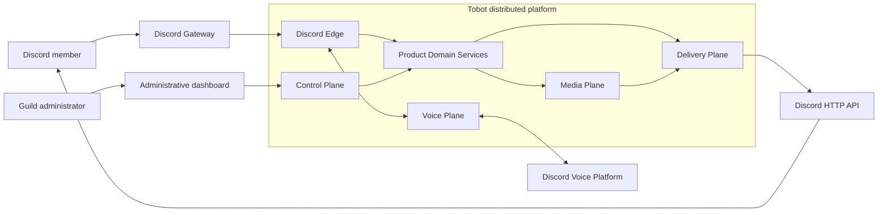

# Tobot Architecture — Foundations

[Architecture index](README.md) · [Next](02-service-topology.md)

## Document status

| Attribute | Value |
|---|---|
| Status | Normative architecture specification |
| Architecture model | Greenfield, distributed, event-driven microservices |
| Initial product scope | Discord communication platform, lifecycle messaging, manual messages, rich messages, scheduled messages, automatic replies, moderation, automatic moderation, activity logs, Discord audit access, retention cleanup, anti-raid detection, anti-nuke detection, recoverable guild containment, automatic role policies, self-service role panels, governed role-resource administration, engagement progression, starboards, giveaways, forms, temporary voice rooms, double-entry virtual currency, policy-driven income, catalog commerce, durable guild entitlements, recoverable virtual-currency games, support entry panels, ticket policy, durable support cases, private support resources, privacy-governed transcripts, provider-neutral external integrations, durable live-stream alerts, governed custom application commands, durable personal reminders, Discord user authentication, application installation health, provider-neutral commercial billing, platform entitlements and limits, AI Credit accounting, governed AI operations and characters, permanently free portable template packages, and declarative workflows |
| Deployment scope | Containers, orchestrators, virtual machines, and mixed environments |
| Technology policy | Vendor-neutral ports, portable protocols, replaceable infrastructure adapters |
| Language policy | This specification is written in English and defines behavior independently of implementation language |

This document defines the target architecture for a new implementation. It is not a migration plan, does not describe compatibility behavior, and does not preserve implementation constraints from any previous system.

Normative keywords **MUST**, **MUST NOT**, **SHOULD**, **SHOULD NOT**, and **MAY** express requirement strength.

## 1. Scope

The architecture covers eleven product domains and the platform capabilities required to operate them safely at Discord scale:

1. **Lifecycle Messaging**
   - Member join messages.
   - Member departure messages.
   - Member ban messages.
   - Server boost lifecycle messages.
   - Public-channel and direct-message destinations.
   - Text, rich-message, and generated-image presentations.

2. **Messages**
   - Immediate plain-text delivery.
   - Rich-message composition and reusable definitions.
   - Scheduled and recurring delivery.
   - Deterministic automatic replies.
   - Message edits, deletion, reactions, publication, and delivery status where enabled by policy.

3. **Moderation and Safety**
   - Moderator-initiated warnings, timeouts, kicks, bans, unbans, warning clearance, message purge, slowmode, channel lock, and channel unlock.
   - Immutable moderation cases with actor, target, reason, evidence references, action outcome, and correlation.
   - Native Discord Auto Moderation synchronization and bot-side policy evaluation with explicit ownership per rule.
   - Durable moderation incidents, escalation policies, exemptions, protected roles, and review workflows.
   - Event-driven activity history and optional Discord-channel log delivery.
   - Read-only, cursor-based access to Discord's native audit log without duplicating it as an unbounded local store.
   - Countdown deletion and scheduled retention sweeps with durable occurrences, partial-result accounting, and dry-run estimation.

4. **Security and Incident Containment**
   - Join-velocity and risky-account detection using replica-safe bounded windows.
   - Privileged destructive-action detection from Discord audit-log entry events.
   - Durable raid and anti-nuke incidents with aggregation, cooldowns, evidence, and review state.
   - Observe, quarantine, timeout, kick, ban, privileged-role removal, and guild-lockdown response plans with explicit capability gates.
   - Recoverable lockdown apply and restore workflows with per-resource snapshots and partial-state visibility.
   - Opt-in coordination with supported Discord-native incident controls, verification settings, membership-screening observations, and native Auto Moderation.
   - Reliable, deduplicated security alerts and operator previews that remain secondary to containment.

5. **Roles and Member Access**
   - Versioned automatic-role policies for human members, bots, screening-aware onboarding, delays, expiry, rejoin behavior, and optional invite-derived signals.
   - Self-service role panels projected through reactions, buttons, and select menus with transport-independent assignment semantics.
   - Durable, idempotent role-assignment intents with explicit desired state, typed outcomes, deadlines, and reconciliation.
   - Governed creation, update, deletion, and hierarchy management for Discord role resources.
   - Role and panel health reconciliation after external deletion, hierarchy changes, missed events, or partial publication.

6. **Community Experiences**
   - Text, voice, and admitted interaction XP with deterministic awards, durable balances, versioned progression, rewards, and leaderboards.
   - Starboard policies with unique-member contribution accounting, durable per-source aggregates, message projection, and bounded reconciliation.
   - Giveaway drafts, scheduling, eligibility, entry, immutable draws, rerolls, prize fulfillment references, and durable notifications.
   - Versioned form definitions, Discord-native submission sessions, durable responses, review workflows, exports, and independently tracked effects.
   - Join-to-create and existing-link voice-room policies with durable room ownership, resource sagas, access control, cleanup, and drift repair.

7. **Virtual Economy and Commerce**
   - Versioned tenant currency policy, wallet and bank accounts, double-entry postings, holds, transfers, explicit tax destinations, adjustments, and wealth projections.
   - Fixed claims, streaks, role salary plans, jobs, crimes, optional robbery, and activity-income requests expressed as policy-driven earning actions.
   - Versioned catalogs, categories, eligibility and purchase limits, finite stock, durable purchase orders, payment settlement, and independently fulfilled rewards.
   - Durable entitlements for roles, private channels, progression or economy boosts, manual fulfillment, expiry, revocation, and bounded reconciliation.
   - Durable casino sessions and wagers for admitted virtual-currency games, cryptographically secure outcomes, immutable settlement, recoverable interaction state, and responsible-play controls.

8. **Support and Ticketing**
   - Versioned ticket policy and templates with eligibility, staff authority, capacity, cooldown, routing, availability, messages, automation, transcript, and retention behavior.
   - Support entry panels projected through buttons or select menus with immutable option bindings, explicit bot ownership, and bounded repair.
   - Durable support cases with atomic capacity reservation, unique numbering, intake references, participant and staff state, claim, waiting, resolution, reopen, and append-only history.
   - Recoverable private-channel or admitted thread provisioning with policy-owned access, opening projections, lifecycle controls, cleanup, and external-drift reconciliation.
   - Privacy-governed transcript capture, generation, delivery, retention, completeness evidence, and aggregate support analytics.

9. **External Integrations and Stream Alerts**
   - Versioned guild-scoped alert definitions for live-stream transitions with canonical external identities, provider capability profiles, destination policy, presentation, mention policy, and lifecycle behavior.
   - Authenticated webhook or event-stream ingestion where supported, durable quota-aware observation scheduling where required, and polling reconciliation for every admitted provider.
   - Provider-neutral observations, live-session aggregates, transition deduplication, notification occurrences, delivery history, and explicit degraded or stale coverage.
   - Reconciled provider subscription resources, credential health, circuit breaking, tenant fairness, bounded test delivery, and operator-visible failure states.
   - Discord announcements, refreshes, offline notices, and owned cleanup as independent versioned projections through the shared delivery plane.

10. **Automation Commands and Personal Reminders**
   - Versioned guild-scoped custom application commands with typed arguments, deterministic policy, atomic cooldowns, sandboxed templates, immutable action plans, and interaction-safe execution.
   - One authoritative application-command registry that composes built-in and custom desired state before any Discord bulk overwrite or targeted mutation.
   - Durable one-shot and bounded recurring personal reminders with civil-time semantics, immutable occurrences, edit, reschedule, snooze, cancellation, delivery-route policy, and terminal history.
   - Explicit command-projection drift, invocation outcomes, reminder deadlines, retry, dead-letter, and reconciliation state.
   - Safe reuse of Message Catalog, Delivery, Asset, Discord Capability, Activity Log, and shared scheduling primitives without a general-purpose script engine.

11. **Platform Access, Commercial Products, AI, Templates, and Workflows**
   - Discord OAuth authentication with single-use authorization state, protected provider tokens, secure application sessions, revocation generations, and fresh server-side guild authorization.
   - Discord guild and user installation contexts, minimal module-derived permissions, provider-observed presence, application-command convergence, per-module capability health, degraded operation, and non-destructive repair.
   - Versioned plans, capacity and module add-ons, capacity tiers, bundles, perks, promotions, and one-time AI Credit packs expressed through a provider-neutral commercial catalog.
   - Provider-neutral checkout, subscriptions, invoices, refunds, disputes, tax evidence, grace periods, billing ownership, asynchronous event processing, and reconciliation.
   - Platform feature entitlements and effective limits kept separate from guild virtual-economy entitlements, XP levels, perks, and AI Credit balances.
   - Source-aware AI Credit lots, reservation, actual-usage settlement, release, refund, expiry, spending controls, and provider-cost abstraction.
   - Provider-neutral AI operations for text, images, processing, OCR, transcription, moderation, workflow actions, and disclosed AI characters with privacy, safety, concurrency, and cost controls.
   - A permanently free marketplace of reviewed, portable configuration templates with dependency and permission manifests, target preflight, durable installation, ownership-aware rollback, reputation, and abuse controls.
   - Versioned declarative workflows using canonical triggers, deterministic conditions, typed owner-service actions, finite execution graphs, durable partial outcomes, replay governance, and AI action charging only where used.

The following platform responsibilities are also in scope because the product modules cannot safely implement them independently:

- Discord Gateway sessions, intents, shards, reconnects, and resumes.
- Discord interactions and their acknowledgement deadlines.
- Discord HTTP transport and rate-limit coordination.
- Destination classification and effective-permission evaluation.
- Durable event ingestion, idempotency, retries, reconciliation, and dead-letter handling.
- Message validation, variable rendering, mention safety, assets, and image rendering.
- Moderation authorization, role hierarchy, action execution, evidence minimization, case correlation, and policy simulation.
- Security policy compilation, distributed detection windows, incident latching, reversible containment, and permission preflight.
- Role-policy compilation, member-role desired-state planning, panel projection, hierarchy safety, timed assignments, and role-resource conflict detection.
- Progression ledgers, contribution projections, contest draws, form workflows, temporary-room orchestration, and bounded community reconciliation.
- Double-entry monetary accounting, atomic balance holds, deterministic income settlement, stock reservation, purchase and entitlement sagas, durable game sessions, secure randomness, and bounded economy reconciliation.
- Support policy compilation, atomic ticket-capacity admission, case workflow, panel and private-resource projection, transcript privacy, support scheduling, and bounded reconciliation.
- External-provider identity resolution, authenticated event ingress, quota-aware observation, subscription reconciliation, durable live-session transitions, and alert projection recovery.
- Application-command schema composition, registry projection, sandboxed command execution, atomic invocation cooldowns, personal reminder scheduling, and bounded occurrence recovery.
- Account and session security, fresh guild authorization, Discord installation convergence, commercial catalog versioning, asynchronous billing reconciliation, platform-entitlement projection, AI usage accounting, protected AI execution, template installation, and bounded workflow orchestration.
- Service identity, authorization, secrets, observability, deployment, scaling, and recovery.
- A separate voice boundary so future audio functions do not contaminate the message delivery architecture.

## 2. Architectural goals

### 2.1 Primary quality attributes

| Quality | Requirement |
|---|---|
| Correctness | Duplicate events and retries MUST NOT create uncontrolled duplicate Discord effects. |
| Availability | Loss of one worker, replica, or zone MUST NOT lose accepted durable work. |
| Low latency | Gateway ingestion MUST remain independent of image rendering, database reporting, and Discord HTTP latency. |
| Scalability | Gateway, interaction, matching, scheduling, rendering, and delivery capacity MUST scale independently. |
| Maintainability | Product modules MUST depend on stable domain contracts, not Discord SDK types or infrastructure clients. |
| Portability | Infrastructure dependencies MUST be accessed through explicit ports and MUST have replaceable adapters. |
| Tenant isolation | Every guild-owned record, cache entry, event, asset, and delivery MUST carry an explicit tenant boundary. |
| Safety | Rate limits, invalid requests, permissions, mentions, remote media, and secrets MUST be centrally governed. |
| Explainability | Every production delivery MUST be traceable to an event or command, configuration revision, rendered definition, and attempt history. |
| Evolvability | New modules MUST be able to consume canonical events and emit actions without changing the Discord edge. |

### 2.2 Service objectives

Service-level objectives are operational targets, not Discord guarantees.

| Path | Target |
|---|---|
| Gateway event accepted into durable ingestion | p99 below 250 ms under normal load |
| Immediate interaction acknowledgement or defer | p99 below 1 second and always before Discord's 3-second deadline |
| Cached auto-reply decision | p99 below 100 ms before delivery queuing |
| Cached bot-side moderation decision | p99 below 75 ms before enforcement queuing |
| Cached anti-raid or anti-nuke decision | p99 below 75 ms before incident or containment queuing |
| Security event to durable incident decision | p99 below 250 ms under normal load |
| Lockdown request to first admitted containment mutation | p95 below 1 second when Discord transport capacity is available |
| Cached automatic-role planning | p99 below 75 ms before assignment-intent commit |
| Role component interaction acknowledgement or defer | p99 below 1 second and always before Discord's 3-second deadline |
| Accepted immediate role assignment to provider dispatch | p95 below 500 ms under normal load |
| Role panel publication accepted into durable workflow | p95 below 500 ms |
| Cached text XP eligibility and award decision | p99 below 75 ms before ledger commit |
| Starboard contribution accepted into durable aggregate | p99 below 250 ms |
| Giveaway or form component acknowledgement or defer | p99 below 1 second and always before Discord's 3-second deadline |
| Due giveaway transition claimed | p99 below 5 seconds of intended time under normal load |
| Voice-room create request durably claimed | p99 below 250 ms after eligible hub join |
| Cached economy authorization and policy decision | p99 below 75 ms before monetary command admission |
| Single-account ledger posting or hold decision | p95 below 100 ms under normal load |
| Two-party virtual-currency transfer settlement | p95 below 200 ms under normal load |
| Purchase payment and stock reservation | p95 below 250 ms under normal load |
| Casino component acknowledgement or defer | p99 below 1 second and always before Discord's 3-second deadline |
| Support panel or case-control acknowledgement or defer | p99 below 1 second and always before Discord's 3-second deadline |
| Eligible support-open request durably reserved | p95 below 250 ms before resource provisioning |
| Support resource provisioning admitted to governed transport | p95 below 500 ms after case reservation |
| Authenticated provider event accepted into durable ingress | p99 below 250 ms under normal load |
| Accepted live-start transition to durable alert occurrence | p99 below 250 ms after normalized observation |
| Poll-based provider observation claimed | p99 below 5 seconds of its provider-specific due time under normal load |
| Stream-alert occurrence admitted to Delivery | p95 below 500 ms after transition commit |
| Custom-command interaction acknowledgement or defer | p99 below 1 second and always before Discord's 3-second deadline |
| Accepted custom-command invocation to durable execution decision | p95 below 250 ms under normal load |
| Application-command projection accepted into durable workflow | p95 below 500 ms after definition publication |
| Due reminder occurrence claimed | p99 below 5 seconds of intended time under normal load |
| Claimed reminder occurrence admitted to Delivery | p95 below 500 ms under normal load |
| OAuth callback durably validated and session issued | p95 below 750 ms excluding Discord network latency |
| Cached session and entitlement validation | p99 below 50 ms under normal load |
| Installation callback accepted into durable verification | p95 below 500 ms |
| Authenticated payment-provider event accepted durably | p99 below 250 ms under normal load |
| Confirmed commercial transition to entitlement invalidation | p95 below 500 ms after normalized event commit |
| AI Credit reservation or rejection | p95 below 100 ms under normal load |
| AI operation admission before provider dispatch | p95 below 250 ms excluding provider latency |
| Cached workflow trigger match and durable admission | p99 below 100 ms under normal load |
| Cached AI character match and durable operation request | p99 below 100 ms before AI queueing |
| Manual moderation command acceptance | p95 below 500 ms before provider execution begins |
| Native Auto Moderation execution-event ingestion | p99 below 250 ms into durable incident processing |
| Non-rendered delivery dispatch after durable intent creation | p95 below 500 ms under normal load |
| Lifecycle image render | p95 below 2 seconds under normal load |
| Control-plane read API | p95 below 300 ms |
| Durable work recovery after worker loss | below 60 seconds |
| Delivery ledger retention | configurable, with a minimum operational window of 30 days |

No service may meet a latency objective by bypassing durability, authorization, mention safety, rate-limit coordination, or tenant isolation.

## 3. Architecture decisions

### 3.1 Distributed service architecture

The system uses independently deployable microservices organized around workload and consistency boundaries. It MUST NOT create one service for every user-facing screen. A service boundary is justified when it owns at least one of the following:

- An external protocol lifecycle.
- A distinct scaling profile.
- A distinct failure domain.
- A transactional data boundary.
- CPU-, memory-, or network-intensive work that must not affect Gateway health.

### 3.2 Governing patterns

The architecture combines:

- **Ports and Adapters** for Discord, persistence, queues, object storage, clocks, and identity.
- **Event-Driven Architecture** for asynchronous module collaboration.
- **Inbox and Transactional Outbox** for durable ingestion and publication.
- **CQRS without full event sourcing** for separate command and query responsibilities.
- **Process Managers** for bounded multi-event workflows such as departure/ban correlation.
- **Sagas with durable compensation state** for reversible, multi-resource security containment.
- **Double-Entry Ledger and Reservation Accounting** for virtual-currency movement, holds, settlement, reversal, and auditable balance projections.
- **Desired-State Reconciliation** for member roles, role panels, and provider-owned role resources.
- **Idempotent Consumers** for every at-least-once stream.
- **Bulkheads and Circuit Breakers** around Discord HTTP, remote assets, rendering, and storage.
- **Cell-Based Scaling** for very large deployments, partitioned deterministically by guild.

Full event sourcing is not required. Immutable domain events and delivery history are retained where operational replay or auditability is valuable, while current configuration remains in versioned relational models.

### 3.3 Delivery guarantee

The platform provides:

> At-least-once processing with effectively-once externally visible effects wherever the Discord endpoint permits deduplication and reconciliation.

The system MUST NOT claim universal exactly-once delivery. An external request can succeed while its response is lost. Channel message creation SHOULD use a stable Discord nonce and `enforce_nonce` when supported. The internal delivery ledger remains authoritative for attempts and reconciliation.

## 4. Requirements map

```mermaid
requirementDiagram
    functionalRequirement event_safety {
        id: FR001
        text: Every accepted event is durable and idempotently processed
        risk: high
        verifymethod: test
    }

    functionalRequirement delivery_safety {
        id: FR002
        text: Discord effects are rate limited permission checked and auditable
        risk: high
        verifymethod: test
    }

    performanceRequirement low_latency {
        id: PR001
        text: Gateway and interaction ingress remain isolated from slow workloads
        risk: high
        verifymethod: demonstration
    }

    designConstraint portability {
        id: DC001
        text: Infrastructure is accessed through vendor neutral ports
        risk: medium
        verifymethod: inspection
    }

    designConstraint tenant_isolation {
        id: DC002
        text: Guild data and operations are explicitly tenant scoped
        risk: high
        verifymethod: test
    }

    functionalRequirement moderation_authority {
        id: FR003
        text: Every moderation mutation is authorized hierarchy checked idempotent and case recorded
        risk: high
        verifymethod: test
    }

    functionalRequirement moderation_deduplication {
        id: FR004
        text: Native and bot side enforcement cannot punish one incident twice
        risk: high
        verifymethod: test
    }

    functionalRequirement security_containment {
        id: FR005
        text: Security incidents are replica safe deduplicated capability checked and recoverable
        risk: high
        verifymethod: test
    }

    functionalRequirement reversible_lockdown {
        id: FR006
        text: Lockdown preserves per resource state and exposes every partial apply or restore
        risk: high
        verifymethod: test
    }

    functionalRequirement role_assignment_safety {
        id: FR007
        text: Every role assignment is policy authorized hierarchy checked idempotent and observable
        risk: high
        verifymethod: test
    }

    functionalRequirement role_panel_convergence {
        id: FR008
        text: Role panels converge from one versioned aggregate and expose partial publication
        risk: high
        verifymethod: test
    }

    functionalRequirement role_resource_governance {
        id: FR009
        text: Role resource mutations use live preconditions immutable receipts and safe reconciliation
        risk: high
        verifymethod: test
    }

    functionalRequirement community_state_safety {
        id: FR010
        text: Community state transitions are durable idempotent authorized and independently projected
        risk: high
        verifymethod: test
    }

    functionalRequirement community_recovery {
        id: FR011
        text: Community messages roles schedules submissions and rooms expose partial state and bounded repair
        risk: high
        verifymethod: test
    }

    functionalRequirement economy_accounting_safety {
        id: FR012
        text: Every virtual currency mutation is balanced idempotent authorized and auditable
        risk: high
        verifymethod: test
    }

    functionalRequirement commerce_recovery {
        id: FR013
        text: Purchases entitlements and wagers expose durable partial state and bounded recovery
        risk: high
        verifymethod: test
    }

    functionalRequirement support_case_safety {
        id: FR014
        text: Every support case is authorized capacity reserved versioned and durably recoverable
        risk: high
        verifymethod: test
    }

    functionalRequirement support_projection_recovery {
        id: FR015
        text: Support panels channels access messages and transcripts expose partial state and bounded repair
        risk: high
        verifymethod: test
    }

    functionalRequirement integration_event_safety {
        id: FR016
        text: External observations are authenticated normalized deduplicated and durably transitioned
        risk: high
        verifymethod: test
    }

    functionalRequirement integration_projection_recovery {
        id: FR017
        text: Provider subscriptions polling health and Discord alerts expose partial state and bounded repair
        risk: high
        verifymethod: test
    }

    functionalRequirement automation_command_safety {
        id: FR018
        text: Custom commands are versioned policy checked sandboxed cooldown safe and durably projected
        risk: high
        verifymethod: test
    }

    functionalRequirement reminder_recovery {
        id: FR019
        text: Reminder occurrences are time correct idempotent cancellable and durably recoverable
        risk: high
        verifymethod: test
    }

    performanceRequirement safety_latency {
        id: PR002
        text: Bot side safety decisions use warmed bounded policy snapshots
        risk: high
        verifymethod: demonstration
    }

    element gateway_edge {
        type: microservice
    }

    element delivery_orchestrator {
        type: microservice
    }

    element service_ports {
        type: architecture boundary
    }

    element moderation_case_service {
        type: microservice
    }

    element auto_moderation_service {
        type: microservice
    }

    element security_incident_service {
        type: microservice
    }

    element containment_orchestrator {
        type: microservice
    }

    element role_assignment_service {
        type: microservice
    }

    element role_panel_service {
        type: microservice
    }

    element role_resource_service {
        type: microservice
    }

    element community_services {
        type: bounded contexts
    }

    element economy_services {
        type: bounded contexts
    }

    element support_services {
        type: bounded contexts
    }

    element integration_services {
        type: bounded contexts
    }

    element automation_services {
        type: bounded contexts
    }

    gateway_edge - satisfies -> event_safety
    gateway_edge - satisfies -> low_latency
    delivery_orchestrator - satisfies -> delivery_safety
    service_ports - satisfies -> portability
    event_safety - contains -> tenant_isolation
    moderation_case_service - satisfies -> moderation_authority
    auto_moderation_service - satisfies -> moderation_deduplication
    auto_moderation_service - satisfies -> safety_latency
    security_incident_service - satisfies -> security_containment
    containment_orchestrator - satisfies -> reversible_lockdown
    security_containment - contains -> delivery_safety
    role_assignment_service - satisfies -> role_assignment_safety
    role_panel_service - satisfies -> role_panel_convergence
    role_resource_service - satisfies -> role_resource_governance
    community_services - satisfies -> community_state_safety
    community_services - satisfies -> community_recovery
    economy_services - satisfies -> economy_accounting_safety
    economy_services - satisfies -> commerce_recovery
    support_services - satisfies -> support_case_safety
    support_services - satisfies -> support_projection_recovery
    integration_services - satisfies -> integration_event_safety
    integration_services - satisfies -> integration_projection_recovery
    automation_services - satisfies -> automation_command_safety
    automation_services - satisfies -> reminder_recovery
```

## 5. System context

