# Tobot Architecture — Service Topology

[Architecture index](README.md) · [Previous](01-foundations.md) · [Next](03-canonical-contracts.md)

## 6. Logical service topology

```mermaid
flowchart TB
    subgraph External[External systems]
        DG[Discord Gateway]
        DI[Discord interaction webhook]
        DH[Discord HTTP API]
        DV[Discord Voice Gateway and UDP]
        UI[Dashboard client]
        PX[External provider APIs]
        PE[External provider event transports]
        PP[Payment provider APIs and events]
        AI[AI provider APIs]
    end

    subgraph EdgePlane[Edge plane]
        GE[Gateway Edge Service]
        IE[Interaction Edge Service]
        AP[Control API Service]
    end

    subgraph EventPlane[Event plane]
        EB[(Durable Event Bus)]
        IN[(Inbox Stores)]
        OB[(Outbox Stores)]
    end

    subgraph DomainPlane[Domain plane]
        LC[Lifecycle Service]
        MC[Message Catalog Service]
        SC[Schedule Service]
        AR[Auto Reply Service]
        DC[Discord Capability Service]
        MOD[Moderation Case Service]
        AMP[Auto Moderation Policy Service]
        RET[Retention and Cleanup Service]
        ACT[Activity Log Service]
        AUD[Discord Audit Query Service]
        SEC[Security Policy and Incident Service]
        CON[Containment Orchestrator]
        RAS[Role Policy and Assignment Service]
        RPS[Role Panel Service]
        RRS[Role Resource Service]
        EPS[Engagement Progression Service]
        SBS[Starboard Service]
        GWS[Giveaway Service]
        FWS[Form Workflow Service]
        TRS[Temporary Room Service]
        MLS[Monetary Ledger Service]
        EIS[Earnings and Income Service]
        COS[Commerce Service]
        ETS[Entitlement Service]
        CGS[Casino Game Service]
        SPS[Support Policy Service]
        SPP[Support Panel Service]
        SCS[Support Case Service]
        SRO[Support Resource Orchestrator]
        SAS[Support Archive Service]
        IRS[Integration Registry Service]
        PES[Provider Event Edge Service]
        POS[Provider Observation Scheduler]
        PSO[Provider Subscription Orchestrator]
        ELS[External Live Signal Service]
        CCD[Custom Command Definition Service]
        ACR[Application Command Registry Service]
        CCR[Custom Command Runtime Service]
        REM[Reminder Service]
        IDS[Identity and Session Service]
        DIS[Discord Installation Service]
        CCS[Commercial Catalog Service]
        BOS[Billing Orchestrator Service]
        PLE[Platform Entitlement Service]
        AIL[AI Usage Ledger Service]
        AIX[AI Execution Service]
        TPR[Template Registry Service]
        WFR[Workflow Definition and Runtime Service]
        AIC[AI Character Service]
    end

    subgraph DeliveryPlane[Delivery plane]
        DO[Delivery Orchestrator]
        DT[Discord Transport Service]
        RS[Reconciliation Service]
    end

    subgraph MediaPlane[Media plane]
        AS[Asset Service]
        CR[Card Rendering Service]
        OS[(Object Storage)]
    end

    subgraph VoicePlane[Voice plane]
        VC[Voice Control Service]
        VM[Voice Media Workers]
    end

    subgraph Operations[Operations plane]
        QS[Query and Status Service]
        TL[Telemetry Pipeline]
        IAM[Service Identity and Policy]
    end

    DG <--> GE
    DI --> IE
    UI --> AP
    GE --> IN
    IE --> IN
    IN --> EB
    EB --> LC
    EB --> AR
    EB --> SC
    EB --> MOD
    EB --> AMP
    EB --> RET
    EB --> ACT
    EB --> SEC
    EB --> CON
    EB --> RAS
    EB --> RPS
    EB --> RRS
    EB --> EPS
    EB --> SBS
    EB --> GWS
    EB --> FWS
    EB --> TRS
    EB --> MLS
    EB --> EIS
    EB --> COS
    EB --> ETS
    EB --> CGS
    EB --> SPS
    EB --> SPP
    EB --> SCS
    EB --> SRO
    EB --> SAS
    EB --> IRS
    EB --> PES
    EB --> POS
    EB --> PSO
    EB --> ELS
    EB --> CCD
    EB --> ACR
    EB --> CCR
    EB --> REM
    EB --> IDS
    EB --> DIS
    EB --> CCS
    EB --> BOS
    EB --> PLE
    EB --> AIL
    EB --> AIX
    EB --> TPR
    EB --> WFR
    EB --> AIC
    AP --> LC
    AP --> MC
    AP --> SC
    AP --> AR
    AP --> MOD
    AP --> AMP
    AP --> RET
    AP --> ACT
    AP --> AUD
    AP --> SEC
    AP --> CON
    AP --> RAS
    AP --> RPS
    AP --> RRS
    AP --> EPS
    AP --> SBS
    AP --> GWS
    AP --> FWS
    AP --> TRS
    AP --> MLS
    AP --> EIS
    AP --> COS
    AP --> ETS
    AP --> CGS
    AP --> SPS
    AP --> SPP
    AP --> SCS
    AP --> SRO
    AP --> SAS
    AP --> IRS
    AP --> PSO
    AP --> ELS
    AP --> CCD
    AP --> ACR
    AP --> REM
    AP --> IDS
    AP --> DIS
    AP --> CCS
    AP --> BOS
    AP --> PLE
    AP --> AIL
    AP --> AIX
    AP --> TPR
    AP --> WFR
    AP --> AIC
    LC --> OB
    SC --> OB
    AR --> OB
    MC --> OB
    MOD --> OB
    AMP --> OB
    RET --> OB
    ACT --> OB
    SEC --> OB
    CON --> OB
    RAS --> OB
    RPS --> OB
    RRS --> OB
    EPS --> OB
    SBS --> OB
    GWS --> OB
    FWS --> OB
    TRS --> OB
    MLS --> OB
    EIS --> OB
    COS --> OB
    ETS --> OB
    CGS --> OB
    SPS --> OB
    SPP --> OB
    SCS --> OB
    SRO --> OB
    SAS --> OB
    IRS --> OB
    PES --> OB
    POS --> OB
    PSO --> OB
    ELS --> OB
    CCD --> OB
    ACR --> OB
    CCR --> OB
    REM --> OB
    IDS --> OB
    DIS --> OB
    CCS --> OB
    BOS --> OB
    PLE --> OB
    AIL --> OB
    AIX --> OB
    TPR --> OB
    WFR --> OB
    AIC --> OB
    OB --> EB
    EB --> DO
    DO --> DC
    DO --> AS
    DO --> CR
    DO --> DT
    AUD --> DT
    SEC --> MOD
    CON --> DC
    CON --> DT
    RAS --> DC
    RAS --> DT
    RPS --> DC
    RPS --> DO
    RRS --> DC
    RRS --> DT
    EPS --> RAS
    SBS --> DO
    GWS --> DO
    GWS --> RAS
    FWS --> DO
    FWS --> RAS
    FWS --> AS
    TRS --> DC
    TRS --> DT
    TRS --> DO
    EIS --> MLS
    COS --> MLS
    COS --> ETS
    CGS --> MLS
    ETS --> RAS
    ETS --> EPS
    ETS --> DC
    ETS --> DT
    ETS --> DO
    SPP --> SCS
    SPP --> DO
    SCS --> SPS
    SCS --> FWS
    SCS --> SRO
    SCS --> SAS
    SRO --> DC
    SRO --> DT
    SRO --> DO
    SAS --> AS
    SAS --> DO
    IRS --> PSO
    IRS --> POS
    PE --> PES
    PES --> ELS
    POS --> PX
    POS --> ELS
    PSO --> PX
    ELS --> DO
    ELS --> AS
    CCD --> ACR
    ACR --> DC
    ACR --> DT
    CCR --> CCD
    CCR --> DO
    REM --> SC
    REM --> DO
    IDS --> DH
    DIS --> DH
    DIS --> DC
    DIS --> ACR
    BOS --> CCS
    BOS <--> PP
    BOS --> PLE
    PLE --> AIL
    AIX --> PLE
    AIX --> AIL
    AIX <--> AI
    TPR --> PLE
    TPR --> DC
    TPR --> WFR
    WFR --> PLE
    WFR --> AIX
    WFR --> DO
    AIC --> PLE
    AIC --> AIX
    AIC --> DO
    DT --> DH
    DT --> RS
    AS <--> OS
    GE <--> VC
    VC <--> VM
    VM <--> DV
    QS --> UI
    IN --> QS
    DO --> QS
    TL -. observes .-> EdgePlane
    TL -. observes .-> DomainPlane
    TL -. observes .-> DeliveryPlane
    IAM -. authorizes .-> EdgePlane
    IAM -. authorizes .-> DomainPlane
    IAM -. authorizes .-> DeliveryPlane
```

## 7. Service catalog

### 7.1 Gateway Edge Service

**Purpose:** Own Discord Gateway WebSocket sessions and convert provider payloads into durable canonical envelopes.

**Responsibilities:**

- Obtain and cache the recommended Gateway endpoint and shard metadata.
- Own shard identity, session identity, heartbeat state, sequence state, reconnect, and resume.
- Respect identify concurrency and session start limits.
- Request only approved and necessary intents.
- Decode, validate, timestamp, and classify Gateway dispatch events.
- Attach application, shard, session, sequence, guild, and trace identifiers.
- Persist each accepted envelope to its inbox before publication.
- Publish canonical ingress events without executing product logic.
- Apply bounded queues and shed only explicitly disposable telemetry events.
- Expose health per shard, not only per process.

**Must not:**

- Render cards or templates.
- Read product configuration.
- Call Discord HTTP for product actions.
- Execute automatic reply matching.
- Hold the only copy of an accepted domain-relevant event in memory.

**Owned state:** Gateway session checkpoints, shard leases, ingress inbox, and short-retention raw envelopes.

**Scaling key:** Shard ID. A shard has exactly one active owner within a deployment cell.

### 7.2 Interaction Edge Service

**Purpose:** Receive Discord interactions and meet their strict acknowledgement deadline.

**Responsibilities:**

- Receive interactions through one configured mode: Gateway dispatch or outgoing webhook.
- Verify webhook request signatures when webhook ingestion is selected.
- Validate application identity, interaction type, installation context, and token lifetime.
- Return an immediate response when work is deterministic and fast.
- Return a deferred acknowledgement when work can exceed the response budget.
- Persist an interaction command with an idempotency key before asynchronous continuation.
- Route application commands, message commands, user commands, components, modals, and autocomplete.
- Ensure that ephemeral state is selected at the initial response when required.
- Prevent interaction tokens from entering logs, metrics, event payloads, or long-term storage.

**Owned state:** Short-lived interaction receipts, acknowledgement status, encrypted token material with expiry, and command outbox.

**Scaling key:** Interaction ID using stateless HTTP distribution. Gateway-delivered interactions follow shard ownership before durable routing.

### 7.3 Control API Service

**Purpose:** Provide the authenticated administrative command surface.

**Responsibilities:**

- Authenticate users and validate current guild membership and administrative authorization.
- Apply tenant-scoped authorization to every command and query.
- Validate request syntax and version preconditions.
- Issue commands to the owning domain service.
- Support optimistic concurrency using resource revision identifiers.
- Provide idempotency keys for mutating client requests.
- Enforce request size, rate, and upload boundaries.
- Never return secrets, raw Discord tokens, or internal event payloads.

**Owned state:** API idempotency receipts and short-lived session data only. Product configuration belongs to domain services.

### 7.4 Lifecycle Service

**Purpose:** Turn canonical member lifecycle events into policy decisions and delivery intents.

**Accepted events:**

- Member joined.
- Member removed.
- User banned.
- Member boost started.
- Member boost stopped.
- Guild boost state changed.

**Responsibilities:**

- Own lifecycle configuration and immutable configuration revisions.
- Filter bot accounts according to explicit guild policy.
- Correlate member removal and ban events using a bounded process manager.
- Build a typed lifecycle template context.
- Select message variants according to deterministic policy.
- Produce independent intents for public, direct-message, or multiple destinations.
- Record suppressed decisions and their reason.
- Pin every intent to a configuration and message-definition revision.
- Support server-rendered preview and marked test delivery through the production pipeline.

**Must not:**

- Construct provider-specific payloads.
- Fetch channels directly from Discord.
- Read asset bytes or render images.
- Retry Discord operations.

**Owned state:** Lifecycle configurations, revisions, correlation processes, processed-event inbox, and lifecycle outbox.

### 7.5 Message Catalog Service

**Purpose:** Own reusable, provider-neutral message definitions and their lifecycle.

**Responsibilities:**

- Store drafts and immutable published revisions.
- Validate the provider-neutral message vocabulary.
- Manage content, rich embeds, components, attachments, flags, polls, and mention policy.
- Store variable declarations and the contexts in which each variable is valid.
- Maintain references to assets without owning asset bytes.
- Provide preview inputs and normalized validation reports.
- Prevent mutation of a published revision.
- Produce immediate-send commands pinned to one definition revision.

**Owned state:** Message definitions, immutable revisions, validation reports, and asset references.

### 7.6 Schedule Service

**Purpose:** Convert scheduled-message civil-time definitions into durable delivery occurrences and provide an opaque portable wake-up capability for domain-owned timers.

**Responsibilities:**

- Own scheduled-message definitions, timezone, recurrence, activation, and misfire policy.
- Calculate the next occurrence using civil time and persist the intended UTC instant.
- Create one unique occurrence record per intended execution.
- Atomically claim due occurrences with a lease and fencing token.
- Pin each occurrence to a message-definition revision.
- Support one-shot, daily, weekly, monthly, annual, and bounded interval schedules.
- Apply one explicit misfire policy: skip, catch up once, or coalesce.
- Rebuild wake-up work from authoritative due records.
- Accept domain-owned wake-up registrations that contain only owner, occurrence, generation, and due instant; the caller retains business schedule and terminal-state authority.

**Must not:**

- Use an in-memory timer as the source of truth.
- Send to Discord directly.
- Recalculate historical occurrences after their definition revision is pinned.
- Interpret, mutate, cancel, or complete another domain's reminder, entitlement, support, or lifecycle semantics.

**Owned state:** Scheduled-message schedules and occurrences, leases, opaque cross-domain wake-up registrations, and scheduling outbox.

### 7.7 Auto Reply Service

**Purpose:** Match eligible Discord messages against deterministic guild rules and produce response intents.

**Responsibilities:**

- Apply cheap event gates before loading or matching rules.
- Maintain a compiled, versioned matcher snapshot per guild.
- Support exact, prefix, contains, and explicitly constrained regular-expression modes.
- Evaluate typed conditions for channel, category, role, user, mention, attachments, and message properties.
- Select a deterministic winner using explicit priority and documented tie-breaking.
- Reserve shared cooldowns atomically before producing a response.
- Support response pools with deterministic, random, weighted, sequential, or no-repeat policies.
- Prevent recursion from bot-authored, webhook-authored, or platform-delivered messages.
- Expose a diagnostic match operation that performs no delivery.

**Owned state:** Rules, immutable rule revisions, compiled-snapshot metadata, cooldown reservations, processed-event inbox, and response outbox.

**Hot-path requirement:** A healthy, warmed instance MUST NOT require a relational database query for each incoming message.

### 7.8 Discord Capability Service

**Purpose:** Resolve Discord resources and evaluate whether a requested delivery, moderation, or management operation is valid.

**Responsibilities:**

- Classify guild text channels, announcement channels, threads, forums, media channels, DMs, and voice-capable channels.
- Resolve parent relationships for threads and thread-only channels.
- Calculate effective bot permissions including role and member overwrites.
- Evaluate operation-specific permissions for send, reply, attach, embed, react, edit, delete, publish, and thread participation.
- Evaluate guild ownership, moderator capability, bot capability, target membership, owner protection, self-targeting rules, and role hierarchy for moderation actions.
- Evaluate protected-role policy separately from Discord's live hierarchy and report both decisions.
- Evaluate role existence, managed state, assignment eligibility, sensitive-permission class, bot hierarchy, member state, and operation-specific `MANAGE_ROLES` capability.
- Produce role-set fingerprints and hierarchy fingerprints for optimistic role-resource and member-assignment preconditions.
- Produce an immutable preflight report that identifies the exact missing permission or hierarchy failure and the resource snapshot used.
- Detect deleted, archived, locked, inaccessible, or incompatible destinations.
- Cache capability reports with bounded TTL and event-driven invalidation.
- Revalidate after relevant channel, role, member, or thread events.
- Correct cached state immediately after a Discord permission or unknown-resource response.

**Owned state:** Rebuildable guild, member, role, destination, overwrite, and capability projections. Discord remains authoritative.

### 7.9 Delivery Orchestrator

**Purpose:** Execute durable delivery intents as observable workflows.

**Responsibilities:**

- Create or accept a stable idempotency key.
- Claim work with a lease and fencing token.
- Load the immutable message and configuration revisions.
- Resolve typed variables and mention policy.
- Request destination capabilities.
- Resolve assets and rendering artifacts.
- Validate the final Discord payload before transport.
- Invoke the Discord Transport Service.
- Classify success, retryable failure, blocked state, permanent failure, or uncertain outcome.
- Schedule retries with exponential backoff, jitter, attempt ceilings, and deadlines.
- Trigger reconciliation for uncertain outcomes.
- Execute optional post-send actions independently from message creation.
- Persist all state transitions and provider identifiers.

**Owned state:** Delivery intents, attempts, leases, action results, failure classifications, and delivery outbox.

### 7.10 Discord Transport Service

**Purpose:** Be the only general-purpose egress path to the Discord HTTP API.

**Responsibilities:**

- Maintain reusable HTTP connections and provider authentication.
- Discover and coordinate per-route and global rate-limit buckets from response headers.
- Honor `Retry-After` exactly and never busy-retry a rate-limited request.
- Apply bounded global, route, guild, channel, and webhook concurrency.
- Generate stable request metadata and attach a supported nonce.
- Normalize Discord errors without leaking provider payloads as domain contracts.
- Stop traffic on invalid credentials.
- Track invalid requests and trip protective circuits before abuse thresholds are approached.
- Support message creation, interaction responses, follow-ups, edits, deletes, reactions, and publication through typed operations.
- Support typed role creation, modification, deletion, position changes, member-role add/remove, panel component updates, and reaction placement or removal.
- Reject arbitrary raw endpoint access from product services.

**Owned state:** Rate-limit bucket state, request receipts, transport health, and short-retention response metadata.

### 7.11 Reconciliation Service

**Purpose:** Resolve requests whose external effect is unknown.

**Responsibilities:**

- Consume uncertain delivery outcomes.
- Correlate provider message events and stable nonces when available.
- Confirm an existing effect before authorizing a retry.
- Mark outcomes that cannot be proven within a bounded window.
- Prevent infinite reconciliation loops.
- Expose operator-visible evidence and resolution state.

**Owned state:** Reconciliation cases, observations, decisions, and expiry.

### 7.12 Asset Service

**Purpose:** Own safe, tenant-scoped source assets and provider-neutral storage references.

**Responsibilities:**

- Issue bounded upload sessions.
- Validate declared and detected MIME type, size, dimensions, and supported format.
- Compute a content hash before finalization.
- Store objects behind an abstract object-storage port.
- Enforce guild ownership, quota, reference state, and retention.
- Fetch approved remote media through SSRF-safe resolution with redirect, DNS, IP, timeout, and byte limits.
- Provide short-lived authorized reads to rendering workers.
- Quarantine malformed or suspicious inputs.
- Garbage-collect unreferenced assets after a safety window.

**Owned state:** Asset metadata, ownership, object keys, hashes, lifecycle state, references, and upload sessions.

### 7.13 Card Rendering Service

**Purpose:** Convert a canonical visual design and bounded input assets into delivery artifacts.

**Responsibilities:**

- Validate design schema and supported design version.
- Load only authorized assets through the Asset Service.
- Apply deterministic fonts, coordinates, layout, compositing, and encoding.
- Enforce input dimensions, memory budget, CPU deadline, output dimensions, and output byte limit.
- Return content hash, MIME type, dimensions, byte size, and a short-lived artifact reference.
- Cache deterministic results by design revision and normalized context hash when policy permits.
- Run in a CPU and memory bulkhead separate from Gateway and interactions.

**Owned state:** Short-lived render artifacts, render receipts, and bounded cache metadata. Source assets remain owned by the Asset Service.

### 7.14 Query and Status Service

**Purpose:** Build read models for the administrative dashboard without coupling it to service databases.

**Responsibilities:**

- Consume public domain events.
- Build tenant-scoped projections for configuration status, delivery history, failures, schedules, and assets.
- Return stale-but-bounded status when a source service is unavailable.
- Display projection freshness and last processed event position.
- Never become authoritative for writes.

**Owned state:** Disposable and rebuildable read projections.

### 7.15 Voice Control Service

**Purpose:** Own guild voice session intent and coordinate the separate Discord Voice protocol.

**Responsibilities:**

- Accept explicit join, leave, move, mute, deaf, and playback commands.
- Correlate Gateway Voice State Update and Voice Server Update events.
- Assign a guild voice session to exactly one media worker.
- Manage session leases, fencing, reconnect, resume, and handoff.
- Never persist Discord voice server tokens beyond their valid operational lifetime.

### 7.16 Voice Media Workers

**Purpose:** Operate the voice WebSocket and UDP media plane.

**Responsibilities:**

- Maintain the supported Voice Gateway version.
- Perform IP discovery, encryption negotiation, heartbeats, RTP sequencing, and Opus framing.
- Support buffered resume when available.
- Enforce per-session CPU, memory, queue, and network budgets.
- Isolate codec or media failures from all text and interaction services.

Voice services are a separate bounded context. A text channel, voice channel, and voice media session MUST NOT share one generic channel implementation.

### 7.17 Moderation Case Service

**Purpose:** Be the single authority for requested moderation mutations and their immutable case history.

**Accepted commands:**

- Warn member.
- Clear active warnings through a compensating case; historical warnings remain auditable.
- Timeout or remove timeout.
- Kick member.
- Ban or unban user.
- Purge a bounded message selection.
- Set slowmode.
- Lock or unlock a channel through a reversible permission policy.
- Execute an escalation requested by the Auto Moderation Policy Service.
- Apply or remove a quarantine role requested by an authorized security response plan.
- Remove a bounded set of dangerous roles requested by an authorized anti-nuke incident, with per-role outcomes.

**Responsibilities:**

- Normalize dashboard, interaction, and internal enforcement commands into one `ModerationActionRequest` vocabulary.
- Authenticate the actor context supplied by the trusted edge and reauthorize the action at execution time.
- Request a fresh-enough capability report covering actor permissions, bot permissions, owner rules, target role hierarchy, protected-role policy, and channel capabilities.
- Reserve a semantic idempotency key before any provider mutation.
- Create an immutable case and append-only case events for requested, authorized, rejected, executing, applied, failed, and compensated outcomes.
- Execute exactly one typed mutation through the Discord Transport Service.
- Attach an audit-log reason to supported Discord mutations using a sanitized, bounded case reference and reason.
- Publish the applied outcome before requesting optional sanction DM or activity-log delivery.
- Record partial outcomes independently: provider action, DM notification, activity-log notification, and audit correlation.
- Support moderator notes as append-only records with author identity and revision history.
- Expose a case redaction workflow that minimizes sensitive evidence without rewriting action history.

**Critical-path rule:** The provider mutation is the primary effect. Sanction DMs, case-channel notifications, activity-log messages, and later audit correlation are durable secondary effects and MUST NOT delay or roll back the moderation action.

**Must not:**

- Trust UI authorization as sufficient execution authorization.
- Infer success from a Gateway event without a matching case correlation policy.
- Directly write Activity Log, Auto Moderation, Retention, or Discord Audit Query data.
- Retry an uncertain non-idempotent moderation effect without reconciliation.

**Owned state:** Moderation cases, append-only case events, warnings, notes, action idempotency receipts, protected-role policy references, and moderation outbox.

**Scaling key:** Guild ID. Commands for the same target SHOULD be serialized or guarded by target-version preconditions when their outcomes conflict.

### 7.18 Auto Moderation Policy Service

**Purpose:** Evaluate automatic safety policies, coordinate explicitly owned native Discord rules, and create durable incidents and enforcement requests.

**Responsibilities:**

- Own versioned automatic moderation policies, rule scopes, exemptions, actions, responses, cooldowns, and escalation definitions.
- Compile bot-side policies into immutable per-guild evaluation snapshots.
- Evaluate text, link, invite, capitalization, Unicode abuse, length, line, mention, burst, and repeated-content policies using bounded algorithms.
- Treat image or attachment analysis as a separate opt-in, metered policy with explicit retention and privacy controls.
- Declare each rule's enforcement owner as `discord_native`, `platform`, or `observe_only`.
- Synchronize only platform-managed native rules and preserve foreign Discord rules.
- Consume native Auto Moderation execution events and bot-side message events through separate adapters that converge on one incident identity.
- Deduplicate native execution, bot-side observation, warning creation, deletion, and escalation for the same semantic incident.
- Create an immutable incident before asynchronous sanctions, alerts, or evidence enrichment.
- Request sanctions from the Moderation Case Service; never execute member sanctions directly.
- Request message deletion through the Delivery Orchestrator as a typed moderation action when the platform owns enforcement.
- Support dry-run evaluation, rule simulation, false-positive review, and staged activation.
- Maintain distributed, bounded counters for spam and repeated-content policies.

**Native-first rule:** A supported Discord native rule SHOULD own pre-publication blocking when its semantics match the configured policy. The bot-side evaluator MUST NOT repeat a native-owned effect. Unsupported or richer policies remain platform-owned.

**Owned state:** Policy sets, immutable revisions, native-rule bindings, compiled-snapshot metadata, incidents, evidence references, counter reservations, review decisions, and policy outbox.

**Hot-path requirement:** A warmed message evaluation MUST use a local immutable policy snapshot and bounded shared counters; it MUST NOT synchronously query the relational configuration store or Discord HTTP API.

### 7.19 Retention and Cleanup Service

**Purpose:** Execute explicit message-retention policies without turning scheduled cleanup into an uncontrolled delete loop.

**Responsibilities:**

- Own versioned countdown and scheduled cleanup policies.
- Create a durable deletion intent for each countdown-eligible message using a unique guild/message/policy key.
- Create durable sweep occurrences with timezone, intended time, misfire policy, lease, and fencing token.
- Enumerate text channels, announcement channels, active eligible threads, forum posts, and media posts according to a declared scope.
- Exclude pinned messages and apply bounded filters before deletion.
- Separate messages eligible for Discord bulk deletion from messages requiring individual deletion.
- Limit pages, messages, duration, and provider requests per sweep.
- Persist page checkpoints, match counts, deleted counts, skipped counts, partial failures, and terminal reason.
- Support read-only dry runs that return an estimate, sample, uncertainty, and required permissions without deleting content.
- Publish deletion outcomes with a stable origin so Activity Log does not misattribute platform cleanup.
- Stop and block a policy after persistent permission or destination failure.

**Must not:**

- Treat an in-memory timer or registry as authoritative.
- Convert a failed page fetch into an empty successful page.
- Retry a deleted or inaccessible message indefinitely.
- Delete beyond the configured scope because a parent or thread relationship changed.

**Owned state:** Retention policies, revisions, countdown intents, sweep occurrences, page checkpoints, leases, deletion outcomes, and cleanup outbox.

### 7.20 Activity Log Service

**Purpose:** Build a normalized, searchable operational history from canonical Discord and platform events and optionally route human-readable notifications to Discord.

**Responsibilities:**

- Consume selected canonical Gateway events and platform outcome events.
- Apply versioned guild routing, event-enable, bot-ignore, role-ignore, channel-ignore, content-retention, and privacy policies.
- Create one normalized activity record per semantic event using an idempotency key.
- Preserve source truth: provider observation, platform command, native audit entry, Auto Moderation incident, and cleanup outcome remain distinguishable.
- Link related records using correlation and causation identifiers without merging their ownership or guarantees.
- Resolve executor attribution asynchronously from a case or Discord audit entry when evidence exists.
- Mark attribution confidence and MUST NOT present a guessed executor as fact.
- Create optional message-delivery intents using the shared Message Definition and Delivery Plane.
- Persist delivery status independently from the activity record.
- Support cursor pagination, indexed filters, retention, privacy redaction, and legal deletion workflows.
- Store message content, attachment references, and before/after values only when an explicit policy permits them.

**Owned state:** Activity configurations and revisions, normalized activity records, attribution links, redaction state, routing decisions, and activity outbox.

**Delivery rule:** Managed webhooks MAY be used through the Discord Transport Service when impersonation-style presentation is required. Webhook creation, rotation, rate limiting, and deletion are transport concerns; raw webhook tokens never enter Activity Log storage.

### 7.21 Discord Audit Query Service

**Purpose:** Provide permission-aware, cursor-based read access to Discord's native guild audit log and bounded correlation support.

**Responsibilities:**

- Authorize the requesting moderator and preflight the bot's `VIEW_AUDIT_LOG` capability.
- Fetch Discord audit pages through typed Transport operations.
- Preserve Discord cursors and expose a stable opaque application cursor.
- Normalize action labels, executor, target, reason, changes, referenced users, roles, channels, threads, integrations, webhooks, commands, scheduled events, and Auto Moderation rules.
- Return an explicit inaccessible, exhausted, partial, rate-limited, or provider-unavailable state.
- Cache only bounded pages and reference data for a short duration.
- Provide a bounded correlation lookup for moderation cases and activity records.
- Persist correlation references and hashes when needed, not an unbounded duplicate of Discord's native history.

**Owned state:** Short-lived audit-page cache, opaque cursor state, bounded correlation index, and query telemetry.

**Must not:**

- Present the native audit log as the platform's case ledger.
- Claim executor attribution when the matching window or evidence is ambiguous.
- Depend on audit-log availability for the success of a moderation mutation.

### 7.22 Security Policy and Incident Service

**Purpose:** Evaluate anti-raid and anti-nuke policies on a bounded low-latency path and own the resulting security incidents.

**Responsibilities:**

- Own versioned security policies, response plans, exemptions, thresholds, observation classes, quiet periods, cooldowns, and evidence-retention rules.
- Compile immutable per-guild policy snapshots and distribute them to evaluation workers.
- Consume canonical member-add, member-update, audit-log-entry, capability-change, and containment-outcome events.
- Atomically maintain raw-join, risky-join, and guild/executor/action sliding windows through a replaceable distributed-counter port.
- Evaluate owner, bot, user, role, account-age, membership-screening, action-type, and policy-scope exemptions without querying relational storage on the hot path.
- Reserve one semantic incident and one threshold crossing before requesting any external effect.
- Aggregate repeated observations into a durable incident latch instead of issuing one punishment and alert for every event above a threshold.
- Select a versioned response plan and emit typed moderation, quarantine, containment, native-control, or observe-only requests.
- Request member sanctions and dangerous-role removal from the Moderation Case Service so authorization, hierarchy, provider outcome, and case history remain centralized.
- Publish lifecycle and alert facts through its transactional outbox.
- Support dry-run simulation, policy preview, staged activation, incident review, false-positive classification, and bounded evidence redaction.

**Critical-path rule:** A warmed evaluator MUST use a local immutable policy snapshot plus bounded shared counter operations. It MUST NOT synchronously query the relational policy store, Discord HTTP API, Activity Log, or dashboard projection.

**Owned state:** Security policies and immutable revisions, compiled-snapshot metadata, distributed-window reservations, normalized security observations, incidents, threshold crossings, cooldowns, response-plan decisions, review state, evidence references, processed-event inbox, and security outbox.

**Scaling key:** Guild ID. Executor/action windows use a subordinate key but remain routed through the guild partition for deterministic policy ordering.

**Must not:**

- Mutate Discord directly.
- Treat a missing audit-log event as proof that no privileged action occurred.
- Promise access to Discord-managed CAPTCHA or raid-classification controls that are not exposed to the application.
- Reuse message-content Auto Moderation incidents as privileged-action incidents; they may be correlated but retain separate identities.

### 7.23 Containment Orchestrator

**Purpose:** Execute recoverable, explicitly ordered guild-wide containment and restoration workflows.

**Responsibilities:**

- Accept authorized manual requests and response-plan requests for lockdown, restoration, quarantine-role coordination, and supported Discord-native incident controls.
- Acquire one fenced guild containment lease and reject or join conflicting operations according to the requested transition.
- Request a fresh capability report before planning and immediately before each high-impact mutation whose authority may have changed.
- Produce a preview containing the selected policy revision, affected resources, required permissions, hierarchy blockers, alert readiness, native-control availability, and expected restoration behavior.
- Snapshot only the provider state that a step intends to change, including whether an overwrite existed and the relevant allow/deny values.
- Persist each resource step, precondition fingerprint, attempt, provider result, and compensation status before advancing the workflow.
- Apply bounded channel batches through typed Discord Transport operations while preserving unrelated overwrite bits.
- Use compare-and-set restoration semantics: restore only values still attributable to the active containment operation; surface conflicts rather than overwriting later administrator changes.
- Coordinate opt-in invite and direct-message pauses only through Discord's supported incident-actions operation and never beyond the provider-admitted duration.
- Treat verification-level changes as separate opt-in reversible steps and membership-screening state only as an observation unless Discord exposes a supported application operation.
- Resume safely after worker loss, preserve partial states, and require explicit operator acknowledgement when full restoration cannot be proven.
- Publish operation and step outcomes for Security Incident, Activity Log, Query and Status, and alert delivery.

**Owned state:** Containment operations, fenced leases, immutable plans, resource snapshots, step attempts, restoration conflicts, native-control receipts, acknowledgement records, and containment outbox.

**Must not:**

- Store Discord credentials or call provider endpoints outside the Discord Transport Service.
- Mark an operation inactive while any admitted restoration step remains failed, uncertain, or conflicted.
- Roll back unrelated administrator changes.
- Fan out an unbounded number of provider requests.
- Infer that a Discord-native incident control exists from guild configuration alone; capability and endpoint support must be confirmed.

### 7.24 Role Policy and Assignment Service

**Purpose:** Own automatic and self-service role policy, calculate member-role desired state, and execute observable idempotent assignments without coupling event handlers to Discord mutation.

**Responsibilities:**

- Own versioned automatic-role policies, assignment eligibility, source scopes, human/bot predicates, screening gates, delays, expiry, rejoin behavior, exclusions, cardinality constraints, and notification policy.
- Compile immutable per-guild policy snapshots for member-add and member-update evaluation.
- Accept self-service assignment commands only from a validated Role Panel identity and revision.
- Normalize all admitted work into a `RoleAssignmentIntent` with one member, one role, one desired state, one source, one policy revision, and one semantic idempotency key.
- Plan additions and removals from policy plus fresh-enough member and role capability state; planning performs no provider mutation.
- Persist assignment intent, attempts, current desired state, deadline, retry classification, and final outcome.
- Execute member-role add and remove through typed Discord Transport operations after execution-time capability revalidation.
- Serialize conflicting intents by guild, member, role, and policy group while allowing unrelated members to proceed concurrently.
- Support delayed and expiring roles through durable occurrences owned by the service.
- Support explicit sticky-role retention with bounded duration and privacy classification; never infer sticky behavior from an ordinary rejoin.
- Reconcile bounded member scopes after missed events or configuration changes by comparing only policy-owned desired roles with current Discord state.
- Consume active containment and security posture facts when a role policy explicitly pauses access-granting assignments during an incident; Security remains the incident authority.
- Publish assignment outcomes for Role Panel, Activity Log, Query and Status, and optional interaction follow-up delivery.

**Hot-path rule:** Member event evaluation uses a local immutable policy snapshot and rebuildable capability projection. It MUST NOT synchronously query relational configuration or mutate Discord inside the Gateway consumer.

**Owned state:** Role policies and immutable revisions, compiled-snapshot metadata, assignment intents, desired-state ownership, attempts, delayed and expiry occurrences, sticky-role records, reconciliation runs and checkpoints, processed-event inbox, and assignment outbox.

**Must not:**

- Assign `@everyone`, managed roles, roles at or above the platform bot, or roles denied by the sensitive-permission policy.
- Treat a successful interaction acknowledgement as a successful role mutation.
- Remove a role merely because another module assigned it; removal requires ownership or an explicit authorized override.
- Execute moderation sanctions, security quarantine, or dangerous-role removal; those remain Moderation Case responsibilities.
- Depend on invite attribution for the ordinary join path.

### 7.25 Role Panel Service

**Purpose:** Own self-service role panel definitions and converge their desired presentation across Discord messages, reactions, buttons, and select menus.

**Responsibilities:**

- Own one versioned panel aggregate containing tenant, destination, message ownership mode, presentation transport, content reference, mappings, action semantics, group constraints, notification policy, and publication state.
- Validate mappings against Role Capability reports and prohibit sensitive, managed, missing, or unassignable target roles.
- Represent behavior using activation action, deactivation action, and group cardinality rather than embedding product-specific mode names in event handlers.
- Issue compact versioned routing tokens that resolve server-side to panel, revision, action, and expected message; tokens expose no authority by themselves.
- Consume canonical reaction and component events, validate tenant, message, member, panel revision, and transport mapping, then submit typed commands to Role Policy and Assignment.
- Use the Delivery Orchestrator for managed-message creation and edits, components, attachments, and post-send reactions.
- Publish panels through a durable process manager that records every required provider effect and exposes publishing, published, degraded, orphaned, deleting, or deleted state.
- Reconcile desired content, components, reactions, message identity, and mapping health with bounded provider reads and repair attempts.
- Distinguish platform-managed messages from linked external messages and restrict edits or component attachment to provider-authorized ownership.
- Preserve orphan and tombstone history according to retention policy instead of silently deleting broken registry state.

**Owned state:** Panel definitions and immutable revisions, mapping identities, opaque routing tokens, publication operations, provider message bindings, effect receipts, health observations, repair attempts, tombstones, processed-event inbox, and panel outbox.

**Must not:**

- Assign or remove member roles directly.
- Store raw interaction tokens beyond their valid response workflow.
- Use two authoritative panel registries or dual-write competing representations.
- Report `Published` until all required presentation effects for the pinned revision are confirmed.
- Modify content or components on a linked message unless provider ownership and editability are confirmed.

### 7.26 Role Resource Service

**Purpose:** Govern administrative creation, modification, deletion, and hierarchy movement of Discord role resources while Discord remains authoritative for live role state.

**Responsibilities:**

- Accept tenant-scoped create, update, delete, and position commands with actor context, reason, idempotency key, expected role fingerprint, and deadline.
- Reauthorize the actor and request fresh bot permission, managed-role, role-hierarchy, role-count, and sensitive-permission capability immediately before mutation.
- Produce non-mutating previews for permission changes and hierarchy moves, including locked roles, affected positions, privilege deltas, and stale-state risks.
- Create an immutable mutation record and before snapshot before calling Discord.
- Execute one typed provider mutation or one explicitly bounded position operation through Discord Transport.
- Persist normalized provider response, after snapshot, uncertainty, reconciliation, audit correlation, and compensation eligibility.
- Treat create and delete as non-reversible identity changes; a recreated role is a new provider resource and never an automatic undo.
- Use compare-and-set semantics for safe corrective updates and hierarchy changes so concurrent administrator edits are rejected rather than overwritten.
- Consume canonical guild-role create, update, and delete events to invalidate capability projections and publish dependency-health facts to Role Panel, Role Assignment, Security, and Moderation.
- Maintain only a rebuildable role read projection plus immutable mutation history; Discord owns live name, colors, icon, permissions, position, managed state, and membership effects.

**Owned state:** Role-resource commands, mutation records, before and after snapshots, idempotency receipts, reconciliation cases, compensation records, short-lived role projection, processed-event inbox, and resource outbox.

**Must not:**

- Treat dashboard list state as an execution precondition.
- Modify managed roles, `@everyone` through ordinary role-resource operations, or roles at or above the platform bot.
- Blindly retry a role create, delete, or position operation after an uncertain outcome.
- Promise undo for deletion, role identity, or lost member assignments.
- Become a second source of truth for Discord role resources.

### 7.27 Engagement Progression Service

**Purpose:** Own deterministic community progression from admitted activity observations through XP ledger entries, level transitions, rewards, and leaderboard projections.

**Responsibilities:**

- Own versioned progression policies for text, voice, admitted reactions, manual adjustments, exclusions, cooldowns, multipliers, formulas, maximum level, reward mode, and announcement routing.
- Compile immutable per-guild eligibility and award snapshots for low-latency evaluation.
- Convert each eligible activity fact into one deterministic XP award command keyed by source event and policy revision.
- Persist an append-only XP ledger and update the member balance and level projection atomically.
- Derive random-range awards once from stable event identity or persist the sampled value with the ledger reservation so replay cannot change XP.
- Maintain distributed cooldown reservations for event sources and durable voice-activity sessions with segment checkpoints.
- Emit level-transition and reward facts only after the corresponding ledger entry commits.
- Request role rewards from Role Policy and Assignment using explicit ownership and reward-policy revision.
- Request level-up and leaderboard projections through Message Catalog and Delivery without coupling ledger success to Discord delivery.
- Build cursor-paginated lifetime and admitted period leaderboard read models; coalesce live Discord leaderboard refreshes by tenant and board revision.
- Support authorized adjustment, freeze, reset, and restoration workflows as compensating ledger entries rather than destructive balance rewrites.

**Owned state:** Progression policies and revisions, compiled snapshots, XP ledger, balance and level projections, cooldown reservations, voice sessions and segments, reward occurrences, leaderboard definitions and projections, adjustment records, inbox, and outbox.

**Hot-path rule:** Eligible message and voice-state evaluation MUST NOT synchronously query the relational policy store or Discord HTTP API. Balance mutation and ledger idempotency share one transaction.

**Must not:**

- Infer message quality or word count without an explicitly approved Message Content policy.
- Assign reward roles or send announcements directly.
- Recalculate historical ledger entries silently after a formula change.
- Award XP from duplicate, late-outside-policy, bot, ignored, or otherwise ineligible observations.

### 7.28 Starboard Service

**Purpose:** Maintain durable per-source-message contribution aggregates and project qualifying messages to one or more configured boards.

**Responsibilities:**

- Own versioned board policies for destinations, source scopes, emoji sets, thresholds, contributor eligibility, author behavior, bot behavior, payload mode, content-retention class, and projection lifecycle.
- Consume canonical reaction add, remove, remove-emoji, remove-all, source-message delete, and board-message delete events.
- Persist idempotent reaction contributions and derive unique eligible contributor count across configured emojis.
- Serialize one board/source aggregate across replicas using a lease, version, or partitioned compare-and-set update.
- Decide desired board state as absent or present with one immutable content/template revision.
- Request create, edit, or delete projection through Delivery and persist every provider binding and outcome independently from contribution state.
- Prevent destination loops and board-message self-ingestion by explicit source and origin rules.
- Mark content evidence unavailable when Message Content authorization does not permit source text, embeds, or attachments; support a metadata-and-link projection mode.
- Reconcile bounded active aggregates against provider reactions and board-message state, including orphan replacement and stale contribution repair.
- Expose cursor pagination, board health, contribution count, projection state, and bounded statistics.

**Owned state:** Board policies and revisions, source aggregates, reaction contributions, contributor projections, board bindings, projection receipts, reconciliation runs, tombstones, inbox, and outbox.

**Must not:**

- Fetch every reactor on every event when an idempotent contribution fact is sufficient.
- Store arbitrary source message content without explicit privacy and Message Content authorization.
- Create duplicate board messages for one board/source identity.
- Treat a missing board projection as loss of the source aggregate.

### 7.29 Giveaway Service

**Purpose:** Own fair, authorized, durable contest lifecycles from draft and publication through entry, immutable draw, notification, reroll, and cancellation.

**Responsibilities:**

- Own giveaway settings, manager policy, immutable giveaway revisions, eligibility rules, entry semantics, schedules, winner count, visibility, notification, and prize descriptors.
- Enforce backend authorization for every create, publish, start, end, cancel, reroll, and settings mutation.
- Use a strict optimistic state machine and durable timer occurrences for scheduled start and close.
- Validate entry eligibility at interaction time and atomically add, remove, or reject one tenant/member entry using the configured entry mode.
- Freeze a bounded immutable entrant eligibility snapshot before each draw.
- Select winners using a cryptographically secure draw under one unique draw identity, persist the result before any announcement, and preserve auditable non-predictive draw metadata.
- Model reroll as a new immutable draw that references prior draws and applies the declared prior-winner exclusion policy.
- Request message publication, status refresh, winner announcement, allowed role mention, and winner DMs as independently observable Delivery intents.
- Request admitted role or XP prizes from their owning services after winner commitment; prize failure never changes the draw result.
- Recover deleted or orphaned giveaway messages through explicit republish policy without resetting entries or draw history.

**Owned state:** Manager policies, giveaway aggregates and revisions, entries, eligibility decisions, timer occurrences, entrant snapshots, draws, winners, prize-fulfillment references, projection bindings, effect outcomes, inbox, and outbox.

**Must not:**

- Draw before the entrant snapshot and unique completion reservation commit.
- Allow UI visibility or a stored manager role to substitute for execution-time authorization.
- Expose raw randomness or a manipulable future seed before a draw.
- Imply that an external, monetary, or currency prize is fulfilled without a separately admitted owner and confirmed receipt.

### 7.30 Form Workflow Service

**Purpose:** Own versioned form definitions, Discord-native submission sessions, durable responses, review decisions, exports, and secondary effects.

**Responsibilities:**

- Own form drafts, immutable published versions, question schemas, eligibility, submission-frequency policy, reviewer and viewer policy, anonymity presentation, retention, and response workflow.
- Publish invitation messages through Delivery while pinning the exact form version addressed by each button.
- Open Discord modals or admitted interaction flows within provider response limits and bind every session to tenant, member, form version, and expiry.
- Revalidate eligibility and the pinned version when a submission is committed.
- Validate typed answers, required fields, length, choice membership, and file constraints; reject unknown or duplicate field identities.
- Persist the response and submission receipt before reception notification.
- Ingest ephemeral file attachments through Asset Service immediately, subject to scanning, byte/type limits, encrypted access, and form-specific expiry; never retain an expiring provider URL as durable evidence.
- Create reception messages, optional threads, mentions, and reactions as durable secondary projections.
- Apply review transitions through optimistic state checks and explicit reviewer authorization; preserve append-only review history.
- Request accepted or rejected role effects from Role Policy and Assignment and expose their result independently from the review decision.
- Produce authorized asynchronous exports with cursor-bounded reads, field redaction, and short-lived artifact access.

**Owned state:** Form drafts and versions, question definitions, publication bindings, submission sessions, responses, normalized answers, asset references, review events, effect references, export jobs and artifacts, inbox, and outbox.

**Must not:**

- Change the schema of a response after submission by editing the current draft.
- Claim true system anonymity when member identity is retained for eligibility, abuse prevention, or legal duties.
- Lose an accepted submission because Discord reception delivery failed.
- Assign roles, create threads, or send notifications directly.

### 7.31 Temporary Room Service

**Purpose:** Orchestrate temporary voice rooms and optional linked text access as recoverable Discord resource lifecycles without operating voice media.

**Responsibilities:**

- Own versioned generator and existing-link policies, room templates, category and hub references, capacity quotas, ownership rules, staff overrides, allowed actions, empty grace, linked-text policy, and reconciliation limits.
- Consume canonical voice-state, channel, role, member, and timer events.
- Reserve a unique room lifecycle before requesting any Discord channel creation.
- Execute voice-channel, linked-text-channel, member-move, permission-overwrite, invite, status, name, user-limit, and bitrate operations through Discord Capability and Transport.
- Persist an ordered creation or deletion saga with resource intents, provider identifiers, snapshots, attempts, compensation eligibility, and partial states.
- Serialize owner claim and transfer transitions with room version and membership preconditions.
- Maintain desired linked-text access from current voice membership through idempotent member overwrite operations.
- Use durable generation-token timers for empty-room cleanup so rejoin cancels only the intended deletion occurrence.
- Reconcile bounded room existence, membership, owner state, channel properties, owned overwrites, linked-text access, and orphan resources periodically and after recovery.
- Apply per-member, per-generator, per-guild, and global room admission quotas before provider creation.
- Publish room lifecycle and action facts for Query and Status, Activity Log, and optional Delivery notifications.

**Owned state:** Generator policies and revisions, room aggregates, owner history, creation and deletion operations, resource bindings, owned overwrite snapshots, member access projections, timer occurrences, action records, reconciliation runs, tombstones, inbox, and outbox.

**Boundary rule:** This service owns Discord guild channel resources and membership-driven access. Voice Control and Voice Media own only the bot's live Voice Gateway and UDP sessions. Temporary Room never opens a Voice Gateway connection or handles audio packets.

**Must not:**

- Create a provider channel before reserving the unique lifecycle key.
- Depend on a process-local empty timer or in-memory room owner as authority.
- Delete a configured hub or an existing-link channel as temporary cleanup.
- Replace unrelated administrator overwrites while applying lock, ghost, permit, reject, or linked-text access.
- Report deletion complete while any owned child resource remains failed or uncertain.

### 7.32 Monetary Ledger Service

**Purpose:** Own every unit of tenant virtual currency through balanced postings, holds, transfers, reversals, and rebuildable balance projections.

**Responsibilities:**

- Own versioned currency policy, currency identity, display metadata, wallet and bank account classes, starting grants, account ceilings, transfer rules, tax treatment, and monetary command authorization.
- Maintain an append-only double-entry journal with immutable transaction headers and balanced posting lines in one currency per transaction.
- Atomically create accounts, apply the one-time starting grant, post deposits and withdrawals between a member's wallet and bank, and settle two-member transfers.
- Represent tax as an explicit posting to a configured treasury, sink, or other declared ledger account; never make value disappear without a named monetary policy operation.
- Provide atomic authorization, available-balance validation, holds, capture, release, reversal, and idempotency receipts for Commerce, Earnings, and Casino Game services.
- Maintain current, pending, and available balance projections transactionally with journal posting.
- Apply non-negative, wallet and bank ceiling, frozen-account, currency-state, and transaction-limit invariants before commit.
- Support authorized append-only administrator adjustments, corrections through linked reversals, and bounded ledger queries.
- Publish committed monetary facts and projection invalidations through the local transactional outbox.
- Reconcile projections from journal checkpoints and prove journal balance independently from product workflows.

**Owned state:** Currency policies and revisions, accounts, account aliases, journal transactions, postings, monetary reservations and holds, balance projections, transfer records, adjustment records, idempotency receipts, reconciliation checkpoints, inbox, and outbox.

**Must not:**

- Mutate a balance without balanced journal postings in the same local transaction.
- Permit another service to write account, journal, hold, or balance tables.
- Use Discord message delivery as part of monetary commit success.
- Treat a display symbol, uploaded image, or localized currency name as currency identity.
- Represent real money, redeemable value, cryptocurrency, or cash-out without a separately approved regulated-money architecture.

### 7.33 Earnings and Income Service

**Purpose:** Decide policy-driven virtual-currency earnings and losses while delegating all monetary settlement to Monetary Ledger Service.

**Responsibilities:**

- Own immutable income-policy revisions for fixed claims, streaks, role salaries, jobs, crimes, optional robbery, and admitted activity income.
- Compile channel, role, member, command, stacking, formula, cooldown, schedule, ceiling, and abuse-control rules into bounded evaluation snapshots.
- Reserve one durable action occurrence before requesting a payout or fine.
- Produce deterministic payout or loss decisions whose random selections are committed once with the policy revision and source identity.
- Obtain current-enough role, membership, sanction, progression, and capability facts through typed projections rather than Discord SDK access.
- Request payout, fine, or two-member transfer settlement from Monetary Ledger Service using a semantic idempotency key.
- Use durable timer occurrences for scheduled salary distributions and paged, checkpointed recipient selection.
- Track monetary settlement and optional Delivery announcement independently from the income decision.
- Expose safe outcome explanations and next-available times without leaking internal anti-abuse signals.
- Publish anomaly facts for observation; punitive action remains owned by the safety domains.

**Owned state:** Income policies and revisions, action occurrences, cooldown reservations, streak state, salary schedules and occurrences, eligibility snapshots, random-decision receipts, settlement references, distribution checkpoints, abuse observations, inbox, and outbox.

**Must not:**

- Write balances or ledger postings directly.
- Use replica-local cooldown, streak, schedule, or random outcome as authority.
- Infer role membership from message content or stale interaction presentation.
- Implement robbery or crime mechanics that reach bank funds unless a published revision explicitly declares that risk and passes product safety review.

### 7.34 Commerce Service

**Purpose:** Own catalog, stock, eligibility, purchase limits, orders, payment coordination, and the commercial fulfillment process manager.

**Responsibilities:**

- Own catalogs, categories, immutable item revisions, prices, stock policy, visibility, availability windows, eligibility, per-member purchase limits, and ordered reward descriptors.
- Publish paged shop projections through Delivery or interaction responses without making Discord messages authoritative catalog state.
- Revalidate item revision, eligibility, purchase limits, stock, and current price at purchase admission.
- Atomically reserve finite stock, create a purchase order, and create one payment-reservation request reference under a unique purchase key.
- Coordinate Monetary Ledger hold, capture, release, and reversal through an explicit purchase state machine.
- Create one immutable entitlement request per reward only after payment capture policy permits fulfillment.
- Track automatic and manual reward outcomes independently and compute purchase state without hiding partial fulfillment.
- Restore stock only under the declared cancellation or refund transition and never more than once.
- Support bounded operator retry, cancellation, refund, and reconciliation commands with expected state versions.
- Publish order, payment, stock, fulfillment, refund, and reconciliation facts through a transactional outbox.

**Owned state:** Catalogs, categories, item drafts and revisions, stock buckets and reservations, eligibility rules, purchase counters, purchase orders, payment references, reward lines, fulfillment references, refund operations, interaction projection bindings, reconciliation state, inbox, and outbox.

**Must not:**

- Write monetary accounts or capture funds by database sharing.
- Assign roles, create channels, create boosts, or send staff tickets directly.
- Promise atomicity across payment and Discord rewards.
- Delete an order, payment reference, or failed reward to simplify visible state.

### 7.35 Entitlement Service

**Purpose:** Own the lifecycle and reconciliation of benefits granted by commerce independently from payment and catalog state.

**Responsibilities:**

- Accept idempotent entitlement requests for role membership, private text access, progression boost, economy boost, and manual fulfillment.
- Validate the declared owner, beneficiary, source purchase, reward revision, effect type, duration, stacking or replacement policy, and compensation contract.
- Delegate role relations to Role Policy and Assignment and publish boost state for the owning calculation domain.
- Orchestrate private-channel creation, access overwrites, optional companion messages, expiry, and deletion through Discord Capabilities, Discord Transport, and Delivery.
- Create a durable manual fulfillment case with instructions, authorized assignee policy, evidence receipt, deadline, and explicit completion state.
- Schedule unique expiry occurrences and preserve grant state until revocation or cleanup is confirmed.
- Reconcile uncertain create, assign, remove, and delete effects before retry.
- Reject compensation when the effect is externally modified, no longer owned, or unsafe to reverse; expose the conflict to Commerce.
- Keep entitlement outcome distinct from purchase, payment, and announcement outcome.
- Publish grant, activation, expiry, revocation, compensation, and conflict facts.

**Owned state:** Entitlement aggregates, grant revisions, external effect references, resource bindings, owned permission snapshots, boost grants, manual cases, expiry occurrences, attempts, compensation state, reconciliation checkpoints, inbox, and outbox.

**Must not:**

- Charge, refund, or mutate stock.
- Delete a Discord resource without durable proof that the entitlement created and still owns it.
- Represent a manual reward as fulfilled because its notification message was delivered.
- Grant a prohibited role, permission, multiplier, or duration that fails owning-domain policy.

### 7.36 Casino Game Service

**Purpose:** Own durable virtual-currency game sessions, verifiable random decisions, wager coordination, interaction state, and immutable settlement outcomes.

**Responsibilities:**

- Own immutable casino-policy and game-rule revisions, enabled games, wager bounds, payout tables, deck or wheel definitions, session timeout, cooldown, exposure limits, and responsible-play controls.
- Create a durable single-owner session before accepting a wager-bearing interaction.
- Request a Monetary Ledger hold before play becomes financially active and capture or release it exactly once during settlement or cancellation.
- Persist every player choice, state transition, random draw receipt, hand or round state, deadline, and optimistic session version required to resume safely.
- Use the secure-randomness capability without predictable fallback and record sufficient non-secret outcome evidence for audit.
- Support admitted coinflip, European roulette, weighted slots, and blackjack through separate versioned rule engines behind one session contract.
- Route every component by opaque session token and revalidate tenant, player, message binding, current turn, action, state version, and deadline.
- Resolve abandoned or expired sessions through the published safe-settlement rule; loss of a worker never invents a win or silently consumes a stake.
- Maintain durable game history and aggregate risk telemetry without using in-memory history as authoritative settlement state.
- Publish session, wager, outcome, settlement, cooldown, and recovery facts independently from Discord presentation.

**Owned state:** Casino policies and rule revisions, game sessions, actions, random receipts, cards or outcomes, wager references, settlement decisions, cooldowns, message bindings, recovery cases, risk counters, inbox, and outbox.

**Must not:**

- Write balances, journal entries, or holds directly.
- Keep the only recoverable game or wager state in memory.
- Re-roll after an outcome is committed because delivery or settlement confirmation failed.
- Offer real-money stakes, cash-out, purchasable chips, transferable external value, or wagering by minors without a separate legal and regulated-product specification.

### 7.37 Support Policy Service

**Purpose:** Own immutable ticket templates and tenant-wide support policy without owning Discord projections or live support cases.

**Responsibilities:**

- Own ticket policy, template drafts and revisions, type identity, staff and escalation authorization, opener permissions, eligibility, blacklist, whitelist, bypass, cooldown, capacity, routing, naming, availability, notification, automation, transcript, and retention rules.
- Separate staff access roles, notification roles, escalation roles, and administrative capabilities.
- Allow a template to override tenant defaults only for fields explicitly declared overridable.
- Reference optional immutable Form Workflow versions for pre-open intake without copying form schemas or answers.
- Validate category and overflow routing, channel or thread mode, provider limits, bot capability, role dependencies, message definitions, timers, and archive policy before publication.
- Compile active revisions into bounded evaluation snapshots and publish invalidations across cells.
- Apply optimistic concurrency to every settings or template mutation and retain append-only change facts.
- Expose dependency health and a deterministic effective-policy view for one template revision.
- Own stable support-number sequence policy while delegating number allocation to Support Case Service.

**Owned state:** Tenant support settings and revisions, ticket templates and revisions, type registry, authorization and eligibility policies, capacity definitions, cooldown definitions, schedule definitions, routing rules, message and form references, transcript and retention policies, dependency health, inbox, and outbox.

**Must not:**

- Count live cases or reserve member capacity.
- Publish panels, create channels, assign participants, or scrape messages.
- Treat configured staff roles as authorization for dashboard policy mutation.
- Embed mutable Discord SDK objects or provider payloads in policy revisions.

### 7.38 Support Panel Service

**Purpose:** Own support-entry presentation and its convergent Discord projection while delegating case admission to Support Case Service.

**Responsibilities:**

- Own panel drafts, immutable revisions, display name, enabled state, destination, presentation definition, component mode, ordered options, and template bindings.
- Support buttons and string-select presentation through one transport-independent option model.
- Validate option uniqueness, template health, labels, descriptions, emoji references, component layout, message definition, destination, schedule visibility, and current Discord limits.
- Publish, edit, disable, relocate, retire, duplicate, and repair a panel through durable Delivery effects.
- Bind each published message to one application identity, tenant, panel revision, channel, message, component fingerprint, and ownership mode.
- Resolve component interactions through an opaque token and revalidate signed tenant, message, panel, revision, option, member, and enabled state.
- Submit one idempotent open-case command to Support Case Service and return its durable status independently from panel projection.
- Detect message deletion, external edit, missing components, lost capability, stale template binding, and application-identity mismatch.
- Apply an explicit retire behavior: disable components, delete owned message, preserve tombstone, or abandon an external message binding.

**Owned state:** Panel drafts and revisions, option bindings, publication operations, Delivery effect references, provider message bindings, component routing tokens, schedules, health, tombstones, repair runs, inbox, and outbox.

**Must not:**

- Create a support case or allocate capacity by writing another service's data.
- Trust a component token for authorization or template contents.
- Edit or delete a message not proven to be owned by the configured application identity.
- Report a panel published while any required message or component effect remains partial or uncertain.

### 7.39 Support Case Service

**Purpose:** Own the authoritative support-case lifecycle, capacity admission, numbering, participants, staff workflow, deadlines, and history independently from Discord channels.

**Responsibilities:**

- Accept authorized open requests from active panel options, application commands, dashboard operators, and admitted internal workflows.
- Resolve and pin one immutable ticket-template revision before intake or capacity admission.
- Coordinate optional Form Workflow intake and retain only the form submission reference and allowed answer projection.
- Atomically reserve tenant, template, member, and other configured capacity; enforce cooldown and allocate one unique support number.
- Create one durable case and append its opening event before external resource provisioning begins.
- Own legal transitions for open, claimed, waiting, escalated, resolved, closed, reopening, cancelled, blocked, and recovery-required states.
- Authorize opener, participant, staff, assignee, escalation, and administrator commands using current policy and expected case version.
- Maintain participant roles, claim ownership, priority, tags, assignment queue, waiting reason, service-level deadlines, and automation occurrences.
- Request provisioning and access changes from Support Resource Orchestrator and archive or transcript actions from Support Archive Service.
- Release live-capacity reservations exactly once at the policy-defined terminal boundary; retain number and history forever within retention rules.
- Publish case facts for Activity Log, Query and Status, analytics, notification, and audit without exposing private content.

**Owned state:** Support cases, number allocations, capacity reservations, cooldowns, intake references, participants, assignments, claims, tags, priority, case events, deadlines, automation occurrences, resource and transcript references, reopen generations, inbox, and outbox.

**Must not:**

- Use Discord channel existence or message state as the authoritative case lifecycle.
- Create or delete provider resources directly.
- Copy complete form responses, transcript content, or interaction tokens into case events.
- Allow count-then-insert admission that can oversubscribe a configured cap.

### 7.40 Support Resource Orchestrator

**Purpose:** Provision and reconcile private Discord resources and access as a durable saga driven by Support Case desired state.

**Responsibilities:**

- Accept idempotent create, update-access, move-route, freeze, reopen, archive-presentation, and delete requests for one case generation.
- Preflight current category or parent, channel mode, bot permissions, staff roles, overwrite capacity, message definitions, and provider limits.
- Persist an ordered resource plan before channel, thread, overwrite, opening-message, control-message, pin, or log mutation.
- Create private text channels or separately admitted private-thread resources through Discord Transport with durable ownership markers and bindings.
- Compile opener, participant, staff, observer, and bot access into the smallest policy-owned overwrite or thread-membership set.
- Project opening, control, status, and lifecycle messages through Delivery; their outcome is independent from case state.
- Reconcile response loss, channel deletion, external edits, overwrite drift, route changes, missing messages, and partial cleanup.
- Delete only resources created and still owned by the case operation; categories, staff roles, and linked external messages are never cleanup targets.
- Preserve each effect attempt and report active, partial, blocked, orphaned, conflicted, or deleted state to Support Case Service.

**Owned state:** Resource operations, ordered steps, fenced leases, channel and thread bindings, application ownership, owned overwrite snapshots, participant access projections, message and log effect references, cleanup state, reconciliation checkpoints, tombstones, inbox, and outbox.

**Must not:**

- Decide support eligibility, staff authorization, capacity, claim ownership, or case state.
- Replace unrelated administrator permission bits or move externally owned resources silently.
- Retry uncertain channel or thread creation before bounded reconciliation.
- Mark cleanup complete while an owned required resource remains failed or uncertain.

### 7.41 Support Archive Service

**Purpose:** Own privacy-governed support conversation capture, transcript generation, export delivery, retention, completeness evidence, and aggregate support analytics.

**Responsibilities:**

- Consume canonical message create, update, delete, attachment, case participant, and case lifecycle facts for admitted support-resource bindings.
- Capture only policy-authorized content and metadata while Message Content capability is present; otherwise record an explicit completeness limitation.
- Keep transcript evidence separate from the operational case event stream and apply field-level privacy classes.
- Generate immutable, tenant-owned transcript artifacts in admitted formats through bounded rendering and Asset Service storage.
- Record source watermark, message gaps, edits, deletions, unavailable content, attachment status, participant identity policy, integrity digest, and generation policy.
- Deliver transcript references to authorized destinations or the opener through Delivery using short-lived access and independent outcomes.
- Enforce access, redaction, legal hold, retention, deletion, export quotas, and auditable reads.
- Publish privacy-safe aggregate metrics for demand, first staff response, resolution, reopen, queue, and satisfaction workflows.
- Never use transcript content as an automatic staff-performance judgment without a separately approved policy and review process.

**Owned state:** Capture policies and revisions, admitted message records, content and asset references, edit and deletion observations, capture gaps, transcript jobs and artifacts, delivery references, access audit, retention occurrences, satisfaction references, aggregate metric facts, inbox, and outbox.

**Must not:**

- Make ticket opening, claiming, closing, or resource cleanup depend on transcript generation success.
- Claim a complete transcript when Message Content, history, attachment, or event coverage was unavailable.
- Store Discord attachment URLs as durable archive objects.
- Provide unbounded channel scraping, permanent public transcript links, or cross-tenant search.

### 7.42 Integration Registry Service

**Responsibility:** Own the tenant-facing definition of every admitted stream alert and the stable mapping between a submitted provider locator and a canonical external identity.

**Core behavior:**

- Validate provider type, tenant entitlement, normalized locator, destination, message definition, mention policy, lifecycle policy, freshness objective, and enabled state.
- Resolve a handle or channel URL through the selected provider adapter at configuration time and persist a canonical provider identity independently from mutable handle and display metadata.
- Publish immutable alert-definition revisions; enabling, disabling, changing destination, changing provider identity, or changing lifecycle behavior creates a new revision.
- Maintain a versioned provider capability profile describing supported identity inputs, event transports, observation modes, metadata fields, freshness classes, credential modes, quota semantics, and lifecycle signals.
- Request Discord destination and mention capability preflight through Discord Capability Service without treating cached success as permanent authority.
- Expose paginated administration, dependency health, effective provider capability, delivery history references, and explicit stale or degraded status.
- Issue bounded test-notification occurrences that use synthetic labeled data and cannot mutate live-session state or production deduplication history.

**Owned state:** Integration definitions and immutable revisions, provider locator inputs after minimization, canonical identity bindings, presentation and lifecycle references, tenant limits, dependency health, test occurrences, inbox, and outbox.

**Must not:**

- Poll providers, receive provider webhooks, mutate provider subscription resources, or call Discord.
- Store provider credentials in integration rows or expose secret material through read models.
- Treat display handles, dashboard asset lists, destination visibility, or a successful historical preflight as current authorization.
- Generalize Stream Alerts into unbounded social-feed ingestion without a separately specified content domain.

### 7.43 Provider Event Edge Service

**Responsibility:** Terminate public provider callbacks or admitted event streams, authenticate transport messages, acknowledge within provider deadlines, and durably record normalized ingress receipts before asynchronous processing.

**Core behavior:**

- Route callbacks by opaque endpoint identity to a provider adapter and active subscription generation.
- Preserve the exact signed request bytes and required headers only for the bounded verification interval; verify signature, timestamp freshness, endpoint state, message type, and replay identity before payload parsing.
- Complete provider challenge or verification handshakes without activating a subscription until the owning orchestrator confirms the provider resource.
- Deduplicate at-least-once deliveries using the provider message identity and subscription generation; duplicates return the provider-required successful acknowledgement without repeating domain effects.
- Persist an authenticated ingress receipt and normalized provider event atomically before acknowledgement whenever the provider deadline permits; otherwise use an explicitly reviewed durable edge-acceptance mechanism with equivalent loss guarantees.
- Process revocation, reconnect, keepalive, migration, and unknown-version messages as typed lifecycle facts rather than live/offline observations.
- Apply per-endpoint body, header, clock-skew, connection, request-rate, and tenant-isolation bounds before durable admission.

**Owned state:** Callback endpoint generations, verification-secret references, provider ingress receipts, replay keys, bounded verification evidence, acknowledgement outcome, connection or keepalive state where applicable, inbox, and outbox.

**Must not:**

- Decide that a stream is live, create alert occurrences, render messages, or call Discord.
- Log raw secrets, signatures, full unbounded payloads, or credentials.
- Accept an event solely because its JSON shape is valid or its callback URL is known.
- Use one public endpoint secret across unrelated tenants or subscription generations.

### 7.44 Provider Observation Scheduler

**Responsibility:** Execute quota-aware, fenced, provider-specific observations for integrations that require polling or reconciliation.

**Core behavior:**

- Build due work from active alert definitions, provider capabilities, last conclusive observation, event-transport health, reconciliation cadence, quota budget, circuit state, and tenant fairness.
- Claim bounded work with expiring leases and fencing tokens; a superseded claimant cannot publish an observation.
- Resolve shared work by canonical external identity so many guild subscriptions to the same channel can use one provider observation where terms and credential scope permit.
- Batch, chunk, paginate, cache, and coalesce provider calls according to live provider metadata rather than fixed assumptions embedded in domain code.
- Separate identity-refresh cadence from live-state cadence and separate normal polling from event-transport reconciliation probes.
- Classify every call as conclusive live, conclusive offline, unchanged, rate limited, quota exhausted, unauthorized, forbidden, not found, transiently unavailable, invalid response, or inconclusive.
- Advance next-due time from provider response metadata, quota policy, adaptive jitter, error backoff, and configured freshness bounds.

**Owned state:** Observation schedules, due cursors, leases and fencing tokens, provider budget reservations, request batches, cache metadata, circuit state, attempts, normalized result references, inbox, and outbox.

**Must not:**

- Convert an error, timeout, missing page, truncated batch, or quota refusal into an offline fact.
- Deliver Discord messages or own tenant presentation policy.
- Let one guild, canonical identity, provider, or credential pool monopolize workers or upstream quota.
- Depend on process-local timers, leader identity, or in-memory in-flight sets as durable ownership.

### 7.45 Provider Subscription Orchestrator

**Responsibility:** Reconcile desired event subscriptions with provider-owned subscription resources and make their coverage, generation, credential scope, and revocation state explicit.

**Core behavior:**

- Translate active canonical identities and provider capability profiles into desired event-subscription resources.
- Create, verify, renew, rotate, migrate, disable, and delete provider subscriptions through provider adapters using durable operations and fenced leases.
- Persist provider resource identifiers, condition fingerprints, transport type, callback generation, secret generation reference, cost or quota class, expiry, and observed status.
- Treat provider challenge completion, resource creation, and domain activation as separate states that may converge asynchronously.
- Reconcile provider listings and revocation events with desired state; repair only when current ownership and credential scope are proven.
- Prefer one shared provider subscription for equivalent canonical identity and event type when provider terms and tenant-isolation policy allow safe fan-out.
- Fall back to a declared observation mode when event coverage is unavailable; it never silently advertises webhook-level freshness while polling.

**Owned state:** Desired subscription claims, provider subscription resources, condition and ownership fingerprints, callback and secret generations, operation steps, leases, attempts, revocations, reconciliation checkpoints, inbox, and outbox.

**Must not:**

- Own tenant alert presentation, live-session truth, provider credentials, or Discord effects.
- Blindly recreate a subscription after an uncertain create or delete outcome.
- Share tenant-authorized provider resources where authorization, privacy, billing, or provider terms require isolation.
- Claim healthy coverage from a successful create response without verified callback or connection health.

### 7.46 External Live Signal Service

**Responsibility:** Turn authenticated provider events and conclusive provider observations into durable provider-neutral live-session state and exactly one logical notification occurrence per configured transition.

**Core behavior:**

- Validate adapter version, canonical identity, source generation, observation classification, event time, received time, and source precedence before transition evaluation.
- Maintain one live-session aggregate per provider identity and provider session identifier while preserving event and observation provenance.
- Distinguish unknown, offline, live candidate, live confirmed, ending candidate, ended, stale, and conflicted states; provider failure never implies offline.
- Suppress duplicates by provider message identity, provider session identity, alert definition revision, transition class, and notification generation.
- Atomically commit the session transition, per-alert occurrence, delivery intent request, and outbox within the service boundary.
- Support configured live-start, bounded refresh, offline, and owned-cleanup policies as separate occurrence types with independent deadlines and outcomes.
- Coalesce refresh signals and prevent an older observation, delayed webhook, or losing lease from overwriting newer conclusive state.
- Expose health, latency, provenance, uncertainty, stale age, delivery references, and manual replay controls without permitting replay to invent a new provider transition.

**Owned state:** Canonical live-session aggregates, source cursors and watermarks, observation and event references, transition ledger, per-alert occurrences, refresh coalescing state, delivery references, lifecycle deadlines, reconciliation cases, inbox, and outbox.

**Must not:**

- Resolve provider identities, own provider subscriptions, poll upstream APIs, render provider-specific HTTP responses, or call Discord.
- Treat mutable display metadata as session identity.
- Reopen a terminal session from a stale observation without an explicit conflict-resolution rule.
- Mark a notification delivered from enqueue success; Delivery outcome is authoritative for the projection only.

### 7.47 Custom Command Definition Service

**Responsibility:** Own guild-scoped custom application-command definitions, immutable published revisions, argument schemas, execution policy, sandboxed response plans, and dependency health.

**Core behavior:**

- Validate names, localizations, descriptions, typed arguments, required/default/range behavior, access policy, cooldown policy, channel constraints, age-restricted context, destination policy, response actions, deletion policy, and tenant entitlement.
- Compile templates into a bounded allowlisted expression and token representation at publication; reject unknown variables, unsupported actions, recursive expansion, unbounded output, arbitrary code, arbitrary HTTP, and arbitrary command execution.
- Reference immutable Message Catalog definitions and Asset objects instead of storing raw provider payloads or filesystem media paths.
- Publish one desired command contribution for Application Command Registry Service; definition persistence never waits for Discord convergence.
- Maintain reserved-name conflicts, dependent role/channel/asset health, preview output, current projection reference, and active execution eligibility.
- Expose paginated drafts, active definitions, revisions, invocation summaries, and explicit projected, degraded, blocked, or retired status.

**Owned state:** Custom-command aggregates and revisions, argument and policy revisions, compiled template plans, response-action plans, dependency health, reserved-name decisions, entitlement reservations, preview receipts, inbox, and outbox.

**Must not:**

- Register Discord commands, receive raw interactions, own invocation cooldowns, deliver messages, or call Discord.
- Permit scripts, dynamic module loading, shell access, arbitrary network calls, loops, recursion, unbounded collections, or invocation of another bot command.
- Treat a visible Discord command, client-supplied argument schema, role selector, or cached dashboard asset as authority.

### 7.48 Application Command Registry Service

**Responsibility:** Own the complete desired and observed application-command registry for each application installation and converge built-in and custom contributions to Discord without destructive cross-module races.

**Core behavior:**

- Accept versioned command contributions from authorized built-in and custom owners through a common provider-neutral schema.
- Resolve name, type, localization, option, integration-context, installation-context, age restriction, and default-member-permission conflicts before projection.
- Build an immutable desired registry snapshot with contribution provenance and one monotonic projection generation.
- Choose targeted create, edit, delete, or complete bulk-overwrite plans according to the current Discord contract and change size.
- When bulk overwrite is used, include every admitted command type and owner in the snapshot; one product service can never overwrite another owner's commands.
- Persist intent before provider mutation, record provider command IDs and normalized schemas, and reconcile uncertain or partial outcomes before retry.
- Observe guild join, application identity change, provider command drift, and periodic reconciliation triggers without coupling them to configuration requests.

**Owned state:** Command-owner registry, desired contributions, immutable desired snapshots, conflict records, projection generations, provider command bindings, operations, attempts, leases, observed snapshots, drift cases, inbox, and outbox.

**Must not:**

- Own product execution policy, command response content, interaction routing, or tenant credentials.
- Perform independent bulk overwrite from multiple replicas or modules.
- Remove an unknown provider command until ownership, desired snapshot, application identity, and current operation prove it is eligible.
- Report a definition published merely because its database revision exists.

### 7.49 Custom Command Runtime Service

**Responsibility:** Resolve admitted custom-command interactions, authorize and rate-limit invocation, bind typed arguments, evaluate a frozen sandboxed plan, and create independently delivered response effects.

**Core behavior:**

- Resolve the provider command binding, tenant, definition revision, application identity, command name and type, interaction context, actor, and deadline.
- Acknowledge or defer through Interaction Edge before Discord's deadline; runtime completion remains independent from interaction-token lifetime.
- Evaluate current enabled state, entitlement, role, user, channel, age-restricted context, bot exclusion, and dynamic capability policy.
- Acquire atomic cooldown and concurrency reservations by tenant, definition, actor, and configured scope.
- Bind typed arguments only from the signed interaction option tree and enforce required, default, range, choice, target, and text-length policy.
- Evaluate the precompiled bounded template plan with immutable variable snapshots and independently invoke an ordered finite response-action plan.
- Record one invocation and one effect occurrence per action; partial secondary effects do not change the accepted policy decision.
- Publish Activity Log facts with bounded metadata and privacy classification.

**Owned state:** Invocation receipts, semantic idempotency keys, cooldown and concurrency reservations, argument snapshots, variable snapshots, evaluation receipts, action occurrences, interaction response references, execution summaries, inbox, and outbox.

**Must not:**

- Edit definitions, register Discord commands, execute arbitrary code, invoke arbitrary platform commands, perform raw HTTP, or call Discord directly.
- Use process-local maps as authoritative cooldown or concurrency state.
- Trust option values, role membership, channel visibility, command name, or template output without server-side validation.
- Hold an interaction handler open for slow asset, database, DM, or Discord delivery work.

### 7.50 Reminder Service

**Responsibility:** Own personal reminder policy, civil-time interpretation, reminder definitions, immutable delivery occurrences, recurrence, cancellation, reschedule, snooze, durable due claiming, and terminal history.

**Core behavior:**

- Parse relative, absolute, provider timestamp, and admitted recurring schedules through a versioned time contract with explicit timezone, locale, daylight-saving resolution, and bounds.
- Atomically enforce per-user, per-tenant, recurrence, text-size, horizon, and frequency limits when creating or expanding occurrences.
- Separate a reminder definition from its immutable occurrences so edit, reschedule, snooze, recurrence, cancellation, and history have precise semantics.
- Maintain earliest-due wake-up state plus periodic bounded reconciliation; use durable leases and fencing for claims.
- Freeze occurrence content, schedule revision, delivery-route policy, origin reference, mention policy, and deadline before execution.
- Request DM, origin-channel, configured-channel, or admitted fallback delivery through Delivery as distinct attempts with explicit privacy behavior.
- Preserve delivered, cancelled, missed, expired, failed, and dead-letter outcomes for bounded retention rather than deleting evidence.
- Expose member-owned and separately authorized staff views with pagination, filters, redaction, and audit.

**Owned state:** Tenant reminder settings, member timezone preferences where enabled, reminder definitions and revisions, recurrence rules, occurrences, claims and fencing tokens, cancellation and snooze receipts, delivery-route attempts, provider errors, terminal history, origin references, inbox, and outbox.

**Must not:**

- Reuse scheduled announcement definitions as personal reminders, expose private reminder text to staff without purpose and authority, or call Discord directly.
- Use process-local timers, leader identity, queue retry count, or current time alone as authoritative occurrence ownership.
- Delete a reminder merely because its delivery retry budget was exhausted.
- Send a channel fallback that reveals private content unless the frozen delivery policy explicitly permits it.

### 7.51 Identity and Session Service

**Responsibility:** Own platform accounts, Discord identity links, OAuth transaction state, authenticated sessions, session revocation, and short-lived guild-access observations.

**Core behavior:**

- Execute authorization-code login through a Discord identity adapter with single-use state, exact redirect binding, short-lived proof-key material where applicable, and server-side token exchange.
- Keep provider access and refresh tokens behind the secret-management boundary; issue only application sessions and scoped grants to clients.
- Treat guild lists and permission bitfields as discovery observations with explicit freshness, never as sufficient authorization for a sensitive mutation.
- Revalidate account status, session generation, current guild membership, required guild authority, and owning-service capability for every administrative or billing command.
- Revoke all affected sessions after logout, identity unlink, account suspension, credential compromise, ownership removal, or security-policy change.

**Owned state:** Platform accounts, external identity links, OAuth transactions, authorization sessions, grant generations, revocation records, guild-access observations, authentication audit, inbox, and outbox.

**Must not:**

- Own Discord application installation, bot presence, product entitlements, billing ownership, or product-module authorization policy.
- Expose provider tokens to browsers, logs, queues, or other product services.
- Infer channel-level authority from guild permission bits that exclude channel overwrites and implicit permission behavior.

### 7.52 Discord Installation Service

**Responsibility:** Own desired and observed Discord application installation state, installation generations, module permission manifests, bot-presence confirmation, and installation health.

**Core behavior:**

- Model guild and user installation contexts independently and select admitted scopes and permissions from a versioned module capability manifest.
- Generate single-use, actor-bound installation transactions and optional guild selection constraints without treating them as authorization proof.
- Confirm installation through provider-observed application or bot state and command-registry evidence; a redirect callback alone never marks an installation operational.
- Evaluate bot permissions, role hierarchy, channel visibility, application-command context, privileged-intent dependencies, and module-specific prerequisites as separate capability results.
- Preserve `Degraded` state when the application remains installed but one or more modules cannot operate, and produce a non-destructive repair or reinstall plan.
- Observe guild create, guild delete, application authorization changes, role changes, channel changes, and registry projections to converge health.

**Owned state:** Installation aggregates, generations, OAuth installation transactions, requested manifests, callback receipts, presence observations, capability results, health history, repair plans, inbox, and outbox.

**Must not:**

- Own user login, register commands independently, mutate roles or channels, purchase products, or call product services synchronously from provider callbacks.
- Request administrator permission by default, accumulate permissions for disabled modules, or report healthy from cached dashboard state.

### 7.53 Commercial Catalog Service

**Responsibility:** Own the provider-neutral catalog of plans, module add-ons, capacity add-ons, capacity tiers, bundles, perks, AI Credit packs, promotions, compatibility rules, and immutable commercial terms.

**Core behavior:**

- Publish immutable catalog revisions with stable product keys, regional availability, currency, price references, tax classification references, feature components, limit grants, perk grants, and AI Credit grants.
- Expand bundles into ordinary components so downstream services do not implement bundle-specific authorization.
- Validate that exactly one base plan applies to a commercial scope unless a published product model explicitly permits another composition.
- Keep XP levels and guild virtual currency outside the commercial catalog.
- Retire revisions prospectively while preserving the terms pinned by existing subscriptions and orders.

**Owned state:** Products, revisions, components, compatibility rules, price and tax references, regional availability, promotions, publication history, inbox, and outbox.

**Must not:**

- Call a payment provider, grant runtime entitlement, meter module usage, maintain AI balances, or alter existing subscription terms in place.

### 7.54 Billing Orchestrator Service

**Responsibility:** Own billing owners, commercial orders, provider-neutral subscriptions, checkout attempts, invoice references, payment-event normalization, refunds, disputes, grace periods, and provider reconciliation.

**Core behavior:**

- Create idempotent checkout attempts from a frozen commercial order and current billing-owner authority.
- Fulfill only from verified asynchronous payment-provider state; success or return pages are never fulfillment authority.
- Deduplicate provider events, preserve provider object versions and occurrence times, tolerate out-of-order delivery, and reconcile provider state periodically.
- Project subscription line state, paid one-time grants, refunds, disputes, cancellations, and grace boundaries to Platform Entitlement Service through versioned events.
- Support provider-hosted self-service billing where admitted while reauthorizing billing-owner scope before issuing a portal session.
- Record tax classification, collection, refund, invoice, and merchant-of-record evidence without deciding legal obligations.

**Owned state:** Billing owners and memberships, scope bindings, orders and lines, checkout attempts, payment-provider customers and object references, subscriptions and lines, normalized provider events, invoices, refunds, disputes, reconciliation cases, inbox, and outbox.

**Must not:**

- Store raw card data, trust browser completion, grant features directly, mutate AI Credit balances, share provider secrets, or couple domain contracts to one payment vendor.

### 7.55 Platform Entitlement Service

**Responsibility:** Convert commercial, promotional, compensation, and achievement grants into authoritative feature availability, effective capacity, perks, and immutable entitlement projections for a billing scope.

**Core behavior:**

- Evaluate plan, add-on, bundle-expanded, promotion, and manual compensation grants using frozen catalog revisions and explicit precedence.
- Calculate effective limits from compatible active grants while exposing the contributing sources and validity intervals.
- Apply upgrades at the admitted commercial effective time and schedule downgrades, cancellations, and grace expiry without deleting product data.
- Publish versioned, cacheable entitlement snapshots and targeted invalidations to module services.
- Require each module to enforce its own current usage atomically at admission; a stale entitlement cache cannot authorize creation beyond a hard limit.
- Keep non-quantitative perks separate from limits and AI Credit balances.

**Owned state:** Platform entitlements, feature grants, limit grants, perk grants, effective projections, generation history, invalidations, reconciliation cases, inbox, and outbox.

**Must not:**

- Own payment truth, module operational usage, guild virtual entitlements, XP levels, or AI Credit journal entries.

### 7.56 AI Usage Ledger Service

**Responsibility:** Own AI Credit accounts, source lots, grants, reservations, capture, release, refund, expiration, adjustments, and auditable balance projections.

**Core behavior:**

- Maintain append-only credit movements and source-aware lots with deterministic consumption order and frozen expiry or refund terms.
- Reserve an estimated rated cost before a billable AI operation and allocate that reservation across eligible lots atomically.
- Capture actual rated usage, release unused reservation, or refund according to a terminal operation receipt.
- Keep uncertain operations reserved until reconciliation or a published resolution deadline prevents double execution and double charging.
- Enforce per-operation, daily, monthly, account, guild, user, and character spending ceilings atomically.
- Reconcile journal totals, lot allocations, reservations, commercial grants, refunds, and expirations without fabricating balance corrections.

**Owned state:** AI Credit accounts, lots, journal entries, reservations, allocations, pricing-rule references, spending policies, balance projections, reconciliation cases, inbox, and outbox.

**Must not:**

- Execute AI provider calls, store prompts or generated content, act as general money, represent provider tokens, or share accounts with guild virtual currency.

### 7.57 AI Execution Service

**Responsibility:** Admit, route, moderate, execute, and reconcile provider-neutral AI operations after entitlement and AI Credit reservation.

**Core behavior:**

- Validate operation class, actor, tenant, purpose, input policy, privacy class, model class, latency deadline, entitlement, spending ceiling, and concurrency before dispatch.
- Pin an AI pricing revision and obtain an AI Credit reservation before contacting a provider.
- Route through replaceable provider adapters with credential isolation, egress control, safety policy, timeouts, circuit breakers, and bounded fallback.
- Normalize provider usage into a signed internal usage receipt used by AI Usage Ledger for settlement.
- Avoid automatic retry after an uncertain billable outcome unless provider identity or reconciliation proves the first attempt absent.
- Publish content references and result classifications without copying sensitive inputs into events or telemetry.

**Owned state:** AI operation aggregates, immutable input references, provider attempts, usage receipts, moderation decisions, result references, uncertainty cases, latency and quality summaries, inbox, and outbox.

**Must not:**

- Own commercial products, directly edit AI Credit balances, expose provider credentials, deliver Discord messages, or let a caller select unrestricted provider parameters.

### 7.58 Template Registry Service

**Responsibility:** Own portable configuration-template packages, immutable revisions, authorship, review, reputation, ratings, dependency manifests, installation plans, and safe compensation state.

**Core behavior:**

- Accept declarative module configurations and workflow definitions only through versioned portable schemas.
- Scan and review permissions, destructive capabilities, external references, secrets, content policy, dependency availability, and resource limits before publication.
- Preflight a pinned revision against the target tenant and request typed effects from each owning service through a durable installation process manager.
- Record provenance and before-state references for each effect; rollback removes only effects proven to be created or owned by that installation.
- Prevent duplicate, self-dealing, automated, or ineligible ratings and keep visibility ranking explainable.
- Enforce a permanently free marketplace boundary: templates have no price, purchase, subscription, revenue-share, payout, or paid-placement state.

**Owned state:** Template packages and revisions, components, manifests, author identity references, reviews, reports, ratings, reputation projections, installations, steps, rollback state, conflicts, inbox, and outbox.

**Must not:**

- Copy database rows, embed secrets, execute code, bypass owner-service validation, claim externally edited resources, pay authors with AI Credits, or delete target configuration by assumption.

### 7.59 Workflow Definition and Runtime Service

**Responsibility:** Own versioned declarative workflows, compiled finite graphs, canonical triggers, deterministic conditions, durable executions, typed action occurrences, rate limits, concurrency, and replay governance.

**Core behavior:**

- Compile event, schedule, authenticated webhook, command, and module triggers into bounded subscriptions with explicit tenant scope and recursion guards.
- Validate acyclicity after bounded expansion, unreachable nodes, unsupported dependencies, authorization, permission manifests, worst-case action count, and Discord effect budgets before publication.
- Freeze the workflow revision, trigger fact, policy facts, variable references, and action identities at execution admission.
- Invoke only allowlisted typed commands on owning services; each action occurrence is idempotent, independently retryable, deadline-bound, and observable.
- Enforce per-workflow, tenant, trigger, actor, destination, and downstream-service concurrency and rate limits with tenant fairness.
- Route AI actions through AI Execution and charge only those actions; ordinary workflow actions do not consume AI Credits.
- Preserve partial, failed, cancelled, compensated, and dead-letter state with controlled replay from a declared boundary.

**Owned state:** Workflow aggregates and revisions, compiled graphs, triggers, dependency health, execution aggregates, condition receipts, action occurrences, cooldown and concurrency reservations, replay authorizations, dead letters, inbox, and outbox.

**Must not:**

- Execute arbitrary code, perform raw HTTP except through an admitted integration action, write another service's database, call Discord directly, or use XP level to confer Discord administrative permission.

### 7.60 AI Character Service

**Responsibility:** Own tenant-scoped AI character profiles, immutable behavior revisions, channel and invocation policy, context boundaries, disclosure, cooldowns, spending policy, and response occurrences.

**Core behavior:**

- Validate identity presentation, behavior instructions, prohibited behavior, allowed channels, invocation modes, context sources, retention, moderation, model-class entitlement, and AI Credit budgets before publication.
- Match canonical messages or interactions through a compiled bounded policy without blocking Gateway ingestion.
- Build a protected, size-limited context reference isolated by tenant, character, channel, conversation, and revision.
- Request billable generation through AI Execution and submit admitted results to Delivery through an ordinary Message Definition and explicit presentation policy.
- Maintain per-character and per-actor atomic cooldowns, concurrency, daily and monthly spending ceilings, failure state, usage summaries, and privacy-governed conversation deletion.
- Reuse the same Discord application; optional webhook presentation is an application-owned delivery mechanism rather than a separate bot identity.

**Owned state:** Character aggregates and revisions, behavior and channel policies, context references, invocation decisions, cooldown and concurrency reservations, response occurrences, usage summaries, webhook presentation references, retention state, inbox, and outbox.

**Must not:**

- Hold provider credentials, edit AI Credit balances, call AI providers or Discord directly, impersonate members, share context across isolation boundaries, or retain unlimited conversation history.
