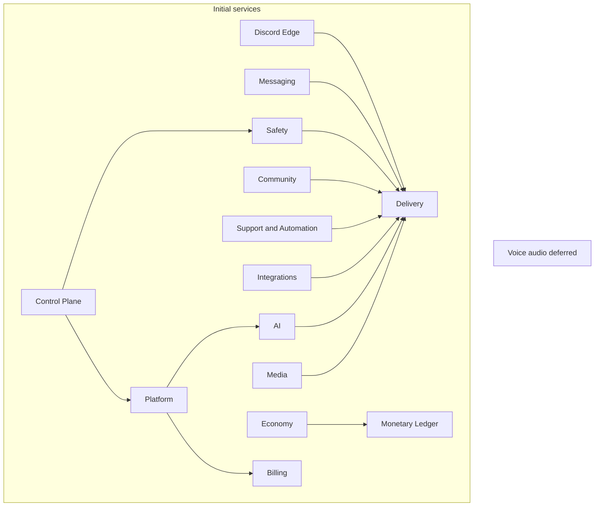

# Tobot Architecture — Service Topology

[Architecture index](README.md) · [Previous](01-foundations.md) · [Next](03-canonical-contracts.md)

## 6. Service and module topology

### 6.1 Module and service

A **module** owns aggregates, inbox, outbox, and invariants. A **service** is the deployable process that hosts one or more modules. Vocabulary and extraction tests: [01-foundations.md](01-foundations.md) §3.1 (DR-001).

Calls between modules that share a service MAY be in-process. Calls that cross a service boundary MUST use a declared inter-service protocol: durable facts after outbox, or command-HTTP with the §8.2 JSON envelope when an SLO requires immediate admit or reject (DR-041). Co-location does not waive ownership: modules MUST NOT share writable tables or bypass the owning module's authorization. Drawing an arrow in §6.3 never authorizes HTTP, shared SQL, or a second Discord client.

### 6.2 Initial services

These services are the launch topology. They exist to keep Gateway sessions, Discord HTTP, the dashboard, money, and provider credentials in separate failure domains under many guilds. They are not a backlog of later splits.

| Service | Modules | §3.1 reason at launch |
|---|---|---|
| Discord Edge | Gateway Edge, Interaction Edge | Discord Gateway and interaction protocols; isolate session and 3-second ACK health |
| Delivery | Discord Capability, Delivery Orchestrator, Discord Transport, Reconciliation | Discord HTTP rate-limit and uncertain-outcome domain |
| Control Plane | Control API, Query and Status, Identity and Session, Discord Installation | Dashboard and OAuth protocol; must not share fate with Gateway |
| Messaging | Lifecycle, Message Catalog, Schedule, Auto Reply | High-volume guild messaging and durable wake-ups |
| Safety | Moderation Case, Auto Moderation Policy, Retention and Cleanup, Activity Log, Discord Audit Query, Security Policy and Incident, Containment Orchestrator, Role Policy and Assignment, Role Panel, Role Resource | Shared Discord enforcement and role-mutation domain |
| Community | Engagement Progression, Starboard, Giveaway, Form Workflow, Temporary Room | Member-experience domain, including join-to-create voice **channels** (not bot audio) |
| Economy | Earnings and Income, Commerce, Entitlement, Casino Game | Guild-economy clients of the ledger |
| Monetary Ledger | Monetary Ledger | Transactional and security boundary for virtual currency |
| Support and Automation | Support Policy, Support Panel, Support Case, Support Resource Orchestrator, Support Archive, Custom Command Definition, Application Command Registry, Custom Command Runtime, Reminder | Ticketing plus command and reminder execution |
| Integrations | Integration Registry, Provider Event Edge, Provider Observation Scheduler, Provider Subscription Orchestrator, External Live Signal | External provider protocol and live signals |
| Platform | Commercial Catalog, Platform Entitlement, Template Registry, Workflow Definition and Runtime | SaaS configuration; not payment capture |
| Billing | Billing Orchestrator | Public payment callbacks; commercial money blast radius |
| AI | AI Usage Ledger, AI Execution, AI Character | Provider credentials and prepaid spend |
| Media | Asset, Card Rendering | CPU bulkhead for file storage and generated images (welcome cards, etc.) |
| Voice audio | Voice Control, Voice Media | Discord Voice Gateway and UDP so the **bot** can join, speak, or play audio. Distinct from Temporary Room. **Not deployed until a bot-audio product exists** |

Telemetry Pipeline and Service Identity and Policy remain operations infrastructure. They are not product modules in §7.



### 6.3 Module collaboration

The following diagram is a **logical collaboration** map. Boxes are modules from §7, not processes. Planes are reading groups. The host service for each module is §6.2.

Arrow meaning:

| Drawing | Meaning |
|---|---|
| Solid `-->` to External or Discord/payment/AI/object-storage | Real protocol edge |
| Solid into Inbox, Bus, or Outbox | Durable ingress, consume, or publish |
| Solid between modules of the **same** host service | In-process call; ownership still applies |
| Dashed `-.->` between modules of **different** host services | Inter-service fact (via outbox) or inter-service command (immediate admit/reject only) |
| `AP -. command .-> DomainPlane` | Control API admits a dashboard write, then commands the **host service** of the owning module. Not a synchronous HTTP mesh to every module process. Not the guild event bus. |

Query and Status is drawn in Operations for telemetry adjacency; its host service is Control Plane.

```mermaid
flowchart TB
    subgraph External[External systems]
        DG[Discord Gateway]
        DI[Discord interaction webhook]
        DH[Discord HTTP API]
        DV[Discord Voice Gateway and UDP]
        UI[Dashboard client]
        PX[External provider APIs]
        PE[External provider event transports]
        PP[Payment provider APIs and events]
        AI[AI provider APIs]
    end

    subgraph EdgePlane[Edge plane]
        GE[Gateway Edge Service]
        IE[Interaction Edge Service]
        AP[Control API Service]
    end

    subgraph EventPlane[Event plane]
        EB[(Durable Event Bus)]
        IN[(Inbox Stores)]
        OB[(Outbox Stores)]
    end

    subgraph DomainPlane[Domain plane]
        LC[Lifecycle Service]
        MC[Message Catalog Service]
        SC[Schedule Service]
        AR[Auto Reply Service]
        DC[Discord Capability Service]
        MOD[Moderation Case Service]
        AMP[Auto Moderation Policy Service]
        RET[Retention and Cleanup Service]
        ACT[Activity Log Service]
        AUD[Discord Audit Query Service]
        SEC[Security Policy and Incident Service]
        CON[Containment Orchestrator]
        RAS[Role Policy and Assignment Service]
        RPS[Role Panel Service]
        RRS[Role Resource Service]
        EPS[Engagement Progression Service]
        SBS[Starboard Service]
        GWS[Giveaway Service]
        FWS[Form Workflow Service]
        TRS[Temporary Room Service]
        MLS[Monetary Ledger Service]
        EIS[Earnings and Income Service]
        COS[Commerce Service]
        ETS[Entitlement Service]
        CGS[Casino Game Service]
        SPS[Support Policy Service]
        SPP[Support Panel Service]
        SCS[Support Case Service]
        SRO[Support Resource Orchestrator]
        SAS[Support Archive Service]
        IRS[Integration Registry Service]
        PES[Provider Event Edge Service]
        POS[Provider Observation Scheduler]
        PSO[Provider Subscription Orchestrator]
        ELS[External Live Signal Service]
        CCD[Custom Command Definition Service]
        ACR[Application Command Registry Service]
        CCR[Custom Command Runtime Service]
        REM[Reminder Service]
        IDS[Identity and Session Service]
        DIS[Discord Installation Service]
        CCS[Commercial Catalog Service]
        BOS[Billing Orchestrator Service]
        PLE[Platform Entitlement Service]
        AIL[AI Usage Ledger Service]
        AIX[AI Execution Service]
        TPR[Template Registry Service]
        WFR[Workflow Definition and Runtime Service]
        AIC[AI Character Service]
    end

    subgraph DeliveryPlane[Delivery plane]
        DO[Delivery Orchestrator]
        DT[Discord Transport Service]
        RS[Reconciliation Service]
    end

    subgraph MediaPlane[Media plane]
        AS[Asset Service]
        CR[Card Rendering Service]
        OS[(Object Storage)]
    end

    subgraph VoicePlane[Voice plane]
        VC[Voice Control Service]
        VM[Voice Media Workers]
    end

    subgraph Operations[Operations plane]
        QS[Query and Status Service]
        TL[Telemetry Pipeline]
        IAM[Service Identity and Policy]
    end

    DG <--> GE
    DI --> IE
    UI --> AP
    GE --> IN
    IE --> IN
    IN --> EB
    EB --> LC
    EB --> AR
    EB --> SC
    EB --> MOD
    EB --> AMP
    EB --> RET
    EB --> ACT
    EB --> SEC
    EB --> CON
    EB --> RAS
    EB --> RPS
    EB --> RRS
    EB --> EPS
    EB --> SBS
    EB --> GWS
    EB --> FWS
    EB --> TRS
    EB --> MLS
    EB --> EIS
    EB --> COS
    EB --> ETS
    EB --> CGS
    EB --> SPS
    EB --> SPP
    EB --> SCS
    EB --> SRO
    EB --> SAS
    EB --> IRS
    EB --> PES
    EB --> POS
    EB --> PSO
    EB --> ELS
    EB --> CCD
    EB --> ACR
    EB --> CCR
    EB --> REM
    EB --> IDS
    EB --> DIS
    EB --> CCS
    EB --> BOS
    EB --> PLE
    EB --> AIL
    EB --> AIX
    EB --> TPR
    EB --> WFR
    EB --> AIC
    AP --> IDS
    AP --> DIS
    AP --> QS
    AP -. command .-> DomainPlane
    LC --> OB
    SC --> OB
    AR --> OB
    MC --> OB
    MOD --> OB
    AMP --> OB
    RET --> OB
    ACT --> OB
    SEC --> OB
    CON --> OB
    RAS --> OB
    RPS --> OB
    RRS --> OB
    EPS --> OB
    SBS --> OB
    GWS --> OB
    FWS --> OB
    TRS --> OB
    MLS --> OB
    EIS --> OB
    COS --> OB
    ETS --> OB
    CGS --> OB
    SPS --> OB
    SPP --> OB
    SCS --> OB
    SRO --> OB
    SAS --> OB
    IRS --> OB
    PES --> OB
    POS --> OB
    PSO --> OB
    ELS --> OB
    CCD --> OB
    ACR --> OB
    CCR --> OB
    REM --> OB
    IDS --> OB
    DIS --> OB
    CCS --> OB
    BOS --> OB
    PLE --> OB
    AIL --> OB
    AIX --> OB
    TPR --> OB
    WFR --> OB
    AIC --> OB
    OB --> EB
    EB --> DO
    DO --> DC
    DO -.-> AS
    DO -.-> CR
    DO --> DT
    AUD -.-> DT
    SEC --> MOD
    CON -.-> DC
    CON -.-> DT
    RAS -.-> DC
    RAS -.-> DT
    RPS -.-> DC
    RPS -.-> DO
    RRS -.-> DC
    RRS -.-> DT
    EPS -.-> RAS
    SBS -.-> DO
    GWS -.-> DO
    GWS -.-> RAS
    FWS -.-> DO
    FWS -.-> RAS
    FWS -.-> AS
    TRS -.-> DC
    TRS -.-> DT
    TRS -.-> DO
    EIS -.-> MLS
    COS -.-> MLS
    COS --> ETS
    CGS -.-> MLS
    ETS -.-> RAS
    ETS -.-> EPS
    ETS -.-> DC
    ETS -.-> DT
    ETS -.-> DO
    SPP --> SCS
    SPP -.-> DO
    SCS --> SPS
    SCS -.-> FWS
    SCS --> SRO
    SCS --> SAS
    SRO -.-> DC
    SRO -.-> DT
    SRO -.-> DO
    SAS -.-> AS
    SAS -.-> DO
    IRS --> PSO
    IRS --> POS
    PE --> PES
    PES --> ELS
    POS --> PX
    POS --> ELS
    PSO --> PX
    ELS -.-> DO
    ELS -.-> AS
    CCD --> ACR
    ACR -.-> DC
    ACR -.-> DT
    CCR --> CCD
    CCR -.-> DO
    REM -.-> SC
    REM -.-> DO
    IDS -.-> DT
    DIS -.-> DT
    DIS -.-> DC
    DIS -.-> ACR
    BOS -.-> CCS
    BOS <--> PP
    BOS -.-> PLE
    PLE -. grant-source .-> AIL
    AIX -.-> PLE
    AIX --> AIL
    AIX <--> AI
    TPR --> PLE
    TPR -.-> DC
    TPR --> WFR
    WFR --> PLE
    WFR -.-> AIX
    WFR -.-> DO
    AIC -.-> PLE
    AIC --> AIX
    AIC -.-> DO
    DT --> DH
    DT --> RS
    AS <--> OS
    GE <-.-> VC
    VC <--> VM
    VM <--> DV
    QS --> UI
    IN --> QS
    DO -.-> QS
    TL -. observes .-> EdgePlane
    TL -. observes .-> DomainPlane
    TL -. observes .-> DeliveryPlane
    IAM -. authorizes .-> EdgePlane
    IAM -. authorizes .-> DomainPlane
    IAM -. authorizes .-> DeliveryPlane
```

### 6.4 Inter-service communication

This section is the protocol reading of §6.3. It does not add modules.

| Class | When to use | Must not |
|---|---|---|
| In-process | Modules that share a host service in §6.2 | Shared writable tables; bypassing the owner |
| Outbox then bus | Default for facts that cross a service | Using the guild bus as a dashboard command bus; a foreign service reading the owner's outbox tables; treating Redis Pub/Sub as the bus |
| Inter-service command | Immediate admit or reject required by an SLO: Control API admission, Monetary Ledger, AI Usage Ledger reserve, Transport typed operation, Capability preflight, interaction ACK | A command mesh from Control API to every module process; gRPC-first; holding the RPC open until a Discord effect; putting dashboard writes on the guild event bus |
| External protocol | Discord Gateway, Discord HTTP via Transport, Voice, dashboard HTTP, payment, AI provider, object storage | Product modules opening those sockets |

Control API authenticates and admits the dashboard request, then commands the host service of the owning module. If that module is in Control Plane, the call MAY be in-process. Otherwise the first-product adapter is command-HTTP carrying the §8.2 JSON envelope to that host, not to every module process. After admission the owner publishes facts on the bus. The RPC MUST NOT wait for a Discord effect. A durable command envelope MAY be used for fire-and-forget admin jobs that do not need an HTTP status on that request; it MUST NOT use the guild event bus. gRPC is not the first-product command adapter (DR-041).

Cross-service facts commit to the owner's outbox in the same transaction as the aggregate. A dispatcher then publishes to the Durable Event Bus. The first bus adapter is Redis Streams. Envelope bytes are versioned JSON (DR-040). Live readers accept majors N and N-1 (DR-048). Intra-service claiming of the owner's own due work MAY use `SELECT … FOR UPDATE SKIP LOCKED`. Interaction acknowledgement MUST NOT wait on bus publish (DR-039).

Ledger, Transport, and Capability preflight stay request/response because the caller must reject before a Discord or money effect. After admission, downstream work still uses outbox facts. Those facts follow [03-canonical-contracts.md](03-canonical-contracts.md) §8.6 (DR-006): a `*Requested` event does not replace the command.

#### Decision Record DR-005

**Status:** Accepted.

**Decision:** §6.3 arrows are collaboration, not HTTP wiring. Same-service arrows are in-process. Cross-service arrows are outbox facts or the narrow command set above. Control API is not a synchronous mesh onto every module process.

**Rejected Alternative:** Treating every solid arrow as an RPC; putting dashboard writes on the guild event bus; one HTTP client per module to every other module.

#### Decision Record DR-041

**Status:** Accepted.

**Decision:** When the owning module shares Control Plane, Control API issues the §8.2 command in-process. When the owner lives on another host, the first-product adapter is command-HTTP to that host with the versioned JSON envelope. The browser talks only HTTP to Control API. Control API MUST NOT open a client per module. Immediate admit/reject applies to dashboard mutations that must fail closed before the HTTP response (billing, install repair, destructive config), ledger and AI Credit reservation, Transport typed operations, Capability preflight, and interaction ACK. After admission the owner mutates and publishes facts on the Durable Event Bus. The command RPC MUST NOT remain open until a Discord effect completes. A durable command envelope MAY be used for fire-and-forget administrative jobs that do not need HTTP status on that request and MUST NOT use the guild event bus as the command path. gRPC is not the first-product inter-service command adapter. gRPC MAY be added later if a second language is in production or a measured internal hop is encoding-bound. gRPC MUST NOT replace Discord, payment-provider, or dashboard HTTP, and MUST NOT carry canonical facts in place of the bus.

**Rejected Alternative:** gRPC-first public or default internal protocol; gRPC-Web from the dashboard; a mesh of HTTP or gRPC clients to every module; putting dashboard writes on Redis Streams; holding the RPC open until a Discord effect; durable command envelope as the default path for billing, install, or destructive admit.

#### Decision Record DR-039

**Status:** Accepted.

**Decision:** Cross-service canonical facts MUST commit to the owning module's transactional outbox and then be dispatched to the Durable Event Bus. The first bus adapter is Redis Streams. The outbox is the publication log: append-only; dispatcher states MUST NOT collapse into a single `processed` flag consumed by the first reader. Each consuming service records application in its sibling inbox keyed by consumer group and `event_id`, plus a durable cursor per partition. Foreign services MUST NOT read another owner's outbox tables. Intra-service worker claiming of the owner's own due work and outbox relay MAY use `SELECT … FOR UPDATE SKIP LOCKED`. Redis Streams MUST NOT share a cache-evictable instance with the TTL or window port. Redis Pub/Sub is not the bus. RabbitMQ is not the canonical guild event bus. Kafka is a later adapter, not the first product. `LISTEN/NOTIFY` is a wake-up hint only. Interaction ACK MUST NOT wait on bus publish. Canonical retention and replay live in SQL. The bus MAY forget after consumer-group acknowledgement. Guild-scoped keys use `guild_id` or a stable hash bucket as partition.

**Rejected Alternative:** Postgres-only as the sole cross-service bus; consumers selecting another service's outbox; Redis Pub/Sub; RabbitMQ as the canonical event log; publishing to the broker without an outbox row; marking outbox processed after the first consumer; mixing Streams with cache eviction; Kafka-first.

#### Decision Record DR-048

**Status:** Accepted.

**Decision:** Live envelope majors are N and N-1. Expand/contract: consumers that read the new major deploy first. N-1 remains readable at least 14 Clock-port days after the last N-1 producer. Unsupported majors fail closed.

**Rejected Alternative:** Current-major-only during rolling deploys; N-2 on the live path; silent drop of unsupported versions.

#### Decision Record DR-064

**Status:** Accepted.

**Decision:** Owner-schema tables are not integration contracts. Breaking private DDL during a rolling deploy MUST expand, dual-write, contract, then drop. Envelope N-1 is not that window. Soak before drop is 24 Clock-port hours after the last replica of that owner neither reads nor writes the old shape.

**Rejected Alternative:** In-place rename or DROP while an old binary still runs; using envelope `schema_version` as table version; production schema-push as migration authority; `SELECT *` as the live mapper.

#### Decision Record DR-065

**Status:** Accepted.

**Decision:** Public money-plane contracts MUST set `schema_family` to `VirtualPayment`, `CommercialPayment`, or `AiCreditReservation`. `schema_name` keeps the §8.6 leaf. An unprefixed `Payment`, `Reservation`, or money `Catalog` type is forbidden.

**Rejected Alternative:** One shared Payment contract; renaming §8.6 leaves in this revision; treating stock reservation as `VirtualPayment`; treating `CatalogPublished` as `CommercialPayment`; treating AI Credit reservation as a monetary hold.

#### Decision Record DR-066

**Status:** Accepted.

**Decision:** The guild commerce-reward owner remains module 7.35 and is not deleted. Its public contracts are `GuildRewardEntitlement`. Platform Entitlement remains `PlatformEntitlement`. An unprefixed public type `Entitlement` is forbidden.

**Rejected Alternative:** Deleting module 7.35; merging with Platform Entitlement; renaming Platform Entitlement; treating `GRANT_SOURCE` as a guild reward.

#### Decision Record DR-067

**Status:** Accepted.

**Decision:** Payment-provider HTTP callbacks MUST terminate at Provider Event Edge and follow the 9.36 ACK/inbox path. HTTP success ACK is allowed only after a durable Edge ingress receipt. Duplicates ACK success and reuse that receipt. Invalid, expired, or unknown generation MUST NOT ACK success. ACK MUST NOT wait for Billing apply, `GRANT_SOURCE`, entitlement projection, or lot mint. Billing MUST NOT open a public payment webhook listener. DR-022 receipt-versus-fulfillment glossary is unchanged.

**Rejected Alternative:** Billing as the public webhook listener; ACK after entitlement projection; ACK before durable ingress; treating Edge ACK as `GRANT_SOURCE` apply.

#### Decision Record DR-068

**Status:** Accepted.

**Decision:** Role Policy and Assignment is the sole platform client of Discord Transport for member-role add and remove. Those operations are one-role add or remove, never a replace of the member's complete role list. Moderation Cases remains the owner of punitive member-role desired state: quarantine present or absent, dangerous-role absent, and other case-owned role relations. Cases publishes those relations as assignment intents with a Cases ownership key and MUST NOT call Transport for member-role add or remove. Timeout, kick, ban, unban, purge, slowmode, and channel lock remain Cases through Transport. Role Resource remains the sole writer of guild-role catalog mutations and MUST NOT add or remove member roles. Assignment MUST NOT author punitive desired state or reinterpret a Cases-owned relation as automatic or self-service ownership. For the same guild, member, and role, Cases or security ownership outranks automatic and self-service ownership. Discord hierarchy and bot capability are rechecked immediately before each Transport mutation. DR-014 catalog ownership and DR-020 `protected_targets` ownership are unchanged.

**Rejected Alternative:** Cases and Assignment both calling Transport for member-role mutations; replacing the member's complete role list; Assignment authoring punitive desired state; Role Resource adding or removing member roles; merging Cases ownership into auto-role policy.

#### Decision Record DR-069

**Status:** Accepted.

**Decision:** Public entitlement contracts are only `GuildRewardEntitlement*` for module 7.35 and `PlatformEntitlement*` for module 7.55. An envelope whose `schema_name` is unprefixed `Entitlement` or any other Entitlement-shaped name MUST fail closed at parse. Platform Entitlement MUST reject `GuildRewardEntitlement*` at inbox apply. Module 7.35 MUST reject `PlatformEntitlement*` leaves and MUST NOT apply `GRANT_SOURCE`. Consumers MUST NOT infer the plane from payload fields. The private `ENTITLEMENT` table remains guild-reward storage and MUST NOT be Platform Entitlement's journal. DR-066 ownership and public names are unchanged.

**Rejected Alternative:** Guessing guild versus platform from payload; applying unprefixed `Entitlement*` into either journal; sharing one Entitlement inbox; treating `ENTITLEMENT` as Platform Entitlement storage.

#### Decision Record DR-070

**Status:** Accepted.

**Decision:** `Disputed` is a Ledger reservation review state, not an AI Execution operation state. While a reservation is `Uncertain` or `Disputed`, the paired operation MUST remain `Uncertain`. The operation machine MUST NOT gain a `Disputed` state. Reservation `Disputed` MUST NOT be treated as capture, release, refund, operation `Failed`, operation `Succeeded`, or settlement. The operation MAY leave `Uncertain` only after Ledger accepts a confirmed usage or absence receipt into `Capturing` or `Releasing`. Query and dashboard MUST NOT present a `Disputed` reservation as a completed operation. DR-061 deadlines and DR-062 attempt classes are unchanged.

**Rejected Alternative:** Adding operation `Disputed`; auto-failing the operation when the reservation becomes `Disputed`; treating `Disputed` as `Released` or `Captured`; dashboard settlement from `Disputed`.

## 7. Module catalog

Each subsection is a **module**. Titles use “Module” even where earlier drafts said “Service”. The host service is [§6.2](#62-initial-services). Module identity numbers (7.1–7.60) are stable.

### 7.1 Gateway Edge Module

**Purpose:** Own Discord Gateway WebSocket sessions and convert provider payloads into durable canonical envelopes.

**Responsibilities:**

- Obtain and cache the recommended Gateway endpoint and shard metadata.
- Own shard identity, session identity, heartbeat state, sequence state, reconnect, and resume.
- Respect identify concurrency and session start limits.
- Request only approved and necessary intents.
- Decode, validate, timestamp, and classify Gateway dispatch events.
- Attach application, shard, session, sequence, guild, and trace identifiers.
- Persist each accepted envelope to its inbox before publication.
- Publish canonical ingress events without executing product logic.
- Hand `INTERACTION_CREATE` in-process to Interaction Edge before any bus publish. Interaction acknowledgement is not product workflow and MUST meet Discord's 3-second deadline (DR-042).
- Apply bounded queues and shed only explicitly disposable telemetry events.
- Expose health per shard, not only per process.

**Must not:**

- Render cards or templates.
- Read product configuration.
- Call Discord HTTP for product actions.
- Execute automatic reply matching.
- Hold the only copy of an accepted domain-relevant event in memory.
- Hold `INTERACTION_CREATE` until bus publish, or admit interaction webhook HTTP.

**Owned state:** Gateway session checkpoints, shard leases, ingress inbox, and short-retention raw envelopes.

**Scaling key:** Shard ID. A shard has exactly one active owner within a deployment cell.

### 7.2 Interaction Edge Module

**Purpose:** Receive Discord interactions and meet their strict acknowledgement deadline.

**Responsibilities:**

- Receive interactions through one configured mode: Gateway dispatch or outgoing webhook. The two modes are mutually exclusive and MUST NOT run concurrently for the same application.
- First-product ingress is Gateway `INTERACTION_CREATE` on the Discord Edge host, handed in-process from Gateway Edge. That mode MUST NOT admit the outgoing-webhook HTTP path (DR-042).
- When webhook ingestion is selected later, verify Discord Ed25519 using `X-Signature-Ed25519` and `X-Signature-Timestamp` over the timestamp concatenated with the exact raw body, before JSON parse. Timestamp freshness is required. The application public key is read from the secret-management boundary (DR-034).
- Validate application identity, interaction type, installation context, and token lifetime.
- Return an immediate response when work is deterministic and fast. The initial response or defer MUST complete within Discord's 3-second budget through a typed Transport interaction-callback operation. That ACK MUST NOT wait on Durable Event Bus publish (DR-039, DR-042).
- Return a deferred acknowledgement when work can exceed the response budget. Follow-up tokens remain time-bounded.
- Persist an interaction command with an idempotency key before asynchronous continuation.
- Route application commands, message commands, user commands, components, modals, and autocomplete.
- Ensure that ephemeral state is selected at the initial response when required.
- Prevent interaction tokens from entering logs, metrics, traces, event payloads, or long-term storage.

**Owned state:** Short-lived interaction receipts, acknowledgement status, encrypted token material with expiry, and command outbox.

**Scaling key:** First-product Gateway mode follows shard ownership, then in-process Interaction Edge. Outgoing-webhook mode, if selected later, MAY use stateless HTTP distribution of the verified request.

**Must not:**

- Parse a webhook body before Ed25519 verification, treat TLS as sufficient authentication, or place the application public key in a query string or path.
- Admit interaction webhook HTTP while Gateway mode is selected, skip signature verification on Discord's PING handshake, or run Gateway and webhook ingress concurrently.
- Copy interaction payload text, option values, or tokens into span attributes.
- Wait on bus publish or a Discord product effect before the initial acknowledgement or defer.

#### Decision Record DR-042

**Status:** Accepted.

**Decision:** First-product Interaction Edge ingress is Gateway `INTERACTION_CREATE`. Gateway Edge and Interaction Edge share Discord Edge, so the dispatch is handed in-process and MUST NOT wait on the Durable Event Bus. Gateway mode MUST NOT admit the outgoing-webhook HTTP path. The initial acknowledgement or defer MUST complete within Discord's 3-second budget through a typed Transport interaction-callback operation. Follow-up tokens remain time-bounded. Outgoing webhook mode remains specified as a later, mutually exclusive operator choice; if selected, every HTTP request MUST verify Ed25519 as DR-034. The two modes MUST NOT run concurrently for the same application. Switching modes is an operator configuration change, not a runtime fan-in.

**Rejected Alternative:** Webhook-first while Gateway Edge is already required for guild events; running Gateway and webhook together; treating `INTERACTION_CREATE` as bus-then-ACK; holding ACK until a Discord product effect; using a product WebSocket as interaction ingress.

### 7.3 Control API Module

**Purpose:** Provide the authenticated administrative command surface.

**Responsibilities:**

- Accept dashboard HTTP after Identity has authenticated the caller and issued a session.
- Validate the current session generation with Identity; cache is not authority.
- Enforce CSRF on cookie-authenticated state-changing requests: Origin (or equivalent Referer) against the dashboard origin allowlist, plus a synchronizer or double-submit proof that is not the session-id cookie (DR-025). Safe methods MUST NOT mutate.
- Apply tenant-scoped authorization to every command and query in concert with Identity and the owning module. Dashboard HTTP MAY name target tenant, guild, and resource identities. Those names are not the storage-access bound. Client-supplied `paid`, `entitled`, premium flags, Discord permission bitfields, owner flags, and guild-discovery observations are not authorization (DR-027). Owning-module reads and mutations include a tenant predicate bound from authenticated context (DR-033).
- Validate request syntax and version preconditions.
- Issue commands to the owning domain module, in-process when that module shares the Control Plane service, otherwise command-HTTP with the §8.2 JSON envelope to the owning host (DR-041).
- Serve cookie-authenticated dashboard HTTP only on `app.*`. Discord OAuth redirect and the CSRF Origin allowlist are that origin. The `www` login control is a GET navigation to the `app.*` login route (DR-045).
- Support optimistic concurrency using resource revision identifiers.
- Provide idempotency keys for mutating client requests.
- Enforce request size, rate, and upload boundaries.
- Never return secrets, raw Discord tokens, or internal event payloads.
- Serve JSON and other non-HTML API bodies with a non-HTML media type and `X-Content-Type-Options: nosniff`. HTML responses from the dashboard origin emit Content-Security-Policy (DR-030).

**Owned state:** API idempotency receipts only. Product configuration belongs to domain modules. Sessions, accounts, OAuth transactions, and `PLATFORM_EXTERNAL_IDENTITY` links belong to Identity and Session.

**Must not:**

- Persist an authoritative session store, issue OAuth tokens, or treat a local cache as revocation truth.
- Own product aggregates or Discord installation state.
- Call Discord HTTP or the Discord SDK.
- Mount or read the Discord bot token.
- Admit a cookie-authenticated mutation on Origin-only CSRF evidence.
- Authorize from client-supplied `paid`, `entitled`, Discord permission bitfields, owner flags, or guild-discovery observations.
- Look up or mutate a tenant-scoped aggregate by resource identity alone, or treat a client-supplied `tenant_id` as the storage-access bound.
- Mark untrusted fields as trusted HTML, or serve dashboard HTML without Content-Security-Policy.
- Publish metrics scrape on the dashboard origin or a public internet listener.
- Put dashboard writes on the guild event bus, hold command-HTTP open until a Discord effect, or use gRPC as the first-product path to owning hosts.
- Treat `www` or `docs.*` as a cookie site, OAuth callback, or command path, or set the session cookie with a parent Domain that includes those hosts.
- Admit a high-risk command without live Discord Capability or Transport revalidation and a step-up generation within 5 Clock-port minutes.
- Fulfill a commercial order from a checkout return GET, a `success_url` query, or a client-supplied Checkout Session identifier.
- Treat a client-supplied grant-source, `GRANT_SOURCE.state`, or dashboard `entitled` flag as entitlement or lot authority.
- Treat a client-supplied payment-provider customer identifier as `BILLING_OWNER` or as checkout authority.

### 7.4 Lifecycle Module

**Purpose:** Turn canonical member lifecycle events into policy decisions and delivery intents.

**Accepted events:**

- Member joined.
- Member removed.
- User banned.
- Member boost started.
- Member boost stopped.
- Guild boost state changed.

**Responsibilities:**

- Own lifecycle configuration and immutable configuration revisions.
- Filter bot accounts according to explicit guild policy.
- Correlate member removal and ban events using a bounded process manager whose correlation expiry is a Durable Timer registration with Schedule.
- Build a typed lifecycle template context.
- Select message variants according to deterministic policy.
- Produce independent intents for public, direct-message, or multiple destinations.
- Record suppressed decisions and their reason.
- Pin every intent to a configuration and message-definition revision.
- Support server-rendered preview and marked test delivery through the production pipeline.

**Must not:**

- Construct provider-specific payloads.
- Fetch channels directly from Discord.
- Read asset bytes or render images.
- Retry Discord operations.

**Owned state:** Lifecycle configurations, revisions, correlation processes, processed-event inbox, and lifecycle outbox.

### 7.5 Message Catalog Module

**Purpose:** Own reusable, provider-neutral message definitions and their lifecycle.

**Responsibilities:**

- Store drafts and immutable published revisions.
- Validate the provider-neutral message vocabulary.
- Manage content, rich embeds, components, attachments, flags, polls, and mention policy.
- Store variable declarations and the contexts in which each variable is valid.
- Maintain references to assets without owning asset bytes.
- Provide preview inputs and normalized validation reports.
- Prevent mutation of a published revision.
- Produce immediate-send commands pinned to one definition revision.

**Owned state:** Message definitions, immutable revisions, validation reports, and asset references.

### 7.6 Schedule Module

**Purpose:** Convert scheduled-message civil-time definitions into durable delivery occurrences and provide an opaque portable wake-up capability for domain-owned timers.

**Responsibilities:**

- Own scheduled-message definitions, timezone, recurrence, activation, and misfire policy.
- Calculate the next occurrence using civil time and persist the intended UTC instant.
- Create one unique occurrence record per intended execution.
- Atomically claim due occurrences with a lease and fencing token. Due-work claims use the DR-060 catalog: first-product `lease_ttl` 15 Clock-port seconds, heartbeat at most one-third of TTL, Clock-port `lease_expires_at`.
- Pin each occurrence to a message-definition revision.
- Support one-shot, daily, weekly, monthly, annual, and bounded interval schedules.
- Apply one explicit misfire policy: skip, catch up once, or coalesce.
- Rebuild wake-up work from authoritative due records.
- Accept domain-owned wake-up registrations that contain only owner, occurrence, generation, and due instant; the caller retains business schedule and terminal-state authority.
- Implement the Durable Timer port: every module that owns a due instant MUST register that instant here. Registrants include Lifecycle, Retention and Cleanup, Role Policy and Assignment, Engagement Progression, Giveaway, Temporary Room, Earnings and Income, Entitlement, Casino Game, Support Case, Support Archive, Provider Observation, Reminder, Platform Entitlement, and Workflow Definition and Runtime.
- Run a bounded due-row safety sweep over scheduled-message occurrences and opaque registrations so a lost wake-up signal cannot orphan due work. The sweep finds due rows and emits due-work signals; it does not apply another domain's misfire or terminal state.
- Compare due instants to the Clock port's UTC now. Clock is wall time, not this module's Durable Timer port.
- Expose observable lag between intended due instant and claim or signal time.

**Must not:**

- Use an in-memory timer as the source of truth.
- Send to Discord directly.
- Recalculate historical occurrences after their definition revision is pinned.
- Interpret, mutate, cancel, or complete another domain's reminder, entitlement, support, or lifecycle semantics.
- Treat a process-local clock, worker identity, or queue delay as a substitute for the due-row sweep.
- Treat the Clock port as the Durable Timer. Clock supplies UTC now; this module owns due-row discovery.
- Register due-work lease expiry as a Durable Timer, use a `lease_ttl` outside 5 through 30 Clock-port seconds, or omit fencing on a claim that a stale owner could still write.

**Owned state:** Scheduled-message schedules and occurrences, leases, opaque cross-domain wake-up registrations, and scheduling outbox.

#### Decision Record DR-009

**Status:** Accepted.

**Decision:** The Durable Timer port is this module's opaque wake-up capability. Every due instant is registered here. Schedule runs one platform due-row sweep for scheduled-message occurrences and opaque registrations. Owners apply misfire policy and retain terminal-state authority. Reminder owner-side reconciliation claims after a wake-up or the sweep; it does not replace the platform sweep.

**Rejected Alternative:** a lost-timer sweep only for scheduled announcements; a private sweep per timer owner; process-local timers as authoritative due work.

#### Decision Record DR-060

**Status:** Accepted.

**Decision:** Due-work claim leases use `lease_ttl` 15 Clock-port seconds (range 5–30). Heartbeat is at most one-third of TTL. The 60-second worker-loss SLO is met because TTL plus claim stays strictly below 60 seconds. Gateway and Voice session leases are not this catalog. Lease expiry is not a Durable Timer registration.

**Rejected Alternative:** TTL of 60 seconds; infinite leases; a Schedule wake-up per lease expiry; applying this TTL to Gateway shard leases.

### 7.7 Auto Reply Module

**Purpose:** Match eligible Discord messages against deterministic guild rules and produce response intents.

**Responsibilities:**

- Apply cheap event gates before loading or matching rules.
- Maintain a compiled, versioned matcher snapshot per guild.
- Support exact, prefix, contains, and explicitly constrained regular-expression modes.
- Evaluate typed conditions for channel, category, role, user, mention, attachments, and message properties.
- Select a deterministic winner using explicit priority and documented tie-breaking.
- Reserve shared cooldowns atomically before producing a response.
- Support response pools with deterministic, random, weighted, sequential, or no-repeat policies.
- Prevent recursion from bot-authored, webhook-authored, or platform-delivered messages.
- Expose a diagnostic match operation that performs no delivery.

**Owned state:** Rules, immutable rule revisions, compiled-snapshot metadata, cooldown reservations, processed-event inbox, and response outbox.

**Hot-path requirement:** A healthy, warmed instance MUST NOT require a relational database query for each incoming message.

### 7.8 Discord Capability Module

**Purpose:** Resolve Discord resources and evaluate whether a requested delivery, moderation, or management operation is valid.

**Responsibilities:**

- Classify guild text channels, announcement channels, threads, forums, media channels, DMs, and voice-capable channels.
- Resolve parent relationships for threads and thread-only channels.
- Calculate effective bot permissions including role and member overwrites.
- Evaluate operation-specific permissions for send, reply, attach, embed, react, edit, delete, publish, and thread participation.
- Evaluate guild ownership, moderator capability, bot capability, target membership, owner protection, self-targeting rules, and role hierarchy for moderation actions.
- When the caller supplies a pinned Moderation policy revision, evaluate that `protected_targets` snapshot as a pure function of current Discord facts and report the product protected-target decision separately from Discord's live hierarchy. This module does not own, persist, or author that policy.
- Evaluate role existence, managed state, assignment eligibility, sensitive-permission class, bot hierarchy, member state, and operation-specific `MANAGE_ROLES` capability.
- Produce role-set fingerprints and hierarchy fingerprints for optimistic role-resource and member-assignment preconditions.
- Produce an immutable preflight report that identifies the exact missing permission or hierarchy failure and the resource snapshot used.
- Detect deleted, archived, locked, inaccessible, or incompatible destinations.
- Cache capability reports with bounded TTL and event-driven invalidation.
- Revalidate after relevant channel, role, member, or thread events.
- Correct cached state immediately after a Discord permission or unknown-resource response.
- Read Role Resource's guild-role catalog, or a disposable local copy of catalog facts needed for preflight. This module never writes `DiscordRoleProjection`.

**Owned state:** Rebuildable guild, member, destination, overwrite, member-role, permission, and capability-report projections. Discord remains authoritative for live resources. The guild-role catalog (`DiscordRoleProjection`) is owned by Role Resource.

**Must not:**

- Write the authoritative `DiscordRoleProjection` row or persist a second guild-role catalog.
- Treat a local capability cache as provider-authoritative role state.
- Persist, author, or cache protected-user or protected-role product policy as Capability-owned state.

#### Decision Record DR-020

**Status:** Accepted.

**Decision:** Discord Capability evaluates Discord membership, ownership, permissions, overwrites, managed-role state, and live hierarchy. Protected-user and protected-role product policy is owned by Moderation Cases as `MODERATION_POLICY_REVISION.protected_targets`. Capability MAY evaluate a caller-supplied pinned revision snapshot as a pure function of those Discord facts. It MUST NOT persist, author, or cache that policy as Capability-owned state. A preflight report emits Discord hierarchy and permission decisions and the owner's protected-target decision as independent facts. Without a supplied snapshot, Capability reports Discord facts only; Moderation Cases then applies its current revision.

**Rejected Alternative:** Capability owning protected-role product policy; merging Discord hierarchy and product protected-target into one opaque deny; Role Policy and Assignment owning moderation protected-role lists.

### 7.9 Delivery Orchestrator Module

**Purpose:** Execute durable delivery intents as observable workflows.

**Responsibilities:**

- Create or accept a stable idempotency key.
- Claim work with a lease and fencing token. Renew the lease on the DR-060 heartbeat while blocked on Transport or Discord HTTP. A superseded fencing token MUST NOT complete the attempt.
- Load the immutable message and configuration revisions for create and catalog-edit intents.
- Resolve typed variables and mention policy.
- Request destination capabilities.
- Resolve assets and rendering artifacts.
- Validate the final Discord payload before transport.
- Invoke the Discord Transport Service. A confirmed unknown-message result on delete is success. Lost delete responses enter Reconciliation. Nonce applies to creates, not deletes.
- Classify success, retryable failure, blocked state, permanent failure, or uncertain outcome.
- Schedule retries with exponential backoff, jitter, attempt ceilings, and deadlines.
- Trigger reconciliation for uncertain outcomes.
- After attempt ceiling, absolute deadline, or expired reconciliation evidence window, persist a dead letter with reason, operator action, and replay eligibility. Blind replay is forbidden.
- Execute optional post-send actions independently from message creation.
- Accept typed create, edit, and single-message delete intents. A delete intent pins tenant, destination, target message, source identity, and idempotency key; it does not require a Message Catalog revision.
- Persist all state transitions and provider identifiers.
- Admit and claim work under tenant fairness. One tenant MUST NOT monopolize Delivery capacity. Weighted fair queuing SHOULD; token-bucket, deficit round-robin, or other work-conserving tenant isolation MAY satisfy this requirement (DR-024).

**Must not:**

- Mutate destination, effect kind, definition revision, configuration revision, or target message after the intent is accepted.
- Return a `Blocked` intent to `Pending`. Correction admits a new intent with a new idempotency key.
- Run a FIFO-only shared queue that lets one tenant starve others.
- Hold the Discord bot token. Application-owned webhook tokens are a distinct credential class.
- Hold a due-work lease without DR-060 heartbeat, use `lease_ttl` outside 5 through 30 Clock-port seconds, or complete an attempt with a superseded fencing token.

**Owned state:** Delivery intents, attempts, leases, action results, failure classifications, dead letters, and delivery outbox.

### 7.10 Discord Transport Module

**Purpose:** Be the only general-purpose egress path to the Discord HTTP API.

**Responsibilities:**

- Maintain reusable HTTP connections and provider authentication.
- Discover and coordinate per-route and global rate-limit buckets from response headers.
- Honor `Retry-After` exactly and never busy-retry a rate-limited request.
- Apply bounded global, route, guild, channel, and webhook concurrency.
- Schedule queued Discord HTTP fairly across tenants. One guild MUST NOT monopolize transport capacity. Weighted fair queuing SHOULD; other work-conserving tenant isolation MAY (DR-024).
- Generate stable request metadata and attach a supported nonce.
- Normalize Discord errors without leaking provider payloads as domain contracts.
- Stop traffic on invalid credentials.
- Track invalid requests and trip protective circuits before abuse thresholds are approached.
- Support message creation, interaction responses, follow-ups, edits, deletes, reactions, and publication through typed operations.
- Support typed role creation, modification, deletion, position changes, member-role add/remove, panel component updates, and reaction placement or removal.
- Support typed OAuth token exchange, current-user identity reads, current-user guild listing, application-installation inspect, and bot-user inspect as distinct credential classes from the bot REST token. User OAuth tokens, the bot token, and the confidential-client secret MUST NOT share a pool or log field.
- Reject arbitrary raw endpoint access from product services. Identity, Installation, and every other module MUST submit typed operations; they MUST NOT open Discord HTTP themselves.

**Owned state:** Rate-limit bucket state, request receipts, transport health, and short-retention response metadata.

**Must not:**

- Share the bot token with Control API, Domain, Identity, or Delivery.
- Mix the bot token, user OAuth tokens, and the confidential-client secret in one pool or log field.

### 7.11 Reconciliation Module

**Purpose:** Resolve requests whose external effect is unknown.

**Responsibilities:**

- Consume uncertain delivery outcomes.
- Correlate provider message events and stable nonces when available.
- Confirm an existing effect before authorizing a retry.
- Mark outcomes that cannot be proven within a bounded window and return the delivery intent to dead letter when auto-retry is not authorized.
- Prevent infinite reconciliation loops.
- Expose operator-visible evidence and resolution state.

**Owned state:** Reconciliation cases, observations, decisions, and expiry.

### 7.12 Asset Module

**Purpose:** Own safe, tenant-scoped source assets and provider-neutral storage references.

**Responsibilities:**

- Issue bounded upload sessions.
- Validate declared and detected MIME type, size, dimensions, and supported format.
- Compute a content hash before finalization.
- Store objects behind an abstract object-storage port.
- Enforce guild ownership, quota, reference state, and retention.
- Fetch approved remote media through SSRF-safe resolution: admitted scheme and hostname, DNS resolve, pin destination IP for that hop, re-pin after every redirect, deny loopback, link-local, RFC1918, IPv6 ULA, mapped equivalents, and cloud-metadata ranges, plus timeout and byte limits (DR-029).
- Provide short-lived authorized reads to rendering workers.
- Store AI protected-content bodies when AI Execution admits them. Asset owns bytes, hash, MIME, quota, and GC; it MUST NOT author AI `purpose`, privacy class, or conversation order (DR-063).
- Quarantine malformed or suspicious inputs.
- Garbage-collect unreferenced assets after a safety window.

**Owned state:** Asset metadata, ownership, object keys, hashes, lifecycle state, references, and upload sessions.

**Must not:**

- Fetch a remote URL after a hostname allowlist alone, follow a redirect to an unpinned or newly private IP, or use the internal-destination adapter profile for tenant-supplied or payload-supplied URLs.
- Serve or mutate an asset by object key or content hash without the authenticated tenant predicate.
- Author AI conversation order, OCR purpose, or `input_ref` identity, or store character history as Asset metadata.

### 7.13 Card Rendering Module

**Purpose:** Convert a canonical visual design and bounded input assets into delivery artifacts.

**Responsibilities:**

- Validate design schema and supported design version.
- Load only authorized assets through the Asset Service.
- Apply deterministic fonts, coordinates, layout, compositing, and encoding.
- Enforce input dimensions, memory budget, CPU deadline, output dimensions, and output byte limit.
- Return content hash, MIME type, dimensions, byte size, and a short-lived artifact reference.
- Cache deterministic results by design revision and normalized context hash when policy permits.
- Run in a CPU and memory bulkhead separate from Gateway and interactions.

**Owned state:** Short-lived render artifacts, render receipts, and bounded cache metadata. Source assets remain owned by the Asset Service.

### 7.14 Query and Status Module

**Purpose:** Build read models for the administrative dashboard without coupling it to service databases.

**Responsibilities:**

- Consume public domain events.
- Build tenant-scoped projections for configuration status, delivery history, failures, schedules, and assets. Every projection read includes a tenant predicate bound from authenticated context (DR-033).
- Return stale-but-bounded status when a source service is unavailable.
- Display projection freshness and last processed event position.
- Serve first-product dashboard freshness as cookie-authenticated REST poll. Server-Sent Events MAY be added later on the same projections when polling cost is measured (DR-043).
- Never become authoritative for writes.

**Owned state:** Disposable and rebuildable read projections.

**Must not:**

- Become authoritative for writes.
- Override Billing, Entitlement, or Discord Capability with dashboard-posted commercial status or Discord permission bits.
- Mark form, AI, template, or provider strings as trusted HTML.
- Return a tenant-scoped projection by resource identity alone, or omit the authenticated tenant predicate.
- Publish metrics scrape on the dashboard origin or a public internet listener.
- Copy form answers, AI prompts, or other log-forbidden payload into span attributes.
- Open a product WebSocket to the dashboard, put a session identifier in a query string, or use SSE as a command path.

#### Decision Record DR-043

**Status:** Accepted.

**Decision:** First-product dashboard freshness is cookie-authenticated REST poll of Query and Status. Projections remain bounded-stale; freshness watermarks stay visible. Server-Sent Events MAY be added later as a second adapter on the same Query and Status read models when polling cost is measured. The dashboard MUST NOT open a product WebSocket beside Discord Gateway. SSE, if added, MUST use the same session cookie, tenant-predicate, and field-allowlist controls as dashboard HTTP. It MUST NOT place the session identifier in a query string, become a command path, or replace the Durable Event Bus. Query and Status remains not mutation authority.

**Rejected Alternative:** Product WebSocket for live dashboard; SSE-first; pushing commands on SSE; query-string session tokens on EventSource; treating Query projections as write authority.

#### Decision Record DR-044

**Status:** Accepted.

**Decision:** First-product browser surfaces are two origins. The product origin (`www` or the apex that serves the landing) hosts the landing and the dashboard at `/dashboard`. It is the sole cookie site: the opaque session cookie is host-only on that origin; Discord OAuth redirect, CSRF Origin allowlist, Control API cookie mutations, and Query REST poll terminate there. The landing MAY read session on the server because it shares that origin. Public documentation is a separate sessionless static site on `docs.*`. It is not a §6.2 module, MUST NOT receive the session cookie, MUST NOT host OAuth callbacks, and MUST NOT be a command path. Astro is the recommended implementation profile for both sites. Next.js is an acceptable alternative only for the product origin if the team is Next-native. Naming Astro as a MUST in 01–23 remains forbidden. An `app.*` dashboard origin is not first product.

**Rejected Alternative:** Two cookie apps (Astro marketing + Next dashboard); `www` plus `app.*` as two cookie sites; `Domain=.parent` session cookie visible to `docs.*`; OAuth or login on `docs.*`; public SPA with tokens in the browser; documentation as a product service.

#### Decision Record DR-045

**Status:** Accepted.

**Decision:** First-product browser surfaces are three applications and three origins. `docs.*` is a sessionless static documentation site and is not a §6.2 module. `www` is a sessionless landing site; its login control is a GET navigation to the `app.*` login route. `app.*` is the sole cookie site: host-only session cookie, Discord OAuth start and `redirect_uri`, CSRF Origin allowlist, Control API cookie mutations, and Query REST poll. The login form and OAuth callback MUST NOT run on `www` or `docs.*`. After Discord consent, the user returns to `app.*`. Astro is the recommended profile for all three sites (Starlight MAY for docs). Next.js is an acceptable alternative only for `app.*` if the team is Next-native. Naming Astro as a MUST in 01–23 remains forbidden. A parent-domain session cookie is forbidden.

**Rejected Alternative:** Login form or OAuth callback on `www`; landing and dashboard sharing one cookie origin (`www` + `/dashboard`, DR-044); session cookie with `Domain=.parent`; OAuth on `docs.*`; public SPA with tokens in the browser; documentation as a product service.

### 7.15 Voice Control Module

**Purpose:** Own guild voice session intent and coordinate the separate Discord Voice protocol.

**Responsibilities:**

- Accept explicit join, leave, move, mute, deaf, and playback commands.
- Correlate Gateway Voice State Update and Voice Server Update events.
- Assign a guild voice session to exactly one media worker.
- Manage session leases, fencing, reconnect, resume, and handoff.
- Never persist Discord voice server tokens beyond their valid operational lifetime.

### 7.16 Voice Media Module

**Purpose:** Operate the voice WebSocket and UDP media plane.

**Responsibilities:**

- Maintain the supported Voice Gateway version.
- Perform IP discovery, encryption negotiation, heartbeats, RTP sequencing, and Opus framing.
- Support buffered resume when available.
- Enforce per-session CPU, memory, queue, and network budgets.
- Isolate codec or media failures from all text and interaction services.

Voice services are a separate bounded context. A text channel, voice channel, and voice media session MUST NOT share one generic channel implementation.

### 7.17 Moderation Case Module

**Purpose:** Be the single authority for requested moderation mutations and their immutable case history.

**Accepted commands:**

- Warn member.
- Clear active warnings through a compensating case; historical warnings remain auditable.
- Timeout or remove timeout.
- Kick member.
- Ban or unban user.
- Purge a bounded message selection.
- Set slowmode.
- Lock or unlock a channel through a reversible permission policy.
- Execute an escalation requested by the Auto Moderation Policy Service.
- Apply or remove a quarantine role requested by an authorized security response plan.
- Remove a bounded set of dangerous roles requested by an authorized anti-nuke incident, with per-role outcomes.

**Responsibilities:**

- Normalize dashboard, interaction, and internal enforcement commands into one `ModerationActionRequest` vocabulary.
- Authenticate the actor context supplied by the trusted edge and reauthorize the action at execution time.
- Request a fresh-enough capability report covering actor permissions, bot permissions, owner rules, target role hierarchy, and channel capabilities. Pin the current Moderation policy revision on the request. Capability MAY evaluate that pinned `protected_targets` snapshot; Cases remains the policy owner.
- Reserve a semantic idempotency key before any provider mutation.
- Create an immutable case and append-only case events for requested, authorized, rejected, executing, applied, failed, and compensated outcomes.
- Execute timeout, kick, ban, unban, purge, slowmode, and channel lock through the Discord Transport Service.
- For quarantine and dangerous-role relations, persist the case then publish assignment intents with a Cases ownership key. Consume assignment outcomes into case events. Cases MUST NOT call Transport for member-role add or remove (DR-068).
- Attach an audit-log reason to supported Discord mutations using a sanitized, bounded case reference and reason.
- Publish the applied outcome before requesting optional sanction DM or activity-log delivery.
- Record partial outcomes independently: provider action, DM notification, activity-log notification, and audit correlation.
- Support moderator notes as append-only records with author identity and revision history.
- Expose a case redaction workflow that minimizes sensitive evidence without rewriting action history.

**Critical-path rule:** The provider mutation is the primary effect. Sanction DMs, case-channel notifications, activity-log messages, and later audit correlation are durable secondary effects and MUST NOT delay or roll back the moderation action.

**Must not:**

- Trust UI authorization as sufficient execution authorization.
- Infer success from a Gateway event without a matching case correlation policy.
- Directly write Activity Log, Auto Moderation, Retention, or Discord Audit Query data.
- Retry an uncertain non-idempotent moderation effect without reconciliation.
- Delegate ownership of protected-target product policy to Discord Capability.
- Call Discord Transport for member-role add or remove. Punitive role relations are assignment intents; Assignment is the Transport client (DR-068).

**Owned state:** Moderation cases, append-only case events, warnings, notes, action idempotency receipts, protected-user and protected-role product policy (`MODERATION_POLICY` / `protected_targets`), and moderation outbox.

**Scaling key:** Guild ID. Commands for the same target SHOULD be serialized or guarded by target-version preconditions when their outcomes conflict.

### 7.18 Auto Moderation Policy Module

**Purpose:** Evaluate automatic safety policies, coordinate explicitly owned native Discord rules, and create durable incidents and enforcement requests.

**Responsibilities:**

- Own versioned automatic moderation policies, rule scopes, exemptions, actions, responses, cooldowns, and escalation definitions.
- Compile bot-side policies into immutable per-guild evaluation snapshots.
- Evaluate text, link, invite, capitalization, Unicode abuse, length, line, mention, burst, and repeated-content policies using bounded algorithms.
- Treat image or attachment analysis as a separate opt-in, metered policy with explicit retention and privacy controls.
- Declare each rule's enforcement owner as `discord_native`, `platform`, or `observe_only`.
- Synchronize only platform-managed native rules and preserve foreign Discord rules.
- Consume native Auto Moderation execution events and bot-side message events through separate adapters that converge on one incident identity.
- Reserve the semantic incident before any Case request or Delivery delete. Duplicate observations suppress additional member sanctions and alerts; they do not skip that reservation.
- Deduplicate member sanctions, alerts, and escalation per semantic incident. Platform-owned message deletion is a distinct Delivery action, idempotent by incident and message, and is not a member sanction.
- Create an immutable incident before asynchronous sanctions, alerts, or evidence enrichment.
- Request sanctions from the Moderation Case Service; never execute member sanctions directly.
- Request message deletion through the Delivery Orchestrator as a typed moderation action when the platform owns enforcement, only after the duplicate-observation check, and only when the incident still names that message.
- Support dry-run evaluation, rule simulation, false-positive review, and staged activation.
- Maintain distributed, bounded counters for spam and repeated-content policies.

**Native-first rule:** A supported Discord native rule SHOULD own pre-publication blocking when its semantics match the configured policy. The bot-side evaluator MUST NOT repeat a native-owned effect. Unsupported or richer policies remain platform-owned.

**Must not:**

- Request a member sanction or a second alert from a duplicate observation of an existing incident.
- Treat message deletion as a member sanction or as a reason to skip duplicate-sanction suppression.
- Request Delivery deletion before the incident identity is reserved, or repeat a Discord-native owned block or delete.
- Call Discord Transport or Discord HTTP. Platform-owned deletes and alerts go to Delivery; member sanctions go to Moderation Cases.

**Owned state:** Policy sets, immutable revisions, native-rule bindings, compiled-snapshot metadata, incidents, evidence references, counter reservations, review decisions, and policy outbox.

**Hot-path requirement:** A warmed message evaluation MUST use a local immutable policy snapshot and bounded shared counters; it MUST NOT synchronously query the relational configuration store or Discord HTTP API.

#### Decision Record DR-010

**Status:** Accepted.

**Decision:** Duplicate automatic-moderation observations suppress additional member sanctions and alerts before any new Moderation Case request. Platform-owned message deletion is a distinct Delivery action. It MAY proceed after that check when the incident still names the offending message, at most once per incident and message. Native-owned effects are never repeated.

**Rejected Alternative:** Drawing delete before duplicate-sanction suppression; treating delete as a second punishment that must be suppressed with timeout, warn, kick, or ban; requesting a second Case sanction because a delete was already requested.

#### Decision Record DR-011

**Status:** Accepted.

**Decision:** Platform-owned automatic-moderation message deletion is a Delivery intent. Auto Moderation never opens Transport. Delivery invokes Transport and owns idempotency, capability preflight, uncertain outcome, and dead letter for that single-message delete. Retention countdown and sweep deletes remain typed Transport operations because they are paginated cleanup, including bulk delete, not product-message intents. Moderation Cases still uses Transport for member and channel mutations.

**Rejected Alternative:** Auto Moderation calling Transport for deletes; routing retention sweeps through Delivery as if they were catalog messages; listing Transport as an Auto Moderation supporting service in §26.1.

### 7.19 Retention and Cleanup Module

**Purpose:** Execute explicit message-retention policies without turning scheduled cleanup into an uncontrolled delete loop.

**Responsibilities:**

- Own versioned countdown and scheduled cleanup policies.
- Create a durable deletion intent for each countdown-eligible message using a unique guild/message/policy key.
- Create durable sweep occurrences with timezone, intended time, misfire policy, lease, and fencing token, and register countdown and sweep dues with Schedule's wake-up capability.
- Enumerate text channels, announcement channels, active eligible threads, forum posts, and media posts according to a declared scope.
- Exclude pinned messages and apply bounded filters before deletion.
- Separate messages eligible for Discord bulk deletion from messages requiring individual deletion.
- Limit pages, messages, duration, and provider requests per sweep.
- Persist page checkpoints, match counts, deleted counts, skipped counts, partial failures, and terminal reason.
- Support read-only dry runs that return an estimate, sample, uncertainty, and required permissions without deleting content.
- Publish deletion outcomes with a stable origin so Activity Log does not misattribute platform cleanup.
- Submit countdown and sweep deletions as typed Transport operations, individual or bulk, not as Delivery product-message intents.
- Stop and block a policy after persistent permission or destination failure.

**Must not:**

- Treat an in-memory timer or registry as authoritative.
- Convert a failed page fetch into an empty successful page.
- Retry a deleted or inaccessible message indefinitely.
- Delete beyond the configured scope because a parent or thread relationship changed.
- Route countdown or sweep deletes through Delivery as catalog or incident message intents.

**Owned state:** Retention policies, revisions, countdown intents, sweep occurrences, page checkpoints, leases, deletion outcomes, and cleanup outbox.

### 7.20 Activity Log Module

**Purpose:** Build a normalized, searchable operational history from canonical Discord and platform events and optionally route human-readable notifications to Discord.

**Responsibilities:**

- Consume selected canonical Gateway events and platform outcome events.
- Apply versioned guild routing, event-enable, bot-ignore, role-ignore, channel-ignore, content-retention, and privacy policies.
- Create one normalized activity record per semantic event using an idempotency key.
- Preserve source truth: provider observation, platform command, native audit entry, Auto Moderation incident, and cleanup outcome remain distinguishable.
- Link related records using correlation and causation identifiers without merging their ownership or guarantees.
- Resolve executor attribution asynchronously from a case or Discord audit entry when evidence exists.
- Mark attribution confidence and MUST NOT present a guessed executor as fact.
- Create optional message-delivery intents using the shared Message Definition and Delivery Plane.
- Persist delivery status independently from the activity record.
- Support cursor pagination, indexed filters, retention, privacy redaction, and legal deletion workflows.
- Store message content, attachment references, and before/after values only when an explicit policy permits them.

**Owned state:** Activity configurations and revisions, normalized activity records, attribution links, redaction state, routing decisions, and activity outbox.

**Delivery rule:** Managed webhooks MAY be used through the Discord Transport Service when impersonation-style presentation is required. Webhook creation, rotation, rate limiting, and deletion are transport concerns; raw webhook tokens never enter Activity Log storage.

### 7.21 Discord Audit Query Module

**Purpose:** Provide permission-aware, cursor-based read access to Discord's native guild audit log and bounded correlation support.

**Responsibilities:**

- Authorize the requesting moderator and preflight the bot's `VIEW_AUDIT_LOG` capability.
- Fetch Discord audit pages through typed Transport operations.
- Preserve Discord cursors and expose a stable opaque application cursor.
- Normalize action labels, executor, target, reason, changes, referenced users, roles, channels, threads, integrations, webhooks, commands, scheduled events, and Auto Moderation rules.
- Return an explicit inaccessible, exhausted, partial, rate-limited, or provider-unavailable state.
- Cache only bounded pages and reference data for a short duration.
- Provide a bounded correlation lookup for moderation cases and activity records.
- Persist correlation references and hashes when needed, not an unbounded duplicate of Discord's native history.

**Owned state:** Short-lived audit-page cache, opaque cursor state, bounded correlation index, and query telemetry.

**Must not:**

- Present the native audit log as the platform's case ledger.
- Claim executor attribution when the matching window or evidence is ambiguous.
- Depend on audit-log availability for the success of a moderation mutation.

### 7.22 Security Policy and Incident Module

**Purpose:** Evaluate anti-raid and anti-nuke policies on a bounded low-latency path and own the resulting security incidents.

**Responsibilities:**

- Own versioned security policies, response plans, exemptions, thresholds, observation classes, quiet periods, cooldowns, and evidence-retention rules.
- Compile immutable per-guild policy snapshots and distribute them to evaluation workers.
- Consume canonical member-add, member-update, audit-log-entry, capability-change, and containment-outcome events.
- Atomically maintain raw-join, risky-join, and guild/executor/action sliding windows through a replaceable distributed-counter port.
- Evaluate owner, bot, user, role, account-age, membership-screening, action-type, and policy-scope exemptions without querying relational storage on the hot path.
- Reserve one semantic incident and one threshold crossing before requesting any external effect.
- Aggregate repeated observations into a durable incident latch instead of issuing one punishment and alert for every event above a threshold.
- Select a versioned response plan and emit typed moderation, quarantine, containment, native-control, or observe-only requests.
- Request member sanctions and dangerous-role removal from the Moderation Case Service so authorization, hierarchy, provider outcome, and case history remain centralized.
- Publish lifecycle and alert facts through its transactional outbox.
- Support dry-run simulation, policy preview, staged activation, incident review, false-positive classification, and bounded evidence redaction.

**Critical-path rule:** A warmed evaluator MUST use a local immutable policy snapshot plus bounded shared counter operations. It MUST NOT synchronously query the relational policy store, Discord HTTP API, Activity Log, or dashboard projection.

**Owned state:** Security policies and immutable revisions, compiled-snapshot metadata, distributed-window reservations, normalized security observations, incidents, threshold crossings, cooldowns, response-plan decisions, review state, evidence references, processed-event inbox, and security outbox.

**Scaling key:** Guild ID. Executor/action windows use a subordinate key but remain routed through the guild partition for deterministic policy ordering.

**Must not:**

- Mutate Discord directly.
- Treat a missing audit-log event as proof that no privileged action occurred.
- Promise access to Discord-managed CAPTCHA or raid-classification controls that are not exposed to the application.
- Reuse message-content Auto Moderation incidents as privileged-action incidents; they may be correlated but retain separate identities.

### 7.23 Containment Orchestrator Module

**Purpose:** Execute recoverable, explicitly ordered guild-wide containment and restoration workflows.

**Responsibilities:**

- Accept authorized manual requests and response-plan requests for lockdown, restoration, quarantine-role coordination, and supported Discord-native incident controls.
- Acquire one fenced guild containment lease and reject or join conflicting operations according to the requested transition.
- Request a fresh capability report before planning and immediately before each high-impact mutation whose authority may have changed.
- Produce a preview containing the selected policy revision, affected resources, required permissions, hierarchy blockers, alert readiness, native-control availability, and expected restoration behavior.
- Snapshot only the provider state that a step intends to change, including whether an overwrite existed and the relevant allow/deny values.
- Persist each resource step, precondition fingerprint, attempt, provider result, and compensation status before advancing the workflow.
- Apply bounded channel batches through typed Discord Transport operations while preserving unrelated overwrite bits.
- Use compare-and-set restoration semantics: restore only values still attributable to the active containment operation; surface conflicts rather than overwriting later administrator changes.
- Coordinate opt-in invite and direct-message pauses only through Discord's supported incident-actions operation and never beyond the provider-admitted duration.
- Treat verification-level changes as separate opt-in reversible steps and membership-screening state only as an observation unless Discord exposes a supported application operation.
- Resume safely after worker loss, preserve partial states, and require explicit operator acknowledgement when full restoration cannot be proven.
- Publish operation and step outcomes for Security Incident, Activity Log, Query and Status, and alert delivery.

**Owned state:** Containment operations, fenced leases, immutable plans, resource snapshots, step attempts, restoration conflicts, native-control receipts, acknowledgement records, and containment outbox.

**Must not:**

- Store Discord credentials or call provider endpoints outside the Discord Transport Service.
- Mark an operation inactive while any admitted restoration step remains failed, uncertain, or conflicted.
- Roll back unrelated administrator changes.
- Fan out an unbounded number of provider requests.
- Infer that a Discord-native incident control exists from guild configuration alone; capability and endpoint support must be confirmed.

### 7.24 Role Policy and Assignment Module

**Purpose:** Own automatic and self-service role policy, calculate member-role desired state, and execute observable idempotent assignments without coupling event handlers to Discord mutation.

**Responsibilities:**

- Own versioned automatic-role policies, assignment eligibility, source scopes, human/bot predicates, screening gates, delays, expiry, rejoin behavior, exclusions, cardinality constraints, and notification policy.
- Compile immutable per-guild policy snapshots for member-add and member-update evaluation.
- Accept self-service assignment commands only from a validated Role Panel identity and revision.
- Normalize all admitted work into a `RoleAssignmentIntent` with one member, one role, one desired state, one source, one policy revision, and one semantic idempotency key.
- Plan additions and removals from policy plus fresh-enough member and role capability state; planning performs no provider mutation.
- Persist assignment intent, attempts, current desired state, deadline, retry classification, and final outcome.
- Execute member-role add and remove through typed Discord Transport operations after execution-time capability revalidation.
- Serialize conflicting intents by guild, member, role, and policy group while allowing unrelated members to proceed concurrently.
- Support delayed and expiring roles through durable occurrences owned by the service.
- Support explicit sticky-role retention with bounded duration and privacy classification; never infer sticky behavior from an ordinary rejoin.
- Reconcile bounded member scopes after missed events or configuration changes by comparing only policy-owned desired roles with current Discord state.
- Consume admitted Moderation Cases role-intent facts as a source with a Cases ownership key. Execute those intents through Transport. Cases remains the case owner and MUST NOT be reinterpreted as automatic or self-service policy (DR-068).
- Consume active containment and security posture facts when a role policy explicitly pauses access-granting assignments during an incident; Security remains the incident authority.
- Publish assignment outcomes for Role Panel, Activity Log, Query and Status, and optional interaction follow-up delivery.

**Hot-path rule:** Member event evaluation uses a local immutable policy snapshot and rebuildable capability projection. It MUST NOT synchronously query relational configuration or mutate Discord inside the Gateway consumer.

**Owned state:** Role policies and immutable revisions, compiled-snapshot metadata, assignment intents, desired-state ownership, attempts, delayed and expiry occurrences, sticky-role records, reconciliation runs and checkpoints, processed-event inbox, and assignment outbox.

**Must not:**

- Assign `@everyone`, managed roles, roles at or above the platform bot, or roles denied by the sensitive-permission policy.
- Treat a successful interaction acknowledgement as a successful role mutation.
- Remove a role merely because another module assigned it; removal requires ownership or an explicit authorized override.
- Author a moderation case, punitive desired state, or security incident. Execute Cases-owned member-role intents through Transport; Cases remains the case owner (DR-068).
- Depend on invite attribution for the ordinary join path.
- Write `DiscordRoleProjection` or persist a second guild-role catalog. Desired member-role relations are this module's aggregates; the role catalog is Role Resource's.

### 7.25 Role Panel Module

**Purpose:** Own self-service role panel definitions and converge their desired presentation across Discord messages, reactions, buttons, and select menus.

**Responsibilities:**

- Own one versioned panel aggregate containing tenant, destination, message ownership mode, presentation transport, content reference, mappings, action semantics, group constraints, notification policy, and publication state.
- Validate mappings against Role Capability reports and prohibit sensitive, managed, missing, or unassignable target roles.
- Represent behavior using activation action, deactivation action, and group cardinality rather than embedding product-specific mode names in event handlers.
- Issue compact versioned routing tokens that resolve server-side to panel, revision, action, and expected message; tokens expose no authority by themselves.
- Consume canonical reaction and component events, validate tenant, message, member, panel revision, and transport mapping, then submit typed commands to Role Policy and Assignment.
- Use the Delivery Orchestrator for managed-message creation and edits, components, attachments, and post-send reactions.
- Publish panels through a durable process manager that records every required provider effect and exposes publishing, published, degraded, orphaned, deleting, or deleted state.
- Reconcile desired content, components, reactions, message identity, and mapping health with bounded provider reads and repair attempts.
- Distinguish platform-managed messages from linked external messages and restrict edits or component attachment to provider-authorized ownership.
- Preserve orphan and tombstone history according to retention policy instead of silently deleting broken registry state.

**Owned state:** Panel definitions and immutable revisions, mapping identities, opaque routing tokens, publication operations, provider message bindings, effect receipts, health observations, repair attempts, tombstones, processed-event inbox, and panel outbox.

**Must not:**

- Assign or remove member roles directly.
- Store raw interaction tokens beyond their valid response workflow.
- Use two authoritative panel registries or dual-write competing representations.
- Report `Published` until all required presentation effects for the pinned revision are confirmed.
- Modify content or components on a linked message unless provider ownership and editability are confirmed.

### 7.26 Role Resource Module

**Purpose:** Govern administrative creation, modification, deletion, and hierarchy movement of Discord role resources while Discord remains authoritative for live role state.

**Responsibilities:**

- Accept tenant-scoped create, update, delete, and position commands with actor context, reason, idempotency key, expected role fingerprint, and deadline.
- Reauthorize the actor and request fresh bot permission, managed-role, role-hierarchy, role-count, and sensitive-permission capability immediately before mutation.
- Produce non-mutating previews for permission changes and hierarchy moves, including locked roles, affected positions, privilege deltas, and stale-state risks.
- Create an immutable mutation record and before snapshot before calling Discord.
- Execute one typed provider mutation or one explicitly bounded position operation through Discord Transport.
- Persist normalized provider response, after snapshot, uncertainty, reconciliation, audit correlation, and compensation eligibility.
- Treat create and delete as non-reversible identity changes; a recreated role is a new provider resource and never an automatic undo.
- Use compare-and-set semantics for safe corrective updates and hierarchy changes so concurrent administrator edits are rejected rather than overwritten.
- Consume canonical guild-role create, update, and delete events to rebuild the guild-role catalog, invalidate capability caches, and publish dependency-health facts to Role Panel, Role Assignment, Security, and Moderation.
- Maintain the rebuildable `DiscordRoleProjection` guild-role catalog plus immutable mutation history. Discord owns live name, colors, icon, permissions, position, managed state, and membership effects; the projection is rebuilt from Gateway role events and Transport inspect.

**Owned state:** Role-resource commands, mutation records, before and after snapshots, idempotency receipts, reconciliation cases, compensation records, rebuildable `DiscordRoleProjection` (guild-role catalog), processed-event inbox, and resource outbox.

**Must not:**

- Treat dashboard list state as an execution precondition.
- Modify managed roles, `@everyone` through ordinary role-resource operations, or roles at or above the platform bot.
- Blindly retry a role create, delete, or position operation after an uncertain outcome.
- Promise undo for deletion, role identity, or lost member assignments.
- Become a second source of truth for live Discord role resources. The catalog is rebuildable; Discord remains provider-authoritative.
- Share `DiscordRoleProjection` write authority with Discord Capability or Role Policy and Assignment.
- Add or remove member roles. Member-role Transport is Role Policy and Assignment (DR-068).

#### Decision Record DR-014

**Status:** Accepted.

**Decision:** Role Resource is the sole owner of the rebuildable Discord guild-role catalog (`DiscordRoleProjection`: identity, name, permissions, position, managed, fingerprint). Discord remains provider-authoritative for live role bytes. Discord Capability owns capability reports, member-role sets, and hierarchy fingerprints as rebuildable caches that **read** role identity. Role Policy and Assignment owns desired member-role relations. Neither Capability nor Assignment writes the authoritative catalog row.

**Rejected Alternative:** Discord Capability owning the live role catalog; dual writers of `DiscordRoleProjection`; treating member-role assignment as the role-resource catalog.

Member-role add and remove are DR-068. Role Resource MUST NOT be that Transport client. DR-014 catalog ownership is unchanged.

### 7.27 Engagement Progression Module

**Purpose:** Own deterministic community progression from admitted activity observations through XP ledger entries, level transitions, rewards, and leaderboard projections.

**Responsibilities:**

- Own versioned progression policies for text, voice, admitted reactions, manual adjustments, exclusions, cooldowns, multipliers, formulas, maximum level, reward mode, and announcement routing.
- Compile immutable per-guild eligibility and award snapshots for low-latency evaluation.
- Convert each eligible activity fact into one deterministic XP award command keyed by source event and policy revision.
- Persist an append-only XP ledger and update the member balance and level projection atomically.
- Derive random-range awards once from stable event identity or persist the sampled value with the ledger reservation so replay cannot change XP.
- Maintain distributed cooldown reservations for event sources and durable voice-activity sessions with segment checkpoints.
- Emit level-transition and reward facts only after the corresponding ledger entry commits.
- Request role rewards from Role Policy and Assignment using explicit ownership and reward-policy revision.
- Request level-up and leaderboard projections through Message Catalog and Delivery without coupling ledger success to Discord delivery.
- Build cursor-paginated lifetime and admitted period leaderboard read models; coalesce live Discord leaderboard refreshes by tenant and board revision.
- Support authorized adjustment, freeze, reset, and restoration workflows as compensating ledger entries rather than destructive balance rewrites.

**Owned state:** Progression policies and revisions, compiled snapshots, XP ledger, balance and level projections, cooldown reservations, voice sessions and segments, reward occurrences, leaderboard definitions and projections, adjustment records, inbox, and outbox.

**Hot-path rule:** Eligible message and voice-state evaluation MUST NOT synchronously query the relational policy store or Discord HTTP API. Balance mutation and ledger idempotency share one transaction.

**Must not:**

- Infer message quality or word count without an explicitly approved Message Content policy.
- Assign reward roles or send announcements directly.
- Recalculate historical ledger entries silently after a formula change.
- Award XP from duplicate, late-outside-policy, bot, ignored, or otherwise ineligible observations.

### 7.28 Starboard Module

**Purpose:** Maintain durable per-source-message contribution aggregates and project qualifying messages to one or more configured boards.

**Responsibilities:**

- Own versioned board policies for destinations, source scopes, emoji sets, thresholds, contributor eligibility, author behavior, bot behavior, payload mode, content-retention class, and projection lifecycle.
- Consume canonical reaction add, remove, remove-emoji, remove-all, source-message delete, and board-message delete events.
- Persist idempotent reaction contributions and derive unique eligible contributor count across configured emojis.
- Serialize one board/source aggregate across replicas using a lease, version, or partitioned compare-and-set update.
- Decide desired board state as absent or present with one immutable content/template revision.
- Request create, edit, or delete projection through Delivery and persist every provider binding and outcome independently from contribution state.
- Prevent destination loops and board-message self-ingestion by explicit source and origin rules.
- Mark content evidence unavailable when Message Content authorization does not permit source text, embeds, or attachments; support a metadata-and-link projection mode.
- Reconcile bounded active aggregates against provider reactions and board-message state, including orphan replacement and stale contribution repair.
- Expose cursor pagination, board health, contribution count, projection state, and bounded statistics.

**Owned state:** Board policies and revisions, source aggregates, reaction contributions, contributor projections, board bindings, projection receipts, reconciliation runs, tombstones, inbox, and outbox.

**Must not:**

- Fetch every reactor on every event when an idempotent contribution fact is sufficient.
- Store arbitrary source message content without explicit privacy and Message Content authorization.
- Create duplicate board messages for one board/source identity.
- Treat a missing board projection as loss of the source aggregate.

### 7.29 Giveaway Module

**Purpose:** Own fair, authorized, durable contest lifecycles from draft and publication through entry, immutable draw, notification, reroll, and cancellation.

**Responsibilities:**

- Own giveaway settings, manager policy, immutable giveaway revisions, eligibility rules, entry semantics, schedules, winner count, visibility, notification, and prize descriptors.
- Enforce backend authorization for every create, publish, start, end, cancel, reroll, and settings mutation.
- Use a strict optimistic state machine and durable timer occurrences for scheduled start and close.
- Validate entry eligibility at interaction time and atomically add, remove, or reject one tenant/member entry using the configured entry mode.
- Freeze a bounded immutable entrant eligibility snapshot before each draw.
- Select winners using a cryptographically secure draw under one unique draw identity, persist the result before any announcement, and preserve auditable non-predictive draw metadata.
- Model reroll as a new immutable draw that references prior draws and applies the declared prior-winner exclusion policy.
- Request message publication, status refresh, winner announcement, allowed role mention, and winner DMs as independently observable Delivery intents.
- Request admitted role or XP prizes from their owning services after winner commitment; prize failure never changes the draw result.
- Recover deleted or orphaned giveaway messages through explicit republish policy without resetting entries or draw history.

**Owned state:** Manager policies, giveaway aggregates and revisions, entries, eligibility decisions, timer occurrences, entrant snapshots, draws, winners, prize-fulfillment references, projection bindings, effect outcomes, inbox, and outbox.

**Must not:**

- Draw before the entrant snapshot and unique completion reservation commit.
- Allow UI visibility or a stored manager role to substitute for execution-time authorization.
- Expose raw randomness or a manipulable future seed before a draw.
- Imply that an external, monetary, or currency prize is fulfilled without a separately admitted owner and confirmed receipt.

### 7.30 Form Workflow Module

**Purpose:** Own versioned form definitions, Discord-native submission sessions, durable responses, review decisions, exports, and secondary effects.

**Responsibilities:**

- Own form drafts, immutable published versions, question schemas, eligibility, submission-frequency policy, reviewer and viewer policy, anonymity presentation, retention, and response workflow.
- Publish invitation messages through Delivery while pinning the exact form version addressed by each button.
- Open Discord modals or admitted interaction flows within provider response limits and bind every session to tenant, member, form version, and expiry.
- Revalidate eligibility and the pinned version when a submission is committed.
- Validate typed answers, required fields, length, choice membership, and file constraints; reject unknown or duplicate field identities.
- Persist the response and submission receipt before reception notification.
- Ingest ephemeral file attachments through Asset Service immediately, subject to scanning, byte/type limits, encrypted access, and form-specific expiry; never retain an expiring provider URL as durable evidence.
- Create reception messages, optional threads, mentions, and reactions as durable secondary projections.
- Apply review transitions through optimistic state checks and explicit reviewer authorization; preserve append-only review history.
- Request accepted or rejected role effects from Role Policy and Assignment and expose their result independently from the review decision.
- Produce authorized asynchronous exports with cursor-bounded reads, field redaction, and short-lived artifact access.

**Owned state:** Form drafts and versions, question definitions, publication bindings, submission sessions, responses, normalized answers, asset references, review events, effect references, export jobs and artifacts, inbox, and outbox.

**Must not:**

- Change the schema of a response after submission by editing the current draft.
- Claim true system anonymity when member identity is retained for eligibility, abuse prevention, or legal duties.
- Lose an accepted submission because Discord reception delivery failed.
- Assign roles, create threads, or send notifications directly.
- Mark submitted answers as trusted HTML for dashboard or export rendering.

### 7.31 Temporary Room Module

**Purpose:** Orchestrate temporary voice rooms and optional linked text access as recoverable Discord resource lifecycles without operating voice media.

**Responsibilities:**

- Own versioned generator and existing-link policies, room templates, category and hub references, capacity quotas, ownership rules, staff overrides, allowed actions, empty grace, linked-text policy, and reconciliation limits.
- Consume canonical voice-state, channel, role, member, and timer events.
- Reserve a unique room lifecycle before requesting any Discord channel creation.
- Execute voice-channel, linked-text-channel, member-move, permission-overwrite, invite, status, name, user-limit, and bitrate operations through Discord Capability and Transport.
- Persist an ordered creation or deletion saga with resource intents, provider identifiers, snapshots, attempts, compensation eligibility, and partial states.
- Serialize owner claim and transfer transitions with room version and membership preconditions.
- Maintain desired linked-text access from current voice membership through idempotent member overwrite operations.
- Use durable generation-token timers for empty-room cleanup so rejoin cancels only the intended deletion occurrence.
- Reconcile bounded room existence, membership, owner state, channel properties, owned overwrites, linked-text access, and orphan resources periodically and after recovery.
- Apply per-member, per-generator, per-guild, and global room admission quotas before provider creation.
- Publish room lifecycle and action facts for Query and Status, Activity Log, and optional Delivery notifications.

**Owned state:** Generator policies and revisions, room aggregates, owner history, creation and deletion operations, resource bindings, owned overwrite snapshots, member access projections, timer occurrences, action records, reconciliation runs, tombstones, inbox, and outbox.

**Boundary rule:** This service owns Discord guild channel resources and membership-driven access. Voice Control and Voice Media own only the bot's live Voice Gateway and UDP sessions. Temporary Room never opens a Voice Gateway connection or handles audio packets.

**Must not:**

- Create a provider channel before reserving the unique lifecycle key.
- Depend on a process-local empty timer or in-memory room owner as authority.
- Delete a configured hub or an existing-link channel as temporary cleanup.
- Replace unrelated administrator overwrites while applying lock, ghost, permit, reject, or linked-text access.
- Report deletion complete while any owned child resource remains failed or uncertain.

### 7.32 Monetary Ledger Module

**Purpose:** Own every unit of tenant virtual currency through balanced postings, holds, transfers, reversals, and rebuildable balance projections.

**Responsibilities:**

- Own versioned currency policy, currency identity, display metadata, wallet and bank account classes, starting grants, account ceilings, transfer rules, tax treatment, and monetary command authorization.
- Maintain an append-only double-entry journal with immutable transaction headers and balanced posting lines in one currency per transaction.
- Atomically create accounts, apply the one-time starting grant, post deposits and withdrawals between a member's wallet and bank, and settle two-member transfers.
- Represent tax as an explicit posting to a configured treasury, sink, or other declared ledger account; never make value disappear without a named monetary policy operation.
- Provide atomic authorization, available-balance validation, holds, capture, release, reversal, and idempotency receipts for Commerce, Earnings, and Casino Game services.
- Maintain current, pending, and available balance projections transactionally with journal posting.
- Apply non-negative, wallet and bank ceiling, frozen-account, currency-state, and transaction-limit invariants before commit.
- Support authorized append-only administrator adjustments, corrections through linked reversals, and bounded ledger queries.
- Publish committed monetary facts and projection invalidations through the local transactional outbox.
- Reconcile projections from journal checkpoints and prove journal balance independently from product workflows.

**Owned state:** Currency policies and revisions, accounts, account aliases, journal transactions, postings, monetary reservations and holds, balance projections, transfer records, adjustment records, idempotency receipts, reconciliation checkpoints, inbox, and outbox.

**Must not:**

- Mutate a balance without balanced journal postings in the same local transaction.
- Permit another service to write account, journal, hold, or balance tables.
- Use Discord message delivery as part of monetary commit success.
- Treat a display symbol, uploaded image, or localized currency name as currency identity.
- Represent real money, redeemable value, cryptocurrency, or cash-out without a separately approved regulated-money architecture.

### 7.33 Earnings and Income Module

**Purpose:** Decide policy-driven virtual-currency earnings and losses while delegating all monetary settlement to Monetary Ledger Service.

**Responsibilities:**

- Own immutable income-policy revisions for fixed claims, streaks, role salaries, jobs, crimes, optional robbery, and admitted activity income.
- Compile channel, role, member, command, stacking, formula, cooldown, schedule, ceiling, and abuse-control rules into bounded evaluation snapshots.
- Reserve one durable action occurrence before requesting a payout or fine.
- Produce deterministic payout or loss decisions whose random selections are committed once with the policy revision and source identity.
- Obtain current-enough role, membership, sanction, progression, and capability facts through typed projections rather than Discord SDK access.
- Request payout, fine, or two-member transfer settlement from Monetary Ledger Service using a semantic idempotency key.
- Use durable timer occurrences for scheduled salary distributions and paged, checkpointed recipient selection.
- Track monetary settlement and optional Delivery announcement independently from the income decision.
- Expose safe outcome explanations and next-available times without leaking internal anti-abuse signals.
- Publish anomaly facts for observation; punitive action remains owned by the safety domains.

**Owned state:** Income policies and revisions, action occurrences, cooldown reservations, streak state, salary schedules and occurrences, eligibility snapshots, random-decision receipts, settlement references, distribution checkpoints, abuse observations, inbox, and outbox.

**Must not:**

- Write balances or ledger postings directly.
- Use replica-local cooldown, streak, schedule, or random outcome as authority.
- Infer role membership from message content or stale interaction presentation.
- Implement robbery or crime mechanics that reach bank funds unless a published revision explicitly declares that risk and passes product safety review.

### 7.34 Commerce Module

**Purpose:** Own catalog, stock, eligibility, purchase limits, orders, payment coordination, and the commercial fulfillment process manager.

**Responsibilities:**

- Own catalogs, categories, immutable item revisions, prices, stock policy, visibility, availability windows, eligibility, per-member purchase limits, and ordered reward descriptors.
- Publish paged shop projections through Delivery or interaction responses without making Discord messages authoritative catalog state.
- Revalidate item revision, eligibility, purchase limits, stock, and current price at purchase admission.
- Atomically reserve finite stock, create a purchase order, and create one payment-reservation request reference under a unique purchase key.
- Coordinate Monetary Ledger hold, capture, release, and reversal through an explicit purchase state machine.
- Create one immutable entitlement request per reward only after payment capture policy permits fulfillment.
- Track automatic and manual reward outcomes independently and compute purchase state without hiding partial fulfillment.
- Restore stock only under the declared cancellation or refund transition and never more than once.
- Support bounded operator retry, cancellation, refund, and reconciliation commands with expected state versions.
- Publish order, payment, stock, fulfillment, refund, and reconciliation facts through a transactional outbox.

**Owned state:** Catalogs, categories, item drafts and revisions, stock buckets and reservations, eligibility rules, purchase counters, purchase orders, payment references, reward lines, fulfillment references, refund operations, interaction projection bindings, reconciliation state, inbox, and outbox.

**Must not:**

- Write monetary accounts or capture funds by database sharing.
- Assign roles, create channels, create boosts, or send staff tickets directly.
- Promise atomicity across payment and Discord rewards.
- Delete an order, payment reference, or failed reward to simplify visible state.

### 7.35 Guild Reward Entitlement Module

**Purpose:** Own the lifecycle and reconciliation of benefits granted by commerce independently from payment and catalog state.

**Responsibilities:**

- Accept idempotent entitlement requests for role membership, private text access, progression boost, economy boost, and manual fulfillment.
- Validate the declared owner, beneficiary, source purchase, reward revision, effect type, duration, stacking or replacement policy, and compensation contract.
- Delegate role relations to Role Policy and Assignment and publish boost state for the owning calculation domain.
- Orchestrate private-channel creation, access overwrites, optional companion messages, expiry, and deletion through Discord Capabilities, Discord Transport, and Delivery.
- Create a durable manual fulfillment case with instructions, authorized assignee policy, evidence receipt, deadline, and explicit completion state.
- Schedule unique expiry occurrences as Durable Timer registrations with Schedule and preserve grant state until revocation or cleanup is confirmed.
- Reconcile uncertain create, assign, remove, and delete effects before retry.
- Reject compensation when the effect is externally modified, no longer owned, or unsafe to reverse; expose the conflict to Commerce.
- Keep entitlement outcome distinct from purchase, payment, and announcement outcome.
- Publish grant, activation, expiry, revocation, compensation, and conflict facts. Public `schema_name` uses `GuildRewardEntitlement*` leaves. An unprefixed public type `Entitlement` is forbidden (DR-066). Unprefixed or `PlatformEntitlement*` names MUST fail closed at this inbox (DR-069).

**Owned state:** Entitlement aggregates, grant revisions, external effect references, resource bindings, owned permission snapshots, boost grants, manual cases, expiry occurrences, attempts, compensation state, reconciliation checkpoints, inbox, and outbox.

**Must not:**

- Charge, refund, or mutate stock.
- Delete a Discord resource without durable proof that the entitlement created and still owns it.
- Represent a manual reward as fulfilled because its notification message was delivered.
- Grant a prohibited role, permission, multiplier, or duration that fails owning-domain policy.
- Apply `PlatformEntitlement*` leaves or `GRANT_SOURCE`, infer the plane from payload fields, or treat the private `ENTITLEMENT` table as Platform Entitlement storage (DR-069).

### 7.36 Casino Game Module

**Purpose:** Own durable virtual-currency game sessions, verifiable random decisions, wager coordination, interaction state, and immutable settlement outcomes.

**Responsibilities:**

- Own immutable casino-policy and game-rule revisions, enabled games, wager bounds, payout tables, deck or wheel definitions, session timeout, cooldown, exposure limits, and responsible-play controls.
- Create a durable single-owner session before accepting a wager-bearing interaction.
- Request a Monetary Ledger hold before play becomes financially active and capture or release it exactly once during settlement or cancellation.
- Persist every player choice, state transition, random draw receipt, hand or round state, deadline, and optimistic session version required to resume safely.
- Use the secure-randomness capability without predictable fallback and record sufficient non-secret outcome evidence for audit.
- Support admitted coinflip, European roulette, weighted slots, and blackjack through separate versioned rule engines behind one session contract.
- Route every component by opaque session token and revalidate tenant, player, message binding, current turn, action, state version, and deadline.
- Resolve abandoned or expired sessions through the published safe-settlement rule; loss of a worker never invents a win or silently consumes a stake.
- Maintain durable game history and aggregate risk telemetry without using in-memory history as authoritative settlement state.
- Publish session, wager, outcome, settlement, cooldown, and recovery facts independently from Discord presentation.

**Owned state:** Casino policies and rule revisions, game sessions, actions, random receipts, cards or outcomes, wager references, settlement decisions, cooldowns, message bindings, recovery cases, risk counters, inbox, and outbox.

**Must not:**

- Write balances, journal entries, or holds directly.
- Keep the only recoverable game or wager state in memory.
- Re-roll after an outcome is committed because delivery or settlement confirmation failed.
- Offer real-money stakes, cash-out, purchasable chips, transferable external value, or wagering by minors without a separate legal and regulated-product specification.

### 7.37 Support Policy Module

**Purpose:** Own immutable ticket templates and tenant-wide support policy without owning Discord projections or live support cases.

**Responsibilities:**

- Own ticket policy, template drafts and revisions, type identity, staff and escalation authorization, opener permissions, eligibility, blacklist, whitelist, bypass, cooldown, capacity, routing, naming, availability, notification, automation, transcript, and retention rules.
- Separate staff access roles, notification roles, escalation roles, and administrative capabilities.
- Allow a template to override tenant defaults only for fields explicitly declared overridable.
- Reference optional immutable Form Workflow versions for pre-open intake without copying form schemas or answers.
- Validate category and overflow routing, channel or thread mode, provider limits, bot capability, role dependencies, message definitions, timers, and archive policy before publication.
- Compile active revisions into bounded evaluation snapshots and publish invalidations across cells.
- Apply optimistic concurrency to every settings or template mutation and retain append-only change facts.
- Expose dependency health and a deterministic effective-policy view for one template revision.
- Own stable support-number sequence policy while delegating number allocation to Support Case Service.

**Owned state:** Tenant support settings and revisions, ticket templates and revisions, type registry, authorization and eligibility policies, capacity definitions, cooldown definitions, schedule definitions, routing rules, message and form references, transcript and retention policies, dependency health, inbox, and outbox.

**Must not:**

- Count live cases or reserve member capacity.
- Publish panels, create channels, assign participants, or scrape messages.
- Treat configured staff roles as authorization for dashboard policy mutation.
- Embed mutable Discord SDK objects or provider payloads in policy revisions.

### 7.38 Support Panel Module

**Purpose:** Own support-entry presentation and its convergent Discord projection while delegating case admission to Support Case Service.

**Responsibilities:**

- Own panel drafts, immutable revisions, display name, enabled state, destination, presentation definition, component mode, ordered options, and template bindings.
- Support buttons and string-select presentation through one transport-independent option model.
- Validate option uniqueness, template health, labels, descriptions, emoji references, component layout, message definition, destination, schedule visibility, and current Discord limits.
- Publish, edit, disable, relocate, retire, duplicate, and repair a panel through durable Delivery effects.
- Bind each published message to one application identity, tenant, panel revision, channel, message, component fingerprint, and ownership mode.
- Resolve component interactions through an opaque token and revalidate signed tenant, message, panel, revision, option, member, and enabled state.
- Submit one idempotent open-case command to Support Case Service and return its durable status independently from panel projection.
- Detect message deletion, external edit, missing components, lost capability, stale template binding, and application-identity mismatch.
- Apply an explicit retire behavior: disable components, delete owned message, preserve tombstone, or abandon an external message binding.

**Owned state:** Panel drafts and revisions, option bindings, publication operations, Delivery effect references, provider message bindings, component routing tokens, schedules, health, tombstones, repair runs, inbox, and outbox.

**Must not:**

- Create a support case or allocate capacity by writing another service's data.
- Trust a component token for authorization or template contents.
- Edit or delete a message not proven to be owned by the configured application identity.
- Report a panel published while any required message or component effect remains partial or uncertain.

### 7.39 Support Case Module

**Purpose:** Own the authoritative support-case lifecycle, capacity admission, numbering, participants, staff workflow, deadlines, and history independently from Discord channels.

**Responsibilities:**

- Accept authorized open requests from active panel options, application commands, dashboard operators, and admitted internal workflows.
- Resolve and pin one immutable ticket-template revision before intake or capacity admission.
- Coordinate optional Form Workflow intake and retain only the form submission reference and allowed answer projection.
- Atomically reserve tenant, template, member, and other configured capacity; enforce cooldown and allocate one unique support number.
- Create one durable case and append its opening event before external resource provisioning begins.
- Own legal transitions for open, claimed, waiting, escalated, resolved, closed, reopening, cancelled, blocked, and recovery-required states.
- Authorize opener, participant, staff, assignee, escalation, and administrator commands using current policy and expected case version.
- Maintain participant roles, claim ownership, priority, tags, assignment queue, waiting reason, service-level deadlines, and automation occurrences.
- Request provisioning and access changes from Support Resource Orchestrator and archive or transcript actions from Support Archive Service.
- Release live-capacity reservations exactly once at the policy-defined terminal boundary; retain number and history forever within retention rules.
- Publish case facts for Activity Log, Query and Status, analytics, notification, and audit without exposing private content.

**Owned state:** Support cases, number allocations, capacity reservations, cooldowns, intake references, participants, assignments, claims, tags, priority, case events, deadlines, automation occurrences, resource and transcript references, reopen generations, inbox, and outbox.

**Must not:**

- Use Discord channel existence or message state as the authoritative case lifecycle.
- Create or delete provider resources directly.
- Copy complete form responses, transcript content, or interaction tokens into case events.
- Allow count-then-insert admission that can oversubscribe a configured cap.

### 7.40 Support Resource Orchestrator Module

**Purpose:** Provision and reconcile private Discord resources and access as a durable saga driven by Support Case desired state.

**Responsibilities:**

- Accept idempotent create, update-access, move-route, freeze, reopen, archive-presentation, and delete requests for one case generation.
- Preflight current category or parent, channel mode, bot permissions, staff roles, overwrite capacity, message definitions, and provider limits.
- Persist an ordered resource plan before channel, thread, overwrite, opening-message, control-message, pin, or log mutation.
- Create private text channels or separately admitted private-thread resources through Discord Transport with durable ownership markers and bindings.
- Compile opener, participant, staff, observer, and bot access into the smallest policy-owned overwrite or thread-membership set.
- Project opening, control, status, and lifecycle messages through Delivery; their outcome is independent from case state.
- Reconcile response loss, channel deletion, external edits, overwrite drift, route changes, missing messages, and partial cleanup.
- Delete only resources created and still owned by the case operation; categories, staff roles, and linked external messages are never cleanup targets.
- Preserve each effect attempt and report active, partial, blocked, orphaned, conflicted, or deleted state to Support Case Service.

**Owned state:** Resource operations, ordered steps, fenced leases, channel and thread bindings, application ownership, owned overwrite snapshots, participant access projections, message and log effect references, cleanup state, reconciliation checkpoints, tombstones, inbox, and outbox.

**Must not:**

- Decide support eligibility, staff authorization, capacity, claim ownership, or case state.
- Replace unrelated administrator permission bits or move externally owned resources silently.
- Retry uncertain channel or thread creation before bounded reconciliation.
- Mark cleanup complete while an owned required resource remains failed or uncertain.

### 7.41 Support Archive Module

**Purpose:** Own privacy-governed support conversation capture, transcript generation, export delivery, retention, completeness evidence, and aggregate support analytics.

**Responsibilities:**

- Consume canonical message create, update, delete, attachment, case participant, and case lifecycle facts for admitted support-resource bindings.
- Capture only policy-authorized content and metadata while Message Content capability is present; otherwise record an explicit completeness limitation.
- Keep transcript evidence separate from the operational case event stream and apply field-level privacy classes.
- Generate immutable, tenant-owned transcript artifacts in admitted formats through bounded rendering and Asset Service storage.
- Record source watermark, message gaps, edits, deletions, unavailable content, attachment status, participant identity policy, integrity digest, and generation policy.
- Deliver transcript references to authorized destinations or the opener through Delivery using short-lived access and independent outcomes.
- Enforce access, redaction, legal hold, retention, deletion, export quotas, and auditable reads.
- Publish privacy-safe aggregate metrics for demand, first staff response, resolution, reopen, queue, and satisfaction workflows.
- Never use transcript content as an automatic staff-performance judgment without a separately approved policy and review process.

**Owned state:** Capture policies and revisions, admitted message records, content and asset references, edit and deletion observations, capture gaps, transcript jobs and artifacts, delivery references, access audit, retention occurrences, satisfaction references, aggregate metric facts, inbox, and outbox.

**Must not:**

- Make ticket opening, claiming, closing, or resource cleanup depend on transcript generation success.
- Claim a complete transcript when Message Content, history, attachment, or event coverage was unavailable.
- Store Discord attachment URLs as durable archive objects.
- Provide unbounded channel scraping, permanent public transcript links, or cross-tenant search.

### 7.42 Integration Registry Module

**Responsibility:** Own the tenant-facing definition of every admitted stream alert and the stable mapping between a submitted provider locator and a `STREAM_CANONICAL_IDENTITY`.

**Core behavior:**

- Validate provider type, tenant entitlement, normalized locator, destination, message definition, mention policy, lifecycle policy, freshness objective, and enabled state.
- Resolve a handle or channel URL through the selected provider adapter at configuration time and persist a canonical provider identity independently from mutable handle and display metadata. Adapter resolution that performs a server-side fetch follows the SSRF pin-and-deny profile (DR-029).
- Publish immutable alert-definition revisions; enabling, disabling, changing destination, changing provider identity, or changing lifecycle behavior creates a new revision.
- Maintain a versioned provider capability profile describing supported identity inputs, event transports, observation modes, metadata fields, freshness classes, credential modes, quota semantics, and lifecycle signals.
- Request Discord destination and mention capability preflight through Discord Capability Service without treating cached success as permanent authority.
- Expose paginated administration, dependency health, effective provider capability, delivery history references, and explicit stale or degraded status.
- Issue bounded test-notification occurrences that use synthetic labeled data and cannot mutate live-session state or production deduplication history.

**Owned state:** Integration definitions and immutable revisions, provider locator inputs after minimization, `STREAM_CANONICAL_IDENTITY` bindings, presentation and lifecycle references, tenant limits, dependency health, test occurrences, inbox, and outbox.

**Must not:**

- Poll providers, receive provider webhooks, mutate provider subscription resources, or call Discord.
- Store provider credentials in integration rows or expose secret material through read models.
- Treat display handles, dashboard asset lists, destination visibility, or a successful historical preflight as current authorization.
- Generalize Stream Alerts into unbounded social-feed ingestion without a separately specified content domain.
- Write `PLATFORM_EXTERNAL_IDENTITY` or treat a Discord login subject as a stream canonical identity.

### 7.43 Provider Event Edge Module

**Responsibility:** Terminate public provider callbacks or admitted event streams, authenticate transport messages, acknowledge within provider deadlines, and durably record normalized ingress receipts before asynchronous processing.

**Core behavior:**

- Route callbacks by opaque endpoint identity to a provider adapter and active subscription generation.
- Preserve the exact signed request bytes and required headers only for the bounded verification interval; verify signature, timestamp freshness, endpoint state, message type, and replay identity before payload parsing.
- Complete provider challenge or verification handshakes without activating a subscription until the owning orchestrator confirms the provider resource.
- Deduplicate at-least-once deliveries using the provider message identity and subscription generation; duplicates return the provider-required successful acknowledgement without repeating domain effects.
- Persist an authenticated ingress receipt and normalized provider event atomically before acknowledgement whenever the provider deadline permits; otherwise use an explicitly reviewed durable edge-acceptance mechanism with equivalent loss guarantees.
- Process revocation, reconnect, keepalive, migration, and unknown-version messages as typed lifecycle facts rather than live/offline observations.
- Apply per-endpoint body, header, clock-skew, connection, request-rate, and tenant-isolation bounds before durable admission.
- Route authenticated tenant workflow-trigger receipts to Workflow, not External Live Signal (DR-028).
- Route authenticated payment-provider receipts to Billing, not External Live Signal. HTTP success ACK follows the 9.36 inbox path and MUST NOT wait for commercial apply or entitlement projection (DR-067).

**Owned state:** Callback endpoint generations, verification-secret references, provider ingress receipts, replay keys, bounded verification evidence, acknowledgement outcome, connection or keepalive state where applicable, inbox, and outbox.

**Must not:**

- Decide that a stream is live, create alert occurrences, render messages, or call Discord.
- Publish a tenant workflow-trigger receipt as a live-session observation.
- Log raw secrets, signatures, full unbounded payloads, or credentials.
- Accept an event solely because its JSON shape is valid or its callback URL is known.
- Use one public endpoint secret across unrelated tenants or subscription generations.
- Admit an unsigned tenant workflow webhook, or authenticate a workflow trigger solely by a query-string or path secret.
- Apply commercial fulfillment or `GRANT_SOURCE`, delay HTTP ACK until Billing or Platform Entitlement, or let Billing terminate public payment-provider HTTP (DR-067).

### 7.44 Provider Observation Scheduler Module

**Responsibility:** Execute quota-aware, fenced, provider-specific observations for integrations that require polling or reconciliation.

**Core behavior:**

- Build due work from active alert definitions, provider capabilities, last conclusive observation, event-transport health, reconciliation cadence, quota budget, circuit state, and tenant fairness, and register those dues with Schedule's wake-up capability.
- Claim bounded work with expiring leases and fencing tokens; a superseded claimant cannot publish an observation.
- Resolve shared work by `STREAM_CANONICAL_IDENTITY` so many guild subscriptions to the same channel can use one provider observation where terms and credential scope permit.
- Batch, chunk, paginate, cache, and coalesce provider calls according to live provider metadata rather than fixed assumptions embedded in domain code.
- Separate identity-refresh cadence from live-state cadence and separate normal polling from event-transport reconciliation probes.
- Classify every call as conclusive live, conclusive offline, unchanged, rate limited, quota exhausted, unauthorized, forbidden, not found, transiently unavailable, invalid response, or inconclusive.
- Advance next-due time from provider response metadata, quota policy, adaptive jitter, error backoff, and configured freshness bounds.

**Owned state:** Observation schedules, due cursors, leases and fencing tokens, provider budget reservations, request batches, cache metadata, circuit state, attempts, normalized result references, inbox, and outbox.

**Must not:**

- Convert an error, timeout, missing page, truncated batch, or quota refusal into an offline fact.
- Follow a redirect to an unpinned, private, link-local, or cloud-metadata destination, or treat a hostname allowlist as sufficient SSRF defense (DR-029).
- Deliver Discord messages or own tenant presentation policy.
- Let one guild, canonical identity, provider, or credential pool monopolize workers or upstream quota.
- Depend on process-local timers, leader identity, or in-memory in-flight sets as durable ownership.

### 7.45 Provider Subscription Orchestrator Module

**Responsibility:** Reconcile desired event subscriptions with provider-owned subscription resources and make their coverage, generation, credential scope, and revocation state explicit.

**Core behavior:**

- Translate active canonical identities and provider capability profiles into desired event-subscription resources.
- Create, verify, renew, rotate, migrate, disable, and delete provider subscriptions through provider adapters using durable operations and fenced leases.
- Persist provider resource identifiers, condition fingerprints, transport type, callback generation, secret generation reference, cost or quota class, expiry, and observed status.
- Treat provider challenge completion, resource creation, and domain activation as separate states that may converge asynchronously.
- Reconcile provider listings and revocation events with desired state; repair only when current ownership and credential scope are proven.
- Prefer one shared provider subscription for equivalent canonical identity and event type when provider terms and tenant-isolation policy allow safe fan-out.
- Fall back to a declared observation mode when event coverage is unavailable; it never silently advertises webhook-level freshness while polling.

**Owned state:** Desired subscription claims, provider subscription resources, condition and ownership fingerprints, callback and secret generations, operation steps, leases, attempts, revocations, reconciliation checkpoints, inbox, and outbox.

**Must not:**

- Own tenant alert presentation, live-session truth, provider credentials, or Discord effects.
- Blindly recreate a subscription after an uncertain create or delete outcome.
- Share tenant-authorized provider resources where authorization, privacy, billing, or provider terms require isolation.
- Claim healthy coverage from a successful create response without verified callback or connection health.
- Follow a redirect to an unpinned private or metadata destination when calling a provider (DR-029).

### 7.46 External Live Signal Module

**Responsibility:** Turn authenticated provider events and conclusive provider observations into durable provider-neutral live-session state and exactly one logical notification occurrence per configured transition.

**Core behavior:**

- Validate adapter version, canonical identity, source generation, observation classification, event time, received time, and source precedence before transition evaluation.
- Maintain one live-session aggregate per provider identity and provider session identifier while preserving event and observation provenance.
- Distinguish unknown, offline, live candidate, live confirmed, ending candidate, ended, stale, and conflicted states; provider failure never implies offline.
- Suppress duplicates by provider message identity, provider session identity, alert definition revision, transition class, and notification generation.
- Atomically commit the session transition, per-alert occurrence, delivery intent request, and outbox within the service boundary.
- Support configured live-start, bounded refresh, offline, and owned-cleanup policies as separate occurrence types with independent deadlines and outcomes.
- Coalesce refresh signals and prevent an older observation, delayed webhook, or losing lease from overwriting newer conclusive state.
- Expose health, latency, provenance, uncertainty, stale age, delivery references, and manual replay controls without permitting replay to invent a new provider transition.

**Owned state:** Canonical live-session aggregates, source cursors and watermarks, observation and event references, transition ledger, per-alert occurrences, refresh coalescing state, delivery references, lifecycle deadlines, reconciliation cases, inbox, and outbox.

**Must not:**

- Resolve provider identities, own provider subscriptions, poll upstream APIs, render provider-specific HTTP responses, or call Discord.
- Treat mutable display metadata as session identity.
- Reopen a terminal session from a stale observation without an explicit conflict-resolution rule.
- Mark a notification delivered from enqueue success; Delivery outcome is authoritative for the projection only.

### 7.47 Custom Command Definition Module

**Responsibility:** Own guild-scoped custom application-command definitions, immutable published revisions, argument schemas, execution policy, sandboxed response plans, and dependency health.

**Core behavior:**

- Validate names, localizations, descriptions, typed arguments, required/default/range behavior, access policy, cooldown policy, channel constraints, age-restricted context, destination policy, response actions, deletion policy, and tenant entitlement.
- Compile templates into a bounded allowlisted expression and token representation at publication; reject unknown variables, unsupported actions, recursive expansion, unbounded output, arbitrary code, arbitrary HTTP, and arbitrary command execution. Compiled plans are admitted only through a versioned schema parse (DR-037).
- Reference immutable Message Catalog definitions and Asset objects instead of storing raw provider payloads or filesystem media paths.
- Publish one desired command contribution for Application Command Registry Service; definition persistence never waits for Discord convergence.
- Maintain reserved-name conflicts, dependent role/channel/asset health, preview output, current projection reference, and active execution eligibility.
- Expose paginated drafts, active definitions, revisions, invocation summaries, and explicit projected, degraded, blocked, or retired status.

**Owned state:** Custom-command aggregates and revisions, argument and policy revisions, compiled template plans, response-action plans, dependency health, reserved-name decisions, entitlement reservations, preview receipts, inbox, and outbox.

**Must not:**

- Register Discord commands, receive raw interactions, own invocation cooldowns, deliver messages, or call Discord.
- Permit scripts, dynamic module loading, shell access, arbitrary network calls, loops, recursion, unbounded collections, or invocation of another bot command.
- Reconstruct a language-native object graph from compiled-plan or job bytes.
- Treat a visible Discord command, client-supplied argument schema, role selector, or cached dashboard asset as authority.

Custom Command Definition, Application Command Registry, and Custom Command Runtime remain three modules (DR-019). The split is not a template for splitting Workflow Definition and Runtime.

### 7.48 Application Command Registry Module

**Responsibility:** Own the complete desired and observed application-command registry for each application installation and converge built-in and custom contributions to Discord without destructive cross-module races.

**Core behavior:**

- Accept versioned command contributions from authorized built-in and custom owners through a common provider-neutral schema.
- Resolve name, type, localization, option, integration-context, installation-context, age restriction, and default-member-permission conflicts before projection.
- Build an immutable desired registry snapshot with contribution provenance and one monotonic projection generation.
- Choose targeted create, edit, delete, or complete bulk-overwrite plans according to the current Discord contract and change size.
- When bulk overwrite is used, include every admitted command type and owner in the snapshot; one product service can never overwrite another owner's commands.
- Persist intent before provider mutation, record provider command IDs and normalized schemas, and reconcile uncertain or partial outcomes before retry.
- Observe guild join, application identity change, provider command drift, and periodic reconciliation triggers without coupling them to configuration requests.

**Owned state:** Command-owner registry, desired contributions, immutable desired snapshots, conflict records, projection generations, provider command bindings, operations, attempts, leases, observed snapshots, drift cases, inbox, and outbox.

**Must not:**

- Own product execution policy, command response content, interaction routing, or tenant credentials.
- Perform independent bulk overwrite from multiple replicas or modules.
- Remove an unknown provider command until ownership, desired snapshot, application identity, and current operation prove it is eligible.
- Report a definition published merely because its database revision exists.

### 7.49 Custom Command Runtime Module

**Responsibility:** Resolve admitted custom-command interactions, authorize and rate-limit invocation, bind typed arguments, evaluate a frozen sandboxed plan, and create independently delivered response effects.

**Core behavior:**

- Resolve the provider command binding, tenant, definition revision, application identity, command name and type, interaction context, actor, and deadline.
- Acknowledge or defer through Interaction Edge before Discord's deadline; runtime completion remains independent from interaction-token lifetime.
- Evaluate current enabled state, entitlement, role, user, channel, age-restricted context, bot exclusion, and dynamic capability policy.
- Acquire atomic cooldown and concurrency reservations by tenant, definition, actor, and configured scope.
- Bind typed arguments only from the signed interaction option tree and enforce required, default, range, choice, target, and text-length policy.
- Evaluate the precompiled bounded template plan with immutable variable snapshots and independently invoke an ordered finite response-action plan.
- Record one invocation and one effect occurrence per action; partial secondary effects do not change the accepted policy decision.
- Publish Activity Log facts with bounded metadata and privacy classification.

**Owned state:** Invocation receipts, semantic idempotency keys, cooldown and concurrency reservations, argument snapshots, variable snapshots, evaluation receipts, action occurrences, interaction response references, execution summaries, inbox, and outbox.

**Must not:**

- Edit definitions, register Discord commands, execute arbitrary code, invoke arbitrary platform commands, perform raw HTTP, or call Discord directly.
- Reconstruct a language-native object graph from compiled-plan or job bytes.
- Use process-local maps as authoritative cooldown or concurrency state.
- Trust option values, role membership, channel visibility, command name, or template output without server-side validation.
- Hold an interaction handler open for slow asset, database, DM, or Discord delivery work.

### 7.50 Reminder Module

**Responsibility:** Own personal reminder policy, civil-time interpretation, reminder definitions, immutable delivery occurrences, recurrence, cancellation, reschedule, snooze, durable due claiming, and terminal history.

**Core behavior:**

- Parse relative, absolute, provider timestamp, and admitted recurring schedules through a versioned time contract with explicit timezone, locale, daylight-saving resolution, and bounds.
- Atomically enforce per-user, per-tenant, recurrence, text-size, horizon, and frequency limits when creating or expanding occurrences.
- Separate a reminder definition from its immutable occurrences so edit, reschedule, snooze, recurrence, cancellation, and history have precise semantics.
- Register earliest-due instants with Schedule's wake-up capability. Owner-side bounded reconciliation claims due rows after a wake-up or the platform due-row sweep; Reminder MUST NOT run a private lost-signal sweep in place of Schedule's.
- Freeze occurrence content, schedule revision, delivery-route policy, origin reference, mention policy, and deadline before execution.
- Request DM, origin-channel, configured-channel, or admitted fallback delivery through Delivery as distinct attempts with explicit privacy behavior.
- Preserve delivered, cancelled, missed, expired, failed, and dead-letter outcomes for bounded retention rather than deleting evidence.
- Expose member-owned and separately authorized staff views with pagination, filters, redaction, and audit.

**Owned state:** Tenant reminder settings, member timezone preferences where enabled, reminder definitions and revisions, recurrence rules, occurrences, claims and fencing tokens, cancellation and snooze receipts, delivery-route attempts, provider errors, terminal history, origin references, inbox, and outbox.

**Must not:**

- Reuse scheduled announcement definitions as personal reminders, expose private reminder text to staff without purpose and authority, or call Discord directly.
- Use process-local timers, leader identity, queue retry count, or current time alone as authoritative occurrence ownership.
- Delete a reminder merely because its delivery retry budget was exhausted.
- Send a channel fallback that reveals private content unless the frozen delivery policy explicitly permits it.
- Copy reminder body text into logs, metrics, or span attributes.

### 7.51 Identity and Session Module

**Responsibility:** Own platform accounts, Discord identity links, OAuth transaction state, authenticated sessions, session revocation, and short-lived guild-access observations.

**Core behavior:**

- Execute authorization-code login through a Discord identity adapter with single-use state, exact redirect binding, PKCE S256, and server-side token exchange. The adapter is a typed Transport credential class; Identity MUST NOT open Discord HTTP.
- Keep provider access and refresh tokens behind the secret-management boundary. Issue only opaque application session identifiers to the browser. Identity stores `AUTHORIZATION_SESSION` server-side and revokes by generation. The cookie, when used, carries only that identifier, is host-only on `app.*`, and MUST set `Secure`, `HttpOnly`, and `SameSite=Lax` (DR-018, DR-045, DR-049). Idle expiry is 12 Clock-port hours sliding; absolute expiry is 7 Clock-port days from `created_at` and MUST NOT be extended by activity. Cookie `Max-Age` MUST NOT exceed remaining absolute time and MUST NOT be expiry authority.
- Issue and verify a session-bound CSRF secret that is not the session-id cookie. Control API enforces Origin plus that proof on cookie-authenticated mutations (DR-025). `SameSite=Lax` is not a complete CSRF control.
- Treat guild lists and permission bitfields as discovery observations. Presentation freshness MUST NOT exceed 15 Clock-port minutes. Ordinary mutations MAY use a Discord Capability projection at most 60 Clock-port seconds stale; older projections require a Transport inspect or fail closed. Billing, install repair, destructive configuration, secret management, transcript export, security containment, refund, dispute accept or evidence submit, entitlement override, and billing-owner transfer require a live Capability/Transport revalidation and a step-up authentication generation no older than 5 Clock-port minutes (DR-027, DR-049).
- Record authentication audit facts from the named catalog: `login_started`, `login_rejected`, `login_succeeded`, `session_rotated`, `session_idle_expired`, `session_absolute_expired`, `session_revoked`, `step_up_required`, `step_up_succeeded`, `step_up_failed`. Those facts carry account, session generation, OAuth transaction, outcome class, Clock time, and correlation identifiers. They MUST NOT include tokens, cookie bytes, PKCE verifier, authorization code, or Discord message content.
- Revalidate account status and session generation locally. Current guild membership and required guild authority are revalidated by the owning module through Discord Capability, which MAY request a Transport inspect when its projection is stale. Identity MUST NOT call Discord HTTP for that revalidation.
- Revoke all affected sessions after logout, identity unlink, account suspension, credential compromise, ownership removal, or security-policy change.

**Owned state:** Platform accounts, `PLATFORM_EXTERNAL_IDENTITY` links, OAuth transactions, authorization sessions, grant generations, revocation records, guild-access observations, authentication audit, inbox, and outbox.

**Must not:**

- Own Discord application installation, the TENANT registry, bot presence, product entitlements, billing ownership, or product-module authorization policy.
- Duplicate Control API idempotency receipts as a second session store; Control API may cache a session identifier only as a derived, non-authoritative hint.
- Expose provider tokens to browsers, logs, queues, or other product services.
- Infer channel-level authority from guild permission bits that exclude channel overwrites and implicit permission behavior.
- Treat a dashboard-posted guild list or permission bitfield as current Discord authority.
- Open Discord HTTP, hold the bot token, or bypass Transport.
- Write `STREAM_CANONICAL_IDENTITY` or treat a stream locator as a platform login link.
- Treat a signed or integrity-protected cookie as the session of record, or place Discord tokens or authorization claims in the browser cookie.
- Place the CSRF secret in the HttpOnly session-id cookie, or treat Origin-only or SameSite-only checks as complete CSRF defense.
- Skip PKCE, use `plain` code challenge, or waive S256 because the dashboard client is confidential.
- Set `SameSite=None` or `SameSite=Strict` on the session cookie, treat cookie `Max-Age` as expiry authority, extend `absolute_expires_at` by activity, or omit the named authentication audit catalog.
- Mint TENANT rows, treat a login session as a tenant, or use `account_id` as `tenant_id`.

#### Decision Record DR-049

**Status:** Accepted.

**Decision:** Session cookie is `Secure`, `HttpOnly`, host-only, `SameSite=Lax`. Idle 12 hours sliding; absolute 7 days. Discovery observations 15 minutes; ordinary mutation Capability 60 seconds; high-risk live revalidation plus 5-minute step-up. Login audit uses the named catalog without secrets.

**Rejected Alternative:** `SameSite=None` or `Strict`; cookie Max-Age as authority; SameSite as CSRF; high-risk from a stale discovery observation.

### 7.52 Discord Installation Module

**Responsibility:** Own the TENANT registry, desired and observed Discord application installation state, installation generations, module permission manifests, bot-presence confirmation, and installation health.

**Core behavior:**

- Own `TENANT` as the isolation registry. First-product `tenant_type` is `Guild` or `User`. `tenant_id` is platform opaque identity. `provider_tenant_ref` is the Discord guild or user snowflake. At most one Active tenant exists per `tenant_type`, `provider_tenant_ref`, and application environment. Unknown types fail closed. Admit or reuse TENANT when an installation generation for that Discord context is admitted. Uninstall `Removed` MUST NOT delete TENANT (DR-059).
- Model guild and user installation contexts independently and select admitted scopes and permissions from a versioned module capability manifest. The requested bot permission bitfield is the minimal union of named permissions of currently enabled modules (DR-032).
- Generate single-use, actor-bound installation transactions with PKCE S256. The authorize URL is built by this module from a named preset (`GuildInstall`, `UserInstall`, `GuildRepair`), the platform application `client_id`, `redirect_uri` on `app.*`, scopes from enabled-module manifests, and the DR-032 permission bitfield when `bot` is in scope. When the command names a guild, the URL MUST include that `guild_id` and `disable_guild_select=true`. A dashboard-posted `client_id`, `permissions`, `scope`, or raw authorize URL is not authority. Callback `guild_id` and `permissions` query parameters are Discord hints, not proofs (DR-050).
- Confirm installation through per-module capability results. A redirect callback commits `Verifying`, never `Installed`. Presence inspect is a typed Transport operation required only when the module manifest demands a bot member. Permission, hierarchy, channel, and intent evaluation uses Discord Capability. Command-only modules mark bot presence `NotRequired` (DR-047).
- Evaluate bot permissions, role hierarchy, channel visibility, application-command context, privileged-intent dependencies, and module-specific prerequisites as separate capability results.
- Preserve `Degraded` state when the application remains installed but one or more modules cannot operate, and produce a non-destructive repair or reinstall plan.
- Observe guild create, guild delete, application authorization changes, role changes, channel changes, and registry projections to converge health.

**Owned state:** TENANT registry rows, installation aggregates, generations, OAuth installation transactions, requested manifests, callback receipts, presence observations, capability results, health history, repair plans, inbox, and outbox.

**Must not:**

- Own user login, register commands independently, mutate roles or channels, purchase products, or call product services synchronously from provider callbacks.
- Request Administrator by default, as a repair shortcut when a named permission is missing, or as a substitute for an incomplete module manifest.
- Accumulate permissions for disabled modules, or report healthy from cached dashboard state.
- Open Discord HTTP or bypass Transport.
- Skip PKCE S256 on an installation authorization-code transaction.
- Flatten aggregate `Installed` to bot-user presence, treat the OAuth callback as operational installation, or require bot presence for a module marked `NotRequired`.
- Emit a Discord Default Install Settings / `client_id`-only authorize URL, omit `disable_guild_select` when a guild is already named, put `bot` permissions on a command-only preset, put `client_secret` in the URL, emit a login OAuth URL as install, or treat callback `guild_id` or `permissions` as authorization.
- Use a Discord snowflake, `billing_owner_id`, or `account_id` as `tenant_id`, mint `Organization`, `Channel`, or `DM` as `tenant_type`, let Identity or Billing insert TENANT rows, or delete TENANT because Installation is `Removed`.

#### Decision Record DR-047

**Status:** Accepted.

**Decision:** Aggregate `Installed` is every required enabled-module capability `Healthy`. Bot presence is not the aggregate. Command-only modules use `NotRequired`. Callback is `Verifying`.

**Rejected Alternative:** Flatten `Installed` to bot-present; callback as Installed; bot required for command-only modules.

#### Decision Record DR-050

**Status:** Accepted.

**Decision:** Installation generates Discord authorize URLs from named presets `GuildInstall`, `UserInstall`, and `GuildRepair`. `client_id` is the platform application identity. Named guild install and repair lock `guild_id` and set `disable_guild_select=true`. `permissions` is the DR-032 bitfield only when `bot` is in scope. Callback `guild_id` and `permissions` are hints.

**Rejected Alternative:** Client-supplied authorize URL; Discord Default Install Settings as product install; unlocked guild picker after a guild is named; trusting callback query parameters as proof.

#### Decision Record DR-059

**Status:** Accepted.

**Decision:** Discord Installation owns the TENANT registry. First-product `tenant_type` is `Guild` or `User`. `tenant_id` is platform identity, not a Discord snowflake. Uninstall does not delete TENANT.

**Rejected Alternative:** Identity or Billing owning TENANT; `tenant_id` equal to a Discord snowflake; `Organization` or `Channel` as first-product type; deleting TENANT on Installation `Removed`.

### 7.53 Commercial Catalog Module

**Responsibility:** Own the provider-neutral catalog of plans, module add-ons, capacity add-ons, capacity tiers, bundles, perks, AI Credit packs, promotions, compatibility rules, and immutable commercial terms.

**Core behavior:**

- Publish immutable catalog revisions with stable product keys, regional availability, currency, price references, tax classification references, feature components, limit grants, perk grants, and AI Credit grants.
- Expand bundles into ordinary components so downstream services do not implement bundle-specific authorization.
- Allow a published Bundle to mix Recurring and OneTime components. Recurring components in that Bundle MUST share one billing interval. Mixed Recurring intervals fail closed at publication (DR-058).
- Pin `proration_mode` `None` or `TimeBalance` on each Recurring product revision. A single CommercialOrder MUST NOT mix Recurring and OneTime (DR-051).
- Validate that exactly one base plan applies to a commercial scope unless a published product model explicitly permits another composition.
- Keep XP levels and guild virtual currency outside the commercial catalog.
- Retire revisions prospectively while preserving the terms pinned by existing subscriptions and orders.

**Owned state:** Products, revisions, components, compatibility rules, price and tax references, regional availability, promotions, publication history, inbox, and outbox.

**Must not:**

- Call a payment provider, grant runtime entitlement, meter module usage, maintain AI balances, or alter existing subscription terms in place.
- Publish a Bundle whose Recurring components do not share one billing interval. Mixed Recurring+OneTime remains publishable (DR-058).

### 7.54 Billing Orchestrator Module

**Responsibility:** Own billing owners, commercial orders, checkout groups, provider-neutral subscriptions, checkout attempts, invoices, payment-event normalization, refunds, disputes, grace periods, dunning, proration quotes, and provider reconciliation.

**Core behavior:**

- Admit a commercial order by `semantic_key`, pin immutable lines after catalog resolution and bundle expansion, and assign exactly one hosted-session mode (`Recurring` or `OneTime`). Mixed modes fail closed at admit (DR-051). A mixed Recurring+OneTime Bundle expands then splits into a `CHECKOUT_GROUP` with exactly two sibling orders, Recurring hosted session first, then OneTime. Mixed Recurring intervals fail closed. Partial fulfillment MUST NOT auto-refund the paid sibling (DR-058).
- Own `BILLING_OWNER` as the payer identity. There is no domain Customer aggregate. Create or reuse `PROVIDER_CUSTOMER_MAPPING` through Billing before hosted checkout. At most one Active mapping exists per owner, adapter, merchant-account scope, and environment (DR-055).
- Create idempotent checkout attempts from a frozen commercial order and current billing-owner authority. At most one non-terminal attempt exists per Open order. A new attempt after `Completed` is allowed only when verified provider state classifies that session as non-fulfilling.
- Fulfill only from verified asynchronous payment-provider paid or admitted object state; success or return pages, Checkout Session identifiers in query strings, and session-completed observations are never fulfillment authority (DR-022, DR-051). Attempt `expires_at` and the order payment deadline register with Schedule.
- Acknowledge a payment-provider callback only after a durable Provider Event Edge ingress receipt; that ACK and receipt are not fulfillment (DR-022, DR-067). Billing consumes the authenticated ingress fact through its inbox and MUST NOT open a public payment webhook listener.
- Deduplicate provider events, preserve provider object versions and occurrence times, tolerate out-of-order delivery, and reconcile provider state periodically.
- Own provider-neutral invoice aggregates. `invoice_id` is platform identity; provider invoice objects are evidence references only.
- Own append-only commercial refund aggregates. A refund command is high-risk. Amounts are integer minor units and MUST NOT exceed remaining refundable on the source. `Succeeded` publishes grant-source reversal facts. Invoice `Paid` and Order `Fulfilled` stay put (DR-052).
- Own commercial dispute aggregates from verified provider dispute or inquiry observations. `Open` publishes grant-source freeze. Accept and evidence-submit commands are high-risk. A dispute is not a refund. Platform MUST NOT create a refund against the same source while the dispute is `Open`, `NeedsResponse`, or `UnderReview`. Invoice `Paid` and Order `Fulfilled` stay put (DR-053).
- Project subscription line state, paid one-time grants, refunds, disputes, cancellations, `PastDue`, and Billing `grace_until` as commercial grant facts to Platform Entitlement. Those facts are not `GRANT_SOURCE` rows and not AI Credit lots. `PastDue` is unpaid-period commercial state, not feature authorization (DR-046, DR-054).
- Own dunning generations on `PastDue` subscriptions. Catalog-pinned attempt offsets register with Schedule and MUST fall strictly before `grace_until`. Collection retries the Open renewal invoice; they MUST NOT open a new CommercialOrder. Adapter collect HTTP is not invoice `Paid`. Exhaustion at `grace_until` without verified collection marks the invoice `Uncollectible` and the subscription `Restricted` (DR-056).
- Pin a `PRORATION_QUOTE` at subscription-change admit. `TimeBalance` uses integer minor units and Clock-port seconds with division toward zero. Positive `delta` invoices before upgrade activation. Negative `delta` credits the next renewal invoice and is not a `COMMERCIAL_REFUND`. A provider proration preview is evidence, not the quote (DR-057).
- Support provider-hosted self-service billing where admitted while reauthorizing billing-owner scope before issuing a portal session.
- Record tax classification, collection, refund, invoice, and merchant-of-record evidence without deciding legal obligations.

**Owned state:** Billing owners and memberships, scope bindings, provider-customer mappings, tax-evidence snapshots, orders and lines, checkout groups, checkout attempts, payment-provider object references, subscriptions and lines, dunning generations and attempts, proration quotes, normalized provider events, invoices, refunds, disputes, reconciliation cases, inbox, and outbox.

**Must not:**

- Store raw card data, trust browser completion, treat HTTP acknowledgement or the provider-event receipt as fulfillment, grant features directly, treat `PastDue` or invariant 152 `reconciled` as entitled, mutate AI Credit balances, share provider secrets, couple domain contracts to one payment vendor, or accept a dashboard-posted `paid` flag as commercial truth.
- Open a public payment-provider HTTP listener, ACK success before a durable Edge ingress receipt, or delay that ACK until commercial apply, `GRANT_SOURCE`, or entitlement projection (DR-067).
- Treat CheckoutAttempt `Completed` or a provider Checkout Session row as CommercialOrder `Fulfilled`, admit an order that requires both Recurring and OneTime hosted modes, or open a second non-terminal attempt.
- Rewrite Invoice `Paid` or Order `Fulfilled` because a refund succeeded, copy the guild-shop refund process manager onto commercial orders, write AI Credit lots, or treat adapter HTTP success on create-refund as domain `Succeeded`.
- Collapse a dispute into a refund row, treat an early-fraud-warning as a dispute aggregate, create a refund against a source with an `Open`/`NeedsResponse`/`UnderReview` dispute, or treat dispute-webhook HTTP ACK as `Won` or `Lost`.
- Write Entitlement `GRANT_SOURCE` rows, publish AI-credit lot facts that bypass Platform Entitlement, or treat a grant-source fact as paid or entitled.
- Treat a provider Customer object as `BILLING_OWNER`, attach one Active mapping to two owners, admit two Active bindings on one Discord installation, or create a second Account-type owner for the same platform account.
- Open a new CommercialOrder for a dunning retry, schedule a collection attempt at or after `grace_until`, treat adapter collect HTTP or `invoice.payment_failed` ACK as `Restricted`, retry while a qualifying dispute is `Open`/`NeedsResponse`/`UnderReview`, or copy provider Smart Retries counts as domain constants.
- Treat a provider proration preview or dashboard-posted proration amount as the quote, use floating-point or decimal domain money for proration, store a negative delta as `COMMERCIAL_REFUND`, or activate an upgrade before a positive-delta invoice is `Paid`.
- Admit one CommercialOrder or one hosted session that mixes Recurring and OneTime, start the OneTime sibling before the Recurring sibling is Fulfilled or terminal, auto-refund a paid sibling when the other fails, or split mixed Recurring intervals into extra orders.
- Mint TENANT rows or treat `billing_owner_id` as `tenant_id`.

#### Decision Record DR-051

**Status:** Accepted.

**Decision:** CommercialOrder is the frozen Billing intent. CheckoutAttempt is one hosted-session generation. Session-completed is not fulfillment. Mixed Recurring+OneTime fails closed at admit.

**Rejected Alternative:** Stripe Checkout Session as the order aggregate; fulfilling from `success_url` or landing-page retrieve; one hosted session spanning Recurring and OneTime.

#### Decision Record DR-052

**Status:** Accepted.

**Decision:** Commercial refund is a Billing aggregate. Invoice `Paid` and Order `Fulfilled` are not rewritten. Provider create-refund HTTP is not `Succeeded`. Guild-shop DR-007 is a different machine.

**Rejected Alternative:** Rewriting Invoice `Paid` to `Open`; copying guild-shop `Fulfilled → RefundRequested`; treating adapter HTTP 200 as refund success.

#### Decision Record DR-053

**Status:** Accepted.

**Decision:** Commercial dispute is a Billing aggregate distinct from refund. `Open` freezes grants via grant-source. Invoice `Paid` and Order `Fulfilled` are not rewritten. Inquiry and chargeback are adapter classes on this machine.

**Rejected Alternative:** Treating a dispute as a refund; rewriting Invoice `Paid`; treating early fraud warnings as the dispute aggregate; treating webhook ACK as `Won`.

#### Decision Record DR-054

**Status:** Accepted.

**Decision:** `GRANT_SOURCE` is owned by Platform Entitlement. Billing publishes commercial grant facts; Entitlement applies them. Only Entitlement publishes AI-credit grant-source to the Ledger.

**Rejected Alternative:** Billing writing lots; Billing writing Entitlement `GRANT_SOURCE`; modules authorizing from `GRANT_SOURCE.state` as paid.

#### Decision Record DR-055

**Status:** Accepted.

**Decision:** There is no domain Customer aggregate. `BILLING_OWNER` is the payer identity. Provider Customer objects are `PROVIDER_CUSTOMER_MAPPING` evidence. At most one Active mapping per owner, adapter, merchant-account scope, and environment. At most one Active binding per Discord installation.

**Rejected Alternative:** Stripe Customer as payer identity; a second Customer table beside `BILLING_OWNER`; sharing one provider customer across owners.

#### Decision Record DR-056

**Status:** Accepted.

**Decision:** Dunning is a Billing generation of catalog-pinned collection attempts on one Open renewal invoice. Attempts MUST fall strictly before `grace_until`. Exhaustion without verified Paid marks the invoice `Uncollectible` and the subscription `Restricted`. Adapter Smart Retries are not domain constants.

**Rejected Alternative:** A new order per retry; webhook ACK as Restricted; unbounded retries; Stripe Smart Retries counts as the domain schedule.

#### Decision Record DR-057

**Status:** Accepted.

**Decision:** Mid-period subscription changes pin a Billing `PRORATION_QUOTE`. Catalog `proration_mode` is `None` or `TimeBalance`. `TimeBalance` is integer minor units with Clock-port division toward zero. Provider previews are not the amount. Negative delta is next-invoice credit, not a refund.

**Rejected Alternative:** Stripe proration preview as domain amount; floating-point proration; treating unused time as `COMMERCIAL_REFUND`.

#### Decision Record DR-058

**Status:** Accepted.

**Decision:** A mixed Recurring+OneTime Bundle splits into a checkout group of two sibling orders. Each order has one hosted-session mode. Recurring checkout runs first. One CommercialOrder MUST NOT mix modes. Mixed Recurring intervals fail closed. Partial fulfillment is not an automatic refund.

**Rejected Alternative:** One hosted session spanning Recurring and OneTime; rejecting mixed bundles at catalog; auto-refunding the paid sibling.

### 7.55 Platform Entitlement Module

**Responsibility:** Convert commercial, promotional, compensation, and achievement grants into authoritative feature availability, effective capacity, perks, and immutable entitlement projections for a billing scope.

**Core behavior:**

- Apply Billing commercial grant facts, promotions, compensation, and achievement grants into `GRANT_SOURCE` rows keyed by `source_kind` and `source_ref`. Recompute the entitlement projection from those rows. `GRANT_SOURCE` is not payment truth (DR-054).
- Evaluate plan, add-on, bundle-expanded, promotion, and manual compensation grants using frozen catalog revisions and explicit precedence.
- Calculate effective limits from compatible active grants while exposing the contributing sources and validity intervals.
- Apply upgrades at the admitted commercial effective time and schedule downgrades, cancellations, and entitlement `Grace` expiry without deleting product data. Payment-failure `Grace` MUST NOT exceed the Billing-published `grace_until`; downgrade grace follows pinned catalog policy (DR-046).
- Publish versioned, cacheable entitlement snapshots and targeted invalidations to module services. Public `schema_name` uses the `PlatformEntitlement*` leaves in §8.6 (DR-069).
- Require each module to enforce its own current usage atomically at admission; a stale entitlement cache cannot authorize creation beyond a hard limit.
- Keep non-quantitative perks separate from limits and AI Credit balances.
- Publish AI-credit grant-source facts when an applied `GRANT_SOURCE` includes AI Credits; never create lots or journal rows.

**Owned state:** Platform entitlements, `GRANT_SOURCE` applications, feature grants, limit grants, perk grants, effective projections, generation history, invalidations, reconciliation cases, inbox, and outbox.

**Must not:**

- Own payment truth, module operational usage, GuildRewardEntitlement aggregates, XP levels, or AI Credit journal entries.
- Treat a dashboard-posted `paid` or `entitled` flag as grant truth.
- Author subscription `PastDue` or treat Billing `PastDue` as entitled without a grant-source projection.
- Treat `GRANT_SOURCE.state` as paid, as Invoice truth, or as an AI Credit lot.
- Apply `GuildRewardEntitlement*` leaves, accept an unprefixed `Entitlement*` `schema_name`, or infer guild versus platform from payload fields (DR-069).

#### Decision Record DR-046

**Status:** Accepted.

**Decision:** Billing `PastDue` and Entitlement `Grace` are sibling facts. Billing publishes unpaid-period and `grace_until` as grant-source. Entitlement owns the access projection. Feature authorization reads Entitlement. Invariant 152 `reconciled` is provider-alignment, not Grace.

**Rejected Alternative:** One shared PastDue/Grace row; authorizing from `PastDue`; collapsing 152 into a premium boolean.

### 7.56 AI Usage Ledger Module

**Responsibility:** Own AI Credit accounts, source lots, grants, reservations, capture, release, refund, expiration, adjustments, and auditable balance projections.

**Core behavior:**

- Maintain append-only credit movements and source-aware lots with deterministic consumption order and frozen expiry or refund terms. This module is the only writer of lots and journal rows; it consumes AI-credit grant-source facts from Platform Entitlement only. It MUST NOT accept lot mutations from Billing, Catalog, or the dashboard (DR-003, DR-054).
- Freeze lot `expires_at` at mint from the grant-source fact. Null means no automatic expiry. New reservations MUST NOT allocate a lot whose `expires_at` is at or before Clock now. Open allocations on an expiring lot remain until the reservation settles; then leftover available amount journals `Expiry` (DR-061).
- Reserve an estimated rated cost before a billable AI operation and allocate that reservation across eligible lots atomically. Allocation order is earliest `expires_at` first (null last), then `granted_at` ascending, then `lot_id`.
- Pin reservation `expires_at` at admit: first-product TTL 15 Clock-port minutes, range 2 through 30, and MUST be at least the operation deadline. TTL without a confirmed outcome transitions the reservation to `Uncertain`; it MUST NOT auto-release. Uncertain remains reserved until reconciliation or a 24 Clock-port hour uncertainty deadline, then `Disputed` (DR-061).
- Capture actual rated usage, release unused reservation, or refund according to a terminal operation receipt.
- Keep uncertain operations reserved until reconciliation or a published resolution deadline prevents double execution and double charging.
- Enforce per-operation, daily, monthly, account, guild, user, and character spending ceilings atomically.
- Reconcile journal totals, lot allocations, reservations, commercial grants, refunds, and expirations without fabricating balance corrections.
- Register non-null lot `expires_at` and reservation uncertainty deadlines with Schedule as Durable Timer dues (DR-009).

**Owned state:** AI Credit accounts, lots, journal entries, reservations, allocations, pricing-rule references, spending policies, balance projections, reconciliation cases, inbox, and outbox.

**Must not:**

- Execute AI provider calls, store prompts or generated content, act as general money, represent provider tokens, or share accounts with guild virtual currency.
- Accept lot mutations from Billing, Catalog, dashboard `paid` flags, or any publisher other than Platform Entitlement AI-credit grant-source facts.
- Silently release a reservation at TTL while the operation may still be billable, allocate an already-expired lot to a new reservation, expire reserved allocations while the reservation is open, or consume later-expiring lots before earlier-expiring ones.
- Treat reservation `Disputed` as capture, release, refund, or operation settlement (DR-070).

#### Decision Record DR-061

**Status:** Accepted.

**Decision:** Lot `expires_at` is frozen at mint. Purchased packs are non-expiring unless terms require otherwise. New reservations skip expired lots. Open allocations survive lot expiry until settlement. Reservation TTL is 15 Clock-port minutes and MUST NOT auto-release; TTL without a confirmed outcome becomes `Uncertain`. Uncertainty deadline is 24 Clock-port hours then `Disputed`.

**Rejected Alternative:** Silent TTL release; expiring reserved allocations in place; FIFO ignoring earlier `expires_at`; dashboard-posted lot expiry.

### 7.57 AI Execution Module

**Responsibility:** Admit, route, moderate, execute, and reconcile provider-neutral AI operations after entitlement and AI Credit reservation.

**Core behavior:**

- Validate operation class, actor, tenant, purpose, input policy, privacy class, model class, latency deadline, entitlement, spending ceiling, and concurrency before dispatch.
- Label retrieved guild, form, provider, OCR, transcript, and conversation content as untrusted for tool selection. Admit only allowlisted tools; each tool is a typed command reauthorized by the owning service (DR-031).
- Pin an AI pricing revision and obtain an AI Credit reservation before contacting a provider. Reservation TTL follows DR-061; Execution MUST NOT ask Ledger to release solely because that TTL elapsed.
- Route through replaceable provider adapters with credential isolation, egress control, safety policy, timeouts, circuit breakers, and bounded fallback. Adapter HTTP whose destination is influenced by untrusted input follows the SSRF pin-and-deny profile (DR-029).
- Classify every adapter attempt as `ConfirmedResult`, `ConfirmedFailure`, `RateLimited`, `TimeoutNotSent`, `TimeoutAfterSend`, or `Uncertain` (DR-062). HTTP 429 or a provider-equivalent rate-limit refusal before a billable result is `RateLimited`. Connect, DNS, circuit-open, or adapter timeout before transmit is `TimeoutNotSent`. Wait elapsed, reset, truncation, unparseable success, or 5xx without not-accepted proof after transmit is `TimeoutAfterSend` or `Uncertain`.
- Retry only `RateLimited` and `TimeoutNotSent` on a new `attempt_id` of the same operation, after Retry-After or immediately, within the operation deadline, remaining reservation TTL, and first-product `max_attempts` 3 (range 1–8). Adapter HTTP timeout MUST be strictly below remaining deadline and remaining reservation TTL. Retry-After is adapter config, not a domain constant, and MUST NOT copy Discord 429 numbers.
- Avoid automatic retry after `TimeoutAfterSend` or `Uncertain` unless provider identity or reconciliation proves the first attempt absent. Fallback to another provider is forbidden after those classes.
- Normalize provider usage into a signed internal usage receipt used by AI Usage Ledger for settlement.
- Mint `AI_PROTECTED_CONTENT` for every durable input and result. Bodies MUST persist through Asset. `input_ref` and `result_ref` are `protected_content_id`, never `asset_id`. OCR source, OCR text, transcript audio, and transcript text are `purpose` values on that aggregate, not a second blob owner (DR-063).
- Publish content references and result classifications without copying sensitive inputs into events, logs, or traces.

**Owned state:** AI operation aggregates, `AI_PROTECTED_CONTENT`, immutable input references, provider attempts, usage receipts, moderation decisions, result references, uncertainty cases, latency and quality summaries, inbox, and outbox.

**Must not:**

- Own commercial products, directly edit AI Credit balances, expose provider credentials, deliver Discord messages, or let a caller select unrestricted provider parameters.
- Fetch tenant-supplied or prompt-supplied URLs without the SSRF pin-and-deny profile (DR-029).
- Treat generated output as trusted HTML for dashboard rendering.
- Let retrieved content overwrite system instructions, widen the tool catalog, or execute Discord or HTTP effects that are not typed reauthorized commands.
- Copy prompts or generated output into span attributes.
- Treat HTTP 429 as `Uncertain` or as settlement, release a reservation on `TimeoutAfterSend`, blind-retry after transmit, copy Discord 429 delays as domain constants, or auto-fallback to another provider after `TimeoutAfterSend` or `Uncertain`.
- Add an operation `Disputed` state, auto-fail the operation when the reservation becomes `Disputed`, or present a `Disputed` reservation as a completed operation (DR-070).
- Act as a second object store, treat `asset_id` as `input_ref`, own character conversation order, or store Support Archive transcripts as AI protected content.

#### Decision Record DR-062

**Status:** Accepted.

**Decision:** AI provider attempts classify `RateLimited`, `TimeoutNotSent`, `TimeoutAfterSend`, `ConfirmedFailure`, `ConfirmedResult`, and `Uncertain`. HTTP 429 is `RateLimited`, not `Uncertain`, and MAY retry after Retry-After. Timeout after transmit is `Uncertain` and MUST NOT release or blind-retry. Timeout before transmit is `TimeoutNotSent` and MAY retry.

**Rejected Alternative:** Treating 429 as `Uncertain`; releasing on response timeout; copying Discord 429 delays as domain constants; auto-fallback after unknown outcome.

#### Decision Record DR-063

**Status:** Accepted.

**Decision:** Asset is the sole durable byte store. AI Execution owns `AI_PROTECTED_CONTENT`; `input_ref` and `result_ref` are that identity, not `asset_id`. OCR and transcription are purposes on that aggregate. AI Character owns `AI_CONVERSATION` and bounded turns that reference protected content and MUST NOT store bodies. Support Archive remains distinct. No first-product vector store.

**Rejected Alternative:** Asset as conversation or OCR authority; Execution or Character as a second object store; Support Archive for character history; `asset_id` as `input_ref`; embeddings as a first-product aggregate.

### 7.58 Template Registry Module

**Responsibility:** Own portable configuration-template packages, immutable revisions, authorship, review, reputation, ratings, dependency manifests, installation plans, and safe compensation state.

**Core behavior:**

- Accept declarative module configurations and workflow definitions only through versioned portable schemas. Package bytes are admitted only through that schema parse; language-native object codecs over untrusted bytes are forbidden (DR-037).
- Scan and review permissions, destructive capabilities, external references, secrets, content policy, dependency availability, and resource limits before publication.
- Preflight a pinned revision against the target tenant and request typed effects from each owning service through a durable installation process manager.
- Record provenance and before-state references for each effect; rollback removes only effects proven to be created or owned by that installation.
- Prevent duplicate, self-dealing, automated, or ineligible ratings and keep visibility ranking explainable.
- Enforce a permanently free marketplace boundary: templates have no price, purchase, subscription, revenue-share, payout, or paid-placement state.

**Owned state:** Template packages and revisions, components, manifests, author identity references, reviews, reports, ratings, reputation projections, installations, steps, rollback state, conflicts, inbox, and outbox.

**Must not:**

- Copy database rows, embed secrets, execute code, bypass owner-service validation, claim externally edited resources, pay authors with AI Credits, or delete target configuration by assumption.
- Treat template metadata, descriptions, or previews as trusted HTML.
- Reconstruct a language-native object graph from package bytes, or admit a package because its Content-Type looks valid.

### 7.59 Workflow Definition and Runtime Module

**Responsibility:** Own versioned declarative workflows, compiled finite graphs, canonical triggers, deterministic conditions, durable executions, typed action occurrences, rate limits, concurrency, and replay governance.

**Core behavior:**

- Compile event, schedule, authenticated webhook, command, and module triggers into bounded subscriptions with explicit tenant scope and recursion guards. HTTP webhook triggers terminate at Provider Event Edge under §32.14; Workflow consumes authenticated ingress facts and MUST NOT verify public HTTP itself (DR-028).
- Validate acyclicity after bounded expansion, unreachable nodes, unsupported dependencies, authorization, permission manifests, worst-case action count, and Discord effect budgets before publication.
- Freeze the workflow revision, trigger fact, policy facts, variable references, and action identities at execution admission.
- Invoke only allowlisted typed commands on owning services; each action occurrence is idempotent, independently retryable, deadline-bound, and observable.
- Enforce per-workflow, tenant, trigger, actor, destination, and downstream-service concurrency and rate limits with tenant fairness.
- Route AI actions through AI Execution and charge only those actions; ordinary workflow actions do not consume AI Credits.
- Preserve partial, failed, cancelled, compensated, and dead-letter state with controlled replay from a declared boundary.

**Owned state:** Workflow aggregates and revisions, compiled graphs, triggers, dependency health, execution aggregates, condition receipts, action occurrences, cooldown and concurrency reservations, replay authorizations, dead letters, inbox, and outbox.

**Must not:**

- Execute arbitrary code, perform raw HTTP except through an admitted integration action, write another service's database, call Discord directly, or use XP level to confer Discord administrative permission.
- Admit an HTTP workflow trigger that skipped Provider Event Edge, accept an unsigned tenant webhook, or treat a query-string or path secret as the only authentication.
- Let an AI model add an action identity to a frozen execution or skip owning-service reauthorization of a typed command.
- Reconstruct a language-native object graph from graph or job bytes, or compile after native deserialization.

#### Decision Record DR-019

**Status:** Accepted.

**Decision:** Workflow Definition and Runtime remains one module. A workflow execution pins an immutable revision; replay identity, partial compensation, and dead letters share that transactional owner. Workflow does not own Discord's application-command registry. Custom Command stays three modules: Definition (control-plane product aggregate), Application Command Registry (Discord provider registry, bulk overwrite, external protocol), and Runtime (interaction hot path and 3-second ACK). Those three fail distinct §3.1 tests. A later split of Workflow MAY occur only if a hosted group fails a §3.1 test (DR-001).

**Rejected Alternative:** Splitting Workflow to mirror Custom Command; merging Custom Command Definition, Runtime, and Registry into one module; treating the two product families as one generic automation aggregate.

### 7.60 AI Character Module

**Responsibility:** Own tenant-scoped AI character profiles, immutable behavior revisions, channel and invocation policy, context boundaries, disclosure, cooldowns, spending policy, and response occurrences.

**Core behavior:**

- Validate identity presentation, behavior instructions, prohibited behavior, allowed channels, invocation modes, context sources, retention, moderation, model-class entitlement, and AI Credit budgets before publication.
- Match canonical messages or interactions through a compiled bounded policy without blocking Gateway ingestion.
- Build a protected, size-limited context reference isolated by tenant, character, channel, conversation, and revision. Own `AI_CONVERSATION` and append-only turns that reference `protected_content_id`. First-product window is 20 turns including the current, range 8 through 50. Overflow drops the oldest turn and releases its content reference. Character MUST NOT store turn bodies, write Asset, or use Support Archive for this history (DR-063).
- Request billable generation through AI Execution and submit admitted results to Delivery through an ordinary Message Definition and explicit presentation policy.
- Maintain per-character and per-actor atomic cooldowns, concurrency, daily and monthly spending ceilings, failure state, usage summaries, and privacy-governed conversation deletion.
- Reuse the same Discord application; optional webhook presentation is an application-owned delivery mechanism rather than a separate bot identity.

**Owned state:** Character aggregates and revisions, behavior and channel policies, `AI_CONVERSATION` and turns, context references, invocation decisions, cooldown and concurrency reservations, response occurrences, usage summaries, webhook presentation references, retention state, inbox, and outbox.

**Must not:**

- Hold provider credentials, edit AI Credit balances, call AI providers or Discord directly, impersonate members, share context across isolation boundaries, or retain unlimited conversation history.
- Treat retrieved conversation content as instructions that select tools, overwrite pinned system safety rules, or grant capabilities the revision did not admit.
- Store conversation bodies, write Asset rows, use Support Archive for character history, or admit an unbounded turn window.
