# Tobot Architecture — Runtime Flows

[Architecture index](README.md) · [Previous](03-canonical-contracts.md) · [Next](05-state-models.md)

## 9. Core flows

### 9.1 Gateway connection and event ingestion

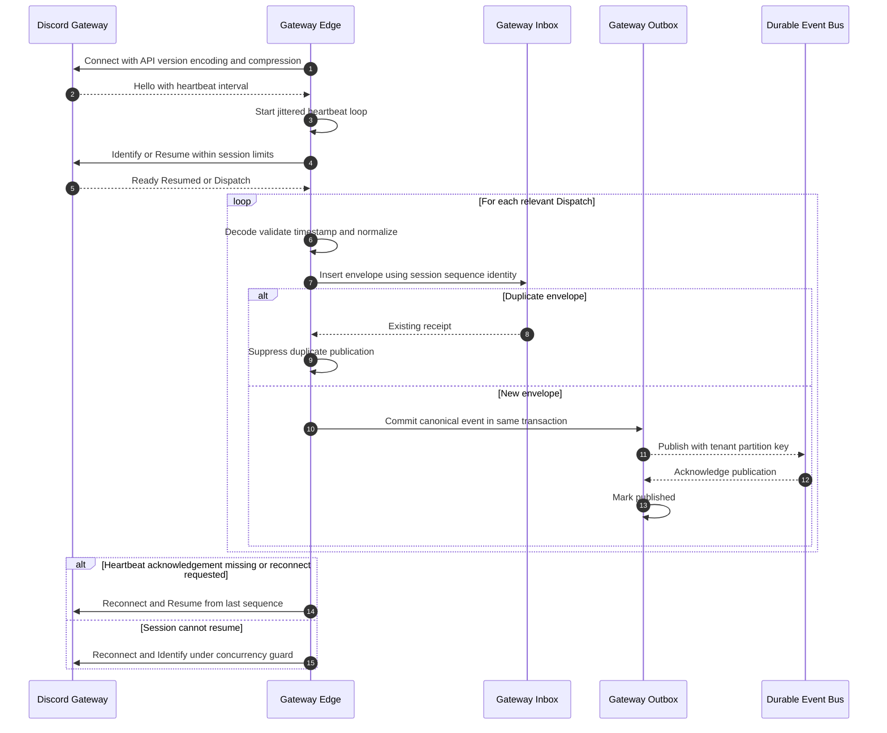
```mermaid
sequenceDiagram
    autonumber
    participant Discord as Discord Gateway
    participant Edge as Gateway Edge
    participant Inbox as Gateway Inbox
    participant Outbox as Gateway Outbox
    participant Bus as Durable Event Bus

    Edge->>Discord: Connect with API version encoding and compression
    Discord-->>Edge: Hello with heartbeat interval
    Edge->>Edge: Start jittered heartbeat loop
    Edge->>Discord: Identify or Resume within session limits
    Discord-->>Edge: Ready Resumed or Dispatch

    loop For each relevant Dispatch
        Edge->>Edge: Decode validate timestamp and normalize
        Edge->>Inbox: Insert envelope using session sequence identity
        alt Duplicate envelope
            Inbox-->>Edge: Existing receipt
            Edge->>Edge: Suppress duplicate publication
        else New envelope
            Edge->>Outbox: Commit canonical event in same transaction
            Outbox-->>Bus: Publish with tenant partition key
            Bus-->>Outbox: Acknowledge publication
            Outbox->>Outbox: Mark published
        end
    end

    alt Heartbeat acknowledgement missing or reconnect requested
        Edge->>Discord: Reconnect and Resume from last sequence
    else Session cannot resume
        Edge->>Discord: Reconnect and Identify under concurrency guard
    end
```

### 9.2 Interaction acknowledgement

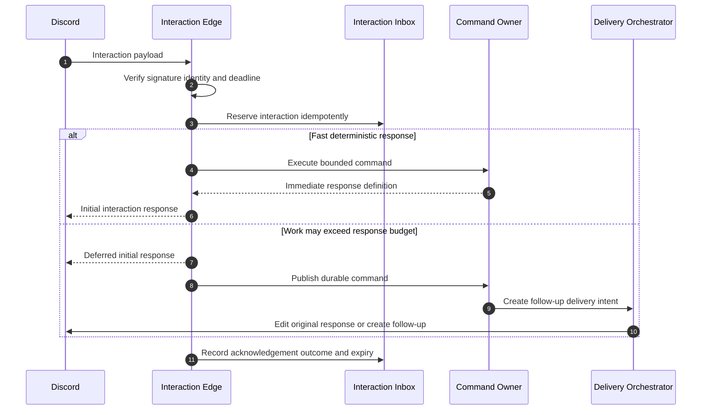
```mermaid
sequenceDiagram
    autonumber
    participant Discord
    participant Edge as Interaction Edge
    participant Inbox as Interaction Inbox
    participant Domain as Command Owner
    participant Delivery as Delivery Orchestrator

    Discord->>Edge: Interaction payload
    Edge->>Edge: Verify signature identity and deadline
    Edge->>Inbox: Reserve interaction idempotently

    alt Fast deterministic response
        Edge->>Domain: Execute bounded command
        Domain-->>Edge: Immediate response definition
        Edge-->>Discord: Initial interaction response
    else Work may exceed response budget
        Edge-->>Discord: Deferred initial response
        Edge->>Domain: Publish durable command
        Domain->>Delivery: Create follow-up delivery intent
        Delivery->>Discord: Edit original response or create follow-up
    end

    Edge->>Inbox: Record acknowledgement outcome and expiry
```

### 9.3 Member join delivery

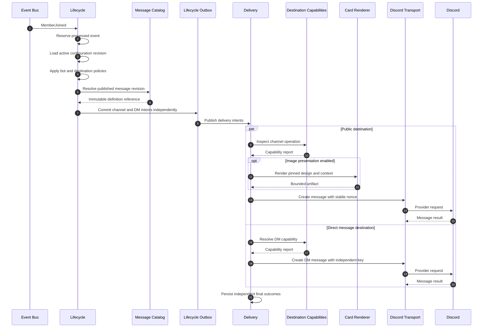
```mermaid
sequenceDiagram
    autonumber
    participant Bus as Event Bus
    participant Lifecycle
    participant Catalog as Message Catalog
    participant Outbox as Lifecycle Outbox
    participant Delivery
    participant Capabilities as Destination Capabilities
    participant Renderer as Card Renderer
    participant Transport as Discord Transport
    participant Discord

    Bus->>Lifecycle: MemberJoined
    Lifecycle->>Lifecycle: Reserve processed event
    Lifecycle->>Lifecycle: Load active configuration revision
    Lifecycle->>Lifecycle: Apply bot and destination policies
    Lifecycle->>Catalog: Resolve published message revision
    Catalog-->>Lifecycle: Immutable definition reference
    Lifecycle->>Outbox: Commit channel and DM intents independently
    Outbox->>Delivery: Publish delivery intents

    par Public destination
        Delivery->>Capabilities: Inspect channel operation
        Capabilities-->>Delivery: Capability report
        opt Image presentation enabled
            Delivery->>Renderer: Render pinned design and context
            Renderer-->>Delivery: Bounded artifact
        end
        Delivery->>Transport: Create message with stable nonce
        Transport->>Discord: Provider request
        Discord-->>Transport: Message result
    and Direct message destination
        Delivery->>Capabilities: Resolve DM capability
        Capabilities-->>Delivery: Capability report
        Delivery->>Transport: Create DM message with independent key
        Transport->>Discord: Provider request
        Discord-->>Transport: Message result
    end

    Delivery->>Delivery: Persist independent final outcomes
```

### 9.4 Departure and ban correlation

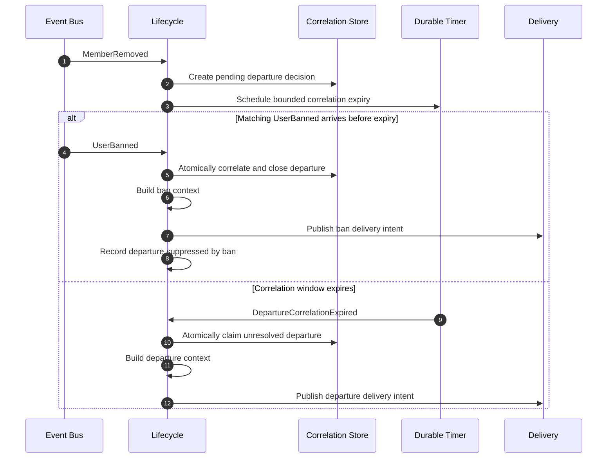
```mermaid
sequenceDiagram
    autonumber
    participant Bus as Event Bus
    participant Lifecycle
    participant Store as Correlation Store
    participant Timer as Durable Timer
    participant Delivery

    Bus->>Lifecycle: MemberRemoved
    Lifecycle->>Store: Create pending departure decision
    Lifecycle->>Timer: Schedule bounded correlation expiry

    alt Matching UserBanned arrives before expiry
        Bus->>Lifecycle: UserBanned
        Lifecycle->>Store: Atomically correlate and close departure
        Lifecycle->>Lifecycle: Build ban context
        Lifecycle->>Delivery: Publish ban delivery intent
        Lifecycle->>Lifecycle: Record departure suppressed by ban
    else Correlation window expires
        Timer->>Lifecycle: DepartureCorrelationExpired
        Lifecycle->>Store: Atomically claim unresolved departure
        Lifecycle->>Lifecycle: Build departure context
        Lifecycle->>Delivery: Publish departure delivery intent
    end
```

No failed REST lookup may be interpreted as evidence that a ban did not occur.

### 9.5 Immediate manual message

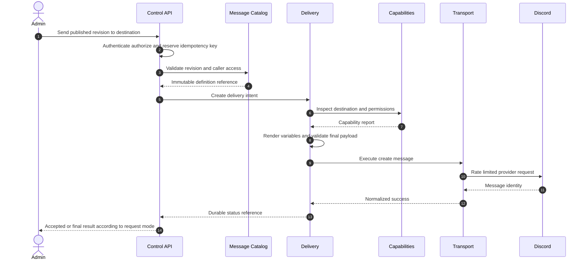
```mermaid
sequenceDiagram
    autonumber
    actor Admin
    participant API as Control API
    participant Catalog as Message Catalog
    participant Delivery
    participant Capabilities
    participant Transport
    participant Discord

    Admin->>API: Send published revision to destination
    API->>API: Authenticate authorize and reserve idempotency key
    API->>Catalog: Validate revision and caller access
    Catalog-->>API: Immutable definition reference
    API->>Delivery: Create delivery intent
    Delivery->>Capabilities: Inspect destination and permissions
    Capabilities-->>Delivery: Capability report
    Delivery->>Delivery: Render variables and validate final payload
    Delivery->>Transport: Execute create message
    Transport->>Discord: Rate limited provider request
    Discord-->>Transport: Message identity
    Transport-->>Delivery: Normalized success
    Delivery-->>API: Durable status reference
    API-->>Admin: Accepted or final result according to request mode
```

### 9.6 Scheduled message occurrence

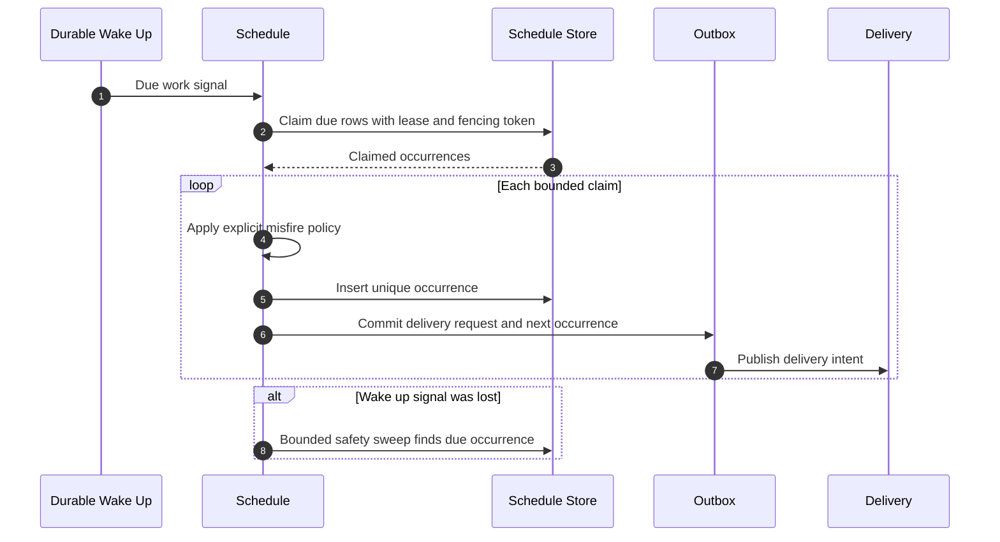
```mermaid
sequenceDiagram
    autonumber
    participant Clock as Durable Wake Up
    participant Schedule
    participant Store as Schedule Store
    participant Outbox
    participant Delivery

    Clock->>Schedule: Due work signal
    Schedule->>Store: Claim due rows with lease and fencing token
    Store-->>Schedule: Claimed occurrences

    loop Each bounded claim
        Schedule->>Schedule: Apply explicit misfire policy
        Schedule->>Store: Insert unique occurrence
        Schedule->>Outbox: Commit delivery request and next occurrence
        Outbox->>Delivery: Publish delivery intent
    end

    alt Wake up signal was lost
        Schedule->>Store: Bounded safety sweep finds due occurrence
    end
```

### 9.7 Automatic reply hot path

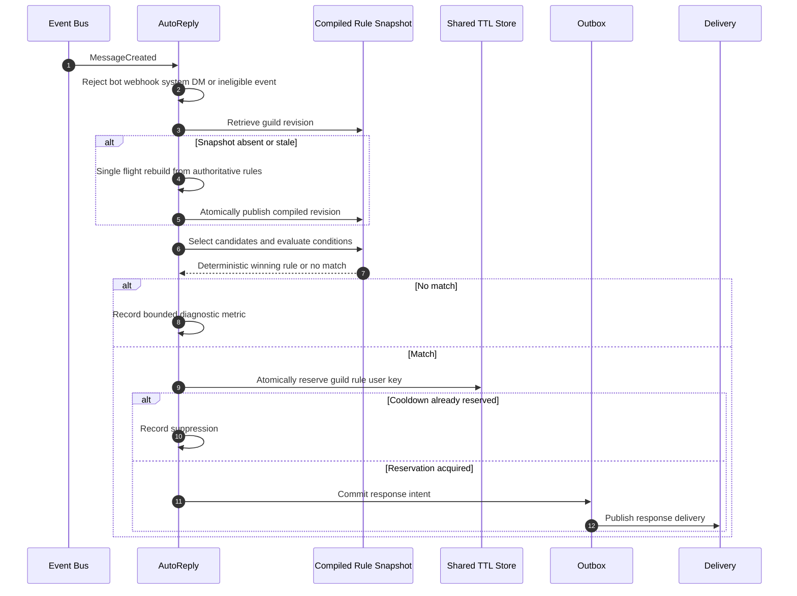
```mermaid
sequenceDiagram
    autonumber
    participant Bus as Event Bus
    participant AutoReply
    participant Snapshot as Compiled Rule Snapshot
    participant Cooldown as Shared TTL Store
    participant Outbox
    participant Delivery

    Bus->>AutoReply: MessageCreated
    AutoReply->>AutoReply: Reject bot webhook system DM or ineligible event
    AutoReply->>Snapshot: Retrieve guild revision

    alt Snapshot absent or stale
        AutoReply->>AutoReply: Single flight rebuild from authoritative rules
        AutoReply->>Snapshot: Atomically publish compiled revision
    end

    AutoReply->>Snapshot: Select candidates and evaluate conditions
    Snapshot-->>AutoReply: Deterministic winning rule or no match

    alt No match
        AutoReply->>AutoReply: Record bounded diagnostic metric
    else Match
        AutoReply->>Cooldown: Atomically reserve guild rule user key
        alt Cooldown already reserved
            AutoReply->>AutoReply: Record suppression
        else Reservation acquired
            AutoReply->>Outbox: Commit response intent
            Outbox->>Delivery: Publish response delivery
        end
    end
```

### 9.8 Delivery execution and uncertain outcome

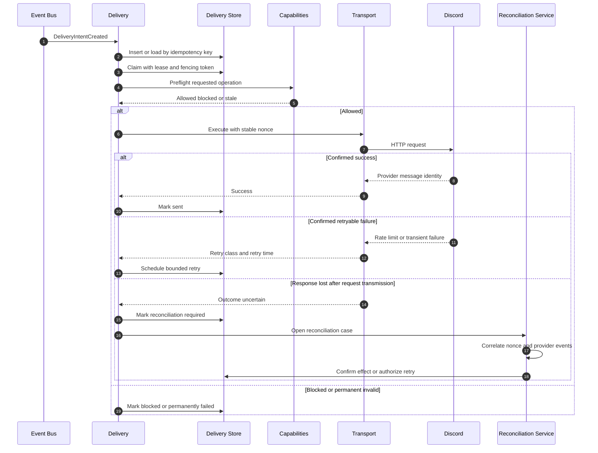
```mermaid
sequenceDiagram
    autonumber
    participant Bus as Event Bus
    participant Delivery
    participant Store as Delivery Store
    participant Capabilities
    participant Transport
    participant Discord
    participant Reconcile as Reconciliation Service

    Bus->>Delivery: DeliveryIntentCreated
    Delivery->>Store: Insert or load by idempotency key
    Delivery->>Store: Claim with lease and fencing token
    Delivery->>Capabilities: Preflight requested operation
    Capabilities-->>Delivery: Allowed blocked or stale

    alt Allowed
        Delivery->>Transport: Execute with stable nonce
        Transport->>Discord: HTTP request
        alt Confirmed success
            Discord-->>Transport: Provider message identity
            Transport-->>Delivery: Success
            Delivery->>Store: Mark sent
        else Confirmed retryable failure
            Discord-->>Transport: Rate limit or transient failure
            Transport-->>Delivery: Retry class and retry time
            Delivery->>Store: Schedule bounded retry
        else Response lost after request transmission
            Transport-->>Delivery: Outcome uncertain
            Delivery->>Store: Mark reconciliation required
            Delivery->>Reconcile: Open reconciliation case
            Reconcile->>Reconcile: Correlate nonce and provider events
            Reconcile->>Store: Confirm effect or authorize retry
        end
    else Blocked or permanent invalid
        Delivery->>Store: Mark blocked or permanently failed
    end
```

### 9.9 Manual moderation action

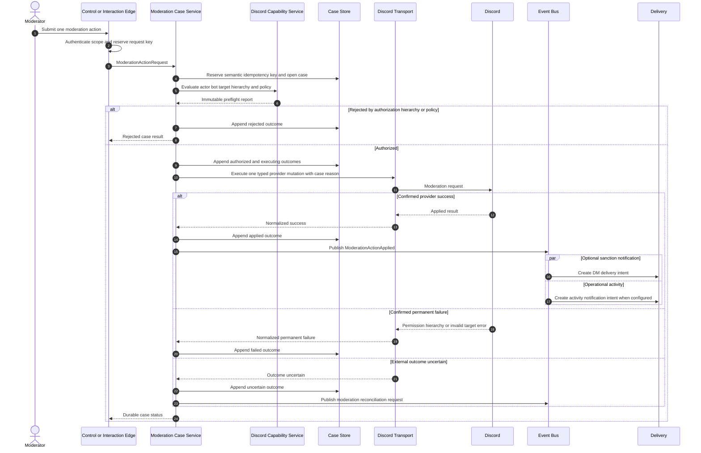
```mermaid
sequenceDiagram
    autonumber
    actor Moderator
    participant Edge as Control or Interaction Edge
    participant Cases as Moderation Case Service
    participant Capabilities as Discord Capability Service
    participant Store as Case Store
    participant Transport as Discord Transport
    participant Discord
    participant Bus as Event Bus
    participant Delivery

    Moderator->>Edge: Submit one moderation action
    Edge->>Edge: Authenticate scope and reserve request key
    Edge->>Cases: ModerationActionRequest
    Cases->>Store: Reserve semantic idempotency key and open case
    Cases->>Capabilities: Evaluate actor bot target hierarchy and policy
    Capabilities-->>Cases: Immutable preflight report

    alt Rejected by authorization hierarchy or policy
        Cases->>Store: Append rejected outcome
        Cases-->>Edge: Rejected case result
    else Authorized
        Cases->>Store: Append authorized and executing outcomes
        Cases->>Transport: Execute one typed provider mutation with case reason
        Transport->>Discord: Moderation request
        alt Confirmed provider success
            Discord-->>Transport: Applied result
            Transport-->>Cases: Normalized success
            Cases->>Store: Append applied outcome
            Cases->>Bus: Publish ModerationActionApplied
            par Optional sanction notification
                Bus->>Delivery: Create DM delivery intent
            and Operational activity
                Bus->>Delivery: Create activity notification intent when configured
            end
        else Confirmed permanent failure
            Discord-->>Transport: Permission hierarchy or invalid target error
            Transport-->>Cases: Normalized permanent failure
            Cases->>Store: Append failed outcome
        else External outcome uncertain
            Transport-->>Cases: Outcome uncertain
            Cases->>Store: Append uncertain outcome
            Cases->>Bus: Publish moderation reconciliation request
        end
        Cases-->>Edge: Durable case status
    end
```

The response to the moderator exposes the primary action state separately from notification states. A failed DM never converts an applied sanction into a failed sanction.

### 9.10 Automatic moderation decision and enforcement

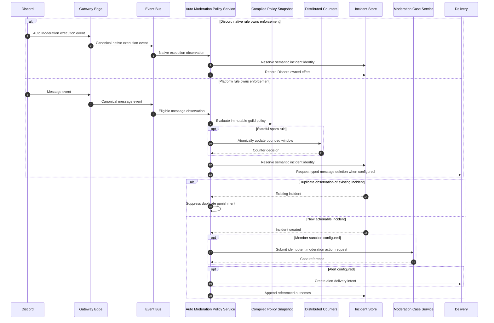
```mermaid
sequenceDiagram
    autonumber
    participant Discord
    participant Gateway as Gateway Edge
    participant Bus as Event Bus
    participant AutoMod as Auto Moderation Policy Service
    participant Snapshot as Compiled Policy Snapshot
    participant Counters as Distributed Counters
    participant Store as Incident Store
    participant Cases as Moderation Case Service
    participant Delivery

    alt Discord native rule owns enforcement
        Discord->>Gateway: Auto Moderation execution event
        Gateway->>Bus: Canonical native execution event
        Bus->>AutoMod: Native execution observation
        AutoMod->>Store: Reserve semantic incident identity
        AutoMod->>Store: Record Discord owned effect
    else Platform rule owns enforcement
        Discord->>Gateway: Message event
        Gateway->>Bus: Canonical message event
        Bus->>AutoMod: Eligible message observation
        AutoMod->>Snapshot: Evaluate immutable guild policy
        opt Stateful spam rule
            AutoMod->>Counters: Atomically update bounded window
            Counters-->>AutoMod: Counter decision
        end
        AutoMod->>Store: Reserve semantic incident identity
        AutoMod->>Delivery: Request typed message deletion when configured
    end

    alt Duplicate observation of existing incident
        Store-->>AutoMod: Existing incident
        AutoMod->>AutoMod: Suppress duplicate punishment
    else New actionable incident
        Store-->>AutoMod: Incident created
        opt Member sanction configured
            AutoMod->>Cases: Submit idempotent moderation action request
            Cases-->>AutoMod: Case reference
        end
        opt Alert configured
            AutoMod->>Delivery: Create alert delivery intent
        end
        AutoMod->>Store: Append referenced outcomes
    end
```

### 9.11 Activity record and Discord log delivery

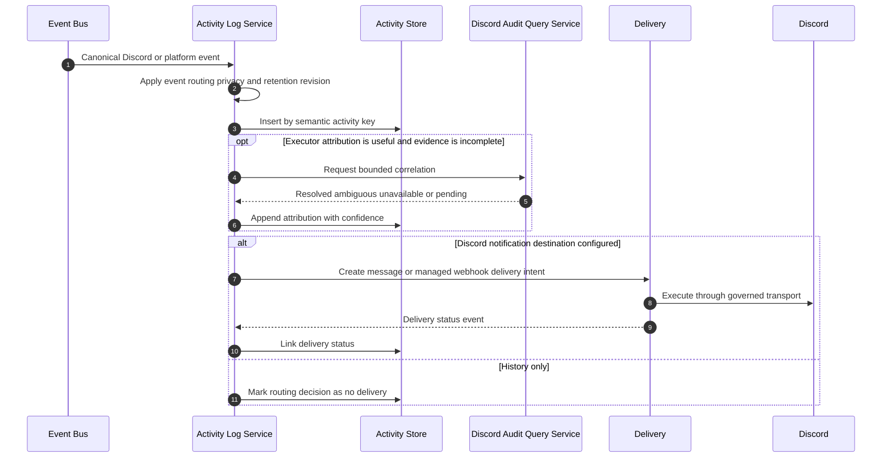
```mermaid
sequenceDiagram
    autonumber
    participant Bus as Event Bus
    participant Activity as Activity Log Service
    participant Store as Activity Store
    participant Audit as Discord Audit Query Service
    participant Delivery
    participant Discord

    Bus->>Activity: Canonical Discord or platform event
    Activity->>Activity: Apply event routing privacy and retention revision
    Activity->>Store: Insert by semantic activity key

    opt Executor attribution is useful and evidence is incomplete
        Activity->>Audit: Request bounded correlation
        Audit-->>Activity: Resolved ambiguous unavailable or pending
        Activity->>Store: Append attribution with confidence
    end

    alt Discord notification destination configured
        Activity->>Delivery: Create message or managed webhook delivery intent
        Delivery->>Discord: Execute through governed transport
        Delivery-->>Activity: Delivery status event
        Activity->>Store: Link delivery status
    else History only
        Activity->>Store: Mark routing decision as no delivery
    end
```

### 9.12 Countdown deletion

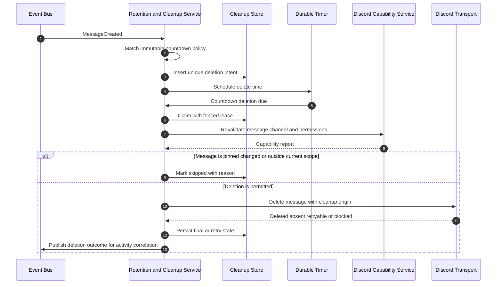
```mermaid
sequenceDiagram
    autonumber
    participant Bus as Event Bus
    participant Retention as Retention and Cleanup Service
    participant Store as Cleanup Store
    participant Timer as Durable Timer
    participant Capabilities as Discord Capability Service
    participant Transport as Discord Transport

    Bus->>Retention: MessageCreated
    Retention->>Retention: Match immutable countdown policy
    Retention->>Store: Insert unique deletion intent
    Retention->>Timer: Schedule delete time
    Timer->>Retention: Countdown deletion due
    Retention->>Store: Claim with fenced lease
    Retention->>Capabilities: Revalidate message channel and permissions
    Capabilities-->>Retention: Capability report

    alt Message is pinned changed or outside current scope
        Retention->>Store: Mark skipped with reason
    else Deletion is permitted
        Retention->>Transport: Delete message with cleanup origin
        Transport-->>Retention: Deleted absent retryable or blocked
        Retention->>Store: Persist final or retry state
        Retention->>Bus: Publish deletion outcome for activity correlation
    end
```

### 9.13 Scheduled retention sweep

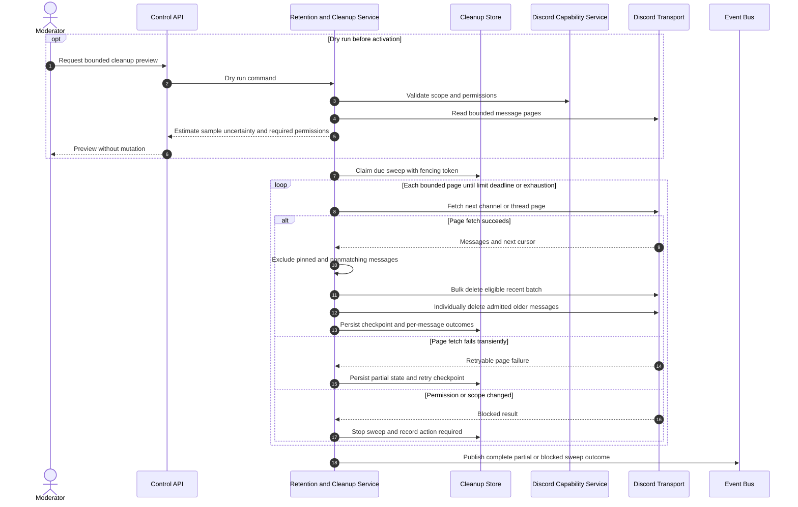
```mermaid
sequenceDiagram
    autonumber
    actor Moderator
    participant API as Control API
    participant Retention as Retention and Cleanup Service
    participant Store as Cleanup Store
    participant Capability as Discord Capability Service
    participant Transport as Discord Transport
    participant Bus as Event Bus

    opt Dry run before activation
        Moderator->>API: Request bounded cleanup preview
        API->>Retention: Dry run command
        Retention->>Capability: Validate scope and permissions
        Retention->>Transport: Read bounded message pages
        Retention-->>API: Estimate sample uncertainty and required permissions
        API-->>Moderator: Preview without mutation
    end

    Retention->>Store: Claim due sweep with fencing token
    loop Each bounded page until limit deadline or exhaustion
        Retention->>Transport: Fetch next channel or thread page
        alt Page fetch succeeds
            Transport-->>Retention: Messages and next cursor
            Retention->>Retention: Exclude pinned and nonmatching messages
            Retention->>Transport: Bulk delete eligible recent batch
            Retention->>Transport: Individually delete admitted older messages
            Retention->>Store: Persist checkpoint and per-message outcomes
        else Page fetch fails transiently
            Transport-->>Retention: Retryable page failure
            Retention->>Store: Persist partial state and retry checkpoint
        else Permission or scope changed
            Transport-->>Retention: Blocked result
            Retention->>Store: Stop sweep and record action required
        end
    end
    Retention->>Bus: Publish complete partial or blocked sweep outcome
```

### 9.14 Native audit browsing and correlation

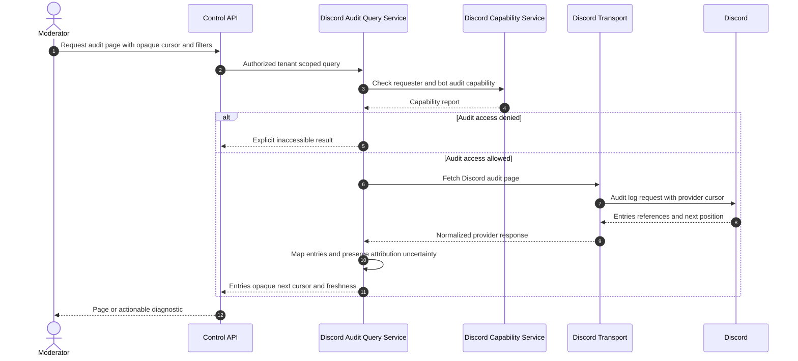
```mermaid
sequenceDiagram
    autonumber
    actor Moderator
    participant API as Control API
    participant Audit as Discord Audit Query Service
    participant Capability as Discord Capability Service
    participant Transport as Discord Transport
    participant Discord

    Moderator->>API: Request audit page with opaque cursor and filters
    API->>Audit: Authorized tenant scoped query
    Audit->>Capability: Check requester and bot audit capability
    Capability-->>Audit: Capability report

    alt Audit access denied
        Audit-->>API: Explicit inaccessible result
    else Audit access allowed
        Audit->>Transport: Fetch Discord audit page
        Transport->>Discord: Audit log request with provider cursor
        Discord-->>Transport: Entries references and next position
        Transport-->>Audit: Normalized provider response
        Audit->>Audit: Map entries and preserve attribution uncertainty
        Audit-->>API: Entries opaque next cursor and freshness
    end
    API-->>Moderator: Page or actionable diagnostic
```

### 9.15 Security observation, detection, and response reservation

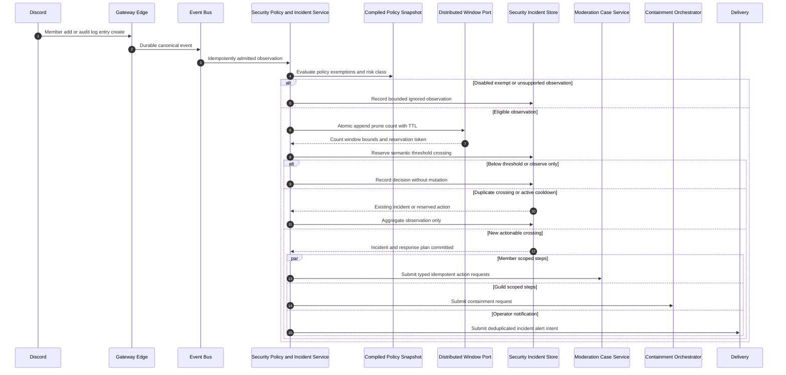
```mermaid
sequenceDiagram
    autonumber
    participant Discord
    participant Gateway as Gateway Edge
    participant Bus as Event Bus
    participant Security as Security Policy and Incident Service
    participant Snapshot as Compiled Policy Snapshot
    participant Counter as Distributed Window Port
    participant Store as Security Incident Store
    participant Cases as Moderation Case Service
    participant Containment as Containment Orchestrator
    participant Delivery

    Discord->>Gateway: Member add or audit log entry create
    Gateway->>Bus: Durable canonical event
    Bus->>Security: Idempotently admitted observation
    Security->>Snapshot: Evaluate policy exemptions and risk class

    alt Disabled exempt or unsupported observation
        Security->>Store: Record bounded ignored observation
    else Eligible observation
        Security->>Counter: Atomic append prune count with TTL
        Counter-->>Security: Count window bounds and reservation token
        Security->>Store: Reserve semantic threshold crossing
        alt Below threshold or observe only
            Security->>Store: Record decision without mutation
        else Duplicate crossing or active cooldown
            Store-->>Security: Existing incident or reserved action
            Security->>Store: Aggregate observation only
        else New actionable crossing
            Store-->>Security: Incident and response plan committed
            par Member scoped steps
                Security->>Cases: Submit typed idempotent action requests
            and Guild scoped steps
                Security->>Containment: Submit containment request
            and Operator notification
                Security->>Delivery: Submit deduplicated incident alert intent
            end
        end
    end
```

The event is acknowledged independently of provider mutation. The incident, threshold-crossing reservation, selected response-plan revision, and outbox publications are committed atomically. Audit entries use their provider identity; member joins use the canonical ingress event identity plus guild and member scope. No counter result alone is authority to punish.

### 9.16 Recoverable lockdown apply and restore

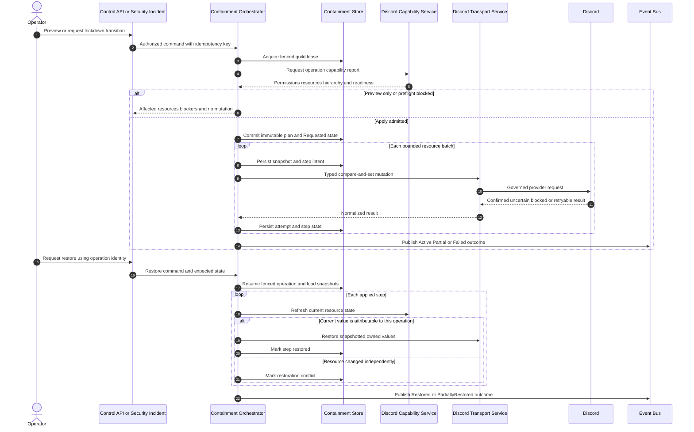
```mermaid
sequenceDiagram
    autonumber
    actor Operator
    participant API as Control API or Security Incident
    participant Containment as Containment Orchestrator
    participant Store as Containment Store
    participant Capability as Discord Capability Service
    participant Transport as Discord Transport Service
    participant Discord
    participant Bus as Event Bus

    Operator->>API: Preview or request lockdown transition
    API->>Containment: Authorized command with idempotency key
    Containment->>Store: Acquire fenced guild lease
    Containment->>Capability: Request operation capability report
    Capability-->>Containment: Permissions resources hierarchy and readiness

    alt Preview only or preflight blocked
        Containment-->>API: Affected resources blockers and no mutation
    else Apply admitted
        Containment->>Store: Commit immutable plan and Requested state
        loop Each bounded resource batch
            Containment->>Store: Persist snapshot and step intent
            Containment->>Transport: Typed compare-and-set mutation
            Transport->>Discord: Governed provider request
            Discord-->>Transport: Confirmed uncertain blocked or retryable result
            Transport-->>Containment: Normalized result
            Containment->>Store: Persist attempt and step state
        end
        Containment->>Bus: Publish Active Partial or Failed outcome
    end

    Operator->>API: Request restore using operation identity
    API->>Containment: Restore command and expected state
    Containment->>Store: Resume fenced operation and load snapshots
    loop Each applied step
        Containment->>Capability: Refresh current resource state
        alt Current value is attributable to this operation
            Containment->>Transport: Restore snapshotted owned values
            Containment->>Store: Mark step restored
        else Resource changed independently
            Containment->>Store: Mark restoration conflict
        end
    end
    Containment->>Bus: Publish Restored or PartiallyRestored outcome
```

An operation may be reported as inactive only after every admitted step is restored, proved already absent, or explicitly acknowledged through an audited operator resolution. A worker crash resumes from durable step state using the current fencing token; it never reconstructs authority from an in-memory snapshot.

### 9.17 Automatic role planning and assignment

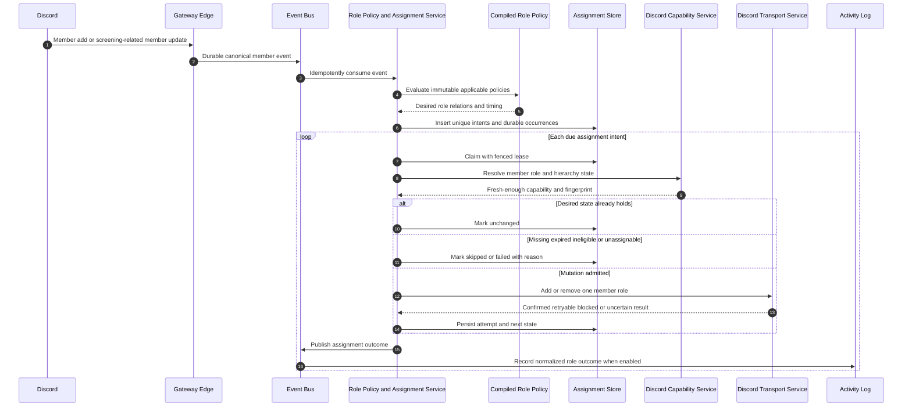
```mermaid
sequenceDiagram
    autonumber
    participant Discord
    participant Gateway as Gateway Edge
    participant Bus as Event Bus
    participant Roles as Role Policy and Assignment Service
    participant Snapshot as Compiled Role Policy
    participant Store as Assignment Store
    participant Capability as Discord Capability Service
    participant Transport as Discord Transport Service
    participant Activity as Activity Log

    Discord->>Gateway: Member add or screening-related member update
    Gateway->>Bus: Durable canonical member event
    Bus->>Roles: Idempotently consume event
    Roles->>Snapshot: Evaluate immutable applicable policies
    Snapshot-->>Roles: Desired role relations and timing
    Roles->>Store: Insert unique intents and durable occurrences

    loop Each due assignment intent
        Roles->>Store: Claim with fenced lease
        Roles->>Capability: Resolve member role and hierarchy state
        Capability-->>Roles: Fresh-enough capability and fingerprint
        alt Desired state already holds
            Roles->>Store: Mark unchanged
        else Missing expired ineligible or unassignable
            Roles->>Store: Mark skipped or failed with reason
        else Mutation admitted
            Roles->>Transport: Add or remove one member role
            Transport-->>Roles: Confirmed retryable blocked or uncertain result
            Roles->>Store: Persist attempt and next state
        end
        Roles->>Bus: Publish assignment outcome
        Bus->>Activity: Record normalized role outcome when enabled
    end
```

Policy evaluation and intent persistence complete before provider work starts. An assignment deadline prevents a delayed queue from granting obsolete access. Temporary-role expiry is a separate durable intent with its own idempotency identity and ownership check.

### 9.18 Role panel publication and member interaction

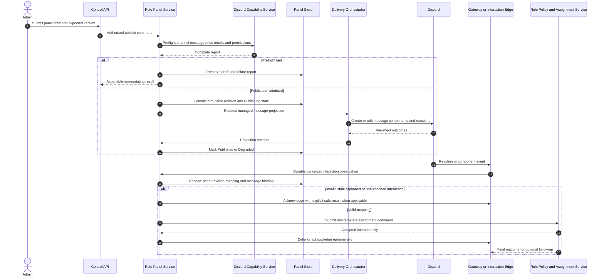
```mermaid
sequenceDiagram
    autonumber
    actor Admin
    participant API as Control API
    participant Panel as Role Panel Service
    participant Capability as Discord Capability Service
    participant Store as Panel Store
    participant Delivery as Delivery Orchestrator
    participant Discord
    participant Gateway as Gateway or Interaction Edge
    participant Roles as Role Policy and Assignment Service

    Admin->>API: Submit panel draft and expected version
    API->>Panel: Authorized publish command
    Panel->>Capability: Preflight channel message roles emojis and permissions
    Capability-->>Panel: Complete report
    alt Preflight fails
        Panel->>Store: Preserve draft and failure report
        Panel-->>API: Actionable non-mutating result
    else Publication admitted
        Panel->>Store: Commit immutable revision and Publishing state
        Panel->>Delivery: Request managed message projection
        Delivery->>Discord: Create or edit message components and reactions
        Discord-->>Delivery: Per-effect outcomes
        Delivery-->>Panel: Projection receipts
        Panel->>Store: Mark Published or Degraded
    end

    Discord->>Gateway: Reaction or component event
    Gateway->>Panel: Durable canonical interaction observation
    Panel->>Store: Resolve panel revision mapping and message binding
    alt Invalid stale orphaned or unauthorized interaction
        Panel->>Gateway: Acknowledge with explicit safe result when applicable
    else Valid mapping
        Panel->>Roles: Submit desired-state assignment command
        Roles-->>Panel: Accepted intent identity
        Panel->>Gateway: Defer or acknowledge ephemerally
        Roles-->>Gateway: Final outcome for optional follow-up
    end
```

Component acknowledgement never waits for role convergence. Reaction events have no interaction response channel and therefore rely on dashboard status and optional Activity Log records. Panel event handlers do not derive authority from the routing token; they validate the stored panel, pinned revision, message, guild, member, and mapping.

### 9.19 Role resource mutation and uncertain outcome

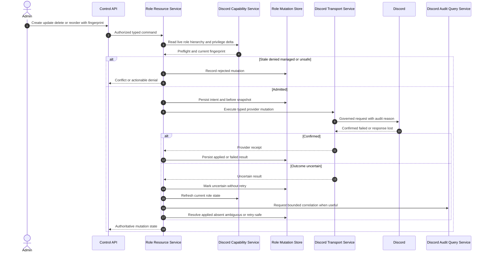
```mermaid
sequenceDiagram
    autonumber
    actor Admin
    participant API as Control API
    participant Resource as Role Resource Service
    participant Capability as Discord Capability Service
    participant Store as Role Mutation Store
    participant Transport as Discord Transport Service
    participant Discord
    participant Audit as Discord Audit Query Service

    Admin->>API: Create update delete or reorder with fingerprint
    API->>Resource: Authorized typed command
    Resource->>Capability: Read live role hierarchy and privilege delta
    Capability-->>Resource: Preflight and current fingerprint
    alt Stale denied managed or unsafe
        Resource->>Store: Record rejected mutation
        Resource-->>API: Conflict or actionable denial
    else Admitted
        Resource->>Store: Persist intent and before snapshot
        Resource->>Transport: Execute typed provider mutation
        Transport->>Discord: Governed request with audit reason
        Discord-->>Transport: Confirmed failed or response lost
        alt Confirmed
            Transport-->>Resource: Provider receipt
            Resource->>Store: Persist applied or failed result
        else Outcome uncertain
            Transport-->>Resource: Uncertain result
            Resource->>Store: Mark uncertain without retry
            Resource->>Capability: Refresh current role state
            Resource->>Audit: Request bounded correlation when useful
            Resource->>Store: Resolve applied absent ambiguous or retry-safe
        end
        Resource-->>API: Authoritative mutation state
    end
```

The API may return accepted or uncertain state rather than holding the request open for reconciliation. Role creation, deletion, and reordering are never blindly repeated after a lost response.

### 9.20 Progression award and reward projection

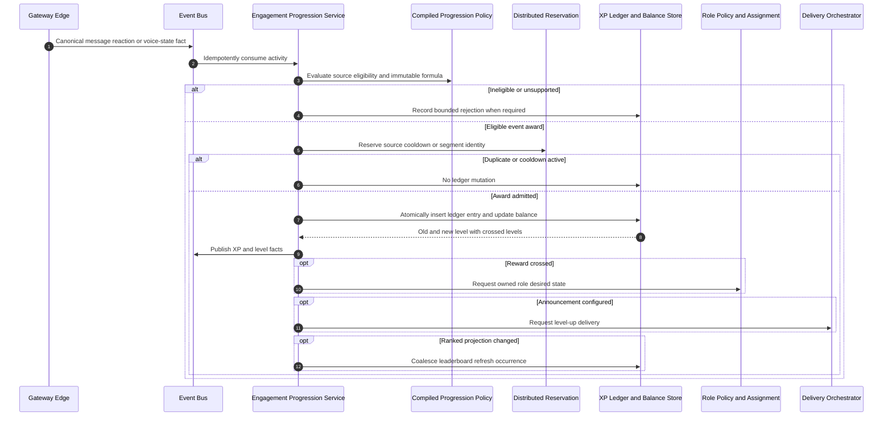
```mermaid
sequenceDiagram
    autonumber
    participant Gateway as Gateway Edge
    participant Bus as Event Bus
    participant XP as Engagement Progression Service
    participant Snapshot as Compiled Progression Policy
    participant Cooldown as Distributed Reservation
    participant Store as XP Ledger and Balance Store
    participant Roles as Role Policy and Assignment
    participant Delivery as Delivery Orchestrator

    Gateway->>Bus: Canonical message reaction or voice-state fact
    Bus->>XP: Idempotently consume activity
    XP->>Snapshot: Evaluate source eligibility and immutable formula
    alt Ineligible or unsupported
        XP->>Store: Record bounded rejection when required
    else Eligible event award
        XP->>Cooldown: Reserve source cooldown or segment identity
        alt Duplicate or cooldown active
            XP->>Store: No ledger mutation
        else Award admitted
            XP->>Store: Atomically insert ledger entry and update balance
            Store-->>XP: Old and new level with crossed levels
            XP->>Bus: Publish XP and level facts
            opt Reward crossed
                XP->>Roles: Request owned role desired state
            end
            opt Announcement configured
                XP->>Delivery: Request level-up delivery
            end
            opt Ranked projection changed
                XP->>Store: Coalesce leaderboard refresh occurrence
            end
        end
    end
```

Voice activity opens, checkpoints, pauses, resumes, and closes durable session segments before producing ledger entries. Message event processing never waits for rewards, announcements, or leaderboard rendering.

### 9.21 Starboard contribution and projection

```mermaid
sequenceDiagram
    autonumber
    participant Gateway as Gateway Edge
    participant Bus as Event Bus
    participant Star as Starboard Service
    participant Store as Starboard Store
    participant Capability as Discord Capability Service
    participant Delivery as Delivery Orchestrator
    participant Discord

    Gateway->>Bus: Canonical reaction change
    Bus->>Star: Idempotent contribution observation
    Star->>Store: Lock or compare-and-set board source aggregate
    Star->>Star: Apply emoji source author and contributor policy
    Star->>Store: Upsert contribution and unique-user count
    Star->>Store: Derive desired absent or present projection
    alt Desired projection unchanged
        Star->>Store: Commit aggregate only
    else Projection transition required
        Star->>Capability: Validate destination and content evidence state
        Star->>Delivery: Request create edit or delete with stable projection key
        Delivery->>Discord: Governed message effect
        Discord-->>Delivery: Confirmed blocked retryable or uncertain
        Delivery-->>Star: Projection receipt
        Star->>Store: Persist binding and projection state
    end
```

Remove-all, remove-emoji, source deletion, and board deletion events are normalized into the same aggregate. A periodic bounded reconciliation corrects missed contributions or orphaned bindings without scanning the entire guild.

### 9.22 Giveaway close, draw, and fulfillment

```mermaid
sequenceDiagram
    autonumber
    participant Timer as Durable Timer
    participant Giveaway as Giveaway Service
    participant Store as Giveaway Store
    participant Draw as Secure Draw Adapter
    participant Delivery as Delivery Orchestrator
    participant Roles as Role Policy and Assignment
    participant XP as Engagement Progression Service

    Timer->>Giveaway: Close occurrence due
    Giveaway->>Store: Compare-and-set Running to Closing
    alt Transition already owned or no longer valid
        Store-->>Giveaway: Existing terminal or claimed state
    else Closing reserved
        Giveaway->>Store: Freeze eligible entrant snapshot
        Store-->>Giveaway: Snapshot identity count and hash
        Giveaway->>Draw: Select winners for unique draw identity
        Draw-->>Giveaway: Winners and randomness receipt
        Giveaway->>Store: Commit immutable draw and Ended state
        par Message and announcements
            Giveaway->>Delivery: Request final projection and winner notifications
        and Role prizes when admitted
            Giveaway->>Roles: Request winner role ownership claims
        and XP prizes when admitted
            Giveaway->>XP: Request idempotent prize ledger entries
        end
        Giveaway->>Store: Track every secondary effect independently
    end
```

Reroll repeats only the snapshot eligibility and draw portion under a new draw identity and declared prior-winner policy. It does not rewrite the original result.

### 9.23 Form submission and review effects

```mermaid
sequenceDiagram
    autonumber
    actor Member
    actor Reviewer
    participant Edge as Interaction Edge
    participant Forms as Form Workflow Service
    participant Store as Form Store
    participant Assets as Asset Service
    participant Delivery as Delivery Orchestrator
    participant Roles as Role Policy and Assignment

    Member->>Edge: Open published form
    Edge->>Forms: Signed interaction and pinned form version
    Forms->>Store: Validate eligibility and reserve submission session
    Forms-->>Edge: Modal response within initial deadline
    Member->>Edge: Submit modal answers and attachments
    Edge->>Forms: Durable modal submission
    Forms->>Store: Revalidate session version eligibility and frequency
    opt Attachments present
        Forms->>Assets: Ingest ephemeral files under form policy
        Assets-->>Forms: Valid references or typed rejection
    end
    Forms->>Store: Commit immutable response and receipt
    Forms->>Delivery: Request reception projection
    Forms-->>Edge: Ephemeral receipt independent from reception delivery

    Reviewer->>Edge: Accept or reject response
    Edge->>Forms: Signed review command
    Forms->>Store: Authorize and compare-and-set pending review state
    Store-->>Forms: Immutable review event
    opt Role effect configured
        Forms->>Roles: Request outcome-owned role desired state
    end
    Forms->>Delivery: Request reception message or thread update
    Forms-->>Edge: Ephemeral review outcome and secondary statuses
```

### 9.24 Temporary room creation and cleanup

```mermaid
sequenceDiagram
    autonumber
    participant Gateway as Gateway Edge
    participant Rooms as Temporary Room Service
    participant Store as Room Store
    participant Capability as Discord Capability Service
    participant Transport as Discord Transport Service
    participant Timer as Durable Timer
    participant Discord

    Gateway->>Rooms: Canonical member joined generator hub
    Rooms->>Store: Reserve unique lifecycle and fenced creation lease
    alt Existing active room for policy identity
        Rooms->>Transport: Move member to existing room when permitted
    else New room reserved
        Rooms->>Capability: Preflight quotas category permissions and move capability
        Rooms->>Store: Persist ordered creation plan
        Rooms->>Transport: Create voice channel
        Transport->>Discord: Governed channel creation
        Discord-->>Transport: Provider result
        Rooms->>Store: Persist voice binding before next step
        opt Linked text requested
            Rooms->>Transport: Create or bind text resource and owned overwrites
            Rooms->>Store: Persist text binding and step outcomes
        end
        Rooms->>Transport: Move member when still eligible
        Rooms->>Store: Mark Active or CreationPartial
    end

    Gateway->>Rooms: Last eligible member left
    Rooms->>Store: Enter EmptyGrace with new generation token
    Rooms->>Timer: Schedule durable deletion occurrence
    alt Member rejoins before due time
        Gateway->>Rooms: Member joined room
        Rooms->>Store: Advance generation and return Active
    else Matching occurrence becomes due
        Timer->>Rooms: Delete room generation
        Rooms->>Store: Claim fenced deletion plan
        Rooms->>Transport: Delete owned text and voice resources in declared order
        Rooms->>Store: Mark Deleted or DeletionPartial
    end
```

Every create or delete request that loses its provider response enters resource reconciliation. The hub and existing-link channels are never part of temporary deletion ownership.

### 9.25 Monetary transfer and tax settlement

```mermaid
sequenceDiagram
    autonumber
    participant Edge as Interaction Edge
    participant Ledger as Monetary Ledger
    participant Store as Ledger Store
    participant Bus as Event Bus
    participant Delivery as Delivery

    Edge->>Ledger: Authorized transfer command and idempotency key
    Ledger->>Store: Load currency policy and lock accounts in canonical order
    Ledger->>Store: Validate available balance ceilings and account state
    alt Existing semantic transaction
        Store-->>Ledger: Return prior committed result
    else Transfer admitted
        Ledger->>Store: Post sender debit recipient credit and explicit tax destination
        Ledger->>Store: Update projections and outbox atomically
        Store-->>Bus: TransferSettled and BalanceProjectionChanged
    end
    Ledger-->>Edge: Durable result
    Bus-->>Delivery: Optional mention-safe transfer receipt
```

The interaction response is not part of settlement. A lost response or duplicate command returns the same transaction identity and cannot repeat the transfer.

### 9.26 Income action and ledger settlement

```mermaid
sequenceDiagram
    autonumber
    participant Edge as Interaction or Timer Edge
    participant Earnings as Earnings and Income
    participant Policy as Compiled Income Policy
    participant Store as Earnings Store
    participant Ledger as Monetary Ledger
    participant Delivery

    Edge->>Earnings: Claim job salary crime robbery or scheduled occurrence
    Earnings->>Policy: Evaluate immutable rule and current facts
    Earnings->>Store: Reserve action cooldown and decision identity
    alt Duplicate cooldown or ineligible
        Store-->>Earnings: Existing or rejected outcome
    else Admitted
        Earnings->>Store: Commit payout or loss formula receipt
        Earnings->>Ledger: Idempotent posting transfer or fine request
        Ledger-->>Earnings: Settled rejected or unavailable
        Earnings->>Store: Record independent settlement state
        Earnings->>Delivery: Optional result or salary announcement
    end
    Earnings-->>Edge: Durable action status and next availability
```

### 9.27 Purchase, payment, and entitlement fulfillment

```mermaid
sequenceDiagram
    autonumber
    participant Edge as Interaction Edge
    participant Commerce
    participant Store as Commerce Store
    participant Ledger as Monetary Ledger
    participant Entitlement
    participant Delivery

    Edge->>Commerce: Purchase command with item revision or catalog identity
    Commerce->>Store: Revalidate eligibility limits price and stock
    Commerce->>Store: Reserve stock and create order atomically
    Commerce->>Ledger: Create atomic payment reservation
    alt Reservation rejected
        Ledger-->>Commerce: Insufficient available balance or policy block
        Commerce->>Store: Release stock and fail order
    else Hold created
        Ledger-->>Commerce: Durable reservation identity and hold lines
        Commerce->>Ledger: Capture reservation for purchase transaction
        Ledger-->>Commerce: Capture committed
        Commerce->>Store: Mark Paid and create reward occurrences
        loop Each reward line
            Commerce->>Entitlement: Idempotent entitlement request
            Entitlement-->>Commerce: Active partial pending blocked or failed
            Commerce->>Store: Record reward outcome
        end
        Commerce->>Delivery: Purchase status projection
        Commerce->>Store: Derive fulfilled or partially fulfilled state
    end
    Commerce-->>Edge: Durable order identity and state
```

Refund is a new workflow. Commerce first establishes compensability of required entitlements, requests owned reversals, then requests an equal-and-opposite Monetary Ledger transaction. Partial compensation remains visible and never fabricates an atomic rollback across Discord.

### 9.28 Entitlement expiry and reconciliation

```mermaid
sequenceDiagram
    autonumber
    participant Timer as Durable Timer
    participant Entitlement
    participant Store as Entitlement Store
    participant Owner as Role Progression or Discord Effect Owner
    participant Reconcile as Reconciliation

    Timer->>Entitlement: Entitlement expiry occurrence and generation
    Entitlement->>Store: Claim fenced expiry and revalidate state
    Entitlement->>Owner: Request idempotent removal or deactivation
    alt Confirmed
        Owner-->>Entitlement: Effect absent or removed
        Entitlement->>Store: Mark Revoked with receipt
    else Transient or uncertain
        Owner-->>Entitlement: Retryable or outcome uncertain
        Entitlement->>Store: Preserve expiring state and attempt
        Entitlement->>Reconcile: Bounded reconciliation request
    else Ownership conflict
        Owner-->>Entitlement: External change or unsafe reversal
        Entitlement->>Store: Mark CompensationConflict
    end
```

### 9.29 Durable casino session and wager settlement

```mermaid
sequenceDiagram
    autonumber
    participant Player
    participant Edge as Interaction Edge
    participant Game as Casino Game
    participant Store as Game Store
    participant Ledger as Monetary Ledger
    participant Random as Secure Randomness
    participant Delivery

    Player->>Edge: Start game with virtual-currency stake
    Edge->>Game: Durable game command
    Game->>Store: Create session and immutable rule binding
    Game->>Ledger: Request wager hold
    Ledger-->>Game: Hold created or rejected
    Game->>Store: Activate session with hold identity
    Game->>Delivery: Project owner-bound controls
    Player->>Edge: Submit signed component action
    Edge-->>Player: Initial or deferred acknowledgement
    Edge->>Game: Session action with expected version
    Game->>Store: Authorize player turn and reserve action sequence
    Game->>Random: Obtain secure random bytes when rules require them
    Random-->>Game: Randomness receipt
    Game->>Store: Commit transition or immutable outcome
    alt Outcome committed
        Game->>Ledger: Capture stake and post payout settlement exactly once
        Ledger-->>Game: Settlement result
        Game->>Store: Mark settled or recovery required
    end
    Game->>Delivery: Project newest session version and outcome
```

Presentation edits, token expiry, or deleted messages never determine the financial outcome. A replacement worker resumes from the committed session version and reconciles the same wager request.

### 9.30 Support panel publication and interaction

```mermaid
sequenceDiagram
    autonumber
    participant Admin
    participant API as Control API
    participant Panel as Support Panel
    participant Policy as Support Policy
    participant Delivery
    participant Discord
    participant Member
    participant Case as Support Case

    Admin->>API: Publish panel with expected draft version
    API->>Panel: Authorized publication command
    Panel->>Policy: Resolve template revisions and health
    Panel->>Panel: Validate components destination and ownership
    Panel->>Panel: Commit immutable revision and publication operation
    Panel->>Delivery: Create or edit owned panel projection
    Delivery->>Discord: Governed message effect
    Discord-->>Delivery: Provider outcome
    Delivery-->>Panel: Binding or degraded effect

    Member->>Discord: Select support option
    Discord->>Panel: Signed component interaction
    Panel->>Panel: Validate binding revision option member and enabled state
    Panel-->>Discord: Deferred ephemeral acknowledgement
    Panel->>Case: Durable open request with template revision
    Case-->>Panel: Intake required reserved created or rejected
    Panel-->>Member: Ephemeral status through governed follow-up
```

### 9.31 Intake and atomic support-case admission

```mermaid
sequenceDiagram
    autonumber
    participant Member
    participant Case as Support Case
    participant Policy as Support Policy
    participant Forms as Form Workflow
    participant Store as Case Store
    participant Timer as Durable Timer
    participant Resource as Support Resource Orchestrator

    Case->>Policy: Load pinned effective template
    Case->>Case: Evaluate current member and availability facts
    opt Intake form required
        Case->>Forms: Open session for immutable form revision
        Forms-->>Member: Modal or admitted multi-step intake
        Member->>Forms: Submit intake
        Forms-->>Case: FormSubmissionAccepted reference
    end
    Case->>Store: Atomically reserve caps cooldown and next number
    alt Duplicate or limit denied
        Store-->>Case: Existing request or rejection
    else Reservation committed
        Case->>Store: Create case opening event and outbox
        Case->>Timer: Schedule first-response and inactivity occurrences
        Case->>Resource: Provision case generation idempotently
    end
```

Capacity and case creation share one local transaction. A Form Workflow submission is referenced across services and is never copied as mutable case schema.

### 9.32 Private support resource provisioning

```mermaid
sequenceDiagram
    autonumber
    participant Case as Support Case
    participant Resource as Support Resource Orchestrator
    participant Store as Resource Store
    participant Capability as Discord Capabilities
    participant Transport as Discord Transport
    participant Delivery
    participant Discord

    Case->>Resource: Provision case and generation
    Resource->>Store: Reserve operation and fenced lease
    Resource->>Capability: Preflight parent capacity permissions roles and mode
    Resource->>Store: Persist ordered plan before effects
    Resource->>Transport: Create private channel or admitted thread
    Transport->>Discord: Governed provider request
    Discord-->>Transport: Resource identity or normalized failure
    Resource->>Store: Persist binding before dependent effects
    Resource->>Transport: Apply policy-owned access
    Resource->>Delivery: Project opening control and optional log messages
    Resource->>Store: Mark active partial blocked or uncertain
    Resource-->>Case: Resource outcome fact
    Case->>Case: Transition Provisioning to Open or RecoveryRequired
```

A lost creation response enters reconciliation before retry. Opening and log-message delivery are secondary and do not erase an active case or channel.

### 9.33 Support control and access change

```mermaid
sequenceDiagram
    autonumber
    actor User as Support actor
    participant Edge as Interaction Edge
    participant Case as Support Case
    participant Policy as Support Policy
    participant Store as Case Store
    participant Resource as Support Resource Orchestrator
    participant Notify as Delivery

    User->>Edge: Claim wait escalate participant or close action
    Edge-->>User: Immediate or deferred ephemeral acknowledgement
    Edge->>Case: Signed command with expected case version
    Case->>Policy: Evaluate actor staff opener and action authority
    Case->>Store: Compare state version and append transition
    alt Access projection changes
        Case->>Resource: Desired participant or lifecycle access
    end
    Case->>Notify: Optional status notification
    Case-->>Edge: Durable case result and secondary-effect states
```

Claim, waiting, resolution, and participant state remain authoritative even when their Discord message or overwrite projection is delayed. Actions whose safety depends on resource access may remain `EffectPending` without misreporting convergence.

### 9.34 Close, transcript, and cleanup

```mermaid
sequenceDiagram
    autonumber
    actor User as Support actor
    participant Case as Support Case
    participant Archive as Support Archive
    participant Asset as Asset Service
    participant Resource as Support Resource Orchestrator
    participant Timer as Durable Timer
    participant Delivery

    User->>Case: Authorized resolve or close command
    Case->>Case: Commit terminal intent and release policy decision
    opt Transcript required
        Case->>Archive: Request transcript for exact resource generation
        Archive->>Archive: Finalize capture coverage and render artifact
        Archive->>Asset: Store immutable tenant artifact
        Asset-->>Archive: Asset reference
        Archive->>Delivery: Deliver authorized short-lived reference
        Archive-->>Case: Completed incomplete or failed archive fact
    end
    Case->>Resource: Freeze or clean up owned resource under policy
    alt Retained closed interval
        Case->>Timer: Schedule generation-bound deletion
    else Immediate cleanup admitted
        Resource->>Resource: Execute fenced cleanup and reconciliation
    end
    Resource-->>Case: Deleted partial conflicted or orphaned
    Case->>Case: Finalize Closed with independent archive and resource states
```

Transcript failure does not keep a resolved case falsely open, and resource deletion never occurs before any mandatory capture boundary has reached a declared complete, incomplete, waived, or terminal result.

### 9.35 Stream-alert configuration and provider identity resolution

```mermaid
sequenceDiagram
    autonumber
    actor Admin as Guild administrator
    participant API as Control API
    participant Registry as Integration Registry
    participant Adapter as Provider Identity Adapter
    participant Provider as External Provider
    participant Capability as Discord Capability
    participant Catalog as Message Catalog
    participant Outbox as Registry Outbox

    Admin->>API: Save provider locator destination and alert policy
    API->>Registry: Authorized versioned command
    Registry->>Adapter: Normalize and resolve locator
    Adapter->>Provider: Bounded identity lookup
    Provider-->>Adapter: Canonical identity or typed failure
    Adapter-->>Registry: Identity binding and capability profile
    Registry->>Capability: Inspect destination role and send capabilities
    Capability-->>Registry: Current capability fingerprint
    Registry->>Catalog: Validate referenced message definitions
    Catalog-->>Registry: Immutable revision health
    alt All mandatory dependencies valid
        Registry->>Registry: Commit alert revision and desired coverage
        Registry->>Outbox: Publish definition and subscription intent
        Registry-->>API: Enabled with effective freshness mode
    else Dependency blocked or provider unsupported
        Registry->>Registry: Commit draft disabled or degraded revision
        Registry-->>API: Exact blockers and safe correction actions
    end
    API-->>Admin: Effective definition and health
```

Saving configuration never performs a production live transition. Identity resolution and a Discord preflight are bounded validation facts; enabling still requires ongoing provider and destination health.

### 9.36 Authenticated provider event to live-start occurrence

```mermaid
sequenceDiagram
    autonumber
    participant Provider as Provider Event Transport
    participant Edge as Provider Event Edge
    participant Inbox as Durable Ingress
    participant Signal as External Live Signal
    participant Registry as Integration Registry
    participant Outbox as Signal Outbox
    participant Delivery as Delivery Orchestrator

    Provider->>Edge: Signed event or verification callback
    Edge->>Edge: Verify endpoint signature timestamp and replay key
    alt Invalid expired or unknown generation
        Edge-->>Provider: Provider-compatible rejection
        Edge->>Inbox: Record bounded rejection evidence
    else Duplicate authenticated message
        Edge-->>Provider: Successful acknowledgement
        Edge->>Inbox: Reuse existing ingress receipt
    else New authenticated message
        Edge->>Inbox: Commit receipt and normalized event
        Edge-->>Provider: Timely successful acknowledgement
        Inbox->>Signal: Publish provider event
        Signal->>Signal: Apply source precedence and session transition
        Signal->>Registry: Resolve enabled alert revisions for identity
        Registry-->>Signal: Immutable fan-out snapshot
        Signal->>Signal: Atomically create unique occurrences
        Signal->>Outbox: Publish delivery-intent requests
        Outbox->>Delivery: Render and deliver independently
    end
```

Provider acknowledgement is independent from Discord delivery. At-least-once provider messages are expected; the ingress receipt, session transition, and per-alert occurrence each have separate idempotency identities.

### 9.37 Quota-aware observation and reconciliation fallback

```mermaid
flowchart TD
    Due[Durable due cursor] --> Claim{Acquire fenced lease}
    Claim -- No --> End[Another worker owns occurrence]
    Claim -- Yes --> Health{Credential circuit and quota healthy}
    Health -- No --> Defer[Persist typed defer and next probe]
    Health -- Yes --> Share[Coalesce by canonical provider identity]
    Share --> Plan[Build provider batch pages and request budget]
    Plan --> Call[Execute through provider adapter]
    Call --> Result{Normalized result}
    Result -- Conclusive live or offline --> Publish[Publish fenced observation]
    Result -- Unchanged --> Publish
    Result -- Rate limited --> Rate[Honor provider retry boundary]
    Result -- Quota exhausted --> Quota[Block class until budget reset or policy change]
    Result -- Unauthorized or forbidden --> Auth[Open credential or scope circuit]
    Result -- Transient or invalid --> Backoff[Bounded backoff and health evidence]
    Publish --> Signal[External Live Signal transition]
    Rate --> Schedule[Advance durable next due]
    Quota --> Schedule
    Auth --> Schedule
    Backoff --> Schedule
    Signal --> Schedule
```

Every requested identity in a batch receives its own result. Truncation, partial pages, timeouts, missing response members, and adapter parse failures are inconclusive, never offline.

### 9.38 Alert delivery, refresh, offline notice, and cleanup

```mermaid
sequenceDiagram
    autonumber
    participant Signal as External Live Signal
    participant Delivery as Delivery Orchestrator
    participant Capability as Discord Capability
    participant Transport as Discord Transport
    participant Discord
    participant Reconcile as Reconciliation Service

    Signal->>Signal: Commit transition and unique occurrence
    Signal->>Delivery: Request pinned alert revision and context
    Delivery->>Capability: Revalidate destination mention and effect capability
    alt Capability blocked
        Delivery-->>Signal: Projection blocked with exact dependency
    else Create online announcement
        Delivery->>Transport: Create message with governed nonce where supported
        Transport->>Discord: Send bounded payload
    else Refresh owned announcement
        Delivery->>Transport: Edit exact application-owned message
        Transport->>Discord: Apply coalesced newest metadata revision
    else Offline notice
        Delivery->>Transport: Create or edit according to pinned policy
        Transport->>Discord: Apply offline projection
    else Cleanup owned announcement
        Delivery->>Transport: Delete only exact owned message binding
        Transport->>Discord: Delete message
    end
    alt Confirmed provider result
        Transport-->>Delivery: Message identity and normalized outcome
        Delivery-->>Signal: Projection state fact
    else Ambiguous external outcome
        Transport->>Reconcile: Open bounded reconciliation case
        Reconcile-->>Signal: Existing effect safe retry or unresolved
    end
```

Refresh, offline, and cleanup are optional independent effects. A failed edit or delete never rewinds the live-session aggregate, and a configuration revision cannot adopt an unrelated message.

### 9.39 Provider subscription convergence

```mermaid
sequenceDiagram
    autonumber
    participant Registry as Integration Registry
    participant Orchestrator as Subscription Orchestrator
    participant Edge as Provider Event Edge
    participant Provider
    participant Scheduler as Observation Scheduler

    Registry->>Orchestrator: Desired coverage for canonical identity
    Orchestrator->>Edge: Allocate callback and secret generation
    Edge-->>Orchestrator: Opaque endpoint binding ready
    Orchestrator->>Provider: Create provider subscription
    alt Response confirmed
        Provider->>Edge: Verification challenge
        Edge-->>Provider: Verified challenge response
        Edge-->>Orchestrator: Verification received
        Orchestrator->>Orchestrator: Mark active after provider state confirms
    else Response ambiguous
        Orchestrator->>Provider: List or inspect bounded owned subscriptions
        Orchestrator->>Orchestrator: Reconcile before retry
    else Unsupported quota blocked or revoked
        Orchestrator->>Orchestrator: Persist degraded coverage reason
        Orchestrator->>Scheduler: Activate admitted polling fallback
    end
    loop Bounded reconciliation cadence
        Orchestrator->>Provider: Compare desired and observed resources
        Orchestrator->>Edge: Compare callbacks keepalive and revocations
        Orchestrator->>Orchestrator: Repair renew migrate or retire safely
    end
```

An event subscription is active only when the provider resource, callback or connection generation, verification, and ongoing coverage health agree. Fallback mode and its achievable freshness are visible to administrators.

### 9.40 Custom-command publication and registry projection

```mermaid
sequenceDiagram
    autonumber
    actor Admin as Guild administrator
    participant API as Control API
    participant Definition as Custom Command Definition
    participant Catalog as Message Catalog
    participant Registry as Application Command Registry
    participant Capability as Discord Capability
    participant Transport as Discord Transport
    participant Discord

    Admin->>API: Publish custom command revision
    API->>Definition: Authorized expected-version command
    Definition->>Definition: Validate schema policy cooldown and bounded plan
    Definition->>Catalog: Validate immutable message and asset references
    Catalog-->>Definition: Dependency health
    Definition->>Definition: Commit revision and contribution outbox
    Definition-->>API: Published with projection pending
    Definition->>Registry: Desired command contribution
    Registry->>Registry: Compile complete owner registry snapshot
    alt Conflict or provider limit exceeded
        Registry-->>Definition: Projection blocked with exact conflicts
    else Snapshot valid
        Registry->>Capability: Validate application and installation capability
        Registry->>Transport: Execute fenced targeted or complete projection
        Transport->>Discord: Create edit delete or bulk overwrite
        Discord-->>Transport: Normalized command registry
        Transport-->>Registry: Provider bindings and outcome
        Registry->>Registry: Confirm observed fingerprint or open reconciliation
        Registry-->>Definition: Converged or degraded projection fact
    end
```

Definition publication and provider projection are deliberately separate. Bulk overwrite always originates from the complete registry snapshot, never from one custom-command module.

### 9.41 Custom-command invocation and bounded execution

```mermaid
sequenceDiagram
    autonumber
    actor Member as Guild member
    participant Discord
    participant Edge as Interaction Edge
    participant Registry as Application Command Registry
    participant Runtime as Custom Command Runtime
    participant Cooldown as Atomic Cooldown Store
    participant Definition as Definition Snapshot
    participant Delivery as Delivery Orchestrator

    Member->>Discord: Invoke projected application command
    Discord->>Edge: Signed interaction
    Edge->>Edge: Verify reserve and acknowledge or defer
    Edge->>Registry: Resolve provider command binding
    Registry-->>Edge: Owner and immutable definition revision
    Edge->>Runtime: Durable invocation command
    Runtime->>Definition: Load executable revision and dependencies
    Runtime->>Runtime: Validate tenant actor roles channel context and arguments
    Runtime->>Cooldown: Atomically reserve cooldown and concurrency scope
    alt Policy or reservation rejected
        Runtime->>Runtime: Commit reasoned rejected invocation
        Runtime-->>Edge: Safe ephemeral rejection when token remains usable
    else Accepted
        Runtime->>Runtime: Freeze arguments variables and action occurrences
        loop For each bounded ordered action
            Runtime->>Delivery: Idempotent response action request
            Delivery-->>Runtime: Delivered blocked failed or pending
        end
        Runtime->>Runtime: Commit complete or partial execution summary
    end
```

The signed interaction option tree is the only argument source. Slow delivery is deferred, and interaction-token expiry cannot erase the durable invocation result.

### 9.42 Reminder creation and civil-time resolution

```mermaid
sequenceDiagram
    autonumber
    actor Member
    participant Discord
    participant Edge as Interaction Edge
    participant Reminder as Reminder Service
    participant Clock as Time and Timezone Capability
    participant Store as Reminder Store
    participant Wake as Schedule Wake-up Capability

    Member->>Discord: Create relative absolute or recurring reminder
    Discord->>Edge: Signed command and context
    Edge-->>Discord: Immediate or deferred acknowledgement
    Edge->>Reminder: Durable owner-scoped command
    Reminder->>Clock: Parse civil input with timezone and ambiguity policy
    Clock-->>Reminder: UTC instants and resolution receipt
    Reminder->>Reminder: Validate horizon frequency quota route and privacy
    alt Invalid ambiguous or capacity rejected
        Reminder-->>Edge: Reasoned rejection
    else Accepted
        Reminder->>Store: Atomic definition revision first occurrence and outbox
        Reminder->>Wake: Register earliest useful due instant
        Reminder-->>Edge: Confirmation cancel token and optional origin link
    end
```

Civil-time parsing is versioned and records how daylight-saving gaps or overlaps were resolved. UTC storage does not erase the user's selected timezone semantics.

### 9.43 Due reminder claim and route-aware delivery

```mermaid
sequenceDiagram
    autonumber
    participant Wake as Schedule Wake-up Capability
    participant Reminder as Reminder Service
    participant Store as Reminder Store
    participant Delivery as Delivery Orchestrator
    participant Capability as Discord Capability
    participant Discord

    Wake->>Reminder: Due range wake-up
    Reminder->>Store: Claim bounded occurrences with fencing
    loop Each claimed occurrence
        Reminder->>Reminder: Revalidate generation cancellation state and deadline
        Reminder->>Delivery: Request first frozen delivery route
        Delivery->>Capability: Validate current route capability
        Delivery->>Discord: Send DM or channel message
        alt Confirmed delivery
            Delivery-->>Reminder: Message binding and route outcome
            Reminder->>Store: Mark delivered and schedule next recurrence
        else Route unavailable and fallback permitted
            Delivery-->>Reminder: Typed route failure
            Reminder->>Delivery: Request next privacy-safe route
        else Retryable before deadline
            Reminder->>Store: Record attempt and next retry
        else Terminal or deadline expired
            Reminder->>Store: Mark missed expired or dead letter
        end
    end
```

Channel fallback is not universal. The frozen policy decides whether content may be exposed in the origin or configured channel; owner mention remains explicitly allowlisted.

### 9.44 Reminder edit, reschedule, snooze, cancel, and due race

```mermaid
flowchart TD
    Command[Owner or authorized staff command] --> Load[Load reminder version and active occurrence]
    Load --> Action{Requested action}
    Action -- Edit future content --> Revision[Publish new definition revision]
    Action -- Reschedule --> Replace[Cancel pending occurrence and create new generation atomically]
    Action -- Snooze --> Snooze[Create one bounded child occurrence from eligible occurrence]
    Action -- Pause --> Pause[Pause future recurrence expansion]
    Action -- Cancel --> Cancel[Cancel definition or selected occurrence]
    Revision --> Compete{Did a worker already confirm delivery?}
    Replace --> Compete
    Snooze --> Compete
    Pause --> Compete
    Cancel --> Compete
    Compete -- No and claim generation matches --> Apply[Commit command and invalidate prior lease]
    Compete -- Delivery already confirmed --> Existing[Return delivered state without reversal]
    Compete -- Claim active but not sent --> Fence[Advance generation and make old worker stale]
    Apply --> Wake[Update earliest-due wake-up]
    Fence --> Wake
```

Exactly one terminal result wins for an occurrence. Cancellation or reschedule cannot retract a message already confirmed by Discord, and a stale worker cannot deliver after the generation advances.

### 9.45 Discord authentication and sensitive guild authorization

```mermaid
sequenceDiagram
    participant Browser
    participant API as Control API
    participant Identity as Identity and Session
    participant Discord as Discord Identity Adapter
    participant Owner as Owning Domain Service

    Browser->>API: Begin Discord login
    API->>Identity: Create single-use OAuth transaction
    Identity-->>Browser: Authorization redirect with state and proof challenge
    Browser->>Discord: Authorize requested identity scopes
    Discord-->>API: Authorization code and state
    API->>Identity: Callback with bound browser context
    Identity->>Identity: Consume state and validate redirect and proof
    Identity->>Discord: Server-side code exchange and identity read
    Discord-->>Identity: Identity guild observations and protected tokens
    Identity->>Identity: Store secret references and issue application session
    Identity-->>Browser: Secure session and guild discovery view
    Browser->>API: Sensitive guild command
    API->>Identity: Validate session generation and current account state
    API->>Owner: Command with actor tenant and required capability
    Owner->>Discord: Revalidate current guild authority through admitted capability
    alt Current authority and aggregate version valid
        Owner->>Owner: Commit command and audit outbox
        Owner-->>Browser: Accepted with operation identity
    else Membership permission or policy invalid
        Owner-->>Browser: Denied with bounded reason
    end
```

Frontend guild visibility is never authorization. Read-only discovery may use a short-lived observation; billing ownership changes, installation changes, policy publication, destructive actions, exports, and secret management require fresh server-side authority and may require recent strong authentication.

### 9.46 Discord application installation and capability convergence

```mermaid
sequenceDiagram
    participant Admin
    participant API as Control API
    participant Install as Discord Installation
    participant Discord
    participant Capability as Discord Capability
    participant Registry as Application Command Registry

    Admin->>API: Request install or repair for selected modules
    API->>Install: Authorized request and desired module manifest
    Install->>Install: Freeze minimal scopes permissions context and generation
    Install-->>Admin: Single-use Discord authorization URL
    Admin->>Discord: Authorize application installation
    Discord-->>API: Authorization callback
    API->>Install: Callback receipt for generation
    Install->>Install: Mark Verifying not Installed
    par Provider presence
        Install->>Discord: Inspect admitted installation or bot presence
    and Effective capabilities
        Install->>Capability: Evaluate bot role channel hierarchy and intent dependencies
    and Command context
        Install->>Registry: Read desired and observed command projection
    end
    alt All required capabilities confirmed
        Install->>Install: Commit Installed and publish capability snapshot
    else Application present with missing capabilities
        Install->>Install: Commit Degraded with per-module findings
    else Presence absent or authorization revoked
        Install->>Install: Keep pending or mark Removed
    end
    Install-->>Admin: Health and non-destructive repair plan
```

The installation URL MAY constrain guild selection, but the selected guild and callback remain untrusted until current actor authority and provider-observed installation agree. Permission repair creates a new generation and never deletes tenant configuration.

### 9.47 Commercial checkout, payment event, and entitlement projection

```mermaid
sequenceDiagram
    participant Admin
    participant API as Control API
    participant Catalog as Commercial Catalog
    participant Billing as Billing Orchestrator
    participant Provider as Payment Provider Adapter
    participant Entitlement as Platform Entitlement
    participant Module as Product Module

    Admin->>API: Select product and commercial scope
    API->>Billing: Authorized checkout command with semantic key
    Billing->>Catalog: Resolve active immutable product revisions
    Catalog-->>Billing: Components terms compatibility and price references
    Billing->>Billing: Commit frozen order and checkout attempt
    Billing->>Provider: Create hosted checkout idempotently
    Provider-->>Admin: Hosted payment experience
    Provider-->>API: Browser return
    API-->>Admin: Payment pending verification
    Provider->>Billing: Signed asynchronous provider event
    Billing->>Billing: Verify deduplicate normalize and order by provider object
    alt Payment confirmed
        Billing->>Billing: Commit paid transition and outbox
        Billing->>Entitlement: Idempotent grant projection command
        Entitlement->>Entitlement: Compute feature limit perk and credit grants
        Entitlement-->>Module: Entitlement generation invalidation
    else Unpaid delayed failed or disputed
        Billing->>Billing: Preserve pending failure grace or dispute state
    end
    Module->>Entitlement: Read or validate current effective grant
    Entitlement-->>Module: Versioned entitlement snapshot
```

Provider-hosted success is not fulfillment. An adapter may use hosted checkout, subscription billing, invoicing, and a customer portal, but domain contracts remain provider-neutral. Each environment and merchant account has isolated credentials, endpoints, event namespaces, product mappings, and reconciliation checkpoints.

### 9.48 Upgrade, downgrade, cancellation, failure, refund, and dispute

```mermaid
flowchart TD
    A[Verified commercial transition] --> B{Transition class}
    B -->|Upgrade paid| C[Activate new grant at admitted effective time]
    B -->|Downgrade scheduled| D[Pin end-of-period or configured effective boundary]
    B -->|Cancellation| E[Stop renewal and preserve service through paid boundary]
    B -->|Payment failure| F[Enter explicit grace or restricted state]
    B -->|Refund| G[Calculate reversible grant and usage consequences]
    B -->|Dispute or chargeback| H[Freeze affected commercial grants for review]
    C --> I[Publish new entitlement generation]
    D --> J[Schedule durable transition occurrence]
    E --> J
    F --> K{Grace expires without recovery?}
    K -->|No| I
    K -->|Yes| L[Restrict new admissions without deleting data]
    G --> M[Apply policy-governed reversal and credit adjustment]
    H --> N[Preserve evidence and restrict affected scope]
    J --> O[Revalidate provider and local state at due time]
    O --> I
    L --> I
    M --> I
    N --> I
```

Over-limit data is not automatically deleted after downgrade. Modules preserve reads and existing resources according to policy, reject new capacity-consuming creation, and expose the overage and remediation choices. A refund or dispute never rewrites prior ledger facts; it produces compensating commercial and AI Credit entries.

### 9.49 AI Credit reservation, provider execution, and settlement

```mermaid
sequenceDiagram
    participant Caller
    participant AI as AI Execution
    participant Entitlement as Platform Entitlement
    participant Ledger as AI Usage Ledger
    participant Provider as AI Provider Adapter

    Caller->>AI: Idempotent AI operation request
    AI->>Entitlement: Validate feature model class and scope
    AI->>AI: Validate privacy moderation spending concurrency and deadline
    AI->>Ledger: Reserve estimated credits with pricing revision
    alt Reservation denied
        Ledger-->>AI: Insufficient balance or spending limit
        AI-->>Caller: Rejected without provider call
    else Reservation confirmed
        Ledger-->>AI: Reservation and lot allocations
        AI->>Provider: Execute operation with isolated credential
        alt Confirmed result and usage
            Provider-->>AI: Result and normalized usage evidence
            AI->>AI: Apply output moderation and persist protected result
            AI->>Ledger: Settle actual rated amount and release remainder
            Ledger-->>AI: Settlement receipt
            AI-->>Caller: Result reference and charge summary
        else Confirmed failure before billable result
            Provider-->>AI: Failure class
            AI->>Ledger: Release reservation
            AI-->>Caller: Failed without charge
        else Outcome uncertain
            AI->>AI: Preserve Uncertain and stop blind retry
            AI->>Ledger: Preserve bounded reservation
            AI-->>Caller: Pending reconciliation
        end
    end
```

AI moderation that can be performed locally or by a non-billable platform capability need not consume credits. If an external billable provider is required, it follows the same reservation and settlement contract. Provider-specific tokens, token counts, model identifiers, and costs remain adapter facts mapped to a pinned internal pricing rule.

### 9.50 Template preflight, installation, and rollback

```mermaid
sequenceDiagram
    participant Admin
    participant Template as Template Registry
    participant Capability as Discord Capability
    participant Owners as Owning Domain Services
    participant Store as Template Store

    Admin->>Template: Install immutable template revision
    Template->>Template: Authorize tenant entitlement and verify integrity and review state
    Template->>Capability: Evaluate target Discord dependencies and limits
    Template->>Owners: Request dry-run plans for declared components
    Owners-->>Template: Versioned effects warnings conflicts and ownership rules
    Template-->>Admin: Complete preview and destructive-effect disclosure
    Admin->>Template: Confirm exact plan revision
    Template->>Store: Commit installation and ordered step identities
    loop Each dependency layer with bounded parallelism
        Template->>Owners: Execute typed idempotent operation
        Owners-->>Template: Confirmed partial blocked uncertain or failed
        Template->>Store: Record immutable effect receipt
    end
    alt Every required step confirmed
        Template->>Store: Mark Installed
    else Recoverable partial outcome
        Template->>Store: Mark Partial and schedule repair
    else Authorized rollback requested
        Template->>Owners: Compensate only proven installation-owned effects
        Owners-->>Template: Removed unchanged or conflict
        Template->>Store: Mark RolledBack PartialRollback or Conflict
    end
```

Template installation cannot bypass a module's publication, permission, quota, or ownership rules. Ratings and reputation may affect discovery but never grant administrative authority or unlimited AI Credits.

### 9.51 Workflow trigger and durable action execution

```mermaid
flowchart TD
    A[Canonical trigger fact] --> B[Resolve active compiled workflow revisions]
    B --> C[Deduplicate by trigger identity workflow revision and scope]
    C --> D[Authorize trigger and reserve rate and concurrency capacity]
    D --> E[Freeze facts policy dependencies and deadline]
    E --> F[Evaluate deterministic conditions]
    F -->|No matching path| G[Complete with no effects]
    F -->|Matching path| H[Materialize finite action occurrences]
    H --> I{Action type}
    I -->|Discord effect| J[Owning domain and Delivery]
    I -->|Role support moderation economy| K[Typed command to owning service]
    I -->|External integration| L[Admitted integration action]
    I -->|AI action| M[AI Execution and AI Credit reservation]
    J --> N[Record independent action outcome]
    K --> N
    L --> N
    M --> N
    N --> O{Required actions terminal?}
    O -->|No| P[Retry wait compensate or dead-letter by action policy]
    P --> N
    O -->|Yes| Q[Complete or PartiallyComplete with audit summary]
```

An event caused by a workflow carries lineage and recursion depth. Trigger admission rejects direct cycles, excessive depth, excessive fan-out, expired facts, and executions whose worst-case effect budget exceeds policy. Replay reuses the original revision and action identities unless an operator explicitly creates a new execution generation.

### 9.52 AI character response

```mermaid
sequenceDiagram
    participant Event as Canonical Message or Interaction
    participant Character as AI Character Policy
    participant AI as AI Execution
    participant Delivery

    Event->>Character: Eligible invocation candidate
    Character->>Character: Check channel mode disclosure cooldown budget and context boundary
    alt Not eligible or moderation blocks
        Character->>Character: Record bounded suppression reason
    else Eligible
        Character->>Character: Freeze character revision and bounded context reference
        Character->>AI: Character response operation
        AI-->>Character: Moderated result usage and settlement state
        alt Result deliverable
            Character->>Delivery: Message intent with character presentation policy
            Delivery-->>Character: Delivery outcome
        else Failed blocked or uncertain
            Character->>Character: Preserve visible outcome without fallback impersonation
        end
    end
```

Characters share the application runtime and do not require separate Discord bots. Optional webhook presentation uses application-owned, rotated webhooks and an explicit disclosure policy. It cannot imitate a real member, bypass allowed mentions, or post outside the character's admitted destinations.
