# Tobot Architecture — State Models

[Architecture index](README.md) · [Previous](04-runtime-flows.md) · [Next](06-domain-relationships.md)

## 10. State models

### 10.1 Delivery lifecycle

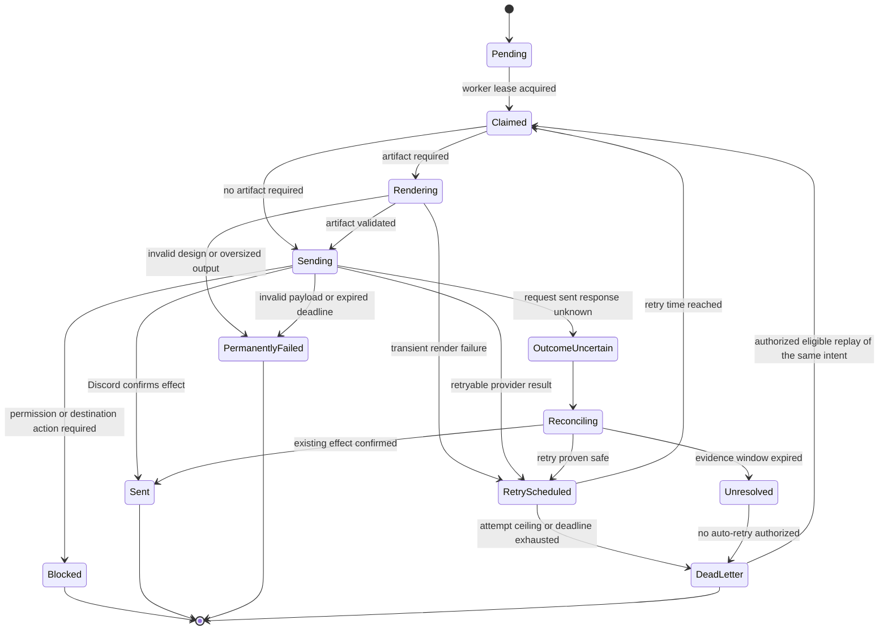
```mermaid
stateDiagram-v2
    [*] --> Pending
    Pending --> Claimed: worker lease acquired
    Claimed --> Rendering: artifact required
    Claimed --> Sending: no artifact required
    Rendering --> Sending: artifact validated
    Rendering --> RetryScheduled: transient render failure
    Rendering --> PermanentlyFailed: invalid design or oversized output
    Sending --> Sent: Discord confirms effect
    Sending --> RetryScheduled: retryable provider result
    Sending --> OutcomeUncertain: request sent response unknown
    Sending --> Blocked: permission or destination action required
    Sending --> PermanentlyFailed: invalid payload or expired deadline
    RetryScheduled --> Claimed: retry time reached
    OutcomeUncertain --> Reconciling
    Reconciling --> Sent: existing effect confirmed
    Reconciling --> RetryScheduled: retry proven safe
    Reconciling --> Unresolved: evidence window expired
    RetryScheduled --> DeadLetter: attempt ceiling or deadline exhausted
    Unresolved --> DeadLetter: no auto-retry authorized
    Blocked --> [*]
    DeadLetter --> Claimed: authorized eligible replay of the same intent
    Sent --> [*]
    PermanentlyFailed --> [*]
    DeadLetter --> [*]
```

`Unresolved` is not silently successful. After the evidence window it becomes a dead letter unless an operator already resolved it. Replay of a dead letter MUST be explicit, eligible, and a new attempt generation. It MUST NOT resend blindly.

A `Blocked` intent is terminal. Administrator or owner-module correction MUST NOT rewrite its pinned destination, definition revision, configuration revision, or effect kind, and MUST NOT return that row to `Pending`. Correction admits a **new** delivery intent with a new idempotency key. The new intent MAY pin the same revisions if only provider capability changed, or newer published revisions if catalog or configuration changed.

#### Decision Record DR-012

**Status:** Accepted.

**Decision:** Delivery pins are immutable after admission. `Blocked → Pending` is forbidden. Correction is a new intent. Dead-letter replay remains a new attempt generation of the same intent and the same pins.

**Rejected Alternative:** Mutating a blocked intent's pinned revisions so it can re-enter `Pending`; treating a Discord permission grant as an in-place unblocking of the same row.

### 10.2 Message definition lifecycle

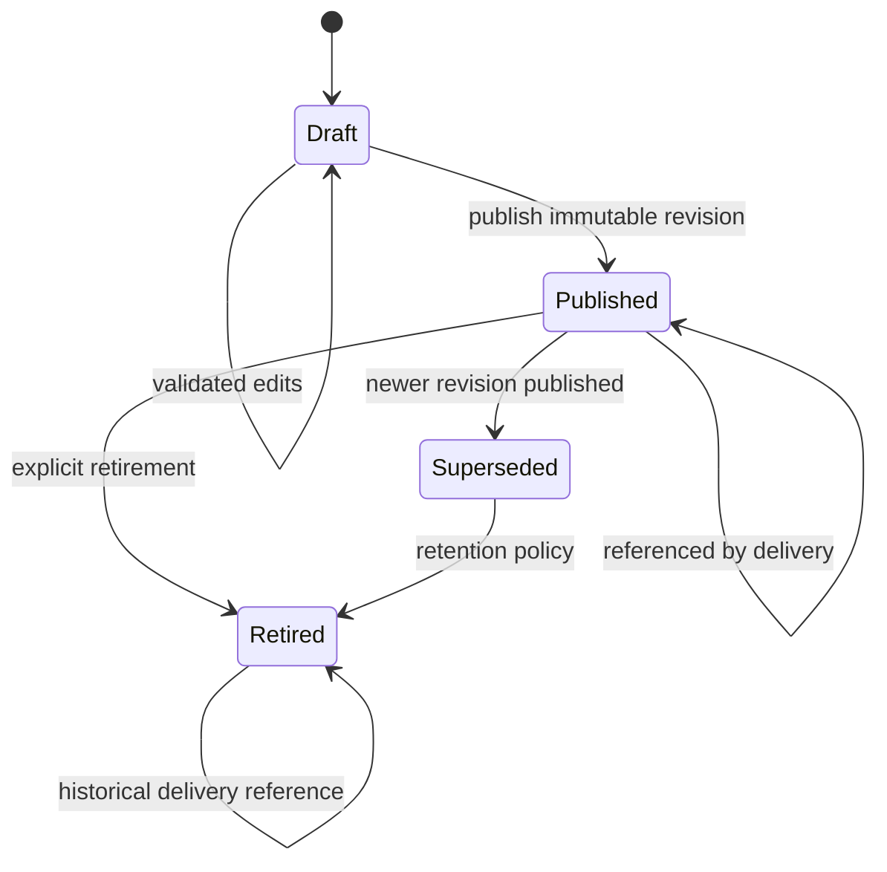
```mermaid
stateDiagram-v2
    [*] --> Draft
    Draft --> Draft: validated edits
    Draft --> Published: publish immutable revision
    Published --> Superseded: newer revision published
    Published --> Retired: explicit retirement
    Superseded --> Retired: retention policy
    Published --> Published: referenced by delivery
    Retired --> Retired: historical delivery reference
```

### 10.3 Schedule lifecycle

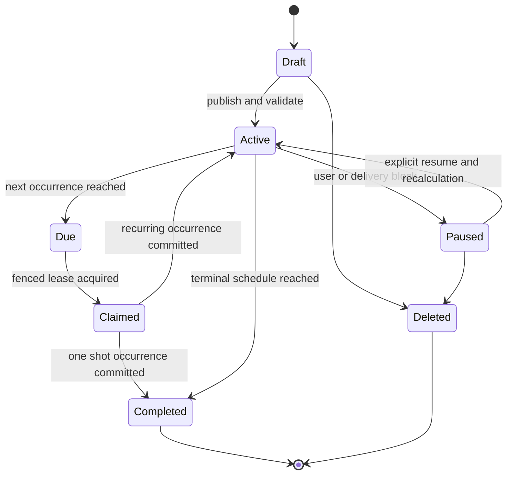
```mermaid
stateDiagram-v2
    [*] --> Draft
    Draft --> Active: publish and validate
    Active --> Due: next occurrence reached
    Due --> Claimed: fenced lease acquired
    Claimed --> Active: recurring occurrence committed
    Claimed --> Completed: one shot occurrence committed
    Active --> Paused: user or delivery block
    Paused --> Active: explicit resume and recalculation
    Active --> Completed: terminal schedule reached
    Draft --> Deleted
    Paused --> Deleted
    Completed --> [*]
    Deleted --> [*]
```

### 10.4 Asset lifecycle

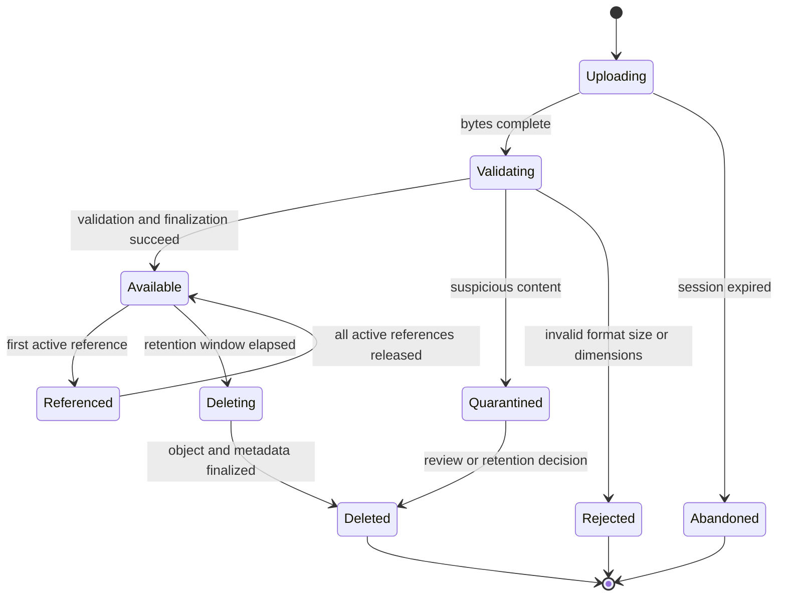
```mermaid
stateDiagram-v2
    [*] --> Uploading
    Uploading --> Validating: bytes complete
    Uploading --> Abandoned: session expired
    Validating --> Available: validation and finalization succeed
    Validating --> Quarantined: suspicious content
    Validating --> Rejected: invalid format size or dimensions
    Available --> Referenced: first active reference
    Referenced --> Available: all active references released
    Available --> Deleting: retention window elapsed
    Deleting --> Deleted: object and metadata finalized
    Quarantined --> Deleted: review or retention decision
    Rejected --> [*]
    Abandoned --> [*]
    Deleted --> [*]
```

### 10.5 Moderation case lifecycle

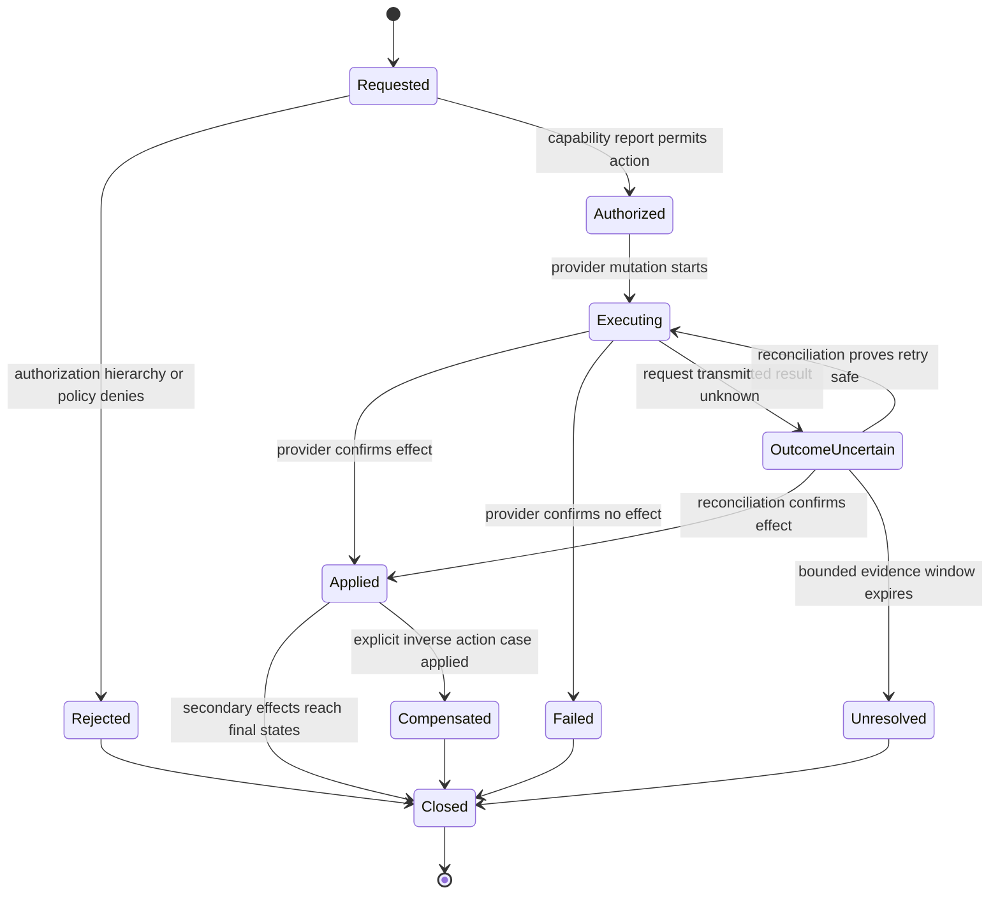
```mermaid
stateDiagram-v2
    [*] --> Requested
    Requested --> Rejected: authorization hierarchy or policy denies
    Requested --> Authorized: capability report permits action
    Authorized --> Executing: provider mutation starts
    Executing --> Applied: provider confirms effect
    Executing --> Failed: provider confirms no effect
    Executing --> OutcomeUncertain: request transmitted result unknown
    OutcomeUncertain --> Applied: reconciliation confirms effect
    OutcomeUncertain --> Executing: reconciliation proves retry safe
    OutcomeUncertain --> Unresolved: bounded evidence window expires
    Applied --> Closed: secondary effects reach final states
    Applied --> Compensated: explicit inverse action case applied
    Rejected --> Closed
    Failed --> Closed
    Unresolved --> Closed
    Compensated --> Closed
    Closed --> [*]
```

### 10.6 Automatic moderation incident lifecycle

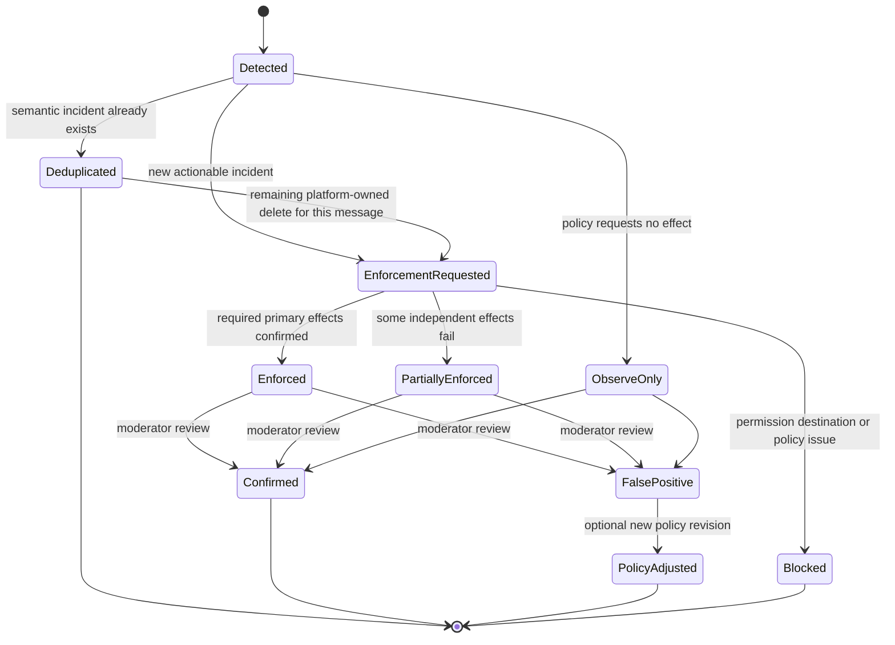
```mermaid
stateDiagram-v2
    [*] --> Detected
    Detected --> Deduplicated: semantic incident already exists
    Detected --> ObserveOnly: policy requests no effect
    Detected --> EnforcementRequested: new actionable incident
    Deduplicated --> EnforcementRequested: remaining platform-owned delete for this message
    EnforcementRequested --> Enforced: required primary effects confirmed
    EnforcementRequested --> PartiallyEnforced: some independent effects fail
    EnforcementRequested --> Blocked: permission destination or policy issue
    Enforced --> Confirmed: moderator review
    Enforced --> FalsePositive: moderator review
    PartiallyEnforced --> Confirmed: moderator review
    PartiallyEnforced --> FalsePositive: moderator review
    ObserveOnly --> Confirmed
    ObserveOnly --> FalsePositive
    FalsePositive --> PolicyAdjusted: optional new policy revision
    Deduplicated --> [*]
    Confirmed --> [*]
    PolicyAdjusted --> [*]
    Blocked --> [*]
```

`Deduplicated` suppresses additional member sanctions and alerts. It MAY still enter `EnforcementRequested` for a remaining platform-owned message deletion when the incident still names that message and no deletion request exists for the pair. Deletion is not a member sanction.

### 10.7 Cleanup sweep lifecycle

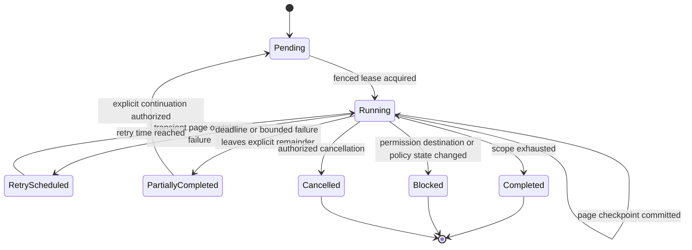
```mermaid
stateDiagram-v2
    [*] --> Pending
    Pending --> Running: fenced lease acquired
    Running --> Running: page checkpoint committed
    Running --> RetryScheduled: transient page or delete failure
    RetryScheduled --> Running: retry time reached
    Running --> PartiallyCompleted: deadline or bounded failure leaves explicit remainder
    Running --> Completed: scope exhausted
    Running --> Blocked: permission destination or policy state changed
    Running --> Cancelled: authorized cancellation
    PartiallyCompleted --> Pending: explicit continuation authorized
    Completed --> [*]
    Blocked --> [*]
    Cancelled --> [*]
```

### 10.8 Security incident lifecycle

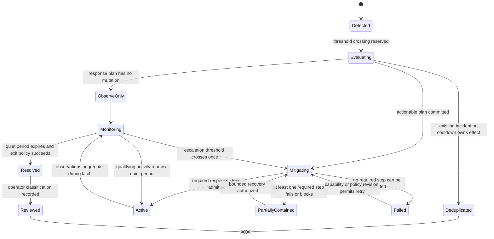
```mermaid
stateDiagram-v2
    [*] --> Detected
    Detected --> Evaluating: threshold crossing reserved
    Evaluating --> ObserveOnly: response plan has no mutation
    Evaluating --> Mitigating: actionable plan committed
    Evaluating --> Deduplicated: existing incident or cooldown owns effect
    Mitigating --> Active: required response steps admitted
    Mitigating --> PartiallyContained: at least one required step fails or blocks
    Mitigating --> Failed: no required step can be admitted
    Active --> Monitoring: observations aggregate during latch
    Monitoring --> Active: qualifying activity renews quiet period
    Monitoring --> Mitigating: escalation threshold crosses once
    Monitoring --> Resolved: quiet period expires and exit policy succeeds
    PartiallyContained --> Mitigating: bounded recovery authorized
    Failed --> Mitigating: capability or policy revision permits retry
    ObserveOnly --> Monitoring
    Deduplicated --> [*]
    Resolved --> Reviewed: operator classification recorded
    Reviewed --> [*]
```

### 10.9 Containment operation lifecycle

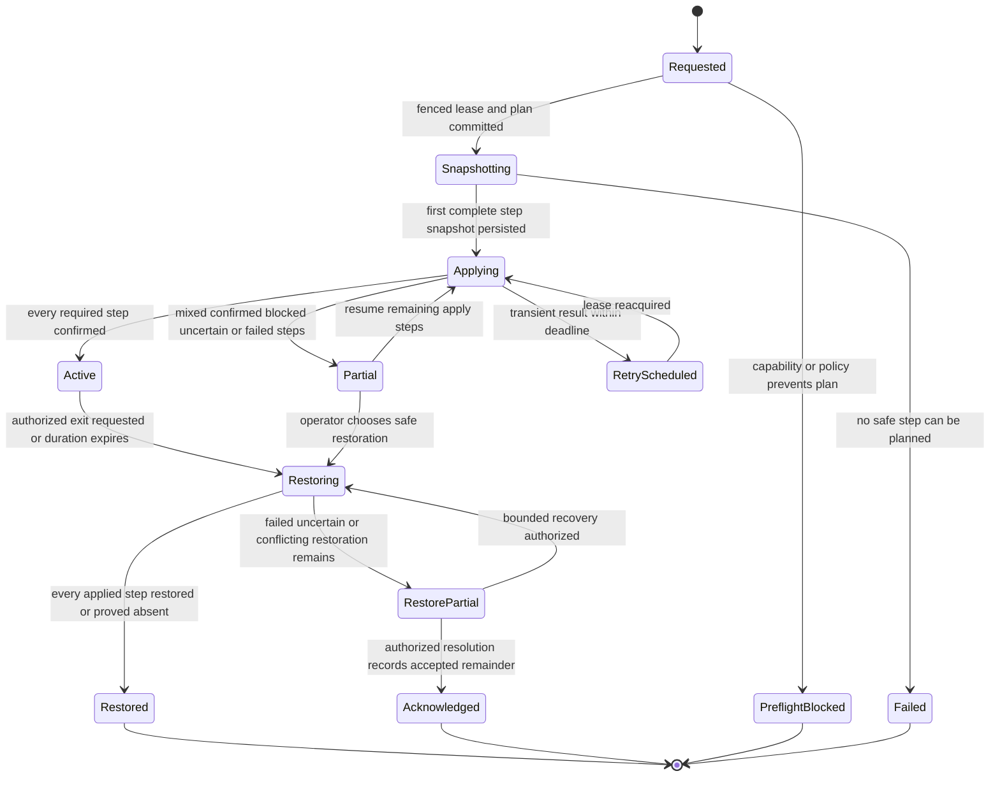
```mermaid
stateDiagram-v2
    [*] --> Requested
    Requested --> PreflightBlocked: capability or policy prevents plan
    Requested --> Snapshotting: fenced lease and plan committed
    Snapshotting --> Applying: first complete step snapshot persisted
    Snapshotting --> Failed: no safe step can be planned
    Applying --> Active: every required step confirmed
    Applying --> Partial: mixed confirmed blocked uncertain or failed steps
    Applying --> RetryScheduled: transient result within deadline
    RetryScheduled --> Applying: lease reacquired
    Active --> Restoring: authorized exit requested or duration expires
    Partial --> Applying: resume remaining apply steps
    Partial --> Restoring: operator chooses safe restoration
    Restoring --> Restored: every applied step restored or proved absent
    Restoring --> RestorePartial: failed uncertain or conflicting restoration remains
    RestorePartial --> Restoring: bounded recovery authorized
    RestorePartial --> Acknowledged: authorized resolution records accepted remainder
    Restored --> [*]
    Acknowledged --> [*]
    PreflightBlocked --> [*]
    Failed --> [*]
```

### 10.10 Role assignment lifecycle

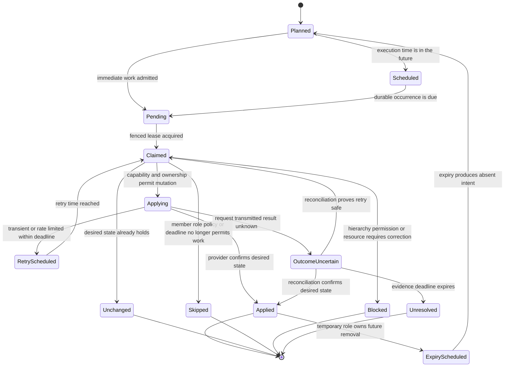
```mermaid
stateDiagram-v2
    [*] --> Planned
    Planned --> Scheduled: execution time is in the future
    Planned --> Pending: immediate work admitted
    Scheduled --> Pending: durable occurrence is due
    Pending --> Claimed: fenced lease acquired
    Claimed --> Unchanged: desired state already holds
    Claimed --> Applying: capability and ownership permit mutation
    Claimed --> Skipped: member role policy or deadline no longer permits work
    Claimed --> Blocked: hierarchy permission or resource requires correction
    Applying --> Applied: provider confirms desired state
    Applying --> RetryScheduled: transient or rate limited within deadline
    Applying --> OutcomeUncertain: request transmitted result unknown
    RetryScheduled --> Claimed: retry time reached
    OutcomeUncertain --> Applied: reconciliation confirms desired state
    OutcomeUncertain --> Claimed: reconciliation proves retry safe
    OutcomeUncertain --> Unresolved: evidence deadline expires
    Applied --> ExpiryScheduled: temporary role owns future removal
    ExpiryScheduled --> Planned: expiry produces absent intent
    Applied --> [*]
    Unchanged --> [*]
    Skipped --> [*]
    Blocked --> [*]
    Unresolved --> [*]
```

Cases-owned punitive member-role intents use this same machine. Cases MUST NOT run a second Transport executor for add or remove (DR-068).

#### Decision Record DR-068

**Status:** Accepted.

**Decision:** Role Policy and Assignment is the sole platform client of Discord Transport for member-role add and remove. Those operations are one-role add or remove, never a replace of the member's complete role list. Moderation Cases remains the owner of punitive member-role desired state: quarantine present or absent, dangerous-role absent, and other case-owned role relations. Cases publishes those relations as assignment intents with a Cases ownership key and MUST NOT call Transport for member-role add or remove. Timeout, kick, ban, unban, purge, slowmode, and channel lock remain Cases through Transport. Role Resource remains the sole writer of guild-role catalog mutations and MUST NOT add or remove member roles. Assignment MUST NOT author punitive desired state or reinterpret a Cases-owned relation as automatic or self-service ownership. For the same guild, member, and role, Cases or security ownership outranks automatic and self-service ownership. Discord hierarchy and bot capability are rechecked immediately before each Transport mutation. DR-014 catalog ownership and DR-020 `protected_targets` ownership are unchanged.

**Rejected Alternative:** Cases and Assignment both calling Transport for member-role mutations; replacing the member's complete role list; Assignment authoring punitive desired state; Role Resource adding or removing member roles; merging Cases ownership into auto-role policy.

### 10.11 Role panel publication lifecycle

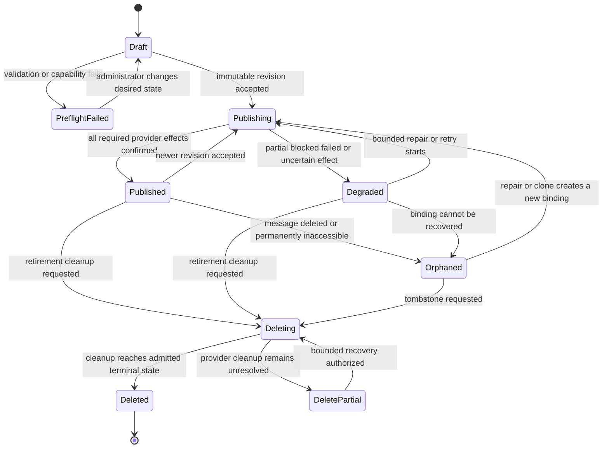
```mermaid
stateDiagram-v2
    [*] --> Draft
    Draft --> PreflightFailed: validation or capability fails
    PreflightFailed --> Draft: administrator changes desired state
    Draft --> Publishing: immutable revision accepted
    Publishing --> Published: all required provider effects confirmed
    Publishing --> Degraded: partial blocked failed or uncertain effect
    Degraded --> Publishing: bounded repair or retry starts
    Published --> Publishing: newer revision accepted
    Published --> Orphaned: message deleted or permanently inaccessible
    Degraded --> Orphaned: binding cannot be recovered
    Orphaned --> Publishing: repair or clone creates a new binding
    Published --> Deleting: retirement cleanup requested
    Degraded --> Deleting: retirement cleanup requested
    Orphaned --> Deleting: tombstone requested
    Deleting --> Deleted: cleanup reaches admitted terminal state
    Deleting --> DeletePartial: provider cleanup remains unresolved
    DeletePartial --> Deleting: bounded recovery authorized
    Deleted --> [*]
```

### 10.12 Role resource mutation lifecycle

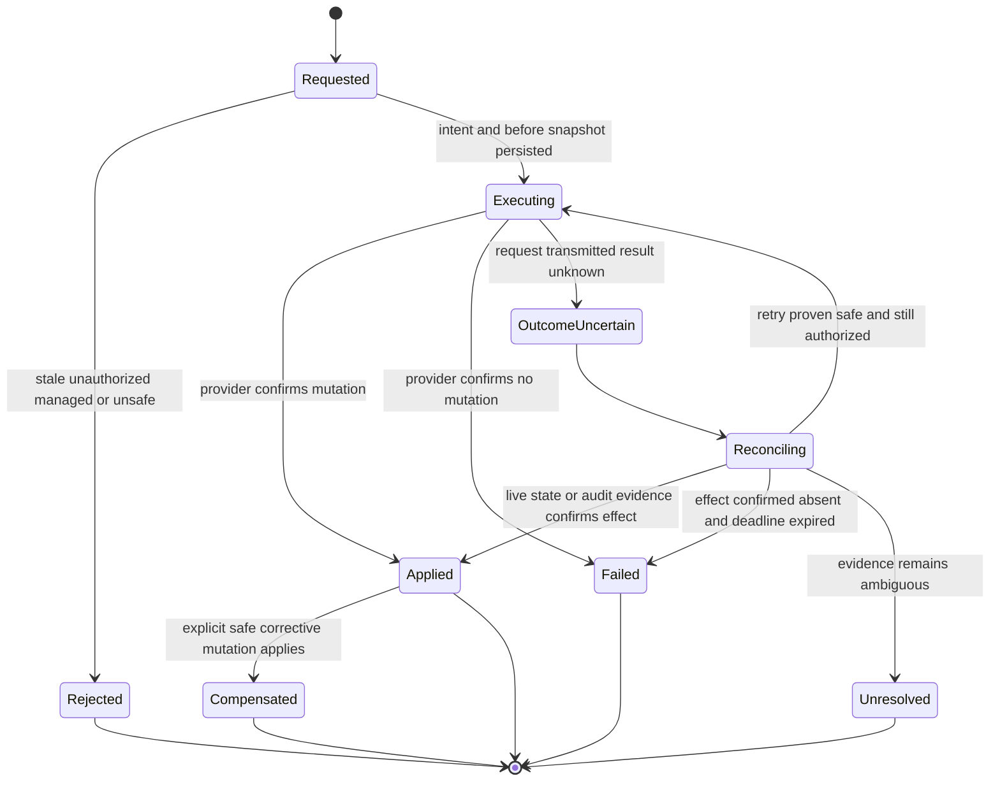
```mermaid
stateDiagram-v2
    [*] --> Requested
    Requested --> Rejected: stale unauthorized managed or unsafe
    Requested --> Executing: intent and before snapshot persisted
    Executing --> Applied: provider confirms mutation
    Executing --> Failed: provider confirms no mutation
    Executing --> OutcomeUncertain: request transmitted result unknown
    OutcomeUncertain --> Reconciling
    Reconciling --> Applied: live state or audit evidence confirms effect
    Reconciling --> Failed: effect confirmed absent and deadline expired
    Reconciling --> Executing: retry proven safe and still authorized
    Reconciling --> Unresolved: evidence remains ambiguous
    Applied --> Compensated: explicit safe corrective mutation applies
    Applied --> [*]
    Compensated --> [*]
    Rejected --> [*]
    Failed --> [*]
    Unresolved --> [*]
```

### 10.13 Voice progression session lifecycle

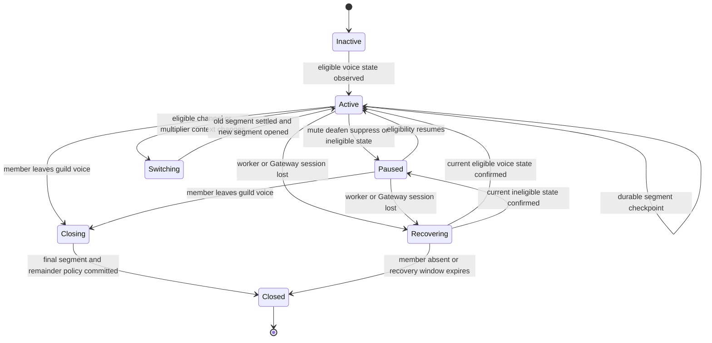
```mermaid
stateDiagram-v2
    [*] --> Inactive
    Inactive --> Active: eligible voice state observed
    Active --> Active: durable segment checkpoint
    Active --> Paused: mute deafen suppress or ineligible state
    Paused --> Active: eligibility resumes
    Active --> Switching: eligible channel or multiplier context changes
    Switching --> Active: old segment settled and new segment opened
    Active --> Closing: member leaves guild voice
    Paused --> Closing: member leaves guild voice
    Closing --> Closed: final segment and remainder policy committed
    Active --> Recovering: worker or Gateway session lost
    Paused --> Recovering: worker or Gateway session lost
    Recovering --> Active: current eligible voice state confirmed
    Recovering --> Paused: current ineligible state confirmed
    Recovering --> Closed: member absent or recovery window expires
    Closed --> [*]
```

### 10.14 Starboard projection lifecycle

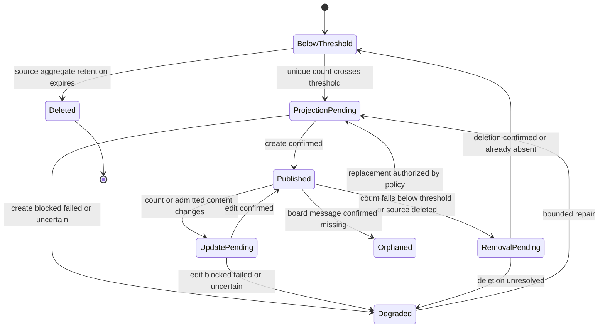
```mermaid
stateDiagram-v2
    [*] --> BelowThreshold
    BelowThreshold --> ProjectionPending: unique count crosses threshold
    ProjectionPending --> Published: create confirmed
    ProjectionPending --> Degraded: create blocked failed or uncertain
    Published --> UpdatePending: count or admitted content changes
    UpdatePending --> Published: edit confirmed
    UpdatePending --> Degraded: edit blocked failed or uncertain
    Published --> RemovalPending: count falls below threshold or source deleted
    RemovalPending --> BelowThreshold: deletion confirmed or already absent
    RemovalPending --> Degraded: deletion unresolved
    Published --> Orphaned: board message confirmed missing
    Degraded --> ProjectionPending: bounded repair
    Orphaned --> ProjectionPending: replacement authorized by policy
    BelowThreshold --> Deleted: source aggregate retention expires
    Deleted --> [*]
```

### 10.15 Giveaway lifecycle

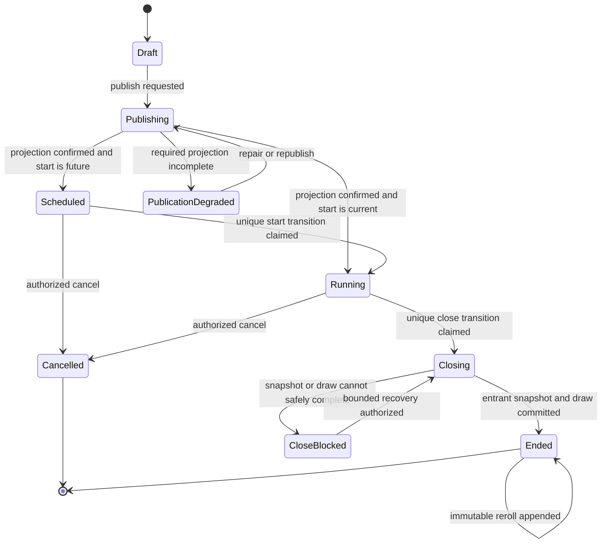
```mermaid
stateDiagram-v2
    [*] --> Draft
    Draft --> Publishing: publish requested
    Publishing --> Scheduled: projection confirmed and start is future
    Publishing --> Running: projection confirmed and start is current
    Publishing --> PublicationDegraded: required projection incomplete
    PublicationDegraded --> Publishing: repair or republish
    Scheduled --> Running: unique start transition claimed
    Scheduled --> Cancelled: authorized cancel
    Running --> Closing: unique close transition claimed
    Running --> Cancelled: authorized cancel
    Closing --> Ended: entrant snapshot and draw committed
    Closing --> CloseBlocked: snapshot or draw cannot safely complete
    CloseBlocked --> Closing: bounded recovery authorized
    Ended --> Ended: immutable reroll appended
    Cancelled --> [*]
    Ended --> [*]
```

### 10.16 Form submission lifecycle

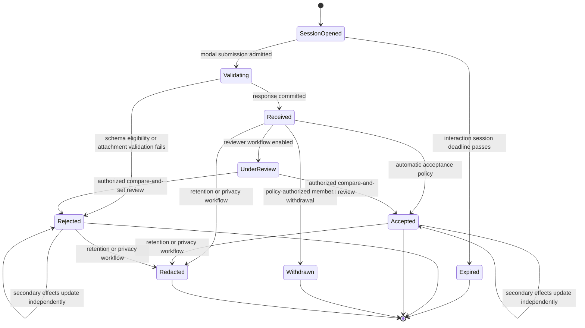
```mermaid
stateDiagram-v2
    [*] --> SessionOpened
    SessionOpened --> Expired: interaction session deadline passes
    SessionOpened --> Validating: modal submission admitted
    Validating --> Rejected: schema eligibility or attachment validation fails
    Validating --> Received: response committed
    Received --> UnderReview: reviewer workflow enabled
    Received --> Accepted: automatic acceptance policy
    UnderReview --> Accepted: authorized compare-and-set review
    UnderReview --> Rejected: authorized compare-and-set review
    Accepted --> Accepted: secondary effects update independently
    Rejected --> Rejected: secondary effects update independently
    Received --> Withdrawn: policy-authorized member withdrawal
    Received --> Redacted: retention or privacy workflow
    Accepted --> Redacted: retention or privacy workflow
    Rejected --> Redacted: retention or privacy workflow
    Expired --> [*]
    Rejected --> [*]
    Accepted --> [*]
    Withdrawn --> [*]
    Redacted --> [*]
```

### 10.17 Temporary room lifecycle

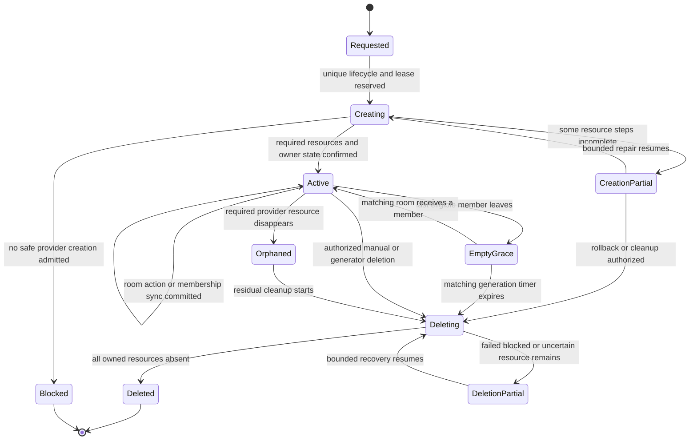
```mermaid
stateDiagram-v2
    [*] --> Requested
    Requested --> Creating: unique lifecycle and lease reserved
    Creating --> Active: required resources and owner state confirmed
    Creating --> CreationPartial: some resource steps incomplete
    Creating --> Blocked: no safe provider creation admitted
    CreationPartial --> Creating: bounded repair resumes
    CreationPartial --> Deleting: rollback or cleanup authorized
    Active --> Active: room action or membership sync committed
    Active --> EmptyGrace: last eligible member leaves
    EmptyGrace --> Active: matching room receives a member
    EmptyGrace --> Deleting: matching generation timer expires
    Active --> Deleting: authorized manual or generator deletion
    Deleting --> Deleted: all owned resources absent
    Deleting --> DeletionPartial: failed blocked or uncertain resource remains
    DeletionPartial --> Deleting: bounded recovery resumes
    Active --> Orphaned: required provider resource disappears
    Orphaned --> Deleting: residual cleanup starts
    Deleted --> [*]
    Blocked --> [*]
```

### 10.18 Monetary hold lifecycle

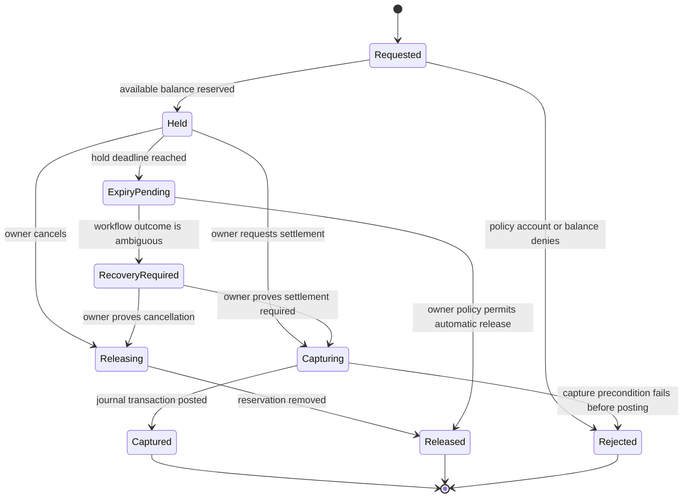
```mermaid
stateDiagram-v2
    [*] --> Requested
    Requested --> Held: available balance reserved
    Requested --> Rejected: policy account or balance denies
    Held --> Capturing: owner requests settlement
    Held --> Releasing: owner cancels
    Held --> ExpiryPending: hold deadline reached
    Capturing --> Captured: journal transaction posted
    Capturing --> Rejected: capture precondition fails before posting
    Releasing --> Released: reservation removed
    ExpiryPending --> Released: owner policy permits automatic release
    ExpiryPending --> RecoveryRequired: workflow outcome is ambiguous
    RecoveryRequired --> Capturing: owner proves settlement required
    RecoveryRequired --> Releasing: owner proves cancellation
    Captured --> [*]
    Released --> [*]
    Rejected --> [*]
```

### 10.19 Income action lifecycle

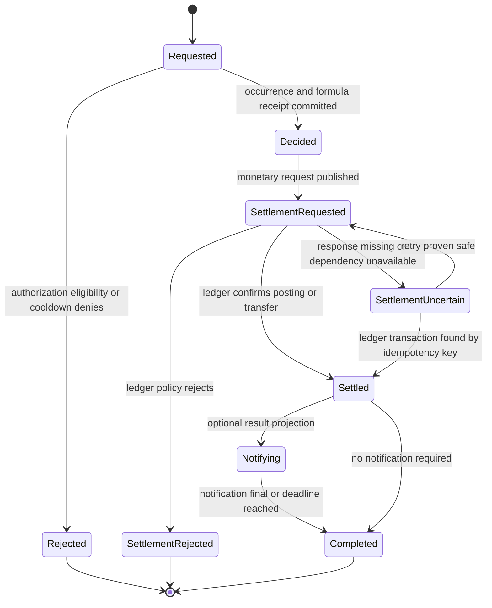
```mermaid
stateDiagram-v2
    [*] --> Requested
    Requested --> Rejected: authorization eligibility or cooldown denies
    Requested --> Decided: occurrence and formula receipt committed
    Decided --> SettlementRequested: monetary request published
    SettlementRequested --> Settled: ledger confirms posting or transfer
    SettlementRequested --> SettlementRejected: ledger policy rejects
    SettlementRequested --> SettlementUncertain: response missing or dependency unavailable
    SettlementUncertain --> Settled: ledger transaction found by idempotency key
    SettlementUncertain --> SettlementRequested: retry proven safe
    Settled --> Notifying: optional result projection
    Notifying --> Completed: notification final or deadline reached
    Settled --> Completed: no notification required
    Rejected --> [*]
    SettlementRejected --> [*]
    Completed --> [*]
```

### 10.20 Purchase lifecycle

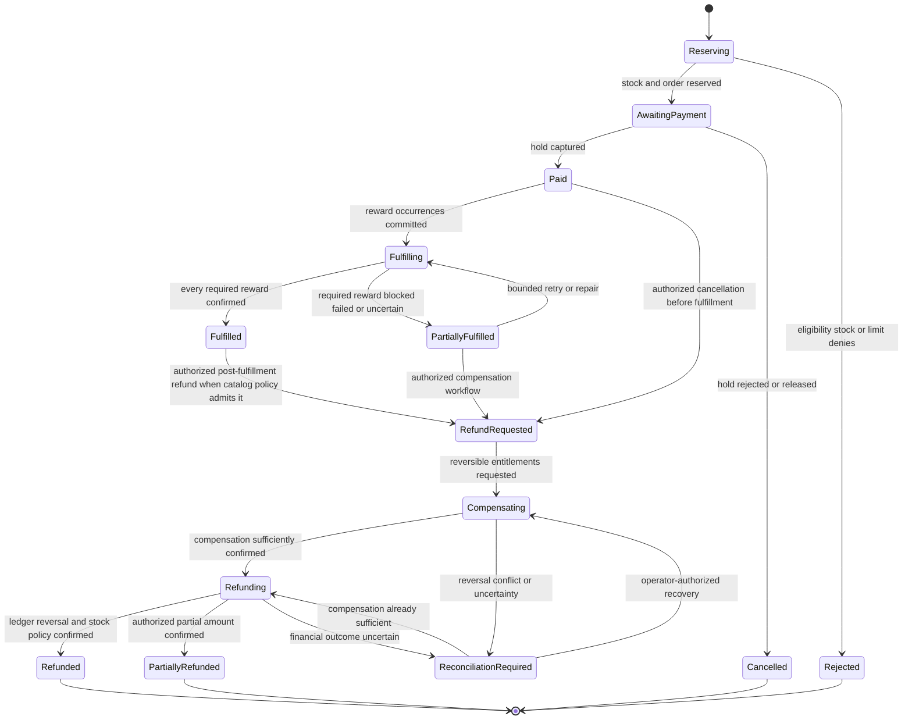
```mermaid
stateDiagram-v2
    [*] --> Reserving
    Reserving --> AwaitingPayment: stock and order reserved
    Reserving --> Rejected: eligibility stock or limit denies
    AwaitingPayment --> Paid: hold captured
    AwaitingPayment --> Cancelled: hold rejected or released
    Paid --> Fulfilling: reward occurrences committed
    Fulfilling --> Fulfilled: every required reward confirmed
    Fulfilling --> PartiallyFulfilled: required reward blocked failed or uncertain
    PartiallyFulfilled --> Fulfilling: bounded retry or repair
    Paid --> RefundRequested: authorized cancellation before fulfillment
    PartiallyFulfilled --> RefundRequested: authorized compensation workflow
    RefundRequested --> Compensating: reversible entitlements requested
    Compensating --> Refunding: compensation sufficiently confirmed
    Compensating --> ReconciliationRequired: reversal conflict or uncertainty
    Refunding --> Refunded: ledger reversal and stock policy confirmed
    Refunding --> PartiallyRefunded: authorized partial amount confirmed
    Refunding --> ReconciliationRequired: financial outcome uncertain
    ReconciliationRequired --> Compensating: operator-authorized recovery
    ReconciliationRequired --> Refunding: compensation already sufficient
    Fulfilled --> RefundRequested: authorized post-fulfillment refund when catalog policy admits it
    Refunded --> [*]
    PartiallyRefunded --> [*]
    Cancelled --> [*]
    Rejected --> [*]
```

`Fulfilled` is a resting state, not a sink. Capture remains an immutable journal posting. A later refund is a new process manager ([19-economy.md](19-economy.md) §30.28): it asks each activated required entitlement whether reversal is safe, posts a new balanced ledger reversal, and returns stock only when policy permits. Non-reversible rewards may deny the refund, allow a partial refund, allow a full refund with an acknowledged retained benefit, or require operator review. They MUST NOT rewrite history or skip compensation.

#### Decision Record DR-007

**Status:** Accepted.

**Decision:** A guild-shop purchase in `Fulfilled` MAY enter `RefundRequested` when catalog and actor policy admit it. The same process manager applies after capture whether fulfillment is complete or partial. `Paid --> RefundRequested` remains the path for cancellation before fulfillment.

**Rejected Alternative:** Treating `Fulfilled` as unrefundable; editing the capture posting; collapsing Stripe commercial refunds into this virtual-currency machine.

### 10.21 Guild Reward Entitlement lifecycle

```mermaid
stateDiagram-v2
    [*] --> Requested
    Requested --> Activating: grant validated and occurrence reserved
    Requested --> Rejected: dependency policy or ownership invalid
    Activating --> Active: required effects confirmed
    Activating --> ActivationPartial: effect blocked failed or uncertain
    ActivationPartial --> Activating: bounded repair
    Active --> ExpiryScheduled: bounded duration applies
    Active --> Revoking: compensation or manual revocation admitted
    ExpiryScheduled --> Revoking: matching expiry generation due
    Revoking --> Revoked: owned effect confirmed absent
    Revoking --> CompensationConflict: external change prevents safe reversal
    Revoking --> RevocationPartial: effect remains blocked failed or uncertain
    RevocationPartial --> Revoking: bounded recovery
    CompensationConflict --> Revoking: operator resolves ownership conflict
    Active --> [*]
    Revoked --> [*]
    Rejected --> [*]
```

This machine is `GuildRewardEntitlement`. It is not Platform Entitlement `Grace` and not `GRANT_SOURCE` (DR-066). Unprefixed `Entitlement*` names MUST fail closed at parse. This machine MUST NOT apply `PlatformEntitlement*` leaves or `GRANT_SOURCE` (DR-069).

#### Decision Record DR-066

**Status:** Accepted.

**Decision:** The guild commerce-reward owner remains module 7.35 and is not deleted. Its public contracts are `GuildRewardEntitlement`. Platform Entitlement remains `PlatformEntitlement`. An unprefixed public type `Entitlement` is forbidden.

**Rejected Alternative:** Deleting module 7.35; merging with Platform Entitlement; renaming Platform Entitlement; treating `GRANT_SOURCE` as a guild reward.

#### Decision Record DR-069

**Status:** Accepted.

**Decision:** Public entitlement contracts are only `GuildRewardEntitlement*` for module 7.35 and `PlatformEntitlement*` for module 7.55. An envelope whose `schema_name` is unprefixed `Entitlement` or any other Entitlement-shaped name MUST fail closed at parse. Platform Entitlement MUST reject `GuildRewardEntitlement*` at inbox apply. Module 7.35 MUST reject `PlatformEntitlement*` leaves and MUST NOT apply `GRANT_SOURCE`. Consumers MUST NOT infer the plane from payload fields. The private `ENTITLEMENT` table remains guild-reward storage and MUST NOT be Platform Entitlement's journal. DR-066 ownership and public names are unchanged.

**Rejected Alternative:** Guessing guild versus platform from payload; applying unprefixed `Entitlement*` into either journal; sharing one Entitlement inbox; treating `ENTITLEMENT` as Platform Entitlement storage.

### 10.22 Casino game session lifecycle

```mermaid
stateDiagram-v2
    [*] --> Opening
    Opening --> AwaitingChoice: session created without committed stake
    Opening --> Blocked: policy or capacity denies
    AwaitingChoice --> HoldingWager: player commits a choice and stake
    HoldingWager --> Active: ledger hold confirmed
    HoldingWager --> Cancelled: hold rejected
    Active --> Active: valid versioned player action
    Active --> OutcomeCommitted: terminal result durably committed
    Active --> ExpiryEvaluating: inactivity deadline reached
    ExpiryEvaluating --> OutcomeCommitted: rules define forced settlement
    ExpiryEvaluating --> Cancelled: rules permit hold release
    OutcomeCommitted --> Settling: immutable ledger request published
    Settling --> Settled: capture and payout confirmed
    Settling --> RecoveryRequired: settlement response uncertain
    RecoveryRequired --> Settling: ledger reconciliation proves retry safe
    RecoveryRequired --> Settled: prior settlement confirmed
    Settled --> [*]
    Cancelled --> [*]
    Blocked --> [*]
```

### 10.23 Support panel lifecycle

```mermaid
stateDiagram-v2
    [*] --> Draft
    Draft --> PreflightFailed: policy destination or component invalid
    PreflightFailed --> Draft: authorized edit
    Draft --> Publishing: immutable revision accepted
    Publishing --> Published: required message and components confirmed
    Publishing --> Degraded: partial blocked failed or uncertain effect
    Published --> Publishing: newer revision accepted
    Published --> Disabled: interaction admission disabled
    Disabled --> Publishing: re-enable with immutable revision
    Published --> Orphaned: binding missing or application identity changed
    Degraded --> Publishing: bounded repair
    Orphaned --> Publishing: recreate or rebind authorized
    Published --> Retiring: retirement requested
    Disabled --> Retiring: retirement requested
    Orphaned --> Retiring: tombstone requested
    Retiring --> Retired: declared message behavior confirmed
    Retiring --> Degraded: cleanup incomplete
    Retired --> [*]
```

### 10.24 Support case lifecycle

```mermaid
stateDiagram-v2
    [*] --> IntakePending
    IntakePending --> Provisioning: intake complete and capacity reserved
    IntakePending --> Rejected: eligibility intake or capacity denies
    IntakePending --> Cancelled: member or authorized expiry cancels
    Provisioning --> Open: required support resource active
    Provisioning --> RecoveryRequired: resource partial blocked or uncertain
    Provisioning --> Cancelled: safe cancellation before active resource
    RecoveryRequired --> Provisioning: bounded repair
    Open --> Claimed: authorized staff claim
    Claimed --> Open: authorized unclaim
    Open --> Waiting: waiting state applied
    Claimed --> Waiting: waiting state applied
    Waiting --> Open: wait condition cleared
    Waiting --> Claimed: assignee resumes
    Open --> Escalated: policy or authorized escalation
    Claimed --> Escalated: policy or authorized escalation
    Waiting --> Escalated: deadline or authorized escalation
    Escalated --> Claimed: assignee accepts
    Open --> Resolved: resolution recorded
    Claimed --> Resolved: resolution recorded
    Waiting --> Resolved: resolution recorded
    Escalated --> Resolved: resolution recorded
    Resolved --> Closing: close policy starts
    Resolved --> Reopening: reopen admitted
    Closing --> Closed: capacity released and terminal state committed
    Closing --> CloseBlocked: resource or archive resolution required
    CloseBlocked --> Closing: bounded recovery or authorized archive decision
    Closed --> Reopening: reopen window and capacity allow
    Reopening --> Provisioning: new generation reserved
    Reopening --> Rejected: capacity or policy denies
    Rejected --> [*]
    Cancelled --> [*]
    Closed --> [*]
```

### 10.25 Support resource lifecycle

```mermaid
stateDiagram-v2
    [*] --> Requested
    Requested --> PreflightBlocked: capability parent or policy invalid
    Requested --> Provisioning: fenced operation starts
    Provisioning --> Active: required resource and access confirmed
    Provisioning --> Partial: effect blocked failed or uncertain
    Partial --> Provisioning: bounded repair
    Active --> UpdatingAccess: participant or policy change
    UpdatingAccess --> Active: desired access confirmed
    UpdatingAccess --> Partial: one or more effects unresolved
    Active --> Frozen: close or archive presentation applied
    Frozen --> Active: reopen generation admitted
    Active --> Orphaned: primary resource confirmed absent
    Frozen --> Deleting: cleanup requested
    Active --> Deleting: authorized immediate cleanup
    Orphaned --> Deleting: residual cleanup requested
    Deleting --> Deleted: all owned resources absent
    Deleting --> DeletePartial: effect failed blocked uncertain or conflicted
    DeletePartial --> Deleting: bounded recovery
    Deleted --> [*]
    PreflightBlocked --> [*]
```

### 10.26 Support transcript lifecycle

```mermaid
stateDiagram-v2
    [*] --> Capturing
    Capturing --> GapDetected: event or content coverage loss
    GapDetected --> Capturing: bounded recovery adds evidence
    Capturing --> Finalizing: case capture boundary reached
    GapDetected --> Finalizing: policy permits incomplete artifact
    Finalizing --> Generating: ordered archive snapshot committed
    Generating --> Completed: artifact and integrity receipt stored
    Generating --> Incomplete: artifact stored with explicit gaps
    Generating --> Failed: bounded generation cannot complete
    Completed --> DeliveryPending: destination requested
    Incomplete --> DeliveryPending: destination permits incomplete artifact
    DeliveryPending --> Delivered: required delivery confirmed
    DeliveryPending --> DeliveryPartial: blocked failed or expired delivery
    Completed --> Redacted: privacy workflow
    Incomplete --> Redacted: privacy workflow
    Delivered --> Redacted: privacy workflow
    Redacted --> Deleting: retention expires
    Completed --> Deleting: retention expires without delivery
    Incomplete --> Deleting: retention expires
    Deleting --> Deleted: metadata and asset lifecycle finalized
    Deleted --> [*]
    Completed --> [*]
    Incomplete --> [*]
    Failed --> [*]
```

### 10.27 Stream alert definition lifecycle

```mermaid
stateDiagram-v2
    [*] --> Draft
    Draft --> Resolving: provider locator submitted
    Resolving --> Draft: identity ambiguous or correction required
    Resolving --> Ready: identity and mandatory dependencies valid
    Ready --> Enabled: publish immutable revision
    Enabled --> Degraded: event transport destination or credential unhealthy
    Degraded --> Enabled: dependencies converge
    Enabled --> Disabled: explicit disablement
    Degraded --> Disabled: explicit disablement
    Disabled --> Enabled: new validated revision
    Enabled --> Superseded: newer revision published
    Degraded --> Superseded: newer revision published
    Disabled --> Retired: explicit retirement
    Superseded --> Retired: retention permits retirement
    Retired --> [*]
```

### 10.28 Provider subscription lifecycle

```mermaid
stateDiagram-v2
    [*] --> Requested
    Requested --> Creating: fenced operation acquired
    Creating --> Verifying: provider resource confirmed
    Creating --> OutcomeUncertain: response lost after transmission
    OutcomeUncertain --> Verifying: resource found and owned
    OutcomeUncertain --> Creating: absence proven and retry eligible
    Verifying --> Active: provider and endpoint verification agree
    Verifying --> Degraded: verification deadline or callback health failed
    Active --> Degraded: revocation expiry connection loss or drift
    Degraded --> Active: bounded repair succeeds
    Active --> Rotating: endpoint secret or transport generation changes
    Rotating --> Active: new generation confirmed
    Rotating --> Degraded: partial rotation
    Active --> Deleting: desired state becomes absent
    Degraded --> Deleting: desired state becomes absent
    Deleting --> Absent: owned provider resource confirmed absent
    Deleting --> Conflict: ownership or provider state ambiguous
    Conflict --> Deleting: operator or reconciliation resolves ownership
    Absent --> [*]
```

### 10.29 External live-session lifecycle

```mermaid
stateDiagram-v2
    [*] --> Unknown
    Unknown --> Offline: conclusive offline observation
    Unknown --> LiveCandidate: online event or live observation
    Offline --> LiveCandidate: new provider session observed
    LiveCandidate --> Live: confirmation policy satisfied
    LiveCandidate --> Offline: candidate disproven
    LiveCandidate --> Conflicted: sources disagree beyond policy window
    Live --> Live: same session metadata advances
    Live --> EndingCandidate: offline signal requires confirmation
    Live --> Ended: authoritative offline event
    Live --> Stale: no conclusive source within freshness boundary
    EndingCandidate --> Live: live state reconfirmed
    EndingCandidate --> Ended: offline confirmation satisfied
    Stale --> Live: same session reconfirmed
    Stale --> Ended: terminal state confirmed
    Stale --> Conflicted: incompatible session evidence
    Conflicted --> Live: resolution selects live evidence
    Conflicted --> Ended: resolution selects terminal evidence
    Ended --> LiveCandidate: different provider session observed
```

### 10.30 Stream alert occurrence lifecycle

```mermaid
stateDiagram-v2
    [*] --> Reserved
    Reserved --> Suppressed: policy duplicate or deadline decision
    Reserved --> DeliveryPending: durable Delivery intent accepted
    DeliveryPending --> Delivered: provider message confirmed
    DeliveryPending --> RetryScheduled: retryable delivery result
    DeliveryPending --> Blocked: destination mention or permission invalid
    DeliveryPending --> OutcomeUncertain: response lost after transmission
    RetryScheduled --> DeliveryPending: retry due within deadline
    OutcomeUncertain --> Delivered: existing owned message reconciled
    OutcomeUncertain --> RetryScheduled: absence proven
    OutcomeUncertain --> Unresolved: evidence window exhausted
    Delivered --> RefreshPending: coalesced metadata refresh due
    RefreshPending --> Delivered: edit confirmed or superseded
    Delivered --> OfflinePending: offline policy due
    OfflinePending --> Delivered: offline effect confirmed
    Delivered --> CleanupPending: owned cleanup due
    CleanupPending --> Cleaned: exact owned message absent
    CleanupPending --> CleanupBlocked: ownership or permission conflict
    Suppressed --> [*]
    Blocked --> [*]
    Unresolved --> [*]
    Cleaned --> [*]
```

### 10.31 Custom-command definition lifecycle

```mermaid
stateDiagram-v2
    [*] --> Draft
    Draft --> Published: immutable validation succeeds
    Published --> ProjectionPending: desired contribution accepted
    ProjectionPending --> Active: registry binding converged
    ProjectionPending --> ProjectionDegraded: provider blocked failed or uncertain
    ProjectionDegraded --> Active: reconciliation converges
    Active --> Degraded: dependency or registry drift
    Degraded --> Active: dependency repaired
    Active --> Disabled: explicit disablement revision
    Degraded --> Disabled: explicit disablement revision
    Disabled --> ProjectionPending: validated enable revision
    Active --> Superseded: newer revision published
    Degraded --> Superseded: newer revision published
    Disabled --> Retired: retention and projection permit
    Superseded --> Retired: retention and projection permit
    Retired --> [*]
```

### 10.32 Application-command projection lifecycle

```mermaid
stateDiagram-v2
    [*] --> Compiling
    Compiling --> Conflicted: owner schema or provider constraint conflict
    Conflicted --> Compiling: contribution revision resolves conflict
    Compiling --> Ready: complete desired snapshot valid
    Ready --> Projecting: fenced operation acquired
    Projecting --> Converged: provider registry fingerprint confirmed
    Projecting --> RetryScheduled: retryable provider outcome
    Projecting --> OutcomeUncertain: response lost after transmission
    RetryScheduled --> Projecting: retry due
    OutcomeUncertain --> Reconciling
    Reconciling --> Converged: desired registry already present
    Reconciling --> RetryScheduled: absence or safe delta proven
    Reconciling --> Degraded: bounded evidence cannot resolve
    Converged --> Drifted: provider observation differs
    Drifted --> Compiling: rebuild current generation
    Degraded --> Compiling: operator or dependency change
```

### 10.33 Custom-command invocation lifecycle

```mermaid
stateDiagram-v2
    [*] --> Received
    Received --> Rejected: binding policy argument or cooldown denial
    Received --> Accepted: invocation and reservations committed
    Accepted --> Executing: bounded action plan starts
    Executing --> Completed: every required action terminal success
    Executing --> PartiallyCompleted: one or more independent actions blocked or failed
    Executing --> RetryPending: eligible durable action remains
    RetryPending --> Executing: action retry due
    Accepted --> Expired: execution deadline reached before useful action
    PartiallyCompleted --> Completed: eligible repair completes
    Rejected --> [*]
    Completed --> [*]
    Expired --> [*]
```

### 10.34 Reminder occurrence lifecycle

```mermaid
stateDiagram-v2
    [*] --> Pending
    Pending --> Claimed: fenced lease acquired
    Pending --> Cancelled: owner or authorized cancellation wins
    Pending --> Superseded: reschedule or edit generation replaces occurrence
    Claimed --> Delivering: current generation and deadline valid
    Claimed --> Cancelled: cancellation advances generation before dispatch
    Claimed --> Superseded: reschedule advances generation before dispatch
    Delivering --> Delivered: one route confirms message
    Delivering --> RetryScheduled: retryable route or provider failure
    Delivering --> DeadLetter: permanent failure or retry budget exhausted
    Delivering --> Missed: delivery deadline expires
    RetryScheduled --> Claimed: retry due
    RetryScheduled --> Cancelled: cancellation wins
    RetryScheduled --> Expired: retention or maximum horizon reached
    Delivered --> Snoozed: eligible owner creates child occurrence
    Cancelled --> [*]
    Superseded --> [*]
    DeadLetter --> [*]
    Missed --> [*]
    Expired --> [*]
```

### 10.35 Authorization session lifecycle

```mermaid
stateDiagram-v2
    [*] --> OAuthPending
    OAuthPending --> Active: state proof callback and identity confirmed
    OAuthPending --> Rejected: mismatch reuse expiry or exchange failure
    Active --> Active: bounded renewal and generation unchanged
    Active --> Expired: idle or absolute boundary reached
    Active --> Revoked: logout unlink policy or ownership change
    Active --> Compromised: security event invalidates generation
    Compromised --> Revoked: incident containment completes
    Rejected --> [*]
    Expired --> [*]
    Revoked --> [*]
```

Idle expiry is 12 Clock-port hours sliding. Absolute expiry is 7 Clock-port days from creation and MUST NOT extend with activity. Step-up success rotates `credential_generation` while remaining `Active` (DR-049). The cookie is `SameSite=Lax` and is not expiry authority.

#### Decision Record DR-049

**Status:** Accepted.

**Decision:** Session cookie is `Secure`, `HttpOnly`, host-only, `SameSite=Lax`. Idle 12 hours; absolute 7 days. Discovery 15 minutes; ordinary Capability 60 seconds; high-risk live plus 5-minute step-up. Named login audit catalog without secrets.

**Rejected Alternative:** `SameSite=None` or `Strict`; cookie Max-Age as authority; high-risk from stale discovery.

### 10.36 Discord installation lifecycle

```mermaid
stateDiagram-v2
    [*] --> NotInstalled
    NotInstalled --> AuthorizationPending: install generation issued
    AuthorizationPending --> Verifying: callback consumed
    AuthorizationPending --> NotInstalled: denied expired or mismatched
    Verifying --> Installed: required enabled-module capabilities Healthy
    Verifying --> Degraded: required capability missing
    Verifying --> AuthorizationPending: provider state not yet observable
    Installed --> Degraded: permission command intent or dependency drift
    Degraded --> Verifying: repair generation or dependency recovery
    Installed --> Removed: provider removal observed
    Degraded --> Removed: provider removal observed
    Removed --> AuthorizationPending: authorized reinstall
    Removed --> [*]
```

Aggregate `Installed` is true only when every required enabled-module capability is `Healthy`. Bot presence is a capability observation required only when the module manifest demands a bot member. Command-only modules mark that observation `NotRequired`. Observing the bot user MUST NOT by itself commit `Installed`. The OAuth callback commits `Verifying` (DR-047). Tenant registry lifecycle is §10.54 (DR-059).

#### Decision Record DR-047

**Status:** Accepted.

**Decision:** Installation aggregate `Installed` is the conjunction of required enabled-module capability results. Per-module health is `Healthy`, `Degraded`, `Blocked`, `Unavailable`, or `NotRequired`. Bot presence is required only for modules whose manifest requires a bot member. Command-only modules MUST mark bot presence `NotRequired`. Observing the bot user in the guild MUST NOT flatten the aggregate to `Installed`. The OAuth callback commits `Verifying`, never `Installed`. Inspections converge asynchronously after the callback; the OAuth HTTP handler MUST NOT wait on those Discord reads. `Removed` is provider observation, not a missing dashboard cache. Invite URL construction remains a later decision; the permissions bitfield stays DR-032.

**Rejected Alternative:** Flattening `Installed` to “bot user present”; treating the OAuth callback as operational installation; requiring bot presence for command-only modules; holding the OAuth handler open until presence, capability, and registry inspects complete.

#### Decision Record DR-050

**Status:** Accepted.

**Decision:** Installation generates Discord authorize URLs from named presets `GuildInstall`, `UserInstall`, and `GuildRepair`. Named guild install and repair lock `guild_id` and set `disable_guild_select=true`. `permissions` follows DR-032 only when `bot` is in scope. Callback `guild_id` and `permissions` are hints.

**Rejected Alternative:** Client-supplied authorize URL; Discord Default Install Settings as product install; unlocked guild picker after a guild is named.

### 10.37 Commercial subscription lifecycle

```mermaid
stateDiagram-v2
    [*] --> Incomplete
    Incomplete --> Active: verified initial payment or admitted trial
    Incomplete --> Expired: checkout or initial payment deadline
    Active --> ChangeScheduled: downgrade or cancellation effective later
    Active --> PastDue: renewal payment failed
    Active --> Paused: provider and policy confirm pause
    Active --> Disputed: qualifying dispute or chargeback
    ChangeScheduled --> Active: change withdrawn before boundary
    ChangeScheduled --> Active: new terms take effect with active grant
    ChangeScheduled --> Cancelled: cancellation boundary reached
    PastDue --> Active: verified payment recovered
    PastDue --> Restricted: Billing dunning window ends without recovery
    Paused --> Active: resumed and provider confirmed
    Disputed --> Active: dispute resolved in owner favor
    Disputed --> Restricted: risk policy restricts grants
    Restricted --> Active: verified recovery
    Restricted --> Cancelled: terminal provider state
    Cancelled --> [*]
    Expired --> [*]
```

`PastDue` is Billing commercial state after a verified failed renewal. Feature access during that window is Platform Entitlement `Grace`, not this machine (DR-046). Dunning collection attempts run while `PastDue` and MUST end at `grace_until` (DR-056). Invariant 152 `reconciled` is provider-alignment of the subscription record; it is not a premium flag and not Entitlement Grace. Subscription `Disputed` correlates to a `COMMERCIAL_DISPUTE` aggregate through grant-source; it is not the dispute row (DR-053).

### 10.38 Platform entitlement lifecycle

```mermaid
stateDiagram-v2
    [*] --> Pending
    Pending --> Active: source and scope validated
    Pending --> Rejected: incompatible invalid or unauthorized source
    Active --> Grace: payment or downgrade grace from grant-source
    Active --> ExpiryScheduled: finite grant has a due boundary
    Grace --> Active: source recovers
    Grace --> Restricted: grace expires
    ExpiryScheduled --> Active: renewal extends generation
    ExpiryScheduled --> Revoked: matching expiry generation confirmed
    Active --> Suspended: dispute abuse or operator hold
    Suspended --> Active: authorized resolution
    Suspended --> Revoked: source permanently invalidated
    Restricted --> Active: capacity or billing recovers
    Restricted --> Revoked: source ends
    Revoked --> [*]
    Rejected --> [*]
```

Entitlement `Grace` is computed from applied `GRANT_SOURCE` rows after Billing commercial grant facts and catalog downgrade policy. Modules authorize from this projection, never from subscription `PastDue` and never from `GRANT_SOURCE.state` as paid (DR-046, DR-054).

#### Decision Record DR-046

**Status:** Accepted.

**Decision:** Billing subscription `PastDue` and Platform Entitlement `Grace` are sibling facts. `PastDue` is the provider-neutral unpaid-period state on the commercial subscription aggregate. `Grace` is finite product access on the entitlement projection after a contributing grant-source is PastDue or similarly impaired, or after a scheduled downgrade policy. Billing publishes grant-source events including `grace_until`; Entitlement owns `grace_state` on its projection. Feature authorization reads Entitlement. `PastDue` MUST NOT be treated as entitled. Invariant 152 `reconciled` means the local subscription record was aligned with provider objects; it is not Grace and not commercial fulfillment. The two Restricted states correlate through grant-source events, not a shared row.

**Rejected Alternative:** One shared PastDue/Grace row; authorizing modules from subscription `PastDue`; collapsing invariant 152 into a boolean premium flag; treating `reconciled` as entitled or as fulfillment.

### 10.39 AI Credit reservation lifecycle

```mermaid
stateDiagram-v2
    [*] --> Requested
    Requested --> Reserved: balance lots and spending limits admit atomically
    Requested --> Rejected: insufficient balance policy or duplicate conflict
    Reserved --> Capturing: confirmed usage receipt
    Reserved --> Releasing: confirmed non-billable failure or cancellation
    Reserved --> Uncertain: provider outcome unknown
    Reserved --> Uncertain: reservation TTL without confirmed outcome
    Uncertain --> Capturing: reconciliation confirms result and usage
    Uncertain --> Releasing: reconciliation proves no billable result
    Uncertain --> Disputed: uncertainty deadline requires review
    Capturing --> Captured: actual charge and remainder release committed
    Releasing --> Released: allocations returned to lots
    Captured --> Refunded: compensating refund entry committed
    Disputed --> Capturing: operator confirms usage
    Disputed --> Releasing: operator proves absence
    Captured --> [*]
    Released --> [*]
    Refunded --> [*]
    Rejected --> [*]
```

Reservation `expires_at` is Clock-port UTC. First-product TTL is 15 Clock-port minutes, range 2 through 30, and MUST be at least the pinned operation deadline. Elapsed TTL without a confirmed billable or non-billable outcome MUST enter `Uncertain` and MUST NOT `Release`. `Uncertain` stays reserved until reconciliation or 24 Clock-port hours, then `Disputed`. New reservations MUST NOT allocate lots whose `expires_at` is at or before Clock now. Open allocations on an expiring lot remain until this machine leaves `Reserved`, `Uncertain`, or `Disputed` (DR-061). `Disputed` stays reserved until operator or reconciliation moves to `Capturing` or `Releasing`. It is not operation settlement (DR-070).

### 10.40 AI operation lifecycle

```mermaid
stateDiagram-v2
    [*] --> Requested
    Requested --> Rejected: entitlement privacy safety or limits deny
    Requested --> Reserving: pricing revision pinned
    Reserving --> Ready: AI Credits reserved
    Reserving --> Rejected: reservation denied
    Ready --> Executing: provider attempt admitted
    Executing --> Executing: RateLimited or TimeoutNotSent retry
    Executing --> Moderating: result and usage confirmed
    Executing --> Failed: confirmed failure without result
    Executing --> Failed: RateLimited or TimeoutNotSent exhausted
    Executing --> Uncertain: TimeoutAfterSend or provider outcome unknown
    Uncertain --> Moderating: reconciliation confirms result
    Uncertain --> Failed: reconciliation proves absence or terminal failure
    Moderating --> Succeeded: output admitted
    Moderating --> Blocked: output policy denies delivery
    Succeeded --> Settling: usage receipt submitted
    Blocked --> Settling: billable usage receipt submitted
    Failed --> Settling: reservation release submitted
    Settling --> Settled: capture or release confirmed
    Settled --> [*]
    Rejected --> [*]
```

Reservation TTL Uncertain is the same Uncertain class as a provider outcome unknown. While the reservation is `Uncertain` or `Disputed`, the operation MUST remain `Uncertain`. The operation machine MUST NOT gain a `Disputed` state. Reservation `Disputed` is Ledger review, not capture, release, refund, or operation settlement. The operation MAY leave `Uncertain` only after Ledger accepts a confirmed usage or absence receipt into `Capturing` or `Releasing`. Query and dashboard MUST NOT present a `Disputed` reservation as a completed operation (DR-070). Execution MUST NOT ask Ledger to release solely because reservation TTL elapsed (DR-061). HTTP 429 is `RateLimited` and keeps the operation in `Executing` with the reservation `Reserved`. `TimeoutAfterSend` enters `Uncertain` and MUST NOT release. `TimeoutNotSent` MAY retry while `Executing` (DR-062).

#### Decision Record DR-070

**Status:** Accepted.

**Decision:** `Disputed` is a Ledger reservation review state, not an AI Execution operation state. While a reservation is `Uncertain` or `Disputed`, the paired operation MUST remain `Uncertain`. The operation machine MUST NOT gain a `Disputed` state. Reservation `Disputed` MUST NOT be treated as capture, release, refund, operation `Failed`, operation `Succeeded`, or settlement. The operation MAY leave `Uncertain` only after Ledger accepts a confirmed usage or absence receipt into `Capturing` or `Releasing`. Query and dashboard MUST NOT present a `Disputed` reservation as a completed operation. DR-061 deadlines and DR-062 attempt classes are unchanged.

**Rejected Alternative:** Adding operation `Disputed`; auto-failing the operation when the reservation becomes `Disputed`; treating `Disputed` as `Released` or `Captured`; dashboard settlement from `Disputed`.

### 10.41 Template installation lifecycle

```mermaid
stateDiagram-v2
    [*] --> Preflighting
    Preflighting --> AwaitingConfirmation: complete plan and warnings produced
    Preflighting --> Rejected: integrity review entitlement or dependency denial
    AwaitingConfirmation --> Applying: exact plan revision confirmed
    AwaitingConfirmation --> Cancelled: confirmation expires or actor cancels
    Applying --> Installed: every required step confirmed
    Applying --> Partial: blocked failed or uncertain required step
    Partial --> Applying: bounded repair resumes
    Installed --> RollingBack: authorized rollback requested
    Partial --> RollingBack: authorized compensation selected
    RollingBack --> RolledBack: every owned effect safely compensated
    RollingBack --> RollbackPartial: retryable compensation remains
    RollingBack --> Conflict: external edit or ownership ambiguity
    RollbackPartial --> RollingBack: bounded repair resumes
    Conflict --> RollingBack: operator resolves ownership
    Installed --> [*]
    RolledBack --> [*]
    Rejected --> [*]
    Cancelled --> [*]
```

### 10.42 Workflow execution lifecycle

```mermaid
stateDiagram-v2
    [*] --> Accepted
    Accepted --> Rejected: authorization deduplication or capacity denies
    Accepted --> Evaluating: immutable facts and revision frozen
    Evaluating --> Completed: no matching effect path
    Evaluating --> Executing: action occurrences materialized
    Executing --> Waiting: durable timer callback or downstream result required
    Waiting --> Executing: dependency result or due time arrives
    Executing --> Completed: all required actions confirmed
    Executing --> PartiallyCompleted: optional failure or admitted partial outcome
    Executing --> Compensating: required action policy requests compensation
    Executing --> DeadLetter: terminal required failure or deadline
    Compensating --> Completed: compensation policy satisfied
    Compensating --> DeadLetter: compensation conflict or exhaustion
    Accepted --> Cancelled: cancellation wins before effects
    Waiting --> Cancelled: cancellation policy admits remaining stop
    Completed --> [*]
    PartiallyCompleted --> [*]
    DeadLetter --> [*]
    Cancelled --> [*]
    Rejected --> [*]
```

### 10.43 Commercial invoice lifecycle

```mermaid
stateDiagram-v2
    [*] --> Open: verified provider issuance or admitted local issuance
    Open --> Paid: verified collection
    Open --> Void: authorized void before collection
    Open --> Uncollectible: collection exhausted
    Paid --> [*]
    Void --> [*]
    Uncollectible --> [*]
```

`invoice_id` is platform identity. A provider invoice object is evidence. A refund or dispute MUST NOT rewrite `Paid` into `Open`. Dunning retries collect this Open invoice under §10.51; they MUST NOT mint a new invoice identity. `Uncollectible` is exhausted collection after `grace_until` without verified Paid (DR-056).

### 10.44 Commercial order lifecycle

```mermaid
stateDiagram-v2
    [*] --> Admitting
    Admitting --> Open: frozen lines semantic_key and hosted-session mode
    Admitting --> Rejected: catalog compatibility region currency authority or mixed mode
    Open --> Fulfilled: verified paid or admitted provider object state
    Open --> Expired: Clock-port deadline without fulfillment
    Open --> Cancelled: authorized cancel before fulfillment
    Fulfilled --> [*]
    Expired --> [*]
    Cancelled --> [*]
    Rejected --> [*]
```

CommercialOrder is Billing's frozen intent. Lines are immutable after `Open`. Replay of the same `semantic_key` while `Open` returns that order. `Fulfilled` is exactly one semantic fulfillment per grant source. A later commercial refund is a separate Refund machine, not a transition on this diagram. Guild-shop `Fulfilled → RefundRequested` (DR-007) MUST NOT be copied here.

### 10.45 Checkout attempt lifecycle

```mermaid
stateDiagram-v2
    [*] --> Creating
    Creating --> Open: provider session ref committed
    Creating --> Failed: adapter denied
    Open --> Completed: hosted session completed observation
    Open --> Expired: expires_at or provider session expired
    Open --> Cancelled: actor cancel or provider abandoned
    Completed --> [*]
    Expired --> [*]
    Cancelled --> [*]
    Failed --> [*]
```

CheckoutAttempt is one hosted-session generation against an `Open` order. At most one `Creating` or `Open` attempt exists per order. `Completed` is terminal for the attempt and MUST NOT mark the order `Fulfilled`. A new attempt after `Completed` is admitted only when verified provider state classifies that session as non-fulfilling. `Failed`, `Expired`, and `Cancelled` MAY start a new attempt while the order remains `Open`. The provider Checkout Session is evidence (`provider_session_ref`), not the attempt aggregate.

#### Decision Record DR-051

**Status:** Accepted.

**Decision:** CommercialOrder is the frozen Billing intent with exactly one hosted-session mode. CheckoutAttempt is one hosted-session generation. Browser return pages and session-completed observations are not fulfillment. Mixed Recurring and OneTime in one order fail closed at admit. Stripe Checkout Session is not the order aggregate.

**Rejected Alternative:** Fulfilling from `success_url` or a landing-page retrieve of the Checkout Session; treating `checkout.session.completed` as Order `Fulfilled`; one hosted session spanning Recurring and OneTime; copying guild-shop refund onto this order machine.

### 10.46 Commercial refund lifecycle

```mermaid
stateDiagram-v2
    [*] --> Requested
    Requested --> Rejected: policy amount authority or dispute conflict
    Requested --> Pending: frozen amount and provider refund requested
    Pending --> RequiresAction: provider requires customer action
    Pending --> Succeeded: verified provider refund succeeded
    Pending --> Failed: verified provider refund failed
    Pending --> Cancelled: authorized cancel before succeeded
    RequiresAction --> Pending: customer action completed
    RequiresAction --> Failed: action expired or provider failed
    RequiresAction --> Cancelled: authorized cancel
    Succeeded --> [*]
    Failed --> [*]
    Cancelled --> [*]
    Rejected --> [*]
```

`COMMERCIAL_REFUND` is a Billing aggregate. Invoice `Paid` and Order `Fulfilled` MUST NOT change because this machine succeeds. Amounts are integer minor units of the source currency. Multiple refunds against one invoice or payment are distinct rows; succeeded amounts MUST NOT exceed remaining refundable. Adapter HTTP success on create-refund is not `Succeeded`. `Succeeded` requires verified provider refund object state or reconciliation, then grant-source reversal facts. Billing MUST NOT write AI Credit lots. Guild-shop §10.20 / §30.28 remains a different machine (DR-007). Stripe `pending`, `requires_action`, `succeeded`, `failed`, and `canceled` map onto this machine as adapter observations. A pending refund MUST NOT auto-succeed when a qualifying `COMMERCIAL_DISPUTE` is `Open`, `NeedsResponse`, or `UnderReview` (DR-053).

#### Decision Record DR-052

**Status:** Accepted.

**Decision:** Commercial refund is an append-only Billing aggregate. Invoice `Paid` and Order `Fulfilled` are not rewritten. Provider create-refund HTTP is not domain `Succeeded`. Guild-shop refund is DR-007, not this machine.

**Rejected Alternative:** Rewriting Invoice `Paid` into `Open`; adding `Fulfilled → RefundRequested` on CommercialOrder; treating adapter HTTP 200 as refund success; collapsing Dispute into this machine.

### 10.47 Commercial dispute lifecycle

```mermaid
stateDiagram-v2
    [*] --> Open: verified provider dispute or inquiry
    Open --> Inquiring: pre-chargeback inquiry class
    Open --> NeedsResponse: formal chargeback awaiting action
    Inquiring --> NeedsResponse: inquiry escalates to chargeback
    Inquiring --> Closed: inquiry ends without chargeback
    NeedsResponse --> UnderReview: evidence submitted
    NeedsResponse --> Lost: accepted or unchallengeable
    UnderReview --> Won: issuer in merchant favor
    UnderReview --> Lost: issuer in customer favor
    Lost --> Won: verified late-win
    Won --> [*]
    Lost --> [*]
    Closed --> [*]
```

`COMMERCIAL_DISPUTE` is a Billing aggregate. `Open` publishes grant-source freeze immediately. Inquiry versus chargeback is an adapter class on this machine (Stripe `warning_*` versus `needs_response` / `under_review` / `won` / `lost`). Evidence-due instants register with Schedule. Accept and evidence submit are high-risk commands. `Won` or inquiry `Closed` may restore grants; `Lost` publishes reversal without creating a `COMMERCIAL_REFUND`. Invoice `Paid` and Order `Fulfilled` MUST NOT change. Multiple disputes per payment are distinct rows. Early fraud warnings are not this aggregate. Dispute-webhook HTTP ACK is not `Won` or `Lost`. Platform MUST NOT create a refund against the same source while the dispute is `Open`, `NeedsResponse`, or `UnderReview`.

#### Decision Record DR-053

**Status:** Accepted.

**Decision:** Commercial dispute is an append-only Billing aggregate distinct from refund. `Open` freezes grants via grant-source. Invoice `Paid` and Order `Fulfilled` are not rewritten. Inquiry and chargeback share this machine as adapter classes.

**Rejected Alternative:** Treating a dispute as a refund row; rewriting Invoice `Paid`; treating early fraud warnings as the dispute; treating webhook ACK as `Won`.

### 10.48 Grant-source lifecycle

```mermaid
stateDiagram-v2
    [*] --> Pending: commercial promotional compensation or achievement fact admitted
    Pending --> Active: included in an entitlement projection generation
    Pending --> Rejected: incompatible invalid or unauthorized
    Active --> Impaired: Billing PastDue or scheduled downgrade
    Active --> Frozen: dispute Open freeze or operator hold
    Active --> Reversed: refund Succeeded or dispute Lost
    Active --> Ended: expiry or cancellation boundary
    Impaired --> Active: source recovers
    Impaired --> Ended: grace expired or source cancelled
    Frozen --> Active: dispute Won or inquiry Closed
    Frozen --> Reversed: dispute Lost
    Reversed --> [*]
    Ended --> [*]
    Rejected --> [*]
```

`GRANT_SOURCE` is owned by Platform Entitlement. It is the applied contributor, not Invoice, Order, Subscription, Refund, Dispute, or an AI Credit lot. `source_kind` is `Subscription`, `OneTimeOrder`, `Promotion`, `Compensation`, or `Achievement`. Refund and dispute facts transition an existing source; they are not new kinds. Application is idempotent by `source_kind`, `source_ref`, and causing event identity. `Impaired` is not Billing `PastDue`. `Frozen` is not `COMMERCIAL_DISPUTE`. Feature admission reads the §8.45 snapshot. When an `Active` or `Impaired` source includes AI Credits, Entitlement publishes AI-credit grant-source facts; Ledger writes lots. `Frozen`, `Reversed`, and `Ended` publish compensating lot facts the same way. Billing MUST NOT write `GRANT_SOURCE` or lots.

#### Decision Record DR-054

**Status:** Accepted.

**Decision:** `GRANT_SOURCE` is an Entitlement-owned applied-source aggregate. Billing publishes commercial grant facts; Entitlement applies them into this machine and the access projection. Only Entitlement publishes AI-credit grant-source to AI Usage Ledger. DR-003 lot ownership is unchanged.

**Rejected Alternative:** Billing writing lots or Entitlement `GRANT_SOURCE` tables; authorizing modules from `GRANT_SOURCE.state` as paid; a dashboard-posted grant-source as entitlement.

### 10.49 Billing-owner lifecycle

```mermaid
stateDiagram-v2
    [*] --> Active: Account-type or Organization-type owner created
    Active --> Transferring: ownership transfer admitted
    Transferring --> Active: transfer completed or aborted
    Active --> Closed: no Active bindings and no open commercial obligations
    Closed --> [*]
```

There is no domain Customer aggregate. `BILLING_OWNER` is the payer. `owner_type` is `Account` or `Organization`. Account-type admits at most one owner per platform account; that account holds Owner membership. First product admits Account-type. Organization-type is one owner with many memberships and at least one current Owner. A platform account MAY join many Organization owners and at most one Account-type owner. Organization-type MAY remain operator-gated until verification exists. A billing owner MAY fund many installations when the product revision permits. At most one Active `BILLING_SCOPE_BINDING` exists per Discord installation. Two owners MUST NOT concurrently fund the same installation. Guild administration is not billing ownership.

### 10.50 Provider-customer mapping lifecycle

```mermaid
stateDiagram-v2
    [*] --> Pending: Billing admits mapping for hosted checkout or portal
    Pending --> Active: provider customer object verified
    Pending --> Failed: adapter rejected or reconciliation failed
    Active --> Replaced: new mapping admitted for the same uniqueness key
    Active --> Revoked: owner closed or mapping detached
    Replaced --> [*]
    Revoked --> [*]
    Failed --> [*]
```

`PROVIDER_CUSTOMER_MAPPING` is Billing-owned adapter evidence. At most one Active mapping exists per `billing_owner_id`, `provider_adapter`, `merchant_account_scope`, and `environment`. `provider_customer_ref` is not `billing_owner_id`. One mapping MUST NOT attach to two owners. Checkout and portal sessions create or reuse this row through Billing. A dashboard-posted provider customer identifier is not authority. `TAX_EVIDENCE` is a separate append-only snapshot on the owner; it is not this mapping and not a Customer row.

#### Decision Record DR-055

**Status:** Accepted.

**Decision:** There is no domain Customer aggregate. `BILLING_OWNER` is the payer identity. Provider Customer objects are `PROVIDER_CUSTOMER_MAPPING` evidence with one Active mapping per owner, adapter, merchant-account scope, and environment. At most one Active binding per Discord installation.

**Rejected Alternative:** Stripe Customer as payer identity; a second Customer table; sharing one provider customer across owners; two Active payers on one installation.

### 10.51 Dunning generation and collection attempts

```mermaid
stateDiagram-v2
    [*] --> Open: PastDue pins catalog policy grace_until and attempts
    Open --> Recovered: verified invoice Paid
    Open --> Exhausted: grace_until without Paid
    Recovered --> [*]
    Exhausted --> [*]
```

```mermaid
stateDiagram-v2
    [*] --> Scheduled: offset strictly before grace_until
    Scheduled --> InFlight: adapter collect requested
    Scheduled --> Skipped: window ended dispute pause or subscription Cancelled
    InFlight --> Succeeded: verified Paid
    InFlight --> Failed: verified failed collection
    InFlight --> Skipped: dispute opened or Cancelled
    Failed --> Scheduled: next offset still before grace_until
    Failed --> Exhausted: no remaining offset before grace_until
    Succeeded --> [*]
    Skipped --> [*]
    Exhausted --> [*]
```

Dunning is a Billing process manager, not Entitlement and not a new CommercialOrder. Verified renewal failure opens at most one `Open` generation per subscription, keyed by `subscription_id` and `current_period_start`, bound to the Open renewal invoice. The pinned catalog dunning policy supplies integer attempt count (1 through 8), strictly increasing Clock-port offsets from PastDue start, and `grace_until`. Offsets at or after `grace_until` fail closed at pin. Each remaining due registers with Schedule. Adapter collect HTTP and provider Smart Retries are not domain `Paid` or `Restricted`. Collection MUST NOT run while a qualifying `COMMERCIAL_DISPUTE` is `Open`, `NeedsResponse`, or `UnderReview`. Exhaustion without verified Paid marks the invoice `Uncollectible` and the subscription `Restricted`, then publishes commercial grant facts. A later verified Paid MAY recover. Duplicate failure events MUST NOT extend `grace_until` or add attempts.

#### Decision Record DR-056

**Status:** Accepted.

**Decision:** Dunning retries are catalog-pinned collection attempts on one Open renewal invoice. Attempts MUST fall strictly before Billing `grace_until`. Exhaustion without verified Paid is invoice `Uncollectible` and subscription `Restricted`. Provider Smart Retries are adapter observations, not domain constants.

**Rejected Alternative:** A new order or invoice per retry; webhook ACK as Restricted; unbounded retries; copying Stripe Smart Retries counts into the domain.

### 10.52 Proration quote lifecycle

```mermaid
stateDiagram-v2
    [*] --> Quoted: catalog mode and integer formula pinned
    Quoted --> Invoiced: TimeBalance delta greater than zero
    Quoted --> Credited: TimeBalance delta less than zero
    Quoted --> Applied: None mode or delta zero
    Invoiced --> Applied: proration invoice Paid
    Invoiced --> Rejected: invoice Void Uncollectible or change aborted
    Credited --> Applied: next renewal invoice includes the credit
    Applied --> [*]
    Rejected --> [*]
```

`PRORATION_QUOTE` is owned by Billing. Catalog `proration_mode` is `None` or `TimeBalance`, pinned from the Recurring product revisions in the change. OneTime lines in the change fail closed. Amounts are integer minor units of one currency. Clock-port `period_seconds` is `period_end - period_start`. `remaining_seconds` is `max(0, period_end - effective_at)`. If `period_seconds` is not positive, admit fails closed. Per affected Recurring line, `unused_old = (old_line_amount * remaining_seconds) / period_seconds` and `new_remainder = (new_line_amount * remaining_seconds) / period_seconds` using integer division toward zero; `delta` is the sum of `new_remainder - unused_old`. Leftover remainder seconds are not billed as a fraction. `TimeBalance` with `delta > 0` admits an Open invoice; upgrade grants wait for that invoice `Paid`. `delta < 0` is a credit line on the next renewal invoice and MUST NOT open `COMMERCIAL_REFUND` or rewrite a Paid invoice. `None` ignores unused time; upgrade still requires a paid or admitted commercial transition; downgrade remains `ChangeScheduled` at the period boundary. A provider proration preview or dashboard-posted amount is not the quote. Mismatch between a verified provider invoice total and the pinned `delta` opens a reconciliation case; the upgrade MUST NOT activate on the provider total alone. PastDue, Restricted, and open dispute fail closed for proration changes other than cancellation. Billing MUST NOT write AI Credit lots; remaining-period AI grant quantity is Entitlement after the commercial transition.

#### Decision Record DR-057

**Status:** Accepted.

**Decision:** Mid-period subscription changes pin a Billing proration quote. `TimeBalance` is integer minor units and Clock-port division toward zero. Provider previews are evidence. Negative delta credits the next invoice; it is not a refund.

**Rejected Alternative:** Stripe preview as domain amount; floating-point proration; unused time as `COMMERCIAL_REFUND`; activating an upgrade from a provider proration total.

### 10.53 Checkout-group split lifecycle

```mermaid
stateDiagram-v2
    [*] --> Splitting: mixed Recurring and OneTime Bundle expanded
    Splitting --> Open: two sibling orders admitted
    Splitting --> Rejected: mixed Recurring intervals currency or catalog deny
    Open --> Complete: both siblings Fulfilled
    Open --> Partial: one Fulfilled and the other terminal without fulfillment
    Open --> Expired: no sibling Fulfilled and none remain Open
    Open --> Cancelled: authorized cancel before any Fulfilled
    Complete --> [*]
    Partial --> [*]
    Expired --> [*]
    Cancelled --> [*]
    Rejected --> [*]
```

A published Bundle MAY mix Recurring and OneTime components. After expansion, Billing partitions components by hosted-session mode. Recurring components MUST share one billing interval; mixed Recurring intervals fail closed and MUST NOT mint extra orders. If only one partition is nonempty, admit a single CommercialOrder with no group (DR-051). If both are nonempty, admit a `CHECKOUT_GROUP` and exactly two sibling orders in the same transaction, each with one mode. The group `semantic_key` is unique among Open groups for the billing owner and commercial scope. Child keys are that key plus the mode. Both siblings are `Open` at split. Hosted checkout is Recurring first; the OneTime `CheckoutAttempt` MUST NOT enter `Creating` while the Recurring sibling is still `Open`. If Recurring `Expires` or `Cancels` without `Fulfilled`, the OneTime sibling is `Cancelled` and the group is `Expired` or `Cancelled`. If Recurring `Fulfilled`, OneTime checkout MAY start. Each sibling fulfills independently. Group `Complete` requires both `Fulfilled`. `Partial` means exactly one sibling `Fulfilled` and the other terminal without fulfillment. `Partial` MUST NOT auto-create `COMMERCIAL_REFUND` or rewrite Invoice `Paid`. Grants publish per Fulfilled sibling. One hosted session MUST NOT span both modes.

#### Decision Record DR-058

**Status:** Accepted.

**Decision:** Mixed Recurring+OneTime Bundles split into two sibling orders under a checkout group. Recurring hosted session first. A single order MUST NOT mix modes. Mixed Recurring intervals fail closed. Partial fulfillment is not an automatic refund.

**Rejected Alternative:** One Checkout Session spanning both modes; forbidding mixed Bundles in the catalog; auto-refunding the paid sibling; splitting month and year Recurring into a third order.

### 10.54 Tenant registry lifecycle

```mermaid
stateDiagram-v2
    [*] --> Provisioning: Installation admits Guild or User Discord context
    Provisioning --> Active: tenant_id committed
    Provisioning --> Rejected: unknown type or Active duplicate
    Active --> Deleting: authorized tenant-deletion workflow
    Active --> Suspended: operator or containment
    Suspended --> Active: authorized restore
    Suspended --> Deleting: authorized tenant-deletion workflow
    Deleting --> Deleted: retention complete
    Deleted --> [*]
    Rejected --> [*]
```

Discord Installation owns `TENANT`. First-product `tenant_type` is `Guild` or `User`. Unknown types fail closed. `tenant_id` is platform opaque identity and MUST NOT equal a Discord snowflake, `billing_owner_id`, `account_id`, or `installation_id`. `provider_tenant_ref` is the Discord guild snowflake for `Guild` and the Discord user snowflake for `User`. At most one Active tenant exists per `tenant_type`, `provider_tenant_ref`, and application environment. Reinstall of the same Discord context reuses that `tenant_id` unless a completed deletion retired it. A later install after `Deleted` mints a new `tenant_id`. Each `DISCORD_APPLICATION_INSTALLATION` belongs to exactly one TENANT. Installation `Removed` MUST NOT delete TENANT. Product modules store `tenant_id` and MUST NOT insert registry rows. Identity and Billing MUST NOT own the registry. Envelope `guild_id` is Discord correlation, not the isolation key.

#### Decision Record DR-059

**Status:** Accepted.

**Decision:** Discord Installation owns the TENANT registry. First-product `tenant_type` is `Guild` or `User`. `tenant_id` is platform identity, not a Discord snowflake. Uninstall does not delete TENANT.

**Rejected Alternative:** Identity or Billing owning TENANT; `tenant_id` equal to a Discord snowflake; `Organization`, `Channel`, or `DM` as first-product type; deleting TENANT on Installation `Removed`.

### 10.55 Due-work claim lease lifecycle

```mermaid
stateDiagram-v2
    [*] --> Claimed: lease_token fencing_token and lease_expires_at
    Claimed --> Claimed: heartbeat renews lease_expires_at
    Claimed --> Released: work complete or graceful shutdown
    Claimed --> Expired: Clock now at or after lease_expires_at
    Expired --> Claimed: successor higher fencing token
    Released --> [*]
```

A due-work claim is any SKIP LOCKED or equivalent exclusive lease on a recoverable row (Schedule occurrences, Delivery attempts, Reminder claims, observation dues, retention sweeps, containment steps, and the same class of owner work). First-product `lease_ttl` is 15 Clock-port seconds and MUST be in 5 through 30 inclusive. Heartbeat interval MUST be at most `lease_ttl / 3` using integer division toward zero. `lease_expires_at` is Clock-port UTC now plus `lease_ttl`. `lease_ttl` plus successor claim latency MUST be strictly below the 60-second worker-loss SLO. A live worker MUST renew before expiry, including while blocked on Transport or Discord HTTP. Graceful shutdown MUST release the lease immediately. A superseded fencing token MUST NOT write. Lease expiry is discovered by the next claimer comparing Clock now to `lease_expires_at`; it MUST NOT register with Schedule as a Durable Timer. Gateway shard leases and Voice session leases are not this catalog.

#### Decision Record DR-060

**Status:** Accepted.

**Decision:** Due-work claim `lease_ttl` is 15 Clock-port seconds, range 5 through 30. Heartbeat is at most one-third of TTL. Recovery stays strictly below 60 seconds. Gateway and Voice session leases are excluded.

**Rejected Alternative:** TTL of 60 seconds; infinite leases; a Durable Timer per lease expiry; applying this catalog to Gateway shard leases.

### 10.56 AI Credit lot lifecycle

```mermaid
stateDiagram-v2
    [*] --> Active: grant-source mint; expires_at frozen
    Active --> Active: reservation allocates remaining available
    Active --> Expired: Clock now at or after expires_at and no open allocation
    Active --> Depleted: remaining available captured
    Active --> Reversed: grant-source reversal of leftover
    Expired --> [*]
    Depleted --> [*]
    Reversed --> [*]
```

Lot `expires_at` is frozen at mint from grant-source or catalog terms. Null means no automatic expiry. Purchased OneTime packs are null unless explicit terms or law require otherwise. Subscription monthly grants use period_end. Promotion uses frozen promotion terms. New reservations MUST NOT allocate a lot whose `expires_at` is at or before Clock now. Open allocations remain until the reservation settles; leftover available then journals `Expiry`. Allocation and consumption order is earliest `expires_at` first (null last), then `granted_at` ascending, then `lot_id`. Non-null lot `expires_at` registers with Schedule as a Durable Timer due (DR-009). A dashboard-posted expiry is not authority.

#### Decision Record DR-061

**Status:** Accepted.

**Decision:** Lot `expires_at` is frozen at mint. Purchased packs are non-expiring unless terms require otherwise. New reservations skip expired lots. Open allocations survive lot expiry until settlement. Reservation TTL is 15 Clock-port minutes and MUST NOT auto-release; TTL without a confirmed outcome becomes `Uncertain`. Uncertainty deadline is 24 Clock-port hours then `Disputed`.

**Rejected Alternative:** Silent TTL release; expiring reserved allocations in place; FIFO ignoring earlier `expires_at`; dashboard-posted lot expiry.

### 10.57 AI provider attempt outcome

```mermaid
stateDiagram-v2
    [*] --> Sending
    Sending --> ConfirmedResult: result and usage
    Sending --> ConfirmedFailure: pre-billable refusal not 429
    Sending --> RateLimited: HTTP 429 or equivalent
    Sending --> TimeoutNotSent: connect DNS circuit or timeout before transmit
    Sending --> TimeoutAfterSend: wait elapsed after transmit
    Sending --> Uncertain: reset truncation unparseable or 5xx without not-accepted proof
    RateLimited --> Sending: retry after Retry-After within deadline and max_attempts
    TimeoutNotSent --> Sending: retry within deadline and max_attempts
    RateLimited --> Exhausted: attempts or deadline exhausted
    TimeoutNotSent --> Exhausted: attempts or deadline exhausted
    TimeoutAfterSend --> Uncertain: maps to operation Uncertain
    ConfirmedResult --> [*]
    ConfirmedFailure --> [*]
    Exhausted --> [*]
    Uncertain --> [*]
```

`result_class` is owned by AI Execution on `AI_PROVIDER_ATTEMPT`. First-product `max_attempts` is 3 including the first, range 1 through 8, and applies only to `RateLimited` and `TimeoutNotSent`. Adapter HTTP timeout MUST be strictly below remaining operation deadline and remaining reservation TTL. Retry-After is adapter config when the provider supplies it; otherwise the adapter default. Those delays MUST NOT be domain constants and MUST NOT copy Discord 429 numbers. HTTP status is attempt classification, not usage or settlement. Fallback to another provider is forbidden after `TimeoutAfterSend` or `Uncertain`. Exhausted `RateLimited` or `TimeoutNotSent` is operation `Failed` and MAY release or MAY fallback under a fresh attempt policy with the same reservation ceiling (DR-062).

#### Decision Record DR-062

**Status:** Accepted.

**Decision:** AI provider attempts classify `RateLimited`, `TimeoutNotSent`, `TimeoutAfterSend`, `ConfirmedFailure`, `ConfirmedResult`, and `Uncertain`. HTTP 429 is `RateLimited`, not `Uncertain`, and MAY retry after Retry-After. Timeout after transmit is `Uncertain` and MUST NOT release or blind-retry. Timeout before transmit is `TimeoutNotSent` and MAY retry.

**Rejected Alternative:** Treating 429 as `Uncertain`; releasing on response timeout; copying Discord 429 delays as domain constants; auto-fallback after unknown outcome.

### 10.58 AI protected content lifecycle

```mermaid
stateDiagram-v2
    [*] --> Admitting
    Admitting --> Available: Asset Available and purpose admitted
    Admitting --> Rejected: validation or privacy deny
    Available --> Released: last owner reference released
    Released --> Deleted: Asset GC eligible
    Rejected --> [*]
    Deleted --> [*]
```

`AI_PROTECTED_CONTENT` is owned by AI Execution. `purpose` is `OperationInput`, `OperationOutput`, `OcrSource`, `OcrText`, `TranscriptAudio`, `TranscriptText`, or `RetrievedContext`. Available content MUST have `asset_id`. `input_ref` and `result_ref` are `protected_content_id`. OCR and transcription MUST NOT invent a second blob aggregate. A Discord CDN URL is not durable content. Purpose-specific deletion marks this row `Deleted` and releases Asset; the credit journal keeps bounded operation identity (DR-063).

### 10.59 AI conversation lifecycle

```mermaid
stateDiagram-v2
    [*] --> Active: first turn admitted
    Active --> Active: append turn within window
    Active --> Active: overflow drops oldest turn
    Active --> Purged: retention or actor deletion
    Purged --> [*]
```

`AI_CONVERSATION` is owned by AI Character. Isolation is tenant, character, `conversation_key`, and frozen revision. First-product window is 20 turns including the current, range 8 through 50. Each turn references `protected_content_id` and MUST NOT store a body. Overflow releases the dropped turn's content. Support Archive MUST NOT store this history. A vector or embedding table is not a first-product aggregate (DR-063).

#### Decision Record DR-063

**Status:** Accepted.

**Decision:** Asset is the sole durable byte store. AI Execution owns `AI_PROTECTED_CONTENT`; `input_ref` and `result_ref` are that identity, not `asset_id`. OCR and transcription are purposes on that aggregate. AI Character owns `AI_CONVERSATION` and bounded turns that reference protected content and MUST NOT store bodies. Support Archive remains distinct. No first-product vector store.

**Rejected Alternative:** Asset as conversation or OCR authority; Execution or Character as a second object store; Support Archive for character history; `asset_id` as `input_ref`; embeddings as a first-product aggregate.

### 10.60 Private-table expand and contract

```mermaid
stateDiagram-v2
    [*] --> Expand: additive DDL compatible with running binaries
    Expand --> DualWrite: mixed owner binaries read and write both shapes
    DualWrite --> Contract: every replica neither reads nor writes the old shape
    Contract --> Dropped: soak elapsed
    Expand --> [*] : additive-only change needs no dual-write
    Dropped --> [*]
```

Owner-schema tables are not envelope `schema_version`. Expand MUST deploy before any binary that requires the new shape. Dual-write covers the rolling window of that owning service only. Contract drop soak is 24 Clock-port hours, range 1 through 72, after every replica of that owner runs a binary that neither reads nor writes the old shape. A service MUST NOT ALTER another owner's schema. Live mappers MUST NOT `SELECT *`. Versioned forward migrations are the authority; production schema-push is forbidden. In-place rename, type change, or DROP while an old binary of that owner still runs is forbidden. Envelope N-1 is not this soak. PITR restore MUST apply the same versioned migrations as the binary generation (DR-064).

#### Decision Record DR-064

**Status:** Accepted.

**Decision:** Owner-schema tables are not integration contracts. Breaking private DDL during a rolling deploy MUST expand, dual-write, contract, then drop. Envelope N-1 is not that window. Soak before drop is 24 Clock-port hours after the last replica of that owner neither reads nor writes the old shape.

**Rejected Alternative:** In-place rename or DROP while an old binary still runs; using envelope `schema_version` as table version; production schema-push as migration authority; `SELECT *` as the live mapper.
