# Tobot Architecture — State Models

[Architecture index](README.md) · [Previous](04-runtime-flows.md) · [Next](06-domain-relationships.md)

## 10. State models

### 10.1 Delivery lifecycle

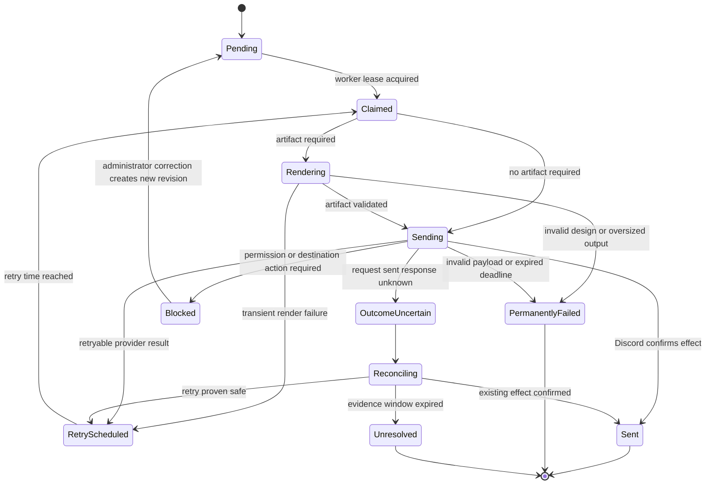
```mermaid
stateDiagram-v2
    [*] --> Pending
    Pending --> Claimed: worker lease acquired
    Claimed --> Rendering: artifact required
    Claimed --> Sending: no artifact required
    Rendering --> Sending: artifact validated
    Rendering --> RetryScheduled: transient render failure
    Rendering --> PermanentlyFailed: invalid design or oversized output
    Sending --> Sent: Discord confirms effect
    Sending --> RetryScheduled: retryable provider result
    Sending --> OutcomeUncertain: request sent response unknown
    Sending --> Blocked: permission or destination action required
    Sending --> PermanentlyFailed: invalid payload or expired deadline
    RetryScheduled --> Claimed: retry time reached
    OutcomeUncertain --> Reconciling
    Reconciling --> Sent: existing effect confirmed
    Reconciling --> RetryScheduled: retry proven safe
    Reconciling --> Unresolved: evidence window expired
    Blocked --> Pending: administrator correction creates new revision
    Sent --> [*]
    PermanentlyFailed --> [*]
    Unresolved --> [*]
```
### 10.2 Message definition lifecycle

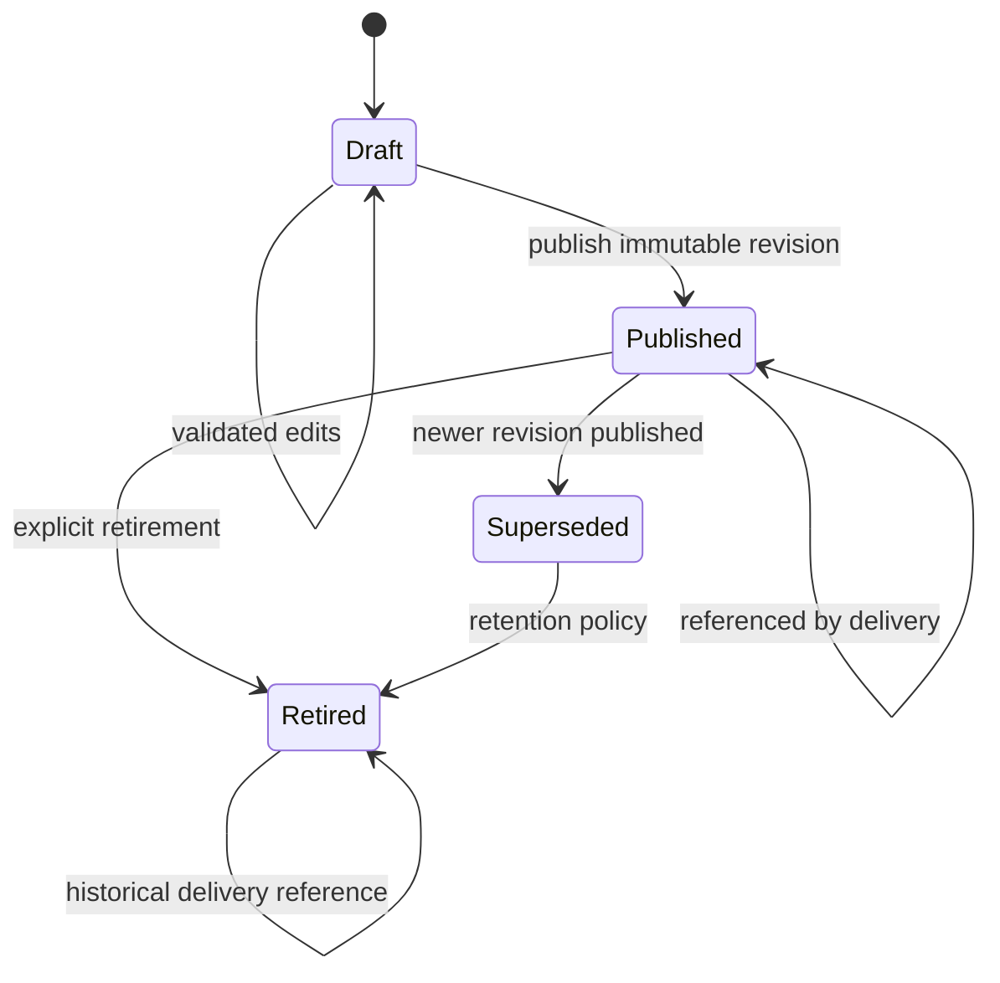
```mermaid
stateDiagram-v2
    [*] --> Draft
    Draft --> Draft: validated edits
    Draft --> Published: publish immutable revision
    Published --> Superseded: newer revision published
    Published --> Retired: explicit retirement
    Superseded --> Retired: retention policy
    Published --> Published: referenced by delivery
    Retired --> Retired: historical delivery reference
```

### 10.3 Schedule lifecycle

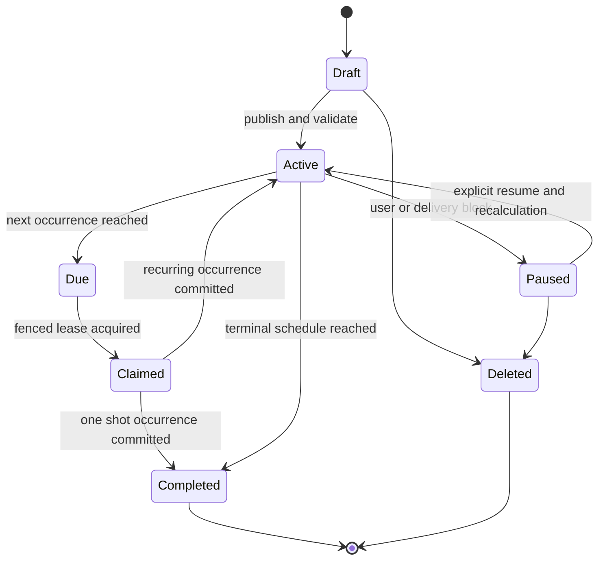
```mermaid
stateDiagram-v2
    [*] --> Draft
    Draft --> Active: publish and validate
    Active --> Due: next occurrence reached
    Due --> Claimed: fenced lease acquired
    Claimed --> Active: recurring occurrence committed
    Claimed --> Completed: one shot occurrence committed
    Active --> Paused: user or delivery block
    Paused --> Active: explicit resume and recalculation
    Active --> Completed: terminal schedule reached
    Draft --> Deleted
    Paused --> Deleted
    Completed --> [*]
    Deleted --> [*]
```

### 10.4 Asset lifecycle

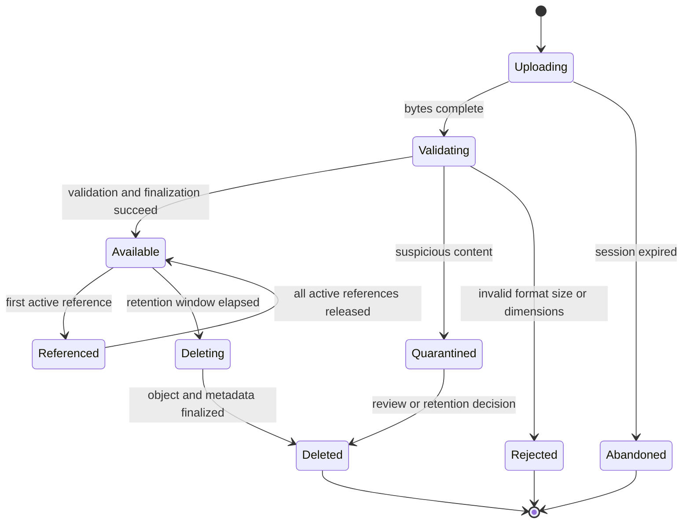
```mermaid
stateDiagram-v2
    [*] --> Uploading
    Uploading --> Validating: bytes complete
    Uploading --> Abandoned: session expired
    Validating --> Available: validation and finalization succeed
    Validating --> Quarantined: suspicious content
    Validating --> Rejected: invalid format size or dimensions
    Available --> Referenced: first active reference
    Referenced --> Available: all active references released
    Available --> Deleting: retention window elapsed
    Deleting --> Deleted: object and metadata finalized
    Quarantined --> Deleted: review or retention decision
    Rejected --> [*]
    Abandoned --> [*]
    Deleted --> [*]
```

### 10.5 Moderation case lifecycle

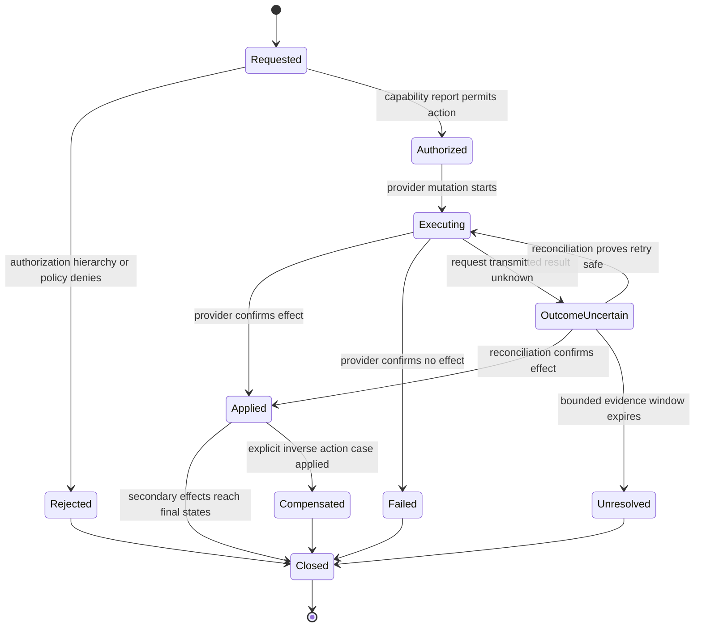
```mermaid
stateDiagram-v2
    [*] --> Requested
    Requested --> Rejected: authorization hierarchy or policy denies
    Requested --> Authorized: capability report permits action
    Authorized --> Executing: provider mutation starts
    Executing --> Applied: provider confirms effect
    Executing --> Failed: provider confirms no effect
    Executing --> OutcomeUncertain: request transmitted result unknown
    OutcomeUncertain --> Applied: reconciliation confirms effect
    OutcomeUncertain --> Executing: reconciliation proves retry safe
    OutcomeUncertain --> Unresolved: bounded evidence window expires
    Applied --> Closed: secondary effects reach final states
    Applied --> Compensated: explicit inverse action case applied
    Rejected --> Closed
    Failed --> Closed
    Unresolved --> Closed
    Compensated --> Closed
    Closed --> [*]
```

### 10.6 Automatic moderation incident lifecycle

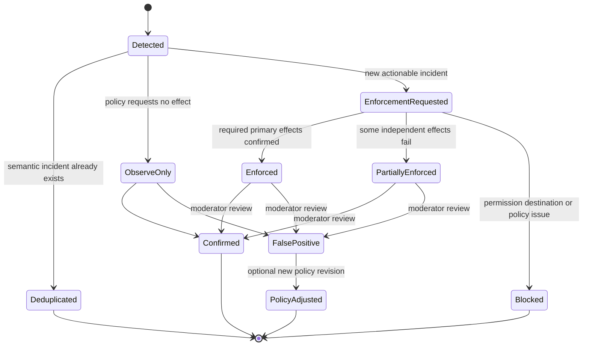
```mermaid
stateDiagram-v2
    [*] --> Detected
    Detected --> Deduplicated: semantic incident already exists
    Detected --> ObserveOnly: policy requests no effect
    Detected --> EnforcementRequested: new actionable incident
    EnforcementRequested --> Enforced: required primary effects confirmed
    EnforcementRequested --> PartiallyEnforced: some independent effects fail
    EnforcementRequested --> Blocked: permission destination or policy issue
    Enforced --> Confirmed: moderator review
    Enforced --> FalsePositive: moderator review
    PartiallyEnforced --> Confirmed: moderator review
    PartiallyEnforced --> FalsePositive: moderator review
    ObserveOnly --> Confirmed
    ObserveOnly --> FalsePositive
    FalsePositive --> PolicyAdjusted: optional new policy revision
    Deduplicated --> [*]
    Confirmed --> [*]
    PolicyAdjusted --> [*]
    Blocked --> [*]
```

### 10.7 Cleanup sweep lifecycle

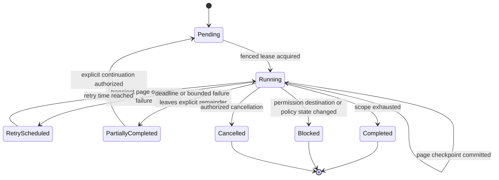
```mermaid
stateDiagram-v2
    [*] --> Pending
    Pending --> Running: fenced lease acquired
    Running --> Running: page checkpoint committed
    Running --> RetryScheduled: transient page or delete failure
    RetryScheduled --> Running: retry time reached
    Running --> PartiallyCompleted: deadline or bounded failure leaves explicit remainder
    Running --> Completed: scope exhausted
    Running --> Blocked: permission destination or policy state changed
    Running --> Cancelled: authorized cancellation
    PartiallyCompleted --> Pending: explicit continuation authorized
    Completed --> [*]
    Blocked --> [*]
    Cancelled --> [*]
```

### 10.8 Security incident lifecycle

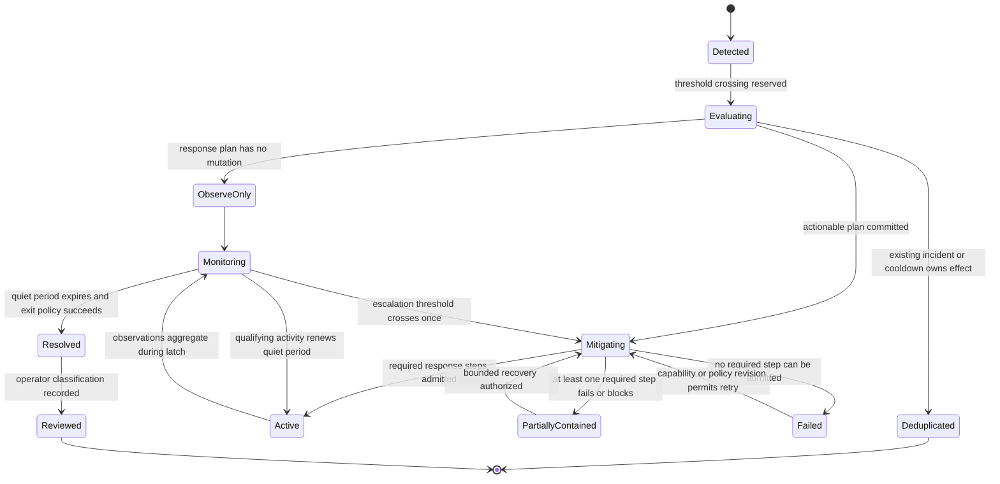
```mermaid
stateDiagram-v2
    [*] --> Detected
    Detected --> Evaluating: threshold crossing reserved
    Evaluating --> ObserveOnly: response plan has no mutation
    Evaluating --> Mitigating: actionable plan committed
    Evaluating --> Deduplicated: existing incident or cooldown owns effect
    Mitigating --> Active: required response steps admitted
    Mitigating --> PartiallyContained: at least one required step fails or blocks
    Mitigating --> Failed: no required step can be admitted
    Active --> Monitoring: observations aggregate during latch
    Monitoring --> Active: qualifying activity renews quiet period
    Monitoring --> Mitigating: escalation threshold crosses once
    Monitoring --> Resolved: quiet period expires and exit policy succeeds
    PartiallyContained --> Mitigating: bounded recovery authorized
    Failed --> Mitigating: capability or policy revision permits retry
    ObserveOnly --> Monitoring
    Deduplicated --> [*]
    Resolved --> Reviewed: operator classification recorded
    Reviewed --> [*]
```

### 10.9 Containment operation lifecycle

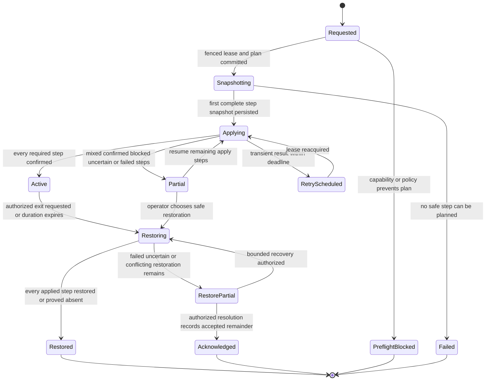
```mermaid
stateDiagram-v2
    [*] --> Requested
    Requested --> PreflightBlocked: capability or policy prevents plan
    Requested --> Snapshotting: fenced lease and plan committed
    Snapshotting --> Applying: first complete step snapshot persisted
    Snapshotting --> Failed: no safe step can be planned
    Applying --> Active: every required step confirmed
    Applying --> Partial: mixed confirmed blocked uncertain or failed steps
    Applying --> RetryScheduled: transient result within deadline
    RetryScheduled --> Applying: lease reacquired
    Active --> Restoring: authorized exit requested or duration expires
    Partial --> Applying: resume remaining apply steps
    Partial --> Restoring: operator chooses safe restoration
    Restoring --> Restored: every applied step restored or proved absent
    Restoring --> RestorePartial: failed uncertain or conflicting restoration remains
    RestorePartial --> Restoring: bounded recovery authorized
    RestorePartial --> Acknowledged: authorized resolution records accepted remainder
    Restored --> [*]
    Acknowledged --> [*]
    PreflightBlocked --> [*]
    Failed --> [*]
```

### 10.10 Role assignment lifecycle

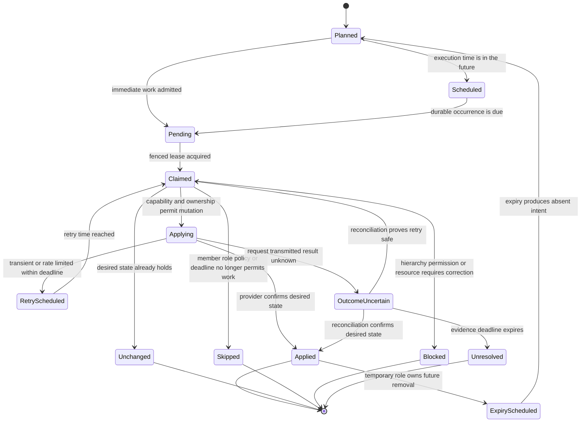
```mermaid
stateDiagram-v2
    [*] --> Planned
    Planned --> Scheduled: execution time is in the future
    Planned --> Pending: immediate work admitted
    Scheduled --> Pending: durable occurrence is due
    Pending --> Claimed: fenced lease acquired
    Claimed --> Unchanged: desired state already holds
    Claimed --> Applying: capability and ownership permit mutation
    Claimed --> Skipped: member role policy or deadline no longer permits work
    Claimed --> Blocked: hierarchy permission or resource requires correction
    Applying --> Applied: provider confirms desired state
    Applying --> RetryScheduled: transient or rate limited within deadline
    Applying --> OutcomeUncertain: request transmitted result unknown
    RetryScheduled --> Claimed: retry time reached
    OutcomeUncertain --> Applied: reconciliation confirms desired state
    OutcomeUncertain --> Claimed: reconciliation proves retry safe
    OutcomeUncertain --> Unresolved: evidence deadline expires
    Applied --> ExpiryScheduled: temporary role owns future removal
    ExpiryScheduled --> Planned: expiry produces absent intent
    Applied --> [*]
    Unchanged --> [*]
    Skipped --> [*]
    Blocked --> [*]
    Unresolved --> [*]
```

### 10.11 Role panel publication lifecycle

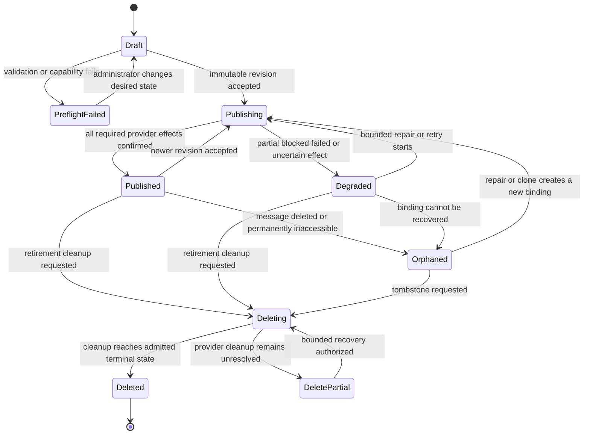
```mermaid
stateDiagram-v2
    [*] --> Draft
    Draft --> PreflightFailed: validation or capability fails
    PreflightFailed --> Draft: administrator changes desired state
    Draft --> Publishing: immutable revision accepted
    Publishing --> Published: all required provider effects confirmed
    Publishing --> Degraded: partial blocked failed or uncertain effect
    Degraded --> Publishing: bounded repair or retry starts
    Published --> Publishing: newer revision accepted
    Published --> Orphaned: message deleted or permanently inaccessible
    Degraded --> Orphaned: binding cannot be recovered
    Orphaned --> Publishing: repair or clone creates a new binding
    Published --> Deleting: retirement cleanup requested
    Degraded --> Deleting: retirement cleanup requested
    Orphaned --> Deleting: tombstone requested
    Deleting --> Deleted: cleanup reaches admitted terminal state
    Deleting --> DeletePartial: provider cleanup remains unresolved
    DeletePartial --> Deleting: bounded recovery authorized
    Deleted --> [*]
```

### 10.12 Role resource mutation lifecycle

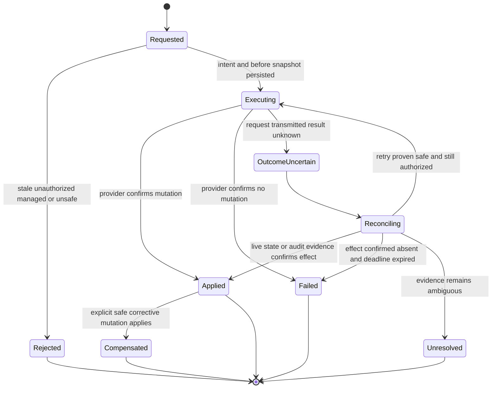
```mermaid
stateDiagram-v2
    [*] --> Requested
    Requested --> Rejected: stale unauthorized managed or unsafe
    Requested --> Executing: intent and before snapshot persisted
    Executing --> Applied: provider confirms mutation
    Executing --> Failed: provider confirms no mutation
    Executing --> OutcomeUncertain: request transmitted result unknown
    OutcomeUncertain --> Reconciling
    Reconciling --> Applied: live state or audit evidence confirms effect
    Reconciling --> Failed: effect confirmed absent and deadline expired
    Reconciling --> Executing: retry proven safe and still authorized
    Reconciling --> Unresolved: evidence remains ambiguous
    Applied --> Compensated: explicit safe corrective mutation applies
    Applied --> [*]
    Compensated --> [*]
    Rejected --> [*]
    Failed --> [*]
    Unresolved --> [*]
```

### 10.13 Voice progression session lifecycle

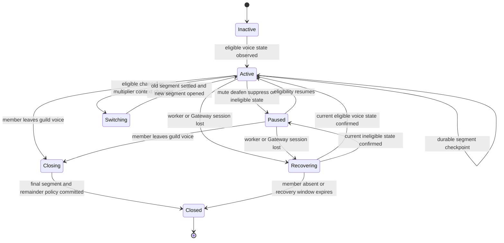
```mermaid
stateDiagram-v2
    [*] --> Inactive
    Inactive --> Active: eligible voice state observed
    Active --> Active: durable segment checkpoint
    Active --> Paused: mute deafen suppress or ineligible state
    Paused --> Active: eligibility resumes
    Active --> Switching: eligible channel or multiplier context changes
    Switching --> Active: old segment settled and new segment opened
    Active --> Closing: member leaves guild voice
    Paused --> Closing: member leaves guild voice
    Closing --> Closed: final segment and remainder policy committed
    Active --> Recovering: worker or Gateway session lost
    Paused --> Recovering: worker or Gateway session lost
    Recovering --> Active: current eligible voice state confirmed
    Recovering --> Paused: current ineligible state confirmed
    Recovering --> Closed: member absent or recovery window expires
    Closed --> [*]
```

### 10.14 Starboard projection lifecycle

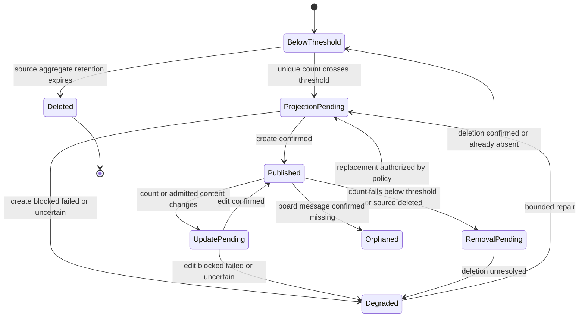
```mermaid
stateDiagram-v2
    [*] --> BelowThreshold
    BelowThreshold --> ProjectionPending: unique count crosses threshold
    ProjectionPending --> Published: create confirmed
    ProjectionPending --> Degraded: create blocked failed or uncertain
    Published --> UpdatePending: count or admitted content changes
    UpdatePending --> Published: edit confirmed
    UpdatePending --> Degraded: edit blocked failed or uncertain
    Published --> RemovalPending: count falls below threshold or source deleted
    RemovalPending --> BelowThreshold: deletion confirmed or already absent
    RemovalPending --> Degraded: deletion unresolved
    Published --> Orphaned: board message confirmed missing
    Degraded --> ProjectionPending: bounded repair
    Orphaned --> ProjectionPending: replacement authorized by policy
    BelowThreshold --> Deleted: source aggregate retention expires
    Deleted --> [*]
```

### 10.15 Giveaway lifecycle

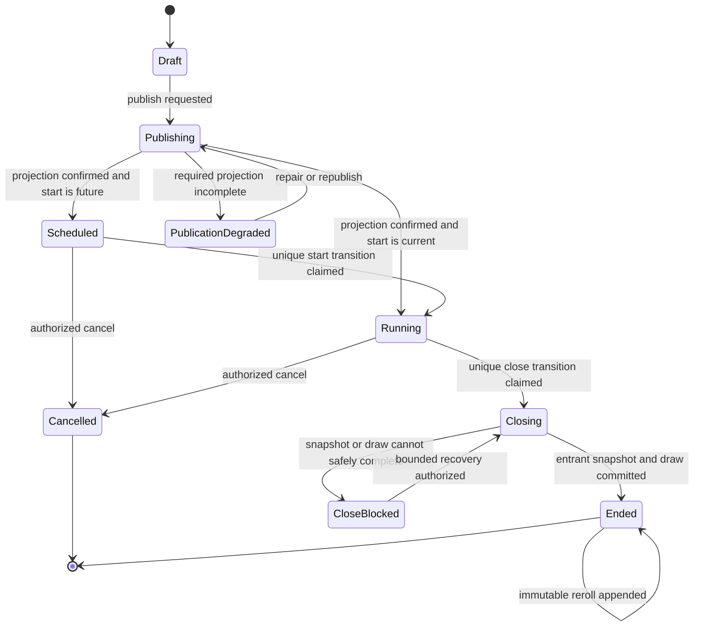
```mermaid
stateDiagram-v2
    [*] --> Draft
    Draft --> Publishing: publish requested
    Publishing --> Scheduled: projection confirmed and start is future
    Publishing --> Running: projection confirmed and start is current
    Publishing --> PublicationDegraded: required projection incomplete
    PublicationDegraded --> Publishing: repair or republish
    Scheduled --> Running: unique start transition claimed
    Scheduled --> Cancelled: authorized cancel
    Running --> Closing: unique close transition claimed
    Running --> Cancelled: authorized cancel
    Closing --> Ended: entrant snapshot and draw committed
    Closing --> CloseBlocked: snapshot or draw cannot safely complete
    CloseBlocked --> Closing: bounded recovery authorized
    Ended --> Ended: immutable reroll appended
    Cancelled --> [*]
    Ended --> [*]
```

### 10.16 Form submission lifecycle

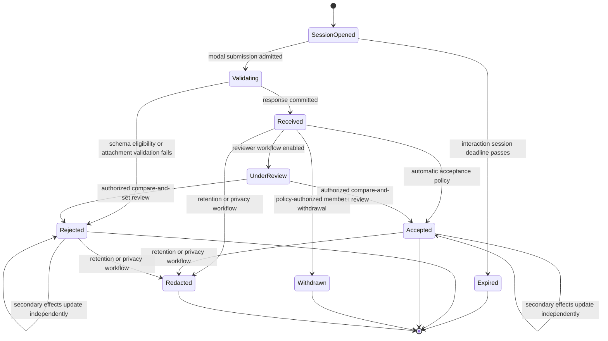
```mermaid
stateDiagram-v2
    [*] --> SessionOpened
    SessionOpened --> Expired: interaction session deadline passes
    SessionOpened --> Validating: modal submission admitted
    Validating --> Rejected: schema eligibility or attachment validation fails
    Validating --> Received: response committed
    Received --> UnderReview: reviewer workflow enabled
    Received --> Accepted: automatic acceptance policy
    UnderReview --> Accepted: authorized compare-and-set review
    UnderReview --> Rejected: authorized compare-and-set review
    Accepted --> Accepted: secondary effects update independently
    Rejected --> Rejected: secondary effects update independently
    Received --> Withdrawn: policy-authorized member withdrawal
    Received --> Redacted: retention or privacy workflow
    Accepted --> Redacted: retention or privacy workflow
    Rejected --> Redacted: retention or privacy workflow
    Expired --> [*]
    Rejected --> [*]
    Accepted --> [*]
    Withdrawn --> [*]
    Redacted --> [*]
```

### 10.17 Temporary room lifecycle

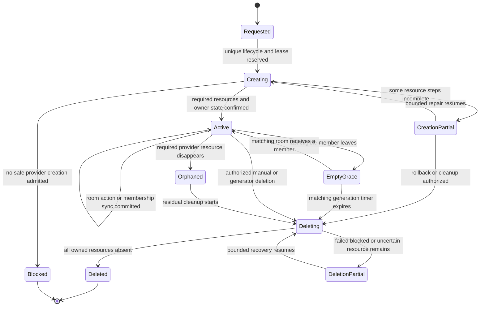
```mermaid
stateDiagram-v2
    [*] --> Requested
    Requested --> Creating: unique lifecycle and lease reserved
    Creating --> Active: required resources and owner state confirmed
    Creating --> CreationPartial: some resource steps incomplete
    Creating --> Blocked: no safe provider creation admitted
    CreationPartial --> Creating: bounded repair resumes
    CreationPartial --> Deleting: rollback or cleanup authorized
    Active --> Active: room action or membership sync committed
    Active --> EmptyGrace: last eligible member leaves
    EmptyGrace --> Active: matching room receives a member
    EmptyGrace --> Deleting: matching generation timer expires
    Active --> Deleting: authorized manual or generator deletion
    Deleting --> Deleted: all owned resources absent
    Deleting --> DeletionPartial: failed blocked or uncertain resource remains
    DeletionPartial --> Deleting: bounded recovery resumes
    Active --> Orphaned: required provider resource disappears
    Orphaned --> Deleting: residual cleanup starts
    Deleted --> [*]
    Blocked --> [*]
```

### 10.18 Monetary hold lifecycle

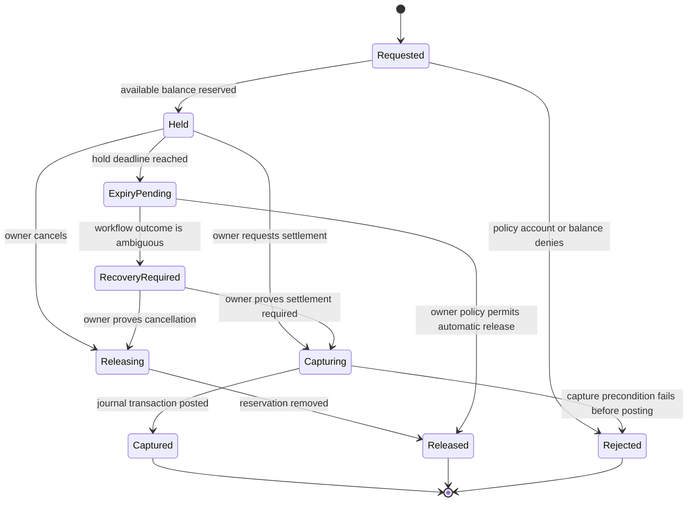
```mermaid
stateDiagram-v2
    [*] --> Requested
    Requested --> Held: available balance reserved
    Requested --> Rejected: policy account or balance denies
    Held --> Capturing: owner requests settlement
    Held --> Releasing: owner cancels
    Held --> ExpiryPending: hold deadline reached
    Capturing --> Captured: journal transaction posted
    Capturing --> Rejected: capture precondition fails before posting
    Releasing --> Released: reservation removed
    ExpiryPending --> Released: owner policy permits automatic release
    ExpiryPending --> RecoveryRequired: workflow outcome is ambiguous
    RecoveryRequired --> Capturing: owner proves settlement required
    RecoveryRequired --> Releasing: owner proves cancellation
    Captured --> [*]
    Released --> [*]
    Rejected --> [*]
```

### 10.19 Income action lifecycle

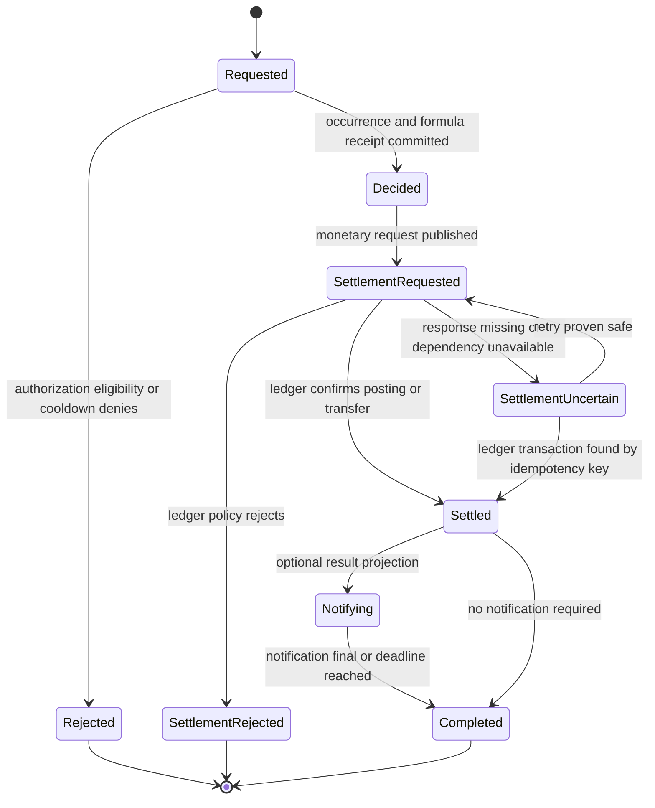
```mermaid
stateDiagram-v2
    [*] --> Requested
    Requested --> Rejected: authorization eligibility or cooldown denies
    Requested --> Decided: occurrence and formula receipt committed
    Decided --> SettlementRequested: monetary request published
    SettlementRequested --> Settled: ledger confirms posting or transfer
    SettlementRequested --> SettlementRejected: ledger policy rejects
    SettlementRequested --> SettlementUncertain: response missing or dependency unavailable
    SettlementUncertain --> Settled: ledger transaction found by idempotency key
    SettlementUncertain --> SettlementRequested: retry proven safe
    Settled --> Notifying: optional result projection
    Notifying --> Completed: notification final or deadline reached
    Settled --> Completed: no notification required
    Rejected --> [*]
    SettlementRejected --> [*]
    Completed --> [*]
```

### 10.20 Purchase lifecycle

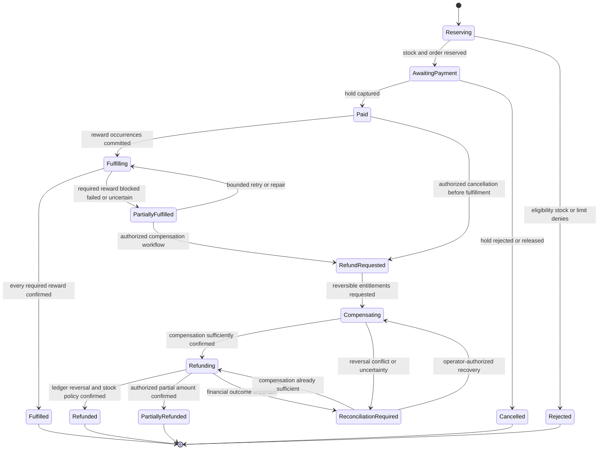
```mermaid
stateDiagram-v2
    [*] --> Reserving
    Reserving --> AwaitingPayment: stock and order reserved
    Reserving --> Rejected: eligibility stock or limit denies
    AwaitingPayment --> Paid: hold captured
    AwaitingPayment --> Cancelled: hold rejected or released
    Paid --> Fulfilling: reward occurrences committed
    Fulfilling --> Fulfilled: every required reward confirmed
    Fulfilling --> PartiallyFulfilled: required reward blocked failed or uncertain
    PartiallyFulfilled --> Fulfilling: bounded retry or repair
    Paid --> RefundRequested: authorized cancellation before fulfillment
    PartiallyFulfilled --> RefundRequested: authorized compensation workflow
    RefundRequested --> Compensating: reversible entitlements requested
    Compensating --> Refunding: compensation sufficiently confirmed
    Compensating --> ReconciliationRequired: reversal conflict or uncertainty
    Refunding --> Refunded: ledger reversal and stock policy confirmed
    Refunding --> PartiallyRefunded: authorized partial amount confirmed
    Refunding --> ReconciliationRequired: financial outcome uncertain
    ReconciliationRequired --> Compensating: operator-authorized recovery
    ReconciliationRequired --> Refunding: compensation already sufficient
    Fulfilled --> [*]
    Refunded --> [*]
    PartiallyRefunded --> [*]
    Cancelled --> [*]
    Rejected --> [*]
```

### 10.21 Entitlement lifecycle

```mermaid
stateDiagram-v2
    [*] --> Requested
    Requested --> Activating: grant validated and occurrence reserved
    Requested --> Rejected: dependency policy or ownership invalid
    Activating --> Active: required effects confirmed
    Activating --> ActivationPartial: effect blocked failed or uncertain
    ActivationPartial --> Activating: bounded repair
    Active --> ExpiryScheduled: bounded duration applies
    Active --> Revoking: compensation or manual revocation admitted
    ExpiryScheduled --> Revoking: matching expiry generation due
    Revoking --> Revoked: owned effect confirmed absent
    Revoking --> CompensationConflict: external change prevents safe reversal
    Revoking --> RevocationPartial: effect remains blocked failed or uncertain
    RevocationPartial --> Revoking: bounded recovery
    CompensationConflict --> Revoking: operator resolves ownership conflict
    Active --> [*]
    Revoked --> [*]
    Rejected --> [*]
```

### 10.22 Casino game session lifecycle

```mermaid
stateDiagram-v2
    [*] --> Opening
    Opening --> AwaitingChoice: session created without committed stake
    Opening --> Blocked: policy or capacity denies
    AwaitingChoice --> HoldingWager: player commits a choice and stake
    HoldingWager --> Active: ledger hold confirmed
    HoldingWager --> Cancelled: hold rejected
    Active --> Active: valid versioned player action
    Active --> OutcomeCommitted: terminal result durably committed
    Active --> ExpiryEvaluating: inactivity deadline reached
    ExpiryEvaluating --> OutcomeCommitted: rules define forced settlement
    ExpiryEvaluating --> Cancelled: rules permit hold release
    OutcomeCommitted --> Settling: immutable ledger request published
    Settling --> Settled: capture and payout confirmed
    Settling --> RecoveryRequired: settlement response uncertain
    RecoveryRequired --> Settling: ledger reconciliation proves retry safe
    RecoveryRequired --> Settled: prior settlement confirmed
    Settled --> [*]
    Cancelled --> [*]
    Blocked --> [*]
```

### 10.23 Support panel lifecycle

```mermaid
stateDiagram-v2
    [*] --> Draft
    Draft --> PreflightFailed: policy destination or component invalid
    PreflightFailed --> Draft: authorized edit
    Draft --> Publishing: immutable revision accepted
    Publishing --> Published: required message and components confirmed
    Publishing --> Degraded: partial blocked failed or uncertain effect
    Published --> Publishing: newer revision accepted
    Published --> Disabled: interaction admission disabled
    Disabled --> Publishing: re-enable with immutable revision
    Published --> Orphaned: binding missing or application identity changed
    Degraded --> Publishing: bounded repair
    Orphaned --> Publishing: recreate or rebind authorized
    Published --> Retiring: retirement requested
    Disabled --> Retiring: retirement requested
    Orphaned --> Retiring: tombstone requested
    Retiring --> Retired: declared message behavior confirmed
    Retiring --> Degraded: cleanup incomplete
    Retired --> [*]
```

### 10.24 Support case lifecycle

```mermaid
stateDiagram-v2
    [*] --> IntakePending
    IntakePending --> Provisioning: intake complete and capacity reserved
    IntakePending --> Rejected: eligibility intake or capacity denies
    IntakePending --> Cancelled: member or authorized expiry cancels
    Provisioning --> Open: required support resource active
    Provisioning --> RecoveryRequired: resource partial blocked or uncertain
    Provisioning --> Cancelled: safe cancellation before active resource
    RecoveryRequired --> Provisioning: bounded repair
    Open --> Claimed: authorized staff claim
    Claimed --> Open: authorized unclaim
    Open --> Waiting: waiting state applied
    Claimed --> Waiting: waiting state applied
    Waiting --> Open: wait condition cleared
    Waiting --> Claimed: assignee resumes
    Open --> Escalated: policy or authorized escalation
    Claimed --> Escalated: policy or authorized escalation
    Waiting --> Escalated: deadline or authorized escalation
    Escalated --> Claimed: assignee accepts
    Open --> Resolved: resolution recorded
    Claimed --> Resolved: resolution recorded
    Waiting --> Resolved: resolution recorded
    Escalated --> Resolved: resolution recorded
    Resolved --> Closing: close policy starts
    Resolved --> Reopening: reopen admitted
    Closing --> Closed: capacity released and terminal state committed
    Closing --> CloseBlocked: resource or archive resolution required
    CloseBlocked --> Closing: bounded recovery or authorized archive decision
    Closed --> Reopening: reopen window and capacity allow
    Reopening --> Provisioning: new generation reserved
    Reopening --> Rejected: capacity or policy denies
    Rejected --> [*]
    Cancelled --> [*]
    Closed --> [*]
```

### 10.25 Support resource lifecycle

```mermaid
stateDiagram-v2
    [*] --> Requested
    Requested --> PreflightBlocked: capability parent or policy invalid
    Requested --> Provisioning: fenced operation starts
    Provisioning --> Active: required resource and access confirmed
    Provisioning --> Partial: effect blocked failed or uncertain
    Partial --> Provisioning: bounded repair
    Active --> UpdatingAccess: participant or policy change
    UpdatingAccess --> Active: desired access confirmed
    UpdatingAccess --> Partial: one or more effects unresolved
    Active --> Frozen: close or archive presentation applied
    Frozen --> Active: reopen generation admitted
    Active --> Orphaned: primary resource confirmed absent
    Frozen --> Deleting: cleanup requested
    Active --> Deleting: authorized immediate cleanup
    Orphaned --> Deleting: residual cleanup requested
    Deleting --> Deleted: all owned resources absent
    Deleting --> DeletePartial: effect failed blocked uncertain or conflicted
    DeletePartial --> Deleting: bounded recovery
    Deleted --> [*]
    PreflightBlocked --> [*]
```

### 10.26 Support transcript lifecycle

```mermaid
stateDiagram-v2
    [*] --> Capturing
    Capturing --> GapDetected: event or content coverage loss
    GapDetected --> Capturing: bounded recovery adds evidence
    Capturing --> Finalizing: case capture boundary reached
    GapDetected --> Finalizing: policy permits incomplete artifact
    Finalizing --> Generating: ordered archive snapshot committed
    Generating --> Completed: artifact and integrity receipt stored
    Generating --> Incomplete: artifact stored with explicit gaps
    Generating --> Failed: bounded generation cannot complete
    Completed --> DeliveryPending: destination requested
    Incomplete --> DeliveryPending: destination permits incomplete artifact
    DeliveryPending --> Delivered: required delivery confirmed
    DeliveryPending --> DeliveryPartial: blocked failed or expired delivery
    Completed --> Redacted: privacy workflow
    Incomplete --> Redacted: privacy workflow
    Delivered --> Redacted: privacy workflow
    Redacted --> Deleting: retention expires
    Completed --> Deleting: retention expires without delivery
    Incomplete --> Deleting: retention expires
    Deleting --> Deleted: metadata and asset lifecycle finalized
    Deleted --> [*]
    Completed --> [*]
    Incomplete --> [*]
    Failed --> [*]
```

### 10.27 Stream alert definition lifecycle

```mermaid
stateDiagram-v2
    [*] --> Draft
    Draft --> Resolving: provider locator submitted
    Resolving --> Draft: identity ambiguous or correction required
    Resolving --> Ready: identity and mandatory dependencies valid
    Ready --> Enabled: publish immutable revision
    Enabled --> Degraded: event transport destination or credential unhealthy
    Degraded --> Enabled: dependencies converge
    Enabled --> Disabled: explicit disablement
    Degraded --> Disabled: explicit disablement
    Disabled --> Enabled: new validated revision
    Enabled --> Superseded: newer revision published
    Degraded --> Superseded: newer revision published
    Disabled --> Retired: explicit retirement
    Superseded --> Retired: retention permits retirement
    Retired --> [*]
```

### 10.28 Provider subscription lifecycle

```mermaid
stateDiagram-v2
    [*] --> Requested
    Requested --> Creating: fenced operation acquired
    Creating --> Verifying: provider resource confirmed
    Creating --> OutcomeUncertain: response lost after transmission
    OutcomeUncertain --> Verifying: resource found and owned
    OutcomeUncertain --> Creating: absence proven and retry eligible
    Verifying --> Active: provider and endpoint verification agree
    Verifying --> Degraded: verification deadline or callback health failed
    Active --> Degraded: revocation expiry connection loss or drift
    Degraded --> Active: bounded repair succeeds
    Active --> Rotating: endpoint secret or transport generation changes
    Rotating --> Active: new generation confirmed
    Rotating --> Degraded: partial rotation
    Active --> Deleting: desired state becomes absent
    Degraded --> Deleting: desired state becomes absent
    Deleting --> Absent: owned provider resource confirmed absent
    Deleting --> Conflict: ownership or provider state ambiguous
    Conflict --> Deleting: operator or reconciliation resolves ownership
    Absent --> [*]
```

### 10.29 External live-session lifecycle

```mermaid
stateDiagram-v2
    [*] --> Unknown
    Unknown --> Offline: conclusive offline observation
    Unknown --> LiveCandidate: online event or live observation
    Offline --> LiveCandidate: new provider session observed
    LiveCandidate --> Live: confirmation policy satisfied
    LiveCandidate --> Offline: candidate disproven
    LiveCandidate --> Conflicted: sources disagree beyond policy window
    Live --> Live: same session metadata advances
    Live --> EndingCandidate: offline signal requires confirmation
    Live --> Ended: authoritative offline event
    Live --> Stale: no conclusive source within freshness boundary
    EndingCandidate --> Live: live state reconfirmed
    EndingCandidate --> Ended: offline confirmation satisfied
    Stale --> Live: same session reconfirmed
    Stale --> Ended: terminal state confirmed
    Stale --> Conflicted: incompatible session evidence
    Conflicted --> Live: resolution selects live evidence
    Conflicted --> Ended: resolution selects terminal evidence
    Ended --> LiveCandidate: different provider session observed
```

### 10.30 Stream alert occurrence lifecycle

```mermaid
stateDiagram-v2
    [*] --> Reserved
    Reserved --> Suppressed: policy duplicate or deadline decision
    Reserved --> DeliveryPending: durable Delivery intent accepted
    DeliveryPending --> Delivered: provider message confirmed
    DeliveryPending --> RetryScheduled: retryable delivery result
    DeliveryPending --> Blocked: destination mention or permission invalid
    DeliveryPending --> OutcomeUncertain: response lost after transmission
    RetryScheduled --> DeliveryPending: retry due within deadline
    OutcomeUncertain --> Delivered: existing owned message reconciled
    OutcomeUncertain --> RetryScheduled: absence proven
    OutcomeUncertain --> Unresolved: evidence window exhausted
    Delivered --> RefreshPending: coalesced metadata refresh due
    RefreshPending --> Delivered: edit confirmed or superseded
    Delivered --> OfflinePending: offline policy due
    OfflinePending --> Delivered: offline effect confirmed
    Delivered --> CleanupPending: owned cleanup due
    CleanupPending --> Cleaned: exact owned message absent
    CleanupPending --> CleanupBlocked: ownership or permission conflict
    Suppressed --> [*]
    Blocked --> [*]
    Unresolved --> [*]
    Cleaned --> [*]
```

### 10.31 Custom-command definition lifecycle

```mermaid
stateDiagram-v2
    [*] --> Draft
    Draft --> Published: immutable validation succeeds
    Published --> ProjectionPending: desired contribution accepted
    ProjectionPending --> Active: registry binding converged
    ProjectionPending --> ProjectionDegraded: provider blocked failed or uncertain
    ProjectionDegraded --> Active: reconciliation converges
    Active --> Degraded: dependency or registry drift
    Degraded --> Active: dependency repaired
    Active --> Disabled: explicit disablement revision
    Degraded --> Disabled: explicit disablement revision
    Disabled --> ProjectionPending: validated enable revision
    Active --> Superseded: newer revision published
    Degraded --> Superseded: newer revision published
    Disabled --> Retired: retention and projection permit
    Superseded --> Retired: retention and projection permit
    Retired --> [*]
```

### 10.32 Application-command projection lifecycle

```mermaid
stateDiagram-v2
    [*] --> Compiling
    Compiling --> Conflicted: owner schema or provider constraint conflict
    Conflicted --> Compiling: contribution revision resolves conflict
    Compiling --> Ready: complete desired snapshot valid
    Ready --> Projecting: fenced operation acquired
    Projecting --> Converged: provider registry fingerprint confirmed
    Projecting --> RetryScheduled: retryable provider outcome
    Projecting --> OutcomeUncertain: response lost after transmission
    RetryScheduled --> Projecting: retry due
    OutcomeUncertain --> Reconciling
    Reconciling --> Converged: desired registry already present
    Reconciling --> RetryScheduled: absence or safe delta proven
    Reconciling --> Degraded: bounded evidence cannot resolve
    Converged --> Drifted: provider observation differs
    Drifted --> Compiling: rebuild current generation
    Degraded --> Compiling: operator or dependency change
```

### 10.33 Custom-command invocation lifecycle

```mermaid
stateDiagram-v2
    [*] --> Received
    Received --> Rejected: binding policy argument or cooldown denial
    Received --> Accepted: invocation and reservations committed
    Accepted --> Executing: bounded action plan starts
    Executing --> Completed: every required action terminal success
    Executing --> PartiallyCompleted: one or more independent actions blocked or failed
    Executing --> RetryPending: eligible durable action remains
    RetryPending --> Executing: action retry due
    Accepted --> Expired: execution deadline reached before useful action
    PartiallyCompleted --> Completed: eligible repair completes
    Rejected --> [*]
    Completed --> [*]
    Expired --> [*]
```

### 10.34 Reminder occurrence lifecycle

```mermaid
stateDiagram-v2
    [*] --> Pending
    Pending --> Claimed: fenced lease acquired
    Pending --> Cancelled: owner or authorized cancellation wins
    Pending --> Superseded: reschedule or edit generation replaces occurrence
    Claimed --> Delivering: current generation and deadline valid
    Claimed --> Cancelled: cancellation advances generation before dispatch
    Claimed --> Superseded: reschedule advances generation before dispatch
    Delivering --> Delivered: one route confirms message
    Delivering --> RetryScheduled: retryable route or provider failure
    Delivering --> DeadLetter: permanent failure or retry budget exhausted
    Delivering --> Missed: delivery deadline expires
    RetryScheduled --> Claimed: retry due
    RetryScheduled --> Cancelled: cancellation wins
    RetryScheduled --> Expired: retention or maximum horizon reached
    Delivered --> Snoozed: eligible owner creates child occurrence
    Cancelled --> [*]
    Superseded --> [*]
    DeadLetter --> [*]
    Missed --> [*]
    Expired --> [*]
```

### 10.35 Authorization session lifecycle

```mermaid
stateDiagram-v2
    [*] --> OAuthPending
    OAuthPending --> Active: state proof callback and identity confirmed
    OAuthPending --> Rejected: mismatch reuse expiry or exchange failure
    Active --> Active: bounded renewal and generation unchanged
    Active --> Expired: idle or absolute boundary reached
    Active --> Revoked: logout unlink policy or ownership change
    Active --> Compromised: security event invalidates generation
    Compromised --> Revoked: incident containment completes
    Rejected --> [*]
    Expired --> [*]
    Revoked --> [*]
```

### 10.36 Discord installation lifecycle

```mermaid
stateDiagram-v2
    [*] --> NotInstalled
    NotInstalled --> AuthorizationPending: install generation issued
    AuthorizationPending --> Verifying: callback consumed
    AuthorizationPending --> NotInstalled: denied expired or mismatched
    Verifying --> Installed: presence and required capabilities confirmed
    Verifying --> Degraded: presence confirmed with missing capability
    Verifying --> AuthorizationPending: provider state not yet observable
    Installed --> Degraded: permission command intent or dependency drift
    Degraded --> Verifying: repair generation or dependency recovery
    Installed --> Removed: provider removal observed
    Degraded --> Removed: provider removal observed
    Removed --> AuthorizationPending: authorized reinstall
    Removed --> [*]
```

### 10.37 Commercial subscription lifecycle

```mermaid
stateDiagram-v2
    [*] --> Incomplete
    Incomplete --> Active: verified initial payment or admitted trial
    Incomplete --> Expired: checkout or initial payment deadline
    Active --> ChangeScheduled: downgrade or cancellation effective later
    Active --> PastDue: renewal payment failed
    Active --> Paused: provider and policy confirm pause
    Active --> Disputed: qualifying dispute or chargeback
    ChangeScheduled --> Active: change withdrawn before boundary
    ChangeScheduled --> Active: new terms take effect with active grant
    ChangeScheduled --> Cancelled: cancellation boundary reached
    PastDue --> Active: payment recovered within grace
    PastDue --> Restricted: grace expires
    Paused --> Active: resumed and provider confirmed
    Disputed --> Active: dispute resolved in owner favor
    Disputed --> Restricted: risk policy restricts grants
    Restricted --> Active: verified recovery
    Restricted --> Cancelled: terminal provider state
    Cancelled --> [*]
    Expired --> [*]
```

### 10.38 Platform entitlement lifecycle

```mermaid
stateDiagram-v2
    [*] --> Pending
    Pending --> Active: source and scope validated
    Pending --> Rejected: incompatible invalid or unauthorized source
    Active --> Grace: payment or downgrade grace applies
    Active --> ExpiryScheduled: finite grant has a due boundary
    Grace --> Active: source recovers
    Grace --> Restricted: grace expires
    ExpiryScheduled --> Active: renewal extends generation
    ExpiryScheduled --> Revoked: matching expiry generation confirmed
    Active --> Suspended: dispute abuse or operator hold
    Suspended --> Active: authorized resolution
    Suspended --> Revoked: source permanently invalidated
    Restricted --> Active: capacity or billing recovers
    Restricted --> Revoked: source ends
    Revoked --> [*]
    Rejected --> [*]
```

### 10.39 AI Credit reservation lifecycle

```mermaid
stateDiagram-v2
    [*] --> Requested
    Requested --> Reserved: balance lots and spending limits admit atomically
    Requested --> Rejected: insufficient balance policy or duplicate conflict
    Reserved --> Capturing: confirmed usage receipt
    Reserved --> Releasing: confirmed non-billable failure or cancellation
    Reserved --> Uncertain: provider outcome unknown
    Uncertain --> Capturing: reconciliation confirms result and usage
    Uncertain --> Releasing: reconciliation proves no billable result
    Uncertain --> Disputed: uncertainty deadline requires review
    Capturing --> Captured: actual charge and remainder release committed
    Releasing --> Released: allocations returned to lots
    Captured --> Refunded: compensating refund entry committed
    Disputed --> Capturing: operator confirms usage
    Disputed --> Releasing: operator proves absence
    Captured --> [*]
    Released --> [*]
    Refunded --> [*]
    Rejected --> [*]
```

### 10.40 AI operation lifecycle

```mermaid
stateDiagram-v2
    [*] --> Requested
    Requested --> Rejected: entitlement privacy safety or limits deny
    Requested --> Reserving: pricing revision pinned
    Reserving --> Ready: AI Credits reserved
    Reserving --> Rejected: reservation denied
    Ready --> Executing: provider attempt admitted
    Executing --> Moderating: result and usage confirmed
    Executing --> Failed: confirmed failure without result
    Executing --> Uncertain: provider outcome unknown
    Uncertain --> Moderating: reconciliation confirms result
    Uncertain --> Failed: reconciliation proves absence or terminal failure
    Moderating --> Succeeded: output admitted
    Moderating --> Blocked: output policy denies delivery
    Succeeded --> Settling: usage receipt submitted
    Blocked --> Settling: billable usage receipt submitted
    Failed --> Settling: reservation release submitted
    Settling --> Settled: capture or release confirmed
    Settled --> [*]
    Rejected --> [*]
```

### 10.41 Template installation lifecycle

```mermaid
stateDiagram-v2
    [*] --> Preflighting
    Preflighting --> AwaitingConfirmation: complete plan and warnings produced
    Preflighting --> Rejected: integrity review entitlement or dependency denial
    AwaitingConfirmation --> Applying: exact plan revision confirmed
    AwaitingConfirmation --> Cancelled: confirmation expires or actor cancels
    Applying --> Installed: every required step confirmed
    Applying --> Partial: blocked failed or uncertain required step
    Partial --> Applying: bounded repair resumes
    Installed --> RollingBack: authorized rollback requested
    Partial --> RollingBack: authorized compensation selected
    RollingBack --> RolledBack: every owned effect safely compensated
    RollingBack --> RollbackPartial: retryable compensation remains
    RollingBack --> Conflict: external edit or ownership ambiguity
    RollbackPartial --> RollingBack: bounded repair resumes
    Conflict --> RollingBack: operator resolves ownership
    Installed --> [*]
    RolledBack --> [*]
    Rejected --> [*]
    Cancelled --> [*]
```

### 10.42 Workflow execution lifecycle

```mermaid
stateDiagram-v2
    [*] --> Accepted
    Accepted --> Rejected: authorization deduplication or capacity denies
    Accepted --> Evaluating: immutable facts and revision frozen
    Evaluating --> Completed: no matching effect path
    Evaluating --> Executing: action occurrences materialized
    Executing --> Waiting: durable timer callback or downstream result required
    Waiting --> Executing: dependency result or due time arrives
    Executing --> Completed: all required actions confirmed
    Executing --> PartiallyCompleted: optional failure or admitted partial outcome
    Executing --> Compensating: required action policy requests compensation
    Executing --> DeadLetter: terminal required failure or deadline
    Compensating --> Completed: compensation policy satisfied
    Compensating --> DeadLetter: compensation conflict or exhaustion
    Accepted --> Cancelled: cancellation wins before effects
    Waiting --> Cancelled: cancellation policy admits remaining stop
    Completed --> [*]
    PartiallyCompleted --> [*]
    DeadLetter --> [*]
    Cancelled --> [*]
    Rejected --> [*]
```
