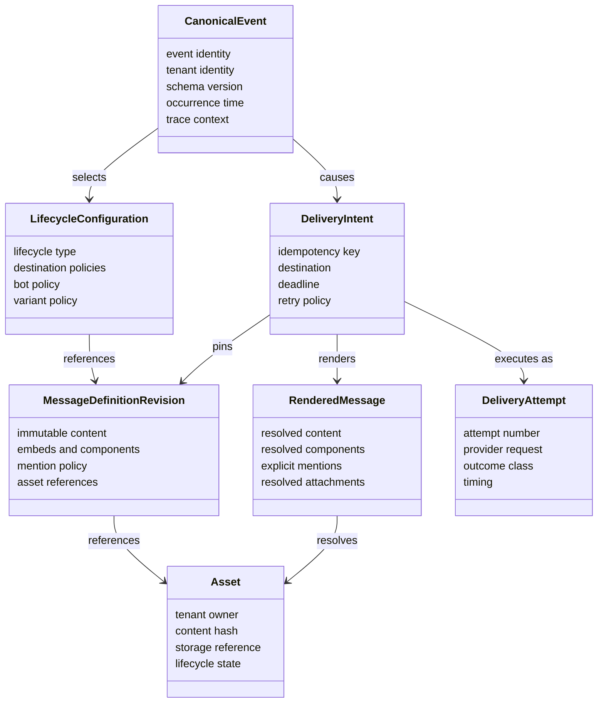
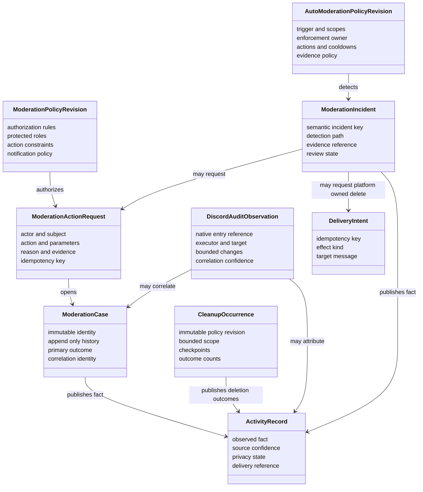
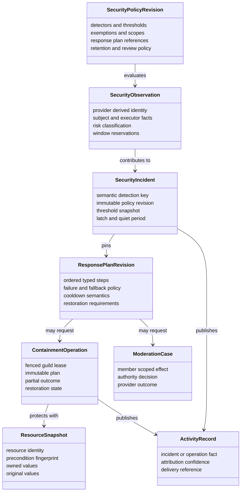
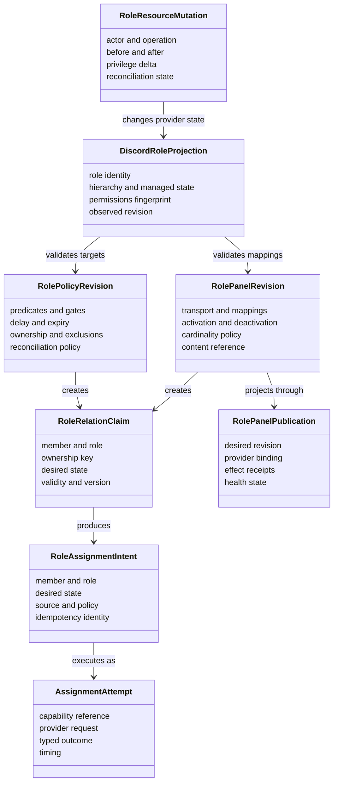
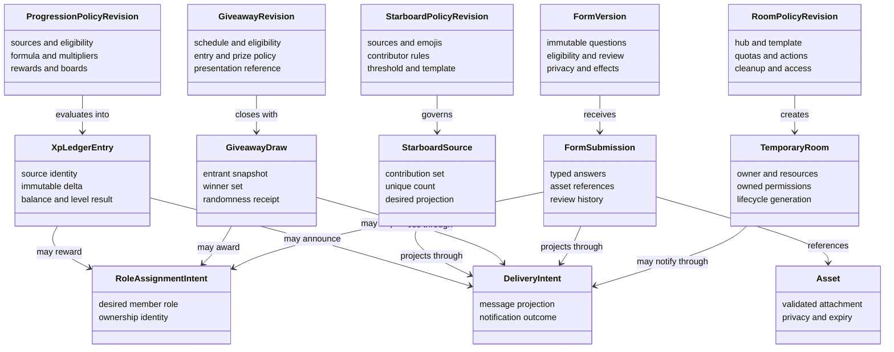
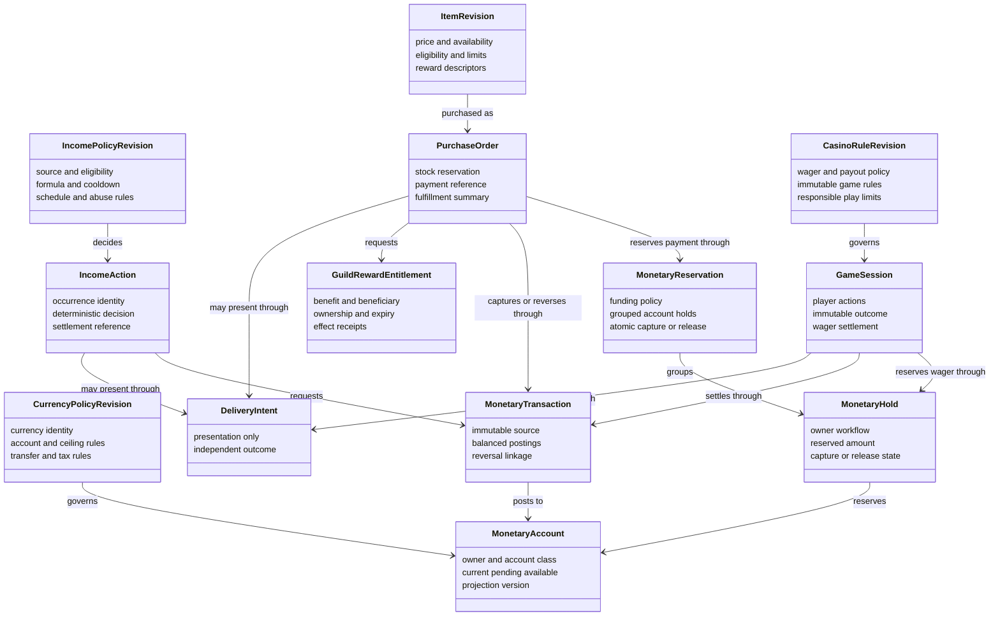
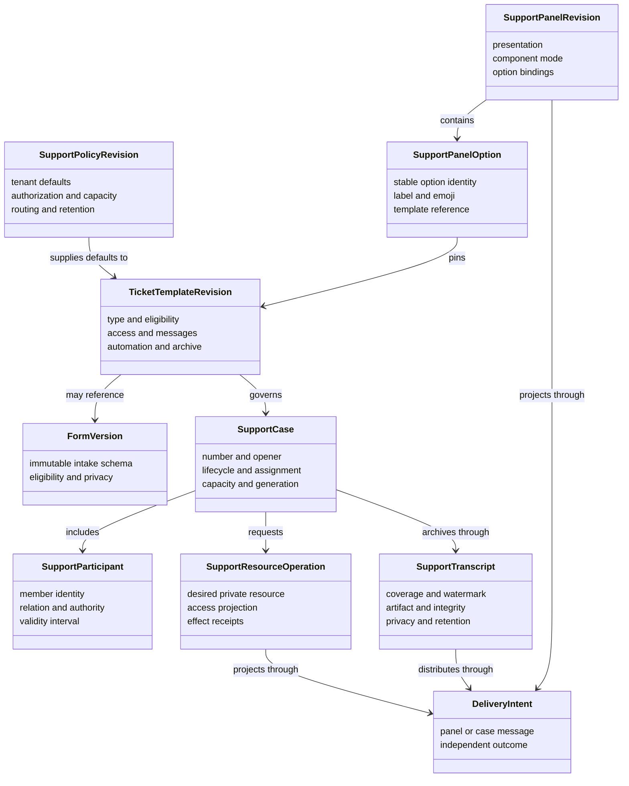
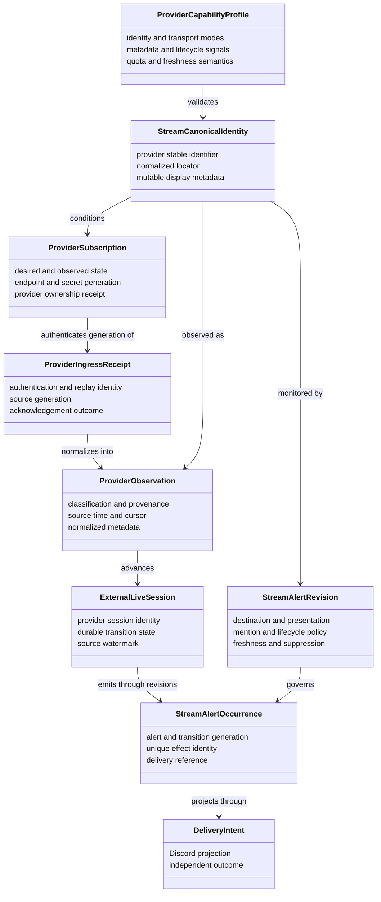
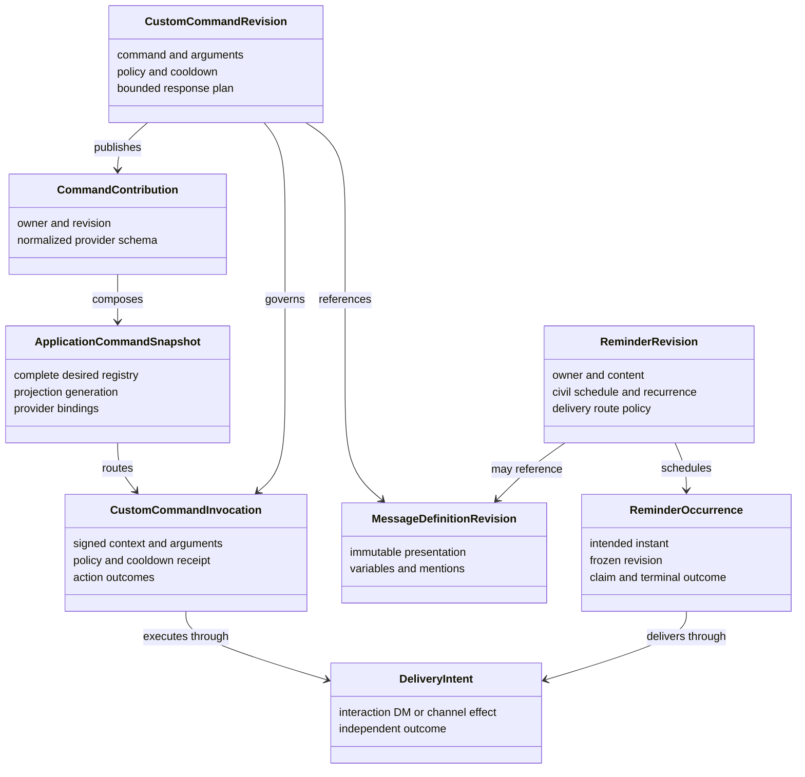
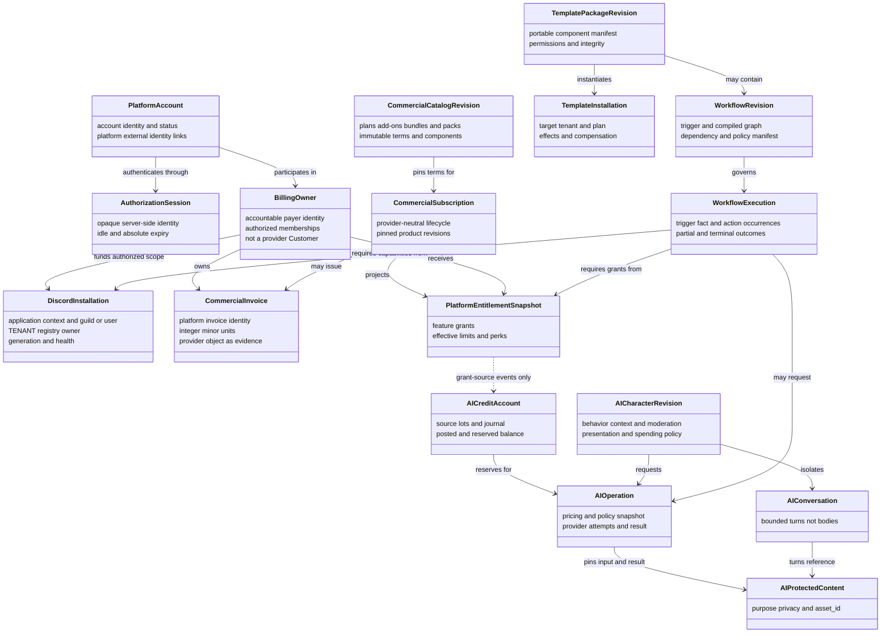

# Tobot Architecture — Domain Relationships

[Architecture index](README.md) · [Previous](05-state-models.md) · [Next](07-data-core.md)

## 11. Domain relationship model

### 11.1 Moderation domain relationships

`ModerationPolicyRevision` owns protected-user and protected-role product lists (DR-020). Discord Capability evaluates live Discord hierarchy and MAY apply a pinned revision snapshot; it does not own that policy.

### 11.2 Security domain relationships

### 11.3 Roles domain relationships

`DiscordRoleProjection` is the rebuildable guild-role catalog. **Role Resource** is its sole owner (DR-014). Discord remains provider-authoritative for live role bytes; the projection is rebuilt from Gateway role events and Transport inspect, never a second live truth. Discord Capability reads that catalog, or a disposable local copy, to produce permission, hierarchy, and member-role reports. Role Policy and Assignment owns desired member-role relations and MUST NOT write the catalog row. The mutation arrow records that a Role Resource mutation changes provider state and therefore the catalog; Capability and Assignment do not write that aggregate. `RolePanelPublication` is Role Panel's publication aggregate, not Support Panel publication (DR-015). Punitive member-role relations are Cases-owned desired state published as assignment intents; Assignment is the sole Transport client for add and remove (DR-068).

### 11.4 Community domain relationships

### 11.5 Economy domain relationships

### 11.6 Support domain relationships

### 11.7 External integration and stream-alert relationships

`StreamCanonicalIdentity` is Integration Registry's stream-channel aggregate (`STREAM_CANONICAL_IDENTITY`, DR-017). It is not Identity's platform login link (`PLATFORM_EXTERNAL_IDENTITY`).

### 11.8 Automation command and reminder relationships

Custom Command Definition, Application Command Registry, and Custom Command Runtime are three modules (DR-019). Workflow Definition and Runtime is one module and is not this graph.

### 11.9 Platform access, commercial, AI, template, and workflow relationships

These relationships are references across bounded contexts, not shared aggregate ownership. Billing never authorizes a Discord mutation by itself; identity, current guild authority, installation capability, platform entitlement, and the owning module's policy remain independent gates. A template can declare a workflow, but the installed workflow becomes a tenant-owned aggregate with its own revision and lifecycle. Workflow Definition and Runtime remains one module (DR-019); `WorkflowRevision` and `WorkflowExecution` share that owner. There is no domain Customer aggregate. `BillingOwner` is the payer; a provider Customer object is mapping evidence. Two owners MUST NOT concurrently fund the same installation (DR-055). Dunning retries collect one Open renewal invoice and MUST NOT mint a new order (DR-056). Mid-period money uses a pinned proration quote in integer minor units; unused time is not a refund (DR-057). A mixed Recurring+OneTime Bundle splits into two sibling orders under a checkout group; Recurring checkout is first; `Partial` is not an automatic refund (DR-058). Discord Installation owns the TENANT registry; first-product `tenant_type` is `Guild` or `User`; `tenant_id` is not a Discord snowflake (DR-059). Due-work claim leases use 15 Clock-port second TTL so worker-loss recovery stays strictly below 60 seconds (DR-060).

Platform Entitlement MUST NOT write AI Credit lots, reservations, or journal rows. It MAY publish AI-credit grant-source facts after applying a `GRANT_SOURCE` row (plan grant, pack, promotion, compensation, achievement). Billing publishes commercial grant facts to Entitlement only; it MUST NOT write lots or Entitlement `GRANT_SOURCE` tables. AI Usage Ledger is the only module that creates lots and posts the journal. A workflow that needs AI requests an AI operation; an AI operation does not own workflow execution. Conserved commercial and AI Credit amounts are integer minor units (DR-016). Public money-plane contracts set `schema_family` `VirtualPayment`, `CommercialPayment`, or `AiCreditReservation`; §8.6 leaves stay (DR-065). Guild commerce-reward public contracts are `GuildRewardEntitlement`; module 7.35 is not deleted (DR-066). Unprefixed `Entitlement*` names MUST fail closed at parse; consumers MUST NOT infer the plane from payload fields (DR-069). Lot `expires_at` is frozen at mint; new reservations skip expired lots; allocation is earliest `expires_at` first; reservation TTL is 15 Clock-port minutes and MUST NOT auto-release (DR-061). Reservation `Disputed` is Ledger review; the paired operation MUST remain `Uncertain` and MUST NOT gain `Disputed` (DR-070). Provider HTTP 429 is `RateLimited` and MAY retry; timeout after transmit is `Uncertain` and MUST NOT blind-retry or auto-fallback (DR-062). Asset is the sole durable AI byte store; Execution owns protected content; Character owns bounded conversation turns (DR-063). Owner-schema tables are not envelope majors; breaking private DDL follows expand, dual-write, contract, then drop (DR-064).

#### Decision Record DR-003

**Status:** Accepted.

**Decision:** AI Usage Ledger is the sole writer of AI Credit lots and journal entries. Platform Entitlement emits grant-source events. Workflow execution may request an AI operation; the reverse arrow is forbidden.

**Rejected Alternative:** Platform Entitlement as lot owner; AI operations fulfilling or owning workflow executions.

#### Decision Record DR-054

**Status:** Accepted.

**Decision:** `GRANT_SOURCE` is owned by Platform Entitlement. Billing commercial grant facts are inputs. Only Entitlement publishes AI-credit grant-source to the Ledger.

**Rejected Alternative:** Billing writing lots; Billing writing Entitlement grant-source tables; dual Billing and Entitlement lot publishers.

#### Decision Record DR-055

**Status:** Accepted.

**Decision:** There is no domain Customer aggregate. `BillingOwner` is the payer identity. Provider Customer objects are mapping evidence.

**Rejected Alternative:** Stripe Customer as payer identity; a second Customer type beside BillingOwner.

#### Decision Record DR-056

**Status:** Accepted.

**Decision:** Dunning retries collect one Open renewal invoice. They MUST NOT mint a new CommercialOrder. Exhaustion at `grace_until` restricts the subscription.

**Rejected Alternative:** A new order per retry; webhook ACK as Restricted.

#### Decision Record DR-057

**Status:** Accepted.

**Decision:** Proration is a Billing quote in integer minor units. Negative delta is next-invoice credit, not a refund.

**Rejected Alternative:** Stripe preview as the amount; unused time as a refund row.

#### Decision Record DR-058

**Status:** Accepted.

**Decision:** Mixed Recurring+OneTime Bundles split into two sibling orders under a checkout group. Recurring hosted session first. A single order MUST NOT mix modes. Mixed Recurring intervals fail closed. Partial fulfillment is not an automatic refund.

**Rejected Alternative:** One hosted session spanning both modes; forbidding mixed Bundles in the catalog; auto-refunding the paid sibling.

#### Decision Record DR-059

**Status:** Accepted.

**Decision:** Discord Installation owns the TENANT registry. First-product `tenant_type` is `Guild` or `User`. `tenant_id` is platform identity, not a Discord snowflake. Uninstall does not delete TENANT.

**Rejected Alternative:** Identity or Billing owning TENANT; `tenant_id` equal to a Discord snowflake; deleting TENANT on Installation `Removed`.

#### Decision Record DR-060

**Status:** Accepted.

**Decision:** Due-work claim `lease_ttl` is 15 Clock-port seconds. Heartbeat is at most one-third of TTL. Worker-loss recovery stays strictly below 60 seconds.

**Rejected Alternative:** TTL of 60 seconds; a Durable Timer per lease expiry.

#### Decision Record DR-061

**Status:** Accepted.

**Decision:** Lot `expires_at` is frozen at mint. Reservation TTL is 15 Clock-port minutes and MUST NOT auto-release. TTL without a confirmed outcome becomes `Uncertain`.

**Rejected Alternative:** Silent TTL release; expiring reserved allocations in place; FIFO ignoring earlier `expires_at`.

#### Decision Record DR-062

**Status:** Accepted.

**Decision:** HTTP 429 is `RateLimited`, not `Uncertain`. Timeout after transmit is `Uncertain` and MUST NOT release or blind-retry.

**Rejected Alternative:** Treating 429 as `Uncertain`; releasing on response timeout; auto-fallback after unknown outcome.

#### Decision Record DR-063

**Status:** Accepted.

**Decision:** Asset is the sole durable AI byte store. Execution owns protected content. Character owns bounded conversation turns.

**Rejected Alternative:** Asset as conversation or OCR authority; a second object store; Support Archive for character history.

#### Decision Record DR-064

**Status:** Accepted.

**Decision:** Owner-schema tables are not integration contracts. Breaking private DDL during a rolling deploy MUST expand, dual-write, contract, then drop. Envelope N-1 is not that window. Soak before drop is 24 Clock-port hours after the last replica of that owner neither reads nor writes the old shape.

**Rejected Alternative:** In-place rename or DROP while an old binary still runs; using envelope `schema_version` as table version; production schema-push as migration authority; `SELECT *` as the live mapper.

#### Decision Record DR-065

**Status:** Accepted.

**Decision:** Public money-plane contracts MUST set `schema_family` to `VirtualPayment`, `CommercialPayment`, or `AiCreditReservation`. `schema_name` keeps the §8.6 leaf. An unprefixed `Payment`, `Reservation`, or money `Catalog` type is forbidden.

**Rejected Alternative:** One shared Payment contract; renaming §8.6 leaves in this revision; treating stock reservation as `VirtualPayment`; treating `CatalogPublished` as `CommercialPayment`; treating AI Credit reservation as a monetary hold.

#### Decision Record DR-066

**Status:** Accepted.

**Decision:** The guild commerce-reward owner remains module 7.35 and is not deleted. Its public contracts are `GuildRewardEntitlement`. Platform Entitlement remains `PlatformEntitlement`. An unprefixed public type `Entitlement` is forbidden.

**Rejected Alternative:** Deleting module 7.35; merging with Platform Entitlement; renaming Platform Entitlement; treating `GRANT_SOURCE` as a guild reward.

#### Decision Record DR-067

**Status:** Accepted.

**Decision:** Payment-provider HTTP callbacks MUST terminate at Provider Event Edge and follow the 9.36 ACK/inbox path. HTTP success ACK is allowed only after a durable Edge ingress receipt. Duplicates ACK success and reuse that receipt. Invalid, expired, or unknown generation MUST NOT ACK success. ACK MUST NOT wait for Billing apply, `GRANT_SOURCE`, entitlement projection, or lot mint. Billing MUST NOT open a public payment webhook listener. DR-022 receipt-versus-fulfillment glossary is unchanged.

**Rejected Alternative:** Billing as the public webhook listener; ACK after entitlement projection; ACK before durable ingress; treating Edge ACK as `GRANT_SOURCE` apply.

#### Decision Record DR-068

**Status:** Accepted.

**Decision:** Role Policy and Assignment is the sole platform client of Discord Transport for member-role add and remove. Those operations are one-role add or remove, never a replace of the member's complete role list. Moderation Cases remains the owner of punitive member-role desired state: quarantine present or absent, dangerous-role absent, and other case-owned role relations. Cases publishes those relations as assignment intents with a Cases ownership key and MUST NOT call Transport for member-role add or remove. Timeout, kick, ban, unban, purge, slowmode, and channel lock remain Cases through Transport. Role Resource remains the sole writer of guild-role catalog mutations and MUST NOT add or remove member roles. Assignment MUST NOT author punitive desired state or reinterpret a Cases-owned relation as automatic or self-service ownership. For the same guild, member, and role, Cases or security ownership outranks automatic and self-service ownership. Discord hierarchy and bot capability are rechecked immediately before each Transport mutation. DR-014 catalog ownership and DR-020 `protected_targets` ownership are unchanged.

**Rejected Alternative:** Cases and Assignment both calling Transport for member-role mutations; replacing the member's complete role list; Assignment authoring punitive desired state; Role Resource adding or removing member roles; merging Cases ownership into auto-role policy.

#### Decision Record DR-069

**Status:** Accepted.

**Decision:** Public entitlement contracts are only `GuildRewardEntitlement*` for module 7.35 and `PlatformEntitlement*` for module 7.55. An envelope whose `schema_name` is unprefixed `Entitlement` or any other Entitlement-shaped name MUST fail closed at parse. Platform Entitlement MUST reject `GuildRewardEntitlement*` at inbox apply. Module 7.35 MUST reject `PlatformEntitlement*` leaves and MUST NOT apply `GRANT_SOURCE`. Consumers MUST NOT infer the plane from payload fields. The private `ENTITLEMENT` table remains guild-reward storage and MUST NOT be Platform Entitlement's journal. DR-066 ownership and public names are unchanged.

**Rejected Alternative:** Guessing guild versus platform from payload; applying unprefixed `Entitlement*` into either journal; sharing one Entitlement inbox; treating `ENTITLEMENT` as Platform Entitlement storage.

#### Decision Record DR-070

**Status:** Accepted.

**Decision:** `Disputed` is a Ledger reservation review state, not an AI Execution operation state. While a reservation is `Uncertain` or `Disputed`, the paired operation MUST remain `Uncertain`. The operation machine MUST NOT gain a `Disputed` state. Reservation `Disputed` MUST NOT be treated as capture, release, refund, operation `Failed`, operation `Succeeded`, or settlement. The operation MAY leave `Uncertain` only after Ledger accepts a confirmed usage or absence receipt into `Capturing` or `Releasing`. Query and dashboard MUST NOT present a `Disputed` reservation as a completed operation. DR-061 deadlines and DR-062 attempt classes are unchanged.

**Rejected Alternative:** Adding operation `Disputed`; auto-failing the operation when the reservation becomes `Disputed`; treating `Disputed` as `Released` or `Captured`; dashboard settlement from `Disputed`.
