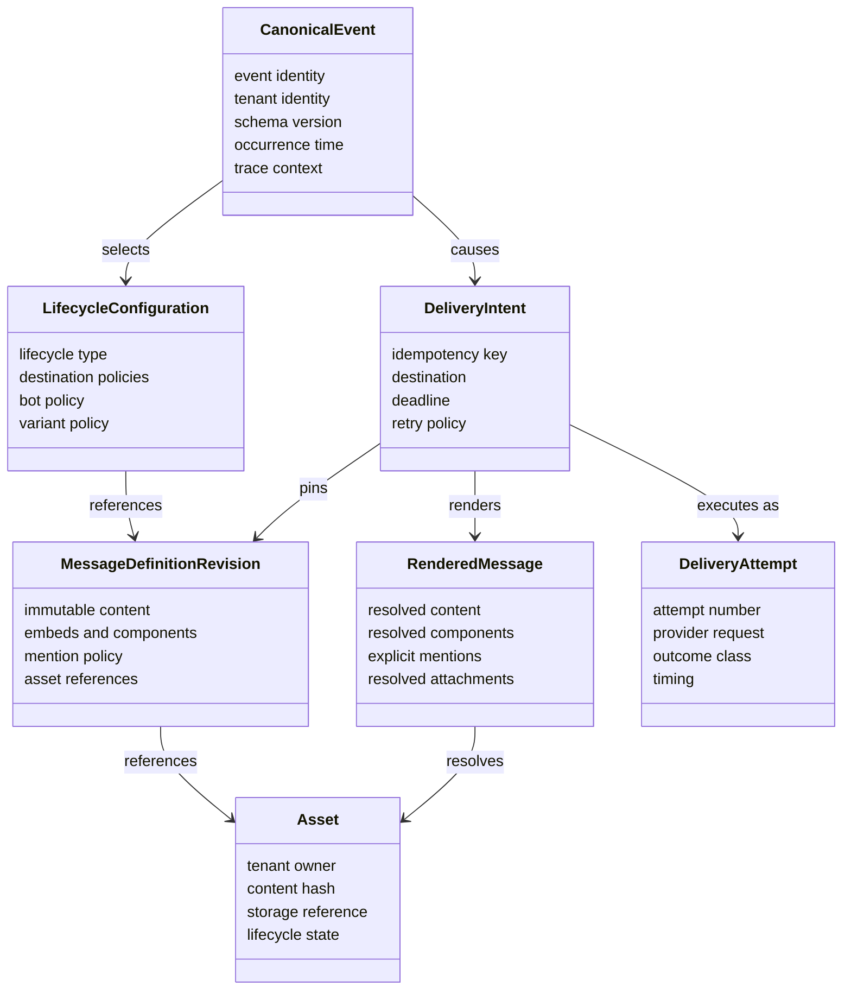
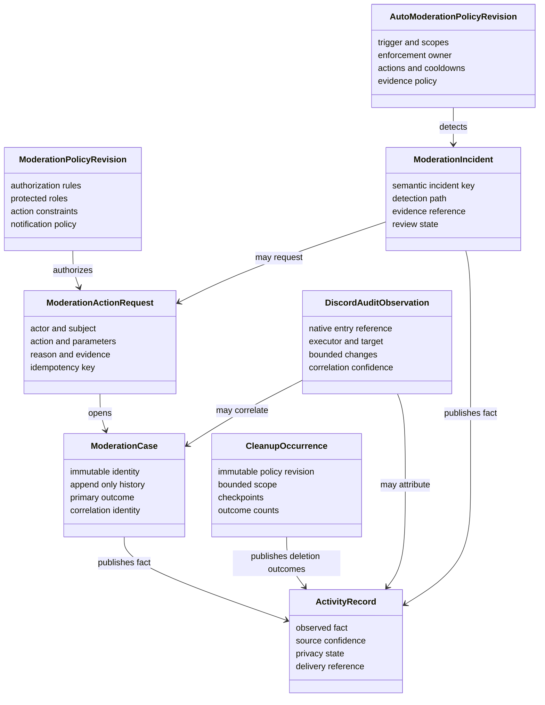
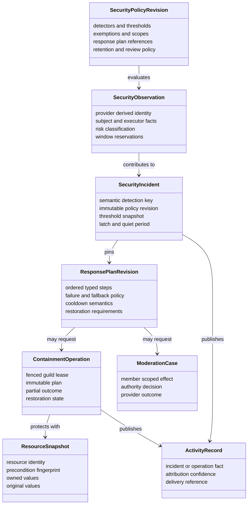
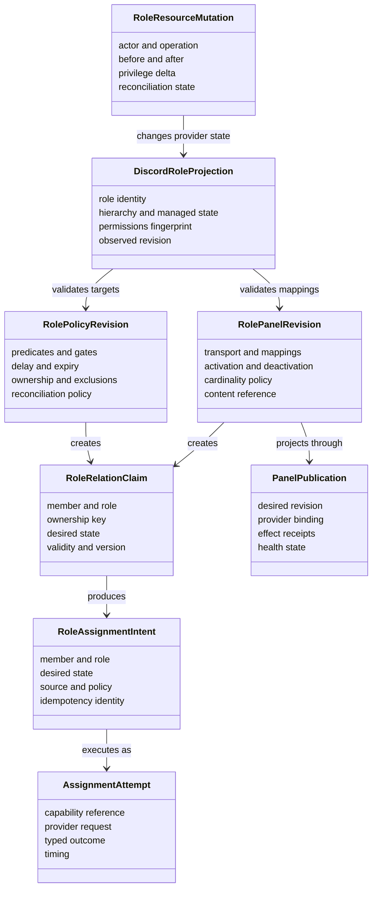
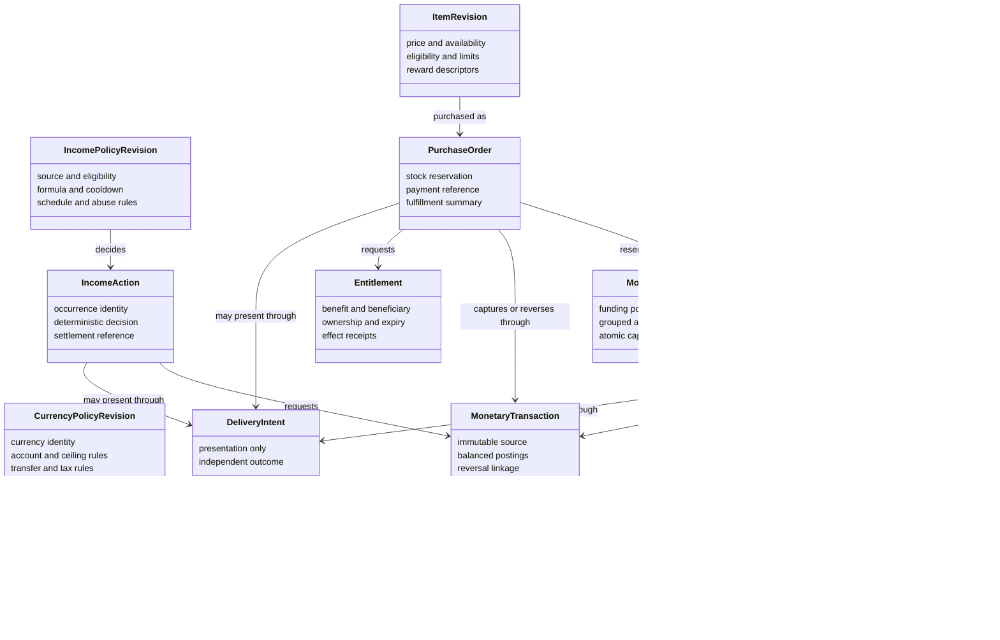
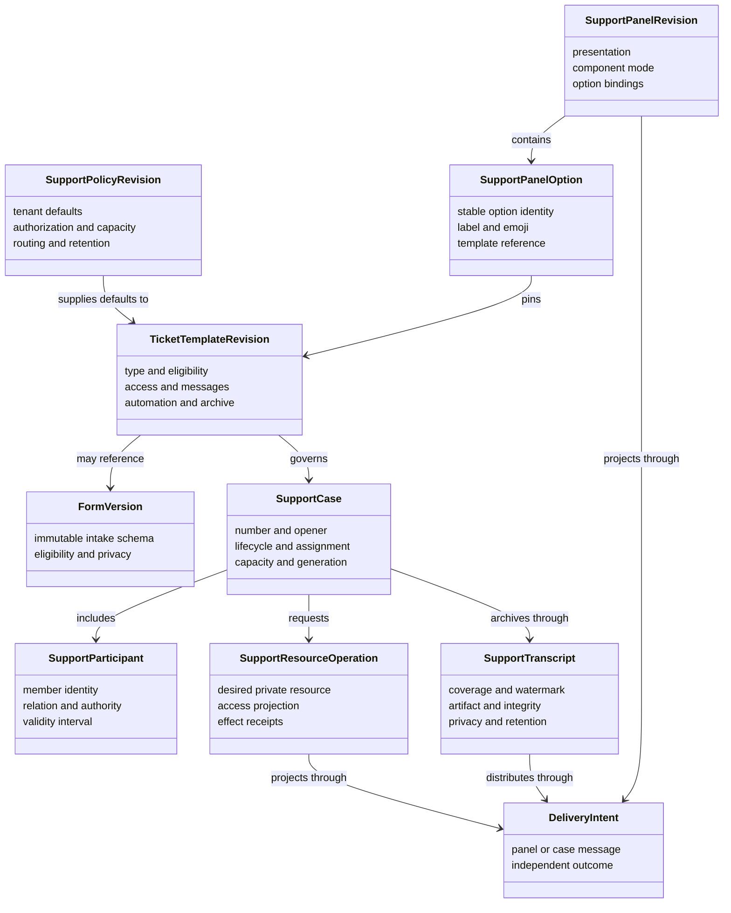
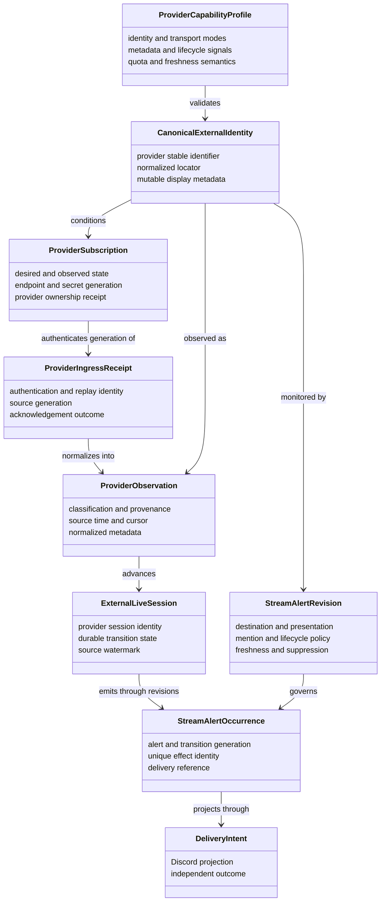
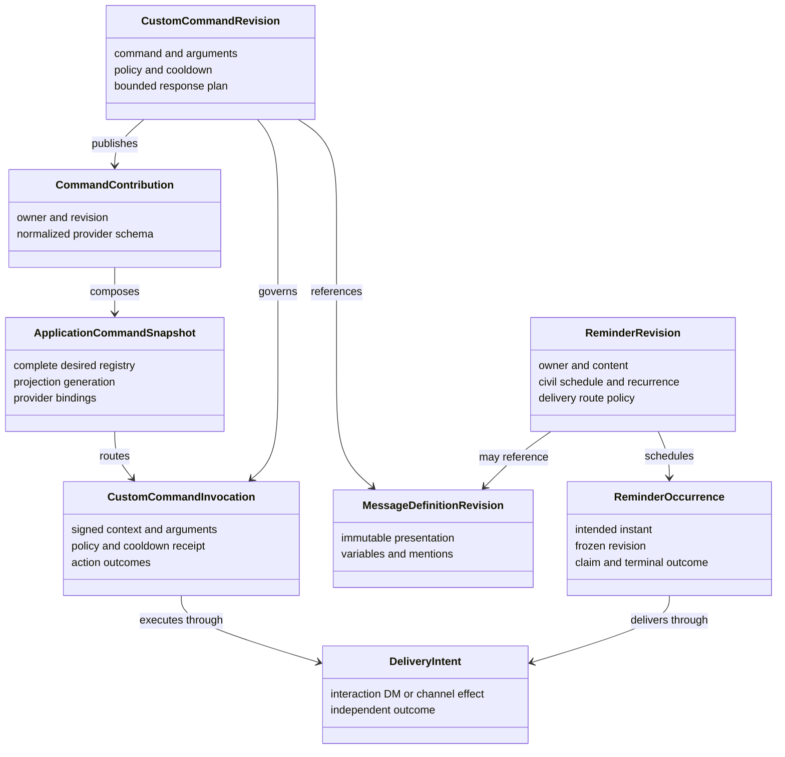
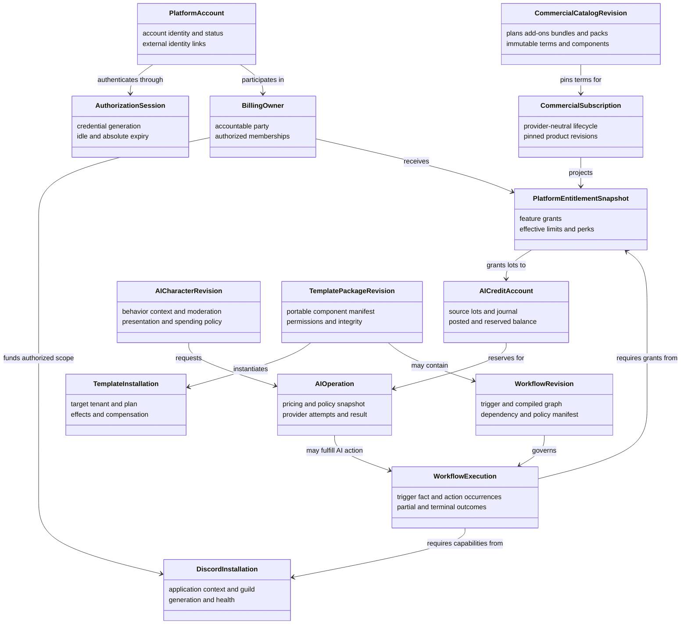

# Tobot Architecture — Domain Relationships

[Architecture index](README.md) · [Previous](05-state-models.md) · [Next](07-data-core.md)

## 11. Domain relationship model

### 11.1 Moderation domain relationships

### 11.2 Security domain relationships

### 11.3 Roles domain relationships

### 11.4 Community domain relationships

### 11.5 Economy domain relationships

### 11.6 Support domain relationships

### 11.7 External integration and stream-alert relationships

### 11.8 Automation command and reminder relationships

### 11.9 Platform access, commercial, AI, template, and workflow relationships

These relationships are references across bounded contexts, not shared aggregate ownership. Billing never authorizes a Discord mutation by itself; identity, current guild authority, installation capability, platform entitlement, and the owning module's policy remain independent gates. A template can declare a workflow, but the installed workflow becomes a tenant-owned aggregate with its own revision and lifecycle.
