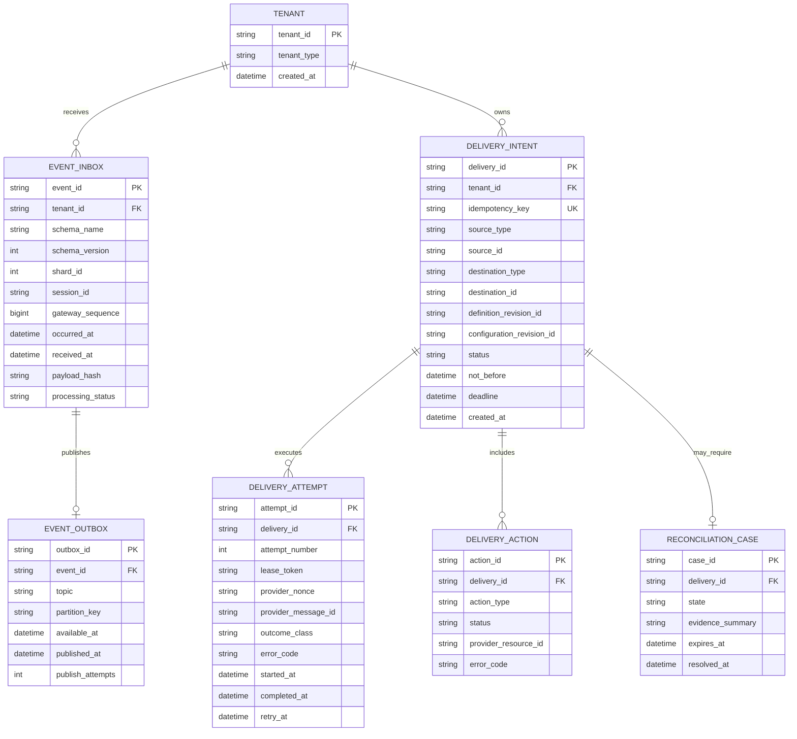
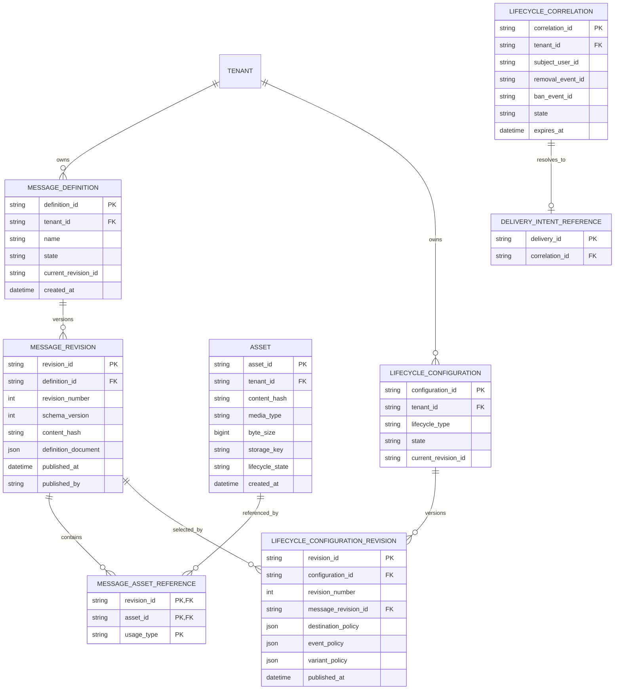
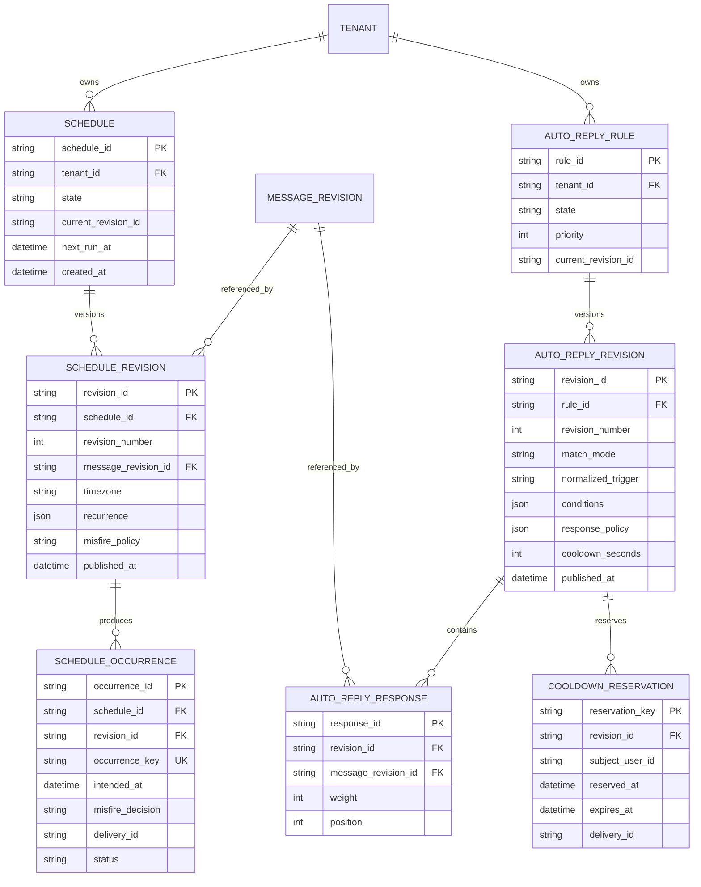

# Tobot Architecture — Core Data

[Architecture index](README.md) · [Previous](06-domain-relationships.md) · [Next](08-data-safety-and-access.md)

## 12. Data architecture

### 12.1 Ownership rules

- Every mutable aggregate has exactly one owning service.
- A service MUST NOT write another service's tables.
- Cross-service reads use APIs, events, or local projections; they MUST NOT use cross-service SQL joins.
- A physical relational cluster MAY host multiple service databases or schemas, but ownership and credentials remain isolated.
- Each transactional service owns its inbox and outbox in the same transactional boundary as its aggregates.
- Durable event-bus retention is not a substitute for authoritative service storage.
- Cache, compiled matchers, due-work notifications, and read projections are rebuildable.
- Object bytes and object metadata have one owner: the Asset Service.

### 12.2 Core event and delivery data model

### 12.3 Message catalog and lifecycle model

### 12.4 Scheduling and automatic reply model

