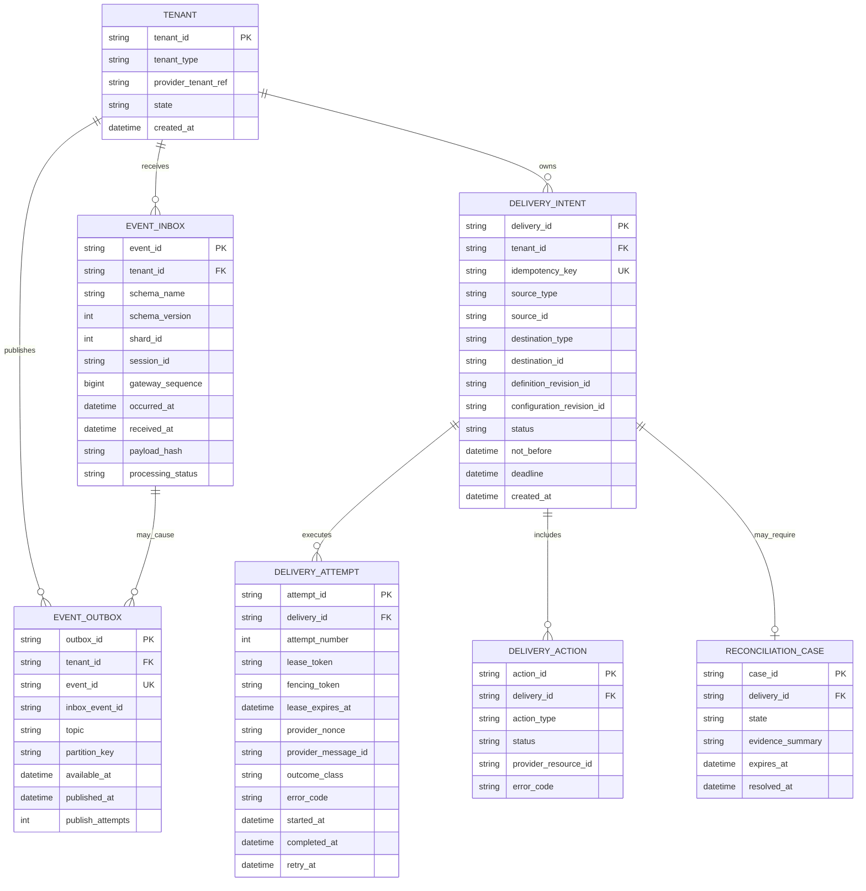
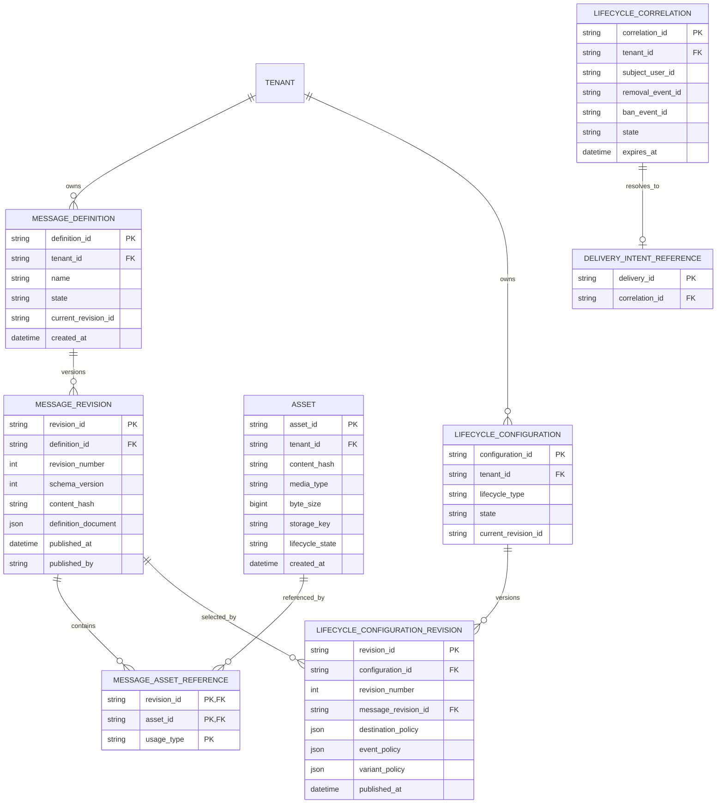
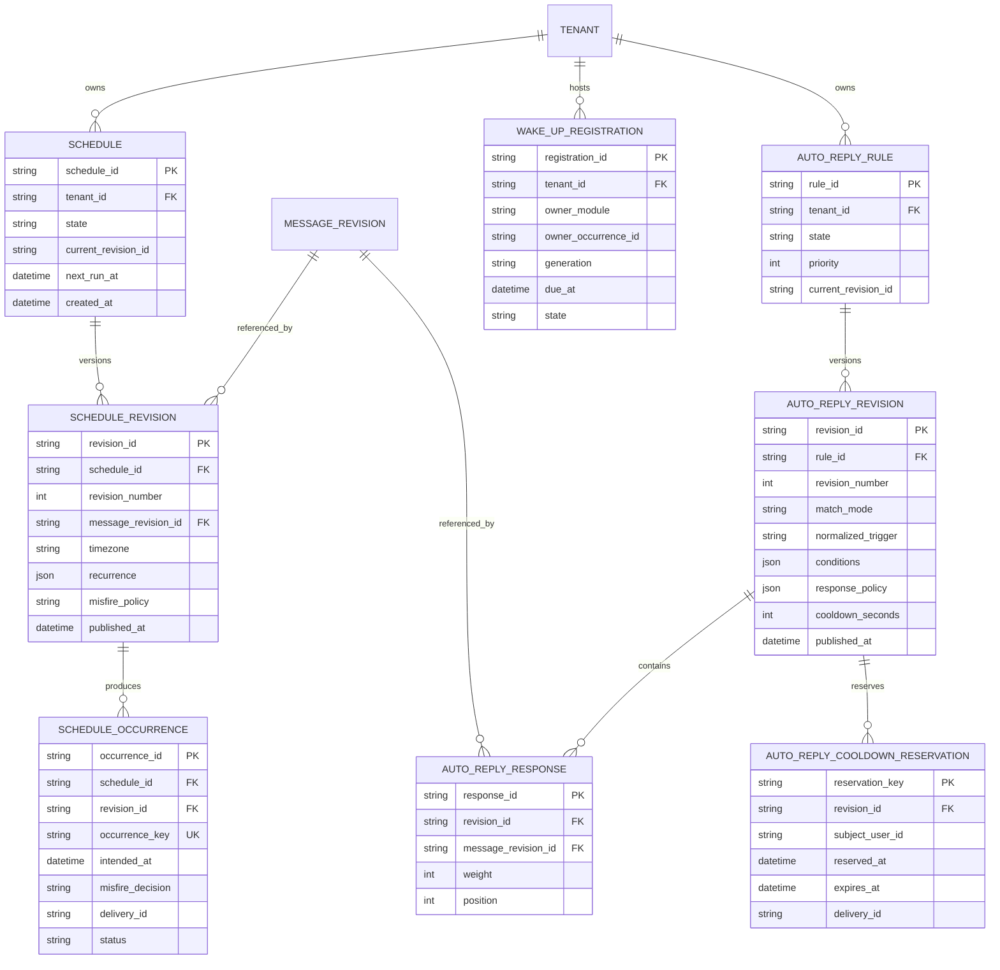

# Tobot Architecture — Core Data

[Architecture index](README.md) · [Previous](06-domain-relationships.md) · [Next](08-data-safety-and-access.md)

## 12. Data architecture

### 12.1 Ownership rules

- Every mutable aggregate has exactly one owning service.
- Conceptual ERD type names that would collide across owners MUST be qualified by the owning module. Homonyms are not shared aggregates (DR-015).
- A service MUST NOT write another service's tables.
- Cross-service reads use APIs, events, or local projections; they MUST NOT use cross-service SQL joins.
- A physical relational cluster MAY host multiple service databases or schemas, but ownership and credentials remain isolated.
- Each transactional service owns its inbox and outbox as sibling tables in the same transactional boundary as its aggregates. An outbox insert MUST NOT require an inbox row (DR-021).
- Durable event-bus retention is not a substitute for authoritative service storage. Canonical replay of facts lives in the owner's outbox, consumer inboxes, and delivery ledger. The first bus adapter is Redis Streams; a foreign service MUST NOT query another owner's outbox tables (DR-039). Outbox and inbox envelope bytes are versioned JSON (DR-040). Live application of those bytes uses majors N and N-1; older majors fail closed as unsupported (DR-048).
- Owner-schema tables are private implementation, not integration contracts. A service MUST NOT ALTER another owner's schema. Breaking physical changes during a rolling deploy MUST expand (additive DDL compatible with the running binary), dual-write and dual-read while mixed binaries of that owner run, contract (stop reading and writing the old shape), then drop after soak. First-product soak is 24 Clock-port hours, range 1 through 72, after every replica of that owning service runs a binary that neither reads nor writes the old shape. Envelope N-1 is not this window. Live mappers MUST NOT `SELECT *`. Versioned forward migrations are the authority; production schema-push or auto-migrate is forbidden. In-place rename, type change, or DROP while an old binary of that owner still runs is forbidden. Additive nullable columns or new tables MAY expand in one step when existing binaries ignore unknown columns. PITR restore MUST apply the same versioned migrations as the binary generation (DR-064).
- Cache, compiled matchers, due-work notifications, and read projections are rebuildable.
- Object bytes and object metadata have one owner: the Asset Service.
- Every read and mutation of a tenant-scoped aggregate, projection, cache entry, object key, inbox row, or outbox row MUST include a tenant predicate bound from authenticated context, not solely from a client-supplied `tenant_id` or `guild_id`. Queries MUST be parameterized. A missing or mismatched tenant predicate MUST fail closed. A globally unique primary key MUST NOT substitute for the tenant predicate. Cache keys and object-storage keys MUST include the same tenant bound. Cross-tenant joins on product query paths are forbidden (DR-033).

### 12.2 Core event and delivery data model

`TENANT` on this diagram is the isolation key stored by product schemas. The registry aggregate is owned by Discord Installation. First-product `tenant_type` is `Guild` or `User`. `tenant_id` is platform identity, not a Discord snowflake. Product modules MUST NOT insert TENANT registry rows (DR-059).

Inbox and outbox are sibling tables of the owning service (DR-021). `EVENT_OUTBOX.event_id` is the published fact identity from the §8.1 envelope, not a foreign key to `EVENT_INBOX`. `inbox_event_id` is an optional causal reference when the fact is a reaction to ingested work. Internally originated facts (schedule dues, case outcomes, delivery status, commands) insert outbox without an inbox parent. Correlation and causation live on the event envelope. Dispatcher fields (`available_at`, `published_at`, `publish_attempts`) record bus relay, not consumer application. The first consumer MUST NOT mark the outbox consumed for other groups (DR-039).

Destination, definition revision, and configuration revision on `DELIVERY_INTENT` are immutable after insert. A `Blocked` row is not updated into `Pending`. Due-work `lease_expires_at` is Clock-port UTC. First-product `lease_ttl` is 15 Clock-port seconds (DR-060).

#### Decision Record DR-021

**Status:** Accepted.

**Decision:** Inbox and outbox are sibling tables. An outbox row MUST NOT require an inbox parent. Internally originated facts insert outbox without inbox. When a fact is a reaction to ingested work, the outbox MAY record an optional causal inbox identity. `EVENT_OUTBOX.event_id` is the published envelope identity.

**Rejected Alternative:** Requiring every published fact to be a child of an ingested inbox event; treating outbox `event_id` as a foreign key to inbox.

#### Decision Record DR-039

**Status:** Accepted.

**Decision:** The outbox is the publication log. Cross-service facts are dispatched to Redis Streams after commit. Consumers apply through their own inbox and partition cursor. Foreign services MUST NOT read another owner's outbox. Intra-service claiming MAY use `SKIP LOCKED`. Redis Pub/Sub and RabbitMQ are not this bus. Canonical retention stays in SQL.

**Rejected Alternative:** Postgres-only as the sole cross-service bus; a single outbox `processed` flag for all consumer groups; mixing Streams with cache eviction.

#### Decision Record DR-048

**Status:** Accepted.

**Decision:** Outbox and inbox live application uses majors N and N-1. SQL MAY retain older envelope bytes for audit. Applying N-2 as a live fact fails closed as unsupported.

**Rejected Alternative:** Replaying every historical major as live facts; silent drop of unsupported versions.

#### Decision Record DR-064

**Status:** Accepted.

**Decision:** Owner-schema tables are not integration contracts. Breaking private DDL during a rolling deploy MUST expand, dual-write, contract, then drop. Envelope N-1 is not that window. Soak before drop is 24 Clock-port hours after the last replica of that owner neither reads nor writes the old shape.

**Rejected Alternative:** In-place rename or DROP while an old binary still runs; using envelope `schema_version` as table version; production schema-push as migration authority; `SELECT *` as the live mapper.

### 12.3 Message catalog and lifecycle model

AI protected-content bodies, OCR source bytes, and generated AI media use this `ASSET` row. `asset_id` is not `input_ref`. Conversation order is not Asset metadata (DR-063).

### 12.4 Scheduling and automatic reply model

Opaque `WAKE_UP_REGISTRATION` rows are Schedule-owned Durable Timer state. Due-work signals are rebuildable from these rows and from scheduled-message occurrences. Owner modules retain their business occurrences.

Auto Reply cooldown state is `AUTO_REPLY_COOLDOWN_RESERVATION`. It is not a shared cooldown type. Custom Command Runtime owns a distinct `CUSTOM_COMMAND_COOLDOWN_RESERVATION`. Earnings already uses `INCOME_COOLDOWN`. Generic product prose may still say “cooldown reservation”; that phrase does not name one aggregate.

#### Decision Record DR-015

**Status:** Accepted.

**Decision:** Conceptual ERD type names that would collide across owners are qualified by owner. Closures: `AUTO_REPLY_COOLDOWN_RESERVATION` vs `CUSTOM_COMMAND_COOLDOWN_RESERVATION`; `ROLE_PANEL_PUBLICATION` vs `SUPPORT_PANEL_PUBLICATION`. The sibling homonym `PANEL_PROVIDER_BINDING` is `ROLE_PANEL_PROVIDER_BINDING` vs `SUPPORT_PANEL_PROVIDER_BINDING`. Physical schemas were already owner-namespaced in §12.1; this record makes the conceptual model match. Product English may keep generic phrases.

**Rejected Alternative:** One shared `COOLDOWN_RESERVATION` or `PANEL_PUBLICATION` type across owners; treating ERD homonyms as one physical table.
