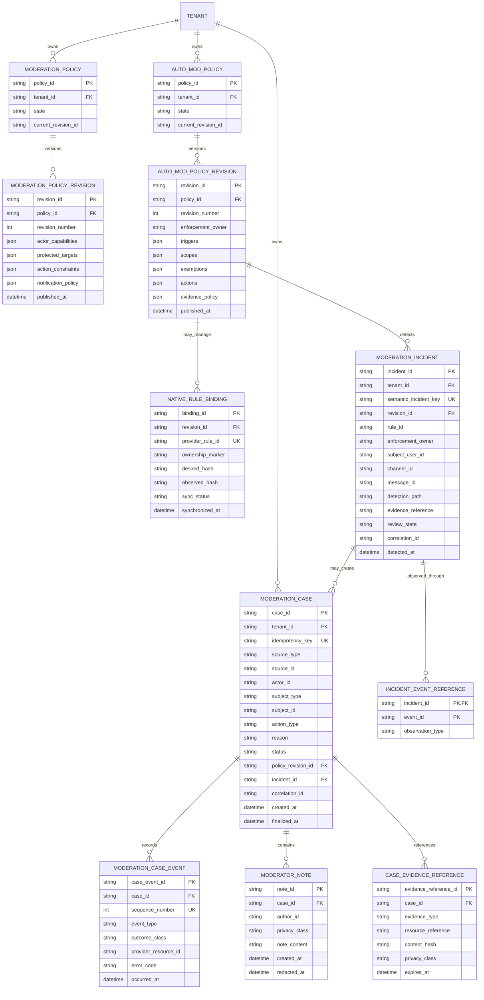
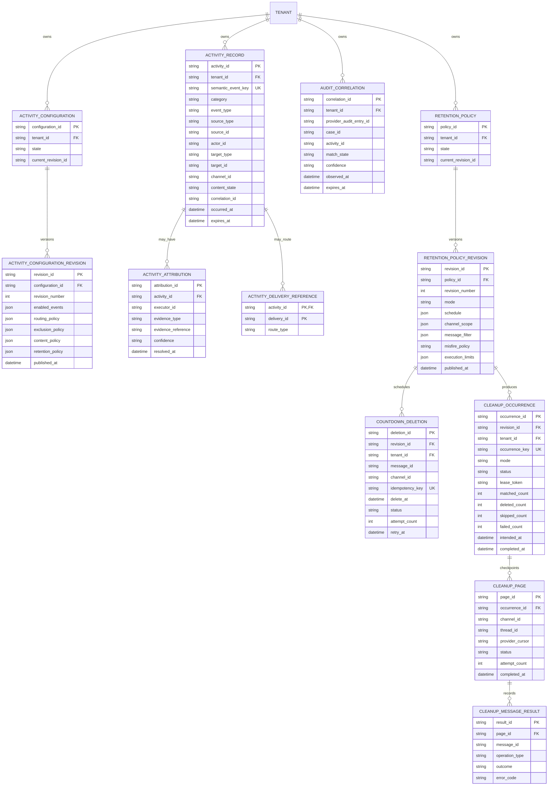
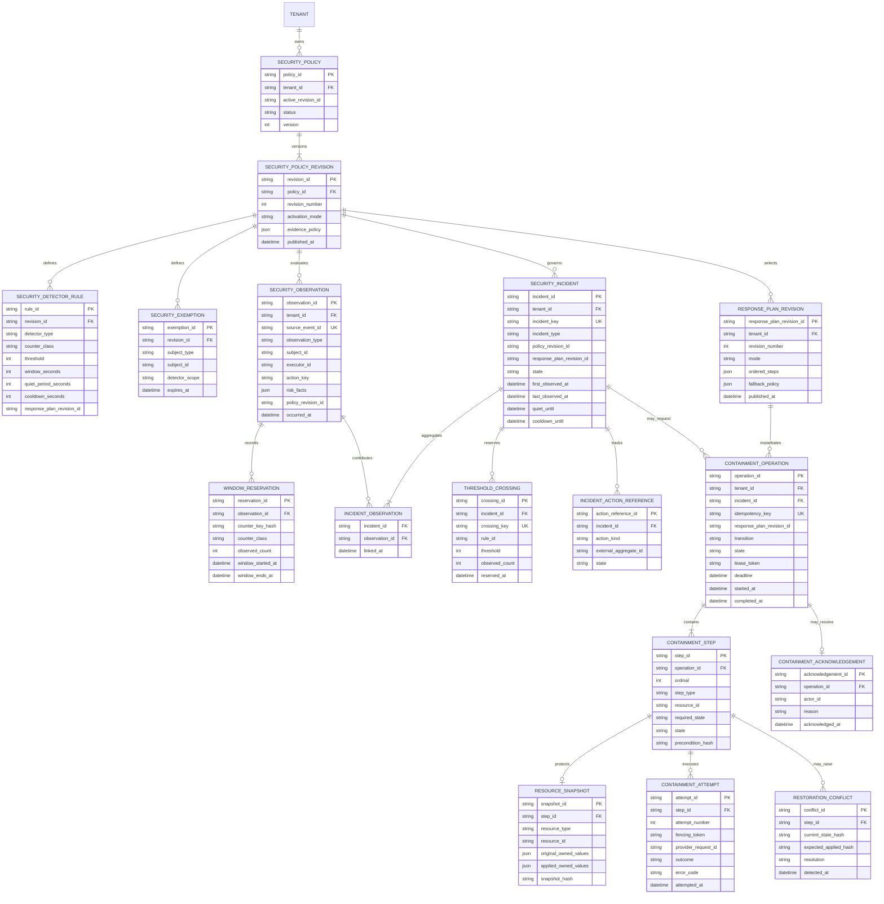
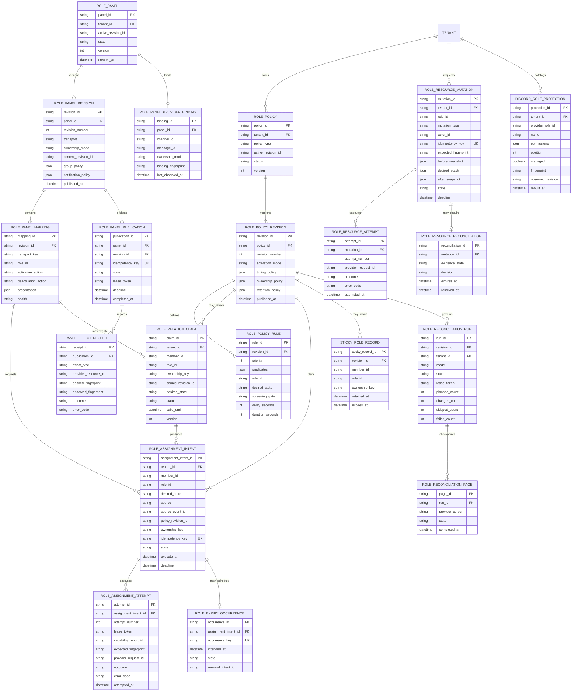

# Tobot Architecture — Safety and Access Data

[Architecture index](README.md) · [Previous](07-data-core.md) · [Next](09-data-community-and-economy.md)

### 12.5 Moderation cases and automatic moderation model

`MODERATION_POLICY_REVISION.protected_targets` is the protected-user and protected-role product policy (DR-020). Discord Capability MUST NOT write this aggregate.

### 12.6 Activity, audit correlation, and retention cleanup model

### 12.7 Security incident and containment model

The Security Policy and Incident Service owns the policy, observation, window-reservation, incident, and response-decision records. The Containment Orchestrator owns operation, lease, snapshot, step, attempt, conflict, and acknowledgement records. A distributed counter adapter may use a non-relational TTL store, but its reservation identity and threshold-crossing decision are durably anchored to the security incident database. Counter storage is coordination state, not the incident ledger.

The unique incident key contains tenant, detector rule, semantic subject, response epoch, and policy revision. A new policy revision or an elapsed cooldown may admit a new incident; repeated observations inside the same latch update the existing aggregate. Observation-to-incident links may be retention-pruned after aggregate counters and evidence requirements are satisfied, while incident and action history follow the configured security audit duration.

### 12.8 Role policy, panel, assignment, and resource model

Role Policy and Assignment owns policy, desired member-role relation, assignment, timer, and reconciliation records, including Cases-owned punitive intents it executes. Role Panel owns panel, revision, mapping, `ROLE_PANEL_PUBLICATION`, `ROLE_PANEL_PROVIDER_BINDING`, projection, and health records. Role Resource owns administrative mutation history and the rebuildable `DISCORD_ROLE_PROJECTION` guild-role catalog (DR-014). Discord Capability owns rebuildable guild, member, channel, overwrite, member-role, and permission reports used for preflight; it MUST NOT write `DISCORD_ROLE_PROJECTION`. Discord remains provider-authoritative for live role bytes. Moderation Cases owns punitive desired state and MUST NOT call Transport for member-role add or remove (DR-068).

The role-assignment idempotency key contains tenant, member, role, desired state, ownership key, policy revision, and source event or occurrence identity. A newer policy may supersede pending work, but confirmed history is never rewritten. Panel transport keys are unique within one revision. Provider role and message identifiers are references, not aggregate keys across tenants. `DISCORD_ROLE_PROJECTION` is unique per tenant and provider role identity and is written only by Role Resource. `ROLE_PANEL_PUBLICATION` is Role Panel's publication aggregate (DR-015). It is not Support Panel's `SUPPORT_PANEL_PUBLICATION`.
