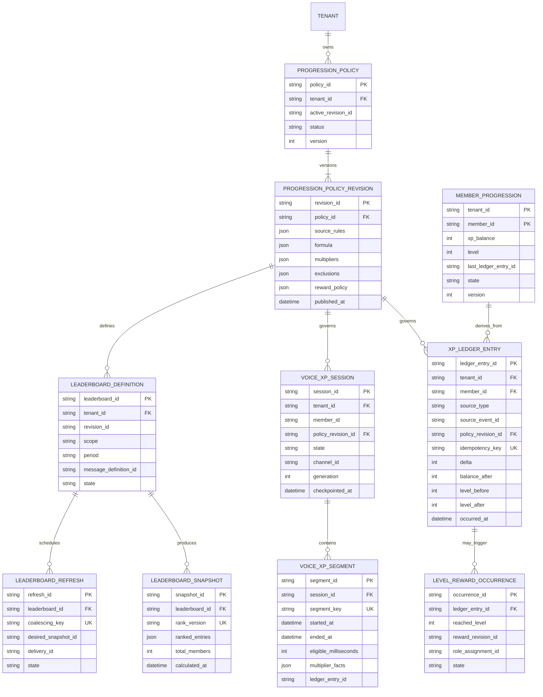
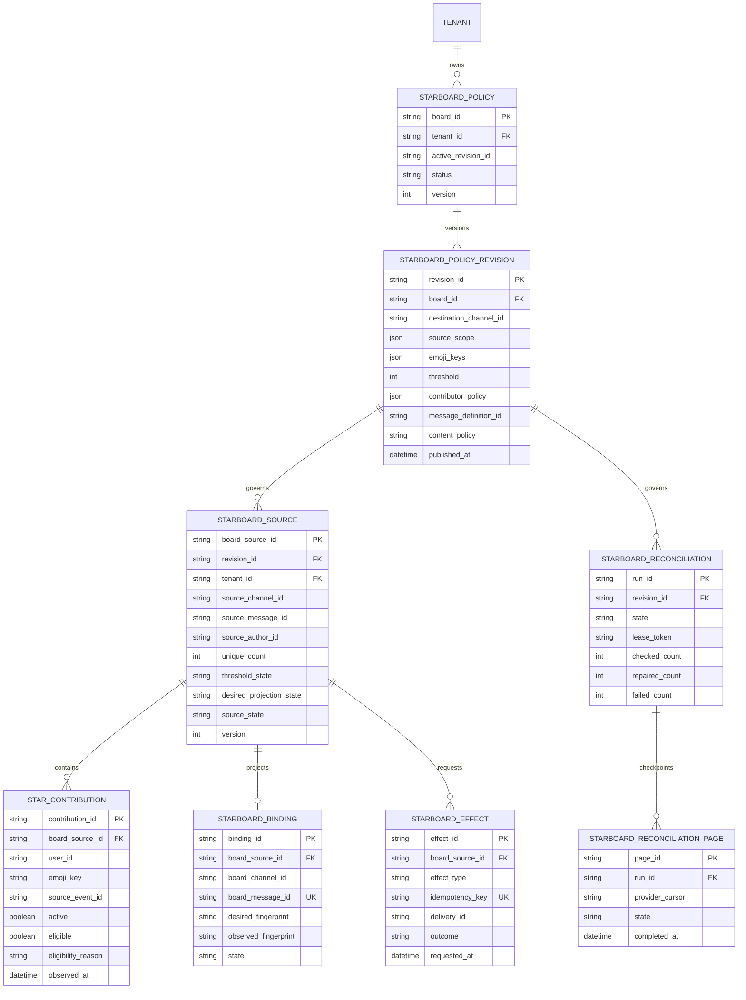
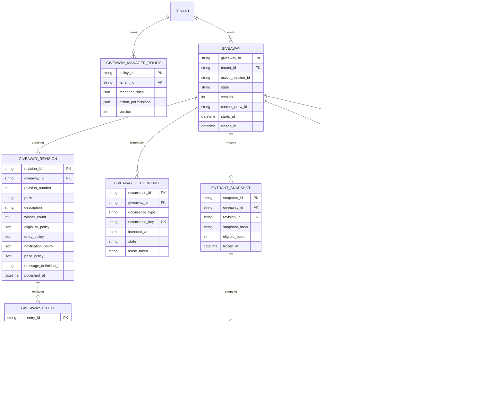
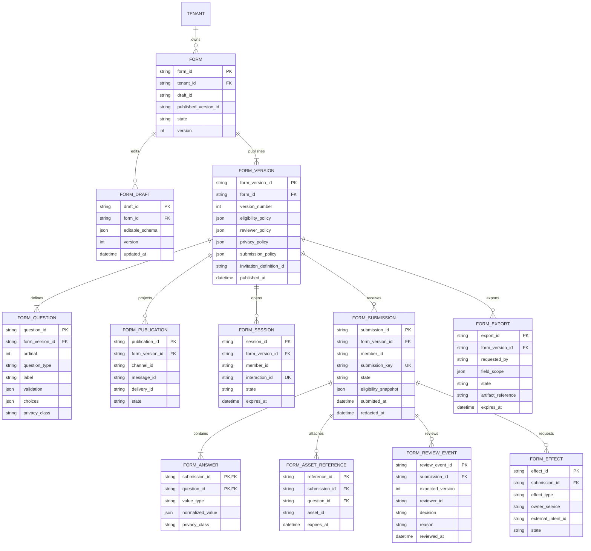
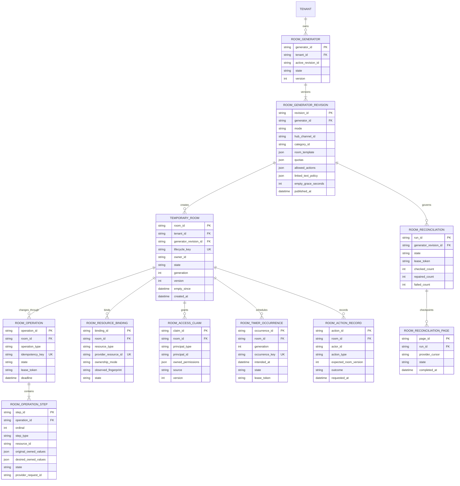
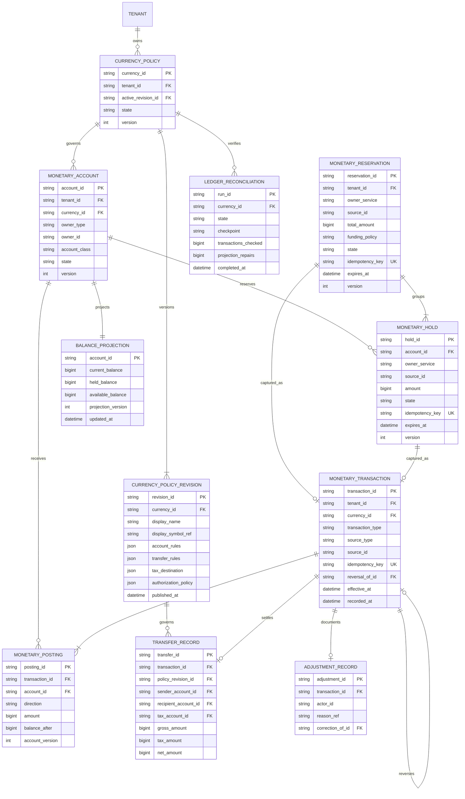
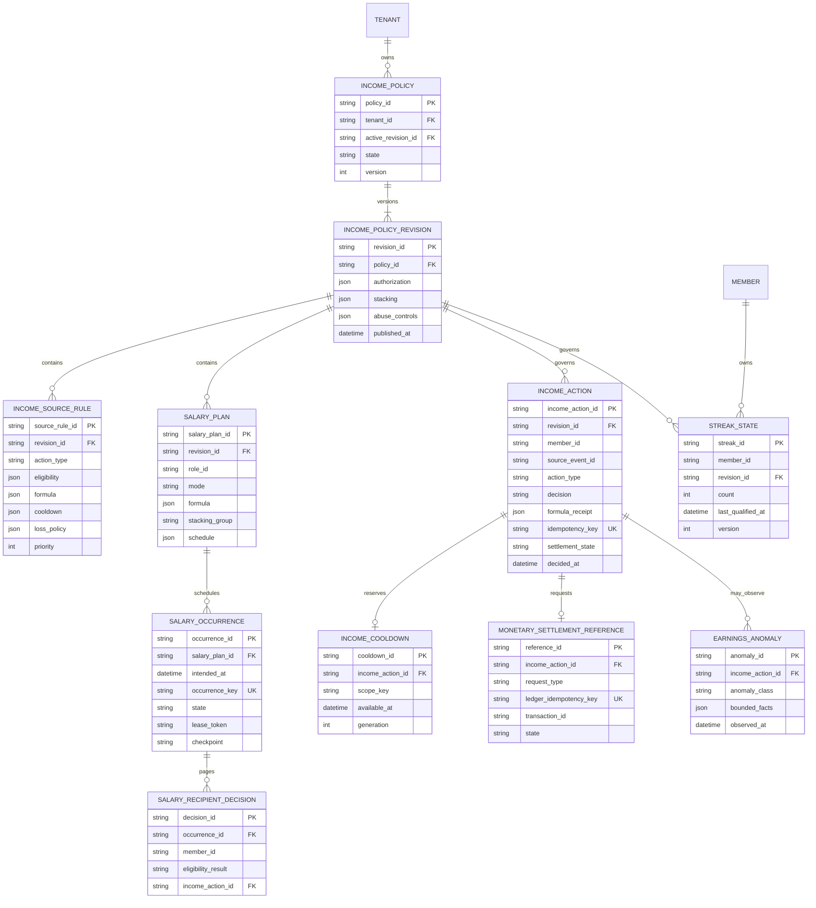
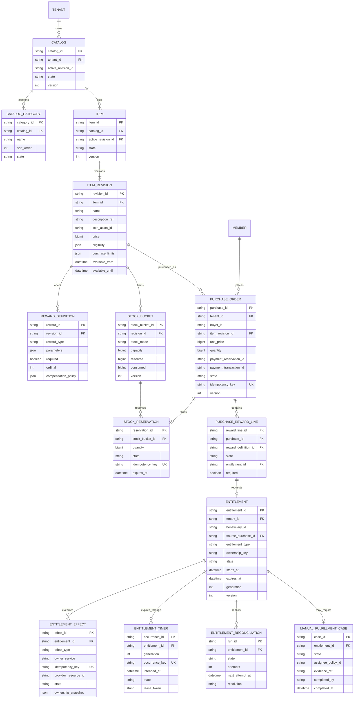
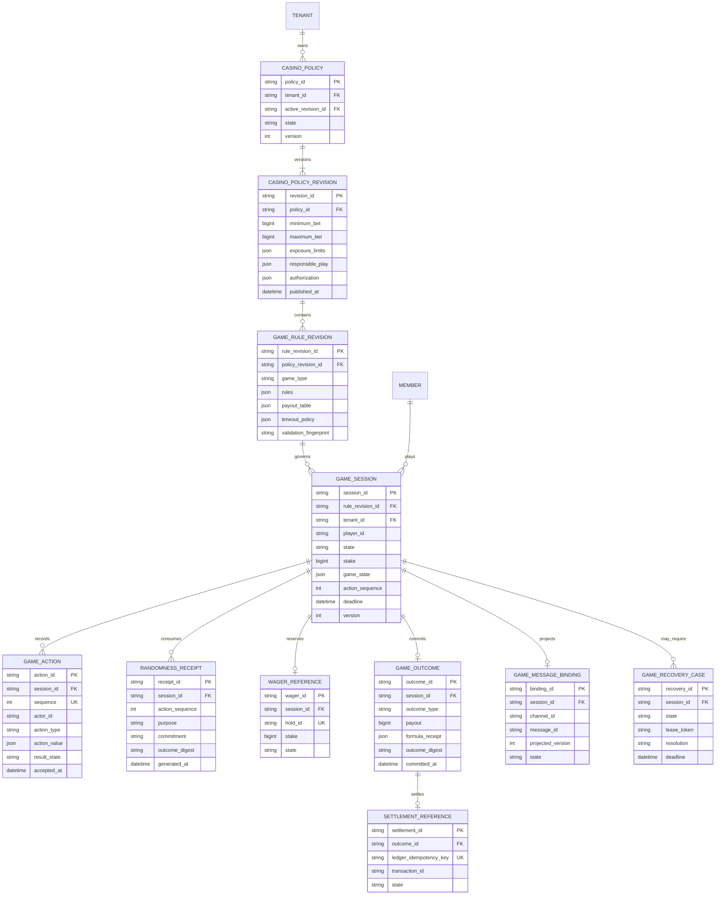

# Tobot Architecture — Community and Economy Data

[Architecture index](README.md) · [Previous](08-data-safety-and-access.md) · [Next](10-data-support-integrations-automation.md)

### 12.9 Community experience models

Each community bounded context owns its transactional database and outbox. Shared identifiers create correlations only; they do not authorize cross-service SQL joins or writes.

**Progression model:**

**Starboard model:**

**Giveaway model:**

**Form model:**

**Temporary room model:**

Entrant, contributor, form member, XP member, and room principal identifiers are tenant-scoped even when a diagram omits the repeated tenant foreign key for readability. Unique constraints include tenant identity whenever provider identifiers are not globally sufficient for authorization.

### 12.10 Economy, commerce, entitlement, and casino models

Monetary records use integer minor virtual units. Floating-point values are forbidden for balances, prices, stakes, postings, percentages, and payout settlement. Percentage and multiplier policies store bounded rational or fixed-scale decimal parameters and one explicit rounding rule. Commercial billing and AI Credits follow the same integer-minor rule on isolated planes (DR-016) and MUST NOT share this journal.

`CATALOG` and `PURCHASE_ORDER.payment_reservation_id` are guild-shop virtual commerce. Public capture facts are `VirtualPayment`. This `CATALOG` is not §8.43 commercial catalog (DR-065). The `ENTITLEMENT` row is the guild commerce-reward aggregate; public contracts are `GuildRewardEntitlement`. Module 7.35 is not deleted. It is not Platform Entitlement (DR-066). Unprefixed `Entitlement*` names MUST fail closed at parse. This table MUST NOT be Platform Entitlement's journal (DR-069).

Tenant identity participates in every account-owner, member, item, purchase, entitlement, and session uniqueness constraint. References to ledger transactions and Discord resources are opaque cross-service identities, not foreign keys across service-owned databases.
