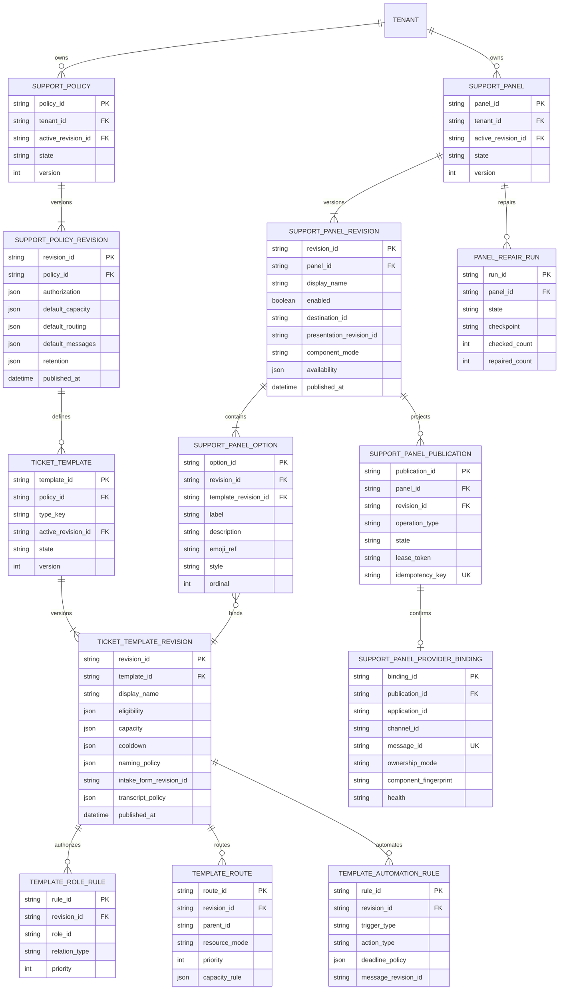
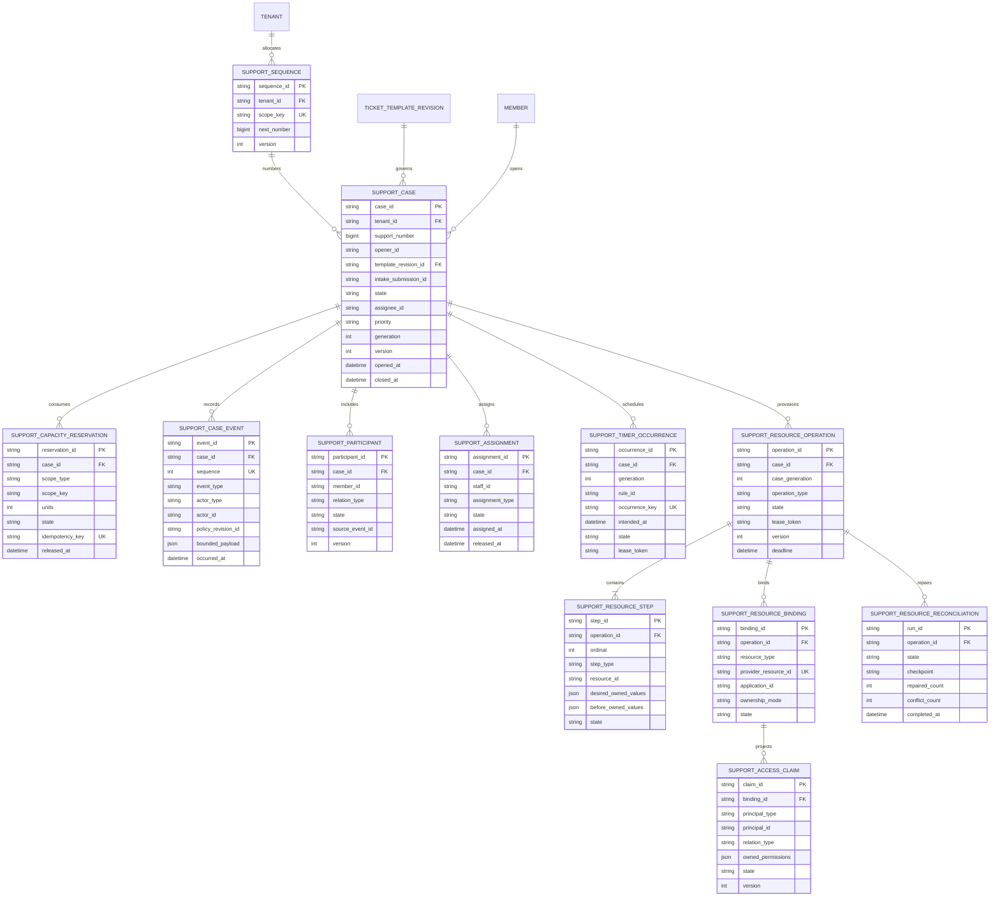
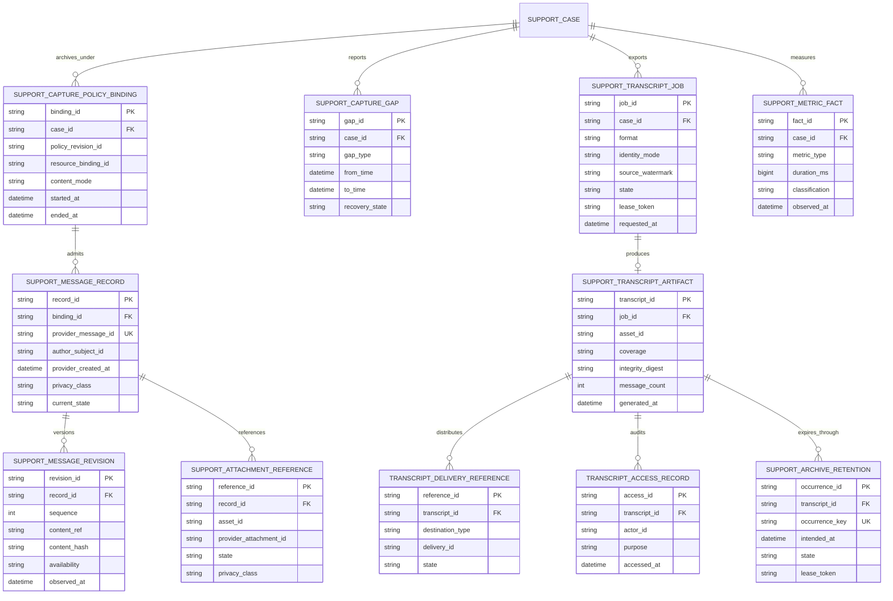
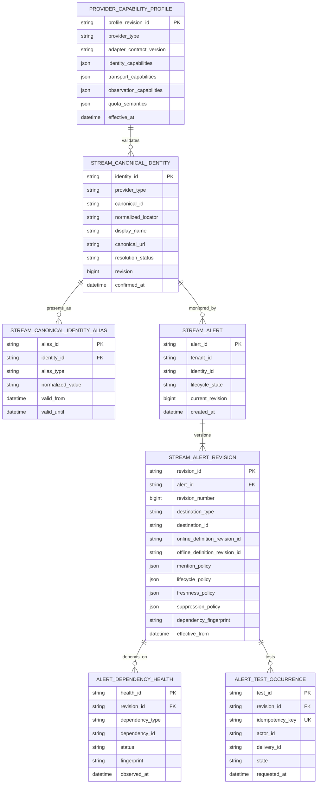
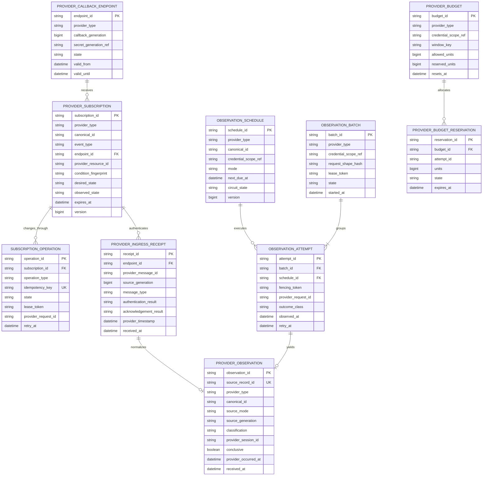
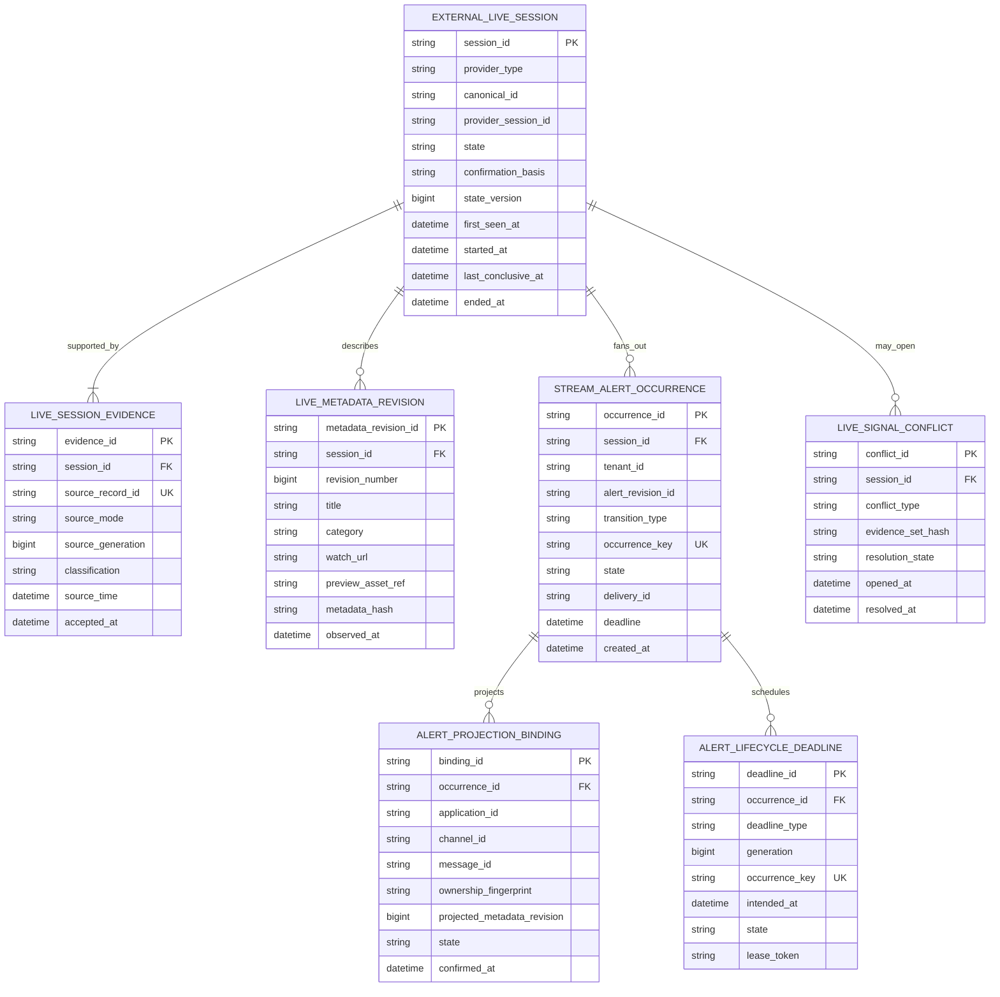
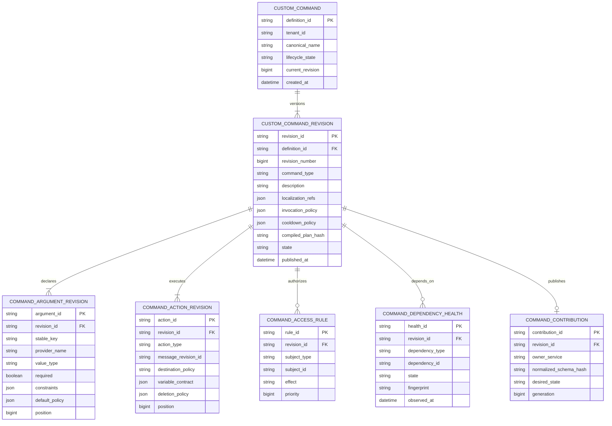
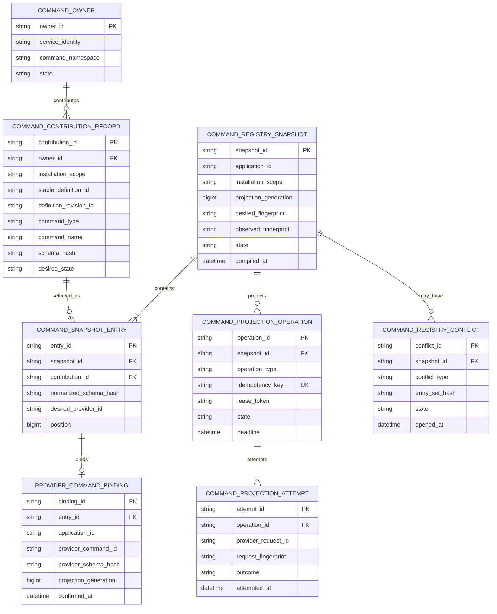
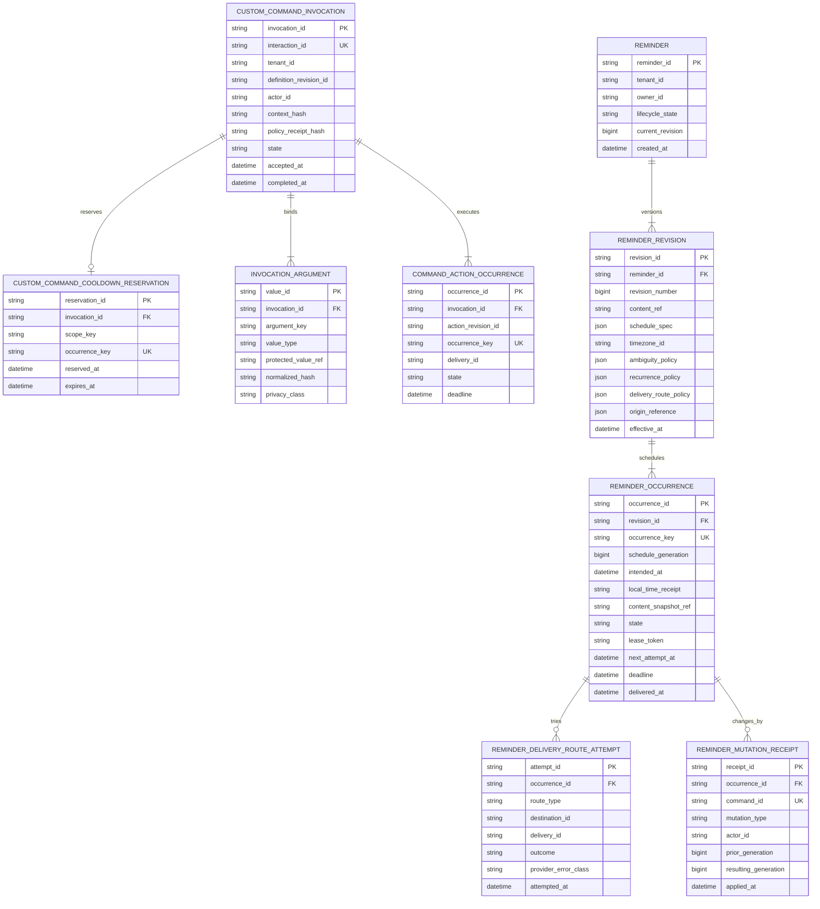

# Tobot Architecture — Support, Integration, and Automation Data

[Architecture index](README.md) · [Previous](09-data-community-and-economy.md) · [Next](10a-data-platform-access-commercial-ai.md)

### 12.11 Support policy, panel, case, resource, and archive models

`SUPPORT_PANEL_PUBLICATION` and `SUPPORT_PANEL_PROVIDER_BINDING` are Support Panel aggregates (DR-015). They are not Role Panel's `ROLE_PANEL_PUBLICATION` or `ROLE_PANEL_PROVIDER_BINDING`.

Support sequence numbers are unique only within their declared tenant scope and are never reused. Provider message, channel, and thread identities remain opaque external bindings, not primary case identity. Form submissions and Asset objects are cross-service references rather than foreign keys into another owner's tables.

### 12.12 External integration, provider observation, and stream-alert models

Integration Registry Service owns configuration and identity bindings. Provider Event Edge owns authenticated transport receipts. Provider Observation Scheduler owns poll execution. Provider Subscription Orchestrator owns provider resource convergence. External Live Signal Service owns session truth and alert occurrences. References between these stores are opaque identifiers carried by contracts, never cross-service foreign keys.

Stream channel identity is `STREAM_CANONICAL_IDENTITY` (DR-017). It is not Identity's `PLATFORM_EXTERNAL_IDENTITY`. Aliases are `STREAM_CANONICAL_IDENTITY_ALIAS`.

The uniqueness boundary for an enabled definition is configurable but MUST prevent accidental duplicate monitoring of the same canonical identity and equivalent effect policy within one tenant. Multiple alert definitions for one identity are admitted only when their destinations or declared product purpose differ and tenant limits permit them.

Ingress-receipt uniqueness is scoped by provider, endpoint or connection generation, and provider message identity. Provider payload retention is bounded and may be reduced to a digest plus verification evidence after normalization. Observation batches never imply one shared classification: every requested canonical identity owns a result or an explicit inconclusive outcome.

The live-session uniqueness rule is provider type, `STREAM_CANONICAL_IDENTITY`, and provider session identity. The alert-occurrence uniqueness rule additionally pins alert revision, transition type, and lifecycle generation. Delivery and Discord message identifiers are projection references and never determine whether the external session exists.

### 12.13 Custom command, registry, invocation, and reminder models

Custom Command Definition Service owns authored behavior. Application Command Registry owns the complete provider registry and bindings. Custom Command Runtime owns invocation decisions and reservations. Reminder Service owns personal schedule and occurrence state. Delivery IDs, Message Catalog revisions, Asset IDs, Discord roles, channels, messages, and Activity Log records are cross-service references rather than writable foreign relations.

Names are unique within application installation, command type, and provider localization rules after reserved built-in contributions are composed. Argument stable keys survive provider-name localization and permit historical invocation interpretation.

Only Application Command Registry may own a provider command binding or issue a complete registry overwrite. A binding retains owner and definition revision so Interaction Edge can route without trusting a command name alone.

An interaction ID creates at most one invocation. A `CUSTOM_COMMAND_COOLDOWN_RESERVATION` occurrence key is independent from delivery success and is not Auto Reply's `AUTO_REPLY_COOLDOWN_RESERVATION` (DR-015). A reminder occurrence key is reminder, schedule generation, and intended instant; recurrence expansion, retry, snooze, and reschedule cannot reuse it ambiguously.
