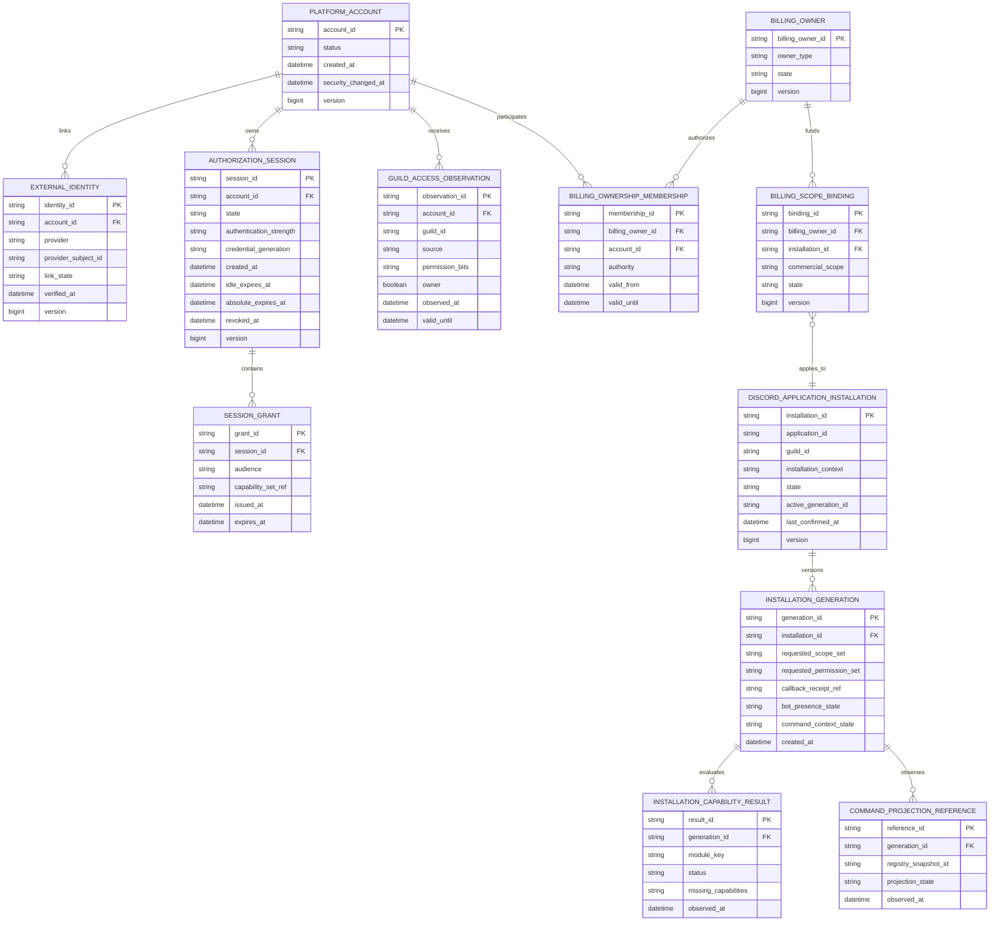
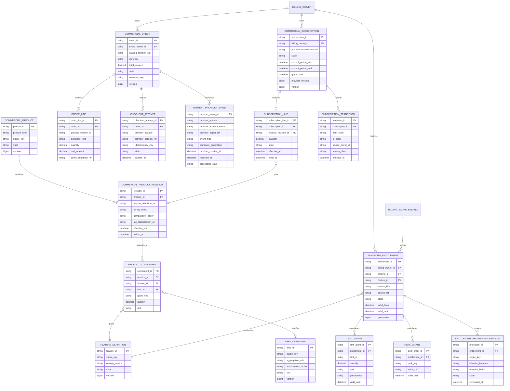
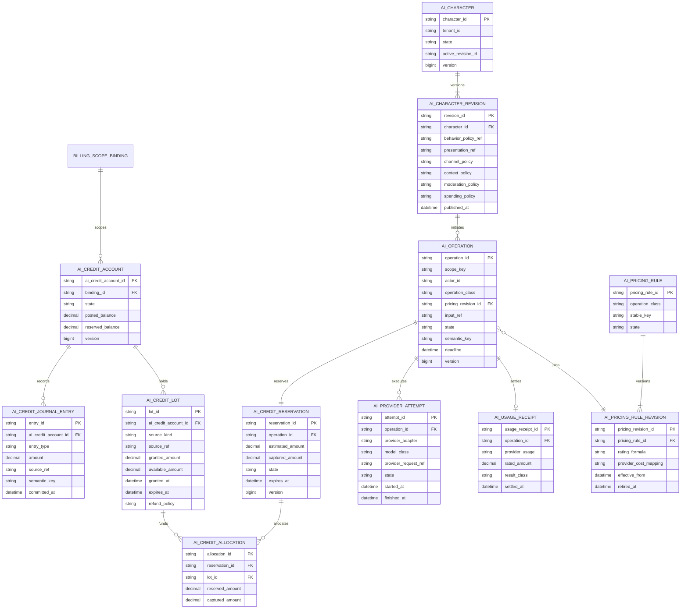
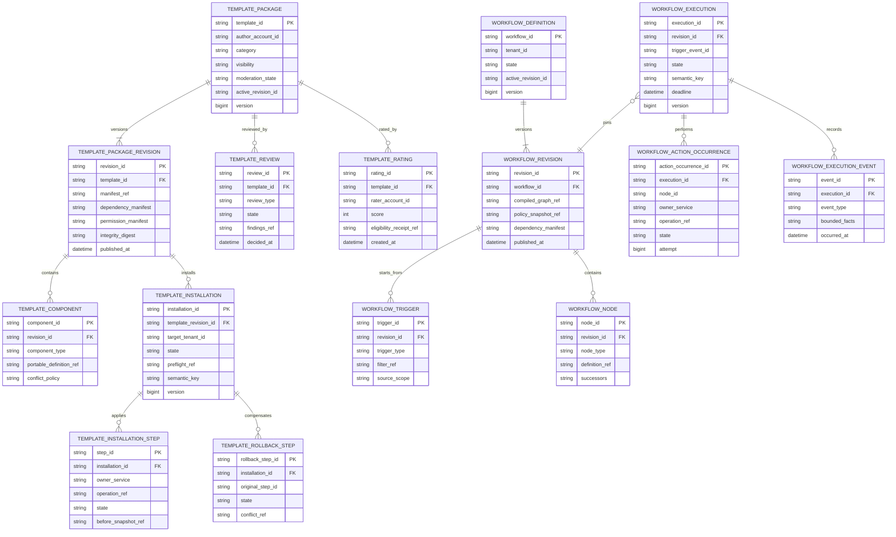

# Tobot Architecture — Platform Access, Commercial, and AI Data

[Architecture index](README.md) · [Previous](10-data-support-integrations-automation.md) · [Next](11-partitioning-discord-backpressure.md)

### 12.14 Platform access, commercial, AI usage, template, and workflow models

This volume separates real-world commercial state from the guild virtual economy defined in section 12.10. Billing amounts, provider customers, invoices, disputes, tax evidence, subscription products, and AI Credit balances MUST NOT share accounts, journals, transaction identifiers, or mutation APIs with guild currency. Cross-service references are opaque identifiers carried by versioned contracts; no service writes another service's tables.

#### 12.14.1 Identity, session, guild authority, and installation

OAuth access and refresh tokens are secret material stored through the secret-management boundary. The relational model stores only encrypted-secret references, token generation, scopes, expiry, revocation state, and audit metadata. OAuth state and proof-key material are single-use, short-lived records isolated from ordinary sessions.

`GUILD_ACCESS_OBSERVATION` is a discovery hint, not durable authorization. Discord's current-user guild permission value excludes channel overwrites and implicit permissions. Every sensitive write therefore revalidates current identity, guild membership, ownership or required guild capability, installation binding, and the owning service's policy. Cached observations have short explicit freshness windows and fail closed for destructive or billing actions.

#### 12.14.2 Commercial catalog, billing, and platform entitlement

Product kinds are `Plan`, `CapacityAddOn`, `ModuleAddOn`, `Bundle`, `AICreditPack`, and `Promotion`. Capacity tiers are immutable product revisions, not account levels. Bundles expand into ordinary feature, limit, perk, and AI-credit grants so downstream services never need bundle-specific logic.

An effective limit is a deterministic projection of active base grants, compatible add-on grants, and bounded promotional grants using the limit definition's aggregation and precedence rules. Usage is recorded by the owning product service or the dedicated AI ledger; the commercial service does not own every module's operational counters. A reduced limit blocks new admissions when usage exceeds capacity, while existing data remains readable and follows its independent retention policy.

Commercial subscriptions and invoices are provider-neutral aggregates. Adapter references preserve provider object identity without exposing it as domain authority. Checkout return pages are informational only. Verified asynchronous provider events and reconciliation drive payment and subscription truth. Provider events are deduplicated by provider account scope and event identity, processed under object ordering rules, and retained independently from normalized commercial transitions.

#### 12.14.3 AI Credit accounting and AI execution

AI Credits are the only prepaid internal unit for AI operations. They are not money, XP, capacity tiers, generic payment credits, provider tokens, or guild virtual currency. Lots preserve source, expiry, refund, and consumption order. Purchased lots normally remain non-expiring unless law, refund policy, or explicit purchase terms require otherwise; monthly and promotional lots may expire under their frozen grant terms.

Reservation, provider execution, rating, capture, release, refund, expiration, and adjustment are distinct journaled transitions. The operation pins the pricing revision before reservation. Settlement charges actual rated usage, releases unused reservation, and cannot exceed the authorized ceiling without a new explicit reservation. An uncertain provider outcome remains reserved until bounded reconciliation or the published uncertainty deadline; it is not automatically retried when a duplicate billable result is possible.

Provider tokens remain inside the AI provider-adapter boundary. Input, generated content, conversation context, OCR documents, images, and transcripts use independent privacy classes and retention. Character context is tenant-, character-, channel-, and conversation-scoped; it never crosses characters or tenants. Persona presentation through Discord webhooks is optional and passes through Delivery ownership, mention controls, webhook rotation, and anti-impersonation labeling.

#### 12.14.4 Templates and workflows

Templates contain portable declarative definitions, never database rows, provider tokens, raw Discord objects, executable code, or ownership claims over pre-existing resources. Each installation pins one immutable revision, validates dependencies and permissions against the target tenant, obtains per-owner plans, and records every effect. Rollback is a compensating workflow and removes only effects proven to be created or owned by that installation; external edits become visible conflicts.

Workflow graphs are finite, acyclic after admitted bounded-loop expansion, and compiled before publication. Triggers use canonical events, durable schedules, authenticated webhooks, or explicit module events. Conditions are deterministic and side-effect-free. Actions are typed commands to owning services, never direct database writes or raw Discord calls. Each action occurrence has a stable semantic identity, timeout, retry policy, authorization context, and independently observable result. Custom commands are a constrained trigger-and-response surface that may reuse workflow primitives without surrendering the stricter guarantees in section 33.

The template marketplace is permanently free. Template packages and installations have no price, purchase order, subscription, payment-provider reference, revenue-share agreement, payout, paid placement, or commercial entitlement. AI Credits and guild virtual currency cannot purchase templates, improve ranking, or compensate authors. Authorship, moderation, ratings, reputation, attribution, and optional capped promotional rewards remain non-transferable governance mechanisms rather than marketplace payment instruments.
