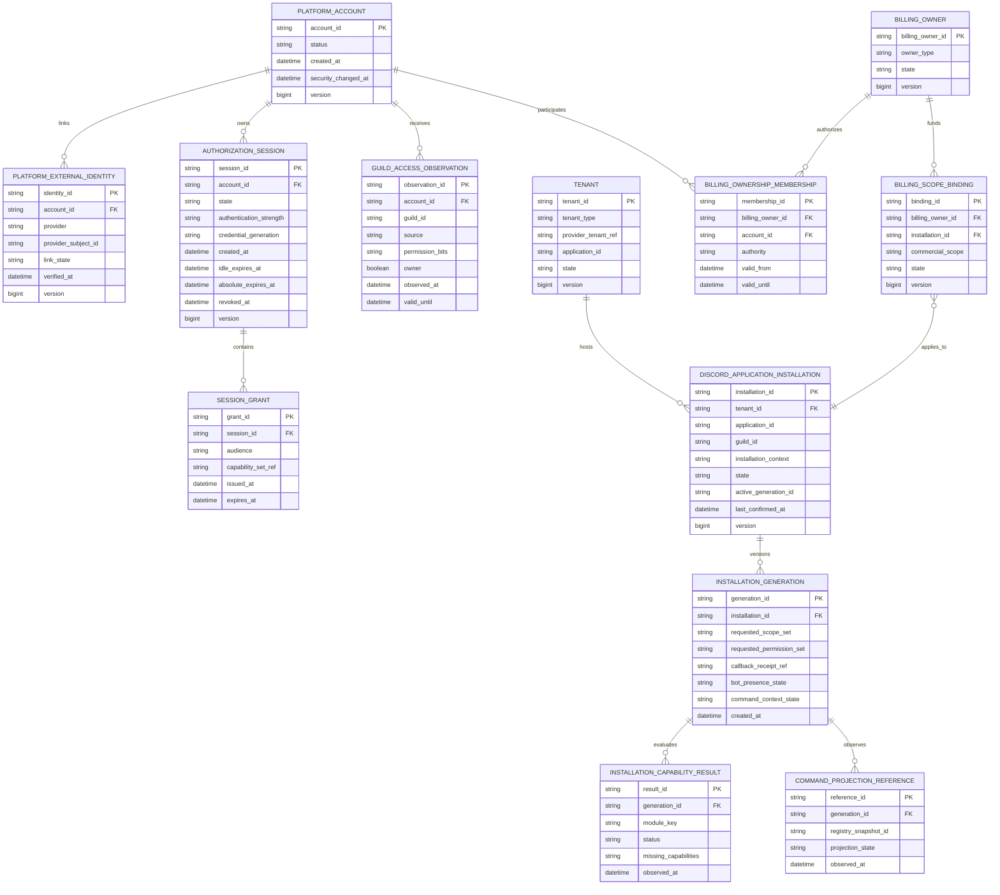
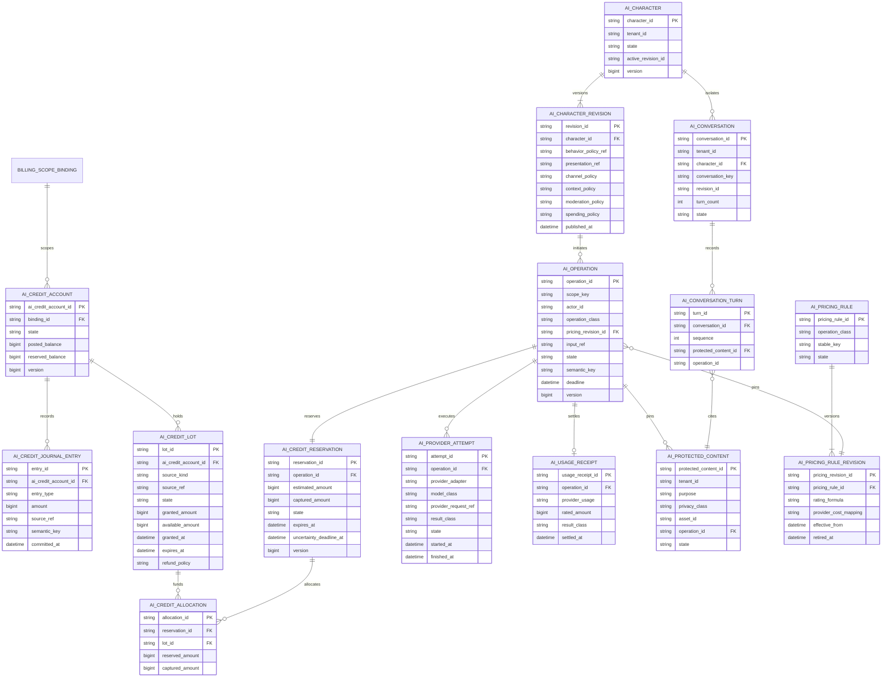

# Tobot Architecture — Platform Access, Commercial, and AI Data

[Architecture index](README.md) · [Previous](10-data-support-integrations-automation.md) · [Next](11-partitioning-discord-backpressure.md)

### 12.14 Platform access, commercial, AI usage, template, and workflow models

This volume separates real-world commercial state from the guild virtual economy defined in section 12.10. Billing amounts, provider customers, invoices, disputes, tax evidence, subscription products, and AI Credit balances MUST NOT share accounts, journals, transaction identifiers, or mutation APIs with guild currency. Cross-service references are opaque identifiers carried by versioned contracts; no service writes another service's tables.

Conserved amounts in this volume are integer minor units (`bigint`), matching §12.10's prohibition on floating-point money (DR-016). Commercial totals are minor units of the billed currency (ISO 4217 minor exponent). AI Credit balances, lots, reservations, journal amounts, and rated charges are credit-minors. Catalog and limit `quantity` fields are integer counts, not money. Provider decimal strings and provider cost units are adapter evidence, never domain amount types. Policy percentages, multipliers, and rating rounding use bounded rational or fixed-scale parameters and one explicit rounding rule.

#### 12.14.1 Identity, session, guild authority, and installation

OAuth access and refresh tokens are secret material stored through the secret-management boundary. Identity is a Secret Store consumer for that material, PKCE verifiers, and session-bound secrets; it MUST NOT receive the Discord bot token (DR-035). The relational model stores only encrypted-secret references, token generation, scopes, expiry, revocation state, and audit metadata. OAuth state and PKCE S256 verifier material are single-use, short-lived records isolated from ordinary sessions. A confidential client class does not omit the verifier (DR-026).

`PLATFORM_EXTERNAL_IDENTITY` is Identity and Session's login-link aggregate: platform account to a provider subject (Discord user for dashboard login). It is not Integration Registry's `STREAM_CANONICAL_IDENTITY` (DR-017). The two MUST NOT share tables, keys, or write paths.

`AUTHORIZATION_SESSION` is the dashboard session of record (DR-018). The browser holds only an opaque identifier. Revocation, idle and absolute expiry, and credential generation live on this row. Idle is 12 Clock-port hours sliding; absolute is 7 Clock-port days from `created_at` and MUST NOT extend with activity. The cookie is host-only on `app.*` with `Secure`, `HttpOnly`, and `SameSite=Lax`. Cookie `Max-Age` MUST NOT exceed remaining absolute time and MUST NOT be expiry authority (DR-049). A session-bound CSRF secret MAY be stored as a hashed verifier on this aggregate or through the secret-management boundary; it MUST NOT live in the session-id cookie (DR-025).

`GUILD_ACCESS_OBSERVATION` is a discovery hint, not durable authorization. Presentation `valid_until` MUST NOT exceed 15 Clock-port minutes from `observed_at`. Discord's current-user guild permission value excludes channel overwrites and implicit permissions. Every sensitive write therefore revalidates current identity, guild membership, ownership or required guild capability, installation binding, and the owning service's policy. Ordinary mutations MAY use Discord Capability at most 60 Clock-port seconds stale. Billing, install repair, destructive configuration, and other high-risk commands fail closed without live revalidation and a step-up generation no older than 5 Clock-port minutes (DR-027, DR-049). A dashboard-posted `paid`, `entitled`, or permission-bit claim is not authorization (DR-027). Tenant-scoped aggregate reads and writes MUST include a tenant predicate bound from authenticated context, not solely from a dashboard-posted `tenant_id` (DR-033).

`INSTALLATION_GENERATION.requested_permission_set` is the frozen minimal union of named bot permissions from currently enabled module manifests. It MUST NOT be Administrator by default, as a repair shortcut, or as a substitute for an incomplete manifest. Disabled modules MUST NOT inflate that set (DR-032). The generation also pins the named authorize preset (`GuildInstall`, `UserInstall`, or `GuildRepair`), platform `client_id`, optional locked `guild_id`, and `disable_guild_select`. Installation generates the Discord authorize URL. A dashboard-posted URL is not authority. Callback `guild_id` and `permissions` are hints (DR-050).

`DISCORD_APPLICATION_INSTALLATION.state` is `Installed` only when every required `INSTALLATION_CAPABILITY_RESULT` for enabled modules is `Healthy`. `bot_presence_state` is a generation observation, not the aggregate. Command-only modules record `NotRequired`. A callback receipt is `Verifying`, not `Installed` (DR-047).

`TENANT` is the isolation registry owned by Discord Installation. `tenant_type` is `Guild` or `User`. `tenant_id` is platform identity. `provider_tenant_ref` is the Discord guild or user snowflake and MUST NOT be stored as `tenant_id`. At most one Active tenant exists per type, provider ref, and application environment. Installation `Removed` does not delete TENANT. Identity and Billing MUST NOT insert this row. Product ERDs that show TENANT are isolation keys, not a second registry (DR-059).

`BILLING_OWNER` is the payer identity. There is no domain Customer row on this diagram. `owner_type` is `Account` or `Organization`. Account-type admits at most one owner per `PLATFORM_ACCOUNT`. At most one Active `BILLING_SCOPE_BINDING` exists per Discord installation (DR-055).

#### Decision Record DR-047

**Status:** Accepted.

**Decision:** Aggregate `Installed` is the conjunction of required enabled-module capability results. Bot presence MUST NOT flatten that aggregate. Command-only modules use `NotRequired`. Callback is `Verifying`.

**Rejected Alternative:** Flattening `Installed` to bot-present; treating callback as Installed; requiring bot presence for command-only modules.

#### Decision Record DR-050

**Status:** Accepted.

**Decision:** `INSTALLATION_GENERATION` pins the named authorize preset, platform `client_id`, and optional locked guild. The authorize URL is generated here. Callback `guild_id` and `permissions` are not proofs.

**Rejected Alternative:** Storing a client-supplied authorize URL as the generation; Discord Default Install Settings as product install.

#### Decision Record DR-059

**Status:** Accepted.

**Decision:** `TENANT` is the Discord Installation registry. `tenant_type` is `Guild` or `User`. `tenant_id` is not `provider_tenant_ref`. Installation `Removed` does not delete this row.

**Rejected Alternative:** Identity or Billing owning this table; Discord snowflake as `tenant_id`; deleting TENANT on uninstall.

#### Decision Record DR-049

**Status:** Accepted.

**Decision:** `AUTHORIZATION_SESSION` idle is 12 Clock-port hours; absolute is 7 Clock-port days from `created_at`. The cookie is `SameSite=Lax` and is not expiry authority. `GUILD_ACCESS_OBSERVATION.valid_until` MUST NOT exceed 15 Clock-port minutes for presentation.

**Rejected Alternative:** `SameSite=None` or `Strict`; cookie Max-Age as authority; using a stale observation as high-risk authorization.

#### Decision Record DR-017

**Status:** Accepted.

**Decision:** `PLATFORM_EXTERNAL_IDENTITY` is the Identity login-link aggregate. `STREAM_CANONICAL_IDENTITY` is the Integration Registry stream-channel aggregate. They are distinct types. A Discord OAuth subject is never a stream canonical identity. A Twitch (or other) broadcaster locator is never a platform login link. Generic English “external identity” does not imply a shared aggregate.

**Rejected Alternative:** One `EXTERNAL_IDENTITY` type across Identity and Integrations; using a Discord login subject as a stream-alert channel key.

#### 12.14.2 Commercial catalog, billing, and platform entitlement

```mermaid
erDiagram
    COMMERCIAL_PRODUCT ||--|{ COMMERCIAL_PRODUCT_REVISION : versions
    COMMERCIAL_PRODUCT_REVISION ||--o{ PRODUCT_COMPONENT : expands_to
    PRODUCT_COMPONENT }o--|| FEATURE_DEFINITION : grants
    PRODUCT_COMPONENT }o--o| LIMIT_DEFINITION : modifies
    BILLING_OWNER ||--o{ COMMERCIAL_ORDER : places
    BILLING_OWNER ||--o{ CHECKOUT_GROUP : starts
    CHECKOUT_GROUP |o--o{ COMMERCIAL_ORDER : splits_into
    COMMERCIAL_ORDER ||--|{ ORDER_LINE : contains
    COMMERCIAL_ORDER ||--o{ CHECKOUT_ATTEMPT : initiates
    COMMERCIAL_ORDER ||--o{ PAYMENT_PROVIDER_EVENT : correlates
    BILLING_OWNER ||--o{ COMMERCIAL_SUBSCRIPTION : owns
    COMMERCIAL_SUBSCRIPTION ||--|{ SUBSCRIPTION_LINE : contains
    SUBSCRIPTION_LINE }o--|| COMMERCIAL_PRODUCT_REVISION : pins
    COMMERCIAL_SUBSCRIPTION ||--o{ SUBSCRIPTION_TRANSITION : records
    COMMERCIAL_SUBSCRIPTION ||--o{ DUNNING_GENERATION : duns
    DUNNING_GENERATION ||--o{ DUNNING_ATTEMPT : retries
    INVOICE ||--o{ DUNNING_GENERATION : collects
    COMMERCIAL_SUBSCRIPTION ||--o{ PRORATION_QUOTE : prices
    PRORATION_QUOTE }o--o| INVOICE : may_invoice
    BILLING_OWNER ||--o{ INVOICE : owns
    COMMERCIAL_ORDER ||--o{ INVOICE : may_issue
    COMMERCIAL_SUBSCRIPTION ||--o{ INVOICE : may_issue
    PAYMENT_PROVIDER_EVENT }o--o| INVOICE : may_normalize_to
    BILLING_OWNER ||--o{ COMMERCIAL_REFUND : authorizes
    COMMERCIAL_ORDER ||--o{ COMMERCIAL_REFUND : may_refund
    COMMERCIAL_SUBSCRIPTION ||--o{ COMMERCIAL_REFUND : may_refund
    INVOICE ||--o{ COMMERCIAL_REFUND : may_adjust
    PAYMENT_PROVIDER_EVENT }o--o| COMMERCIAL_REFUND : may_normalize_to
    BILLING_OWNER ||--o{ COMMERCIAL_DISPUTE : contests
    COMMERCIAL_ORDER ||--o{ COMMERCIAL_DISPUTE : may_dispute
    COMMERCIAL_SUBSCRIPTION ||--o{ COMMERCIAL_DISPUTE : may_dispute
    INVOICE ||--o{ COMMERCIAL_DISPUTE : may_dispute
    PAYMENT_PROVIDER_EVENT }o--o| COMMERCIAL_DISPUTE : may_normalize_to
    BILLING_OWNER ||--o{ PLATFORM_ENTITLEMENT : receives
    BILLING_SCOPE_BINDING ||--o{ PLATFORM_ENTITLEMENT : scopes
    PLATFORM_ENTITLEMENT }o--|| FEATURE_DEFINITION : authorizes
    PLATFORM_ENTITLEMENT ||--o{ LIMIT_GRANT : contributes
    PLATFORM_ENTITLEMENT ||--o{ PERK_GRANT : contributes
    PLATFORM_ENTITLEMENT ||--o{ GRANT_SOURCE : applies
    BILLING_OWNER ||--o{ GRANT_SOURCE : funds
    BILLING_SCOPE_BINDING ||--o{ GRANT_SOURCE : scopes
    GRANT_SOURCE ||--o{ ENTITLEMENT_PROJECTION_REVISION : contributes
    PLATFORM_ENTITLEMENT ||--o{ ENTITLEMENT_PROJECTION_REVISION : projects
    BILLING_OWNER ||--o{ PROVIDER_CUSTOMER_MAPPING : maps
    BILLING_OWNER ||--o{ TAX_EVIDENCE : records
    COMMERCIAL_ORDER ||--o{ TAX_EVIDENCE : may_cite
    INVOICE ||--o{ TAX_EVIDENCE : may_cite

    COMMERCIAL_PRODUCT {
        string product_id PK
        string product_kind
        string stable_key
        string state
        bigint version
    }
    COMMERCIAL_PRODUCT_REVISION {
        string revision_id PK
        string product_id FK
        string display_definition_ref
        string billing_terms
        string compatibility_policy
        string tax_classification_ref
        datetime effective_from
        datetime retired_at
    }
    PRODUCT_COMPONENT {
        string component_id PK
        string revision_id FK
        string feature_id FK
        string limit_id FK
        string grant_kind
        bigint quantity
        string unit
    }
    FEATURE_DEFINITION {
        string feature_id PK
        string stable_key
        string owning_service
        string state
        bigint version
    }
    LIMIT_DEFINITION {
        string limit_id PK
        string stable_key
        string aggregation_rule
        string enforcement_mode
        string unit
        bigint version
    }
    COMMERCIAL_ORDER {
        string order_id PK
        string billing_owner_id FK
        string checkout_group_id FK
        string catalog_revision_set
        string currency
        bigint total_amount
        string hosted_session_mode
        string state
        string semantic_key
        bigint version
    }
    CHECKOUT_GROUP {
        string checkout_group_id PK
        string billing_owner_id FK
        string catalog_revision_set
        string semantic_key
        string state
        bigint version
    }
    ORDER_LINE {
        string order_line_id PK
        string order_id FK
        string product_revision_id
        string purchase_kind
        bigint quantity
        bigint unit_amount
        string terms_snapshot_ref
    }
    CHECKOUT_ATTEMPT {
        string checkout_attempt_id PK
        string order_id FK
        string provider_adapter
        string provider_session_ref
        string idempotency_key
        string state
        datetime expires_at
        bigint attempt_generation
    }
    PAYMENT_PROVIDER_EVENT {
        string provider_event_id PK
        string provider_adapter
        string provider_account_scope
        string provider_object_ref
        string event_type
        string signature_generation
        datetime provider_created_at
        datetime received_at
        string processing_state
    }
    COMMERCIAL_SUBSCRIPTION {
        string subscription_id PK
        string billing_owner_id FK
        string provider_subscription_ref
        string state
        datetime current_period_start
        datetime current_period_end
        datetime grace_until
        bigint provider_version
        bigint version
    }
    SUBSCRIPTION_LINE {
        string subscription_line_id PK
        string subscription_id FK
        string product_revision_id FK
        bigint quantity
        string state
        datetime effective_at
        datetime ends_at
    }
    SUBSCRIPTION_TRANSITION {
        string transition_id PK
        string subscription_id FK
        string from_state
        string to_state
        string source_event_id
        string reason_class
        datetime effective_at
    }
    DUNNING_GENERATION {
        string dunning_generation_id PK
        string subscription_id FK
        string invoice_id FK
        datetime period_start
        datetime grace_until
        string catalog_policy_ref
        string state
        bigint version
    }
    DUNNING_ATTEMPT {
        string attempt_id PK
        string dunning_generation_id FK
        int attempt_index
        datetime due_at
        string state
        string provider_attempt_ref
    }
    PRORATION_QUOTE {
        string proration_quote_id PK
        string subscription_id FK
        string invoice_id FK
        string proration_mode
        datetime period_start
        datetime period_end
        datetime effective_at
        bigint period_seconds
        bigint remaining_seconds
        bigint unused_old_amount
        bigint new_remainder_amount
        bigint delta_amount
        string currency
        string rounding_rule
        string semantic_key
        string state
        bigint version
    }
    INVOICE {
        string invoice_id PK
        string billing_owner_id FK
        string order_id FK
        string subscription_id FK
        string provider_invoice_ref
        string currency
        bigint total_amount
        string state
        datetime issued_at
        datetime due_at
        datetime paid_at
        bigint version
    }
    COMMERCIAL_REFUND {
        string refund_id PK
        string billing_owner_id FK
        string order_id FK
        string subscription_id FK
        string invoice_id FK
        string currency
        bigint amount
        string state
        string reason_class
        string semantic_key
        string provider_refund_ref
        bigint version
    }
    COMMERCIAL_DISPUTE {
        string dispute_id PK
        string billing_owner_id FK
        string order_id FK
        string subscription_id FK
        string invoice_id FK
        string currency
        bigint amount
        string state
        string reason_class
        string provider_dispute_ref
        datetime evidence_due_at
        bigint version
    }
    PLATFORM_ENTITLEMENT {
        string entitlement_id PK
        string billing_owner_id FK
        string binding_id FK
        string feature_id FK
        string source_kind
        string source_ref
        string state
        datetime valid_from
        datetime valid_until
        bigint generation
    }
    GRANT_SOURCE {
        string grant_source_id PK
        string billing_owner_id FK
        string binding_id FK
        string source_kind
        string source_ref
        string catalog_revision_set
        string state
        datetime valid_from
        datetime valid_until
        datetime grace_until
        string cause_event_id
        bigint generation
        bigint version
    }
    PROVIDER_CUSTOMER_MAPPING {
        string mapping_id PK
        string billing_owner_id FK
        string provider_adapter
        string merchant_account_scope
        string environment
        string provider_customer_ref
        string state
        bigint version
    }
    TAX_EVIDENCE {
        string tax_evidence_id PK
        string billing_owner_id FK
        string invoice_id FK
        string order_id FK
        string jurisdiction_ref
        string location_class
        string classification_ref
        string provider_tax_ref
        datetime recorded_at
        bigint version
    }
    LIMIT_GRANT {
        string limit_grant_id PK
        string entitlement_id FK
        string limit_id
        bigint quantity
        string unit
        string precedence
        datetime valid_until
    }
    PERK_GRANT {
        string perk_grant_id PK
        string entitlement_id FK
        string perk_key
        string value_ref
        datetime valid_until
    }
    ENTITLEMENT_PROJECTION_REVISION {
        string projection_id PK
        string entitlement_id FK
        string scope_key
        string effective_features
        string effective_limits
        string state
        datetime computed_at
    }
```

Product kinds are `Plan`, `CapacityAddOn`, `ModuleAddOn`, `Bundle`, `AICreditPack`, and `Promotion`. Capacity tiers are immutable product revisions, not account levels. Bundles expand into ordinary feature, limit, perk, and AI-credit grants so downstream services never need bundle-specific logic.

An effective limit is a deterministic projection of active base grants, compatible add-on grants, and bounded promotional grants using the limit definition's aggregation and precedence rules. Usage is recorded by the owning product service or the dedicated AI ledger; the commercial service does not own every module's operational counters. A reduced limit blocks new admissions when usage exceeds capacity, while existing data remains readable and follows its independent retention policy.

Commercial subscriptions and invoices are provider-neutral aggregates owned by Billing Orchestrator. `invoice_id` is platform identity. `provider_invoice_ref` preserves adapter object identity as evidence and is never domain authority. `total_amount` and order `unit_amount` are integer minor units of `currency` (DR-016). A refund or dispute is a separate workflow and MUST NOT rewrite a paid invoice into unpaid. Checkout return pages are informational only. Verified asynchronous provider events and reconciliation drive payment and subscription truth. Provider events are deduplicated by provider account scope and event identity, processed under object ordering rules, and retained independently from normalized commercial transitions. A `PAYMENT_PROVIDER_EVENT` row with `received_at` is a later Billing correlation or application row after inbox apply; it is not paid, entitled, or fulfilled (DR-022). HTTP success ACK MUST NOT wait on that copy. The ACK authority is the Provider Event Edge ingress receipt (DR-067). Normalized commercial payment-event facts on the bus MUST set `schema_family` `CommercialPayment` (DR-065). `COMMERCIAL_SUBSCRIPTION.grace_until` is the Billing dunning boundary published on commercial grant facts. `ENTITLEMENT_PROJECTION_REVISION` carries Entitlement `grace_state`; it is not the subscription row (DR-046). Dunning retries are `DUNNING_GENERATION` and `DUNNING_ATTEMPT` rows on that subscription and its Open renewal invoice. At most one `Open` generation exists per subscription. Attempt `due_at` MUST be strictly before `grace_until`. A new CommercialOrder MUST NOT be created for a retry (DR-056).

`PRORATION_QUOTE` is Billing-owned. `proration_mode` is `None` or `TimeBalance`. `delta_amount` is integer minor units. A provider proration preview is not this row. Negative `delta_amount` is next-invoice credit, not `COMMERCIAL_REFUND` (DR-057).

`COMMERCIAL_ORDER` is the frozen commercial intent. `semantic_key` is unique among `Open` orders for that billing owner and commercial scope. `hosted_session_mode` is `Recurring` or `OneTime`. Mixed modes fail closed at admit. `CHECKOUT_ATTEMPT.provider_session_ref` is evidence. Attempt `Completed` MUST NOT set order `Fulfilled`. Adapter `client_reference_id` equals `checkout_attempt_id` (DR-051).

`CHECKOUT_GROUP` is the parent of a mixed Recurring+OneTime Bundle split. `semantic_key` is unique among Open groups for that billing owner and commercial scope. Exactly two sibling orders share the group. Recurring checkout is first. Group `Partial` MUST NOT auto-create `COMMERCIAL_REFUND`. Mixed Recurring intervals fail closed and MUST NOT mint extra orders. A single-mode purchase has no group row (DR-058).

`COMMERCIAL_REFUND` is an append-only Billing aggregate. `amount` is integer minor units of `currency`. `provider_refund_ref` is evidence. Succeeded refunds MUST NOT rewrite Invoice `Paid` or Order `Fulfilled`. Succeeded amounts across rows MUST NOT exceed remaining refundable on the source. Billing MUST NOT write AI Credit lots (DR-052).

`COMMERCIAL_DISPUTE` is an append-only Billing aggregate distinct from refund. `provider_dispute_ref` is evidence. `Open` freezes grants via commercial grant facts. Invoice `Paid` and Order `Fulfilled` MUST NOT be rewritten. Early fraud warnings are not this row (DR-053).

`GRANT_SOURCE` is owned by Platform Entitlement. `source_ref` is an opaque originating identity, not a foreign key into Billing tables. `source_kind` is `Subscription`, `OneTimeOrder`, `Promotion`, `Compensation`, or `Achievement`. `grace_until` is copied from Billing commercial facts when present. This row is not an AI Credit lot (DR-054). Public apply uses `PlatformEntitlement*` leaves. Unprefixed `Entitlement*` and `GuildRewardEntitlement*` MUST fail closed at this inbox (DR-069).

`PROVIDER_CUSTOMER_MAPPING` is Billing-owned adapter evidence. `provider_customer_ref` is not `billing_owner_id`. At most one Active mapping exists per owner, adapter, merchant-account scope, and environment. One mapping MUST NOT attach to two owners (DR-055).

`TAX_EVIDENCE` is an append-only Billing snapshot of location and classification evidence. It is not legal determination, not a Customer row, and not rewritten in place (DR-055).

#### Decision Record DR-013

**Status:** Accepted.

**Decision:** `Invoice` is a Billing Orchestrator aggregate in this ERD. It relates to billing owner, optional order, optional subscription, and provider events. Stripe or other provider invoice objects are evidence references, not the authoritative row.

**Rejected Alternative:** Treating the provider invoice object as the aggregate; leaving invoices as prose-only names; routing invoices through the guild virtual-currency ledger.

#### Decision Record DR-051

**Status:** Accepted.

**Decision:** `COMMERCIAL_ORDER` is the frozen intent. `CHECKOUT_ATTEMPT` is one hosted-session generation. `provider_session_ref` is evidence. Session-completed is not order `Fulfilled`.

**Rejected Alternative:** Treating the Stripe Checkout Session as the order row; fulfilling from `success_url`.

#### Decision Record DR-052

**Status:** Accepted.

**Decision:** `COMMERCIAL_REFUND` is the refund aggregate. Invoice and order rows are not rewritten. `provider_refund_ref` is evidence. Create-refund HTTP is not `Succeeded`.

**Rejected Alternative:** Rewriting Invoice `Paid`; storing refund only as invoice state; copying guild-shop refund onto this ERD.

#### Decision Record DR-053

**Status:** Accepted.

**Decision:** `COMMERCIAL_DISPUTE` is the dispute aggregate. It is not a refund row. `Open` freezes grants. Invoice and order rows are not rewritten.

**Rejected Alternative:** Storing a dispute as `COMMERCIAL_REFUND`; treating early fraud warnings as this row.

#### Decision Record DR-054

**Status:** Accepted.

**Decision:** `GRANT_SOURCE` is the Entitlement-owned applied-source row. `source_ref` is opaque. Billing MUST NOT write this table. AI Credit lots remain Ledger-owned.

**Rejected Alternative:** FK from Entitlement into Billing subscription tables; Billing writing lots from commercial facts.

#### Decision Record DR-055

**Status:** Accepted.

**Decision:** There is no Customer ERD type. `BILLING_OWNER` is the payer. `PROVIDER_CUSTOMER_MAPPING` and `TAX_EVIDENCE` hang off the owner. Provider customer identifiers are evidence.

**Rejected Alternative:** A Customer table duplicate of `BILLING_OWNER`; FK uniqueness on provider customer as owner identity.

#### Decision Record DR-056

**Status:** Accepted.

**Decision:** `DUNNING_GENERATION` and `DUNNING_ATTEMPT` are Billing rows on the subscription and Open renewal invoice. Attempt dues MUST be strictly before `grace_until`. They are not a new order.

**Rejected Alternative:** A new `COMMERCIAL_ORDER` per retry; provider Smart Retries counts as this table.

#### Decision Record DR-057

**Status:** Accepted.

**Decision:** `PRORATION_QUOTE` is the Billing integer quote. Provider proration preview is evidence. Negative `delta_amount` is next-invoice credit, not a refund row.

**Rejected Alternative:** Storing Stripe preview as this row; unused time as `COMMERCIAL_REFUND`.

#### Decision Record DR-058

**Status:** Accepted.

**Decision:** `CHECKOUT_GROUP` is the Billing parent of a mixed Recurring+OneTime Bundle split. Sibling orders each have one hosted-session mode. Recurring checkout is first. Group `Partial` is not a refund row.

**Rejected Alternative:** One Checkout Session spanning both modes; a mixed-mode `COMMERCIAL_ORDER`; auto-refunding the paid sibling.

#### Decision Record DR-016

**Status:** Accepted.

**Decision:** The three conserved planes store conserved amounts as integer minor units (`bigint`). Guild virtual currency already does this in §12.10. Commercial billed totals are minor units of the billed currency. AI Credits are credit-minors. Catalog and limit quantities are integer counts. Provider decimal strings and provider cost units are evidence or adapter-private rating inputs. Policy percentages, multipliers, probabilities, and rating rounding remain bounded rational or fixed-scale parameters with one explicit rounding rule. Binary floating point is forbidden for conserved amounts.

**Rejected Alternative:** Domain `decimal` money or credits; IEEE floating point; using a payment-provider decimal string as the billing aggregate amount type.

#### Decision Record DR-046

**Status:** Accepted.

**Decision:** `COMMERCIAL_SUBSCRIPTION.state` includes `PastDue` as unpaid-period commercial truth. `ENTITLEMENT_PROJECTION_REVISION` is the required access projection and owns `grace_state`. `grace_until` on the subscription is the Billing-published dunning boundary, not feature authorization. Invariant 152 `reconciled` is provider-alignment of the subscription record.

**Rejected Alternative:** One shared PastDue/Grace table; authorizing modules from the subscription row; collapsing 152 into a premium boolean.

#### 12.14.3 AI Credit accounting and AI execution

AI Credits are the only prepaid internal unit for AI operations. They are not money, XP, capacity tiers, generic payment credits, provider tokens, or guild virtual currency. Lots preserve source, expiry, refund, and consumption order. Purchased lots normally remain non-expiring unless law, refund policy, or explicit purchase terms require otherwise; monthly and promotional lots may expire under their frozen grant terms. `expires_at` is frozen at mint. Null means no automatic expiry. Lot `state` is `Active`, `Expired`, `Depleted`, or `Reversed`. Account balances, lot amounts, reservations, journal entries, and rated charges are integer credit-minors (DR-016).

Reservation, provider execution, rating, capture, release, refund, expiration, and adjustment are distinct journaled transitions. The operation pins the pricing revision before reservation. Settlement charges actual rated usage, releases unused reservation, and cannot exceed the authorized ceiling without a new explicit reservation. Reservation `expires_at` is first-product 15 Clock-port minutes and MUST cover the operation deadline. Elapsed TTL without a confirmed outcome is `Uncertain`, not `Released`. `uncertainty_deadline_at` is 24 Clock-port hours from Uncertain entry; then `Disputed`. `Disputed` is Ledger review, not capture, release, or operation settlement. The paired operation MUST remain `Uncertain` (DR-070). An uncertain provider outcome remains reserved until bounded reconciliation or that deadline; it is not automatically retried when a duplicate billable result is possible. New reservations MUST NOT allocate lots whose `expires_at` is at or before Clock now. Open allocations survive lot expiry until settlement. Allocation order is earliest lot `expires_at` (null last), then `granted_at`, then `lot_id` (DR-061). Public reservation facts MUST set `schema_family` `AiCreditReservation` and MUST NOT use `VirtualPayment` (DR-065).

`AI_PROVIDER_ATTEMPT.result_class` is `ConfirmedResult`, `ConfirmedFailure`, `RateLimited`, `TimeoutNotSent`, `TimeoutAfterSend`, or `Uncertain`. HTTP 429 is `RateLimited` and MUST NOT be stored as `Uncertain`. `TimeoutAfterSend` and `Uncertain` keep the reservation reserved. HTTP status is not usage settlement (DR-062).

`AI_PROTECTED_CONTENT` is owned by AI Execution. Available rows MUST have `asset_id` pointing at 07 `ASSET`. `input_ref` and `result_ref` are `protected_content_id`. OCR and transcription are `purpose` values, not a second blob owner. `AI_CONVERSATION` is owned by AI Character. Turns reference protected content and MUST NOT store bodies. First-product window is 20 turns. Support Archive is a distinct transcript owner. A vector table is not first product (DR-063).

Provider tokens remain inside the AI provider-adapter boundary. Input, generated content, conversation context, OCR documents, images, and transcripts use independent privacy classes and retention. Character context is tenant-, character-, channel-, and conversation-scoped; it never crosses characters or tenants. Retrieved context cannot select tools or overwrite platform-authored system instructions (DR-031). Prompts and generated output MUST NOT be copied into span attributes (DR-038). Persona presentation through Discord webhooks is optional and passes through Delivery ownership, mention controls, webhook rotation, and anti-impersonation labeling.

#### 12.14.4 Templates and workflows

Templates contain portable declarative definitions, never database rows, provider tokens, raw Discord objects, executable code, or ownership claims over pre-existing resources. Package bytes are admitted only through a versioned schema parse; language-native object codecs over untrusted bytes are forbidden (DR-037). Each installation pins one immutable revision, validates dependencies and permissions against the target tenant, obtains per-owner plans, and records every effect. Rollback is a compensating workflow and removes only effects proven to be created or owned by that installation; external edits become visible conflicts.

Workflow graphs are finite, acyclic after admitted bounded-loop expansion, and compiled before publication. Triggers use canonical events, durable schedules, authenticated webhooks through Provider Event Edge (§32.14, DR-028), or explicit module events. Unsigned tenant webhooks are forbidden. Conditions are deterministic and side-effect-free. Actions are typed commands to owning services, never direct database writes or raw Discord calls. Each action occurrence has a stable semantic identity, timeout, retry policy, authorization context, and independently observable result. Definition and execution remain one Workflow module because `WORKFLOW_EXECUTION` pins `WORKFLOW_REVISION` (DR-019). Custom commands are a constrained trigger-and-response surface that may reuse workflow primitives without surrendering the stricter guarantees in section 33, and they keep a separate Registry and Runtime.

The template marketplace is permanently free. Template packages and installations have no price, purchase order, subscription, payment-provider reference, revenue-share agreement, payout, paid placement, or commercial entitlement. AI Credits and guild virtual currency cannot purchase templates, improve ranking, or compensate authors. Authorship, moderation, ratings, reputation, attribution, and optional capped promotional rewards remain non-transferable governance mechanisms rather than marketplace payment instruments.

#### Decision Record DR-067

**Status:** Accepted.

**Decision:** Payment-provider HTTP callbacks MUST terminate at Provider Event Edge and follow the 9.36 ACK/inbox path. HTTP success ACK is allowed only after a durable Edge ingress receipt. Duplicates ACK success and reuse that receipt. Invalid, expired, or unknown generation MUST NOT ACK success. ACK MUST NOT wait for Billing apply, `GRANT_SOURCE`, entitlement projection, or lot mint. Billing MUST NOT open a public payment webhook listener. DR-022 receipt-versus-fulfillment glossary is unchanged.

**Rejected Alternative:** Billing as the public webhook listener; ACK after entitlement projection; ACK before durable ingress; treating Edge ACK as `GRANT_SOURCE` apply.

#### Decision Record DR-069

**Status:** Accepted.

**Decision:** Public entitlement contracts are only `GuildRewardEntitlement*` for module 7.35 and `PlatformEntitlement*` for module 7.55. An envelope whose `schema_name` is unprefixed `Entitlement` or any other Entitlement-shaped name MUST fail closed at parse. Platform Entitlement MUST reject `GuildRewardEntitlement*` at inbox apply. Module 7.35 MUST reject `PlatformEntitlement*` leaves and MUST NOT apply `GRANT_SOURCE`. Consumers MUST NOT infer the plane from payload fields. The private `ENTITLEMENT` table remains guild-reward storage and MUST NOT be Platform Entitlement's journal. DR-066 ownership and public names are unchanged.

**Rejected Alternative:** Guessing guild versus platform from payload; applying unprefixed `Entitlement*` into either journal; sharing one Entitlement inbox; treating `ENTITLEMENT` as Platform Entitlement storage.

#### Decision Record DR-070

**Status:** Accepted.

**Decision:** `Disputed` is a Ledger reservation review state, not an AI Execution operation state. While a reservation is `Uncertain` or `Disputed`, the paired operation MUST remain `Uncertain`. The operation machine MUST NOT gain a `Disputed` state. Reservation `Disputed` MUST NOT be treated as capture, release, refund, operation `Failed`, operation `Succeeded`, or settlement. The operation MAY leave `Uncertain` only after Ledger accepts a confirmed usage or absence receipt into `Capturing` or `Releasing`. Query and dashboard MUST NOT present a `Disputed` reservation as a completed operation. DR-061 deadlines and DR-062 attempt classes are unchanged.

**Rejected Alternative:** Adding operation `Disputed`; auto-failing the operation when the reservation becomes `Disputed`; treating `Disputed` as `Released` or `Captured`; dashboard settlement from `Disputed`.
