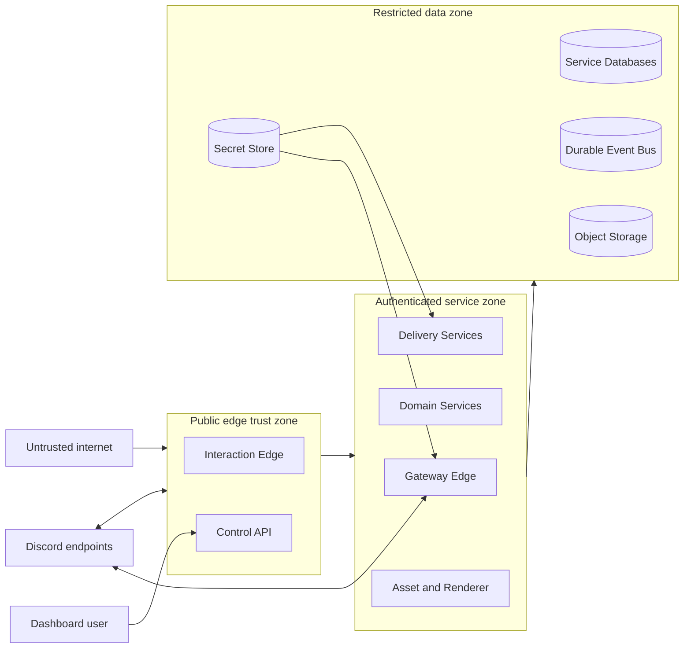
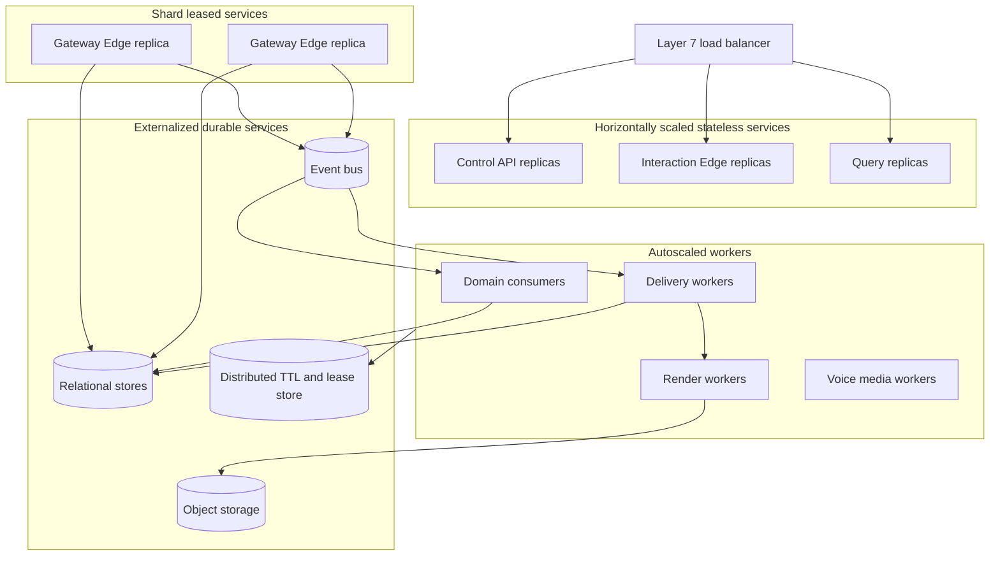

# Tobot Architecture — Security, Observability, and Deployment

[Architecture index](README.md) · [Previous](11-partitioning-discord-backpressure.md) · [Next](13-recovery-testing-governance.md)

## 17. Security architecture

### 17.1 Trust boundaries

### 17.2 Required controls

- Service-to-service calls use authenticated workload identity and encrypted transport.
- Authorization is evaluated at both public entry and owning service.
- Discord bot tokens are available only to Gateway Edge and Discord Transport roles that require them.
- Interaction tokens are encrypted, short-lived, and access-audited.
- Database credentials are unique per service owner.
- Events contain references rather than secrets.
- Logs use allowlisted fields and redact tokens, authorization headers, user message content where unnecessary, and remote query strings.
- Remote media fetching blocks private, loopback, link-local, metadata-service, and rebinding destinations.
- Uploaded media is scanned, decoded within resource limits, re-encoded when required, and never executed.
- Administrative test delivery is clearly marked and audited.
- Tenant deletion is an explicit workflow covering configurations, projections, assets, cooldowns, and retained operational records.
- Moderation reasons, private notes, message excerpts, attachment references, and before/after values receive explicit privacy classifications.
- Evidence access is narrower than case-summary access and is audited independently.
- Message evidence is minimized at ingestion, encrypted at rest when retained, and deleted on its own retention schedule.
- A content hash or unavailable marker replaces raw message content when policy does not authorize retention.
- Moderator-facing exports and searches enforce the same guild scope, evidence policy, and redaction state as individual case reads.
- Dry-run moderation and cleanup operations perform no provider mutation and suppress notification side effects.
- Security policy publication and response-plan publication require optimistic concurrency, authenticated administrator authority, and an immutable change record.
- High-impact response plans require an explicit risk classification; automatic ban, dangerous-role removal, guild lockdown, verification change, invite pause, and direct-message pause are never enabled through an implicit default.
- Exemption changes, manual lockdown transitions, restoration acknowledgements, and security kill-switch changes are separately audited.
- Security evidence stores identifiers and bounded risk facts by default. Raw audit changes, member profile data, invite context, and message content require an explicit privacy purpose and expiry.
- Distributed counter keys use opaque tenant-scoped identifiers or hashes, finite TTL, and bounded cardinality; the counter system is not a behavioral analytics store.
- A service identity may submit security observations or response requests only for its authorized tenant partition and declared source type.
- Break-glass actions require strong administrator authentication, a short-lived authorization context, reason capture, and post-action review; break glass does not bypass Discord permissions or transport governance.
- Role-policy, panel, and role-resource writes require separate tenant-scoped capabilities; permission to publish a self-service panel does not imply permission to create or reorder Discord roles.
- Panel routing tokens are non-secret opaque references with bounded lifetime or revision scope. Every use is reauthorized from the signed Discord interaction or canonical Gateway identity and authoritative panel binding.
- Sticky-role data, member-role desired state, assignment history, and panel interaction observations are purpose-limited, tenant-scoped, and independently retained.
- Sensitive permission classes are centrally versioned. Self-service and automatic policies fail closed when the classification is unavailable.
- Role-resource privilege escalation requires stronger authorization than cosmetic role edits and records the exact before/after permission delta.
- Progression policy changes, manual XP adjustments, reward replay, and leaderboard visibility require distinct tenant-scoped capabilities. Adjustments are append-only ledger facts with actor, reason, and immutable policy context; balances are never edited silently.
- XP abuse controls include source allowlists, bot and webhook exclusions, atomic cooldowns, per-source ceilings, voice eligibility, anti-idle policy, and anomaly signals. They minimize retained content and never use hidden profiling as an enforcement fact.
- Giveaway creation, cancellation, early close, reroll, entrant inspection, and prize fulfillment are independently authorized and audited. Entry eligibility is server-defined, versioned, explainable, and evaluated without exposing unrelated member data.
- Weighted giveaway odds are disabled by default. If enabled, weighting inputs, caps, exclusions, and effective odds are disclosed before entry, pinned in the entrant snapshot, and subject to applicable legal and platform review; purchasing or transferring value is outside this specification.
- Giveaway randomness is obtained only through the secure-randomness capability. Draw inputs and the selection procedure are durably committed so an operator cannot silently redraw an unfavorable result.
- Form definitions, responses, reviews, exports, attachments, and accepted-role actions have separate permissions. Reviewers receive only fields and identity allowed by the published access policy.
- A form advertised as anonymous to reviewers may still retain a tenant-scoped respondent identity for abuse prevention or uniqueness. That distinction, purpose, retention, and authorized system access are disclosed; the platform never claims system anonymity while retaining identity.
- Form responses and assets carry field-level privacy classes and independent expiry. Export generation is authorized, audited, time-bounded, encrypted in transit, and delivered through a short-lived reference rather than public storage.
- Temporary-room creation and control validate the signed actor, live membership, current room ownership or delegated-control claim, and current provider capability on every action. Opaque component identifiers are routing references, not authorization.
- Room owners cannot grant permissions beyond generator policy, move or exclude protected principals contrary to server policy, control another room, or convert a temporary resource into an undeclared permanent channel.
- Economy management uses separate capabilities for currency policy, income policy, catalog publication, stock correction, funds adjustment, entitlement resolution, casino policy, and read-only audit. Dashboard authentication or Discord visibility alone grants none of them.
- Every administrator adjustment, account freeze, tax-policy change, stock correction, refund, manual fulfillment, forced game resolution, and ledger reconciliation action records actor, reason, expected version, affected amount or resource, and correlation identity.
- Currency display assets are validated through Asset Service. They never determine currency identity and cannot supply executable content or an untrusted remote fetch at render time.
- Ledger queries, wealth leaderboards, transfer histories, purchase histories, and game histories enforce tenant and subject scope. Public leaderboards expose only the configured account classes and opted-in identity presentation.
- Income and casino abuse controls include per-member and per-source rate limits, cooldowns, maximum stake and exposure, loss or payout ceilings, bot exclusion, collusion signals, self-target denial, target protections, and kill switches. Abuse observations do not bypass Moderation Cases.
- Robbery is disabled by default, wallet-only unless a later published policy says otherwise, and subject to target opt-out, protected-member rules, minimum balance, loss caps, cooldown, anti-collusion controls, and tenant suitability review.
- Virtual currency is non-redeemable and has no represented monetary value. The platform does not support purchase for real money, cash-out, cryptocurrency, external-market exchange, debt, lending, interest, or wagering of transferable value under this specification.
- Casino publication requires explicit tenant opt-in, age and regional suitability decisions where applicable, responsible-play limits, transparent payout rules, and a demonstrated non-positive uncontrolled issuance exposure. Product presentation never implies real-money winnings.
- Randomness receipts expose outcome integrity facts without exposing secret entropy before use. Operators cannot rerun a committed income, crime, robbery, slot, roulette, coinflip, card, or shuffle decision to obtain a preferred result.
- Catalog eligibility and purchase limits are evaluated server-side from authoritative facts. Client-provided price, stock, balance, reward, role, boost, or ownership fields are untrusted.
- Entitlement access is narrower than purchase-read access. Private-channel bindings, manual instructions, staff evidence, and compensation snapshots receive explicit privacy classes and retention.
- Support administration separates policy management, panel publication, case oversight, transcript access, export, retention hold, and destructive resource cleanup capabilities. Possessing a configured staff role does not grant dashboard policy access.
- Staff action authorization uses current guild membership, current role or capability policy, case assignment where required, protected-role rules, and expected case version. A cached panel or channel overwrite is not authority.
- Ticket eligibility, blacklist, whitelist, bypass, opener-close, participant, claim, escalation, and reopen rules are server-side policies. Component visibility and access to a Discord channel do not imply permission to perform a case transition.
- Intake submissions, case descriptions, participant messages, attachments, staff notes, transcripts, satisfaction responses, and export artifacts have distinct privacy classes, access policies, and expiry.
- Support Case events store references and bounded operational facts by default. They do not copy full transcript content, form answers, Discord tokens, or private attachment URLs.
- Transcript access and export require tenant and case scope, purpose, current authority, short-lived artifact access, and an immutable audit record. Public permanent transcript URLs are forbidden.
- Message and attachment capture is minimized at ingestion. Asset references replace ephemeral Discord URLs, secrets are redacted by policy, and content is encrypted at rest when retained.
- Support capacity, cooldown, scheduling, and automation keys are tenant-scoped and bounded. They are not used as a cross-server behavior profile.
- Case numbering is display metadata and is never accepted without tenant identity as authorization or lookup proof.
- Resource cleanup is destructive and requires current case state, archive-boundary decision, application ownership, case generation, bot capability, and provider fingerprint.
- Staff performance metrics distinguish queue delay, assignment delay, first human response, automation, bot messages, waiting-on-member time, and reopen state. Individual scoring or punitive use requires a separately approved transparent policy and review process.
- Integration administration separates provider credential management, provider capability publication, alert configuration, test delivery, subscription repair, live-signal conflict resolution, delivery replay, and destructive projection cleanup capabilities.
- A tenant administrator may select only provider identities and provider metadata that the active provider access model lawfully exposes. Tenant configuration never reveals shared application credentials, another tenant's private identity, or provider billing state outside the tenant's authorized view.
- Public callback endpoints use randomized opaque routing identity, transport encryption, strict method and media-type checks, bounded request bodies, exact raw-body signature verification, timestamp freshness, replay protection, constant-time comparison where applicable, and denial-of-service admission controls.
- Verification secrets and provider credentials are versioned in a secret-management boundary. Rotation supports overlap only for a bounded generation window and old material is revoked and deleted according to policy.
- Provider adapters run with network egress allowlists, DNS and redirect controls, response-byte and decompression ceilings, timeouts, schema validation, and circuit breakers. User-supplied provider URLs never become arbitrary server-side fetch targets.
- Provider payloads and normalized metadata are untrusted content. Titles, display names, categories, URLs, thumbnails, and extension fields are escaped, length-bounded, mention-neutral, and filtered before entering Message Catalog context or logs.
- Raw provider payload retention is disabled by default after required verification and normalization evidence is committed. Any diagnostic sampling is encrypted, access-controlled, redacted, purpose-limited, tenant- and provider-policy compliant, and independently expired.
- Alert configuration and test endpoints enforce current tenant membership and an integration-specific administrator capability. Possession of a provider handle, Discord channel ID, or alert ID is not authorization.
- Mention policy defaults to none. Broad mentions require explicit tenant opt-in, current actor authority, destination compatibility, anti-spam budgets, and a visible preview; template text cannot grant mention capability.
- Manual replay references an existing transition and occurrence, records actor and reason, and preserves the same provider session identity. It cannot fabricate an online event, reset deduplication history, or target a new destination without a new configuration revision.
- Provider health, error details, and request identifiers exposed to tenants are sanitized. Secret values, signatures, authorization headers, internal callback paths, raw payloads, and cross-tenant quota details are never returned.
- Custom-command administration separates read, draft, publish, enable, disable, permission policy, mention policy, response action, projection repair, invocation history, and retirement capabilities. Dashboard access alone grants none of them.
- Reserved built-in command identities are platform policy. A tenant definition cannot shadow, replace, disable, redirect, or imitate a built-in security, moderation, support, economy, privacy, or administration command.
- The custom-command template language is non-Turing-complete, deterministic, side-effect-free during evaluation, bounded by node count, nesting, input size, output size, and execution time, and cannot access files, environment, secrets, network, database, reflection, dynamic imports, or raw service credentials.
- Response actions are selected from an allowlisted typed catalog and individually authorized. They cannot invoke arbitrary bot commands, mutate moderation or economy state, assign sensitive roles, create unowned resources, or widen permissions through text.
- User, target, role, channel, guild, level, XP, time, and argument variables have explicit sources and privacy classes. Missing or inaccessible data follows the published fallback and is never fetched by arbitrary template code.
- Custom invocation access evaluates ignore and allow rules through one deterministic precedence model. Current membership, roles, channel, age-restricted context, entitlement, and bot status are server-side facts; client visibility is not authorization.
- Cooldown and concurrency keys are tenant-scoped, bounded, expiring, atomic, and resistant to user-controlled key expansion. Rejected or duplicate interaction delivery cannot consume multiple reservations.
- Reminder content is private to the owner by default. Staff list or cancellation authority is distinct from permission to read content; administrative projections minimize or redact text unless a separately authorized purpose requires it.
- Reminder owner, timezone, content, origin, route policy, recurrence, and history have independent privacy and retention rules. Origin references cannot be used to enumerate inaccessible messages or channels.
- Reminder confirmation, cancel, snooze, edit, and reschedule components validate signed interaction identity, tenant, owner or staff capability, occurrence generation, current state, and deadline. Component possession is not authority.
- Channel fallback never reveals private reminder content after a DM failure unless the owner selected or tenant policy clearly disclosed that route when the occurrence was frozen.
- Time parser inputs are bounded and locale-aware but cannot influence server timezone, environment, scheduler clocks, or arbitrary database expressions. IANA timezone data and parser rules are versioned operational dependencies.
- Invocation arguments and reminder content are excluded from metric labels and ordinary Activity Logs. Audit records store bounded classification and protected references rather than duplicating private text.
- Discord login and installation authorization transactions use independent single-use state, exact redirect binding, short expiry, replay detection, and proof-key verification where the client class supports it. A login grant cannot be replayed as an installation grant.
- Provider OAuth access and refresh tokens, payment-provider credentials, webhook signing secrets, AI provider credentials, and application-owned Discord webhook tokens live only in a secret-management boundary with environment, service, purpose, and generation isolation.
- Browser sessions use opaque server-side identity or integrity-protected secure cookies, explicit idle and absolute expiry, rotation after authentication-strength changes, revocation generation checks, and CSRF defenses on state-changing operations.
- Guild discovery observations are never sufficient authorization. Sensitive configuration, billing, installation, export, secret, and destructive operations revalidate current account state, guild membership, required guild authority, billing-owner membership, tenant binding, and owning-service policy.
- Payment callback endpoints verify the exact raw request signature before parsing, enforce freshness and replay protection where the provider contract permits, bind events to one provider account and environment, acknowledge only after durable receipt, and process asynchronously.
- Payment credentials are least-privilege, service-specific, non-exportable to clients, independently rotated, and restricted by network policy where supported. Provider object identifiers and sanitized errors may cross services; credentials and raw payment details may not.
- Hosted checkout or billing-portal return pages never grant access. Commercial fulfillment requires verified asynchronous provider state or explicit provider reconciliation.
- The platform does not store raw primary account numbers, card verification values, or equivalent payment credentials. Payment collection remains on an admitted provider-hosted or provider-controlled compliant surface.
- Commercial catalog publication, price mapping, refund, dispute resolution, billing ownership transfer, promotional grants, AI Credit adjustment, and entitlement override are separately authorized, strongly audited capabilities.
- Billing tax configuration stores classification and collection evidence but never asserts legal registration or filing compliance. Enabling automated tax calculation requires an active jurisdictional registration and a verified test for the configured product class; legal obligations remain subject to qualified review.
- AI prompts, uploaded media, OCR documents, transcripts, conversation context, embeddings, generated output, safety decisions, and provider request references have explicit purpose, privacy class, encryption, access, residency, retention, deletion, and training-use policies.
- AI providers receive only the minimum context required for the admitted operation. Provider-side retention or training incompatible with the tenant policy causes admission failure or routing to a compatible adapter.
- AI Credit reservations and pricing cannot be influenced by client-supplied provider usage. Settlement accepts only a normalized usage receipt bound to the operation, provider attempt, pricing revision, and integrity evidence.
- Template publication rejects executable code, secrets, raw database records, arbitrary provider URLs, unbounded assets, undeclared destructive effects, and privilege requests outside the manifest. Import executes only typed commands reauthorized by each owning service.
- Template author, reviewer, installer, rater, and operator capabilities are independent. Ratings require an eligible completed installation and are protected against self-dealing, automation, duplication, and coordinated manipulation.
- Workflow triggers, conditions, variables, secrets, actions, replay, and execution logs have separate access policies. Secret values are resolved just in time by the authorized adapter and never copied into definitions, events, previews, or logs.
- Workflow graphs are finite and resource-bounded. Recursion lineage, event-loop suppression, maximum depth, maximum fan-out, maximum duration, and destination budgets are enforced before downstream effects.
- AI character presentation discloses automation according to platform policy, cannot imitate a member or protected identity, and never treats a webhook username or avatar as authorization. Character context is isolated and deletable independently.

## 18. Observability

### 18.1 Correlation

Every request, event, command, render, delivery, and provider request propagates:

- Trace ID.
- Correlation ID.
- Causation ID.
- Tenant ID.
- Module name.
- Configuration revision.
- Message revision.
- Delivery ID.
- Attempt ID where applicable.
- Security incident and containment operation IDs where applicable.
- Role policy, assignment intent, panel, panel publication, and role-resource mutation IDs where applicable.
- Progression ledger, voice session, starboard source aggregate, giveaway and draw, form version and submission, and temporary-room operation IDs where applicable.
- Currency policy, monetary transaction, hold, income action, salary occurrence, purchase, stock reservation, entitlement, game session, outcome, and wager settlement IDs where applicable.
- Support policy and template revision, panel and publication, open request, case, capacity reservation, resource operation and binding, transcript, and archive-job IDs where applicable.
- Integration definition and revision, canonical external identity, provider subscription and generation, ingress receipt, observation attempt, external live session, stream-alert occurrence, and projection binding IDs where applicable.
- Custom-command definition and revision, command contribution, registry snapshot and projection generation, provider command binding, invocation, cooldown reservation, action occurrence, reminder revision, reminder occurrence, and schedule generation IDs where applicable.
- Platform account, authorization session and generation, Discord installation and generation, billing owner, commercial order, checkout attempt, subscription, provider event, platform entitlement projection, AI Credit account and reservation, AI operation and provider attempt, template revision and installation, workflow revision and execution, AI character revision, and response occurrence IDs where applicable.

High-cardinality identifiers belong in structured logs and traces, not unbounded metric labels.

### 18.2 Required metrics

**Gateway:**

- Connected shards and shard ownership.
- Heartbeat latency and missed acknowledgements.
- Reconnect, resume, invalid-session, and identify counts.
- Last received sequence and event-ingestion latency.
- Inbox and outbox lag.

**Interactions:**

- Time to acknowledgement.
- Immediate versus deferred ratio.
- Missed deadline and expired-token counts.

**Domain modules:**

- Events accepted, matched, suppressed, and rejected by reason.
- Matcher snapshot build time and age.
- Correlation processes opened, matched, and expired.
- Schedule drift and misfire decisions.

**Delivery:**

- Pending age, claim latency, send latency, and completion latency.
- Attempts and outcomes by normalized category.
- Rate-limit bucket wait time.
- Invalid-request rolling budget.
- Reconciliation cases and unresolved outcomes.

**Moderation and safety:**

- Moderation actions requested, authorized, rejected, applied, failed, uncertain, and compensated by action type.
- Capability-preflight failures by bot permission, actor permission, owner protection, hierarchy, protected-role policy, and stale resource state.
- Time from action receipt to provider mutation and time from primary outcome to secondary notification completion.
- Automatic moderation evaluations, hits, native observations, semantic deduplications, incidents, sanctions, and false-positive reviews by rule.
- Native-rule desired/observed drift, synchronization attempts, provider capacity blocks, and last confirmed synchronization.
- Distributed counter saturation, matcher snapshot age, evaluation latency, and cold-snapshot fallback count.
- Activity records accepted, filtered, redacted, attributed, routed, delivered, and retained by category.
- Audit queries, pages, rate-limit wait, permission denial, correlation outcome, and attribution confidence.
- Countdown deletion latency, sweep drift, pages fetched, messages matched, bulk deletions, individual deletions, skips, partial failures, and blocked policies.
- Evidence volume, privacy classification, redaction age, and expired-evidence deletion lag without using message content as a metric label.
- Join observations, raw and risky window counts, threshold crossings, incident starts, aggregations, containments, resolutions, and false-positive reviews by detector class.
- Anti-nuke observations, mapped and unsupported audit actions, executor-resolution state, exemption results, punishment reservations, and cooldown suppression.
- Required security-intent and audit-permission health, event-gap detection, bounded backfill results, compiled security-snapshot age, counter latency, and counter-unavailable decisions.
- Containment preflight latency, apply and restore duration, resources planned, confirmed, blocked, uncertain, conflicted, and acknowledged.
- Invite-pause, direct-message-pause, verification-change, quarantine, dangerous-role-removal, and lockdown outcomes by normalized result without member identifiers as metric labels.
- Security alert queue age, coalescing ratio, delivery state, fallback use, and terminal failure.
- Automatic-role events evaluated, policies matched, intents planned, delayed, expired, unchanged, applied, skipped, blocked, retried, uncertain, and failed by normalized policy class.
- Role-assignment queue age, dispatch latency, provider latency, reconciliation age, stale-intent suppression, group-conflict count, and member backfill progress.
- Panel drafts, preflight failures, publications, effect latency, degraded projections, orphan detections, repairs, stale interactions, mapping invalidations, and tombstones by transport class.
- Role-resource previews, creates, updates, deletes, reorders, privilege-delta classes, stale conflicts, uncertain outcomes, reconciliation decisions, and dependency invalidations.
- Role capability projection age, hierarchy refresh latency, managed or above-bot denials, sensitive-role denials, and provider-limit validation failures.
- XP source events admitted, deduplicated, skipped, awarded, adjusted, capped, and rejected; decision latency; cooldown contention; ledger lag; level transitions; reward outcomes; and compiled policy age.
- Voice progression sessions opened, resumed, segmented, closed, expired, and reconciled; eligible duration; excluded duration by bounded reason; overlap prevention; and stale-session age.
- Leaderboard refresh lag, snapshot age, rows ranked, query duration, publication outcomes, and privacy exclusions.
- Starboard contributions added, removed, deduplicated, reconciled, and rejected; unique contributor count; threshold transitions; projection lag; edit coalescing; degraded bindings; and orphan age.
- Giveaway entries admitted, rejected, withdrawn, and deduplicated; lifecycle drift; snapshot duration and size; draw duration; winner count; reroll generation; fulfillment outcomes; and unfulfilled-winner age.
- Form sessions opened, expired, and submitted; submission latency and outcomes; question validation failures; asset-ingestion outcomes; review queue age; decision conflicts; secondary-effect outcomes; export size and duration; and retention lag.
- Temporary-room creation claims, saga duration, step outcomes, active rooms, capacity denials, owner transfers, access changes, timer drift, empty-room duration, cleanup outcomes, orphan detections, conflicts, and reconciliation age.
- Monetary commands, transactions, postings, holds, captures, releases, reversals, transfer tax postings, account blocks, projection conflicts, journal imbalance detections, and reconciliation lag without member identifiers as metric labels.
- Account current, held, and available aggregate volume by tenant class only where privacy and cardinality permit; ceiling denials, freeze state, posting latency, account-lock contention, and outbox lag.
- Income actions requested, admitted, rejected, deduplicated, settled, and uncertain by source class; cooldown contention; streak transitions; salary occurrence drift, page lag, recipient outcomes, and anomaly classes.
- Catalog publication health, item and category counts, shop page latency, eligibility denials, purchase-limit denials, stock reservations, contention, expiry, order state age, payment latency, and refund state.
- Entitlements requested, activated, partial, expired, revoked, conflicted, and reconciled by type; external-effect latency; manual-case age; timer drift; owned-resource orphan age; and compensation outcome.
- Casino sessions opened, active, expired, recovered, settled, and blocked by game type; action latency; stale-action rejection; randomness health; wager hold age; settlement lag; payout exposure; and recovery-case age.
- Support policy and template publications, validation failures, dependency health, compiled snapshot age, and authorization denials by bounded reason.
- Support panel drafts, publications, projection latency, degraded effects, identity mismatches, orphan detections, stale interactions, repair outcomes, and retired bindings.
- Support open requests, intake sessions and outcomes, capacity reservations and denials, cooldown denials, duplicate suppression, allocation latency, queue depth, and case state age.
- Support claims, unclaims, waits, escalations, resolutions, closes, reopens, participants, first staff response, assignee response, resolution duration, waiting duration, and service-level deadline outcomes without member identifiers as metric labels.
- Support resource preflight latency, provision duration, step outcomes, active bindings, permission conflicts, external deletion, orphan age, access convergence, cleanup duration, and reconciliation results.
- Support archive events admitted, content unavailable, attachment outcomes, capture gaps, transcript coverage, generation duration, artifact size, delivery outcomes, access denials, redactions, legal holds, and retention lag.
- Integration definitions drafted, enabled, disabled, degraded, blocked, and retired; identity-resolution latency and outcomes; dependency-health age; test-alert requests and outcomes.
- Provider callback requests, authentication failures by bounded reason, replay duplicates, verification challenges, acknowledgement latency, body-size rejection, clock-skew rejection, revocations, keepalive age, connection changes, and ingress lag.
- Provider subscription desired and active counts, operation age, create renew rotate delete outcomes, uncertain effects, verification latency, drift, expiry horizon, revocation reasons, repair outcomes, and fallback activation.
- Provider observation due lag, lease contention, batch size, page count, request latency, classification, conclusive ratio, cache ratio, rate-limit wait, quota reservation and depletion, circuit state, credential health, and freshness age by provider and credential class without tenant or identity identifiers as metric labels.
- External sessions candidate, live, ending, ended, stale, and conflicted; event-to-transition latency; poll-to-transition latency; source disagreement; duplicate suppression; metadata coalescing; fan-out page age; and source watermark lag.
- Stream-alert occurrences created, suppressed, queued, delivered, blocked, retried, uncertain, unresolved, refreshed, offline-projected, and cleaned; transition-to-Discord latency; destination preflight failure; mention denial; binding orphan age; and lifecycle deadline drift.
- Custom-command drafts, publications, activations, disables, dependency failures, compile duration, template complexity rejection, previews, and tenant-limit denials.
- Application-command contributions, registry snapshot size, conflicts, compile latency, projection operations, Discord request latency, converged generations, uncertain outcomes, drift age, provider binding changes, and reconciliation results.
- Custom-command interactions received, acknowledged, deferred, routed, accepted, rejected, expired, partially completed, and completed; policy-decision latency; cooldown contention; argument validation failure; action count and outcome; and end-to-end response latency without argument or member values as metric labels.
- Reminder definitions created, revised, paused, resumed, cancelled, completed, and expired; parser outcomes, timezone ambiguity decisions, recurrence expansion, quota denials, and origin-reference availability.
- Reminder occurrence due lag, claim contention, lease expiry, stale-worker suppression, route selection, DM and channel outcomes, retry age, delivery latency, cancellation race, snooze generation, missed deadlines, dead-letter age, and reconciliation results without reminder content or owner identifiers as metric labels.
- OAuth transactions accepted, rejected, replayed, expired, and exchanged; session creation, renewal, idle expiry, absolute expiry, revocation, compromise, and guild-authority revalidation outcomes without token or user identity metric labels.
- Installation generations, authorization callbacks, presence confirmation latency, per-module capability health, missing permission and hierarchy classes, command projection state, degraded duration, repair attempts, and removals.
- Catalog publications and validation failures; checkout attempts; verified, duplicate, invalid-signature, out-of-order, and reconciliation-derived provider events; subscription transitions; invoice, refund, dispute, and grace state age.
- Platform entitlement projections, invalidation lag, cache age, feature denials, limit admissions, overage state, downgrade boundaries, and source reconciliation without billing-owner identifiers as metric labels.
- AI Credit grants, lot expirations, reservations, captures, releases, refunds, disputes, balance reconciliation, spending-limit denials, and stale reservation age; AI operations by class, provider-adapter latency, moderation result, uncertainty, and settlement lag without prompt or output content.
- Template scans, reviews, reports, publications, installs, preflight denials, step outcomes, rollbacks, ownership conflicts, rating eligibility denials, and reputation-projection lag.
- Workflow trigger admissions, deduplications, loop suppressions, condition latency, action fan-out, concurrency contention, partial outcomes, compensation, dead letters, replay, and per-owner downstream latency.
- AI character matches, suppressions, context size classes, cooldown and concurrency denials, spending denials, generation latency, moderation blocks, delivery outcomes, webhook presentation health, and retention lag without conversation content.

**Media and voice:**

- Render queue depth, CPU time, memory high-water mark, artifact size, and cache ratio.
- Asset fetch latency, rejection reason, and byte volume.
- Voice session count, packet loss, jitter, reconnects, and encode/decode saturation.

### 18.3 Health semantics

- **Liveness** answers whether the process can make progress internally.
- **Readiness** answers whether the replica may accept new work.
- **Dependency health** is reported separately and MUST NOT automatically fail process liveness.
- Gateway readiness is shard-specific.
- A transport replica is not ready when rate-limit coordination or credentials are unavailable.
- A renderer is not ready when it cannot obtain admission capacity or required fonts.
- A security evaluator is not ready for automatic enforcement without a valid compiled policy snapshot and atomic counter capability; it MAY remain ready for observe-only ingestion when durable observations can still be accepted.
- A containment worker is not ready without fenced-lease storage, authoritative step state, capability access, and governed Discord transport.
- A role-assignment worker is not ready for mutation without authoritative intent storage, a valid policy snapshot where required, fresh-enough role capability access, and governed transport.
- A role-panel worker is not ready for publication without authoritative panel revisions, Delivery availability, and capability preflight; interaction ingestion may remain ready while bounded durable buffering is available.
- A role-resource worker is not ready for mutation without live hierarchy capability and durable mutation receipts; read projections may remain available with explicit freshness.
- A progression evaluator is not ready to award without an immutable compiled policy and durable ledger uniqueness; metadata-only evaluation may remain ready when content capability is absent and the policy defines that mode.
- A starboard worker may accept durable contribution changes while projection delivery is degraded, but its health must expose projection lag and reconciliation coverage separately.
- A giveaway worker is not ready to close or draw without authoritative entries, a fenced transition store, secure randomness, and durable entrant snapshots. Entry ingestion may remain ready while bounded buffering is available.
- A form receiver is not ready to accept a submission unless it can commit the submission and required asset state durably. Review and export dependencies are reported separately.
- A temporary-room worker is not ready for mutation without creation-claim storage, lifecycle fencing, fresh channel capability, and governed transport; observation may remain ready for repair indexing.
- A Monetary Ledger worker is not ready for writes without transactional journal storage, balance constraints, idempotency receipts, and outbox durability. Read projections may remain available only with explicit watermark and freshness.
- An Earnings worker is not ready to decide randomized actions without an immutable policy snapshot, durable occurrence storage, secure randomness, and Monetary Ledger command availability or bounded durable dispatch.
- A Commerce worker is not ready to admit paid purchases without authoritative item revision, atomic stock reservation, purchase idempotency, and Monetary Ledger hold capability. Catalog reads may remain available as stale-marked projections.
- An Entitlement worker is not ready for provider mutation without durable lifecycle state, current owner-service capability, fenced timers, and reconciliation storage.
- A Casino Game worker is not ready to accept wager-bearing play without durable session state, fencing, secure randomness, and Monetary Ledger holds. It may acknowledge inspection commands while game admission is disabled.
- A Support Panel worker is not ready for publication without immutable panel and template revisions, Delivery, destination capability, and binding storage; interaction ingestion may remain ready while durable case commands can still be accepted.
- A Support Case worker is not ready for admission without authoritative policy, atomic capacity storage, sequence allocation, idempotency, and durable outbox. Existing-case reads may remain available with explicit freshness.
- A Support Resource worker is not ready for mutation without fenced operation state, current Discord capability, governed transport, ownership receipts, and reconciliation storage.
- A Support Archive worker is not ready to claim complete capture without required intent and resource coverage. It may remain ready for metadata-only or explicitly incomplete capture when the active policy permits it.
- A Provider Event Edge replica is not ready for an endpoint generation unless it can load the current verification material, enforce replay and freshness policy, and durably commit ingress receipts. Failure of one provider endpoint does not remove readiness for unrelated provider generations.
- A Provider Observation worker is not ready for a credential scope without fenced scheduling, quota state, adapter contract, and durable result publication. Quota exhaustion is dependency health, not process liveness failure.
- A Provider Subscription worker is not ready to mutate a provider resource without current desired claims, endpoint generation, credential scope, fenced operation storage, and bounded reconciliation access.
- An External Live Signal worker is not ready to advance sessions without authoritative aggregate storage, occurrence uniqueness, provider capability profile, and durable outbox. It may continue read queries while transition admission is disabled.
- Integration Registry reads may remain available with explicit health and freshness when provider identity resolution is unavailable, but new definitions cannot be enabled without the mandatory identity and destination checks.
- An Application Command Registry worker is not ready for projection without the complete desired-owner set, current application identity, fenced operation storage, governed Discord transport, and reconciliation access. Read projections remain available with explicit generation age.
- A Custom Command Runtime worker is not ready to accept invocations without immutable executable revisions, atomic cooldown storage, interaction routing bindings, durable invocation storage, and Delivery admission. It may reject safely while acknowledging interactions when policy snapshots are unavailable.
- A Reminder worker is not ready to claim due occurrences without authoritative occurrence state, fencing, time capability, and durable Delivery dispatch. Creation reads may remain available, but accepting a reminder requires atomic definition and first-occurrence persistence.
- Identity and Session is not ready to complete OAuth callbacks without current state storage, exact redirect configuration, secret access, provider exchange capability, and session-revocation storage. Existing sessions may be validated only while their credential generation can be checked authoritatively.
- Discord Installation is not ready to report healthy without provider-observed presence, current module manifest, Discord Capability access, and Application Command Registry state. It may preserve a degraded read model while repair mutation is unavailable.
- Billing Orchestrator is not ready to process a provider event without signature material, durable deduplication, provider-account binding, and outbox storage. Checkout creation may be disabled independently while event intake and reconciliation remain operational.
- Platform Entitlement is not ready to authorize new capacity without authoritative grant state and atomic projection generation. Product modules fail closed for new admissions when a hard entitlement cannot be validated, while existing data remains readable according to policy.
- AI Usage Ledger is not ready to reserve or settle without transactional journal, lot-allocation constraints, pricing revision access, idempotency, and durable outbox. Balance reads expose an explicit watermark when writes are unavailable.
- AI Execution is not ready to start a billable provider call without entitlement, an AI Credit reservation, moderation policy, provider credential isolation, and durable operation state. A provider outage disables only affected model classes or adapters.
- Template installation is not ready without a complete immutable package, review state, target preflight, owner-service dry-run plans, and durable step receipts. Marketplace browsing may remain available with explicit freshness.
- Workflow Runtime is not ready to accept a trigger without an immutable compiled revision, deduplication, concurrency admission, recursion guard, durable action state, and typed downstream command availability. It may suppress safely and record the reason.
- AI Character is not ready to respond without an active revision, context isolation, current entitlement, spending capacity, AI Execution, and Delivery admission. Character configuration reads remain available while responses are paused.

## 19. Deployment portability

### 19.1 Runtime contract

Every service MUST:

- Run as an unprivileged process.
- Use immutable images or artifacts.
- Store no authoritative state on local ephemeral disk.
- Receive configuration through environment-neutral configuration providers.
- Receive secrets through mounted files or a secret-provider interface, not baked images.
- Expose separate liveness, readiness, and metrics endpoints.
- Support graceful shutdown with work lease release or expiry.
- Handle termination without losing accepted durable work.
- Emit structured logs to standard output or a configurable sink.

### 19.2 Container deployment

The topology runs under a container orchestrator or a simpler container runtime. Orchestrator-specific service discovery, autoscaling, and secret delivery are adapters, not domain assumptions.

### 19.3 Orchestrated deployment requirements

- Gateway Edge uses disruption budgets and ordered, shard-aware rollout.
- Interaction Edge and Control API may use normal stateless rolling deployment.
- Consumers use queue lag, processing latency, and resource saturation for autoscaling.
- Rendering uses queue depth plus CPU and memory saturation.
- Voice workers use admitted session count and media resource saturation.
- Moderation Case workers scale by command backlog but preserve guild and target conflict ordering.
- Auto Moderation consumers scale by partition lag and evaluation latency; policy snapshots are warmed before readiness.
- Activity Log consumers scale by event lag independently from optional Discord notification delivery.
- Retention workers scale by due occurrences and page backlog while respecting per-guild concurrency ceilings.
- Monetary Ledger workers scale by tenant-account partitions and posting latency while preserving canonical multi-account coordination; no autoscaler may create concurrent ownership that violates account serialization.
- Earnings workers scale by action backlog and salary-recipient pages; salary fan-out remains capped by tenant and ledger admission budgets.
- Commerce workers scale by catalog query load, purchase backlog, and reward-line age while hot stock buckets retain atomic reservation semantics.
- Entitlement workers scale by activation, expiry, and reconciliation backlog independently from purchase admission.
- Casino Game workers scale by active sessions and action latency while session fencing and per-member exposure remain authoritative.
- Support Policy and Panel workers scale by command load and projection backlog; panel publication remains serialized per panel revision.
- Support Case workers scale by open-request and case-command backlog while atomic capacity scopes and per-case ordering remain authoritative.
- Support Resource workers scale by provisioning, access, and cleanup backlog within guild and provider quotas.
- Support Archive workers scale independently by admitted message volume, transcript jobs, rendering resources, and retention backlog so capture cannot delay case controls.
- Provider Event Edge scales by authenticated request rate and acknowledgement latency with endpoint-generation routing; replicas share durable replay state and do not depend on sticky sessions.
- Provider Observation workers scale by due-work lag and provider-specific concurrency headroom; autoscaling cannot exceed credential, quota, rate, or tenant-fairness budgets.
- Provider Subscription workers scale by desired-state backlog, expiry horizon, revocation volume, and reconciliation age while preserving one fenced operation per provider condition.
- External Live Signal workers scale by provider-identity partitions, transition latency, and fan-out backlog; Discord delivery backlog scales independently.
- Custom Command Definition workers scale with control-plane load, while Runtime workers scale independently by interaction backlog and execution latency under cooldown and tenant partitions.
- Application Command Registry workers scale by installation backlog and drift age, but one fenced projection generation remains active per application installation.
- Reminder workers scale by due-occurrence lag, recurrence expansion, and route-attempt backlog while earliest-due coordination and occurrence fencing remain authoritative.
- Discord Audit Query replicas scale as a read service but remain constrained by tenant and provider request budgets.
- Database and event-bus maintenance MUST preserve quorum and service ownership.
- Availability zones are anti-affinity domains for replicas of the same critical service.
- Graceful termination time MUST exceed normal work-drain time or allow leases to expire safely.

### 19.4 Virtual machine deployment

The same services may run as supervised processes or containers on virtual machines. VM deployment MUST preserve:

- One active owner per shard.
- Externalized relational, event, lease, and object state.
- Workload identity or mutually authenticated service credentials.
- Health-driven restart with restart-rate limiting.
- Independent scaling of Gateway, API, delivery, rendering, and voice roles.

## 20. Infrastructure capability contracts

No product module may depend directly on a specific infrastructure product.

| Capability | Required semantics |
|---|---|
| Relational store | Transactions, unique constraints, row-level concurrency, durable indexes, backup and point-in-time recovery |
| Durable event bus | At-least-once delivery, partition keys, consumer groups, acknowledgement, retry delay or retry topic, retention, observable lag |
| Distributed TTL store | Atomic create-if-absent, compare-and-delete, expiry, bounded consistency suitable for cooldowns and leases |
| Distributed window store | Idempotent contribution, atomic event-time prune and count, unique threshold-crossing reservation, finite TTL, bounded cardinality, and replica-safe results |
| Durable timer | Unique occurrence keys, persistent wake-up, reclaimable leases, misfire policy, cancellation, and observable lag for delayed assignments and expiry |
| Secure randomness | Cryptographically secure, unbiased byte generation from the host or replaceable trusted source; health reporting; no deterministic fallback for winner selection |
| Object storage | Immutable object keys, bounded upload, metadata, streaming read, lifecycle policy, integrity validation |
| Secret provider | Versioned retrieval, access policy, audit trail, and rotation |
| Telemetry backend | Open trace, metric, and log ingestion protocols with replaceable storage |
| Service discovery | Stable service identity, endpoint discovery, health awareness, and encrypted transport |

Adapters MUST pass conformance tests. Replacing an adapter must not change domain contracts.
