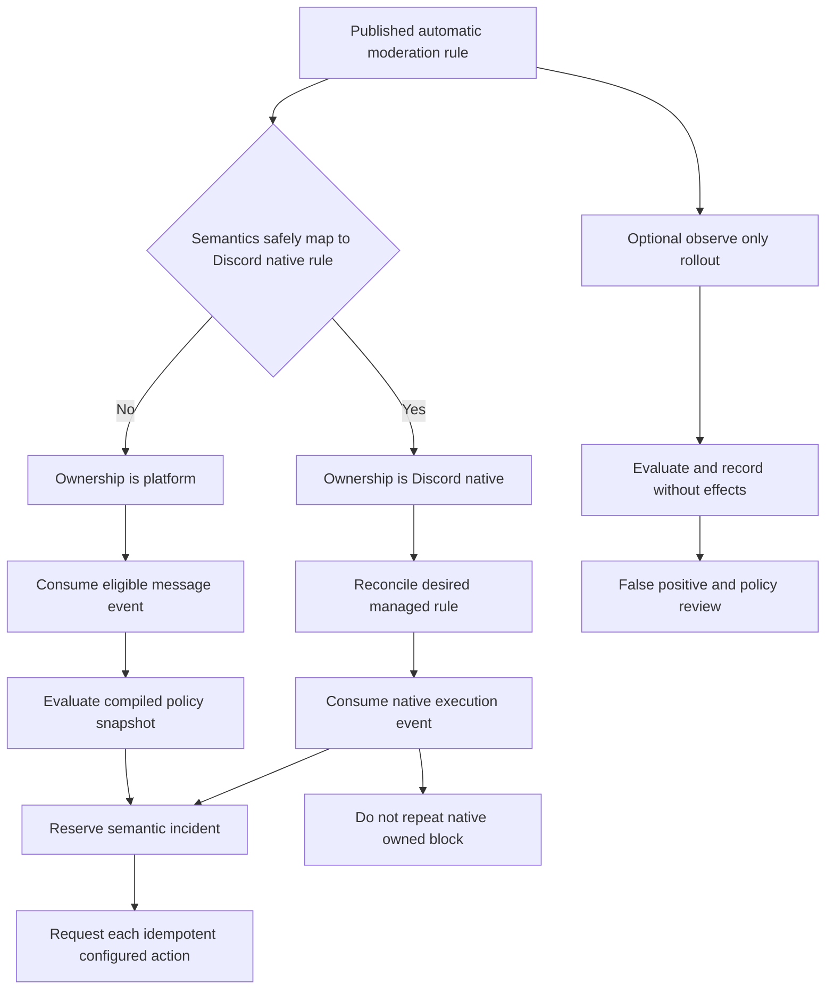

# Tobot Architecture — Moderation and Safety

[Architecture index](README.md) · [Previous](14-invariants-and-boundaries.md) · [Next](16-security-and-containment.md)

## 26. Moderation and safety product specification

### 26.1 Product surfaces and service ownership

Dashboard pages and application commands are presentation adapters. They do not define service boundaries.

| Product surface | Owning service | Supporting services |
|---|---|---|
| Moderation tools | Moderation Case Service | Control API, Interaction Edge, Discord Capability, Discord Transport, Delivery |
| Active warnings and sanctions | Moderation Case Service read projection | Query and Status Service |
| Server audit browser | Discord Audit Query Service | Control API, Discord Capability, Discord Transport |
| Activity-log configuration and history | Activity Log Service | Query and Status, Message Catalog, Delivery |
| Automatic moderation configuration and incidents | Auto Moderation Policy Service | Discord Capability, Moderation Cases, Delivery, Activity Log |
| Countdown deletion and scheduled cleanup | Retention and Cleanup Service | Schedule wake-up capability, Discord Capability, Discord Transport, Activity Log |

### 26.2 Moderation action semantics

| Action | Primary subject | Required platform behavior | Provider preflight baseline | Idempotency basis |
|---|---|---|---|---|
| Warn | Guild member | Create one active warning and an immutable applied case; no Discord member mutation is implied | Product actor capability, tenant membership, target protection, actor-target policy | Tenant, source command, target, warning occurrence |
| Clear warnings | Guild member | Close selected or all active warnings through append-only case events; preserve historical warnings and originating cases | Product actor capability and target policy | Tenant, command, target, selected warning set revision |
| Timeout | Guild member | Apply a bounded communication timeout and record the exact requested and provider-confirmed expiry | Actor and bot moderation capability, owner protection, role hierarchy, duration | Tenant, command or incident, target, intended expiry |
| Remove timeout | Guild member | Remove an active timeout; an already clear timeout is an idempotent no-op with a case outcome | Actor and bot moderation capability, owner protection, hierarchy | Tenant, command, target, observed timeout revision |
| Kick | Guild member | Remove the member without creating a ban; absence after a prior confirmed effect is reconciled, not blindly repeated | Actor and bot kick capability, owner protection, hierarchy | Tenant, command or incident, target |
| Ban | Guild member or user | Create a guild ban with a bounded reason and optional provider-supported recent-message deletion window | Actor and bot ban capability, owner protection, hierarchy when member state exists | Tenant, command or incident, target, desired ban state |
| Unban | User | Remove an existing guild ban; an already absent ban is an idempotent no-op | Actor and bot ban capability | Tenant, command, target, observed ban revision |
| Purge | Channel plus bounded selector | Produce an explicit selection plan, delete admitted messages in governed batches, and record per-message outcomes | View channel, history access, message management, destination compatibility | Tenant, command, channel, selection-plan hash |
| Slowmode | Supported channel | Set a validated slowmode value using an optimistic channel-state precondition | Actor policy and bot channel-management capability | Tenant, command, channel, desired value, observed revision |
| Lock | Supported channel | Deny the configured send capability for the target principal while preserving every unrelated overwrite bit | Actor policy and bot permission-management capability | Tenant, command, channel, principal, observed overwrite revision |
| Unlock | Supported channel | Restore only the lock change created by a known lock case when the current overwrite still matches its expected state | Actor policy and bot permission-management capability | Tenant, command, originating lock case, observed overwrite revision |
| Apply quarantine role | Guild member | Add one policy-approved quarantine role and record ownership without replacing the member's complete role set | Authorized security source or actor, bot role capability, owner protection, hierarchy, protected-target policy | Tenant, incident or command, target, quarantine role, desired present state |
| Remove quarantine role | Guild member | Remove only a quarantine relation owned by the referenced case or explicitly authorized override | Actor or service authority, bot role capability, hierarchy, ownership reference | Tenant, command, target, originating quarantine case, desired absent state |
| Remove dangerous roles | Guild member | Remove a bounded snapshotted set of editable roles selected by an anti-nuke policy and report every role outcome independently | Authorized security incident, bot role capability, owner protection, hierarchy, exact dangerous-permission revision | Tenant, incident, target, role set fingerprint, policy revision |

Provider limits are validated at command admission and again immediately before transport. The current product baseline accepts moderation reasons no longer than Discord's applicable audit-reason boundary, timeouts no longer than Discord's supported maximum, ban history deletion only within the supported window, purge requests in bounded pages, and slowmode only within the provider-supported range.

### 26.3 Authorization model

Authorization is a conjunction, never a single permission check:

1. The request is authenticated as a dashboard user, Discord interaction user, or admitted service principal.
2. The actor belongs to the correct tenant or has an explicitly valid installation context.
3. The actor has the product capability for the requested action.
4. The actor satisfies guild owner and role-hierarchy rules for the target.
5. The target is not denied by protected-user or protected-role policy.
6. The bot has the required Discord permission.
7. The bot outranks the target where Discord hierarchy applies.
8. The destination or resource supports the requested operation.
9. The action parameters comply with the current policy revision and provider limits.
10. The observed resource revision satisfies the command precondition.

An administrator capability does not bypass the guild owner, Discord hierarchy, provider permissions, or an explicit protected-target deny. Service principals used by automatic moderation may request only the action types admitted by their policy revision.

The preflight result has one of four states:

- **Allowed:** all required evidence is present and current enough.
- **Denied:** a stable authorization or protected-target rule rejects the operation.
- **Blocked:** the bot lacks a provider capability or the resource is incompatible.
- **Unknown:** required state is missing or stale; the action waits for one bounded refresh and never assumes permission.

### 26.4 Case identity and history

Every moderation action creates or resolves one case. Each case has an opaque globally unique identifier and MAY have a tenant-local display number allocated atomically for moderator usability.

Case history is append-only and contains:

- Request receipt and idempotency decision.
- Actor, target, and relevant authority snapshots.
- Policy and configuration revisions.
- Sanitized reason and evidence references.
- Preflight outcome with exact denial or block reason.
- Provider request identity and bounded audit reason.
- Primary provider outcome.
- Reconciliation observations when the outcome was uncertain.
- Secondary DM, activity notification, and audit-correlation references.
- Moderator notes, review decisions, redactions, and compensating actions.

Case deletion is not the mechanism for correcting a mistake. A false action is represented by a review decision and, where possible, a compensating action such as removing a timeout or unbanning the user. Privacy redaction removes or replaces sensitive evidence while retaining the minimum immutable operational fact.

### 26.5 Warning and escalation policy

Warnings are case-backed policy signals, not mutable counters without provenance.

Each active warning references its originating case, severity or weight, creation time, optional expiry, policy revision, and closure reason. Warning decay makes a warning inactive after its defined window; it does not erase history.

Escalation is evaluated atomically when a new warning becomes active:

- The policy calculates the prior active score and the new active score using one consistent snapshot.
- A threshold fires only when the score crosses from below the threshold to equal or above it.
- One unique escalation reservation exists for incident, policy revision, threshold, and target.
- Reprocessing the warning or native event returns the existing reservation.
- Escalation creates a new Moderation Action Request and case; it does not mutate the warning case into a different action.
- Expired incidents do not produce delayed punitive escalation after a long outage unless policy explicitly permits bounded catch-up.
- Non-moderation consequences owned by an unspecified domain are not executed through the moderation service. They require a separately defined domain contract before admission.

### 26.6 Sanction notification policy

Warn, timeout, kick, and ban MAY request a direct-message notification after the primary action reaches an applied state. The policy may select no notification, text, or a published Message Definition revision.

Notification context may include:

- Action label.
- Sanitized reason.
- Moderator display identity according to privacy policy.
- Guild name.
- Case display reference.
- Timeout expiry when applicable.
- Appeal or support destination when explicitly configured.

A kick notification that includes a return invitation requires a separately authorized invitation-creation action with strict expiry, use count, destination policy, and auditability. Failure to create an invitation or deliver a DM does not change the sanction outcome.

DM outcomes are recorded as `NotRequested`, `Queued`, `Sent`, `BlockedByUser`, `Failed`, or `Expired`. Moderator UI always displays the primary action and DM state separately.

### 26.7 Automatic moderation policy model

Each rule revision defines:

| Section | Definition |
|---|---|
| Trigger | One bounded detector or an explicit composition of admitted detectors |
| Scope | Guild channels, categories, threads, roles, users, and message classes where the rule applies |
| Exemptions | Explicit roles, channels, users, bots, webhooks, staff policy, and integration sources |
| Ownership | Discord native, platform, or observe only |
| Decision priority | Deterministic ordering when several rules match one event |
| Actions | Delete or native block, incident creation, warning, timeout, kick, ban, response, or alert |
| Cooldowns | User, channel, rule, and guild suppression windows |
| Evidence | Whether content, hash, excerpt, attachment metadata, or no evidence may be retained |
| Review | Dry-run, staged rollout, sample rate, false-positive workflow, and activation state |

The initial bounded detector vocabulary includes:

- Invite-link policy with normalized and obfuscation-aware matching.
- External-link policy with normalized host allowlists and safe URL parsing.
- Banned terms using normalized, case-aware, whole-word, wildcard, or safe regular-expression modes.
- Excessive capitalization using minimum eligible length and percentage.
- Unicode abuse and combining-mark density.
- Maximum content length and maximum line count.
- Mention count and mention-target policy.
- Message burst rate.
- Repeated normalized content.
- Optional attachment or image analysis through an explicitly enabled analysis port.

Detectors operate on one canonical normalized view while retaining the original event only according to evidence policy. Normalization MUST resist zero-width insertion, homoglyph abuse, disguised schemes, and malformed URLs without turning unrelated languages into false matches.

### 26.8 Native and platform enforcement ownership

Native synchronization is desired-state reconciliation:

- Managed rules have a stable ownership marker and provider binding.
- Foreign rules are observed but never modified or deleted.
- Desired and observed hashes detect drift.
- Rule limits and permission failures produce a blocked policy state.
- Losing synchronization does not silently transfer ownership to the platform evaluator and cause duplicate enforcement.
- A deliberate ownership transition requires a new policy revision and a fenced handoff sequence.

### 26.9 Incident evidence and review

An incident records the minimum evidence required to explain the decision. Evidence states are explicit:

- **Available:** retained according to policy and accessible to the moderator.
- **Hashed:** raw content was not retained; an integrity hash and metadata remain.
- **Redacted:** previously retained sensitive fields were removed through policy or authorized request.
- **Unavailable:** Discord did not provide the field, the privileged intent was not approved, or the event was partial.
- **Expired:** evidence retention elapsed while the incident fact remains.

False-positive review does not automatically reverse an applied provider action. It may create a compensating action request, close warnings, and publish a new policy revision. Review analytics use rule and outcome identifiers, never raw message content as metric labels.

### 26.10 Server audit browser

The native Discord audit log is an external read model with provider-controlled retention. The query surface supports:

- Opaque cursor pagination.
- Provider action type.
- Executor identifier.
- Target and entity class.
- Bounded date window constrained by provider retention.
- Correlation with a known case, incident, activity, or cleanup occurrence.
- Explicit page freshness and partial reference-resolution status.

Client-side filtering is permitted only within an already-returned page. Cross-page searches are performed server-side through bounded provider pagination and stop at a declared page, time, or request budget.

Role add/remove consolidation and similar presentation grouping may be produced as a view, but the raw normalized entry references remain distinct. Time-window proximity alone is insufficient to assert that two entries are one action.

### 26.11 Activity log taxonomy

The initial activity taxonomy is:

| Category | Event families |
|---|---|
| Messages | Create when explicitly admitted, edit, delete, attachment removal, bulk deletion, pin changes |
| Members | Join, departure, kick observation, nickname, roles, timeout, timeout removal, ban, unban |
| Roles | Create, update, delete, position and permission changes |
| Channels | Create, update, delete, permission overwrite, thread lifecycle, forum or media post lifecycle, guild metadata changes |
| Invites | Create and delete where the required intent and permissions are justified |
| Voice | Join, leave, move, server mute/deaf, stage changes, forced disconnect when attribution is supported |
| Assets | Emoji, sticker, and soundboard create, update, and delete |
| Moderation | Case opened, action applied, action failed, warning, escalation, compensation, and review |
| Automatic moderation | Incident, native execution, platform enforcement, false positive, policy change, and rule synchronization |
| Retention | Countdown deletion, sweep start, page result, partial completion, completion, and block |
| Administration | Product configuration publication and security-relevant dashboard actions |

Activity routing supports one global destination, category destinations, or history-only mode. Resolution order is explicit: event override, category destination, global destination, then no delivery. A missing destination never discards the durable activity record.

Filters execute before sensitive content is retained. Ignored channels include explicitly configured child threads only when policy declares parent inheritance. Ignored roles are evaluated against the event subject and actor according to event-specific semantics; the service MUST NOT apply one ambiguous role check to every event type.

### 26.12 Attribution and correlation

The system distinguishes:

- **Actor:** principal that requested a platform command.
- **Executor:** identity recorded by Discord for a native mutation.
- **Subject:** user, member, role, channel, message, or asset affected.
- **Source:** service, Gateway event, interaction, dashboard command, or provider audit observation.

An activity record may initially have no executor. Attribution is updated only when a case supplies a known actor or a bounded audit correlation produces sufficient evidence.

Correlation considers action type, guild, target, channel, provider resource identifiers, case audit reason, and bounded occurrence time. Results are `Exact`, `HighConfidence`, `Ambiguous`, `NoMatch`, or `Unavailable`. Only `Exact` and policy-approved `HighConfidence` results may display a named executor without an uncertainty indicator.

### 26.13 Activity privacy and retention

Event metadata retention and message-content retention are independent policies.

| Data class | Default treatment |
|---|---|
| Event identity, type, guild, channel, and time | Retain for configured operational history |
| Actor and target identifiers | Retain with tenant access controls and deletion policy |
| Message content before and after edit | Do not retain unless explicitly enabled |
| Deleted-message content | Do not retain unless explicitly enabled with a short bounded duration |
| Attachment URLs | Store only stable asset references or hashes; expiring external URLs are not evidence guarantees |
| Moderation reason | Retain with the case while supporting evidence redaction |
| Private moderator notes | Restricted evidence access and separate audit trail |
| Native audit changes | Cache briefly; retain only bounded normalized correlation when required |

Retention deletion runs as an owned workflow and publishes redaction events so query projections and search indexes remove expired sensitive fields.

### 26.14 Countdown deletion policy

A countdown policy declares channel or inherited parent scope, delay, message filter, pinned-message exclusion, author classes, attachment behavior, activation revision, and execution deadline.

When an eligible message event arrives:

1. The service evaluates the immutable policy revision active at message occurrence.
2. It creates one deletion intent keyed by guild, message, and policy revision.
3. The durable timer wakes the intent at the target time.
4. The worker revalidates message existence, pinned state, channel relationship, and permissions.
5. The worker deletes or records an explicit skip, block, expiry, or retry.
6. The outcome is published with cleanup origin for Activity Log correlation.

Filters initially support all eligible messages, bot-authored messages only, and messages without attachments. Additional filters require explicit evidence and privacy semantics.

### 26.15 Scheduled cleanup policy

A scheduled policy declares:

- IANA timezone and recurrence.
- Misfire behavior: skip, catch up one bounded occurrence, or coalesce.
- Included channels, categories, forums, media channels, and active-thread rules.
- Message filter and pinned-message protection.
- Maximum pages, messages, provider calls, wall-clock duration, and individual old-message deletions per occurrence.
- Dry-run requirements before activation.
- Block behavior after permission or destination failures.

The sweep plans recent and old messages separately. Recent eligible messages are divided into unique bulk batches that satisfy Discord's current count and age restrictions. Older messages are individually deleted only within the occurrence's explicit request budget. A large historical cleanup is therefore multiple checkpointed occurrences, not one unbounded job.

Forum and media parents contain posts represented as threads; the policy must state whether existing active posts are included. Archived or locked thread handling requires a separate admitted capability and is not inferred from parent inclusion.

### 26.16 Moderation-specific consistency rules

- Case creation and case outbox publication are atomic.
- Automatic moderation incident creation and enforcement-request publication are atomic.
- Cleanup occurrence checkpoint and deletion-result publication are atomic.
- Activity record creation and optional delivery-intent publication are atomic.
- Discord provider mutation and local persistence cannot be one transaction; uncertainty is represented and reconciled.
- Case, incident, activity, audit observation, and cleanup occurrence remain separate aggregates linked by identifiers.
- Read projections may combine those aggregates for an operator timeline but never become the mutation authority.
- Configuration publication uses optimistic concurrency and immutable revisions.
- A stale configuration consumer may finish work only when the intent already pins that revision and its deadline remains valid.

### 26.17 Moderation operational kill switches

Independent controls MUST exist for:

- All moderation provider mutations.
- Automatic moderation platform-owned deletion.
- Automatic moderation member sanctions.
- Native rule synchronization without disabling already-confirmed native enforcement.
- Sanction DMs.
- Activity Discord-channel delivery while preserving local history.
- Countdown deletion.
- Scheduled cleanup.
- Audit correlation enrichment.
- Sensitive evidence retention.

Disabling one secondary function must not stop Gateway heartbeats, event durability, case recording, or unrelated message delivery. Kill-switch changes are authenticated, audited, revisioned, and propagated through the same configuration publication mechanism.
