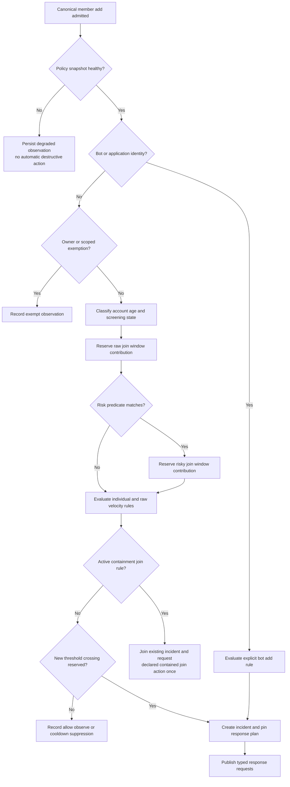
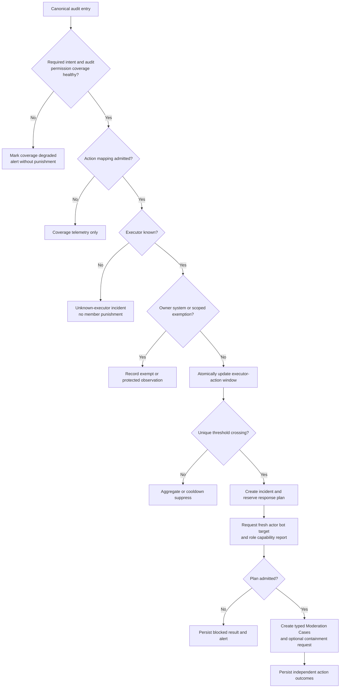

# Tobot Architecture — Security and Containment

[Architecture index](README.md) · [Previous](15-moderation.md) · [Next](17-roles-and-access.md)

## 27. Security and incident containment product specification

### 27.1 Product surfaces and ownership

Dashboard pages and application commands are adapters. They do not own security policy, incident state, counters, or containment progress.

| Product surface | Owning service | Supporting services |
|---|---|---|
| Anti-raid policy and simulation | Security Policy and Incident Service | Control API, Query and Status, Discord Capability |
| Anti-nuke policy and simulation | Security Policy and Incident Service | Control API, Discord Capability, Discord Audit Query |
| Security incident timeline and review | Security Policy and Incident Service read projection | Query and Status, Activity Log, Moderation Cases |
| Lockdown preview, activation, progress, and restoration | Containment Orchestrator | Control API, Interaction Edge, Discord Capability, Discord Transport |
| Member quarantine, timeout, kick, ban, or dangerous-role removal | Moderation Case Service | Security Policy and Incident, Discord Capability, Discord Transport |
| Incident alert configuration and status | Security Policy and Incident Service | Message Catalog, Delivery, Query and Status |
| Native incident controls | Containment Orchestrator | Discord Capability, Discord Transport |

The dashboard MUST expose authoritative state and projection freshness separately. A projected `Active` badge is not proof that every Discord resource is currently contained; the operation detail and last reconciliation time provide that evidence.

### 27.2 Security policy aggregate

A published security policy revision contains:

- Master mode: disabled, observe only, or enforce.
- Join detector rules and counter source selection.
- Privileged-action detector rules.
- User, role, bot/application, and detector-scoped exemptions with optional expiry.
- Account-age risk bands and explicit boundary semantics.
- Membership-screening handling.
- Threshold, window, quiet period, cooldown, and escalation rules.
- One immutable response-plan revision per detector rule.
- Protected-target and owner behavior.
- Alert routing, coalescing, and fallback policy.
- Evidence classification and retention.
- Dry-run, staged rollout, and automatic-enforcement risk approval.

Publishing performs schema validation, capability preview, optimistic version checking, and policy compilation before activation. A revision is rejected when it references an unknown action, unsupported counter class, missing response plan, unbounded window, contradictory transition, or provider capability presented as guaranteed when it is conditional.

Activation modes are:

| Mode | Evaluation | Discord mutation | Incident history |
|---|---|---|---|
| Disabled | No detector evaluation beyond health accounting | None | No member-level observation retention unless explicitly required for diagnostics |
| Observe only | Full bounded evaluation | None | Incidents and simulated actions retained according to policy |
| Enforce | Full bounded evaluation | Only reserved, authorized response steps | Incidents, cases, containment, and alert outcomes retained |

Observe-only is the mandatory first activation mode for newly introduced destructive audit-action mappings. Moving a mapping to enforce requires an explicit policy revision; accumulated observe-only counts do not retroactively trigger punishment.

### 27.3 Join-risk model

Join protection evaluates independent signals instead of collapsing them into one opaque score:

| Signal | Definition | Counter class | Notes |
|---|---|---|---|
| Raw join velocity | All admitted human member-add observations in the configured window | Guild and detector rule | Detects volume regardless of account age |
| Risky join velocity | Human member-add observations matching an explicit account-age band or other admitted predicate | Guild, detector rule, and risk class | Separates new-account bursts from legitimate high-volume events |
| Individual account age | Difference between observation time and Discord account creation time | No shared counter required | Exact boundary is fixed by the policy revision |
| Screening pending | Member is currently restricted by Discord Membership Screening | Optional bounded signal | Pending is not failure and never proves malicious intent |
| Bot join | Joining identity is a bot/application | Separate observation class | Not mixed with human velocity; may trigger an explicit bot-add policy |
| Active containment | A containment operation currently governs new joins | No detection counter | Applies the operation's declared join-handling step |

Account age uses the canonical observation occurrence time. A member exactly equal to the configured minimum age is admitted unless the policy explicitly defines an inclusive risky boundary. Clock skew tolerance is fixed in the revision and cannot be changed while evaluating an in-flight observation.

The base detector MUST NOT depend on invite-source attribution because invite attribution may be unavailable, ambiguous, or expensive. A future invite signal may enrich a decision only when its evidence and privacy semantics are independently specified.

### 27.4 Join decision procedure

Decision ordering exists to ensure determinism, not to hide signals. Every evaluated signal and counter result is stored in the observation decision. When multiple rules cross on one observation, the policy selects one incident response by explicit priority; additional crossings are linked as contributing detections and may request only escalation steps not already reserved.

### 27.5 Distributed window semantics

The distributed-window port MUST provide atomic append-or-reserve, expiry, count, and threshold-crossing reservation. An implementation may use a sorted time set, bucketed counter, streaming window, or another portable adapter if it satisfies the conformance contract.

Required semantics:

- The window is based on event occurrence time within a bounded accepted-lateness allowance; events older than that allowance are recorded but do not mutate current enforcement windows.
- Every contribution has a stable observation identity, making duplicate insertion a no-op.
- The returned result includes effective window bounds, count, rule identity, reservation identity, and expiry.
- Keys are tenant-scoped, finite, and expire shortly after the longest policy window plus recovery allowance.
- One atomic reservation owns a given threshold crossing across all replicas.
- A detector uses a hysteresis or incident latch so every count above the threshold does not repeat the same plan.
- A later escalation threshold has its own unique crossing identity and may add only its declared steps.
- Counter unavailability permits durable observation and explicit degradation, never an uncoordinated process-local destructive fallback.
- Rebuilding a lost coordination store from durable observations is bounded by retention, event-time rules, and a recovery mode that cannot retroactively punish members.

### 27.6 Incident identity, aggregation, and resolution

A join-raid incident key is derived from tenant, detector rule, policy revision, and response epoch. An anti-nuke incident additionally includes the normalized executor and action grouping declared by policy. Unknown executors use an explicit unknown class and cannot receive a member sanction until identity is proven.

One incident aggregates qualifying observations until its quiet period expires. Aggregation updates observed counts, subjects, last occurrence, and evidence references without resetting already confirmed action results.

Resolution requires all of the following:

1. The configured quiet period has elapsed after the last qualifying observation.
2. No required response step is executing or outcome-uncertain.
3. The response plan's exit policy has completed, or an operator has elected to keep containment active independently.
4. Partial restoration remains visible as a separate operation even if detection activity has ended.
5. The resolution decision is committed and published exactly once.

An operator may confirm, mark false positive, redact evidence, or publish a corrected policy revision. Review never rewrites the original threshold, policy revision, action result, or provider evidence.

### 27.7 Response-plan catalog and ownership

Response plans contain ordered typed steps. Each step has one owner, admission preconditions, idempotency key, deadline, on-failure behavior, and optional compensation.

| Response step | Owner | Primary constraints | Compensation or exit |
|---|---|---|---|
| Observe and record | Security Policy and Incident | Always non-mutating | None |
| Send or update incident alert | Delivery | Explicit mention policy and destination capability | Superseding summary, not message spam |
| Apply or remove quarantine role | Moderation Case Service | Actor/service authority, bot role hierarchy, protected-target policy | Separate compensating case |
| Apply timeout | Moderation Case Service | Moderatable member and provider duration bound | Remove-timeout case when plan declares it |
| Kick member | Moderation Case Service | Kick permission and hierarchy | No automatic inverse operation |
| Ban user | Moderation Case Service | Ban permission, hierarchy when member exists, explicit history-deletion policy | Unban requires separate case and does not restore membership |
| Remove dangerous roles | Moderation Case Service | Editable roles only, permission allowlist, per-role outcomes | Role restoration is never automatic unless separately snapshotted and authorized |
| Apply or restore channel lockdown | Containment Orchestrator | Manage-channel capability, resource snapshot, compare-and-set | Owned-bit restoration |
| Pause or resume invites | Containment Orchestrator | Supported incident action, `MANAGE_GUILD`, admitted duration | Clear only the operation-owned pause value |
| Pause or resume guild DMs | Containment Orchestrator | Supported incident action, `MANAGE_GUILD`, admitted duration | Clear only the operation-owned pause value |
| Raise or restore verification level | Containment Orchestrator | Explicit opt-in, provider support, snapshot, ownership precondition | Restore only if unchanged by others |
| Coordinate native Auto Moderation | Auto Moderation Policy Service | Native-rule ownership and provider capacity | Normal native-rule reconciliation |

A response plan cannot treat a failed stronger action as permission to execute an unreviewed fallback. Fallbacks are declared in the immutable plan. For example, `ban then remove dangerous roles if hierarchy blocks ban` is legal only when both actions were previewed, authorized, and have separate idempotency identities.

### 27.8 Anti-nuke observation model

Anti-nuke consumes the canonical `GUILD_AUDIT_LOG_ENTRY_CREATE` fact. The Gateway Edge durably stores the event before evaluation. The Security service maps the provider action to a versioned internal action key; unmapped actions are counted only in coverage telemetry and retained only when privacy policy permits.

Initial detector families are:

| Family | Example admitted actions | Grouping key | Default activation |
|---|---|---|---|
| Channel lifecycle | Channel create, delete, and destructive update | Guild, executor, exact action or declared family | Observe only |
| Role lifecycle | Role create, delete, and update | Guild, executor, exact action | Observe only |
| Dangerous permission change | Role permission or channel-overwrite changes that introduce declared dangerous capabilities | Guild, executor, normalized capability class | Observe only |
| Member removal | Member kick and ban | Guild, executor, exact action | Observe only |
| Bot admission | Bot/application added | Guild, executor, bot-add action | Observe only |
| Webhook lifecycle | Webhook create, update, and delete | Guild, executor, exact action | Observe only |
| Integration lifecycle | Supported integration create, update, and delete observations | Guild, executor, exact action | Observe only |

Each provider action becomes enforceable only after its target semantics, executor availability, required intent, audit permission, hierarchy behavior, and rollback limitations have a passing adapter conformance test. Families are not automatically collapsed: a policy must explicitly choose whether related exact actions share a counter.

The guild owner is never automatically punished. Owner actions may create a high-severity observe-only incident and alert. Bots and applications are not globally exempt: trusted applications require an explicit, scoped, expiring or revisioned exemption. Discord-owned or system-generated entries are represented distinctly and never assigned to a guessed executor.

### 27.9 Anti-nuke punishment procedure

Punishment cooldown is scoped by tenant, executor, action grouping, sanction type, and policy revision. It suppresses duplicate action requests but never suppresses observation recording, incident aggregation, or operator visibility.

Dangerous-role removal has these additional rules:

- The policy contains the exact dangerous permission set; it is not embedded in executor code.
- The capability report lists every held role, role position, editability, relevant permissions, and selected outcome without exposing unrelated role data.
- Each role removal is a separate bounded provider step under one case workflow and reports confirmed, skipped, blocked, failed, or uncertain.
- Removing some roles does not permit the case to report a complete strip.
- An optional timeout is a separate action request and outcome, never an implied side effect.

### 27.10 Lockdown policy and resource scope

A lockdown plan declares:

- Included channel kinds and optional explicit channel/category scope.
- Permission bits owned by the operation for text, thread, voice, and stage surfaces.
- Whether active and newly created channels enter the operation.
- New-join handling during active containment.
- Optional native invite/DM pause and verification step.
- Maximum resources, batch size, provider-request rate, deadline, and retry ceiling.
- Alert policy, automatic-expiry policy, and exit authorization.
- Required restoration behavior and conflict escalation.

The baseline permission catalog may include sending messages, adding reactions, sending in threads, creating public or private threads, connecting to voice, and speaking. A plan selects only applicable bits for each channel kind. Unsupported or irrelevant bits are not written merely to make all snapshots look uniform.

Channel enumeration is a versioned plan input. A channel created while lockdown is active is evaluated from a canonical channel-create event and may receive a new idempotent operation step if the policy includes dynamic scope. A deleted channel becomes an explicit already-absent restoration outcome.

### 27.11 Lockdown consistency and restoration

Before each apply mutation, the orchestrator persists:

- Resource identity and channel kind.
- Capability-report reference and freshness.
- Whether the relevant overwrite existed.
- Original values for only the operation-owned permission bits.
- Unrelated-value fingerprint used to detect concurrent administrator changes.
- Intended applied values.
- Step idempotency key and fencing token.

After a confirmed apply, the provider-observed applied fingerprint is persisted. An uncertain response enters reconciliation before retry. A retry reads current provider state and proves whether the intended effect already exists.

Restore compares current owned values with the values applied by the operation:

- If they match, restore the original owned values while preserving unrelated current values.
- If the resource is absent, record `AlreadyAbsent`.
- If the owned values changed independently, record `Conflict` and do not overwrite them.
- If the provider outcome is uncertain, retain `RestoreUncertain` and reconcile.
- If permissions block restoration, retain `RestoreBlocked` and surface the missing capability.

An operator acknowledgement may close an irrecoverable remainder only after viewing every unresolved resource and providing a reason. Acknowledgement changes the operation to `Acknowledged`, not `Restored`, and remains in the audit history.

### 27.12 Discord-native incident coordination

Native controls are optional typed steps behind the Discord adapter. The architecture distinguishes supported application operations from administrator guidance.

| Control | Architecture treatment |
|---|---|
| Pause invites | Supported only when the current Discord incident-actions contract and `MANAGE_GUILD` capability are confirmed; maximum duration follows the provider contract and is currently 24 hours |
| Disable guild DMs temporarily | Same incident-actions contract and duration constraint as invite pause |
| Raise verification level | Separate guild-setting mutation with snapshot, explicit authorization, and compare-and-set restoration |
| Membership Screening | Observe member `pending` state; do not bypass or complete screening |
| Native Auto Moderation mention-raid rules | Managed by Auto Moderation Policy Service under explicit native ownership |
| Discord raid alerts or CAPTCHA | Operator guidance only unless Discord exposes and documents an application operation |

Native controls do not replace platform incident state. Their confirmed, blocked, partial, uncertain, expired, or independently changed results are recorded as containment steps.

### 27.13 Preflight and preview contract

Preview is mandatory before publishing a plan that contains automatic guild-wide containment and available on demand for every manual operation. Preview is non-mutating and time-bounded.

It returns:

- Policy and response-plan revisions.
- Detector, threshold, counter class, quiet period, cooldown, and escalation semantics.
- Planned action owners and ordering.
- Member, role, channel, and native-control capability results.
- Channels and permission bits that would change, grouped by applicable channel kind.
- Targets and roles that are protected, unmanageable, exempt, or only partially actionable.
- Estimated Discord requests, batch count, and worst-case completion class.
- Alert destination and fallback readiness.
- Native controls that are supported, unsupported, unavailable, or already active.
- Restoration method and any state that cannot be automatically reversed.
- Projection and capability freshness.

Preview MUST NOT claim that the same permissions will still exist at execution. The orchestrator revalidates authority and preconditions at execution time.

### 27.14 Alert behavior

Security alerts use the existing Message Definition and Delivery Plane. The Security service creates one durable alert intent for an incident lifecycle transition, not one direct send per observation.

Required alert classes are incident started, response changed, containment partial or failed, coverage degraded, incident resolved, and operator acknowledgement. Active-incident updates are coalesced by configurable time and count thresholds.

Every alert:

- Uses explicit allowed mentions with broad mentions disabled by default.
- Contains incident identity, detector class, policy revision, observed window, response summary, known limitations, and a dashboard reference.
- Distinguishes confirmed provider effects from requested, blocked, partial, uncertain, or simulated effects.
- Omits raw message content, unnecessary profile data, and ambiguous executor attribution.
- Has delivery, retry, fallback, and terminal-failure state independent from the incident.
- Deduplicates by tenant, incident, transition, alert revision, and destination.

Fallback is a configured destination chain that is capability-checked in advance. Direct messaging the guild owner is not assumed to be available or permitted and requires explicit opt-in. If no destination can deliver, local operator visibility and alert-failure telemetry remain mandatory.

### 27.15 Degraded modes and recovery

| Unavailable capability | Permitted behavior | Forbidden behavior |
|---|---|---|
| Relational policy store | Continue briefly with a valid non-expired compiled snapshot; reject policy writes | Invent defaults or extend snapshot validity indefinitely |
| Distributed counter | Persist observations and mark enforcement degraded | Use replica-local counters for destructive enforcement |
| Durable incident store | Backpressure or stop security consumption before acknowledgement | Punish without an incident reservation |
| `GUILD_MEMBERS` intent | Report join detection unavailable | Claim zero raids or infer joins from partial caches |
| `GUILD_MODERATION` intent or `VIEW_AUDIT_LOG` permission | Report anti-nuke detection unavailable and attempt only bounded authorized recovery checks | Claim complete audit coverage |
| Discord Capability Service | Observe and queue within a short deadline | Execute a high-impact mutation from stale guessed permissions |
| Discord Transport | Preserve requested operations and deadlines | Bypass centralized rate limits with a direct client |
| Delivery | Continue incident and containment processing | Block containment waiting for an alert |

After a Gateway resume failure or identified event gap, the Security service may request a bounded audit-log backfill through Discord Audit Query. Backfill uses provider cursors, event identities, the 45-day provider retention boundary, and a strict request budget. Backfilled entries may enrich or create incidents according to a separate recovery policy, but destructive action after the real-time deadline requires operator authorization.

### 27.16 Data minimization and retention

| Data class | Default treatment |
|---|---|
| Security policy and response revisions | Retain while referenced plus configured audit window |
| Window coordination entries | Expire after window plus recovery allowance |
| Normal below-threshold observations | Short bounded retention or aggregate-only retention |
| Incident observations | Retain bounded identifiers and risk facts through incident review window |
| Audit changes | Store only normalized fields needed for action classification; do not duplicate full provider entries by default |
| Account creation and join times | Retain only derived age class when exact timestamps are no longer required |
| Executor, subject, role, and channel identifiers | Tenant-scoped operational retention with deletion policy |
| Resource snapshots | Retain through restoration and a bounded audit period; redact unrelated permission data |
| Case reasons and evidence | Follow Moderation Case privacy and evidence policy |
| Alert content | Follow Delivery ledger policy independently from incident retention |

Incident aggregates remain explainable after observation pruning by retaining policy revision, threshold snapshot, count summary, response references, and redaction markers. A redacted identifier is not silently replaced with a guessed identity.

### 27.17 Operational procedures

**Publishing a security policy:**

1. Validate the draft and referenced response plan.
2. Compile a deterministic snapshot and run representative simulations.
3. Generate a capability preview and highlight unsupported steps.
4. Publish in observe-only or staged mode unless an already-approved detector mapping is being revised.
5. Propagate the immutable revision and verify evaluator acknowledgement by cell.
6. Activate enforcement only after health, counter, intent, permission, and alert-readiness gates pass.

**Starting manual lockdown:**

1. Authenticate and authorize the operator with a short-lived guild context.
2. Create a preview and display irreversible or partially reversible steps.
3. Require reason and idempotency key; high-risk native controls require explicit selection.
4. Acquire the guild lease, revalidate capabilities, commit the plan, and begin bounded execution.
5. Return the operation identity immediately and stream authoritative state through projections.
6. Keep partial, blocked, and uncertain resources actionable until recovered or acknowledged.

**Restoring a guild:**

1. Select the exact active or partial containment operation.
2. Reauthorize the operator and acquire a new fenced transition lease.
3. Refresh every current resource and native-control state.
4. Restore only operation-owned values whose preconditions still match.
5. Reconcile uncertainty and expose conflicts without overwriting them.
6. Mark `Restored` only when no admitted remainder exists; otherwise retain `RestorePartial`.

**Handling degraded anti-nuke coverage:**

1. Emit one deduplicated high-severity health incident.
2. Stop new automatic destructive anti-nuke responses.
3. Diagnose intent, permission, shard, and event-gap state.
4. Run a bounded audit backfill when authorized and useful.
5. Restore enforce mode only after live-event health and permission checks pass.
6. Record the exact unobserved or uncertain interval for operator review.

### 27.18 Security-specific consistency rules

- Policy publication and security outbox publication are atomic.
- Observation admission, window-reservation reference, and observation outbox publication are atomic at the owning boundary.
- Incident creation, threshold-crossing reservation, response-plan pinning, and response-request publication are atomic.
- Counter coordination and incident storage cannot be one universal transaction; the window adapter returns an idempotent reservation token that is durably attached or safely recoverable.
- A response request and its Moderation Case or Containment Operation remain separate aggregates linked by stable identifiers.
- Apply-step intent is persisted before provider mutation; confirmed result is persisted before the next dependent step.
- Provider mutation and local state are not atomic. Uncertain outcomes are first-class and reconciled before retry.
- Restoration never deletes apply history, snapshots, attempts, conflicts, or acknowledgements.
- Query projections may combine security, moderation, containment, activity, and delivery timelines but cannot authorize or execute a response.

### 27.19 Security operational kill switches

Independent authenticated, revisioned, and audited controls MUST exist for:

- All automatic security enforcement while preserving observation and incidents.
- Join-raid member sanctions.
- Anti-nuke member sanctions.
- Dangerous-role removal.
- Automatic guild lockdown.
- Manual lockdown initiation, without disabling restoration.
- Invite pause.
- Guild direct-message pause.
- Verification-level changes.
- Quarantine-role assignment.
- Security alerts, while preserving local incident visibility.
- Bounded audit backfill.
- Sensitive security evidence retention.

No kill switch may disable Gateway heartbeats, durable ingestion, operation restoration, provider rate-limit governance, or the ability to inspect active partial containment. A global emergency switch defaults new high-impact work to observe-only and leaves already-started operations in an explicit operator-controlled state.
