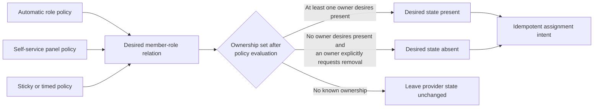
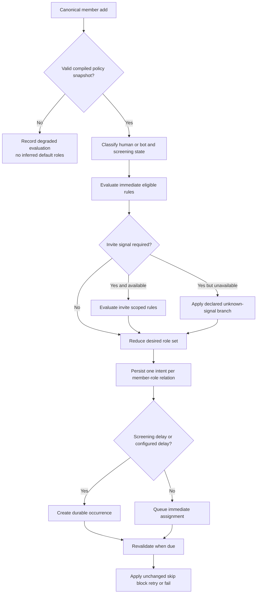
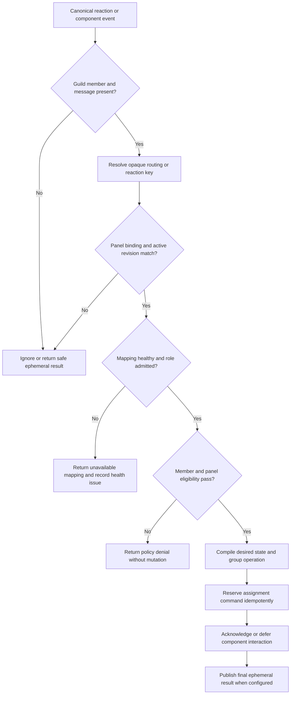
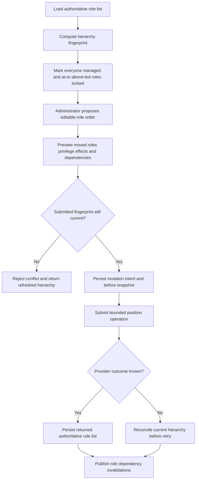

# Tobot Architecture — Roles and Member Access

[Architecture index](README.md) · [Previous](16-security-and-containment.md) · [Next](18-community.md)

## 28. Roles and member access product specification

### 28.1 Product surfaces and service ownership

| Product surface | Owning service | Supporting services |
|---|---|---|
| Automatic roles | Role Policy and Assignment Service | Control API, Gateway Edge, Discord Capability, Discord Transport |
| Delayed, temporary, and sticky roles | Role Policy and Assignment Service | Durable timer capability, Discord Capability, Query and Status |
| Self-service role panels | Role Panel Service | Control API, Interaction Edge, Gateway Edge, Message Catalog, Delivery |
| Member role-assignment status | Role Policy and Assignment read projection | Query and Status, Activity Log |
| Panel publication and health | Role Panel Service read projection | Query and Status, Delivery |
| Role creation, editing, deletion, and hierarchy | Role Resource Service | Control API, Discord Capability, Discord Transport, Discord Audit Query |
| Live role catalog and assignment capability | Discord Capability Service | Gateway Edge, Discord Transport |

The administrative routes for these surfaces MUST use distinct bounded-context namespaces and operation-specific authorization. Route composition has a build-time collision check over method and normalized path. No screen or route prefix becomes a service boundary by itself.

### 28.2 Role policy aggregate

A role policy is a versioned desired-state specification, not a collection of event-handler flags. Every published revision contains:

- Policy type: automatic membership, self-service panel, timed lifecycle, sticky rejoin, or bounded reconciliation.
- Activation state and effective interval.
- Ordered predicates and deterministic tie-breaking.
- Human, bot/application, screening, account-age, invite-signal, member, and existing-role conditions when admitted.
- Target role and desired state.
- Assignment ownership key.
- Delay, expiry, deadline, and misfire behavior.
- Group membership, minimum, maximum, and exclusivity constraints.
- Deny rules and explicit member, role, or source exemptions.
- Notification and Activity Log policy.
- Sensitive-permission safety classification.
- Reconciliation scope, page limits, request budget, and retention.

Policies are compiled into immutable per-guild snapshots. Publishing rejects missing roles, managed roles, `@everyone`, roles outside bot hierarchy, unsafe permission classes, contradictory add/remove rules at equal priority, unbounded timing, and panel groups that cannot produce a deterministic desired state.

Policy revisions never mutate in place. Pending work pins its revision and may be superseded only through an explicit rule that records why the old intent is no longer eligible.

### 28.3 Desired-state ownership

Role presence in Discord does not reveal why it exists. The platform therefore tracks ownership of relations it creates.

Ownership rules are:

- Each assignment source uses a stable ownership key derived from tenant, policy family, policy identity, and optional group.
- Multiple policies may desire the same role to be present. Removing one ownership claim does not remove the role while another active claim remains.
- A role observed without platform ownership is preserved unless an explicitly authorized administrative or moderation action removes it.
- Reconciliation repairs only relations owned by the selected policy scope.
- Sticky retention preserves the prior ownership claim, not every role observed on the member.
- Native community-invite assignment is represented as Discord-owned when evidence is available; the platform does not claim ownership merely because the role appeared near join time.
- Manual administrator changes may intentionally diverge from policy. The configured reconciliation mode determines whether the relation is repaired, reported, or relinquished; no hidden loop fights administrators indefinitely.

### 28.4 Automatic-role rule model

The initial built-in predicates are deliberately small and composable:

| Predicate | Values | Behavior |
|---|---|---|
| Member class | Human, bot/application | Evaluated from the canonical member identity |
| Screening gate | On join, after screening, screening not applicable | Determines the earliest eligibility point |
| Existing role | Has or lacks an admitted role | Uses a fresh-enough member-role projection at execution |
| Member exception | Included or excluded member | Explicit tenant-scoped rule with optional expiry |
| Account-age band | Configured bounded age class | Optional input shared by canonical member facts, not Security incident state |
| Invite signal | Exact, labeled, unknown, or unavailable | Optional enrichment; ordinary assignment never waits indefinitely for it |
| Rejoin state | New join or retained policy ownership | Available only when sticky retention is enabled |

Rules select desired roles independently, then a deterministic conflict reducer applies deny precedence, explicit priority, and group cardinality. A deny at equal or higher priority prevents assignment. Ties that cannot be resolved cause a policy compilation error rather than nondeterministic behavior.

### 28.5 Automatic-role evaluation flow

Bot and human policies are separate rule predicates, not fixed storage buckets. A bot addition may also be observed by Security anti-nuke; that security observation neither grants nor suppresses automatic roles unless a versioned role policy explicitly consumes an admitted security outcome.

### 28.6 Membership Screening behavior

The default policy for a permission-bearing human role is `after screening` when Discord reports the member as pending. A cosmetic role may be marked safe for immediate assignment, but that choice is explicit and does not alter Discord's screening restrictions.

The service processes both member-add and the member-update transition that clears pending state:

1. Member add creates immediate eligible intents and durable waiting records for gated roles.
2. Duplicate member events update no already-reserved relation twice.
3. A transition from pending to non-pending releases eligible waiting records.
4. A member departure cancels unexecuted waiting records.
5. A timeout or missing transition expires the waiting record according to policy; it does not assume screening completion.
6. Guilds without Membership Screening follow the `not applicable` branch declared by policy.

Platform verification panels are ordinary self-service role policies and MUST NOT claim to complete Discord Membership Screening. Their assigned role, eligibility, and security effect are separately configured.

### 28.7 Delayed and temporary roles

Every delay and expiry is a durable occurrence with intended time, timezone-independent instant, misfire policy, lease, and unique occurrence key.

Delay semantics:

- Immediate is the default.
- A delayed intent revalidates membership, current policy revision, screening eligibility, role capability, ownership, and group constraints when due.
- If the deadline has passed, the intent expires without provider mutation.
- Misfire behavior is `skip`, `execute once if still eligible`, or `coalesce to latest desired state`; uncontrolled catch-up is forbidden.

Temporary-role semantics:

- Confirmed assignment schedules a separate absent-state intent at the declared expiry.
- An unchanged result schedules expiry only when the policy owns the existing relation or explicitly adopts it through an audited rule.
- Renewal creates a new occurrence or extends ownership using optimistic versioning; duplicate events cannot create parallel expiries.
- Expiry removes only the expiring ownership claim. The provider role remains while another active owner still desires it.
- Failed removal remains observable and retryable within a bounded deadline.

### 28.8 Sticky and rejoin roles

Sticky behavior is opt-in per policy and target role. On departure, the service retains only confirmed platform-owned relations admitted by the sticky policy. Each record has a retention expiry and privacy classification.

On rejoin:

- The member identity must match the retained record and tenant.
- The role and policy must still exist and remain eligible.
- Screening, delay, hierarchy, exclusions, and sensitive-permission rules are reevaluated.
- Reassignment creates a new intent; prior assignment success is not replayed as current success.
- Expired, redacted, or superseded sticky records cannot assign roles.

Sticky policy does not snapshot arbitrary member roles and cannot restore managed, sensitive, moderator, or security roles unless those roles are explicitly admitted by a separate high-trust specification.

### 28.9 Optional invite-derived roles

Invite handling has two distinct ownership modes:

| Mode | Owner of provider effect | Platform behavior |
|---|---|---|
| Discord community invite with `role_ids` | Discord | Configure only through an admitted invite capability, observe resulting state, avoid duplicate assignment, and define explicit cleanup because roles persist after invite expiry or deletion |
| Platform invite attribution | Role Policy and Assignment | Consume a bounded attribution result and plan a normal assignment intent |

Invite attribution is fallible. A rule MUST define behavior for exact, ambiguous, unavailable, and timed-out attribution. The core member-add path never blocks beyond a short enrichment deadline, and a late attribution cannot grant a role after the policy's assignment deadline.

Invite usage counters, labels, and invite lifecycle are not owned by the Roles domain unless a future module explicitly admits that responsibility. Roles consumes a typed attribution fact or native assignment observation.

### 28.10 Assignment execution semantics

The executor handles one desired member-role relation at a time:

1. Claim the intent with an expiring fenced lease.
2. Reject work past its deadline or superseded by a newer desired-state decision.
3. Resolve member existence, current roles, target role, managed state, bot hierarchy, sensitive classification, and required permission.
4. Confirm that the ownership key may request the desired transition.
5. Return `Unchanged` without a provider request when desired state already holds.
6. Submit one typed add or remove request through Discord Transport.
7. Persist confirmed, retryable, blocked, permanent, or uncertain result.
8. Reconcile uncertainty from current member-role state before retry.
9. Publish the outcome and schedule expiry only after ownership and provider state are confirmed.

Bulk planning never becomes an unbounded provider batch. Each relation remains independently observable. A provider endpoint that replaces a member's complete role list is not used for ordinary assignment because it could overwrite roles owned by administrators or other modules.

### 28.11 Group and exclusivity semantics

A group policy declares a stable group key, allowed role set, minimum selections, maximum selections, and scope across one or more panels.

For a new selection:

- The planner serializes decisions by tenant, member, and group.
- It reads the current desired ownership set and fresh-enough member roles.
- It rejects a selection that exceeds the maximum when removal is not authorized.
- For exclusive replacement, it creates absent intents for other group roles and a present intent for the selected role under one group operation.
- Execution order is explicit. Access-sensitive groups SHOULD add the new role before removing the old role only when temporary overlap is safe; otherwise remove-first or operator review is specified.
- Discord does not provide an atomic multi-role transaction, so the group operation exposes partial state and runs bounded reconciliation.
- A clear selection is admitted only when the group minimum is zero.

The UI may call these configurations exclusive, group lock, single rank, or multi-select, but the service contract remains cardinality plus desired-state ownership.

### 28.12 Panel behavior model

Panel semantics are defined by two event directions:

| Input | Activation event | Deactivation event |
|---|---|---|
| Reaction | Reaction added | Reaction removed |
| Button | Button clicked | No distinct provider event; a toggle decision may derive the desired state under serialization |
| String select | Option becomes selected in the submitted set | Previously selected mapped option omitted from the submitted set when group policy owns removal |

Each mapping compiles to `activation_action` and `deactivation_action`:

| Preset | Activation | Deactivation | Additional policy |
|---|---|---|---|
| Toggle | Toggle current desired state | None for button; transport-specific for reaction | Serialize by member and mapping |
| Add only | Present | None | Persistent until another authorized owner removes it |
| Remove only | Absent | None | Ownership or explicit override required |
| Reverse reaction | Absent | Present | Reaction transport only |
| Verification | Present | None | One-way eligibility gate; distinct from Discord screening |
| Exclusive select | Present | Absent for other owned group mappings | Group maximum one |
| Group lock | Present | Policy-defined | Shared cross-panel cardinality key |

Preset names are presentation conveniences, not public event types. Unsupported combinations fail panel compilation.

### 28.13 Panel interaction validation

Bots are rejected by default from member-facing panels. A future bot-target panel requires a distinct policy and interaction surface. Duplicate reaction events or repeated component delivery reuse the same source identity and cannot duplicate an assignment intent.

Notification outcomes are configurable as silent, accepted, assigned, removed, unchanged, denied, unavailable, or failed. Component responses are ephemeral by default. Reaction transports remain silent because they have no interaction callback; they may use optional DM only through a separately authorized and rate-limited delivery policy.

### 28.14 Panel publication modes

**Platform-managed message:**

- The panel owns a Message Definition revision and asks Delivery to create or edit the bound message.
- Content, components, attachments, and required bot reactions are desired projection effects.
- Update and deletion may modify only the provider message bound to the panel.

**Linked external message:**

- The panel binds an existing guild message after validating tenant, channel, visibility, and message identity.
- Reaction transport may be used when the bot can manage the required reactions.
- Buttons or selects require edit authority over the message; otherwise publication is rejected.
- Content is not adopted, copied, or edited unless explicit provider ownership is proven.
- Deletion of the panel removes only effects the panel owns and never deletes the external message by default.

Panel content may reference the shared Message Catalog; the Role Panel service does not duplicate embed or asset schemas. Delivery receipts are linked to the panel publication aggregate.

### 28.15 Panel publication and repair

A publication revision declares required effects: message binding, content fingerprint, component tree fingerprint, reaction set, and active mapping set. The process manager persists each effect before requesting it and records its provider outcome independently.

`Published` requires every required effect to match the revision. `Degraded` identifies the exact missing, failed, blocked, or uncertain effects. `Orphaned` means the message binding is confirmed absent or permanently inaccessible.

Repair:

- Acquires a fenced panel lease.
- Refreshes the current message, components, reactions, role capabilities, and ownership mode.
- Applies only divergent effects owned by the panel.
- Preserves foreign reactions and content unless the managed-message contract explicitly owns them.
- Stops after bounded requests, duration, and retries.
- Requires a new panel revision when desired semantics change.
- May clone to a new managed message with explicit administrator authorization; cloning creates a new binding and tombstones the old one.

Deleting a panel produces a tombstone after owned cleanup reaches a terminal result. Failure to clear an inaccessible message does not erase the panel record or falsely report provider cleanup.

### 28.16 Role dependency health

Guild role create, update, and delete events invalidate the shared Role Capability projection. The owning services reevaluate only affected references.

Mapping and policy health states are:

| State | Meaning | Allowed behavior |
|---|---|---|
| Healthy | Role exists and passes all current policy and hierarchy checks | New intents may be planned |
| Missing | Provider role is confirmed deleted | No assignment; repair requires a new revision |
| Managed | Role became provider-managed | No assignment or resource mutation |
| Above bot | Role is no longer below the platform bot | No assignment; monitor for capability change |
| Sensitive | Role now contains a prohibited permission class | Automatic and self-service assignment stops immediately |
| Unknown | Projection is stale or provider state unavailable | No destructive or access-granting mutation until refreshed |

A panel may remain visible while one mapping is unhealthy only when the revision declares degraded presentation behavior. Otherwise the panel is disabled or republished without the invalid mapping through an explicit new revision.

Cross-domain coordination follows these rules:

- Lifecycle Messaging and Role Assignment consume the same canonical member event independently. Welcome delivery never waits for role convergence, and role assignment never depends on welcome success.
- A versioned role policy may delay access-granting additions while a Security containment operation is active. The containment fact is an input gate; Roles cannot open, resolve, or acknowledge the security incident.
- Quarantine assignment, dangerous-role removal, and other punitive role changes remain immutable Moderation Cases. Role Assignment does not reinterpret them as self-service ownership.
- Role deletion or privilege change publishes targeted invalidations to Moderation protected-role policy, Security exemptions and response plans, Auto Moderation exemptions, Role policies, and panel mappings.
- Activity Log consumes normalized outcomes from every owner and does not become the authority for member-role state.
- A shared role referenced by multiple domains retains separate policy references and outcome histories; no service updates another service's aggregate directly.

### 28.17 Bounded role reconciliation

Reconciliation is an explicit dry-run or execute operation with tenant, policy revision, member scope, page size, maximum members, maximum intents, request budget, wall-clock deadline, and resume cursor.

It:

1. Pages eligible members through a governed provider read path.
2. Loads only the selected policy-owned desired relations.
3. Compares desired and observed state without replacing complete member role sets.
4. Produces counts and representative samples in dry-run mode.
5. In execute mode, inserts only missing or excess policy-owned relation intents.
6. Checkpoints every page and records unchanged, planned, skipped, blocked, and failed counts.
7. Stops on provider, permission, lag, or configured budget boundaries.
8. Resumes idempotently from its durable cursor.

Reconciliation cannot be an automatic response to a large raid without admission control. Tenant fairness and Discord transport budgets take precedence over backfill speed.

### 28.18 Role resource command model

Role Resource supports:

| Command | Required precondition | Primary result |
|---|---|---|
| Create role | Current role capacity, actor authority, bot `MANAGE_ROLES`, admitted fields and privilege class | New provider role identity and observed placement |
| Update role | Exact role fingerprint, editability, hierarchy, field and privilege-delta authorization | Confirmed new role snapshot |
| Delete role | Exact role fingerprint, dependency preview, non-managed and below-bot state | Confirmed absence; irreversible identity loss |
| Reorder roles | Exact hierarchy fingerprint and bounded complete desired positions for editable roles | Refreshed authoritative role list |

Supported role fields follow the current provider contract. Deprecated provider fields are not promoted into stable domain contracts; canonical colors, icons, Unicode emoji, hoist, mentionability, name, and permissions are capability-versioned. Product policy may intentionally expose a safe subset.

Role creation returns the actual Discord position and a placement-difference outcome when the provider cannot honor the requested position. Positioning is a separate mutation unless the provider contract proves otherwise.

### 28.19 Sensitive permission governance

Permissions are classified by policy revision:

- Cosmetic or ordinary member permissions.
- Channel-access permissions.
- Moderation permissions.
- Resource-management permissions.
- Administrator or equivalent unrestricted capability.

Automatic roles and self-service panels admit only the configured safe classes and always reject Administrator. Role Resource may expose higher classes only through explicit privileged authorization, before/after privilege preview, reason, short-lived command context, bot capability, and immutable mutation history. Administrator changes are denied by default and require a separately approved break-glass policy if the product ever admits them.

Permission display is derived from current provider flags. Unknown future permission bits remain preserved in provider snapshots and are never silently cleared by an update that did not explicitly own the full permission set.

### 28.20 Hierarchy reorder procedure

Locked slots are provider facts, not client-only UI constraints. A request cannot move an editable role to a position the bot cannot manage. The result is interpreted from Discord's returned role list rather than from the submitted positions.

### 28.21 Deletion and compensation boundaries

Deleting a role can remove it from members and invalidate channel overwrites, policies, panels, security exemptions, and moderation protected-role rules. Preview therefore queries bounded dependency projections and classifies known references without attempting a cross-service transaction.

Deletion requires explicit acknowledgement that:

- The provider role identity cannot be restored.
- Recreating identical fields produces a different role ID.
- Lost member associations are not automatically recoverable unless independently and lawfully recorded.
- Other services will receive invalidation events and enter explicit degraded states.
- Provider-side effects may extend beyond locally known references.

Corrective actions are new mutations. Update compensation is permitted only when the current provider fingerprint still matches the original mutation's after snapshot. Hierarchy compensation follows the same rule. Automatic compensation for deletion is forbidden.

### 28.22 Role data privacy and retention

| Data class | Default treatment |
|---|---|
| Role policy and panel revisions | Retain while referenced plus configured audit window |
| Current desired ownership | Retain while active and briefly after final outcome for reconciliation |
| Assignment attempts and normalized outcomes | Bounded operational retention |
| Member-role snapshots | Store only required identifiers and fingerprints; avoid complete long-term membership history |
| Sticky role records | Explicit opt-in, encrypted where required, and expire at the configured bounded duration |
| Panel interaction observations | Short retention; do not retain unrelated message content |
| Panel content | Retained through Message Catalog and Asset policies |
| Role-resource before/after snapshots | Retain permission and hierarchy evidence through the mutation audit window |
| Discord audit observations | Brief cache or bounded correlation reference, not a duplicate permanent audit log |

Member exports and deletion workflows distinguish active authorization state from historical operational evidence. Redaction preserves the fact and outcome of an assignment while removing identifiers when policy permits.

### 28.23 Operational procedures

**Publishing an automatic-role policy:**

1. Validate predicates, role health, sensitive classification, timing, ownership, and conflicts.
2. Compile the immutable snapshot and simulate representative human, bot, screening, unknown-invite, and rejoin cases.
3. Run a dry reconciliation estimate for existing members when requested.
4. Publish with optimistic version control and verify cell snapshot acknowledgement.
5. Activate only after required intent, capability, timer, and transport health gates pass.

**Publishing a role panel:**

1. Validate mappings, semantics, cardinality, notification policy, content reference, and provider limits.
2. Preflight destination, message ownership, role hierarchy, reactions, emoji, components, and bot permissions.
3. Commit one immutable panel revision and publication operation.
4. Project through Delivery and persist every required effect receipt.
5. Report published only after convergence; otherwise expose degraded or orphaned state with repair actions.

**Changing role hierarchy:**

1. Load the current hierarchy and fingerprint.
2. Preview locked slots, moves, privilege implications, and dependent policy health.
3. Reauthorize the actor and revalidate the fingerprint.
4. Persist intent and before snapshot, then execute through governed transport.
5. Persist the returned authoritative role list or reconcile uncertainty.
6. Publish targeted dependency invalidations.

**Repairing missed assignments:**

1. Select policy revision and bounded member scope.
2. Run dry mode and review counts, permissions, deadlines, and transport budget.
3. Start a fenced reconciliation run.
4. Page and checkpoint without replacing complete member role lists.
5. Enqueue only policy-owned divergent relations.
6. Retain partial or blocked state until resumed, cancelled, or completed.

### 28.24 Roles-specific consistency rules

- Role-policy publication, active-revision change, and outbox publication are atomic.
- Panel revision publication, publication-operation creation, and outbox publication are atomic.
- Assignment intent creation and assignment outbox publication are atomic.
- Provider role state and local desired state cannot share a transaction; discrepancies are explicit and reconciled.
- A panel revision is immutable even when its provider projection is degraded.
- Panel publication receipts do not mutate assignment policy and assignment outcomes do not mutate panel history.
- Role Resource mutation history is independent from the rebuildable Role Capability projection.
- Guild role events may arrive before the originating HTTP response; correlation uses provider identity and mutation reference without duplicating history.
- Group assignment exposes each provider effect and retains the group operation until converged or terminally partial.
- A newer policy or panel revision may supersede pending work but never rewrites confirmed attempts.

### 28.25 Roles operational kill switches

Independent authenticated, revisioned, and audited controls MUST exist for:

- All automatic join-role assignment.
- Bot/application automatic roles separately from human roles.
- Delayed assignments.
- Temporary-role additions while preserving due removals.
- Sticky-role retention and reassignment.
- Invite-derived role enrichment.
- All self-service panel assignment while preserving interaction acknowledgement.
- Reaction, button, and select transports independently.
- Panel publication and repair.
- Assignment reconciliation and member backfill.
- Role creation, field update, deletion, and hierarchy reorder independently.
- High-risk permission mutation.
- Role Activity Log delivery while preserving local operational state.

A kill switch for additions MUST NOT disable required expiry or safety removals unless a separate emergency decision explicitly freezes all role mutations. Disabling a panel transport preserves its aggregate and health history. No roles kill switch may stop Gateway heartbeats, interaction acknowledgement, durable ingestion, provider rate-limit governance, or inspection of pending and partial work.
