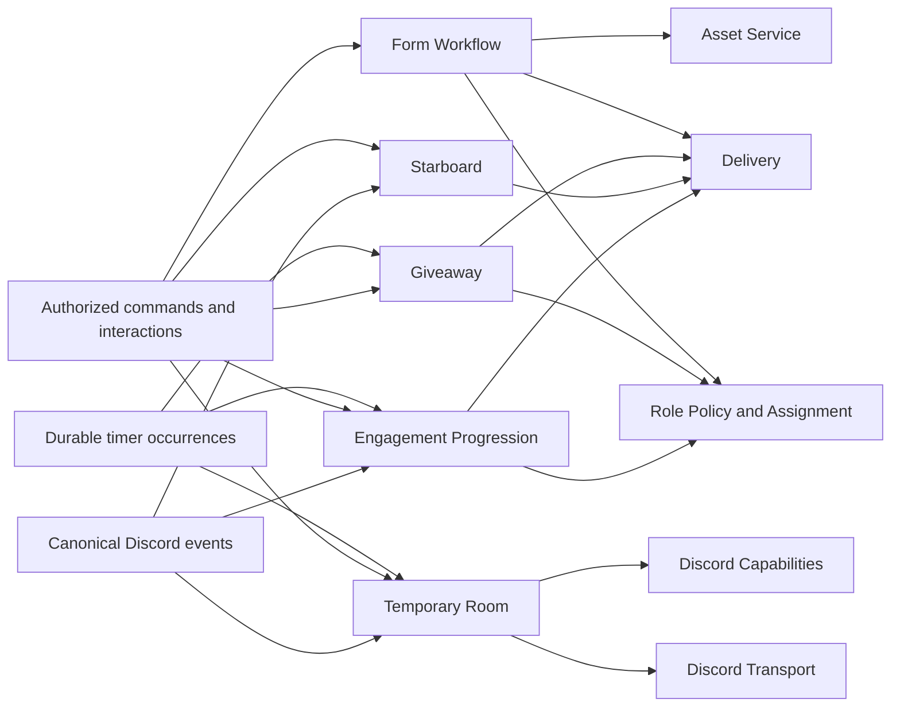
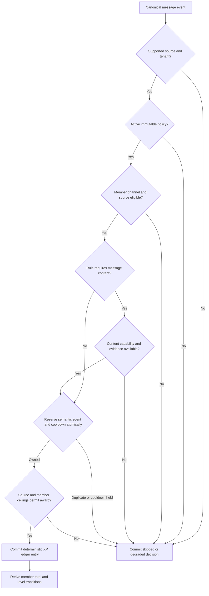
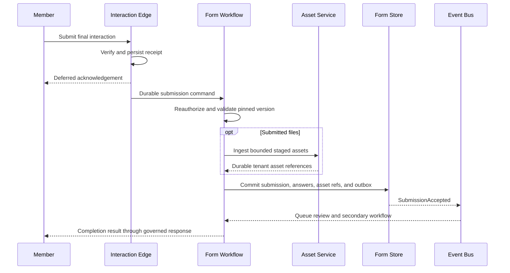

# Tobot Architecture — Community Experiences

[Architecture index](README.md) · [Previous](17-roles-and-access.md) · [Next](19-economy.md)

## 29. Community experiences product specification

### 29.1 Product surfaces and service ownership

Community experiences are five independently deployable bounded contexts, not one shared Community service:

| Product surface | Owning service | Primary aggregate | External effects |
|---|---|---|---|
| Levels, text XP, voice XP, rewards, and leaderboards | Engagement Progression Service | Member Progression | Role requests and Delivery intents |
| Reaction-curated message boards | Starboard Service | Starboard Source Aggregate | Delivery create, edit, and delete intents |
| Timed entry, winner selection, reroll, and prizes | Giveaway Service | Giveaway | Role requests and Delivery intents |
| Versioned questionnaires, submissions, review, and export | Form Workflow Service | Form and Form Submission | Asset ingestion, role requests, and Delivery intents |
| Join-to-create rooms, controls, access, and cleanup | Temporary Room Service | Temporary Room | Typed channel, overwrite, move, and invite operations |

The services share canonical identities, authorization, timers, Delivery, Asset, Role Policy and Assignment, Discord Capabilities, Discord Transport, and telemetry contracts. They do not share writable product tables, SDK clients, process-local authority, or a generic cross-domain repository.

### 29.2 Shared command, authorization, and interaction contract

Every configuration command carries tenant, actor, actor authorization context, expected aggregate version, idempotency key, correlation identity, and requested change. Publication creates an immutable revision; editing creates a new draft or revision rather than mutating history.

Every Discord interaction is handled in two phases:

1. Interaction Edge validates signature, freshness, tenant routing, installation identity, and basic payload shape.
2. It atomically records an interaction receipt and domain command, then sends an immediate or deferred acknowledgement within the provider deadline.
3. The owning service reloads authoritative policy, actor or member context, aggregate version, and eligibility.
4. The service commits the decision and outbox facts independently from the interaction token.
5. Optional follow-up uses Delivery or the governed interaction-response adapter while the token remains valid; expiration does not reverse a committed domain result.

Component routing data identifies a product, aggregate, revision, action, and optional mapping through an opaque bounded token. The token never embeds trusted permissions, eligibility, prize state, answer content, or ownership claims.

### 29.3 Shared eligibility decision model

Progression sources, giveaway entries, form access, and room creation use the same conceptual eligibility result while retaining domain-specific policy:

- `Eligible`: all required facts are present and the action may proceed.
- `Ineligible`: a durable rule proves denial and supplies a safe user-facing reason class.
- `Unavailable`: a required dependency or capability cannot currently establish the answer.
- `AlreadySatisfied`: the semantic request was previously accepted or its uniqueness condition is already met.

Eligibility inputs are immutable identifiers or versioned snapshots: membership, role relations, channel or category, account and membership age where permitted, bot or webhook status, screening state, active sanctions, domain balance or level, per-member limits, and policy exemptions. Missing facts never default to eligible for a destructive or prize-bearing action.

The public response reveals only the minimum safe reason. Internal decision records retain the exact rule identifiers, revision, evidence freshness, and normalized result without copying entire member profiles.

### 29.4 Progression policy aggregate

A progression policy revision defines:

- Enabled source classes: text message, eligible voice time, trusted administrative adjustment, and explicitly admitted future sources.
- Channel, category, role, member, bot, webhook, and application-command inclusion or exclusion rules.
- Award function, minimum and maximum award, cooldown window, daily or rolling ceilings, and source-specific multipliers.
- Content-dependent rules and the exact degraded behavior when Message Content is unavailable.
- Voice eligibility, minimum segment, idle or deafened treatment, solo-channel behavior, stage behavior, reconnect grace, and maximum recoverable gap.
- Level curve, maximum level if any, prestige or reset semantics if admitted, and reward definitions.
- Leaderboard windows, tie ordering, privacy exclusions, page size, refresh cadence, and publication destination.
- Announcement definition, destination, mention policy, and suppression rules.
- Retention, adjustment authority, anomaly thresholds, and operational kill-switch behavior.

The policy validator rejects negative awards from untrusted sources, unbounded multipliers, ambiguous channel precedence, rewards targeting prohibited roles, and content-dependent modes without an explicit capability behavior.

### 29.5 Text XP decision procedure

One source event produces one ledger decision, including zero-award and skipped outcomes needed to explain deduplication. If the configured amount is a range, the selected value is deterministic for the source identity and policy revision or is committed exactly once inside the decision transaction. Consumer retries, deployment changes, and event reordering therefore cannot change the amount.

Cooldown reservation is atomic across replicas and scoped by tenant, member, source class, and configured policy key. Cooldown caches may accelerate negative checks but do not own the reservation. A message edit does not earn new XP unless a future source type explicitly defines that semantic event.

### 29.6 Voice XP session accounting

Voice XP is based on eligible elapsed segments, not periodic process memory ticks. A member voice-state transition opens, changes, or closes a durable session. Each eligibility boundary closes the previous segment and starts a new segment under the same pinned policy revision where permitted.

Eligible-time calculation MUST:

- Use a monotonic duration observation inside a worker while persisting wall-clock boundaries for recovery.
- Prevent overlapping sessions for one tenant and member.
- Exclude duration before the first observed eligible state and after the last durable boundary.
- Apply reconnect grace only when both endpoints and intervening evidence satisfy the published policy.
- Cap one recovered gap and one session duration so downtime cannot create an unbounded award.
- Treat mute, deaf, self-stream, self-video, stage audience, alone status, and bot presence only as explicitly configured signals.
- Commit segment award keys independently so replay cannot double count a session.

An unavailable voice-state stream marks coverage degraded. The service does not infer presence from message activity, cached channel membership, or later channel state.

### 29.7 Level projection and reward occurrence

Member total XP is derived from the append-only ledger and may be cached as an optimistic, versioned projection. The level function is monotonic for ordinary positive awards. Administrative negative adjustments may lower a projection only when the published policy defines downgrade semantics.

For every crossed level, the transaction creates a unique level-transition fact and zero or more reward occurrences. Skipping multiple levels in one award evaluates every crossed boundary in deterministic order. A reward occurrence records member, level transition, reward definition, policy revision, desired effect, and idempotency key.

Role rewards are desired-state requests to Role Policy and Assignment. Message rewards are Delivery intents. Reward failure never rolls back XP or the level transition. Reconciliation can retry an eligible occurrence, mark a dependency blocked, or acknowledge a terminal failure; it cannot invent another transition.

### 29.8 Administrative XP adjustments

An adjustment requires dedicated authority, target, signed amount, reason, idempotency key, and expected member-progression version. The service commits an append-only adjustment ledger entry; it never edits or deletes prior XP facts.

Preview reports the expected total, level delta, reward implications, policy revision, and any ceiling or downgrade behavior. Bulk adjustments create a bounded parent operation with independent per-member results. Import is not a privileged database write and must use the same validation and audit path.

Correction of an erroneous adjustment is another compensating entry linked to the original. Redaction may remove free-form reason content according to privacy policy while retaining amount, actor identity class, timestamps, linkage, and integrity facts.

### 29.9 Leaderboards

A leaderboard definition pins source scope, time window, ranking measure, minimum participation, exclusions, tie rule, maximum visible rank, refresh cadence, and privacy mode. All-time rankings may use cumulative projections; rolling windows derive from ledger entries within explicit event-time boundaries.

Refresh uses a fenced occurrence and produces an immutable snapshot. The read API pages that snapshot with an opaque cursor and returns its creation time and source watermark. Equal scores use a stable declared tie rule; arbitrary database row order is forbidden.

Member opt-out or tenant privacy policy removes the member from public projections without deleting required accounting history. Published leaderboard messages are ordinary Delivery projections and may lag the authoritative snapshot with visible health state.

### 29.10 Progression reconciliation and anti-abuse behavior

Progression reconciliation compares ledger-derived totals, cached member projections, reward occurrences, open voice sessions, and leaderboard watermarks. It is bounded by tenant, member range, source time range, and page checkpoint. It may rebuild projections or enqueue missing owned rewards but never synthesize absent source events.

Abuse signals include improbable source frequency, repeated cooldown contention, voice reconnect loops, channel cycling, coordinated low-value traffic, and adjustment anomalies. Signals are operational evidence, not automatic punishment. Any moderation action requires a separately published Auto Moderation or Security policy and the normal Moderation Case path.

### 29.11 Starboard policy aggregate

A starboard policy revision defines source channels or categories, destination, accepted emoji identities, threshold, self-reaction rule, bot and webhook contributor rule, author exclusions, NSFW compatibility, content rendering mode, attachment policy, source-deletion policy, projection-deletion policy, edit coalescing, and reconciliation budget.

One source message may belong to multiple distinct boards when explicitly configured. Within one board, a contributor counts at most once even if they add several accepted reactions. Emoji identity distinguishes Unicode representation from provider emoji identifier and does not rely only on display name.

The validator rejects source and destination combinations that violate visibility or age restrictions, destinations without required capability, unsafe mention behavior, content modes unavailable under current intents, and configurations whose reaction or message effects exceed current provider limits.

### 29.12 Starboard contribution semantics

Reaction add and remove events update a durable contribution relation keyed by board, source message, contributor, and accepted reaction. A contributor is active when at least one eligible accepted reaction remains. Threshold count is the number of active unique contributors, not the number of reactions.

Self-reaction, bot, webhook, blocked-member, missing-membership, and excluded-role rules are evaluated from current-enough authoritative facts. If eligibility cannot be established, the contribution enters a pending or excluded state according to policy; it does not silently inflate the count.

Each mutation increments the source aggregate version only when effective contributor state changes. Duplicate adds, duplicate removes, and out-of-order events converge through stored reaction identities and bounded reconciliation.

### 29.13 Starboard projection lifecycle

Crossing upward through the threshold requests one board-message projection. Changes above threshold coalesce into edits pinned to the newest aggregate version. Falling below threshold follows one published behavior: preserve with updated count, suppress presentation, or delete the service-owned projection.

The projection contains only allowed author attribution, timestamp, source link, channel reference, count, and content or assets available under policy. It suppresses all unintended mentions. Source edits may request a new projection revision when the source content is available; otherwise only metadata is updated.

The service records source-to-board binding, last requested aggregate version, last confirmed version, provider message identity, and each effect outcome. It reports published only after the required effect is confirmed.

### 29.14 Starboard deletion, repair, and privacy

- Source deletion tombstones the source aggregate and applies the configured board projection behavior.
- Board-message deletion marks the binding orphaned; recreation requires policy authorization and current threshold eligibility.
- Destination deletion or lost permission blocks new projections and exposes every affected binding without repeated invalid requests.
- A reaction-event gap triggers bounded fetch by specific source message. The repair process never enumerates an unbounded channel history or refetches every reaction user for every event.
- Content removed by a user or retention policy is removed from future projections and retained records according to the content privacy class; counts and integrity metadata may remain when permitted.
- Manual exclusion and restoration are audited aggregate commands, not direct message edits.

### 29.15 Giveaway policy and lifecycle

A giveaway revision defines title and description references, entry opening and closing time, destination, entry transport, maximum entrants if any, eligibility revision, winner count, duplicate and withdrawal policy, prize definitions, notification policy, reroll rules, retention, and manager authorization policy.

The lifecycle is `Draft`, `Scheduled`, `Open`, `Closing`, `Closed`, `PartiallyFulfilled`, `Fulfilled`, or `Cancelled`. `Closing` freezes the admitted-entry boundary, materializes eligibility, commits the entrant snapshot, and performs the draw. Cancellation is permitted only by policy and never erases entries or completed draw history.

Schedule occurrences and manual close commands compete through one expected lifecycle version and fenced close generation. There is no implicit reopen after closing and no background worker may extend time without a new authorized revision before the close boundary.

### 29.16 Giveaway entry and eligibility

Entry interaction validates the signed member, guild membership, active giveaway revision, server-time boundary, unique-entry rule, and current eligibility. Eligibility may include allowlisted or blocked roles, minimum account or membership age, screening completion, level threshold obtained from Engagement Progression, and active sanction exclusions obtained through an admitted authorization projection.

An accepted entry persists before success is reported. A repeated interaction returns the existing entry state. Withdrawal, when enabled, is a versioned state change before the close boundary rather than deletion. The service records normalized rejection reasons without retaining unrelated profile data.

Eligibility that can change before close declares one of two modes:

- `Entry-time`: acceptance is final unless fraud or explicit disqualification policy applies.
- `Close-time`: entry is provisional and every entrant is reevaluated against the pinned eligibility revision during snapshot creation.

The chosen mode is disclosed to participants and cannot change after opening.

### 29.17 Entrant snapshot and winner selection

Closing records an exact event-time boundary and pages all entries through a consistent snapshot. Each snapshot member records entry identity, eligibility result, normalized weight if admitted, and exclusion reason class. Snapshot completion includes count, page checkpoints, integrity digest, and eligibility revision.

Winner selection begins only after snapshot completeness is confirmed and secure randomness is healthy. Sampling is without replacement. The algorithm treats all eligible entries equally unless the published policy explicitly enables transparent bounded weighting. Requested winner count greater than eligible count produces the declared reduced-winner or blocked-close behavior; it never duplicates a winner.

The draw transaction commits draw generation, snapshot identity, selection procedure version, randomness receipt or commitment metadata sufficient for audit without exposing secret entropy, ordered winners, and outbox events. A crash before commit has no winner; a crash after commit resumes the same result.

### 29.18 Reroll and disqualification

Reroll is a new authorized draw generation linked to the original. It requires reason, manager authority, expected giveaway version, selection scope, and explicit treatment of previous winners. Earlier results remain immutable and visible to authorized audit.

A reroll may replace specified winner slots or select additional winners. It uses the original entrant snapshot unless published rules permit a separately audited eligibility recheck. Prior winners, disqualified entries, and newly excluded identities are represented explicitly in the new generation.

Disqualification never deletes the original entry or draw. If it occurs before close, snapshot rules handle it. If it occurs after draw, the fulfillment state is stopped where safe and an authorized reroll may follow. The platform never redraws automatically merely because a notification, role assignment, or prize operation failed.

### 29.19 Prize fulfillment and announcement

Each prize definition declares a fulfillment owner and receipt contract:

- A Discord role prize is a desired-state request to Role Policy and Assignment.
- A platform-owned entitlement is requested from its future owning bounded context, not implemented inside Giveaway Service.
- A manually delivered or external prize creates an operator task and may be marked fulfilled only with an authorized receipt.
- Cash, purchasable value, payment, wagering, and regulated promotion behavior are outside this specification until legal, payments, age, geography, and platform-policy requirements are independently defined.

Winner announcement, direct notice, role assignment, and each prize fulfillment are separate idempotent occurrences. Their failure does not alter the draw. Notification fallback follows tenant policy, remains mention-safe, and never exposes private eligibility attributes.

Giveaway completion distinguishes `drawn`, `announced`, `partially fulfilled`, and `fulfilled`. A dashboard must not compress those states into a single successful label.

### 29.20 Giveaway recovery and deletion behavior

- Deleting the announcement message does not delete the giveaway; it orphans the projection and offers authorized recreation.
- Deleting the destination blocks further public effects while entry and draw state remain authoritative.
- Deleting or invalidating a prize role blocks that fulfillment and consumes the normal role dependency workflow; it never triggers another draw.
- A timer outage applies the published close misfire rule. An overdue open giveaway closes from its original boundary or requires operator review; it does not silently admit entries until worker recovery. Close and start dues are Durable Timer registrations; lost wake-ups are recovered by the platform due-row sweep.
- A cancellation after entries exist retains minimum audit facts and applies the published participant notification policy.
- Retention may pseudonymize entrant and winner identities after fulfillment and dispute windows while preserving aggregate counts and draw integrity facts.

### 29.21 Form definition and publication

A form begins as a mutable draft. Publication validates and freezes a `Form Version` containing title, description, access policy, submission window, response limit, respondent uniqueness, anonymity disclosure, review mode, questions, conditional navigation, completion message, secondary effects, retention, and export policy.

Question identity is stable across the version and answer order is explicit. Supported conceptual question types are short text, long text, single choice, multiple choice, confirmation, numeric value, date or time value, member or role reference, channel reference, and file evidence. Publication maps only currently supported types to Discord interaction components. A type that cannot fit a modal is collected through an authorized multi-step interaction session or is rejected for the Discord surface.

Validation rules include required state, length or range, option membership, selection cardinality, accepted asset media and size, normalization, and safe error text. Regex or other advanced validation is bounded for time and input length. Published forms cannot execute arbitrary scripts or fetch respondent-supplied URLs.

### 29.22 Form interaction session

Opening a form creates a short-lived session pinned to tenant, member, form version, launch interaction, current step, and expiry. It enforces access before revealing restricted questions. Multi-step state is stored durably or in an encrypted bounded session store according to whether losing a partial response is acceptable under the published policy.

Session transitions use an expected session version and one-time action token. Back, next, cancel, and submit cannot be replayed against another member, form, version, or step. Expiration deletes uncommitted sensitive answers according to policy and returns a new-start response rather than attempting to reuse an expired interaction token.

Only one active session per declared uniqueness scope is authoritative. Multiple devices may resume the same permitted session or receive a conflict; they cannot produce duplicate terminal submissions.

### 29.23 Submission transaction

The final commit contains one submission identity, form version, respondent scope where retained, normalized answers, asset references, privacy classifications, submitted time, review state, and outbox fact. It occurs before success is claimed. Answers retain their question identity and type; the service does not flatten all values into display text as authoritative storage.

Limits are atomically reserved for global response count, per-member uniqueness, and applicable rate quota. A submission arriving after the server-side close boundary is rejected even if the member opened a modal earlier, unless the published policy explicitly reserves a submission slot at session creation.

### 29.24 Attachments and sensitive response data

Submitted files pass through Asset Service validation, malware scanning where configured, media decoding limits, integrity hashing, tenant ownership, encryption policy, and lifecycle controls. The form stores only the durable asset identity and safe metadata. Preview and download require response-level authorization and are access-audited.

Question-level privacy classes determine reviewer visibility, export eligibility, notification rendering, retention, search indexing, and redaction. Secrets, credentials, government identifiers, payment details, and other prohibited data classes are rejected or require a separately approved product policy; free-text instructions alone are not an adequate control.

Respondent identity is encrypted or pseudonymized where policy requires. Reviewer anonymity removes identity from normal response queries and rendered notifications. A narrowly authorized abuse or compliance workflow may resolve the system identity only when the disclosure explicitly says that identity is retained for that purpose.

### 29.25 Review workflow

A form version selects no review, single decision, or staged review. Review states are `Pending`, optional `InReview`, `Accepted`, `Rejected`, `NeedsChanges`, and `Withdrawn` where allowed. Each transition defines authorized reviewer roles or capabilities, required reason policy, respondent visibility, and terminal behavior.

Review commands carry expected submission version. The winning transaction appends a review event and creates each secondary-effect occurrence. Concurrent stale decisions fail without overwriting the committed result. Reviewer notes have their own privacy and retention policy and are not silently included in respondent notices or exports.

`NeedsChanges` creates a new response cycle under explicit rules; it never mutates the submitted answer record. Resubmission links a new revision or submission attempt to the prior one so reviewers can compare history without destroying evidence.

### 29.26 Form secondary effects and notifications

Accepted-role assignment, reviewer-channel notification, respondent completion, review result, and escalation are independent occurrences with unique semantic keys. A configured accepted role is requested through Role Policy and Assignment only after the matching terminal review event. Notification failure never changes submission or review state.

Response notifications render only allowlisted questions and privacy classes. Long values are truncated for presentation with an authorized link to the full response; they are not split into uncontrolled message storms. Mention policy is explicit and previews suppress broad mentions. Dashboard and export rendering treat submitted answers as untrusted text (DR-030).

If a mapped role, channel, message definition, or reviewer group becomes invalid, the form version becomes degraded for that effect. New submissions may continue only when publication policy declares the dependency optional; otherwise admission is paused with a clear health reason.

### 29.27 Form export, search, and retention

Export requires form-scoped authority, immutable query filters, selected field classes, time window, identity mode, reason where required, and maximum row and byte limits. It executes asynchronously against an authorized snapshot and produces a short-lived encrypted artifact reference. CSV cells and filenames are neutralized against spreadsheet formula injection and unsafe control characters.

Search uses tenant-scoped indexes over explicitly searchable fields. Full-text indexing of sensitive answers is disabled by default. Pagination is cursor-based and stable under new submissions; total counts may be approximate where exact computation would create unbounded latency.

Retention is independently defined for respondent identity, answers by privacy class, attachments, review notes, operational metadata, exports, and audit facts. Deletion workflows are checkpointed and produce completion evidence. Legal or dispute holds are explicit authorized states, not undeclared indefinite retention.

### 29.28 Temporary-room generator aggregate

A generator revision defines:

- Trigger voice channel and optional destination category.
- `CreateNew` or `LinkExisting` ownership mode.
- Voice channel naming template, bitrate or user-limit policy within current provider bounds, region policy, and initial status where supported.
- Optional companion text-channel or thread behavior and its retention relationship.
- Default visibility, connect, speak, send, history, stream, and invite policy.
- Owner, moderator, trusted-role, blocked-role, and bot behavior.
- Per-member, per-generator, and per-guild active-room limits.
- Empty grace period, abandoned-creation deadline, maximum lifetime, and cleanup behavior.
- Allowed controls, notification definitions, audit policy, and reconciliation cadence.

Publication preflights bot permissions, hierarchy-independent channel permissions, category visibility, channel capacity, overwrite feasibility, and every referenced role or channel. A generator may remain published but degraded after an external dependency change; creation is blocked until required capability returns.

### 29.29 Room creation claim and saga

When a member joins the trigger channel, Temporary Room Service atomically claims the tuple of tenant, generator revision, member, and trigger epoch. If an active owned room already exists under policy, the service may move the member there or return unchanged; it does not create a duplicate.

The creation operation persists its ordered plan before provider mutation. Typical steps are voice channel creation, provider identity binding, policy-owned overwrite application, optional companion resource creation, member move, control-message publication, and activation. Every step has independent intent, attempt, receipt, and compensation eligibility.

Channel creation is outcome-uncertain when the response is lost. Reconciliation uses operation markers available in owned metadata, canonical channel events, creation time bounds, category, and bounded audit evidence; it never blindly creates another channel. The room becomes `Active` only after every required resource and binding is confirmed.

If required creation fails, compensation proceeds in reverse dependency order and deletes only resources proven created by that operation and unchanged outside its owned fields. A failed member move does not necessarily delete an otherwise valid room when published policy allows the member to join manually.

### 29.30 Room access-control model

Room permissions are desired claims compiled into the smallest policy-owned overwrite set. Claims identify principal, source, allowed control class, expiry if any, and room version. Compilation preserves unrelated overwrites and denies, validates that the bot can grant each permission, and observes current overwrite capacity.

The owner claim does not imply Discord administration. It grants only configured room controls. Moderator claims derive from current tenant authorization, not from user-editable room state. Blocked identities cannot be granted by an owner unless policy explicitly authorizes an override class.

Access changes are optimistic operations: load live capability and current overwrite fingerprint, authorize actor and target, commit desired claim, issue a typed mutation, and record confirmed or conflicting outcome. Multi-overwrite changes are not claimed atomic; partial state remains visible and repairable.

### 29.31 Room control actions

Supported actions may include rename, user-limit change, lock or unlock, hide or reveal, permit or deny a member or role, transfer ownership, claim an ownerless room, move a consenting or authorized member, disconnect a member, create a bounded invite, update supported voice status, and request early deletion.

Each action definition declares eligible actors, target restrictions, cooldown, current-room requirement, expected room version, provider permissions, owned fields, audit reason, and compensation behavior. The owning service rejects arbitrary permission bitsets, raw channel payloads, or unbounded invite parameters from clients.

Member movement and disconnection require current guild and channel context plus provider capability. A room owner cannot moderate members outside the room through these controls. Actions with moderation semantics beyond room access use Moderation Cases rather than being reimplemented here.

### 29.32 Ownership, transfer, and claim

Initial ownership belongs to the trigger member when policy permits. Ownership is a durable room relation, not inferred permanently from who is currently first in the channel. When the owner leaves, policy may retain ownership through a grace interval, transfer to an eligible present member, mark the room ownerless, or begin cleanup.

Transfer requires current owner or moderator authority, target eligibility, expected room version, and target acceptance when configured. Claim requires ownerless state and deterministic winner selection if several claims race; one optimistic update succeeds.

Owner departure, guild departure, sanction, or eligibility loss invalidates control tokens immediately through the next authorization read. Sticky ownership beyond a voice session must be explicitly configured and expires no later than room cleanup.

### 29.33 Empty detection, timers, and cleanup

An active room becomes empty only from canonical voice-state projection after excluding bots or ignored identities according to policy. Entering empty state increments a timer generation and schedules one durable occurrence with Schedule's wake-up capability. Any eligible rejoin changes room version and cancels or invalidates that generation.

At due time, the worker reloads live room membership, aggregate version, ownership mode, resource bindings, and provider capability. It skips stale occurrences and begins a fenced cleanup operation only if the room is still eligible.

Cleanup disables new controls, removes optional service-owned companion resources in dependency order, deletes the service-created voice channel, and tombstones bindings. Partial or uncertain deletion is reconciled before retry. `LinkExisting` mode removes only temporary policy-owned state and never deletes the linked channel.

Maximum lifetime and abandoned-creation timers use the same generation-bound mechanism. Misfire behavior is explicit: execute when still eligible, skip, or require review; downtime never causes simultaneous uncontrolled deletion.

### 29.34 Room reconciliation

Reconciliation is bounded by generator, channel page, room state, and provider budget. It detects:

- Active aggregates whose created channel no longer exists.
- Owned channels with missing or incomplete aggregate binding.
- Duplicate channels associated with one creation claim.
- Drift in policy-owned overwrites or mutable fields.
- Externally changed fields that conflict with the operation precondition.
- Empty rooms without a valid timer and timers whose room is occupied.
- Expired control messages, missing companion resources, and unreachable destinations.

Safe repair reconstructs bindings, reapplies only policy-owned desired fields, schedules a missing timer, or tombstones absent resources. Ambiguous ownership, destructive cleanup, duplicate channel selection, and administrator conflicts require operator review.

### 29.35 Boundary with Voice Control and Voice Media

Temporary Room Service manages Discord guild channel resources and voice-state-driven product lifecycle. Voice Control owns bot connection admission and session coordination. Voice Media owns WebSocket, UDP, encryption, codecs, jitter, audio, and live media resources.

A temporary room can exist without the bot joining it. If a future feature requests bot voice presence, it emits a typed Voice Control command after the room is active. Room cleanup coordinates with Voice Control to leave or reject deletion while an owned media session is active according to policy; it never manipulates media internals.

### 29.36 Community operational procedures

**Publishing a progression policy:**

1. Validate sources, capability dependencies, deterministic award function, cooldowns, ceilings, voice rules, level curve, rewards, privacy, and leaderboard bounds.
2. Preview estimated event volume, required intents, role dependencies, and degraded modes.
3. Commit the immutable revision and compiled-snapshot invalidation atomically.
4. Warm evaluators and report snapshot health before enabling awards.
5. Reconciliation begins only through a separately authorized bounded operation.

**Publishing or repairing a starboard:**

1. Validate source scope, unique-contributor semantics, destination, content policy, emoji identities, threshold, and provider capability.
2. Commit the immutable revision and health dependencies.
3. Process new contribution events incrementally.
4. For backfill or repair, define a bounded source-message or time scope and provider request budget.
5. Persist checkpoints and leave unresolved bindings degraded rather than reporting success.

**Closing a giveaway:**

1. Acquire the fenced close generation and record the immutable entry boundary.
2. Materialize and verify the entrant snapshot with the pinned eligibility revision.
3. Confirm secure-randomness health and commit one draw.
4. Publish the immutable result and independently enqueue announcement and prize occurrences.
5. Track partial fulfillment until each prize is confirmed, terminally failed, or acknowledged.

**Publishing a form:**

1. Validate component mapping, interaction steps, access, limits, identity disclosure, privacy classes, assets, review states, secondary effects, exports, and retention.
2. Preflight role, channel, message-definition, Asset, and current Discord component dependencies.
3. Commit one immutable version and publication event.
4. Make new sessions resolve only the active version while existing sessions follow the declared supersession rule.
5. Expose degraded dependencies and pause admission when a required one is unhealthy.

**Publishing a room generator:**

1. Validate ownership mode, capacity, names, fields, overwrites, controls, timers, compensation, and reconciliation scope.
2. Preflight trigger, category, roles, channel capacity, bot permissions, and current provider limits.
3. Commit one immutable revision and enable creation only after capability health passes.
4. Observe trigger joins through durable canonical events and creation claims.
5. Treat partial rooms as operations requiring repair, not as active channels.

### 29.37 Community-specific consistency rules

- Policy revision publication and outbox publication are atomic in every community service.
- XP source decision, ledger entry, member projection version, transition occurrence, and domain outbox are committed within the owning service's local transaction boundary.
- Voice state from Discord and durable progression state cannot share a transaction; uncertainty becomes an excluded or reconcilable segment.
- Starboard contribution and aggregate version update are atomic; board-message projection is asynchronous and explicitly versioned.
- Giveaway entry acceptance and entry outbox publication are atomic. Entry storage and interaction follow-up are not one transaction, so durable acceptance remains authoritative.
- Giveaway snapshot and draw may use separate transactions, but draw cannot reference an incomplete snapshot and a completed draw is never mutated by fulfillment.
- Form asset storage and form submission cannot share a database transaction. Required assets need durable receipts before submission commit; orphan staged assets expire through Asset policy.
- Form review decision and secondary-effect occurrences are atomic; provider effects complete asynchronously.
- Temporary-room desired state and Discord resources cannot share a transaction. Every provider step therefore has durable intent, explicit uncertainty, ownership proof, and reconciliation.
- Cross-service role, delivery, asset, moderation, progression-eligibility, and voice-control effects communicate through versioned contracts and cannot enlist in a distributed transaction.

### 29.38 Community operational kill switches

Independent authenticated, revisioned, and audited controls MUST exist for:

- Text XP admission, voice XP admission, reward dispatch, level announcements, leaderboard refresh, and administrative adjustments.
- Starboard event admission, new projection creation, projection edits, projection deletion, and reconciliation.
- Giveaway creation, new entry admission, scheduled close, manual close, draw, reroll, announcements, and each prize fulfillment class.
- Form publication, new session admission, final submission, asset ingestion, review, accepted-role effects, notifications, exports, and retention deletion.
- Temporary-room creation, member move, companion resource creation, owner controls, invites, access mutations, automatic transfer, cleanup, and reconciliation.

Disabling new XP does not discard already accepted ledger work or required reward reconciliation. Disabling giveaway draw leaves a due giveaway in `CloseBlocked`, never open indefinitely without a visible state. Disabling form notifications does not reject otherwise valid submissions. Disabling room creation preserves cleanup and safety controls for existing owned rooms unless a separate freeze explicitly prevents all mutations.

No community kill switch may stop interaction acknowledgement, Gateway heartbeats, durable ingestion needed for recovery, transport rate-limit governance, timer visibility, privacy deletion, or operator inspection of partial and uncertain work.
