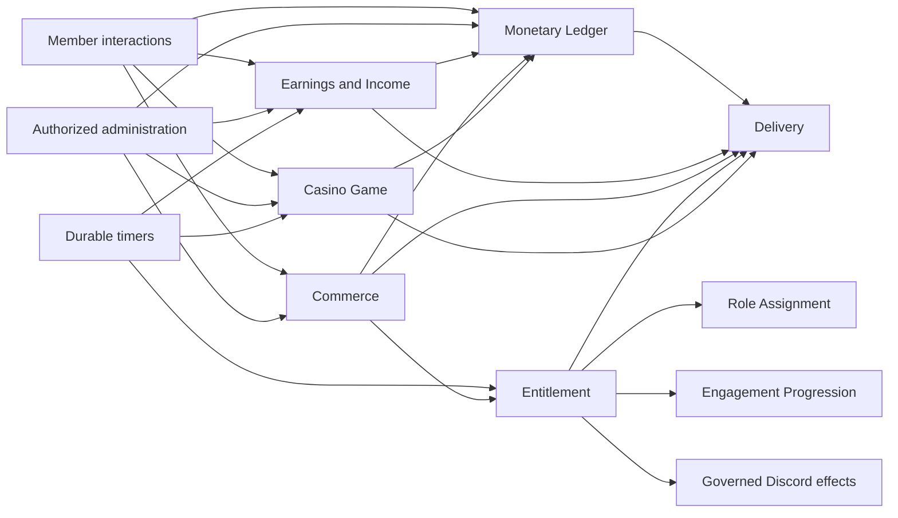

# Tobot Architecture — Virtual Economy and Commerce

[Architecture index](README.md) · [Previous](18-community.md) · [Next](20-support.md)

## 30. Virtual economy and commerce product specification

### 30.1 Product surfaces and ownership

The economy product is a collaboration of five bounded contexts:

| Surface | Authoritative owner | Main responsibility |
|---|---|---|
| Currency, wallet, bank, transfers, adjustments, holds, and balances | Monetary Ledger Service | Virtual-value conservation and account consistency |
| Daily, weekly, monthly, salary, job, crime, robbery, and activity income | Earnings and Income Service | Eligibility, cooldown, formula, schedule, and decision |
| Shop catalog, stock, purchase limits, orders, payment, and refunds | Commerce Service | Offer and order lifecycle |
| Role, private-channel, boost, and manual benefits | Entitlement Service | Benefit activation, expiry, reversal, and reconciliation |
| Coinflip, roulette, slots, and blackjack | Casino Game Service | Durable play, randomness, wager state, and outcome |

No product surface owns both an economic decision and the monetary journal used to settle it. Earnings, Commerce, and Casino Game request monetary operations; Monetary Ledger independently validates currency, accounts, available funds, ceilings, idempotency, and posting balance.

### 30.2 Virtual-currency boundary

The economy represents tenant-local, non-redeemable virtual units. Currency identity is a stable internal identifier. Name, symbol, emoji, uploaded icon, and localization are presentation metadata and may change without converting or duplicating balances.

The specification excludes:

- Fiat money, cryptocurrency, stored value, gift cards, cash-out, redemption, or external exchange.
- Purchase of virtual units or casino stakes with real-world consideration.
- Interest, lending, credit, debt, negative balances, securities, or investment behavior.
- Cross-tenant balances or transfers.
- User-created currencies, external marketplaces, and tradable token ownership.

Adding any excluded behavior requires a separate architecture covering legal classification, payments, fraud, age and geography, custody, accounting, dispute, refund, tax, sanctions, and platform-policy obligations. A configuration flag cannot expand this boundary.

### 30.3 Currency policy aggregate

A currency policy revision defines:

- Stable currency identity and presentation references.
- Enabled account classes and whether wallet and bank are visible, transferable, or spendable.
- One-time starting grant and the account receiving it.
- Wallet, bank, transaction, daily-flow, and tenant issuance ceilings.
- Deposit, withdrawal, transfer, tax, adjustment, freeze, and leaderboard policies.
- Payment funding order, normally wallet only, bank only, or wallet then bank.
- Tax destination: treasury account, issuance sink, or another explicit system account.
- Account creation, member departure, rejoin, retention, and pseudonymization behavior.
- Administrative capabilities, approval requirements, reason policy, and high-value thresholds.
- Public receipt, private receipt, Activity Log, and audit-query behavior.
- Kill switches and degraded read or write modes.

Publication validates that account ceilings fit the integer domain, starting grants have an issuance source, tax policy has a destination, every allowed debit has sufficient account scope, and display assets are valid tenant assets. Changing a ceiling below an existing balance does not truncate money; it blocks further credits to that account until an explicit policy or adjustment resolves the excess.

### 30.4 Account model

Each member may have one wallet account and one bank account per tenant currency. System accounts represent issuance, sink, tax treasury, casino house, store revenue, manual correction, and other admitted balancing purposes. System-account identity and allowed transaction types are policy-controlled.

Account state is `Active`, `FrozenCredits`, `FrozenDebits`, `FrozenAll`, `Closed`, or `Restricted`. Freeze affects new operations only and never rewrites journal history. Closure requires zero available balance, no active holds, and a configured destination or retained dormant state for any remaining value.

The authoritative account projection contains current balance, held balance, available balance, journal watermark, and optimistic version. Current balance includes posted transactions. Held balance includes active reservations. Available balance is current minus held and is the only amount eligible for a new debit.

Account creation and the starting grant are one idempotent workflow. Two concurrent first-use commands may create only one account set and one starting transaction for the stable onboarding-grant policy identity. Publishing or activating another revision does not reset that identity or grant again.

### 30.5 Double-entry journal semantics

Every monetary mutation is one immutable transaction containing balanced debit and credit posting lines. Amounts are positive integers in minor virtual units; direction is expressed by posting side, never by negative amount fields.

The journal recognizes at least these transaction classes:

| Class | Required economic shape |
|---|---|
| Starting grant | Issuance source to member account |
| Deposit or withdrawal | Member wallet to member bank, or inverse |
| Member transfer | Sender wallet to recipient wallet plus optional explicit tax leg |
| Income or salary | Declared issuance or employer system account to member wallet |
| Crime fine | Member wallet to configured sink or treasury |
| Robbery | Victim wallet to robber wallet, or failed-robbery fine to sink |
| Purchase | One or more buyer funding accounts to configured store or sink account |
| Refund | Equal-and-opposite posting linked to captured purchase transaction |
| Wager | Player wallet hold captured into settlement transaction with declared house and payout legs |
| Adjustment | Authorized source or destination system account paired with target account |
| Reversal | Equal-and-opposite postings linked to one prior transaction |

Transaction, postings, balance projection changes, and outbox events commit in one local database transaction. If any posting, balance, ceiling, hold, version, or journal-balance invariant fails, none commit.

### 30.6 Numeric and rounding rules

- Balances, prices, stock, stakes, fines, rewards, taxes, and payouts use bounded integers.
- Percentage, multiplier, and probability configuration uses bounded rational or fixed-scale decimal representation, never binary floating point.
- Commercial billed amounts and AI Credits use integer minor units on their own journals (DR-016) and never enter this ledger. Guild-shop capture facts are `VirtualPayment` and MUST NOT use `CommercialPayment` (DR-065).
- Each rule declares floor, ceiling, nearest, bankers, or exact-divisibility rounding; implicit runtime-language rounding is forbidden.
- Tax is calculated from the declared gross or net base and stores base, rate, unrounded intermediate representation where needed, rounding mode, and final amount.
- A zero net transfer, zero payout, or zero fine follows an explicit policy result and is not silently converted to a positive amount.
- Arithmetic overflow and values outside configured or technical bounds reject before journal mutation.

### 30.7 Idempotency and transaction identity

Every money-bearing user interaction, administrator command, timer occurrence, purchase payment, entitlement refund, income action, and wager settlement supplies a semantic idempotency key derived from stable business identity rather than request arrival time.

An idempotency receipt pins tenant, actor or owner service, operation class, normalized request hash, result transaction or hold identity, and expiry policy. Reusing a key with the same request returns the prior result. Reusing it with different material parameters is a conflict and creates no mutation.

Discord interaction redelivery, HTTP retry, worker retry, event replay, and recovery all use the original key. A client-generated key is scoped and validated by the server; it cannot choose another tenant or forge an owning-domain identity.

### 30.8 Holds and multi-account reservations

A hold reserves available balance without posting a monetary transaction. It is used only when another durable workflow must decide capture or release later. Each hold has an owner service, source aggregate, amount, deadline, capture policy, and terminal state.

A payment reservation groups one or more holds atomically. Under `WalletThenBank`, the ledger reserves the required amount from wallet first and the exact remainder from bank in the same transaction. It either reserves the complete price or reserves nothing. The funding plan is persisted and cannot change during capture.

Capture consumes every active hold line and posts one balanced transaction under the reservation's semantic settlement key. Release terminates all active lines without journal postings. Capture and release race through the reservation version; only one terminal transition commits.

Hold expiry never assumes the owner workflow failed. The ledger asks the owner or follows the published reservation policy. Ambiguous purchase or game state moves to recovery rather than automatic release that could enable double spending.

### 30.9 Balance and account queries

Member balance returns wallet current, wallet held, wallet available, bank current, bank held, bank available, total current value, projection watermark, and currency presentation. Values hidden by policy are omitted rather than returned as zero.

Queries may use a read replica or projection only when monotonic-read policy and freshness are explicit. A mutation response returns values from the committing ledger transaction. A subsequent query with a required watermark waits within a bounded budget, routes to authoritative storage, or returns `ProjectionPending`; it never shows an older balance as the confirmed post-command result.

Transaction history is cursor-paginated by stable journal order and filtered by tenant, account, class, time, and authorized visibility. Raw internal system-account metadata and anti-abuse facts are excluded from member-visible receipts.

### 30.10 Deposit and withdrawal

Deposit moves value from the member wallet to the member bank. Withdrawal moves value from bank to wallet. Both accept a positive bounded amount or a normalized `all` instruction resolved from current available balance inside the locked transaction.

The command validates active currency, actor ownership, source available balance, destination ceiling, account state, per-command policy, and idempotency. The operation is one journal transaction with no issuance or destruction.

If destination capacity is smaller than the requested amount, the published policy either rejects the entire command or transfers the exact admissible amount for an explicit `up to available capacity` command. Silent clamping of a fixed numeric request is forbidden.

### 30.11 Member transfer and tax

A transfer validates sender and recipient membership or retained-account policy, self-transfer rule, bot exclusion, protected or blocked account state, sender available wallet funds, recipient wallet ceiling, minimum and maximum transfer, rolling flow limits, and abuse controls.

The tax policy declares rate, base, rounding, minimum or maximum tax, and destination. The sender debit, recipient credit, and tax posting balance in one transaction. The public receipt states gross debit, tax, and net recipient amount.

Accounts are locked in canonical identity order. Two opposing concurrent transfers therefore avoid application-defined lock inversion. A transfer is complete when the ledger commits; notifications are independent and cannot reverse it.

### 30.12 Administrative adjustments and account controls

Authorized operations are add, remove, set through a calculated compensating delta, freeze, unfreeze, and correction. `Set` does not overwrite a projection directly; it calculates the difference against the locked balance and posts an adjustment from or to the configured correction account.

Every adjustment requires target account, operation, amount or desired balance, reason, expected projection version, actor capability, idempotency key, and policy revision. High-value thresholds may require a second approver represented by a durable approval aggregate before posting.

Removal cannot make an account negative. Addition cannot exceed its ceiling. Correction of an incorrect adjustment creates a linked reversal or new adjustment; it does not edit the original.

Bulk adjustment is a bounded parent operation with a reviewed input snapshot, dry-run totals, maximum recipient count, per-recipient result, and aggregate issuance or sink exposure. Partial completion is explicit and resume is idempotent.

### 30.13 Wealth leaderboard

A wealth leaderboard definition selects included account classes, ranking measure, eligibility, privacy opt-out, identity presentation, maximum visible rank, tie rule, refresh cadence, and destination. System accounts, held amounts, frozen visibility, and pseudonymized accounts follow explicit policy.

The leaderboard is a rebuildable snapshot projection, not a source of balances. Stable ties use a declared secondary rule. Pagination carries the snapshot identity and source watermark so new transactions do not reshuffle an in-progress page set.

Public publication uses Delivery, suppresses unintended mentions, and reports snapshot time. Missing Discord member display data uses a safe tenant-scoped fallback without deleting the monetary account.

### 30.14 Income policy aggregate

An income-policy revision contains source rules, authorization, currency reference, destination account class, eligibility precedence, cooldown definitions, payout or loss formulas, streak behavior, role stacking, schedules, notification definitions, source ceilings, abuse controls, and retention.

Each source rule declares one action type, source identity, input requirements, deterministic or secure-random formula, rounding, minimum and maximum result, ledger transaction class, settlement deadline, and degraded behavior.

Publication rejects formulas that can overflow, create a negative debit, exceed currency or account ceilings without a declared rejection behavior, reference an inactive currency, use an unavailable role or progression dependency, or permit ambiguous stacking.

### 30.15 Fixed claims and streaks

Daily, weekly, and monthly are policy names, not assumed durations. Each claim defines either an exact elapsed duration or a civil-calendar boundary with timezone and daylight-saving behavior. The next-available time is calculated from server time and persisted occurrence state.

Daily streak policy defines continuity window, initial count, maximum count, bonus formula, rounding, reset rule, grace, and whether a rejected monetary settlement advances the streak. By default, streak and income decision commit together, while the ledger settlement follows idempotently; a terminally rejected settlement does not count as a successful claim.

Two concurrent claims for the same member and rule compete through one cooldown reservation. The winner commits decision, next availability, streak before and after, payout formula receipt, and ledger request key. The loser returns that occurrence without another roll or payout.

### 30.16 Role salaries

A salary plan pins role, mode, formula, schedule or collectable cooldown, stacking group, priority, eligibility, destination account, announcement, and policy revision.

Supported modes are:

- `Collectable`: an eligible member requests each available salary occurrence.
- `Scheduled`: a durable occurrence evaluates a bounded member snapshot and requests payouts without member interaction. The occurrence is a Durable Timer registration with Schedule; lost wake-ups are recovered by the platform due-row sweep.

Supported formulas are bounded fixed amount or percentage of an explicitly named base such as current wallet, current bank, or another admitted projection. Percentage formulas declare snapshot time, cap, rounding, and whether multiple plans compound; compounding on balances modified by the same distribution is forbidden.

Stacking policy is one of all matching, highest amount, highest priority, one per exclusive group, or a separately defined capped sum. `@everyone` is represented as an explicit tenant-wide eligibility rule rather than a special accidental role match.

Scheduled distribution records an occurrence boundary and eligible-member snapshot watermark. It pages recipients with a fenced checkpoint and one income-action key per plan, occurrence, and member. A retry never recalculates an already committed percentage base or payout.

### 30.17 Jobs and work actions

A job definition contains stable identity, name, description reference, eligibility, selection availability, payout range or formula, cooldown, success template, source ceiling, and policy revision.

Selection behavior is product policy, not inferred from list size. The revision declares direct user selection, deterministic rotation, weighted random selection, or server-selected random choice. UI adapters choose a current Discord-compatible select menu, autocomplete, or paginated interaction without changing the selection rule.

After a selection is admitted, the service commits job identity and payout result before requesting the ledger posting. Range payout uses secure randomness and records the selected value once. Presentation failure does not repeat work or generate another payout.

### 30.18 Crime actions

A crime rule declares identity, eligibility, success probability, reward range, failure fine range, fine destination, wallet-only or admitted account scope, cooldown, templates, and safety classification.

One committed randomness receipt determines success or failure and the corresponding bounded amount. On success, the ledger posts the reward. On failure, the fine request may debit no more than the configured limit and current available balance according to the published `Reject`, `CapToAvailable`, or `ZeroWhenUnavailable` policy.

Crime never creates negative balance or hidden debt. Its result is fictional virtual-economy gameplay and must be presented accordingly. Repeated loss, abuse, or interaction delivery failure does not trigger another roll.

### 30.19 Optional robbery

Robbery is a high-risk, tenant-opt-in source disabled by default. Policy defines:

- Target opt-in or opt-out behavior and protected user or role classes.
- Minimum target available wallet and maximum amount exposed.
- Success chance, steal percentage range, failed-attempt fine, rounding, and caps.
- Actor and target cooldowns, pair cooldown, daily exposure, and collusion controls.
- Whether recent membership, screening, sanctions, inactivity, or account freeze blocks participation.
- Notification privacy and whether the target receives an independent notice.

The service rejects self-targets, bots, cross-tenant identities, unavailable membership, bank funds, active holds, and protected targets. Actor and target accounts are locked canonically during the ledger transfer. The formula receipt uses the target's locked available wallet and one committed random decision.

A failed robbery fine moves actor value to the declared sink or treasury. A successful robbery moves victim value to the actor. The feature does not create or destroy value except through separately declared tax or fee legs.

### 30.20 Optional activity income

Activity income consumes admitted canonical activity facts and is distinct from Engagement Progression XP. It must not inspect arbitrary content unless the active source revision requires and is authorized for Message Content.

The policy defines event classes, channel scope, bot or webhook exclusions, semantic event uniqueness, cooldown, rolling ceiling, minimum meaningful interval, anti-farming controls, and payout formula. The source event produces one Income Action; duplicate Gateway events cannot create multiple ledger requests.

Engagement Progression may publish a bounded activity eligibility or milestone fact, but Earnings does not read progression tables. If both XP and currency use the same message event, they maintain independent ledgers and idempotency keys while sharing no writable state.

### 30.21 Income notifications and audit

Command replies show action class, gross payout or loss, resulting committed balance when available, next eligibility time, and safe policy explanation. Scheduled salary announcements may aggregate results by occurrence and never emit one uncontrolled public message per recipient.

Notification state is independent from action and monetary settlement. A settlement can be successful with notification failed. If ledger settlement remains pending, the user response states that processing is pending and does not show a fabricated balance.

Income history stores decision and settlement references, not copied journal postings. Authorized investigation joins through APIs or a query projection using correlation identity.

### 30.22 Catalog and item model

A catalog contains categories and stable items. An item draft becomes an immutable item revision at publication. The revision defines:

- Name, description definition, icon asset, category, sort order, and visibility.
- Currency, price, quantity policy, availability interval, enabled state, and stock policy.
- Eligibility and per-member, per-account, per-window, lifetime, and tenant purchase limits.
- One or more ordered reward definitions with required or optional classification.
- Payment funding policy, cancellation deadline, refund and compensation policy.
- Purchase response and staff notification definitions.

Changing price, stock semantics, eligibility, rewards, or compensation creates a new revision. Existing purchases remain pinned to their original revision. Cosmetic presentation changes may also publish a new revision so receipts remain reproducible.

### 30.23 Categories, discovery, and shop projection

Categories provide stable identity, localized presentation, order, visibility, and optional eligibility. Category hiding is not authorization; every item and purchase is reauthorized server-side.

Shop queries return an immutable catalog snapshot or cursor with current item revisions, effective stock availability, member-specific eligibility summary where cheap and safe, purchase-limit summary, and projection watermark. Expensive eligibility may be represented as `CheckedAtPurchase`.

Discord pagination is an interaction presentation over the catalog cursor. Buttons and selects carry opaque item and revision routing. A stale page may open the current offer summary but cannot purchase at an old price unless the item policy explicitly honors a still-valid quoted revision and reservation deadline.

### 30.24 Eligibility and requirements

An item revision may require or exclude:

- Current member status and screening completion.
- Allowlisted or blocked roles.
- Minimum progression level from a versioned read projection.
- Minimum current or available wallet, bank, or total balance.
- Ownership or absence of another entitlement or prior item.
- Maximum prior purchases or active grants.
- Channel, category, time-window, account-age, membership-age, or sanction state.

Balance requirements are distinct from price payment. A minimum post-purchase balance, when configured, is evaluated inside the Monetary Ledger reservation request. Role, progression, and entitlement facts carry freshness and unavailable behavior.

Eligibility is pinned in the order but revalidated at the point named by policy: admission, payment reservation, or entitlement activation. A client cannot supply proof by sending role or balance identifiers.

### 30.25 Stock and purchase limits

Stock mode is `Unlimited` or `Finite`. A finite stock bucket tracks capacity, reserved, consumed, returned, and version. Reservation uses an atomic conditional update and one semantic key. It has a bounded expiry tied to the payment workflow.

Stock is consumed exactly once after payment capture or another explicitly declared point. It is returned exactly once only when cancellation or refund policy permits. Manual database edits are forbidden; corrections are audited stock-adjustment commands with expected version and reason.

Purchase limits use durable counters or order queries keyed by member, item lineage or revision, window, and qualifying order states. Cancelling or refunding affects a limit only as explicitly defined. A high-contention limited release may use queue admission, but fairness rules and selection procedure must be published.

### 30.26 Purchase admission and payment

Purchase admission performs:

1. Validate interaction, tenant, buyer, currency, current catalog and item state.
2. Resolve the admitted item revision or reject a stale quote.
3. Evaluate eligibility and purchase limits with required freshness.
4. Reserve finite stock and create the purchase order atomically in Commerce.
5. Request one atomic Monetary Ledger payment reservation using the published funding policy.
6. If reservation fails, release stock and mark the order rejected or cancelled.
7. If reservation succeeds, capture it under the purchase settlement key.
8. After confirmed capture, mark the order paid and create reward occurrences.

The Commerce and Monetary Ledger databases cannot commit atomically. Durable order state, stock expiry, reservation owner queries, and semantic ledger keys close that gap. No reward begins from a merely requested payment.

### 30.27 Reward-line fulfillment

Each reward line declares type, parameters, required state, dependency order, entitlement owner, activation deadline, expiry, stacking, compensation, and semantic key. Lines without ordering dependency may execute concurrently under bounded per-purchase and tenant limits.

Purchase state derives as follows:

- `Paid`: capture confirmed and reward occurrences committed.
- `Fulfilling`: at least one required reward remains eligible and active work exists.
- `PartiallyFulfilled`: at least one required reward is blocked, failed, uncertain, or in compensation conflict.
- `Fulfilled`: every required reward is active or completed; optional failures are still visible. The order MAY later enter the refund process manager in §30.28; `Fulfilled` is not a sink.
- `ReconciliationRequired`: payment, stock, entitlement ownership, or refund cannot be safely resolved automatically.

The member-facing receipt lists each benefit and current outcome. It does not collapse a paid but partially fulfilled order into success.

### 30.28 Cancellation, compensation, and refund

Cancellation before payment capture releases the monetary reservation and stock reservation. After capture, refund is a process manager, including when the order is already `Fulfilled` ([05-state-models.md](05-state-models.md) §10.20, DR-007). This manager is guild virtual-currency commerce only. Stripe commercial refunds use `COMMERCIAL_REFUND` in §10.46 (DR-052) and MUST NOT enter this path.

1. Authorize reason, policy, deadline, order version, and refund scope.
2. Ask each activated required entitlement whether reversal is safe and admitted.
3. Execute reversible entitlement compensation and record every result.
4. Apply policy for non-reversible or manual benefits: deny, partial refund, full refund with acknowledged retained benefit, or operator review.
5. Request a linked Monetary Ledger reversal for the authorized amount.
6. Return stock only when the item and refund policy permit it.
7. Finalize `Refunded`, `PartiallyRefunded`, or `ReconciliationRequired` with exact receipts.

Refund never edits the capture transaction. It posts a new balanced transaction. A delivery failure alone does not authorize a refund, and an external Discord mutation is never undone without ownership proof.

### 30.29 Role entitlement

A role entitlement is a `GuildRewardEntitlement` grant. It defines target role, beneficiary, desired presence, duration, renewal, stacking or replacement behavior, and ownership key. The Guild Reward Entitlement module requests the relation through Role Policy and Assignment with the purchase reward revision as policy evidence. It is not a Platform Entitlement snapshot (DR-066). Unprefixed `Entitlement*` names MUST fail closed; consumers MUST NOT infer the plane from payload fields (DR-069).

Activation requires live membership, current role existence, bot hierarchy, `MANAGE_ROLES`, non-managed status, prohibited-permission policy, and any reward eligibility recheck. Existing role presence becomes `Unchanged` but ownership is claimed only if policy allows a purchased entitlement to own renewal or later removal.

Expiry requests absence only when the entitlement owns the relation or a declared shared-ownership resolver proves no other active owner remains. It never removes a role merely because the member currently has it.

### 30.30 Private-channel entitlement

A private-channel entitlement is a resource saga defining category, safe name template, topic policy, text-channel type, beneficiary and staff overwrites, message definition, duration, and compensation behavior.

The service reserves entitlement identity before channel creation, persists the desired operation, preflights channel and overwrite capacity, and issues a typed create request. Response uncertainty triggers bounded reconciliation using provider events, operation metadata, creation time, category, and audit evidence before retry.

Only the created channel and policy-owned overwrite bits belong to the entitlement. Category, referenced roles, and external messages are dependencies. Expiry disables new use as configured, deletes the owned channel through governed transport, and retains state until absence is confirmed.

Private-channel entitlements are distinct from Temporary Room Service. They are purchase-owned text resources with entitlement lifetime, not voice-membership-driven rooms.

### 30.31 Boost entitlement

A boost grant targets one owning domain: Engagement Progression for XP or Earnings and Income for economy payout. It declares multiplier or additive modifier, applicable source classes, stacking group, precedence, cap, start, expiry, and immutable reward revision.

The owning calculation service validates allowed range and stores or projects the active grant under its own policy. Entitlement Service owns commercial lifecycle and expiry request; it does not calculate XP or income.

Stacking is explicit: highest, additive with cap, multiplicative with cap, exclusive group, or replacement. Calculation receipts list every applied grant and rounding. Expiry generation prevents a prior timer from removing a renewed or replaced boost.

### 30.32 Manual fulfillment entitlement

A manual reward creates a durable staff case containing beneficiary, purchase and reward references, sanitized instructions, assignee policy, due time, evidence requirements, escalation, and privacy class.

Delivery may publish a staff message, ping an explicitly allowed role, and create an authorized thread. Those are notification effects only. Completion requires an authorized staff action and evidence receipt appropriate to policy. Rejection, cancellation, expiry, and reassignment are append-only case events.

If manual fulfillment is non-reversible, the catalog must disclose that fact and define refund treatment before publication. Commerce cannot automatically mark the purchase fully fulfilled while the case remains pending.

### 30.33 Entitlement renewal, expiry, and ownership

Renewal behavior is `ExtendFromCurrentExpiry`, `ExtendFromNow`, `Replace`, `RejectWhileActive`, or owning-domain-specific merge. It is evaluated atomically against the active entitlement lineage and creates a new lifecycle generation.

Expiry occurrences include entitlement, generation, intended time, and semantic key. They are Durable Timer registrations with Schedule. A due worker reloads state, ownership, external binding, and dependency health. A stale generation is skipped. A valid generation requests idempotent revocation and retains retry state until confirmation.

External administrator changes never disappear into success. If a role relation, channel, overwrite, or boost no longer matches the last confirmed owned state, the service classifies current state as already absent, safe convergence, ownership conflict, or unknown. Destructive compensation requires the first two classes only.

### 30.34 Casino policy and responsible-play controls

A casino-policy revision defines enabled games, currency and wallet funding account, minimum and maximum stake, per-session and rolling exposure, maximum concurrent sessions, cooldowns, rule revisions, payout tables, session timeout, abandoned-session behavior, visibility, history, and management authority.

Required controls include:

- Explicit tenant opt-in and independent kill switch per game.
- Virtual non-redeemable currency boundary and no external-value prizes.
- Member self-exclusion, tenant exclusions, and optional cool-off interval.
- Per-member wager, loss, play-frequency, and active-session ceilings.
- Tenant issuance and payout exposure telemetry with policy-defined circuit thresholds.
- Transparent rules, outcome classes, multiplier basis, and rounding.
- No credit, debt, negative balance, stake borrowing, or automated loss recovery.

The casino house account is a ledger construct used to balance settlements and measure issuance exposure. The product policy declares whether games are closed-supply, issuance-backed, sink-backed, or promotional; hidden value creation is forbidden.

### 30.35 Common game-session contract

Starting a game validates policy, player, wallet available balance, stake bounds, cooldown, exposure, active-session limit, and rule revision. The service persists a session before requesting a wager hold.

A session action contains signed interaction identity, session token, player, expected version, action sequence, action type, value, and receive time. The service checks current turn and deadline, commits the action once, then computes the next state.

Randomness is requested only after all non-random preconditions are durably reserved. The resulting receipt is bound to session, action sequence, purpose, and rule revision. An outcome is persisted before wager settlement and presentation.

Sessions never rely on Discord collector memory, process affinity, or an in-memory map. A routing cache may locate the current owner, but the fenced durable session decides which worker may commit.

### 30.36 Coinflip rules

A coinflip rule revision defines the two outcomes, permitted side-selection mode, payout multiplier, stake handling, cooldown, and presentation. The player selection is committed before randomness is drawn.

The random decision is unbiased between the two configured outcomes unless a differently weighted game is explicitly named and disclosed; it must not be presented as a fair coinflip otherwise. Win payout basis specifies whether the multiplier includes returned stake. The settlement receipt stores stake, gross payout, net change, rule revision, and rounding.

An optional `PlayAgain` control starts a new session and wager. It cannot reuse the previous interaction idempotency key, outcome, or hold.

### 30.37 European roulette rules

The admitted roulette variant has one zero and values 0 through 36. The rule revision defines accepted bet classes, number and color mapping, multipliers, stake return semantics, and payout rounding.

Each command creates one immediate round for one player unless a future multiplayer table is separately specified. A configured betting-time field has no effect unless the revision explicitly enables a durable table lifecycle with open and closed boundaries.

Recent results are durable read projections scoped by tenant and rule revision. They are presentation history, not input to randomness. Missing history after projection failure cannot alter settlement.

### 30.38 Slots rules

A slots revision defines reel count, independently sampled symbol tables or explicit reel strips, symbol weights, payline evaluation order, payout table, maximum aggregate payout, and return-to-player analysis metadata.

Publication computes exact or bounded expected return from the configured probabilities and payout rules, validates probability normalization, and rejects unreachable, duplicate, ambiguous, or unbounded payouts. Expected return and maximum exposure are visible to authorized administrators.

One outcome receipt records each reel selection, evaluated payline, selected payout rule, gross payout, and rule revision. A retry reuses that receipt and never spins again.

### 30.39 Blackjack rules and durable hand state

A blackjack revision defines deck count, shoe creation, reshuffle boundary, blackjack payout, dealer draw and soft-17 rule, double-down eligibility, split eligibility and maximum hands, split-ace behavior, surrender if admitted, insurance if admitted, action timeout, and settlement treatment.

The durable session stores the exact ordered shoe or a cryptographically committed deterministic shoe state whose secret seed is protected until no longer exploitable, current shoe cursor, dealer hand, player hands, per-hand stakes, action eligibility, active hand, accepted actions, and outcome state.

Hit, stand, double, and split use optimistic session version and action sequence. Double or split requests additional ledger reservation atomically before the action becomes committed. If reservation fails, state remains unchanged and the action is rejected.

Dealer completion is a deterministic transition over the committed shoe. Natural, bust, win, loss, and push outcomes create one settlement plan across every hand. A worker loss can resume the exact hand; refund is used only when the published recovery policy proves that safe continuation or deterministic settlement is impossible.

### 30.40 Randomness and fairness evidence

Secure randomness provides unbiased bytes from a trusted operating-system or replaceable cryptographic source. No time, process ID, Discord snowflake, message order, member ID, non-cryptographic generator, or client-supplied seed may be used as entropy.

For each random purpose, the rule engine defines unbiased mapping from bytes to bounded integer, shuffle, weighted choice, or sample. Modulo bias is rejected by conformance tests. Weighted tables use validated positive weights and deterministic boundary handling.

The service retains a non-secret receipt sufficient to reproduce rule evaluation from the committed random selections, while secret entropy is never exposed before it could influence play. If a future verifiable commitment scheme is added, it must prevent operator and player manipulation, define reveal failure, and undergo independent review.

Fairness evidence proves which published rule and committed random choices produced the outcome. It does not claim that Discord delivery timing or external observers can provide cryptographic consensus.

### 30.41 Wager settlement

The ledger creates the stake hold before a wager-bearing game becomes active. Terminal outcome defines one settlement request containing hold, stake, payout, declared house or issuance account, outcome identity, and immutable rule revision.

Settlement atomically captures the hold and posts all required ledger lines. A loss transfers captured stake to the declared destination. A push releases or returns stake according to one balanced transaction policy. A win records the stake and payout legs exactly as the rule defines.

Outcome commit and ledger settlement are separate transactions. The game remains `Settling` or `RecoveryRequired` until the ledger result is known. Duplicate settlement returns the same journal transaction. No delivery, timeout worker, or administrator may substitute a new outcome.

### 30.42 Session expiry, abandonment, and recovery

Every interactive session has a durable deadline and generation-bound timer registered with Schedule's wake-up capability. At expiry, the service reloads the exact committed state and applies the rule revision's outcome:

- Cancel and release when no random outcome or irreversible player advantage exists.
- Auto-stand or deterministic dealer completion where blackjack rules disclose it.
- Settle a committed immediate outcome.
- Enter operator recovery when neither continuation nor cancellation is demonstrably fair.

A process restart does not globally refund open stakes. Each session is individually recovered from state, hold, and action receipts. A refund is a specific safe resolution, not a substitute for durable gameplay.

Deleted messages, expired tokens, or unavailable channels cause presentation repair or private status delivery. They do not automatically cancel a financially active session.

### 30.43 Economy query and audit model

The Query and Status Service builds tenant-scoped projections for:

- Currency health, issuance and sink totals, accounts, balances, holds, transfers, and adjustments.
- Income policies, cooldowns, streaks, salary occurrences, settlements, and anomalies.
- Catalog revisions, stock, reservations, orders, reward lines, refunds, and reconciliation.
- Entitlements, provider bindings, expiry, manual cases, and ownership conflicts.
- Casino policies, sessions, outcomes, settlement, exposure, and recovery.

Operational queries expose source watermark and freshness. Monetary investigation may correlate across services but journal truth remains in Monetary Ledger. Cross-service query projections are never write paths.

Audit exports are bounded, authorized, asynchronous, privacy-filtered, and integrity-checkable. They distinguish business effective time, commit time, Discord presentation time, and provider-effect time.

### 30.44 Retention and member lifecycle

Retention is separately defined for journal transactions, account projections, idempotency receipts, income decisions, cooldowns, salary snapshots, orders, item revisions, entitlements, manual evidence, game actions, randomness receipts, Discord bindings, and audit exports.

Journal and transaction-integrity facts use the tenant's required dispute and accounting window. A privacy request may pseudonymize member identity while retaining balanced postings and transaction linkage. It cannot delete one posting line and leave the ledger unbalanced.

Member departure behavior is explicit: keep dormant accounts, freeze debits, permit authorized refund or expiry completion, and apply a later pseudonymization schedule. Rejoin links to the same tenant-scoped subject only under approved identity policy and never repeats a starting grant.

### 30.45 Operational procedures

**Publishing currency policy:**

1. Validate currency identity, account classes, ceilings, starting grant source, tax destination, funding order, commands, authorization, retention, and real-value boundary.
2. Dry-run current accounts against new ceilings and report blocked credits or incompatible state.
3. Commit one immutable policy revision and outbox event.
4. Warm authorization and currency snapshots before enabling writes.
5. Monitor journal, projection, hold, and posting health independently from Discord delivery.

**Publishing income policy:**

1. Validate each source, formula, rounding, cooldown, streak, role dependency, schedule, loss behavior, ceiling, and abuse control.
2. Simulate bounded examples and maximum issuance or loss exposure without writing money.
3. Commit the immutable revision and compiled-snapshot invalidation.
4. Schedule unique salary occurrences and expose required dependency health.
5. Enable source classes independently through audited controls.

**Publishing a catalog item:**

1. Validate presentation, currency, price, stock, limits, eligibility, every reward, ownership, expiry, compensation, and refund rule.
2. Preflight current Discord, role, progression, boost, manual-case, Asset, and Delivery dependencies.
3. Preview purchase state transitions and irreversible rewards.
4. Commit one immutable item revision and catalog publication event.
5. Make new purchases resolve the active revision while preserving prior orders.

**Resolving a partial purchase:**

1. Load order, payment, stock, reward, entitlement, and provider receipts.
2. Reconcile every uncertain monetary and external effect before proposing mutation.
3. Present safe retry, compensation, partial refund, full refund, acknowledge, or escalation options with exact consequences.
4. Reauthorize the operator and compare expected versions.
5. Execute bounded occurrences and retain all prior history.

**Publishing casino policy:**

1. Confirm tenant opt-in, virtual-only boundary, responsible-play controls, enabled games, wagers, exposure, cooldowns, and recovery rules.
2. Validate every probability, deck, payout table, rounding rule, expected return, and maximum payout.
3. Run deterministic rule vectors and secure-randomness adapter conformance.
4. Commit immutable casino and game-rule revisions.
5. Admit new sessions only after Ledger, timer, randomness, and durable-session health pass.

**Reconciling the ledger:**

1. Fence the bounded tenant-currency scope and record a journal watermark.
2. Verify transaction balance, posting uniqueness, reversal linkage, hold totals, and account projection sequence.
3. Stop affected writes on any integrity violation.
4. Rebuild only derived projections from immutable postings; never synthesize missing transactions silently.
5. Produce an immutable report and require authorized resolution for unexplained journal defects.

### 30.46 Economy-specific consistency rules

- Journal transaction, postings, affected account projections, idempotency receipt, and outbox facts are one Monetary Ledger transaction.
- Monetary reservation and all account hold lines are created, captured, or released atomically inside Monetary Ledger.
- Income decision and cooldown reservation are atomic inside Earnings; ledger settlement is a separate idempotent workflow.
- Salary occurrence checkpoint and recipient decision are atomic per page or recipient boundary; ledger payout remains independently confirmed.
- Stock reservation and purchase-order creation are atomic inside Commerce; payment reservation is a cross-service process state.
- Payment capture must be confirmed before required reward occurrences are eligible.
- Entitlement lifecycle and Discord or owner-service effects cannot share a transaction; intent precedes mutation and every uncertainty is reconcilable.
- Game action and state transition are atomic inside Casino Game. A required additional wager reservation precedes the action that consumes it.
- Terminal game outcome commits before ledger settlement and cannot be edited afterward.
- Query projections, Discord messages, cooldown caches, component sessions, and in-memory game routing are never monetary or ownership authority.
- Cross-service compensation is a new explicit workflow, never rollback language applied to already committed remote effects.

### 30.47 Economy operational kill switches

Independent authenticated, versioned, and audited controls MUST exist for:

- All monetary writes; credits and debits separately; transfers; deposits; withdrawals; starting grants; adjustments; holds; refunds; and leaderboard publication.
- Daily, weekly, monthly, role salary, job, crime, robbery, and activity income independently.
- Scheduled salary creation and distribution while preserving already committed settlement recovery.
- Catalog publication, shop browsing, new purchase admission, payment capture, reward dispatch, cancellation, refund, and stock correction.
- Role, private-channel, progression-boost, economy-boost, and manual entitlements independently; new activation separately from required expiry or safety revocation.
- Coinflip, roulette, slots, blackjack, all new game admission, additional wager actions, and public game presentation independently.

Disabling monetary writes blocks new value mutation but preserves ledger reads, integrity verification, outcome inspection, and recovery planning. Emergency debit disablement does not silently permit credits that violate account ceilings or journal balance.

Disabling purchases after payment capture does not abandon paid orders. Disabling new entitlement activation preserves safe expiry and revocation unless an explicit freeze prevents external mutation and exposes accumulating due work.

Disabling casino admission prevents new sessions. Existing held wagers follow their immutable recovery rules; a kill switch cannot silently confiscate, reroll, or duplicate-settle them.

No economy kill switch may stop interaction acknowledgement, Gateway heartbeats, durable ingress, provider rate-limit governance, journal integrity monitoring, privacy deletion, timer visibility, or operator inspection of pending, partial, uncertain, and conflicted work.
