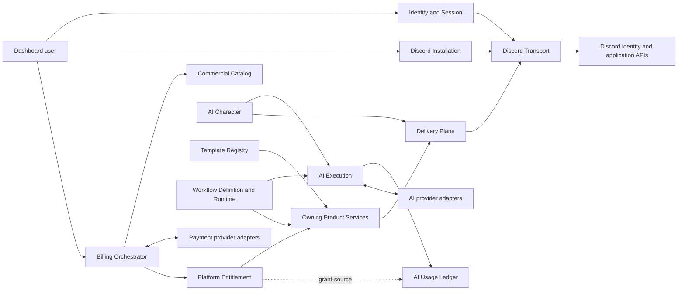

# Tobot Architecture — Platform Access, Commercial Products, and AI

[Architecture index](README.md) · [Previous](22-automation.md)

## 34. Platform access, commercial products, AI, templates, and workflows specification

### 34.1 Product surfaces and ownership

This product domain supplies the platform capabilities through which administrators authenticate, install the Discord application, purchase platform access, consume governed AI operations, share portable configuration, and execute declarative workflows. It does not replace the authorization, data ownership, or Discord effect rules of any existing product module.

| Surface | Owning service | Normative responsibility |
|---|---|---|
| Account and Discord login | Identity and Session Service | `PLATFORM_EXTERNAL_IDENTITY` binding, OAuth transaction, secure session, revocation, and discovery observations |
| Discord application installation | Discord Installation Service | Installation generation, minimal capability manifest, presence verification, degraded state, and repair |
| Commercial products | Commercial Catalog Service | Plans, add-ons, tiers, bundles, perks, AI Credit packs, promotions, pricing references, and immutable terms |
| Billing lifecycle | Billing Orchestrator Service | Billing ownership, checkout, subscription, invoices, refunds, disputes, provider events, grace, and reconciliation |
| SaaS access and limits | Platform Entitlement Service | Effective feature, limit, perk, validity, overage, and invalidation projection |
| AI Credit accounting | AI Usage Ledger Service | Lots, journal, reservations, captures, releases, refunds, expiry, and spending limits |
| AI provider operations | AI Execution Service | Admission, provider-neutral routing, safety, result, usage normalization, and uncertainty |
| AI characters | AI Character Service | Character behavior, destinations, context boundary, disclosure, cooldown, and response occurrences |
| Portable templates | Template Registry Service | Package publication, review, reputation, preflight, installation, rollback, and conflicts |
| Declarative automation | Workflow Definition and Runtime Service | Compiled workflows, triggers, conditions, action occurrences, partial state, replay, and dead letters |

The user's browser may call Discord authorize URLs. Server-side Discord HTTP, including OAuth token exchange and installation inspect, goes only through Discord Transport.

### 34.2 Explicit domain separation

The following terms have exactly one meaning:

| Term | Meaning | Explicitly not |
|---|---|---|
| Plan | Recurring commercial product that supplies base feature and limit grants | XP level, guild currency tier, or AI Credit balance |
| Add-on | Compatible commercial extension that adds a module or capacity | Arbitrary per-account override |
| Capacity tier | Immutable quantity option for one capacity add-on | Subscription plan or progression level |
| Bundle | Commercial package expanded into ordinary product components | New entitlement type interpreted by every module |
| Perk | Non-quantitative benefit such as support priority or approved early access | Balance, quota, or transferable value |
| Level | XP progression state owned by Community Experiences | Billing, capacity, authority, or currency |
| AI Credit | Prepaid internal unit consumed only by admitted billable AI operations | Cash, cryptoasset, guild currency, reward point, provider token, or general compute credit |
| Platform entitlement | SaaS feature, limit, or perk grant for a commercial scope | Guild reward entitlement purchased with virtual currency |
| Usage | Capacity consumed or reserved under a named limit | Commercial price or entitlement source |

Guild activity MUST NOT create unbounded AI Credits. Achievement-based promotional grants, if enabled, have a published finite amount, total program budget, anti-abuse policy, eligibility identity, expiry, and one-time semantic key.

### 34.3 Billing owner and commercial scope

There is no domain Customer aggregate. `BILLING_OWNER` is the payer identity (DR-055). `owner_type` is `Account` or `Organization`. Account-type admits at most one owner per platform account; that account holds Owner membership. First product admits Account-type. Organization-type is one owner with many memberships and at least one current Owner. A platform account MAY join many Organization owners and at most one Account-type owner. Organization-type MAY remain operator-gated until verification exists; the cardinality is specified now.

A billing owner MAY fund one or more explicitly bound Discord installations only when the product revision permits that scope. At most one Active `BILLING_SCOPE_BINDING` exists per Discord installation. Two billing owners MUST NOT concurrently fund the same installation. Billing ownership does not imply guild administration, and guild administration does not imply billing ownership.

`PROVIDER_CUSTOMER_MAPPING` is adapter evidence. At most one Active mapping exists per billing owner, provider adapter, merchant-account scope, and environment. The provider customer identifier is not `billing_owner_id`. One mapping MUST NOT attach to two owners. Hosted checkout and portal sessions create or reuse the mapping through Billing. A dashboard-posted provider customer identifier is not authority.

`TAX_EVIDENCE` is append-only location and classification evidence on the billing owner, with optional invoice or order correlation. It is not legal determination and not a Customer row.

Every billing-owner membership declares:

- Authority to view billing, initiate checkout, manage subscriptions, view invoices, request refunds, resolve disputes, transfer ownership, or administer grants.
- Effective and expiry boundaries.
- Authentication-strength requirements for high-risk operations.
- The account and organization identity that granted the membership.
- Immutable audit and revocation state.

Ownership transfer is a versioned workflow. The current and receiving owners authenticate strongly, the target installations are revalidated, active orders and disputes are disclosed, provider customer or subscription changes are planned, and a single effective boundary advances the billing scope generation. A failed or partial transfer preserves the prior owner until explicit reconciliation proves the new authority complete.

### 34.4 Discord authentication policy

The default dashboard login requests only the Discord identity scopes required for identity and guild discovery. Additional scopes are separate, purpose-bound grants and are never accumulated preemptively.

The authorization transaction includes a cryptographically random single-use state, client-class binding, exact redirect identity, requested scopes, creation time, expiry, and PKCE S256 (`code_challenge` and server-side `code_verifier`). Callback processing consumes the transaction atomically before token exchange. Reuse, mismatch, expiry, missing verifier, unexpected scope, identity conflict, or provider error produces a terminal audited rejection. Confidential dashboard clients do not skip PKCE (DR-026).

Provider access and refresh tokens remain server-side. The browser receives an opaque session identifier for an Identity `AUTHORIZATION_SESSION` (DR-018) with:

- Cookie transport, when used, carrying only that identifier, with `Secure`, `HttpOnly`, and `SameSite=Lax`. Host-only on `app.*`. `SameSite=None` and `SameSite=Strict` are forbidden. Cookie `Max-Age` MUST NOT exceed remaining absolute time and MUST NOT be expiry authority (DR-049).
- CSRF on cookie-authenticated mutations: Origin (or equivalent Referer) check against the dashboard origin allowlist plus a session-bound synchronizer token or a double-submit token. The proof MUST NOT be the session-id cookie. Origin-only defense is forbidden (DR-025). `SameSite=Lax` is not a complete CSRF control.
- Session rotation after authentication or privilege change, including successful step-up.
- Idle expiry of 12 Clock-port hours sliding and absolute expiry of 7 Clock-port days from creation. Activity MUST NOT extend the absolute boundary.
- Credential-generation checks on every request.
- Immediate revocation after logout, account disablement, identity unlink, suspected compromise, or authorization loss.
- Authentication audit from the named catalog (`login_started`, `login_rejected`, `login_succeeded`, `session_rotated`, `session_idle_expired`, `session_absolute_expired`, `session_revoked`, `step_up_required`, `step_up_succeeded`, `step_up_failed`) without tokens, cookie bytes, PKCE verifier, or authorization code.

The cookie MUST NOT hold Discord tokens, authorization claims, or a self-sufficient signed session. Integrity-protected cookies without a server revocation store are forbidden.

Dashboard freshness after authentication is cookie-authenticated REST poll of Query and Status. A product WebSocket beside Discord Gateway is forbidden. Server-Sent Events MAY later reuse those projections and MUST NOT place the session identifier in a query string (DR-043).

The dashboard origin is `app.*`. It is the sole cookie site. The session cookie is host-only there. `www` is a sessionless landing; its login control navigates to the `app.*` login route. The login form and Discord OAuth callback MUST NOT run on `www`. Public documentation is a sessionless static site on `docs.*`. Neither `www` nor `docs.*` receives the session cookie, hosts OAuth, or admits commands (DR-045).

Guild discovery results are filtered for presentation but are not authoritative. The current-user guild permission field does not include channel overwrites or implicit permission behavior. Each owning service defines the exact Discord and platform capabilities required for its command and revalidates them on the backend.

#### Architecture Review

**Current Specification:** Discord authorization-code login; single-use state; PKCE S256 (DR-026); opaque server-side session (DR-018); CSRF Origin plus synchronizer or double-submit (DR-025). Session cookie is `SameSite=Lax` on `app.*`; idle 12 hours; absolute 7 days; high-risk step-up 5 minutes (DR-049). Frontend guild discovery, `paid`, `entitled`, and Discord permission bits are not authorization (DR-027). Dashboard live status is REST poll of Query and Status (DR-043). Dashboard origin is `app.*`; `www` and `docs.*` are sessionless (DR-045).

**Contradiction C-24 (resolved by DR-018):** the dual session model in 12 §17.2 is closed. Dashboard session is Identity's opaque `AUTHORIZATION_SESSION`.

**Recommended Improvement:** session policy is DR-049. Install authorize URLs are DR-050. Canonical review: [00-architecture-review.md](00-architecture-review.md#16-bot-installation-review).

#### Decision Record DR-026

**Status:** Accepted.

**Decision:** Every Discord authorization-code transaction for dashboard login and application installation MUST use PKCE S256. Single-use `state` remains required. Confidential-client class does not waive PKCE. `plain` is forbidden.

**Rejected Alternative:** “Where applicable” as the only PKCE bar; waiting for Discord confidential-client enforcement.

**Security Review:** session SameSite, TTL, login audit, Discord re-fetch staleness, and high-risk step-up are DR-049. CSRF is DR-025. PKCE is DR-026. Frontend grants are DR-027. Pre-MVP for dashboard login.

#### Decision Record DR-044

**Status:** Accepted.

**Decision:** First-product browser surfaces are two origins. The product origin (`www` or the apex that serves the landing) hosts the landing and the dashboard at `/dashboard`. It is the sole cookie site: the opaque session cookie is host-only on that origin; Discord OAuth redirect, CSRF Origin allowlist, Control API cookie mutations, and Query REST poll terminate there. The landing MAY read session on the server because it shares that origin. Public documentation is a separate sessionless static site on `docs.*`. It is not a §6.2 module, MUST NOT receive the session cookie, MUST NOT host OAuth callbacks, and MUST NOT be a command path. Astro is the recommended implementation profile for both sites. Next.js is an acceptable alternative only for the product origin if the team is Next-native. Naming Astro as a MUST in 01–23 remains forbidden. An `app.*` dashboard origin is not first product.

**Rejected Alternative:** Two cookie apps (Astro marketing + Next dashboard); `www` plus `app.*` as two cookie sites; `Domain=.parent` session cookie visible to `docs.*`; OAuth or login on `docs.*`; public SPA with tokens in the browser; documentation as a product service.

#### Decision Record DR-045

**Status:** Accepted.

**Decision:** First-product browser surfaces are three applications: sessionless `docs.*`, sessionless `www` landing, and `app.*` as the sole cookie site. The `www` login control is a GET navigation to the `app.*` login route. The login form and Discord OAuth `redirect_uri` are `app.*` only. After consent the user returns to `app.*`. `www` and `docs.*` MUST NOT set the session cookie or host OAuth.

**Rejected Alternative:** Login form or OAuth callback on `www`; `www` + `/dashboard` as one cookie origin (DR-044); parent-domain session cookie.

#### Decision Record DR-049

**Status:** Accepted.

**Decision:** Session cookie is `Secure`, `HttpOnly`, host-only, `SameSite=Lax`. Idle 12 hours sliding; absolute 7 days. Discovery 15 minutes; ordinary Capability 60 seconds; high-risk live plus 5-minute step-up. Named login audit catalog without secrets.

**Rejected Alternative:** `SameSite=None` or `Strict`; cookie Max-Age as authority; SameSite as CSRF; high-risk from stale discovery.

### 34.5 Dashboard guild authorization

Authorization evaluates the following independent facts in order:

1. Active platform account and unrevoked session generation.
2. Target tenant and Discord installation binding.
3. Current Discord user identity and guild membership.
4. Guild ownership or the exact current Discord permission required by policy.
5. Platform role or billing-owner membership where applicable.
6. Current product entitlement and limit state.
7. Owning-service capability, aggregate version, protected-resource policy, and break-glass requirements.

`Manage Guild` may be the normal configuration threshold, while Administrator or guild ownership does not bypass platform separation of duties. Billing, secrets, destructive cleanup, transcript export, security containment, refund, and entitlement override retain their own stronger capabilities. Those high-risk commands require live Discord Capability or Transport revalidation and a step-up authentication generation no older than 5 Clock-port minutes (DR-049).

Dashboard HTTP MAY name target tenant, guild, and resource identities. Client-supplied `paid`, `entitled`, premium flags, Discord permission bitfields, owner flags, and guild-discovery observations MUST NOT authorize. Commercial truth is Billing and Platform Entitlement. Discord membership and required guild authority are revalidated by the owning module through Discord Capability. Billing, install repair, and destructive configuration fail closed when that revalidation is unavailable (DR-027).

#### Decision Record DR-027

**Status:** Accepted.

**Decision:** Control API and owning modules MUST NOT treat client-supplied commercial status or Discord permission evidence as authorization. Target identifiers are not proofs. Query and Status projections are not mutation authority.

**Rejected Alternative:** Trusting a dashboard POST of `paid`, `entitled`, or Discord permission bits; using cached guild discovery as sufficient authorization for a sensitive command.

### 34.6 Discord installation model

The architecture models Discord installation contexts rather than assuming that every capability requires a guild bot. Application commands can be authorized independently of a bot user in supported contexts. A guild installation may require a bot user, application commands, Gateway intents, and permissions according to its enabled modules.

Each module publishes a versioned installation capability manifest containing:

- Supported Discord installation contexts.
- Required and optional OAuth scopes.
- Required bot permissions by operation class.
- Required Gateway intents and whether they are privileged.
- Required application-command contribution classes.
- Role hierarchy, channel type, thread, webhook, attachment, and audit-log prerequisites.
- Degraded behavior when each capability is absent.
- Repair behavior and whether configuration remains valid.

The requested permission set is the minimal union of named bot permissions from currently enabled module capability manifests. Enabling another module later MUST create a new authorization generation. Administrator MUST NOT be the default install set, a repair shortcut when a named permission is missing, or a substitute for an incomplete manifest. Disabled modules MUST NOT inflate the request (DR-032). Installation authorization-code transactions MUST use PKCE S256 (DR-026).

Discord Installation generates the authorize URL from a named preset (`GuildInstall`, `UserInstall`, `GuildRepair`). `client_id` is the platform application identity. `redirect_uri` is the `app.*` install callback. Scopes are the enabled-module union; `bot` is included only when a required enabled module needs a bot member. The `permissions` query parameter is the DR-032 bitfield and is omitted when `bot` is absent. When the command names a guild, the URL MUST include that `guild_id` and `disable_guild_select=true`. `GuildRepair` uses `prompt=consent` and the named missing-permission delta. `applications.commands` without a bot member uses `integration_type=0` for guild install or `1` for user install. `client_secret` MUST NOT appear in the URL. Login authorization URLs are Identity, not Installation. A dashboard-posted authorize URL is not authority. Callback `guild_id` and `permissions` are Discord hints, not proofs (DR-050). Discord Default Install Settings / `client_id`-only URLs MUST NOT be the product install path.

Discord Installation owns the TENANT registry. First-product `tenant_type` is `Guild` or `User`. `tenant_id` is platform opaque identity and MUST NOT equal the Discord guild or user snowflake. Admitting an installation context creates or reuses the Active tenant for that type, provider ref, and application environment. Installation `Removed` MUST NOT delete TENANT. Tenant deletion is a separate authorized workflow (DR-059).

### 34.7 Installation verification and health

Installation progresses through the lifecycle in section 10.36. The callback establishes only that an authorization interaction returned. Operational installation requires agreement among:

- Expected application identity and installation context.
- Provider-observed application authorization or bot presence.
- Guild identity and current installing actor authority.
- Current bot role, hierarchy, channel, thread, webhook, and audit capabilities.
- Required Gateway intent availability.
- Application Command Registry desired and observed generation.
- Module dependency health.

Per-module health is `Healthy`, `Degraded`, `Blocked`, `Unavailable`, or `NotRequired`. The aggregate is `Installed` only when every required enabled-module capability is healthy. `Degraded` preserves configuration and allows unaffected modules to operate. `Removed` is based on provider observation, not on a missing dashboard cache entry.

The repair view states the missing capability, affected modules, exact reason, requested named-permission delta, external steps, destructive effects if any, and post-repair verification. Repair MUST request only that named delta. It MUST NOT substitute Administrator. Reinstallation creates a new generation and never resets module data.

#### Architecture Review

**Current Specification:** OAuth callback is not operational installation. Installation authorization-code uses PKCE S256 (DR-026). `Installed` only when every required enabled-module capability is healthy. Bot presence MUST NOT flatten that aggregate. Command-only modules mark bot presence `NotRequired` (DR-047). Install and repair request the minimal union of enabled-module named permissions; Administrator is never default or a repair shortcut (DR-032). Authorize URLs are generated from named presets; named guild install and repair lock `guild_id` and set `disable_guild_select` (DR-050).

**Recommended Improvement:** invite URL construction is DR-050. Remaining commercial machines are in the billing review. Canonical review: [00-architecture-review.md](00-architecture-review.md#16-bot-installation-review).

**Risk:** treating bot presence as the only install signal would break command-only modules already marked `NotRequired`.

#### Decision Record DR-047

**Status:** Accepted.

**Decision:** Aggregate `Installed` is every required enabled-module capability `Healthy`. Bot presence is a per-module observation, required only when the manifest demands a bot member. Command-only modules MUST mark bot presence `NotRequired`. Observing the bot user MUST NOT flatten the aggregate. The OAuth callback commits `Verifying`, never `Installed`. The OAuth HTTP handler MUST NOT wait on presence, capability, and registry inspects. Invite URL construction remains unspecified except the permissions bitfield (DR-032).

**Rejected Alternative:** Flattening `Installed` to “bot user present”; treating the callback as operational installation; requiring bot presence for command-only modules; holding the OAuth handler open until those Discord reads complete.

#### Decision Record DR-050

**Status:** Accepted.

**Decision:** Installation generates Discord authorize URLs from named presets `GuildInstall`, `UserInstall`, and `GuildRepair`. `client_id` is the platform application identity. Named guild install and repair lock `guild_id` and set `disable_guild_select=true`. `permissions` is the DR-032 bitfield only when `bot` is in scope. Callback `guild_id` and `permissions` are hints.

**Rejected Alternative:** Client-supplied authorize URL; Discord Default Install Settings as product install; unlocked guild picker after a guild is named; trusting callback query parameters as proof.

#### Decision Record DR-059

**Status:** Accepted.

**Decision:** Discord Installation owns the TENANT registry. First-product `tenant_type` is `Guild` or `User`. `tenant_id` is platform identity, not a Discord snowflake. Uninstall does not delete TENANT.

**Rejected Alternative:** Identity or Billing owning TENANT; Discord snowflake as `tenant_id`; deleting TENANT on Installation `Removed`.

### 34.8 Commercial catalog

Commercial Catalog publishes immutable revisions. Commercial configuration is data-driven, but publication is a privileged, validated control-plane action rather than mutable runtime configuration.

Every product revision defines:

- Stable product key, product kind, display reference, regions, currencies, and effective interval.
- Provider-neutral price references and billing cadence.
- Feature, limit, perk, and AI Credit components.
- Base-plan and add-on compatibility.
- Scope multiplicity and installation binding rules.
- Upgrade, downgrade, cancellation, proration, grace, dunning, and refund policy references.
- Tax classification reference and merchant-of-record context.
- Terms, privacy, support, and service-level references.
- Retirement behavior and successor mapping.

A plan supplies base limits. Capacity add-ons contribute quantities to one compatible limit. Module add-ons supply a feature and any associated capacity. Capacity tiers are product revisions such as a named quantity, not hard-coded arithmetic in product modules. Bundles expand at order creation into pinned component sources. The frozen order then has exactly one hosted-session mode, `Recurring` or `OneTime`. Mixed modes fail closed at admit (DR-051). A mixed Recurring+OneTime Bundle splits into a checkout group of two sibling orders before either is admitted; Recurring hosted checkout is first; mixed Recurring intervals fail closed; group `Partial` MUST NOT auto-refund (DR-058). Recurring revisions pin `proration_mode` `None` or `TimeBalance`. Mid-period money uses a Billing `PRORATION_QUOTE` in integer minor units; a provider preview is not the amount (DR-057). Seasonal bundles and promotions include activation and expiration boundaries.

### 34.9 Effective entitlement and limit calculation

The Platform Entitlement projection applies the following conceptual rule:

> Effective capacity equals the active base grant plus compatible active capacity grants plus bounded active promotional grants, subject to unit, precedence, ceiling, scope, and validity rules.

The projection never stores only the total. It preserves each `GRANT_SOURCE` contributor, source revision, quantity, unit, effective interval, precedence decision, and grace state. Non-additive limits use their declared aggregation rule, such as maximum, minimum, replace, Boolean enablement, or an owning-service-specific bounded policy.

Hard capacity is admitted atomically by the owning product service. Examples include custom-command definitions, scheduled messages, stream-alert definitions, storage bytes, active workflows, and AI character count. The entitlement snapshot supplies the ceiling; the module owns current usage and reservations.

AI Credit components on a plan, pack, or promotion are not lots in Platform Entitlement. Entitlement applies a `GRANT_SOURCE` row and then publishes an AI-credit grant-source fact; AI Usage Ledger creates the lot and is the only journal writer. Billing MUST NOT write lots (DR-054).

After downgrade or add-on cancellation:

- Existing data and history remain available under retention policy.
- New capacity-consuming creation is blocked while authoritative usage exceeds the new limit.
- Editing without increasing capacity MAY remain available.
- Explicit deletion, export, cleanup, or later upgrade resolves overage.
- Background jobs and safety-critical revocations continue even when creation is disabled.

### 34.10 Subscription change semantics

An upgrade becomes effective only after the provider-neutral commercial transition says the new paid or admitted terms are active. When catalog `proration_mode` is `TimeBalance` and `delta` is positive, that paid transition is the proration invoice. A downgrade or cancellation normally takes effect at the paid period boundary unless the pinned terms define a different lawful grace rule. Negative `delta` credits the next renewal invoice and MUST NOT be a `COMMERCIAL_REFUND`. The system records scheduled state without prematurely restricting access. A provider proration preview is evidence; the pinned quote is admit authority (DR-057).

`TimeBalance` computes per affected Recurring line `unused_old = (old_line_amount * remaining_seconds) / period_seconds` and `new_remainder = (new_line_amount * remaining_seconds) / period_seconds` with integer division toward zero, then sums `delta`. `period_seconds` is `period_end - period_start`. `remaining_seconds` is `max(0, period_end - effective_at)`. OneTime lines, mixed currency, and non-positive period fail closed. `None` ignores unused time. Billing MUST NOT write AI Credit lots from the quote.

Payment failure records Billing `PastDue`. Platform Entitlement then enters explicit `Grace` from the applied `GRANT_SOURCE`. `Grace` is finite, visible, configurable by product revision for downgrade windows, and MUST NOT silently extend through repeated duplicate events. Payment-failure `Grace` MUST NOT exceed Billing `grace_until`. Grace expiry restricts new use according to feature policy without deleting stored data. The expiry instant is a Durable Timer registration. Modules MUST NOT treat subscription `PastDue` as entitled. Invariant 152 `reconciled` is not this grace (DR-046, DR-054).

Dunning is a Billing generation of catalog-pinned collection attempts on the Open renewal invoice. Attempt count is 1 through 8. Offsets are strictly increasing Clock-port durations from PastDue start and MUST fall strictly before `grace_until`. Each remaining due registers with Schedule. Retries MUST NOT mint a CommercialOrder or a second invoice identity. Adapter collect HTTP and provider Smart Retries are not `Paid` or `Restricted`. Collection is skipped while a qualifying dispute is open. When `grace_until` fires without verified Paid, the invoice becomes `Uncollectible` and the subscription `Restricted`. A later verified Paid MAY recover. Duplicate failure events MUST NOT extend the window (DR-056).

Refunds and disputes are new append-only workflows. They determine which commercial grants, unused AI Credit lots, spent AI Credits, invoices, and provider objects are affected. Consumed services are not erased from history. Required reversals that cannot be completed become visible reconciliation cases. A commercial refund is `COMMERCIAL_REFUND`. Invoice `Paid` and Order `Fulfilled` MUST NOT be rewritten. Provider create-refund HTTP is not domain `Succeeded`. Guild-shop §30.28 is not this path (DR-052). A commercial dispute is `COMMERCIAL_DISPUTE`. `Open` freezes grants via grant-source. It is not a refund row. Early fraud warnings are not this aggregate (DR-053).

### 34.11 Payment-provider adapter profile

The domain supports replaceable payment-provider adapters. An admitted adapter must provide or explicitly mark unavailable:

- Hosted or provider-controlled checkout for one-time and recurring purchases.
- Customer and subscription object mapping.
- Idempotent request semantics.
- Signed asynchronous event delivery.
- Payment, delayed payment, renewal, failure, cancellation, pause, invoice, refund, and dispute observations.
- Self-service billing management where supported.
- Reconciliation reads with stable provider object identity and ordering evidence.
- Tax calculation and evidence capabilities where selected.
- Environment isolation, credential rotation, least-privilege access, and operational limits.

Stripe MAY be the initial adapter. For that profile, recurring plans and add-ons use the provider's current subscription billing primitives and a hosted Checkout surface; one-time AI Credit packs use a one-time Checkout surface. A mixed Recurring+OneTime Bundle is two Checkout Sessions, Recurring then OneTime, never one session spanning both modes (DR-058). Fulfillment handles both immediate and delayed successful payment states and never depends on the success page. A Stripe `checkout.session.completed` event with unpaid delayed methods is CheckoutAttempt `Completed`, not CommercialOrder `Fulfilled`. Adapter `client_reference_id` is `checkout_attempt_id`. `success_url` and `cancel_url` are `app.*` Query routes. Stripe's optional landing-page retrieve-and-fulfill pattern is not domain authority (DR-051). Subscription lifecycle processing includes subscription changes, paid invoices, and failed invoices. Provider self-service portal access is issued only after current billing-owner authorization.

The Stripe adapter uses current product-and-price primitives rather than deprecated plan objects, supports dynamically eligible payment methods through provider configuration, isolates restricted credentials per service and environment where possible, and preserves the provider API version used for each normalized event and request. These are adapter obligations, not canonical domain fields.

#### Architecture Review

**Current Specification:** Stripe MAY be the initial adapter. Fulfillment never depends on the Checkout success page. A dashboard-posted `paid` or `entitled` flag is not commercial truth (DR-027). Platform entitlements are distinct from guild virtual-currency entitlements and from AI Credits. Guild commerce-reward public contracts are `GuildRewardEntitlement`; module 7.35 is not deleted (DR-066). Unprefixed `Entitlement*` names MUST fail closed at parse; Platform Entitlement rejects `GuildRewardEntitlement*` at inbox apply (DR-069). Guild-shop refunds after `Fulfilled` are DR-007 and do not use this Stripe adapter. Billing `PastDue` is not entitled; Entitlement `Grace` is the access projection (DR-046). CommercialOrder is the frozen intent; CheckoutAttempt is one hosted-session generation; session-completed is not fulfillment (DR-051). Commercial refund is an append-only Billing aggregate; Invoice `Paid` and Order `Fulfilled` stay put (DR-052). Commercial dispute is a distinct Billing aggregate; `Open` freezes grants (DR-053). Applied grants are Entitlement-owned `GRANT_SOURCE`; Billing does not write lots (DR-054). There is no domain Customer; `BILLING_OWNER` is the payer; provider Customer objects are mapping evidence (DR-055). Dunning retries collect one Open renewal invoice before `grace_until` (DR-056). Proration is a Billing integer quote; provider preview is not the amount (DR-057). A mixed Recurring+OneTime Bundle splits into two sibling hosted sessions under a checkout group; Recurring first (DR-058). Money-plane public contracts set `schema_family` `VirtualPayment`, `CommercialPayment`, or `AiCreditReservation` (DR-065). Payment-provider HTTP terminates at Provider Event Edge; ACK follows the 9.36 inbox path and MUST NOT wait for entitlement projection (DR-067).

**Missing Decision:** none remaining for mixed-cadence bundle split. Mixed Recurring+OneTime in one hosted session is rejected at admit (DR-051). Split is DR-058. Payment ACK/inbox on the 9.36 path is DR-067. **DR-013:** `Invoice` is in §12.14.2. **DR-052:** `COMMERCIAL_REFUND` is in §12.14.2. **DR-053:** `COMMERCIAL_DISPUTE` is in §12.14.2. **DR-054:** `GRANT_SOURCE` is in §12.14.2. **DR-055:** `PROVIDER_CUSTOMER_MAPPING` and `TAX_EVIDENCE` are in §12.14.2. **DR-056:** `DUNNING_GENERATION` is in §12.14.2. **DR-057:** `PRORATION_QUOTE` is in §12.14.2. **DR-058:** `CHECKOUT_GROUP` is in §12.14.2.

**Recommended Improvement:** none remaining in this billing-and-entitlements cluster. Canonical review: [00-architecture-review.md](00-architecture-review.md#17-billing-and-entitlements-review).

**Rejected Alternative:** treating `success_url` as fulfillment, or merging guild, platform, and AI ledgers.

### 34.12 Provider event ordering and reconciliation

Provider events can be duplicated, delayed, and delivered out of order. Payment-provider HTTP terminates at Provider Event Edge. Processing follows this sequence:

1. Bind the request to the exact endpoint, environment, merchant account, and signature generation.
2. Verify the signature over the required raw representation before trusting parsed fields.
3. Enforce body size, media type, freshness, replay, and denial-of-service policy.
4. Commit a durable provider-event receipt keyed by provider account scope and provider event identity. This receipt is authenticated ingress, not paid, entitled, or fulfilled.
5. Acknowledge the provider with HTTP success independently of commercial processing, entitlement projection, and grant-source publication. That ACK is allowed only after the Edge ingress row is durable (DR-067).

Steps 1 through 5 run at Provider Event Edge. Steps 6 through 9 run in Billing after inbox apply and MUST NOT block the HTTP ACK (DR-067).
6. Normalize the event and load the current provider object version when event data is incomplete or stale.
7. Apply an idempotent commercial transition only if its object ordering and state-machine rules permit it. That transition is fulfillment when policy admits the paid or granted effect.
8. Publish commercial grant facts through the transactional outbox. Platform Entitlement applies `GRANT_SOURCE`; Billing MUST NOT write lots.
9. Retain ignored, duplicate, stale, unsupported, and conflicting events with bounded reasons.

**Glossary (DR-022).** *Provider-event receipt* is the durable authenticated ingress row. *Acknowledgement* is the HTTP response after that commit. *Commercial fulfillment* is a later Billing state-machine transition from verified provider object state or explicit reconciliation. Browser return pages remain non-authoritative.

#### Decision Record DR-022

**Status:** Accepted.

**Decision:** A payment-provider HTTP acknowledgement follows a durable provider-event receipt keyed by provider account scope and provider event identity. That receipt is not paid, entitled, or fulfilled. Commercial fulfillment is a later Billing transition from verified asynchronous provider object state or explicit reconciliation. HTTP ACK, ingress receipt, and `success_url` MUST NOT grant features, lots, or invoices.

**Rejected Alternative:** Treating webhook HTTP success or the ingress receipt as commercial fulfillment; delaying ACK until entitlement projection.

#### Decision Record DR-067

**Status:** Accepted.

**Decision:** Payment-provider HTTP callbacks MUST terminate at Provider Event Edge and follow the 9.36 ACK/inbox path. HTTP success ACK is allowed only after a durable Edge ingress receipt. Duplicates ACK success and reuse that receipt. Invalid, expired, or unknown generation MUST NOT ACK success. ACK MUST NOT wait for Billing apply, `GRANT_SOURCE`, entitlement projection, or lot mint. Billing MUST NOT open a public payment webhook listener. DR-022 receipt-versus-fulfillment glossary is unchanged.

**Rejected Alternative:** Billing as the public webhook listener; ACK after entitlement projection; ACK before durable ingress; treating Edge ACK as `GRANT_SOURCE` apply.

#### Decision Record DR-046

**Status:** Accepted.

**Decision:** Billing subscription `PastDue` and Platform Entitlement `Grace` are sibling facts. Billing publishes unpaid-period and `grace_until` as grant-source. Entitlement owns `grace_state` on the access projection. Feature authorization reads Entitlement, never `PastDue`. Invariant 152 `reconciled` is provider-alignment of the subscription record; it is not Grace and not fulfillment.

**Rejected Alternative:** One shared PastDue/Grace row; authorizing modules from subscription `PastDue`; collapsing 152 into a premium boolean; treating `reconciled` as entitled.

#### Decision Record DR-051

**Status:** Accepted.

**Decision:** CommercialOrder is the frozen Billing intent with one hosted-session mode. CheckoutAttempt is one hosted-session generation. `checkout.session.completed` and `success_url` are not Order `Fulfilled`. Mixed Recurring+OneTime fails closed at admit.

**Rejected Alternative:** Stripe Checkout Session as the order; fulfilling from the landing page; one hosted session spanning Recurring and OneTime.

#### Decision Record DR-052

**Status:** Accepted.

**Decision:** Commercial refund is an append-only Billing aggregate. Invoice `Paid` and Order `Fulfilled` are not rewritten. Create-refund HTTP is not `Succeeded`. Guild-shop refund is DR-007.

**Rejected Alternative:** Rewriting Invoice `Paid`; copying guild-shop `Fulfilled → RefundRequested`; collapsing Dispute into Refund.

#### Decision Record DR-053

**Status:** Accepted.

**Decision:** Commercial dispute is an append-only Billing aggregate distinct from refund. `Open` freezes grants via grant-source. Invoice `Paid` and Order `Fulfilled` are not rewritten. Inquiry and chargeback are adapter classes.

**Rejected Alternative:** Treating a dispute as a refund; treating early fraud warnings as the dispute; treating webhook ACK as `Won`.

#### Decision Record DR-054

**Status:** Accepted.

**Decision:** `GRANT_SOURCE` is an Entitlement-owned applied-source aggregate. Billing publishes commercial grant facts. Only Entitlement publishes AI-credit grant-source to the Ledger. DR-003 lot ownership is unchanged.

**Rejected Alternative:** Billing writing lots; Billing writing Entitlement grant-source tables; dual lot publishers.

#### Decision Record DR-055

**Status:** Accepted.

**Decision:** There is no domain Customer aggregate. `BILLING_OWNER` is the payer identity. Provider Customer objects are `PROVIDER_CUSTOMER_MAPPING` evidence. At most one Active mapping per owner, adapter, merchant-account scope, and environment. At most one Active binding per Discord installation.

**Rejected Alternative:** Stripe Customer as payer identity; a second Customer table; sharing one provider customer across owners.

#### Decision Record DR-056

**Status:** Accepted.

**Decision:** Dunning retries are catalog-pinned collection attempts on one Open renewal invoice. Attempts MUST fall strictly before `grace_until`. Exhaustion without verified Paid is invoice `Uncollectible` and subscription `Restricted`. Provider Smart Retries are not domain constants.

**Rejected Alternative:** A new order per retry; webhook ACK as Restricted; unbounded retries; copying Stripe Smart Retries counts into the domain.

#### Decision Record DR-057

**Status:** Accepted.

**Decision:** Mid-period subscription changes pin a Billing proration quote. `TimeBalance` is integer minor units and Clock-port division toward zero. Provider previews are evidence. Negative delta credits the next invoice; it is not a refund.

**Rejected Alternative:** Stripe preview as domain amount; floating-point proration; unused time as `COMMERCIAL_REFUND`.

#### Decision Record DR-058

**Status:** Accepted.

**Decision:** Mixed Recurring+OneTime Bundles split into two sibling orders under a checkout group. Recurring hosted session first. A single order MUST NOT mix modes. Mixed Recurring intervals fail closed. Partial fulfillment is not an automatic refund.

**Rejected Alternative:** One Checkout Session spanning both modes; forbidding mixed Bundles in the catalog; auto-refunding the paid sibling.

Reconciliation compares local customers, subscriptions, line items, invoices, refunds, disputes, and effective periods to the provider. It repairs derivable missing transitions and opens a case for ambiguity. It never deletes a local record merely because a paginated or eventually consistent provider query omitted it.

### 34.13 Tax, invoicing, and compliance boundary

The architecture records tax classification references, customer-location evidence supplied through the compliant payment surface, calculated tax, exemption or reverse-charge evidence, registration context, invoice identity, refund adjustment, and reconciliation outcome. Calculated tax and invoice totals are integer minor units of the billed currency (DR-016). It does not determine where the operator is legally required to register, collect, remit, or file. Those records are `TAX_EVIDENCE` snapshots on `BILLING_OWNER`, not a Customer aggregate (DR-055).

A commercial invoice is a Billing Orchestrator aggregate ([10a-data-platform-access-commercial-ai.md](10a-data-platform-access-commercial-ai.md) §12.14.2, DR-013). Dashboard invoice views read that aggregate. The payment-provider invoice object is stored only as a protected evidence reference.

Automated tax calculation is considered healthy only when the liable merchant has an active registration for the applicable jurisdiction, the product has an approved classification, customer location is resolvable, and a sandbox or test calculation verifies a non-error taxability reason. Enabling a provider flag without an active registration is not a valid setup. Filing and registration remain separate compliance procedures, potentially handled by a provider or qualified partner.

The free template marketplace is outside the tax and invoicing path. Publishing, installing, rating, or discovering a template creates no sale, invoice, marketplace payout, or merchant-of-record relationship.

### 34.14 AI Credit sources and lot policy

AI Credits may originate from:

- A recurring monthly grant included in a plan or bundle.
- A one-time purchased AI Credit pack.
- A bounded promotion or partnership grant.
- A service-interruption compensation grant.
- A capped achievement grant approved by program policy.
- An authorized manual adjustment with reason and dual-control threshold where required.

Each source is applied as a `GRANT_SOURCE` row. When that row includes AI Credits, Entitlement publishes an AI-credit grant-source fact and the Ledger creates a distinct lot. Lot `expires_at` is frozen at mint. Null means no automatic expiry. Purchased OneTime packs MUST be null unless explicit terms or law require otherwise. Monthly grants MUST use period_end. Promotion MUST use frozen promotion terms. New reservations MUST NOT allocate a lot whose `expires_at` is at or before Clock now. Open allocations remain until the reservation settles; leftover available then journals `Expiry`. Consumption MUST be earliest `expires_at` first (null last), then `granted_at` ascending, then `lot_id`. Expiry order and consumption order are deterministic and visible to balance explanations (DR-061).

There are no generic Payment Credits or Compute Credits. Normal modules use platform entitlements and named limits. Provider-specific currency, tokens, or cost units are adapter-private inputs to a versioned rating rule.

### 34.15 AI pricing and settlement

AI pricing is a versioned catalog independent from the commercial product catalog. Each rule names the operation class, model capability class, measurable usage dimensions, minimum and maximum charge, rounding, reservation estimate, uncertainty policy, and effective interval. Rated charges are integer AI credit-minors (DR-016).

Potential dimensions include generated or processed text quantity, image dimensions and quality class, number and size of processed images, OCR page or media size, transcription duration, moderation request class, and workflow or character operation class. Exact provider cost remains internal.

Before execution, the service calculates a bounded estimate and reserves that maximum. Reservation TTL is 15 Clock-port minutes, range 2 through 30, and MUST be at least the operation deadline. Elapsed TTL without a confirmed result MUST mark the reservation `Uncertain` and MUST NOT release. `Uncertain` stays reserved until reconciliation or 24 Clock-port hours, then `Disputed`. After a confirmed result, it rates actual normalized usage, captures the final amount, and releases the remainder. A confirmed provider failure before billable work releases the reservation. A result blocked by output moderation may still be billable when the provider performed the operation; the published policy discloses this behavior.

Daily, monthly, and per-operation limits exist independently at platform, billing scope, guild, user, workflow, and character scopes. The most restrictive applicable ceiling wins. Spending controls are atomic and cannot be bypassed through concurrent requests or adapter fallback.

#### Decision Record DR-061

**Status:** Accepted.

**Decision:** Lot `expires_at` is frozen at mint. Purchased packs are non-expiring unless terms require otherwise. New reservations skip expired lots. Open allocations survive lot expiry until settlement. Reservation TTL is 15 Clock-port minutes and MUST NOT auto-release; TTL without a confirmed outcome becomes `Uncertain`. Uncertainty deadline is 24 Clock-port hours then `Disputed`.

**Rejected Alternative:** Silent TTL release; expiring reserved allocations in place; FIFO ignoring earlier `expires_at`; dashboard-posted lot expiry.

#### Decision Record DR-062

**Status:** Accepted.

**Decision:** AI provider attempts classify `RateLimited`, `TimeoutNotSent`, `TimeoutAfterSend`, `ConfirmedFailure`, `ConfirmedResult`, and `Uncertain`. HTTP 429 is `RateLimited`, not `Uncertain`, and MAY retry after Retry-After. Timeout after transmit is `Uncertain` and MUST NOT release or blind-retry. Timeout before transmit is `TimeoutNotSent` and MAY retry.

**Rejected Alternative:** Treating 429 as `Uncertain`; releasing on response timeout; copying Discord 429 delays as domain constants; auto-fallback after unknown outcome.

#### Decision Record DR-063

**Status:** Accepted.

**Decision:** Asset is the sole durable byte store. AI Execution owns `AI_PROTECTED_CONTENT`; `input_ref` and `result_ref` are that identity, not `asset_id`. OCR and transcription are purposes on that aggregate. AI Character owns `AI_CONVERSATION` and bounded turns that reference protected content and MUST NOT store bodies. Support Archive remains distinct. No first-product vector store.

**Rejected Alternative:** Asset as conversation or OCR authority; Execution or Character as a second object store; Support Archive for character history; `asset_id` as `input_ref`; embeddings as a first-product aggregate.

#### Decision Record DR-065

**Status:** Accepted.

**Decision:** Public money-plane contracts MUST set `schema_family` to `VirtualPayment`, `CommercialPayment`, or `AiCreditReservation`. `schema_name` keeps the §8.6 leaf. An unprefixed `Payment`, `Reservation`, or money `Catalog` type is forbidden.

**Rejected Alternative:** One shared Payment contract; renaming §8.6 leaves in this revision; treating stock reservation as `VirtualPayment`; treating `CatalogPublished` as `CommercialPayment`; treating AI Credit reservation as a monetary hold.

#### Decision Record DR-066

**Status:** Accepted.

**Decision:** The guild commerce-reward owner remains module 7.35 and is not deleted. Its public contracts are `GuildRewardEntitlement`. Platform Entitlement remains `PlatformEntitlement`. An unprefixed public type `Entitlement` is forbidden.

**Rejected Alternative:** Deleting module 7.35; merging with Platform Entitlement; renaming Platform Entitlement; treating `GRANT_SOURCE` as a guild reward.

#### Decision Record DR-069

**Status:** Accepted.

**Decision:** Public entitlement contracts are only `GuildRewardEntitlement*` for module 7.35 and `PlatformEntitlement*` for module 7.55. An envelope whose `schema_name` is unprefixed `Entitlement` or any other Entitlement-shaped name MUST fail closed at parse. Platform Entitlement MUST reject `GuildRewardEntitlement*` at inbox apply. Module 7.35 MUST reject `PlatformEntitlement*` leaves and MUST NOT apply `GRANT_SOURCE`. Consumers MUST NOT infer the plane from payload fields. The private `ENTITLEMENT` table remains guild-reward storage and MUST NOT be Platform Entitlement's journal. DR-066 ownership and public names are unchanged.

**Rejected Alternative:** Guessing guild versus platform from payload; applying unprefixed `Entitlement*` into either journal; sharing one Entitlement inbox; treating `ENTITLEMENT` as Platform Entitlement storage.

#### Decision Record DR-070

**Status:** Accepted.

**Decision:** `Disputed` is a Ledger reservation review state, not an AI Execution operation state. While a reservation is `Uncertain` or `Disputed`, the paired operation MUST remain `Uncertain`. The operation machine MUST NOT gain a `Disputed` state. Reservation `Disputed` MUST NOT be treated as capture, release, refund, operation `Failed`, operation `Succeeded`, or settlement. The operation MAY leave `Uncertain` only after Ledger accepts a confirmed usage or absence receipt into `Capturing` or `Releasing`. Query and dashboard MUST NOT present a `Disputed` reservation as a completed operation. DR-061 deadlines and DR-062 attempt classes are unchanged.

**Rejected Alternative:** Adding operation `Disputed`; auto-failing the operation when the reservation becomes `Disputed`; treating `Disputed` as `Released` or `Captured`; dashboard settlement from `Disputed`.

### 34.16 AI execution capability classes

The initial provider-neutral operation classes are:

- Text generation and transformation.
- Image generation.
- Image processing and transformation.
- Optical character recognition.
- Audio transcription.
- AI-assisted moderation requiring an external provider.
- AI action inside a workflow.
- AI character response.

Each class defines accepted media, maximum input, maximum output, latency class, eligible provider adapters, moderation gates, retention, residency, fallback, cancellation, and uncertainty behavior. An operation selects a capability class; the caller cannot choose arbitrary provider credentials, unrestricted models, hidden system instructions, or unbounded generation parameters. OCR and transcription persist source and extracted text as `AI_PROTECTED_CONTENT` purposes `OcrSource`, `OcrText`, `TranscriptAudio`, and `TranscriptText`. There is no dedicated OCR document aggregate (DR-063).

### 34.17 AI safety, privacy, and provider isolation

Admission evaluates current entitlement, actor authority, tenant policy, content purpose, source consent, privacy class, provider policy compatibility, spending limits, cooldown, concurrency, and destination policy. Input and output moderation are separately configurable by operation class but cannot be disabled below platform safety requirements.

Retrieved guild messages, form answers, provider payloads, OCR and transcript text, conversation history, and prior model output are untrusted for tool selection and authorization. Platform-authored system instructions and the admitted tool catalog MUST NOT be overwritten by that content. AI tools MUST be an allowlisted catalog; each invocation is a typed command reauthorized by the owning service. Model output MUST NOT grant a new capability or select arbitrary HTTP or Discord effects (DR-031).

Sensitive inputs are stored as `AI_PROTECTED_CONTENT` whose bodies live in Asset. `input_ref` and `result_ref` are `protected_content_id`, never `asset_id`. Events, ordinary logs, and traces contain identifiers, sizes, classifications, and outcomes rather than content. Span attributes MUST NOT copy prompts or generated output (DR-038). Each provider adapter declares retention, training use, residency, deletion, encryption, moderation, and incident capabilities. Incompatible adapters are excluded for that operation.

Provider failures use typed attempt classes. HTTP 429 or a provider-equivalent rate-limit refusal before a billable result is `RateLimited`, not `Uncertain`, and MAY retry after Retry-After within the operation deadline, remaining reservation TTL, and `max_attempts` 3. Connect, DNS, circuit-open, or adapter timeout before transmit is `TimeoutNotSent` and MAY retry the same way. Wait elapsed, reset, truncation, unparseable success, or 5xx without not-accepted proof after transmit is `TimeoutAfterSend` or `Uncertain`: the operation stays `Uncertain`, the reservation MUST NOT release, and the adapter MUST NOT blind-retry or auto-fallback to another provider. Retry-After is adapter config and MUST NOT copy Discord 429 numbers. HTTP status is not usage settlement (DR-062). If the reservation later becomes `Disputed`, the operation MUST remain `Uncertain`; Query MUST NOT present that review state as a completed operation (DR-070). Provider fallback after exhausted `RateLimited` or `TimeoutNotSent` requires a fresh attempt policy and preserved reservation ceiling.

### 34.18 AI characters and personas

An AI character is one configuration within the shared application, not a separate Discord bot or currency. Its immutable revision contains:

- Display name, approved avatar asset, automation disclosure, and optional webhook presentation policy.
- Bounded behavior instructions, tone, language, prohibited behaviors, and system safety rules.
- Allowed channels, invocation modes, ignored actors, cooldowns, concurrency, and response probability where admitted.
- Context boundary, maximum history, retrieval sources, freshness, privacy, and deletion policy.
- Input and output moderation behavior.
- Model capability and platform entitlement requirements.
- Per-response, daily, and monthly AI Credit ceilings.
- Failure, timeout, blocked-output, and degraded-presentation behavior.

Context is isolated by tenant, character, channel, conversation, and revision. The isolation aggregate is `AI_CONVERSATION`. First-product window is 20 turns including the current, range 8 through 50. Each turn references `protected_content_id` and MUST NOT store a body. Overflow drops the oldest turn. Support Archive MUST NOT store this history. A vector or embedding table is not first product (DR-063). One character cannot read another character's private configuration or memory. Guild messages do not become a global training corpus. A character never claims moderator authority and cannot impersonate a member or official Discord notice. Dashboard presentation of prompts and generated output treats that text as untrusted (DR-030). Retrieved conversation content cannot select tools, widen the character's admitted action set, or overwrite pinned system safety rules (DR-031).

Optional webhook presentation is owned and rotated by the application. The authoritative actor remains the application and character occurrence, not the webhook display name. If webhook capability is missing, policy may use the shared bot identity with a visible character label or mark the character degraded; it does not create an unmanaged webhook.

### 34.19 Template package scope

A template package may contain portable revisions of admitted module configuration, message definitions, workflows, form definitions, role-panel definitions, support templates, integration presets without credentials, and asset references that satisfy redistribution policy.

A package manifest declares:

- Schema versions and component stable identities.
- Required modules, features, limits, Discord capabilities, and external integrations.
- Permission and privileged-intent requirements.
- Resources it proposes to create, update, reference, or retire.
- Destructive or externally visible effects.
- Secret placeholders and the service authorized to resolve each one.
- Maximum storage, command, schedule, alert, workflow, role, channel, message, and AI exposure.
- Conflict strategies and rollback eligibility.
- License, authorship, attribution, content policy, and integrity digest.

Templates contain no live secrets, provider tokens, tenant identifiers, raw database rows, ephemeral Discord URLs, arbitrary executable code, or implicit authorization. Dashboard presentation of template metadata, descriptions, and previews treats that text as untrusted (DR-030). Package bytes are admitted only through a versioned schema parse (DR-037).

### 34.20 Template publication, discovery, and moderation

Publication passes schema validation, dependency resolution, content and asset scanning, permission review, destructive-effect review, secret scan, recursion and workflow analysis, legal and redistribution checks, and resource-ceiling analysis. Package bytes are admitted only through a versioned schema parse; language-native object codecs and deserialize-then-validate are forbidden (DR-037). Results produce `Approved`, `Restricted`, `ReviewRequired`, `Rejected`, `Suspended`, or `Retired` state with a reason history.

Discovery supports categories such as moderation, support, automation, roles, economy, and community, while category does not alter permissions. Search and ranking use approved metadata, compatibility, installation health, ratings, recency, and policy-compliant reputation. Paid placement, sponsored ranking, plan-based visibility, and marketplace visibility perks are forbidden.

Ratings require an eligible completed installation and one rating per account and template policy. Self-rating, duplicate accounts, automated installs, review rings, and artificially inflated usage feed fraud signals. Reputation produces badges or visibility only. Promotional AI Credit rewards are finite, fraud-reviewed grants and never scale without a program ceiling.

### 34.21 Template installation and rollback

Installation always shows a preview containing exact package revision, target tenant, requested capabilities, resource counts, references, conflicts, replacements, destructive effects, usage impact, entitlement gaps, and rollback limitations. Confirmation binds the actor to that immutable plan and expires after dependency drift.

Each component is submitted to its owning service as a normal authorized command. The owning service revalidates current policy, version, quota, hierarchy, Discord capability, and ownership. Independent steps may run concurrently only when the dependency graph proves no ordering relation.

Rollback is compensation, not database restoration. Each owning service receives the original effect identity, before-state reference, current observed state, and installation generation. It removes or restores only owned fields and resources. External edits, missing ownership, or irreversible actions become explicit conflicts requiring review.

### 34.22 Free-only marketplace boundary

The marketplace is permanently free. Every approved template is discoverable, previewable, installable, updateable, and removable without a template price or marketplace payment. The platform MUST NOT introduce:

- Paid templates, premium template editions, rental, subscription, licensing fees, or pay-per-install.
- Seller accounts, revenue sharing, creator payouts, commissions, marketplace fees, reserves, or negative balances.
- Paid placement, sponsored ranking, commercial boosts, plan-gated visibility, or perks that improve marketplace position.
- AI Credit, guild currency, XP, perk, plan, add-on, bundle, coupon, or external-payment requirements for template access.
- Tips or donations processed through the template installation flow.

Authors may receive attribution, non-transferable badges, reputation, or bounded promotional recognition governed by anti-abuse policy. Any capped promotional AI Credit reward is a separate platform program based on verified quality criteria; it cannot be purchased, transferred, withdrawn, exchanged, multiplied by install count without a ceiling, or used to influence marketplace ranking.

Free access does not weaken governance. Author identity, license, redistribution rights, intellectual-property complaints, moderation, takedown, fraud detection, duplicate-content detection, rating integrity, security review, regional content restrictions, and retention remain mandatory.

### 34.23 Workflow definition model

A workflow revision consists of one or more admitted triggers, a finite graph of deterministic conditions and typed actions, an authorization and resource policy, a dependency manifest, and a compiled integrity digest.

Admitted trigger families are:

- Canonical Discord events already ingested by Gateway Edge.
- Durable schedules and explicit due occurrences registered with Schedule's wake-up capability. Lost wake-ups are recovered by the platform due-row sweep.
- Authenticated external webhooks through Provider Event Edge. Those HTTP triggers MUST follow [21-integrations.md](21-integrations.md) §32.14: opaque endpoint generation, signature or authenticated connection over exact transport bytes, timestamp freshness, replay identity, and a durable ingress receipt before acknowledgement. Unsigned tenant webhooks are forbidden. A secret solely in the query string or path is not sufficient authentication (DR-028).
- Application commands and components through Interaction Edge.
- Typed module events published by owning services.

Conditions may evaluate authoritative or freshness-bounded facts including actor, role, channel, Discord capability, tenant policy, XP level, platform entitlement, module state, variables, and prior action outcomes. Discord permissions and platform safety are evaluated before custom role, level, or workflow rules. XP never grants an administrative Discord permission.

#### Decision Record DR-028

**Status:** Accepted.

**Decision:** Every tenant HTTP workflow trigger MUST terminate at Provider Event Edge and follow §32.14. After the ingress receipt, Edge publishes to Workflow, not External Live Signal. Workflow consumes the authenticated ingress fact asynchronously. It MUST NOT skip Edge, open a private public HTTP listener, or treat URL possession as authentication. Unsigned tenant webhooks and query-string-only secrets are forbidden.

**Rejected Alternative:** Unsigned public workflow URLs; query-string token as the only control.

### 34.24 Workflow action catalog

Actions are registered, versioned commands with an owning service, input schema, authorization class, idempotency rule, deadline, retry classification, compensation behavior, concurrency weight, and audit policy. Initial families may include:

- Send, edit, or delete an application-owned message through Delivery.
- Request a governed role assignment through Role Policy and Assignment.
- Open or update a support case through Support Case.
- Emit an Activity Log fact.
- Request an admitted integration action through Integration Registry.
- Execute an AI operation through AI Execution.
- Invoke another explicitly admitted platform capability through its owning service.

An AI action MAY propose arguments inside the pinned schema. The owning service reauthorizes the typed command. Model output MUST NOT add an action identity to a frozen execution or grant a capability the revision did not admit (DR-031).

Moderation, security containment, funds movement, billing, role-resource administration, and destructive resource actions require dedicated high-risk action definitions and cannot be synthesized from generic parameters. Arbitrary HTTP, arbitrary bot-command invocation, scripts, shell access, direct SQL, dynamic imports, reflection, filesystem access, and raw provider clients are forbidden.

### 34.25 Workflow execution, limits, and failure

Workflow Definition and Runtime is one module (DR-019). Execution admission, frozen facts, action occurrences, compensation, and replay share that owner. The module does not own Discord application-command registration.

Trigger handling performs bounded matching from an immutable compiled index. Admission creates one execution per workflow revision, trigger identity, and scope. It freezes facts used for decisions and materializes stable action occurrences before effects.

Limits apply by tenant, workflow, trigger, actor, destination, action type, downstream owner, and application cell. The compiled worst-case effect count must fit the policy budget. Lineage carries parent execution, cause event, depth, and visited workflow set. Self-generated events are suppressed or admitted only through an explicit bounded feedback rule.

Transient action failures retry independently within their deadline. Permanent denials remain terminal facts. Outcome uncertainty reconciles with the owning service before retry. Required-action failure may trigger declared compensation; optional failure may produce `PartiallyCompleted`. Retry exhaustion produces a dead letter with protected inputs, decisions, attempts, and replay boundary.

Manual replay requires actor authority and reason. Replay normally reuses the original workflow revision, fact snapshot, and semantic action identities so already completed effects remain deduplicated. A materially different execution is a new explicit generation, not a replay disguised as retry.

### 34.26 Command, role, level, channel, and plan policy precedence

Workflow and command policy uses this precedence:

1. Platform suspension, Discord acceptable-use, privacy, and safety controls.
2. Signed request or canonical event identity and current tenant binding.
3. Current Discord permissions, hierarchy, destination capability, and protected-resource policy.
4. Owning-service authorization and aggregate state.
5. Platform feature entitlement and authoritative capacity admission.
6. Explicit deny and ignore rules.
7. Required user, role, channel, age-restricted context, XP level, and other custom eligibility.
8. Cooldown, concurrency, frequency, and effect budget.
9. Typed action-specific validation.

An owner override is a named, audited policy branch with explicit scope and expiry. It never bypasses Discord permissions, application ownership, provider rate limits, billing truth, ledger integrity, privacy deletion, or platform safety.

### 34.27 Low-latency and scaling behavior

Identity callbacks, installation callbacks, payment webhooks, workflow triggers, and AI requests perform bounded admission and durable commit before slow work. They do not synchronously wait for cross-service convergence.

Scaling boundaries are distinct:

- Identity callback and session validation scale by request rate and cacheable revocation generation.
- Installation verification scales by installation generation and provider-read budget.
- Billing event ingestion scales by provider account and object partition while subscriptions preserve object ordering.
- Entitlement reads use versioned cache snapshots with targeted invalidation; hard usage admission remains local to the owning service.
- AI Usage Ledger partitions by credit account and serializes only operations that affect the same account.
- AI Execution uses separate queues and bulkheads by operation class, model capability, provider adapter, privacy class, and latency deadline.
- Template scanning, preview, installation, and rollback use separate worker pools.
- Workflow matching uses compiled tenant indexes; execution partitions by tenant and workflow while downstream effects retain their owner partitions.
- AI characters use compiled channel matchers and never perform provider calls on the Gateway dispatch loop.

Priority Processing is a perk only within an admitted non-AI queue class. It cannot bypass tenant fairness, provider rate limits, security work, interaction deadlines, or reserved capacity for other tenants. AI scheduling uses purchased entitlement and spending policy, not an undefined priority promise.

### 34.28 Retention and deletion

Independent retention classes apply to OAuth transactions, sessions, revocations, guild observations, installation generations, capability history, catalog revisions, billing events, invoices, disputes, entitlement projections, AI Credit journal, lots, reservations, AI operations, inputs, outputs, provider attempts, character context, template packages, reviews, installations, ratings, workflow definitions, executions, action logs, and dead letters.

Financial and tax records may require longer lawful retention than operational sessions or AI content. Account deletion removes or pseudonymizes identity and content according to policy while preserving legally required commercial facts with restricted access. Billing cancellation does not equal account deletion, guild deletion, template deletion, or AI-content deletion.

AI context and generated content support purpose-specific deletion without corrupting credit journal or commercial audit. Historical journal entries retain bounded operation identity and amount while protected content references become deleted markers.

### 34.29 Reconciliation

Bounded reconcilers compare:

- Active sessions to account, identity-link, and revocation generations.
- Installation desired contexts to provider authorization, bot presence, capabilities, Gateway coverage, and command projections.
- Commercial subscriptions, invoices, refunds, and disputes to payment-provider objects.
- Commercial grant sources to platform entitlement projections and due transitions.
- AI Credit grants to commercial sources, lots, journal totals, reservations, captures, refunds, and expirations.
- AI operations to reservations, provider attempts, usage receipts, results, and settlement.
- Template installation steps to owner-service operations and application-owned resources.
- Workflow executions to trigger receipts, action occurrences, downstream outcomes, deadlines, and dead letters.
- AI character response occurrences to AI operations, context retention, webhook presentation, and Delivery outcomes.

Automatic repair is limited to derivable missing publication, expired leases, stale cache invalidation, confirmed-absent retry, safe provider-object refresh, and proven application-owned convergence. Financial ambiguity, identity conflict, tax mismatch, payment dispute, AI usage uncertainty, template ownership conflict, or destructive workflow uncertainty requires operator review.

### 34.30 Operational procedures

#### Publish a commercial catalog revision

1. Author products and components against stable feature and limit definitions.
2. Validate plan uniqueness, add-on compatibility, bundle expansion, regions, currencies, tax references, effective boundaries, and successor mappings.
3. Simulate upgrades, downgrades, cancellations, grace, overage, refunds, and AI Credit grants against representative subscriptions.
4. Verify every provider price mapping in an isolated non-production environment.
5. Publish one immutable signed revision and warm the read projection.
6. Observe only new orders and eligible changes using the new revision; never mutate existing pinned terms.

#### Rotate a Discord OAuth credential

1. Create a new secret generation with exact redirect allowlist and least scopes.
2. Validate login and installation flows independently in an isolated environment.
3. Shift new OAuth transactions to the new generation while honoring only the bounded overlap required for in-flight callbacks.
4. Revoke the old generation, expire unmatched transactions, and invalidate affected sessions if provider policy requires it.
5. Verify audit, error, callback, and revocation metrics without exposing secret values.

#### Rotate a payment webhook endpoint or signing secret

1. Create a new endpoint generation bound to one environment and merchant account.
2. Enable bounded dual verification only when the provider rotation contract requires overlap.
3. Confirm signed event receipt, deduplication namespace, delayed-payment handling, subscription lifecycle handling, and reconciliation.
4. Move provider delivery to the new endpoint and observe lag and failure rates.
5. Revoke the prior secret, disable its endpoint, and retain only non-secret generation evidence.

#### Recover a stuck AI reservation

1. Load the operation, reservation, lot allocations, provider attempts, usage evidence, deadline, and pricing revision.
2. Query only the provider reconciliation capability admitted for that attempt.
3. Capture when a billable result and usage are confirmed; release when absence is proven.
4. Elapsed reservation TTL without a confirmed outcome MUST enter `Uncertain`, not `Release`. `TimeoutAfterSend` is the same Uncertain class. HTTP 429 MUST NOT be treated as Uncertain or as proof of absence. Uncertain remaining after 24 Clock-port hours becomes `Disputed`. Operator review MUST NOT guess from elapsed time alone.
5. Record operator identity and evidence for any manual resolution.

#### Suspend a malicious template or workflow

1. Stop new publication, installation, trigger admission, or replay independently.
2. Preserve immutable revisions, existing tenant-owned installations, execution evidence, and affected owner-service references.
3. Classify whether active executions may complete, must stop before the next effect, or require explicit containment.
4. Notify affected administrators through an admitted bounded channel without exposing reporter or security evidence.
5. Repair only application-owned unsafe effects through owning services and preserve conflicts for review.

### 34.31 Platform-specific consistency rules

- OAuth transaction consumption and application-session creation are one local transaction; provider token exchange and guild observations are external evidence recorded before session issuance.
- Installation callback receipt, bot presence, command projection, and effective permissions cannot share a transaction; installation generation and reconciliation bridge them.
- Commercial order creation and checkout-provider creation cannot share a transaction; frozen order identity and idempotent adapter request bridge them.
- Provider event receipt and commercial transition processing are separate transactions; durable inbox and object-ordering rules bridge them. HTTP acknowledgement of the Edge ingress receipt is not fulfillment (DR-022, DR-067).
- Billing transition and platform entitlement projection cannot share a transaction; grant-source events, monotonic generations, inbox, and reconciliation bridge them.
- Platform entitlement ceiling and module usage admission cannot share a transaction across services; the module performs atomic local admission against a sufficiently fresh grant or obtains an authoritative validation.
- AI Credit reservation is committed before provider dispatch; provider execution, usage settlement, and Delivery are independent transactions with stable operation identity.
- Template installation is not atomic across services; stable steps, ownership receipts, partial state, and compensation make every boundary explicit.
- Workflow execution and downstream actions are not one transaction; each action occurrence owns its semantic identity and terminal outcome.
- Character matching, AI execution, AI settlement, and Discord delivery are independent facts. Delivery failure does not refund a successfully completed billable AI operation unless the published commercial policy explicitly grants compensation.

### 34.32 Operational kill switches

Independent authenticated, versioned, and audited controls MUST exist for:

- Discord login initiation, callback exchange, session renewal, guild discovery, sensitive revalidation, identity unlink, and session revocation independently.
- New installation, repair authorization, presence verification, command verification, module capability checks, and removal reconciliation independently by application and environment.
- Catalog drafting, publication, checkout creation, subscription changes, portal issuance, provider-event ingestion, fulfillment, refunds, disputes, reconciliation, promotions, and manual grants independently.
- Platform feature activation, hard-limit admission, grace expiry, downgrade enforcement, invalidation publication, and manual override independently by feature and commercial scope.
- AI Credit grants, purchases, reservations, provider execution, settlement, refunds, expiry, manual adjustments, and reconciliation independently by operation class and account class.
- Each AI provider adapter, model capability class, input class, output class, moderation path, fallback path, and provider credential generation independently.
- Character publication, automatic matching, mention invocation, slash-command invocation, context retrieval, webhook presentation, AI generation, and Delivery independently by tenant and character.
- Template submission, scanning, review, publication, discovery, ranking, rating, installation, rollback, and promotional recognition independently.
- Workflow publication, each trigger family, each action family, AI actions, authenticated webhooks, scheduling, replay, compensation, dead-letter replay, and outbound integration independently.

Disabling checkout does not stop webhook intake, subscription reconciliation, refunds, disputes, or already paid fulfillment. Disabling new entitlement activation does not stop safe revocation or expiry. Disabling AI execution does not erase reservations; they proceed through confirmed release or reconciliation. Disabling template installation does not delete installed tenant-owned configuration. Disabling workflow triggers does not abandon already accepted executions unless a separate effect-containment switch is activated.

No kill switch may disable OAuth state validation, provider signature verification, durable event receipt, tenant authorization, session revocation, payment reconciliation, journal integrity, Discord rate-limit compliance, ownership proof, privacy deletion, audit visibility, or visibility into pending, degraded, partial, overdue, disputed, uncertain, conflicted, and dead-letter work.
