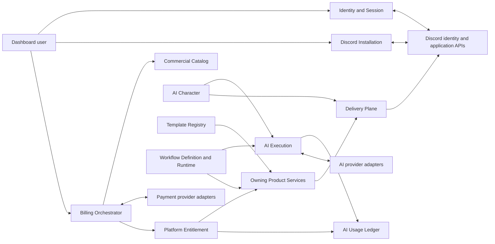

# Tobot Architecture — Platform Access, Commercial Products, and AI

[Architecture index](README.md) · [Previous](22-automation.md)

## 34. Platform access, commercial products, AI, templates, and workflows specification

### 34.1 Product surfaces and ownership

This product domain supplies the platform capabilities through which administrators authenticate, install the Discord application, purchase platform access, consume governed AI operations, share portable configuration, and execute declarative workflows. It does not replace the authorization, data ownership, or Discord effect rules of any existing product module.

| Surface | Owning service | Normative responsibility |
|---|---|---|
| Account and Discord login | Identity and Session Service | External identity binding, OAuth transaction, secure session, revocation, and discovery observations |
| Discord application installation | Discord Installation Service | Installation generation, minimal capability manifest, presence verification, degraded state, and repair |
| Commercial products | Commercial Catalog Service | Plans, add-ons, tiers, bundles, perks, AI Credit packs, promotions, pricing references, and immutable terms |
| Billing lifecycle | Billing Orchestrator Service | Billing ownership, checkout, subscription, invoices, refunds, disputes, provider events, grace, and reconciliation |
| SaaS access and limits | Platform Entitlement Service | Effective feature, limit, perk, validity, overage, and invalidation projection |
| AI Credit accounting | AI Usage Ledger Service | Lots, journal, reservations, captures, releases, refunds, expiry, and spending limits |
| AI provider operations | AI Execution Service | Admission, provider-neutral routing, safety, result, usage normalization, and uncertainty |
| AI characters | AI Character Service | Character behavior, destinations, context boundary, disclosure, cooldown, and response occurrences |
| Portable templates | Template Registry Service | Package publication, review, reputation, preflight, installation, rollback, and conflicts |
| Declarative automation | Workflow Definition and Runtime Service | Compiled workflows, triggers, conditions, action occurrences, partial state, replay, and dead letters |

### 34.2 Explicit domain separation

The following terms have exactly one meaning:

| Term | Meaning | Explicitly not |
|---|---|---|
| Plan | Recurring commercial product that supplies base feature and limit grants | XP level, guild currency tier, or AI Credit balance |
| Add-on | Compatible commercial extension that adds a module or capacity | Arbitrary per-account override |
| Capacity tier | Immutable quantity option for one capacity add-on | Subscription plan or progression level |
| Bundle | Commercial package expanded into ordinary product components | New entitlement type interpreted by every module |
| Perk | Non-quantitative benefit such as support priority or approved early access | Balance, quota, or transferable value |
| Level | XP progression state owned by Community Experiences | Billing, capacity, authority, or currency |
| AI Credit | Prepaid internal unit consumed only by admitted billable AI operations | Cash, cryptoasset, guild currency, reward point, provider token, or general compute credit |
| Platform entitlement | SaaS feature, limit, or perk grant for a commercial scope | Guild reward entitlement purchased with virtual currency |
| Usage | Capacity consumed or reserved under a named limit | Commercial price or entitlement source |

Guild activity MUST NOT create unbounded AI Credits. Achievement-based promotional grants, if enabled, have a published finite amount, total program budget, anti-abuse policy, eligibility identity, expiry, and one-time semantic key.

### 34.3 Billing owner and commercial scope

A `BillingOwner` is either one platform account or a future verified organization. A billing owner may fund one or more explicitly bound Discord installations only when the product revision permits that scope. Billing ownership does not imply guild administration, and guild administration does not imply billing ownership.

Every billing-owner membership declares:

- Authority to view billing, initiate checkout, manage subscriptions, view invoices, request refunds, resolve disputes, transfer ownership, or administer grants.
- Effective and expiry boundaries.
- Authentication-strength requirements for high-risk operations.
- The account and organization identity that granted the membership.
- Immutable audit and revocation state.

Ownership transfer is a versioned workflow. The current and receiving owners authenticate strongly, the target installations are revalidated, active orders and disputes are disclosed, provider customer or subscription changes are planned, and a single effective boundary advances the billing scope generation. A failed or partial transfer preserves the prior owner until explicit reconciliation proves the new authority complete.

### 34.4 Discord authentication policy

The default dashboard login requests only the Discord identity scopes required for identity and guild discovery. Additional scopes are separate, purpose-bound grants and are never accumulated preemptively.

The authorization transaction includes a cryptographically random single-use state, client-class binding, exact redirect identity, requested scopes, creation time, expiry, and proof-key challenge where applicable. Callback processing consumes the transaction atomically before token exchange. Reuse, mismatch, expiry, missing verifier, unexpected scope, identity conflict, or provider error produces a terminal audited rejection.

Provider access and refresh tokens remain server-side. The browser receives an opaque secure session with:

- Secure and HTTP-only transport where cookies are used.
- Same-site and CSRF policy appropriate to the dashboard topology.
- Session rotation after authentication or privilege change.
- Idle and absolute expiry.
- Credential-generation checks on every request.
- Immediate revocation after logout, account disablement, identity unlink, suspected compromise, or authorization loss.

Guild discovery results are filtered for presentation but are not authoritative. The current-user guild permission field does not include channel overwrites or implicit permission behavior. Each owning service defines the exact Discord and platform capabilities required for its command and revalidates them on the backend.

### 34.5 Dashboard guild authorization

Authorization evaluates the following independent facts in order:

1. Active platform account and unrevoked session generation.
2. Target tenant and Discord installation binding.
3. Current Discord user identity and guild membership.
4. Guild ownership or the exact current Discord permission required by policy.
5. Platform role or billing-owner membership where applicable.
6. Current product entitlement and limit state.
7. Owning-service capability, aggregate version, protected-resource policy, and break-glass requirements.

`Manage Guild` may be the normal configuration threshold, while Administrator or guild ownership does not bypass platform separation of duties. Billing, secrets, destructive cleanup, transcript export, security containment, refund, and entitlement override retain their own stronger capabilities.

### 34.6 Discord installation model

The architecture models Discord installation contexts rather than assuming that every capability requires a guild bot. Application commands can be authorized independently of a bot user in supported contexts. A guild installation may require a bot user, application commands, Gateway intents, and permissions according to its enabled modules.

Each module publishes a versioned installation capability manifest containing:

- Supported Discord installation contexts.
- Required and optional OAuth scopes.
- Required bot permissions by operation class.
- Required Gateway intents and whether they are privileged.
- Required application-command contribution classes.
- Role hierarchy, channel type, thread, webhook, attachment, and audit-log prerequisites.
- Degraded behavior when each capability is absent.
- Repair behavior and whether configuration remains valid.

The requested permission set is the minimal union for modules selected during installation. Enabling another module later may require a new authorization generation. Administrator permission is not requested merely to simplify permission calculation.

### 34.7 Installation verification and health

Installation progresses through the lifecycle in section 10.36. The callback establishes only that an authorization interaction returned. Operational installation requires agreement among:

- Expected application identity and installation context.
- Provider-observed application authorization or bot presence.
- Guild identity and current installing actor authority.
- Current bot role, hierarchy, channel, thread, webhook, and audit capabilities.
- Required Gateway intent availability.
- Application Command Registry desired and observed generation.
- Module dependency health.

Per-module health is `Healthy`, `Degraded`, `Blocked`, `Unavailable`, or `NotRequired`. The aggregate is `Installed` only when every required enabled-module capability is healthy. `Degraded` preserves configuration and allows unaffected modules to operate. `Removed` is based on provider observation, not on a missing dashboard cache entry.

The repair view states the missing capability, affected modules, exact reason, requested permission delta, external steps, destructive effects if any, and post-repair verification. Reinstallation creates a new generation and never resets module data.

### 34.8 Commercial catalog

Commercial Catalog publishes immutable revisions. Commercial configuration is data-driven, but publication is a privileged, validated control-plane action rather than mutable runtime configuration.

Every product revision defines:

- Stable product key, product kind, display reference, regions, currencies, and effective interval.
- Provider-neutral price references and billing cadence.
- Feature, limit, perk, and AI Credit components.
- Base-plan and add-on compatibility.
- Scope multiplicity and installation binding rules.
- Upgrade, downgrade, cancellation, proration, grace, and refund policy references.
- Tax classification reference and merchant-of-record context.
- Terms, privacy, support, and service-level references.
- Retirement behavior and successor mapping.

A plan supplies base limits. Capacity add-ons contribute quantities to one compatible limit. Module add-ons supply a feature and any associated capacity. Capacity tiers are product revisions such as a named quantity, not hard-coded arithmetic in product modules. Bundles expand at order creation into pinned component sources. Seasonal bundles and promotions include activation and expiration boundaries.

### 34.9 Effective entitlement and limit calculation

The Platform Entitlement projection applies the following conceptual rule:

> Effective capacity equals the active base grant plus compatible active capacity grants plus bounded active promotional grants, subject to unit, precedence, ceiling, scope, and validity rules.

The projection never stores only the total. It preserves each contributor, source revision, quantity, unit, effective interval, precedence decision, and grace state. Non-additive limits use their declared aggregation rule, such as maximum, minimum, replace, Boolean enablement, or an owning-service-specific bounded policy.

Hard capacity is admitted atomically by the owning product service. Examples include custom-command definitions, scheduled messages, stream-alert definitions, storage bytes, active workflows, and AI character count. The entitlement snapshot supplies the ceiling; the module owns current usage and reservations.

After downgrade or add-on cancellation:

- Existing data and history remain available under retention policy.
- New capacity-consuming creation is blocked while authoritative usage exceeds the new limit.
- Editing without increasing capacity MAY remain available.
- Explicit deletion, export, cleanup, or later upgrade resolves overage.
- Background jobs and safety-critical revocations continue even when creation is disabled.

### 34.10 Subscription change semantics

An upgrade becomes effective only after the provider-neutral commercial transition says the new paid or admitted terms are active. A downgrade or cancellation normally takes effect at the paid period boundary unless the pinned terms define a different lawful grace rule. The system records scheduled state without prematurely restricting access.

Payment failure enters an explicit grace state. Grace is finite, visible, configurable by product revision, and cannot silently extend through repeated duplicate events. Grace expiry restricts new use according to feature policy without deleting stored data.

Refunds and disputes are new append-only workflows. They determine which commercial grants, unused AI Credit lots, spent AI Credits, invoices, and provider objects are affected. Consumed services are not erased from history. Required reversals that cannot be completed become visible reconciliation cases.

### 34.11 Payment-provider adapter profile

The domain supports replaceable payment-provider adapters. An admitted adapter must provide or explicitly mark unavailable:

- Hosted or provider-controlled checkout for one-time and recurring purchases.
- Customer and subscription object mapping.
- Idempotent request semantics.
- Signed asynchronous event delivery.
- Payment, delayed payment, renewal, failure, cancellation, pause, invoice, refund, and dispute observations.
- Self-service billing management where supported.
- Reconciliation reads with stable provider object identity and ordering evidence.
- Tax calculation and evidence capabilities where selected.
- Environment isolation, credential rotation, least-privilege access, and operational limits.

Stripe MAY be the initial adapter. For that profile, recurring plans and add-ons use the provider's current subscription billing primitives and a hosted Checkout surface; one-time AI Credit packs use a one-time Checkout surface. Fulfillment handles both immediate and delayed successful payment states and never depends on the success page. Subscription lifecycle processing includes subscription changes, paid invoices, and failed invoices. Provider self-service portal access is issued only after current billing-owner authorization.

The Stripe adapter uses current product-and-price primitives rather than deprecated plan objects, supports dynamically eligible payment methods through provider configuration, isolates restricted credentials per service and environment where possible, and preserves the provider API version used for each normalized event and request. These are adapter obligations, not canonical domain fields.

### 34.12 Provider event ordering and reconciliation

Provider events can be duplicated, delayed, and delivered out of order. Processing follows this sequence:

1. Bind the request to the exact endpoint, environment, merchant account, and signature generation.
2. Verify the signature over the required raw representation before trusting parsed fields.
3. Enforce body size, media type, freshness, replay, and denial-of-service policy.
4. Commit a durable receipt keyed by provider account scope and provider event identity.
5. Acknowledge the provider independently of commercial processing.
6. Normalize the event and load the current provider object version when event data is incomplete or stale.
7. Apply an idempotent transition only if its object ordering and state-machine rules permit it.
8. Publish grant-source changes through the transactional outbox.
9. Retain ignored, duplicate, stale, unsupported, and conflicting events with bounded reasons.

Reconciliation compares local customers, subscriptions, line items, invoices, refunds, disputes, and effective periods to the provider. It repairs derivable missing transitions and opens a case for ambiguity. It never deletes a local record merely because a paginated or eventually consistent provider query omitted it.

### 34.13 Tax, invoicing, and compliance boundary

The architecture records tax classification references, customer-location evidence supplied through the compliant payment surface, calculated tax, exemption or reverse-charge evidence, registration context, invoice identity, refund adjustment, and reconciliation outcome. It does not determine where the operator is legally required to register, collect, remit, or file.

Automated tax calculation is considered healthy only when the liable merchant has an active registration for the applicable jurisdiction, the product has an approved classification, customer location is resolvable, and a sandbox or test calculation verifies a non-error taxability reason. Enabling a provider flag without an active registration is not a valid setup. Filing and registration remain separate compliance procedures, potentially handled by a provider or qualified partner.

The free template marketplace is outside the tax and invoicing path. Publishing, installing, rating, or discovering a template creates no sale, invoice, marketplace payout, or merchant-of-record relationship.

### 34.14 AI Credit sources and lot policy

AI Credits may originate from:

- A recurring monthly grant included in a plan or bundle.
- A one-time purchased AI Credit pack.
- A bounded promotion or partnership grant.
- A service-interruption compensation grant.
- A capped achievement grant approved by program policy.
- An authorized manual adjustment with reason and dual-control threshold where required.

Each source creates a distinct lot. Monthly and promotional lots MAY expire under frozen terms. Purchased lots SHOULD remain available until consumed or refunded unless applicable law or the explicit purchase terms require another behavior. Expiry order and consumption order are deterministic and visible to balance explanations.

There are no generic Payment Credits or Compute Credits. Normal modules use platform entitlements and named limits. Provider-specific currency, tokens, or cost units are adapter-private inputs to a versioned rating rule.

### 34.15 AI pricing and settlement

AI pricing is a versioned catalog independent from the commercial product catalog. Each rule names the operation class, model capability class, measurable usage dimensions, minimum and maximum charge, rounding, reservation estimate, uncertainty policy, and effective interval.

Potential dimensions include generated or processed text quantity, image dimensions and quality class, number and size of processed images, OCR page or media size, transcription duration, moderation request class, and workflow or character operation class. Exact provider cost remains internal.

Before execution, the service calculates a bounded estimate and reserves that maximum. After a confirmed result, it rates actual normalized usage, captures the final amount, and releases the remainder. A confirmed provider failure before billable work releases the reservation. A result blocked by output moderation may still be billable when the provider performed the operation; the published policy discloses this behavior.

Daily, monthly, and per-operation limits exist independently at platform, billing scope, guild, user, workflow, and character scopes. The most restrictive applicable ceiling wins. Spending controls are atomic and cannot be bypassed through concurrent requests or adapter fallback.

### 34.16 AI execution capability classes

The initial provider-neutral operation classes are:

- Text generation and transformation.
- Image generation.
- Image processing and transformation.
- Optical character recognition.
- Audio transcription.
- AI-assisted moderation requiring an external provider.
- AI action inside a workflow.
- AI character response.

Each class defines accepted media, maximum input, maximum output, latency class, eligible provider adapters, moderation gates, retention, residency, fallback, cancellation, and uncertainty behavior. An operation selects a capability class; the caller cannot choose arbitrary provider credentials, unrestricted models, hidden system instructions, or unbounded generation parameters.

### 34.17 AI safety, privacy, and provider isolation

Admission evaluates current entitlement, actor authority, tenant policy, content purpose, source consent, privacy class, provider policy compatibility, spending limits, cooldown, concurrency, and destination policy. Input and output moderation are separately configurable by operation class but cannot be disabled below platform safety requirements.

Sensitive inputs are stored by protected reference or streamed through an admitted isolated path. Events and ordinary logs contain identifiers, sizes, classifications, and outcomes rather than content. Each provider adapter declares retention, training use, residency, deletion, encryption, moderation, and incident capabilities. Incompatible adapters are excluded for that operation.

Provider failures use typed classifications. Rate limits and transient failures may retry within the operation deadline and cost policy. An uncertain result does not move automatically to another provider if that can create a second billable result. Provider fallback requires a fresh attempt policy and preserved reservation ceiling.

### 34.18 AI characters and personas

An AI character is one configuration within the shared application, not a separate Discord bot or currency. Its immutable revision contains:

- Display name, approved avatar asset, automation disclosure, and optional webhook presentation policy.
- Bounded behavior instructions, tone, language, prohibited behaviors, and system safety rules.
- Allowed channels, invocation modes, ignored actors, cooldowns, concurrency, and response probability where admitted.
- Context boundary, maximum history, retrieval sources, freshness, privacy, and deletion policy.
- Input and output moderation behavior.
- Model capability and platform entitlement requirements.
- Per-response, daily, and monthly AI Credit ceilings.
- Failure, timeout, blocked-output, and degraded-presentation behavior.

Context is isolated by tenant, character, channel, conversation, and revision. One character cannot read another character's private configuration or memory. Guild messages do not become a global training corpus. A character never claims moderator authority and cannot impersonate a member or official Discord notice.

Optional webhook presentation is owned and rotated by the application. The authoritative actor remains the application and character occurrence, not the webhook display name. If webhook capability is missing, policy may use the shared bot identity with a visible character label or mark the character degraded; it does not create an unmanaged webhook.

### 34.19 Template package scope

A template package may contain portable revisions of admitted module configuration, message definitions, workflows, form definitions, role-panel definitions, support templates, integration presets without credentials, and asset references that satisfy redistribution policy.

A package manifest declares:

- Schema versions and component stable identities.
- Required modules, features, limits, Discord capabilities, and external integrations.
- Permission and privileged-intent requirements.
- Resources it proposes to create, update, reference, or retire.
- Destructive or externally visible effects.
- Secret placeholders and the service authorized to resolve each one.
- Maximum storage, command, schedule, alert, workflow, role, channel, message, and AI exposure.
- Conflict strategies and rollback eligibility.
- License, authorship, attribution, content policy, and integrity digest.

Templates contain no live secrets, provider tokens, tenant identifiers, raw database rows, ephemeral Discord URLs, arbitrary executable code, or implicit authorization.

### 34.20 Template publication, discovery, and moderation

Publication passes schema validation, dependency resolution, content and asset scanning, permission review, destructive-effect review, secret scan, recursion and workflow analysis, legal and redistribution checks, and resource-ceiling analysis. Results produce `Approved`, `Restricted`, `ReviewRequired`, `Rejected`, `Suspended`, or `Retired` state with a reason history.

Discovery supports categories such as moderation, support, automation, roles, economy, and community, while category does not alter permissions. Search and ranking use approved metadata, compatibility, installation health, ratings, recency, and policy-compliant reputation. Paid placement, sponsored ranking, plan-based visibility, and marketplace visibility perks are forbidden.

Ratings require an eligible completed installation and one rating per account and template policy. Self-rating, duplicate accounts, automated installs, review rings, and artificially inflated usage feed fraud signals. Reputation produces badges or visibility only. Promotional AI Credit rewards are finite, fraud-reviewed grants and never scale without a program ceiling.

### 34.21 Template installation and rollback

Installation always shows a preview containing exact package revision, target tenant, requested capabilities, resource counts, references, conflicts, replacements, destructive effects, usage impact, entitlement gaps, and rollback limitations. Confirmation binds the actor to that immutable plan and expires after dependency drift.

Each component is submitted to its owning service as a normal authorized command. The owning service revalidates current policy, version, quota, hierarchy, Discord capability, and ownership. Independent steps may run concurrently only when the dependency graph proves no ordering relation.

Rollback is compensation, not database restoration. Each owning service receives the original effect identity, before-state reference, current observed state, and installation generation. It removes or restores only owned fields and resources. External edits, missing ownership, or irreversible actions become explicit conflicts requiring review.

### 34.22 Free-only marketplace boundary

The marketplace is permanently free. Every approved template is discoverable, previewable, installable, updateable, and removable without a template price or marketplace payment. The platform MUST NOT introduce:

- Paid templates, premium template editions, rental, subscription, licensing fees, or pay-per-install.
- Seller accounts, revenue sharing, creator payouts, commissions, marketplace fees, reserves, or negative balances.
- Paid placement, sponsored ranking, commercial boosts, plan-gated visibility, or perks that improve marketplace position.
- AI Credit, guild currency, XP, perk, plan, add-on, bundle, coupon, or external-payment requirements for template access.
- Tips or donations processed through the template installation flow.

Authors may receive attribution, non-transferable badges, reputation, or bounded promotional recognition governed by anti-abuse policy. Any capped promotional AI Credit reward is a separate platform program based on verified quality criteria; it cannot be purchased, transferred, withdrawn, exchanged, multiplied by install count without a ceiling, or used to influence marketplace ranking.

Free access does not weaken governance. Author identity, license, redistribution rights, intellectual-property complaints, moderation, takedown, fraud detection, duplicate-content detection, rating integrity, security review, regional content restrictions, and retention remain mandatory.

### 34.23 Workflow definition model

A workflow revision consists of one or more admitted triggers, a finite graph of deterministic conditions and typed actions, an authorization and resource policy, a dependency manifest, and a compiled integrity digest.

Admitted trigger families are:

- Canonical Discord events already ingested by Gateway Edge.
- Durable schedules and explicit due occurrences.
- Authenticated external webhooks through a provider-event edge.
- Application commands and components through Interaction Edge.
- Typed module events published by owning services.

Conditions may evaluate authoritative or freshness-bounded facts including actor, role, channel, Discord capability, tenant policy, XP level, platform entitlement, module state, variables, and prior action outcomes. Discord permissions and platform safety are evaluated before custom role, level, or workflow rules. XP never grants an administrative Discord permission.

### 34.24 Workflow action catalog

Actions are registered, versioned commands with an owning service, input schema, authorization class, idempotency rule, deadline, retry classification, compensation behavior, concurrency weight, and audit policy. Initial families may include:

- Send, edit, or delete an application-owned message through Delivery.
- Request a governed role assignment through Role Policy and Assignment.
- Open or update a support case through Support Case.
- Emit an Activity Log fact.
- Request an admitted integration action through Integration Registry.
- Execute an AI operation through AI Execution.
- Invoke another explicitly admitted platform capability through its owning service.

Moderation, security containment, funds movement, billing, role-resource administration, and destructive resource actions require dedicated high-risk action definitions and cannot be synthesized from generic parameters. Arbitrary HTTP, arbitrary bot-command invocation, scripts, shell access, direct SQL, dynamic imports, reflection, filesystem access, and raw provider clients are forbidden.

### 34.25 Workflow execution, limits, and failure

Trigger handling performs bounded matching from an immutable compiled index. Admission creates one execution per workflow revision, trigger identity, and scope. It freezes facts used for decisions and materializes stable action occurrences before effects.

Limits apply by tenant, workflow, trigger, actor, destination, action type, downstream owner, and application cell. The compiled worst-case effect count must fit the policy budget. Lineage carries parent execution, cause event, depth, and visited workflow set. Self-generated events are suppressed or admitted only through an explicit bounded feedback rule.

Transient action failures retry independently within their deadline. Permanent denials remain terminal facts. Outcome uncertainty reconciles with the owning service before retry. Required-action failure may trigger declared compensation; optional failure may produce `PartiallyCompleted`. Retry exhaustion produces a dead letter with protected inputs, decisions, attempts, and replay boundary.

Manual replay requires actor authority and reason. Replay normally reuses the original workflow revision, fact snapshot, and semantic action identities so already completed effects remain deduplicated. A materially different execution is a new explicit generation, not a replay disguised as retry.

### 34.26 Command, role, level, channel, and plan policy precedence

Workflow and command policy uses this precedence:

1. Platform suspension, Discord acceptable-use, privacy, and safety controls.
2. Signed request or canonical event identity and current tenant binding.
3. Current Discord permissions, hierarchy, destination capability, and protected-resource policy.
4. Owning-service authorization and aggregate state.
5. Platform feature entitlement and authoritative capacity admission.
6. Explicit deny and ignore rules.
7. Required user, role, channel, age-restricted context, XP level, and other custom eligibility.
8. Cooldown, concurrency, frequency, and effect budget.
9. Typed action-specific validation.

An owner override is a named, audited policy branch with explicit scope and expiry. It never bypasses Discord permissions, application ownership, provider rate limits, billing truth, ledger integrity, privacy deletion, or platform safety.

### 34.27 Low-latency and scaling behavior

Identity callbacks, installation callbacks, payment webhooks, workflow triggers, and AI requests perform bounded admission and durable commit before slow work. They do not synchronously wait for cross-service convergence.

Scaling boundaries are distinct:

- Identity callback and session validation scale by request rate and cacheable revocation generation.
- Installation verification scales by installation generation and provider-read budget.
- Billing event ingestion scales by provider account and object partition while subscriptions preserve object ordering.
- Entitlement reads use versioned cache snapshots with targeted invalidation; hard usage admission remains local to the owning service.
- AI Usage Ledger partitions by credit account and serializes only operations that affect the same account.
- AI Execution uses separate queues and bulkheads by operation class, model capability, provider adapter, privacy class, and latency deadline.
- Template scanning, preview, installation, and rollback use separate worker pools.
- Workflow matching uses compiled tenant indexes; execution partitions by tenant and workflow while downstream effects retain their owner partitions.
- AI characters use compiled channel matchers and never perform provider calls on the Gateway dispatch loop.

Priority Processing is a perk only within an admitted non-AI queue class. It cannot bypass tenant fairness, provider rate limits, security work, interaction deadlines, or reserved capacity for other tenants. AI scheduling uses purchased entitlement and spending policy, not an undefined priority promise.

### 34.28 Retention and deletion

Independent retention classes apply to OAuth transactions, sessions, revocations, guild observations, installation generations, capability history, catalog revisions, billing events, invoices, disputes, entitlement projections, AI Credit journal, lots, reservations, AI operations, inputs, outputs, provider attempts, character context, template packages, reviews, installations, ratings, workflow definitions, executions, action logs, and dead letters.

Financial and tax records may require longer lawful retention than operational sessions or AI content. Account deletion removes or pseudonymizes identity and content according to policy while preserving legally required commercial facts with restricted access. Billing cancellation does not equal account deletion, guild deletion, template deletion, or AI-content deletion.

AI context and generated content support purpose-specific deletion without corrupting credit journal or commercial audit. Historical journal entries retain bounded operation identity and amount while protected content references become deleted markers.

### 34.29 Reconciliation

Bounded reconcilers compare:

- Active sessions to account, identity-link, and revocation generations.
- Installation desired contexts to provider authorization, bot presence, capabilities, Gateway coverage, and command projections.
- Commercial subscriptions, invoices, refunds, and disputes to payment-provider objects.
- Commercial grant sources to platform entitlement projections and due transitions.
- AI Credit grants to commercial sources, lots, journal totals, reservations, captures, refunds, and expirations.
- AI operations to reservations, provider attempts, usage receipts, results, and settlement.
- Template installation steps to owner-service operations and application-owned resources.
- Workflow executions to trigger receipts, action occurrences, downstream outcomes, deadlines, and dead letters.
- AI character response occurrences to AI operations, context retention, webhook presentation, and Delivery outcomes.

Automatic repair is limited to derivable missing publication, expired leases, stale cache invalidation, confirmed-absent retry, safe provider-object refresh, and proven application-owned convergence. Financial ambiguity, identity conflict, tax mismatch, payment dispute, AI usage uncertainty, template ownership conflict, or destructive workflow uncertainty requires operator review.

### 34.30 Operational procedures

#### Publish a commercial catalog revision

1. Author products and components against stable feature and limit definitions.
2. Validate plan uniqueness, add-on compatibility, bundle expansion, regions, currencies, tax references, effective boundaries, and successor mappings.
3. Simulate upgrades, downgrades, cancellations, grace, overage, refunds, and AI Credit grants against representative subscriptions.
4. Verify every provider price mapping in an isolated non-production environment.
5. Publish one immutable signed revision and warm the read projection.
6. Observe only new orders and eligible changes using the new revision; never mutate existing pinned terms.

#### Rotate a Discord OAuth credential

1. Create a new secret generation with exact redirect allowlist and least scopes.
2. Validate login and installation flows independently in an isolated environment.
3. Shift new OAuth transactions to the new generation while honoring only the bounded overlap required for in-flight callbacks.
4. Revoke the old generation, expire unmatched transactions, and invalidate affected sessions if provider policy requires it.
5. Verify audit, error, callback, and revocation metrics without exposing secret values.

#### Rotate a payment webhook endpoint or signing secret

1. Create a new endpoint generation bound to one environment and merchant account.
2. Enable bounded dual verification only when the provider rotation contract requires overlap.
3. Confirm signed event receipt, deduplication namespace, delayed-payment handling, subscription lifecycle handling, and reconciliation.
4. Move provider delivery to the new endpoint and observe lag and failure rates.
5. Revoke the prior secret, disable its endpoint, and retain only non-secret generation evidence.

#### Recover a stuck AI reservation

1. Load the operation, reservation, lot allocations, provider attempts, usage evidence, deadline, and pricing revision.
2. Query only the provider reconciliation capability admitted for that attempt.
3. Capture when a billable result and usage are confirmed; release when absence is proven.
4. Move unresolved outcomes to `Disputed` rather than guessing from elapsed time.
5. Record operator identity and evidence for any manual resolution.

#### Suspend a malicious template or workflow

1. Stop new publication, installation, trigger admission, or replay independently.
2. Preserve immutable revisions, existing tenant-owned installations, execution evidence, and affected owner-service references.
3. Classify whether active executions may complete, must stop before the next effect, or require explicit containment.
4. Notify affected administrators through an admitted bounded channel without exposing reporter or security evidence.
5. Repair only application-owned unsafe effects through owning services and preserve conflicts for review.

### 34.31 Platform-specific consistency rules

- OAuth transaction consumption and application-session creation are one local transaction; provider token exchange and guild observations are external evidence recorded before session issuance.
- Installation callback receipt, bot presence, command projection, and effective permissions cannot share a transaction; installation generation and reconciliation bridge them.
- Commercial order creation and checkout-provider creation cannot share a transaction; frozen order identity and idempotent adapter request bridge them.
- Provider event receipt and commercial transition processing are separate transactions; durable inbox and object-ordering rules bridge them.
- Billing transition and platform entitlement projection cannot share a transaction; grant-source events, monotonic generations, inbox, and reconciliation bridge them.
- Platform entitlement ceiling and module usage admission cannot share a transaction across services; the module performs atomic local admission against a sufficiently fresh grant or obtains an authoritative validation.
- AI Credit reservation is committed before provider dispatch; provider execution, usage settlement, and Delivery are independent transactions with stable operation identity.
- Template installation is not atomic across services; stable steps, ownership receipts, partial state, and compensation make every boundary explicit.
- Workflow execution and downstream actions are not one transaction; each action occurrence owns its semantic identity and terminal outcome.
- Character matching, AI execution, AI settlement, and Discord delivery are independent facts. Delivery failure does not refund a successfully completed billable AI operation unless the published commercial policy explicitly grants compensation.

### 34.32 Operational kill switches

Independent authenticated, versioned, and audited controls MUST exist for:

- Discord login initiation, callback exchange, session renewal, guild discovery, sensitive revalidation, identity unlink, and session revocation independently.
- New installation, repair authorization, presence verification, command verification, module capability checks, and removal reconciliation independently by application and environment.
- Catalog drafting, publication, checkout creation, subscription changes, portal issuance, provider-event ingestion, fulfillment, refunds, disputes, reconciliation, promotions, and manual grants independently.
- Platform feature activation, hard-limit admission, grace expiry, downgrade enforcement, invalidation publication, and manual override independently by feature and commercial scope.
- AI Credit grants, purchases, reservations, provider execution, settlement, refunds, expiry, manual adjustments, and reconciliation independently by operation class and account class.
- Each AI provider adapter, model capability class, input class, output class, moderation path, fallback path, and provider credential generation independently.
- Character publication, automatic matching, mention invocation, slash-command invocation, context retrieval, webhook presentation, AI generation, and Delivery independently by tenant and character.
- Template submission, scanning, review, publication, discovery, ranking, rating, installation, rollback, and promotional recognition independently.
- Workflow publication, each trigger family, each action family, AI actions, authenticated webhooks, scheduling, replay, compensation, dead-letter replay, and outbound integration independently.

Disabling checkout does not stop webhook intake, subscription reconciliation, refunds, disputes, or already paid fulfillment. Disabling new entitlement activation does not stop safe revocation or expiry. Disabling AI execution does not erase reservations; they proceed through confirmed release or reconciliation. Disabling template installation does not delete installed tenant-owned configuration. Disabling workflow triggers does not abandon already accepted executions unless a separate effect-containment switch is activated.

No kill switch may disable OAuth state validation, provider signature verification, durable event receipt, tenant authorization, session revocation, payment reconciliation, journal integrity, Discord rate-limit compliance, ownership proof, privacy deletion, audit visibility, or visibility into pending, degraded, partial, overdue, disputed, uncertain, conflicted, and dead-letter work.
