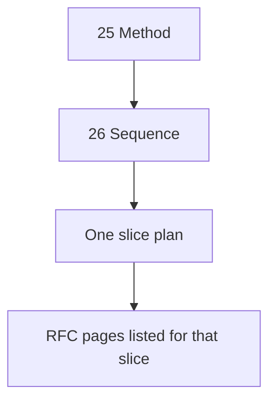

# Tobot Implementation Roadmap — Method

[Architecture index](README.md) · [Architecture review hub](00-architecture-review.md)

This file is a **program plan**, not an RFC Decision Record. It does not change 01–23. Tool choices here instantiate the hub implementation profile ([00-architecture-review.md](00-architecture-review.md) §6–9, DR-R2). They are not ports in the specification.

The current Adobos TypeScript monorepo is **not** a baseline, a migration source, or a naming authority. The product name is **Tobot**.

## Document status

| Attribute | Value |
|---|---|
| Status | Method for writing the implementation sequence |
| Audience | Implementation PM, tech lead, slice owners |
| Authority | 01–23 remain normative. This file does not implement modules. |
| Sequence | [26-implementation-roadmap.md](26-implementation-roadmap.md) |
| Slice plans | `roadmap/Sxx-*.md` — written later, one slice at a time, by reading that slice’s RFC list |

## 1. Locked product decisions

These were decided before writing the master roadmap. Later slice plans MUST NOT reopen them without an explicit program change.

| Decision | Choice | Consequence |
|---|---|---|
| Codebase stance | Greenfield Tobot | New repository layout. No port of discord.js, Express, or the existing panel as architecture. Contracts may be *re-specified* from 03, not copied from `@adobos/shared`. |
| Runtime | Rust first | Platform services are Rust. TypeScript exists for the three browser apps only. |
| Delivery shape | Twin-track | Every product slice ships a Discord operator or member surface **and** one `app.*` screen for the same module. Neither track waits for the other track to finish the whole product. |
| Voice audio | Deferred | §6.2 Voice Control / Voice Media stay undeployed until a bot-audio product exists. Temporary Room is not Voice. |
| Vector / embeddings | Not first product | DR-063. Do not add a vector database in early slices. |
| Money planes | Isolated and late | Guild ledger, commercial billing, and AI Credits are separate journals. They are not slice 1. |

## 2. What the roadmap is not

The master roadmap is the **order of slices**. It is not:

- A definition of how to implement any module.
- A rewrite of §7, §8, §10, or product files 15–23.
- A crate, table, endpoint, or Transport-operation catalog.
- A reason to read the whole RFC before the first slice.

How a module is built is decided in **that slice’s plan**, by reading only the RFC pages listed for that slice.

## 3. How we will write plans



### 3.1 Master sequence (`26`)

Write once. Keep it short. Each row is: name, what becomes true, what it depends on, which RFC to open **later**.

Do **not** wait on cluster extracts. Do **not** paste ownership tables.

### 3.2 Slice plans (Phase D, one at a time)

When a slice is next, open `roadmap/Sxx-*.md` and read **only** the RFC list in 26 for that slice. That is the first time crates, tables, commands, and tests are named.

Cadence: **plan one slice → implement that slice → plan the next.** Do not pre-write S0–S8. A Plan-mode pass that turns the slice file into tasks is part of that slice, not a reason to draft later slices.

Do not draft S1 while S0 is unplanned or unimplemented. Do not pre-write S1–S8 implementation.

### 3.3 Spine (for the sequence only)

The sequence was chosen from README, hub §6–9, 01 §1–3, 02 §6.2, 14 §25, and 13’s existence as a later test source. It does not require a linear re-read of 01–23.

## 4. Prioritization principles (Discord platform PM)

Guilds install a bot because it **does something in the server** and operators can **see and undo it**. They do not install a complete SaaS catalog.

| Principle | Apply as |
|---|---|
| Thin verticals, not horizontal layers | Do not “finish all backend modules” then UI. Do not “finish the whole dashboard” then Discord. |
| Skeleton before features | No product slice until Gateway ACK, Transport, inbox/outbox, tenant predicate, and a logged-in `app.*` shell exist. |
| Operator loop before economy | Timeout / kick / case log beats shop, casino, and AI. |
| Member-visible proof second | One lifecycle or auto-reply message proves Delivery without opening the guild ledger. |
| Blast-radius last | Monetary Ledger, Billing, AI Credits, and provider HTTP are their own failure domains. They wait. |
| One writer per Discord mutation class | Assignment is the only member-role Transport client (DR-068). Cases own punitive desired state. Do not “just PATCH roles” to ship faster. |
| Enablement is an install union | Permissions bitfield is the enabled-module union. Administrator is never default (DR-032). Early slices enable few modules. |
| Fairness and leases from day one | Tenant fairness MUST. Due-work `lease_ttl` 15s. Do not prototype with infinite in-process queues. |

Default sequence lives in [26-implementation-roadmap.md](26-implementation-roadmap.md). This file keeps the reasons.

## 5. Frontend: with the backend, not after

Twin-track does **not** mean two full products in parallel. It means **shared shell once, then one island per slice**.

**S0 shell (required before S1):**

- Three Astro apps: sessionless `docs.*`, sessionless `www`, cookie site `app.*` (DR-045).
- Discord OAuth on `app.*` only, PKCE S256, opaque session, `SameSite=Lax` (DR-026, DR-049).
- Guild picker and Query REST poll. No product WebSocket (DR-043).
- Nav is a stub. Only routes that exist are login, guild home, and “not enabled”.

**Each later slice adds:**

- One Discord command, component, or message path.
- One `app.*` React island under `dashboard/<category>/` equivalent.
- Enablement flag so the install permission union can grow (DR-032).

**Do not:**

- Build the entire settings IA before S1.
- Put OAuth or cookies on `www`.
- Treat a dashboard-posted `paid` / `entitled` / Discord permission bit as authorization (DR-027).

## 6. Service build order vs module catalog

§6.2 is the launch topology, not a Kanban of sixty modules. First binaries:

1. **Discord Edge** — Gateway Edge, Interaction Edge.
2. **Delivery** — Transport, Capability, Delivery Orchestrator (Reconciliation can be thin).
3. **Control Plane** — Identity, Installation, Control API, Query.
4. Host the **first product module** inside Safety (S1), not a new process.

Additional §6.2 processes appear when that slice’s failure domain is real: Messaging when S2 ships, Monetary Ledger when S6 ships, Billing when S7 ships, AI when S8 ships. Co-locate early if the team is small; do not merge Gateway with Billing, and do not put the bot token on Control API (DR-035).

## 7. Toolchain profile (2026, Rust-first)

Pin exact crate and npm versions in the **S0 slice plan**, against current docs. The names below are the profile, not RFC MUSTs, and MUST NOT be copied into 26 as if they were the sequence.

### 7.1 Repository layout (target)

```
tobot/
  Cargo.toml                 # workspace
  crates/
    tobot-envelope/          # §8.1–8.2 JSON, schema_version N/N-1
    tobot-clock/             # Clock port
    tobot-outbox/            # outbox dispatcher, SKIP LOCKED claims
    tobot-discord-adapter/   # twilight (or equivalent) behind Transport/Gateway ports
    …
  bins/                      # one binary per §6.2 service that exists
  apps/
    docs/                    # Astro, sessionless
    www/                     # Astro, sessionless
    app/                     # Astro SSR + React islands, cookie site
  contracts/                 # JSON Schema or proto-free JSON examples for envelopes
```

TypeScript stays in `apps/`. It MUST NOT own Discord HTTP, money, or Gateway.

### 7.2 Rust (platform)

| Concern | Library | Notes |
|---|---|---|
| HTTP | Axum + Tower + Hyper + Tokio | Raw `Bytes` for Stripe/Discord webhook bodies when those slices exist |
| Discord Gateway / REST | twilight (gateway + http) as **adapter only** | Domain modules MUST NOT take twilight types. serenity is acceptable only as an adapter, not as the domain. |
| JSON | serde + serde_json | Canonical envelopes are versioned JSON (DR-040) |
| Postgres | sqlx (runtime Postgres) + versioned SQL migrations | Matches DR-064 better than schema-push ORMs. SeaORM is a later convenience, not the migration authority. |
| Intra-service jobs | `SELECT … FOR UPDATE SKIP LOCKED` | Not Redis as authority |
| Cross-service bus | Redis Streams client (`redis` or `fred`) after outbox | DR-039 |
| Wake-up hint | Postgres `LISTEN/NOTIFY` | Not durability |
| TLS / HTTP client | reqwest + rustls | SSRF pin-and-deny in Asset and provider adapters (DR-029) |
| Crypto | ed25519-dalek when interaction webhooks exist; secrets via a Secret Store adapter | First product is Gateway-first (DR-042) |
| Observability | tracing + OpenTelemetry OTLP | Span attributes share the log allowlist (DR-038) |
| IDs | UUID v7 or ULID for platform ids; Discord snowflakes only as correlation | `tenant_id` is not a snowflake (DR-059) |
| Tests | cargo test, sqlx offline, wiremock, insta for envelopes | Slice DoD from 13 |

Avoid in first product: gRPC-first, Kafka-first, Diesel as migration authority, `SELECT *` mappers, Discord SDK types in application services, in-process queues as the due-work log.

### 7.3 JavaScript / TypeScript (browser only)

| Concern | Library | Notes |
|---|---|---|
| Apps | Astro (current 5/6 line) | Three apps. Starlight MAY on `docs.*` |
| Islands | React | Hydrate only interactive dashboard widgets |
| Styling | Tailwind CSS v4 + existing design-system components | Utility-first; no CSS-in-JS as source of truth |
| Forms | react-hook-form + zod | Client validation is UX; Control API remains authority |
| Data | fetch to Query and Control API; TanStack Query MAY | REST poll. No product WebSocket |
| Lint / types | TypeScript strict, Biome or ESLint+Prettier | Match the app workspace; do not lint Rust with Biome |

Avoid: Next.js unless Phase C records a team constraint; SPA holding Discord tokens; OAuth on `www`; parent-domain cookies.

### 7.4 Operations

| Concern | First adapter |
|---|---|
| Containers | Multi-stage rustc + distroless or debian-slim; separate frontend image or static `docs`/`www` |
| Orchestration | Compose for local; Kubernetes or equivalent later. Not required to name a cloud in the RFC |
| Secrets | Env/file mounts from a Secret Store port. Bot token only on Gateway and Transport |
| CI | `cargo fmt`, `clippy -D warnings`, `cargo test`, Astro `check`, contract snapshot tests |

## 8. Slice plan template

Every `roadmap/Sxx-*.md` uses this skeleton:

1. **Outcome** — one Discord behavior + one `app.*` screen.
2. **Enabled modules** — the install permission union for this slice.
3. **Services / crates touched.**
4. **Inbound contracts** — `schema_name` leaves that MUST parse; names that MUST fail closed.
5. **Outbound Discord** — which Transport operations; never replace-all roles.
6. **Data** — owner tables; expand/contract if breaking.
7. **Tests** copied from 13 that this slice MUST turn green.
8. **Explicitly out of scope.**
9. **Demo script** — install, run the Discord action, see it on `app.*`, recover a worker kill under 60s.

## 9. Next iteration

Plan **S0 only**: `roadmap/S00-platform-skeleton.md`, reading the RFC list in 26 for that slice. Do not write S1–S8 implementation in the same pass.
