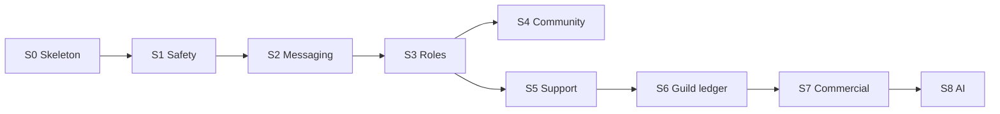

# Tobot Implementation Roadmap — Sequence

[Architecture index](README.md) · [Method](25-implementation-roadmap-method.md) · [Architecture review hub](00-architecture-review.md)

This document is the **implementation sequence**. It is not a module design, not a crate list, and not a substitute for 01–23.

How a slice is built is decided later, in `roadmap/Sxx-*.md`, by reading **only** the RFC pages in that row.

Program locks (greenfield Tobot, Rust platform, twin-track, money late) are in the [method](25-implementation-roadmap-method.md) §1. Toolchain names wait for the S0 slice plan.

## Document status

| Attribute | Value |
|---|---|
| Status | Sequence only |
| Authority | 01–23 remain normative |
| Next plan | `roadmap/S00-platform-skeleton.md` |

## 1. What becomes true, in order

S4 is skippable if S1–S3 are not yet honest. S5 does not require S4. S6+ do not start while Safety, Delivery, or install are still fictional.

| Slice | After this slice | Depends on | Twin-track (one Discord path + one `app.*` screen) |
|---|---|---|---|
| **S0** Platform skeleton | A guild can install the bot. Gateway accepts and ACKs an interaction. An operator can log in on `app.*` and see the guild. | — | ACK/defer on `INTERACTION_CREATE`. Sessionless `docs.*` and `www`. `app.*` OAuth, guild switcher, Query poll shell. |
| **S1** Safety operator loop | A moderator can punish a member and see the case. | S0 | One of timeout or kick through Cases → Transport. Quarantine, if included, through Cases → Assignment (DR-068). Case list + detail on `app.*`. |
| **S2** Messaging proof | The bot can deliver one durable guild message path. | S0, Delivery used by S1 | One of: lifecycle join-message **or** auto-reply. Matching config screen on `app.*`. Choice is made in the S2 plan. |
| **S3** Roles self-service | A member or policy can change **one** role without staff running S1. | S1 | One of: auto-role policy **or** one role panel. Editor on `app.*`. Assignment remains the only member-role Transport client. |
| **S4** One community vertical | Optional. One member-experience loop, still no money. | S2, S3 | Starboard **or** XP, not both. One screen. Skip if S1–S3 leak. |
| **S5** Support | Staff can open and handle a ticket. | S1 | Ticket panel in Discord + ticket inbox on `app.*`. |
| **S6** Guild ledger | First conserved plane. | S5 honest, or S3 if Support is deferred by program change | One earning action + wallet read. Not shop, not casino. |
| **S7** Commercial billing | Second conserved plane. | S6, Control Plane, Provider Event Edge | Hosted checkout and Platform Entitlement projection on `app.*`. No requirement for a Discord storefront. |
| **S8** AI Credits + one operation | Third conserved plane. | S7 | One billable operation class in Discord. Usage plus reservation `Uncertain` / `Disputed` on `app.*` (DR-070). |

## 2. Off this ladder until named later

Do not insert these as secret work inside S0–S5:

- Casino, shop catalog, guild-reward commerce
- Custom-command sandbox and reminder product
- Template marketplace
- Stream alerts / live integrations beyond Edge existing for S7
- Bot voice audio (deferred in §6.2)
- Vector / embedding store (DR-063)
- Interaction HTTP webhook mode (first product is Gateway, DR-042)
- Billing as a public webhook listener (DR-067)
- Replace-all member role list (DR-068)

## 3. RFC to open when that slice is planned

The sequence does not copy these files. The slice plan reads them.

| Slice | Read when planning (stop there) |
|---|---|
| S0 | 01 §3.1–3.3, 02 §6.2–6.4 and Edge / Control / Transport modules, 03 §8.1–8.2 and §8.6 leaf names in use, 04 §9.1–9.2, 07 inbox/outbox, 11 fairness and Gateway, 12 session / secrets / metrics, 13 tests for ACK, CSRF, PKCE, tenant predicate, 14 §25 for those modules, 23 §34.4–34.7, 00 §6–9 as adapter profile, 25 §5–8 |
| S1 | 02 Cases, Auto Mod, Assignment, Transport, Capability; 04 §9.17a; 05 case and assignment machines; 08 data; 14 invariants 232 and Cases/Assignment rows; 15; 16 only if quarantine/lockdown is in the slice; 13 dual-writer and hierarchy tests |
| S2 | 02 Lifecycle, Message Catalog, Auto Reply, Schedule, Delivery; 04 §9.5–9.8; 05 Delivery machine; 07; 11 backpressure; 13 Delivery / DLQ tests |
| S3 | 02 Assignment, Role Panel, Role Resource, Role Policy; 05 role machines; 08; 14 DR-068; 17; 13 role tests |
| S4 | 02 chosen community module only; 18 corresponding section; 09 only if that module stores there; 13 matching tests |
| S5 | 02 Support modules; 10 support data; 20; 13 support tests |
| S6 | 02 Monetary Ledger + Earnings; 03 money-plane `VirtualPayment` (DR-065); 05 ledger/earning machines; 09; 19; 13 ledger tests |
| S7 | 02 Billing, Platform Entitlement, Provider Event Edge, Installation; 03 `CommercialPayment` and `PlatformEntitlement*` (DR-065, DR-069); 04 §9.36 and §9.47; 10a; 23 billing/install; 13 payment ACK and entitlement tests; DR-046, DR-051–067 |
| S8 | 02 AI modules; 03 `AiCreditReservation` and 8.46–8.47; 05 §10.39–10.40; 10a AI; 23 AI; 13 lot/reservation/Disputed tests; DR-003, DR-061–063, DR-070 |

Shared on every slice after S0: 14 §25 forbidden column for modules you touch; 13 tests named in that slice’s RFC list; install permission union (DR-032).

## 4. Twin-track rule (sequence, not design)

S0 ships the shell. Every later slice ships **one** Discord path and **one** `app.*` island for that path. The dashboard IA is not a slice. Full-nav completeness is not a milestone.

## 5. Services vs slices

§6.2 names launch **failure domains**, not a build queue of sixty modules.

| When the slice ships | A distinct process is justified if |
|---|---|
| S0 | Discord Edge, Delivery, and Control Plane already cannot share fate |
| S2 | Messaging volume would harm Gateway or Safety |
| S6 | Guild money must not share the Safety database |
| S7 | Payment credentials and webhooks must not sit on Gateway |
| S8 | AI provider credentials and spend must not sit on Billing or Gateway |

Co-location is allowed early. Merging Gateway with Billing, or putting the bot token on Control API, is not.

## 6. Next

Write `roadmap/S00-platform-skeleton.md` using the S0 reading list above. Do not plan S1 in the same pass.
