# Automation Module

## Scope

This document covers only:

1. Custom Commands
2. Reminders

It describes the current repository implementation, the end-to-end path from the dashboard or a Discord user to the backend and Discord, an external comparison with the requested bots, and a recommended resilient architecture.

No application code is changed by this document. Future capabilities are explicitly marked `NEW` and are not part of the current implementation.

## Status vocabulary

| Marker | Meaning |
|---|---|
| `IMPLEMENTED` | Behavior verified in the current repository source. |
| `LIMITATION` | Current behavior that is narrower, incomplete, or operationally risky. |
| `NEW — RESEARCH` | A capability documented by an external bot and not evidenced in this repository. |
| `NEW — RECOMMENDED` | A design, reliability, security, scalability, or UX improvement recommended for this project. |
| `NOT EVIDENCED` | No sufficiently specific public documentation was found for the requested bot/capability. This does not prove that the bot lacks it. |

## Executive summary

| Capability | Current behavior | Durable state | Discord-side effect |
|---|---|---|---|
| Custom Commands | Guild-scoped slash commands with text/embed responses, variables, optional text/user arguments, role/channel allow and ignore lists, cooldown, ephemeral/DM/auto-delete options | `custom_commands` | Guild slash-command registration and an interaction response |
| Reminders | Personal one-shot reminders created with relative or absolute time; `/remind list` and owner/staff cancellation | `reminder_settings`, `reminders` | DM first; channel mention fallback; pending reminder deletion after delivery |

`Custom Commands` is an interaction-driven automation feature. `Reminders` is a durable scheduled-delivery feature. They share guild context, validation, Discord delivery, and queue infrastructure, but they are not currently implemented as one generic automation engine.

## Evidence and current dashboard status

The behavior in this document was verified against:

- `backend/src/modules/custom-commands/`
- `backend/src/modules/reminders/`
- `backend/src/db/schema/customCommands.ts`
- `backend/src/db/schema/reminders.ts`
- `packages/shared/src/custom-commands.ts`
- `packages/shared/src/reminders.ts`
- `frontend/src/features/custom-commands/CustomCommandsDashboard.tsx`
- `frontend/src/features/reminders/RemindersDashboard.tsx`
- `frontend/src/lib/api/custom-commands.ts`
- `frontend/src/lib/api/reminders.ts`
- `frontend/src/pages/dashboard/automation/custom-commands.astro`
- `frontend/src/pages/dashboard/automation/reminders.astro`

Both Astro pages currently render `DashboardLayout` while their React island import and `client:load` mount are commented out. The API clients and React feature components exist, but the reviewed dashboard pages are not currently hydrated.

| Route | Current page behavior | Island |
|---|---|---|
| `/dashboard/automation/custom-commands` | Layout shell and metadata | `CustomCommandsIsland` commented out |
| `/dashboard/automation/reminders` | Layout shell and metadata | `RemindersIsland` commented out |

---

# 1. Custom Commands

## 1.1 Implemented behavior

`Custom Commands` creates guild-specific Discord slash commands. The dashboard/API persists a definition; the backend projects active definitions to Discord; and the interaction router delegates an otherwise-unmatched chat-input interaction to the custom-command handler.

The current implementation supports:

- lowercase names using `a-z`, `0-9`, `_`, or `-`, from 1 to 32 characters;
- descriptions up to 100 characters;
- plain text, an embed, or both;
- embed title, description, color, and image;
- optional `{text}` string input;
- optional `{target}` user input, exposed as slash option `user`;
- ephemeral responses;
- DM responses;
- fixed response auto-delete after 15 seconds;
- per-user/per-command cooldown, up to 86,400 seconds;
- controlled mention behavior;
- allowed/ignored roles and channels;
- activation/deactivation;
- manual re-sync;
- entitlement checks;
- variables for the invoker, target, guild, channel, UTC time, and optional level/XP.

The runtime does not implement a prefix/message-triggered path. These commands are slash commands.

## 1.2 Persistence and limits

`custom_commands` contains:

| Field | Current behavior |
|---|---|
| `id` | Identity integer primary key |
| `guildId` | Required; FK to `guild_settings` with cascade delete |
| `name` | Normalized and unique per guild |
| `description` | Defaults to `Custom command` |
| `responseData` | JSON document for content and optional embed |
| `options` | JSON document for execution and argument options |
| `permissions` | JSON document for role/channel lists |
| `isActive` | Projected and executable only when true |
| `createdAt`, `updatedAt` | Timestamps |

A unique index enforces `(guildId, name)`. Active commands are limited by Discord's 100 guild slash-command limit; product entitlements impose a separate stored-command limit.

## 1.3 Dashboard/API flow

The React builder loads commands and guild roles/channels in parallel and supports create, edit, copy, toggle, delete, re-sync, preview, variables, embeds, and selectors.

| Method | Endpoint | Purpose |
|---|---|---|
| `GET` | `/api/custom-commands` | List guild commands |
| `POST` | `/api/custom-commands` | Create and attempt sync |
| `GET` | `/api/custom-commands/:id` | Read one command |
| `PATCH` | `/api/custom-commands/:id` | Update and attempt sync |
| `POST` | `/api/custom-commands/:id/toggle` | Change active state and attempt sync |
| `POST` | `/api/custom-commands/sync` | Explicitly sync active commands |
| `DELETE` | `/api/custom-commands/:id` | Delete, then attempt sync |

The routes resolve the guild through `guildIdOf(req)`. A feature-specific administrator guard is not visible in the route module; global dashboard authorization must be verified separately.

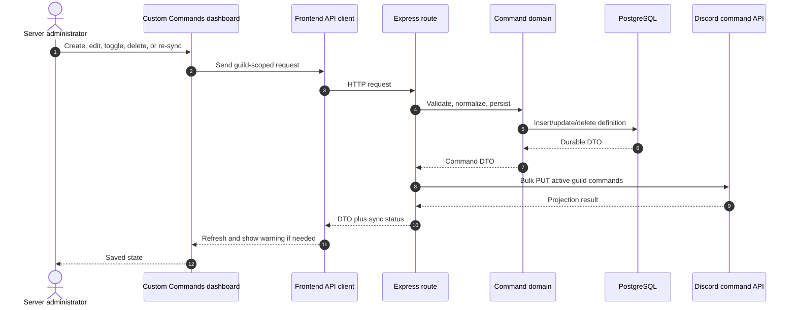

Persistence occurs before synchronization. Create/update/toggle can return `synced: false` when the bot is not ready or Discord rejects the sync. The definition remains in the database for manual re-sync.

`DELETE` is weaker: it deletes first and synchronizes afterward. A failed sync can return an error while leaving Discord with a stale command.

## 1.4 Discord command projection

`syncGuildSlashCommands`:

1. Requires a bot token and guild ID.
2. Reads only active definitions.
3. Excludes reserved built-in names.
4. Adds optional Discord string `text` and user `user` options.
5. Compares the cached guild projection when available.
6. Skips PUT when unchanged.
7. Otherwise bulk-overwrites `applicationGuildCommands(clientId, guildId)`.

A `guildCreate` listener also attempts synchronization after the bot joins a guild.

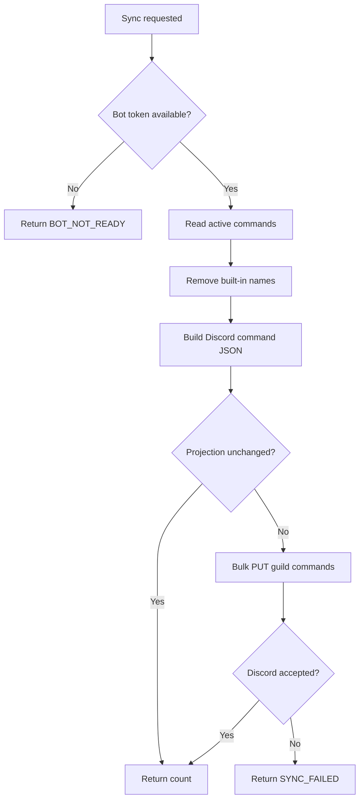

## 1.5 Invocation and rendering flow

The central function is `handleCustomChatCommand`.

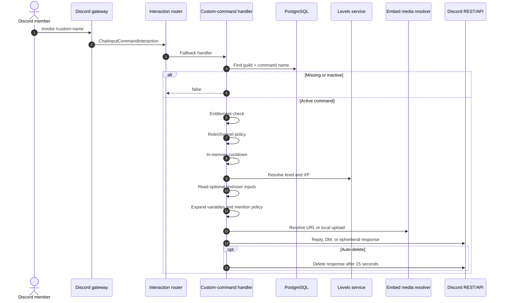

Execution order:

1. Return `false` for direct messages without a guild.
2. Find the command by guild and interaction name.
3. Return `false` when missing or inactive.
4. Check the `custom-commands` entitlement.
5. Evaluate role/channel permissions.
6. Evaluate the per-user cooldown.
7. Resolve level/XP; lookup failures become fallback values.
8. Read `text` and `user` only if enabled.
9. Expand the response.
10. Build a bounded payload with allowed mentions.
11. Deliver by DM or interaction reply.

Ignored roles/channels take precedence over allowed lists. A non-empty allow-list requires membership in that list.

### Response details

| Feature | Current behavior |
|---|---|
| Plain text | Maximum 2,000 characters; can be empty when an embed exists |
| Embed title | Runtime maximum 256 |
| Embed description | Runtime maximum 4,096 |
| Color | Hex converted to integer; invalid values use Discord blurple |
| Image | `/uploads/` or HTTP(S), resolved through `resolveEmbedMedia` |
| `ephemeral` | Reply visible only to invoker |
| `dmResponse` | Sends full payload to user DM, then ephemeral success/failure confirmation |
| `autoDelete` | Fetches reply and attempts deletion after 15 seconds |
| `disableMentions` | No parsed mentions |
| `allowEveryone` | Enables `{everyone}`/`{here}` expansion and `everyone` parsing |
| Role mentions | Never enabled by the shared allowed-mention policy |

Invalid image media is logged and omitted; the rest of the response can still be delivered. The invoker/target are explicitly allowed only when the raw template contains their variables.

## 1.6 Variable contract

| Group | Variables |
|---|---|
| Invoker | `{user}`, `{user.mention}`, `{user.id}`, `{user.name}`, `{user.username}`, `{user.nick}`, `{user.avatar}`, `{avatar}`, `{username}`, `{user.createdAt}`, `{user.joinedAt}`, `{user.level}`, `{user.xp}` |
| Server | `{server}`, `{server.name}`, `{server.id}`, `{server.icon}`, `{server.memberCount}`, `{server.ownerID}`, `{server.createdAt}` |
| Channel | `{channel}`, `{channel.name}`, `{channel.id}`, `{channel.mention}` |
| Arguments | `{text}`, `{target}`, `{target.mention}`, `{target.username}`, `{target.id}` |
| Time | `{time}`, `{time12}`, `{date}`, `{datetime}`, `{datetime12}` |
| Mention controls | `{everyone}`, `{here}`; safe text unless `allowEveryone` is enabled |

Time variables use UTC. Account/join/server dates use server-side `es-MX` formatting in UTC, independent of the reminder timezone.

## 1.7 Current limitations

| Limitation | Consequence |
|---|---|
| Dashboard island is not mounted | The route shows a shell instead of the React builder |
| Cooldowns are process-local `Map` entries | Restarts clear them; instances do not share them; stale keys have no explicit cleanup |
| Only active definitions are projected | Inactive database definitions are absent from Discord |
| Sync is coupled to mutation requests | A transient Discord failure requires manual re-sync |
| Delete persists before sync | Discord may retain a deleted command until a later sync |
| One response and one embed only | No multi-destination or action pipeline |
| No execution audit record | Invocation/render/delivery failures are not reconstructable |
| Media errors are soft | Misconfigured images are omitted rather than rejected visibly |
| Route-level admin guard is not shown | Global authorization must be verified |

---

# 2. Reminders

## 2.1 Implemented behavior

Reminders are personal, one-shot scheduled notifications. A member creates one in a server channel with `/remind in` or `/remind at`. The record stores guild, user, origin channel, text, due time, attempts, and creation time. Delivery tries DM first, then mentions the owner in the original channel.

Current features:

- server-only creation;
- relative durations such as `20m`, `2h`, `1d12h`, `1w`;
- absolute `15:00` in the guild timezone;
- ISO `2026-09-03 18:30` in the guild timezone;
- Unix timestamps and Discord `<t:...>` tags;
- ISO date without time defaults to 09:00;
- minimum delay 60 seconds, maximum 365 days;
- normalized text maximum 1,000 characters;
- maximum 25 pending reminders per user and 200 per guild;
- `/remind list`, showing up to ten rows plus an overflow count;
- owner cancellation or `Manage Guild` staff cancellation;
- ephemeral creation confirmation with Cancel button;
- guild timezone and enabled settings;
- leader-gated polling every 15 seconds;
- `FOR UPDATE SKIP LOCKED` row claim;
- two-minute claim lease;
- BullMQ/Redis delivery or inline fallback;
- five attempts, deleting after the fifth failed delivery.

There is no recurrence, edit, snooze, or repeat model. Every row is one-shot and is deleted after successful delivery.

## 2.2 Settings and dashboard API

| Setting | Current behavior |
|---|---|
| `timezone` | Normalized scheduled timezone for `/remind at` |
| `enabled` | Defaults true; blocks new creation when false |
| `updatedAt` | Last settings update |

| Method | Endpoint | Purpose |
|---|---|---|
| `GET` | `/api/reminders` | Settings plus all guild pending reminders |
| `PATCH` | `/api/reminders/settings` | Update timezone/enabled |
| `DELETE` | `/api/reminders/:id` | Dashboard staff cancellation; route passes `staff: true` |

The React dashboard lists every pending row with user ID, due time, and message, but its Astro island mount is currently commented out.

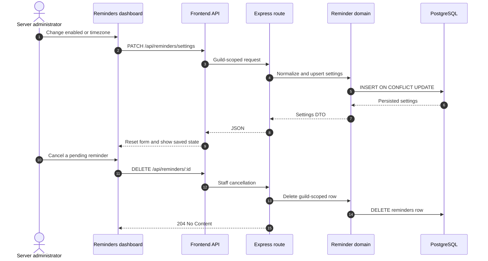

## 2.3 Discord command surface

| Command | Options | Behavior |
|---|---|---|
| `/remind in` | required `when`, `text` | Relative duration |
| `/remind at` | required `when`, `text` | Absolute time/date |
| `/remind list` | none | Invoker's pending reminders, ephemeral |
| `/remind cancel` | required integer `id` | Owner cancels; `Manage Guild` can cancel any |

Creation requires a guild channel and enabled reminders. Confirmation is ephemeral and contains a Discord timestamp, normalized text, and `rmd_x_<id>` Cancel button.

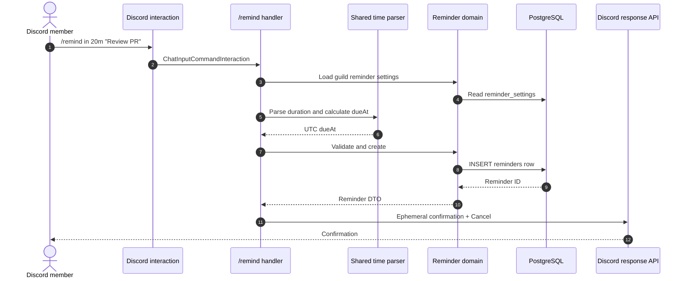

## 2.4 Time parsing

Relative mode accepts English and Spanish aliases for seconds, minutes, hours, days, and weeks. A number without a unit defaults to minutes. Examples:

```text
20m
2h
1d12h
1w
30 minutos
```

Absolute mode tries:

1. Unix timestamp or Discord `<t:...>`.
2. ISO date/time `YYYY-MM-DD` with optional `HH:MM[:SS]` in the guild timezone.
3. `HH:MM` in the guild timezone; if already passed, the next civil day is used.

Stored `dueAt` is UTC. Timezone affects parsing, not storage or scheduler time.

## 2.5 Scheduler, claim, and delivery

The module registers a job and polls every 15 seconds. Only the worker leader calls `processDueReminders`.

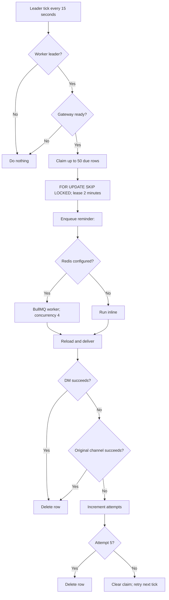

Claim conditions are due time, attempts below five, and a null/expired lease. The query orders by due time, limits 50, locks with `FOR UPDATE SKIP LOCKED`, and sets `claimed_until` two minutes forward.

With Redis, the shared queue uses BullMQ defaults: five queue attempts and exponential backoff for thrown worker errors. Without Redis, `add()` executes the handler inline. Delivery failures that are handled by the reminder domain increment the durable attempt count; gateway-not-ready exceptions reach the queue retry path.

Delivery order:

1. Reload the fresh row.
2. Try DM: `⏰ Reminder: <message>`.
3. If DM fails, resolve and send in the original channel.
4. Voice, stage, category, forum, and media channels are treated as non-sendable.
5. Channel fallback uses `<@userId>` and `allowedMentions.users` restricted to the owner.
6. Delete after either path succeeds.
7. Increment attempts after both paths fail; delete after attempt five, otherwise clear the claim.

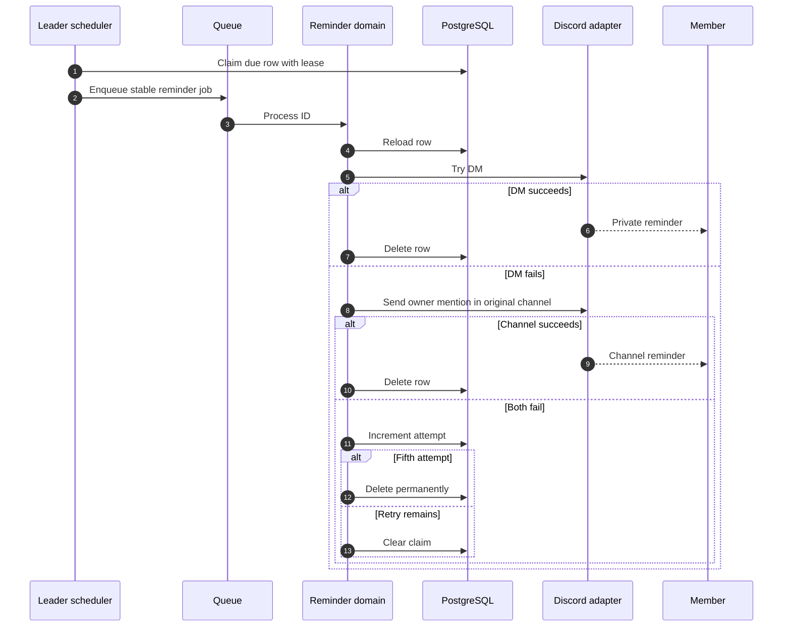

## 2.6 Current limitations

| Limitation | Consequence |
|---|---|
| Dashboard island is not mounted | Staff cannot use the React settings/list UI through the current page shell |
| Disable blocks creation only | Existing reminders are still delivered; scheduler does not re-check `enabled` |
| One-shot only | No recurrence, snooze, edit, or reschedule |
| Fixed DM→channel fallback | No DM-only, channel-only, alternate channel, or custom payload policy |
| Fifth failure deletes the row | No dead-letter record or user/operator failure receipt |
| Fixed 15-second polling | Normal delivery can be late by the polling interval |
| Dashboard returns all pending rows | No pagination for large guild lists |
| Route passes `staff: true` | Global dashboard authorization must be confirmed |
| No delivery history | Attempts, route choice, and Discord errors are not inspectable |
| Guild-only timezone | No per-user timezone |
| No origin message ID | No jump-to-creation-message link |

---

# 3. External comparison

The comparison uses official documentation or official documentation repositories. `NOT EVIDENCED` means no sufficiently specific public page was found, not proof of absence.

## 3.1 Custom Commands

| Bot | Documented behavior | Gap versus current project |
|---|---|---|
| Sapphire Bot | The official app listing describes custom and scheduled messages. Sapphire framework docs describe application-command handling, but no product-level Custom Commands schema was found. [NOT EVIDENCED] | No safe feature-parity claim. |
| ProBot | Dashboard docs describe aliases, enabled/disabled roles and channels, toggles, and multiple auto-delete behaviors. | `NEW — RESEARCH`: aliases, explicit permission UI, and separate invocation/reply deletion controls. |
| CommunityOne | No authoritative public Custom Commands page found. [NOT EVIDENCED] | No parity claim. |
| MEE6 | Custom Commands support arguments, defaults, ranges, and copying remaining input; role/channel permissions are configurable. | `NEW — RESEARCH`: typed/positional arguments, defaults, and usage fallback. |
| Dyno | Custom Commands support static text, embeds, variables, cooldown, delete-after, required arguments, additional responses, DM/channel destinations, and actions. | `NEW — RESEARCH`: required/typed args, multiple destinations, actions, configurable deletion. |
| Carl-bot | Official docs repository indexes Custom Commands, but the reviewed public pages did not expose a complete current schema. [PARTIAL EVIDENCE] | No exact field-level claim. |
| Arcane | Custom Commands use static/scriptable responses through a tag system, with cooldown, NSFW control, and dashboard sync. | `NEW — RESEARCH`: safe conditional/tag actions and NSFW policy. Keep arbitrary code execution out of scope. |
| Invite Tracker | Official docs focus on invite/message tracking and join messages; no Custom Commands feature evidenced. [NOT EVIDENCED] | No parity requirement. |
| UnbelievaBoat | Docs describe granular user/role/channel command permissions and enable/disable overrides, not a Custom Commands builder. [NOT EVIDENCED] | Optional `NEW — RESEARCH` user-level overrides. |

## 3.2 Reminders

| Bot | Documented behavior | Gap versus current project |
|---|---|---|
| Sapphire Bot | Official listing documents customizable/scheduled messages, not personal reminder semantics. [NOT EVIDENCED] | Do not conflate scheduled announcements with personal reminders. |
| ProBot | No authoritative reminder feature page found. [NOT EVIDENCED] | No parity claim. |
| CommunityOne | No authoritative public reminder documentation found. [NOT EVIDENCED] | No parity claim. |
| MEE6 | Official help includes a Reminder plugin/default message and reminder-related permission requirements, but not full parser/recurrence/failure semantics. | Current implementation is more explicit operationally; no undocumented parity should be assumed. |
| Dyno | Dyno lists Reminders and `/remindme`; release notes mention improved parsing and a Jump to Message button. | `NEW — RESEARCH`: retain origin message ID and expose jump link. |
| Carl-bot | Reminders support list/mine, cancel, clear, subscribe, repeat, and inspection commands; docs note DM requirements. | `NEW — RESEARCH`: recurrence, subscribe, clear-all, metadata, explicit DM policy. |
| Arcane | No dedicated Reminders page found. [NOT EVIDENCED] | No parity claim. |
| Invite Tracker | Official docs cover invite/message tracking, not personal reminders. [NOT EVIDENCED] | No parity claim. |
| UnbelievaBoat | Official docs cover permissions/cooldowns, not personal reminders. [NOT EVIDENCED] | No parity claim. |

## 3.3 Research conclusions

The recurring external patterns are:

1. dashboard-controlled command enablement and permission policy;
2. richer argument schemas and defaults;
3. multiple response destinations and configurable deletion;
4. safe but expressive template/tag systems;
5. reminder list/cancel management;
6. recurring reminders and metadata;
7. jump links to the originating message.

These are research inputs, not instructions to copy every feature.

---

# 4. Gaps and new requirements

## 4.1 `NEW — RESEARCH` parity capabilities

### Custom Commands

- Configurable aliases, or an explicit slash-only policy in the UI.
- Typed/positional arguments with required values, defaults, and usage errors.
- Multiple response actions/destinations with a hard maximum.
- Configurable auto-delete duration instead of hard-coded 15 seconds.
- Original-invocation deletion if a message trigger is ever added.
- Optional NSFW-channel restriction.
- A richer but sandboxed tag/action vocabulary; never execute arbitrary JavaScript or arbitrary bot commands from user-authored templates.
- Optional user-level permission overrides.

### Reminders

- Repeat/recurrence with bounded count or end date.
- Edit/reschedule and snooze.
- Clear-all and metadata inspection.
- Origin message ID and jump link.
- Explicit DM-only, channel-only, or fallback policy.
- Optional per-user timezone.

## 4.2 `NEW — RECOMMENDED` reliability/security improvements

- Move cooldowns to a shared atomic TTL store such as Redis, with a documented single-instance fallback.
- Add a transactional outbox for Discord slash-command projection.
- Add periodic guild reconciliation to repair Discord/database drift.
- Make projection operations idempotent and versioned; deletion must enqueue a retryable projection even when Discord is down.
- Persist reminder attempts, provider errors, selected route, and terminal status in bounded delivery/dead-letter history.
- Use earliest-due wake-ups plus periodic reconciliation as a safety net.
- Define whether disabling Reminders pauses existing rows, blocks delivery, or blocks creation; current behavior is creation-only.
- Add paginated reminder queries and matching indexes.
- Add authorization tests for every dashboard write and cancellation path.
- Add structured audit events for configuration and execution outcomes.
- Validate bot permissions and target channel accessibility before accepting/publishing.
- Add lease fencing so a late worker cannot deliver after a newer claim owns the execution.

---

# 5. Recommended design pattern

## 5.1 Durable control plane plus event-driven execution plane

The best fit is a tenant-scoped **Automation Definition + Projection + Durable Job** pattern:

- Control plane owns validated definitions and settings.
- Projection materializes definitions into Discord commands or scheduled jobs.
- Execution evaluates a frozen version and delivers to Discord.
- Outbox and idempotency keys bridge database state to external Discord state.
- Shared policy/template/delivery code is reusable by future modules.

Discord registration and delivery are external side effects and must not be treated as one synchronous transaction with dashboard persistence.

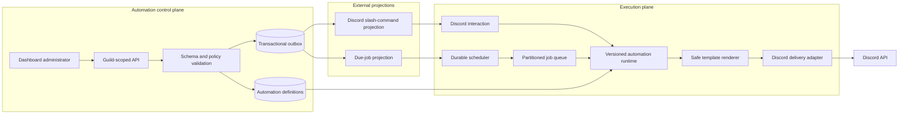

## 5.2 Canonical core model

```text
AutomationDefinition
  id
  guildId
  kind: "custom_command" | "reminder"
  status: "draft" | "active" | "paused" | "deleted"
  version
  trigger
  policy
  response
  schedule
  createdAt / updatedAt

AutomationExecution
  idempotencyKey
  definitionId
  definitionVersion
  subjectUserId
  guildId
  dueAt / startedAt / completedAt
  state: "claimed" | "delivered" | "retryable" | "dead_letter"
  attempts
  lastErrorCode
```

For Custom Commands, `trigger` is the slash name and `schedule` is null. For Reminders, `trigger` is the user-created reminder and `schedule` is one due instant or a bounded recurrence. Existing tables can remain feature-specific while this becomes the shared application boundary.

## 5.3 Reusable core pieces

| Core piece | Responsibility | Reuse |
|---|---|---|
| `GuildContext` | Authenticated guild, actor, permissions, bot availability | Consistent tenant/auth handling |
| `PolicyEvaluator` | Deterministic role/channel/user/Discord permission rules | Commands and future event modules |
| `TemplateRenderer` | Allow-listed token AST, output limits, mention policy | Any bot-generated message |
| `DiscordDeliveryAdapter` | DM/channel/embed/attachment/error normalization | Centralized delivery semantics |
| `ScheduleParser` | Relative, absolute, civil-time/timezone, recurrence parsing | Scheduled modules |
| `DurableJobClaim` | Lease, heartbeat, retry, terminal state | Worker-driven modules |
| `OutboxProjector` | Retry external Discord registrations | Eventual consistency |
| `IdempotencyKey` | Deduplicate retries and side effects | Commands and jobs |
| `AutomationAuditEvent` | Bounded change/execution outcome record | Operations and support |

## 5.4 Custom Commands target flow

```mermaid
sequenceDiagram
    autonumber
    actor Admin as Administrator
    participant API as Control-plane API
    participant DB as Definitions + outbox
    participant Projector as Slash projector
    participant Discord as Discord registry
    actor User as Member
    participant Runtime as Versioned runtime
    participant Delivery as Delivery adapter

    Admin->>API: Save command version N
    API->>DB: Transaction: definition + outbox event
    API-->>Admin: Saved; projection pending
    Projector->>DB: Claim sync event
    Projector->>Discord: Idempotent guild command PUT
    Discord-->>Projector: Projection result
    Projector->>DB: Mark version N projected
    User->>Discord: Invoke slash command
    Discord->>Runtime: Interaction + active version
    Runtime->>Runtime: Policy, cooldown, args, token AST
    Runtime->>Delivery: Rendered payload + idempotency key
    Delivery->>Discord: Reply/DM/attachment
    Runtime->>DB: Record outcome
```

Required invariants:

- Only a persisted active version with passing policy is executable.
- Definition updates are atomic.
- Discord projection is retryable and observable.
- Cooldown acquisition is atomic across instances.
- Templates access only allow-listed tokens/actions.
- Discord limits are checked before delivery.
- Mention authorization is derived from the rendered representation.

## 5.5 Reminders target flow

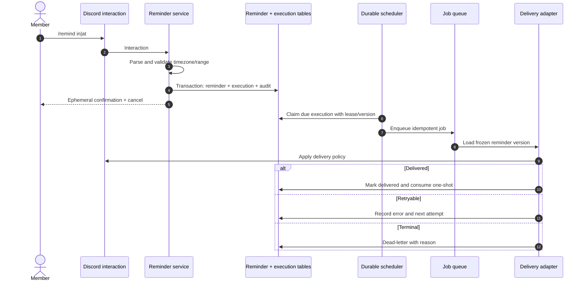

Required invariants:

- A due reminder has one active lease.
- Lease expiry recovers work after a crash.
- Retries cannot duplicate a successful notification.
- Executed content is immutable or explicitly versioned.
- Disabled-feature semantics are explicit.
- Terminal failures remain inspectable for bounded retention.
- Discord errors are classified into retryable and permanent classes.

## 5.6 State machines

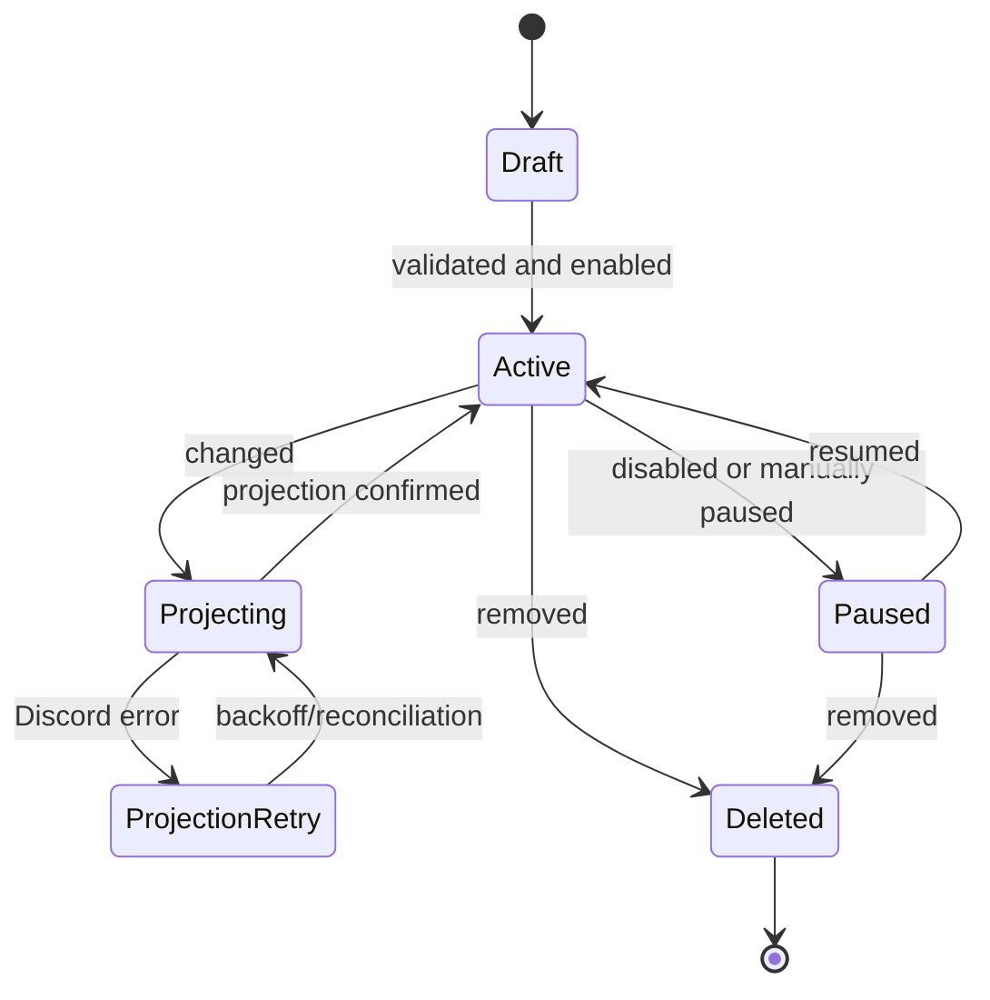

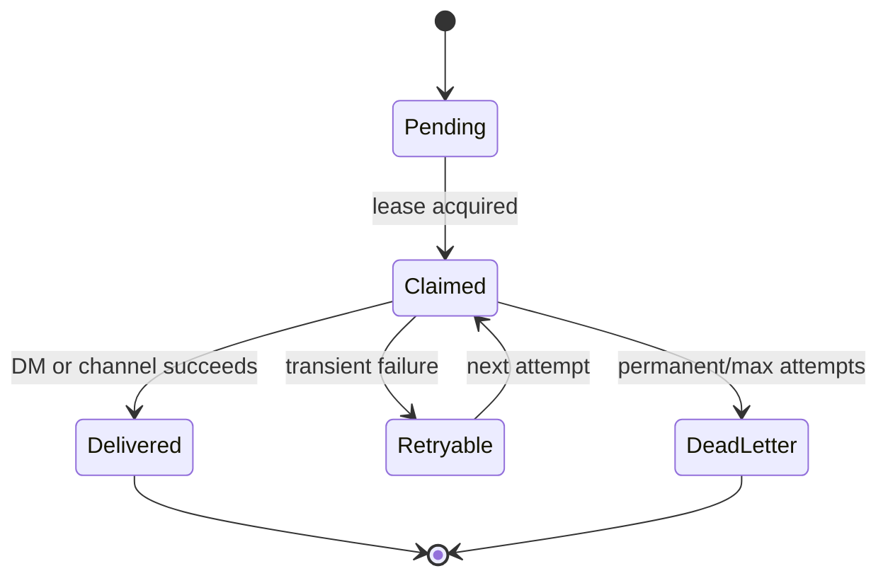

## 5.7 Recommended priorities

1. Restore and authorize both dashboard islands; paginate reminder administration.
2. Add shared cooldown/idempotency storage and Discord error classification.
3. Add transactional outbox and command projection reconciliation.
4. Add durable reminder execution history, terminal failure visibility, and defined pause semantics.
5. Replace raw string replacement with a bounded token AST while preserving current variables.
6. Add only desired product features: richer arguments, recurrence, rescheduling, and jump links.

---

# 6. Sources

- [Sapphire official Discord application listing](https://discord.com/discovery/applications/678344927997853742)
- [Sapphire application-command documentation](https://www.sapphirejs.dev/docs/Guide/commands/application-commands/what-are-application-commands/)
- [ProBot dashboard documentation](https://docs.probot.io/docs/getting-started/dashboard)
- [Dyno Custom Commands](https://docs.dyno.gg/modules/customcommands)
- [Dyno commands, including `remindme`](https://docs.dyno.gg/commands)
- [Dyno module list](https://docs.dyno.gg/en/modules)
- [Dyno Auto Message scheduling behavior](https://docs.dyno.gg/modules/automessage)
- [Dyno release notes mentioning reminder parsing and Jump to Message](https://docs.dyno.gg/en/whats-new)
- [MEE6 Custom Commands arguments](https://help.mee6.xyz/support/solutions/articles/101000385379-mee6-custom-commands-arguments)
- [MEE6 role/channel permissions](https://help.mee6.xyz/support/solutions/articles/101000484889-how-to-set-role-permissions-for-mee6-commands)
- [MEE6 permissions for Custom Commands and Reminder](https://help.mee6.xyz/support/solutions/articles/101000484903-what-permissions-does-mee6-need-)
- [MEE6 default messages including Reminder](https://help.mee6.xyz/support/solutions/articles/101000529703-default-settings-for-mee6-plugins)
- [Carl-bot official documentation repository](https://github.com/botlabs-gg/carlbot-docs)
- [Carl-bot utilities, including reminders](https://github.com/botlabs-gg/carlbot-docs/blob/master/docs/utilities.md?plain=1)
- [Arcane Custom Commands](https://docs.arcane.bot/plugins/custom-commands/)
- [Arcane Custom Commands setup and sync](https://docs.arcane.bot/plugins/custom-commands/setup)
- [Arcane Custom Commands rewrite/tag system](https://docs.arcane.bot/changelogs/3-11-2026/)
- [Invite Tracker official documentation](https://docs.invite-tracker.com/)
- [Invite Tracker general commands](https://docs.invite-tracker.com/commands/general)
- [UnbelievaBoat permissions overview](https://faq.unbelievaboat.com/permissions/overview/)
- [UnbelievaBoat user/role permissions](https://faq.unbelievaboat.com/permissions/user-role/)
- [UnbelievaBoat channel overrides](https://faq.unbelievaboat.com/permissions/channel/)
- [CommunityOne official site](https://communityone.io/)

## Repository evidence note

The repository index had no recorded coverage issue for the cited Automation paths except a parse-partial marker at line 42 of `backend/src/modules/custom-commands/module.ts`; that line was verified directly. Index coverage is best-effort and does not replace source review.

