# Community Module

## Scope

This document covers only the following Community capabilities:

1. Levels and XP
2. Starboard
3. Giveaways
4. Forms
5. Voice Rooms

It describes the current implementation in this repository, the end-to-end path from the dashboard or Discord user to the backend and Discord, an external comparison with the requested bots, and a future design recommendation.

No code is changed by this document. Recommendations are explicitly marked `NEW` and are not part of the current implementation.

## Status vocabulary

| Marker | Meaning |
|---|---|
| `IMPLEMENTED` | Verified in the current repository source. |
| `NEW — RESEARCH` | Observed in an external product's public documentation and not currently evidenced in this repository. |
| `NEW — RECOMMENDED` | Design, reliability, security, scalability, or UX improvement recommended for this project. |
| `NOT EVIDENCED` | No sufficiently specific public behavior documentation was found for the requested bot/feature. This is not proof that the product does not have the capability. |
| `LIMITATION` | Current behavior that is narrower, incomplete, or operationally risky. |

## Executive summary

| Capability | Current implementation | Durable state | Discord-side effect |
|---|---|---|---|
| Levels and XP | Text XP, active voice XP, role/channel/stream multipliers, ignored roles/channels, level rewards, level-up embed, HTTP leaderboard, throttled live top-10 leaderboard | `xp_config`, `xp_rewards`, `user_xp` | XP-triggered role assignment and level-up embed; live leaderboard message |
| Starboard | Reaction-based board with up to 10 configured emojis, one-count-per-user deduplication, threshold, self/bot controls, ignored channels, create/edit/delete synchronization | `starboard_settings`, `starboard_posts` | Board copy message with content, author, source link, first image, count |
| Giveaways | Dashboard creation/publishing, button entry, role/age gates, scheduled start/end, persisted entrants, winner selection, reroll, cancellation, DM/role notification options | Giveaway settings, giveaway rows, entry rows | Giveaway message, entry button, end announcement, optional DMs and role mention |
| Forms | Multi-form builder, Discord embed/button, modal questions, role gates, cooldown/once policy, response persistence, reception embed, accept/reject review, CSV export | Form rows, response rows | Published form message; reception notification; optional accepted role |
| Voice Rooms | Join-to-create hubs, temporary voice rooms, optional private text channel, owner/staff actions, permission controls, empty cleanup, ready reconciliation | Generator rows, live room rows | Voice/text channel creation, permission overwrites, member move, invites |

## Current integration topology

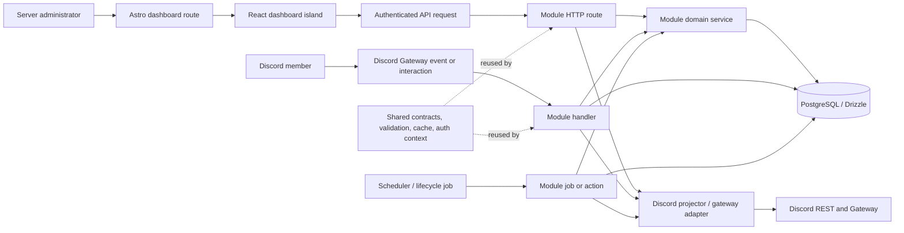

### Current dashboard availability

The React islands and API clients exist for all five capabilities. However, the five Astro routes currently import `DashboardLayout` while the corresponding island import and `client:load` mount are commented out:

| Route | Current shell | Current island mount |
|---|---|---|
| `/dashboard/community/levels` | `DashboardLayout` only | `LevelsIsland` commented out |
| `/dashboard/community/starboard` | `DashboardLayout` only | `StarboardIsland` commented out |
| `/dashboard/community/giveaways` | `DashboardLayout` only | `GiveawaysIsland` commented out |
| `/dashboard/community/forms` | `DashboardLayout` only | `FormsIsland` commented out |
| `/dashboard/community/voice-rooms` | `DashboardLayout` only | `VoiceRoomsIsland` commented out |

This means the backend feature paths and frontend implementation are present, but the documented dashboard pages are not currently hydrated by these route files.

---

# 1. Levels and XP

## 1.1 Current implementation

### Configuration surface

`LevelsDashboard` loads configuration and guild assets in parallel through:

- `GET /api/levels/config`
- the shared guild-assets endpoint for channels, roles, and guild icon

It saves through `POST /api/levels/config`.

The dashboard exposes:

- enable/disable switch;
- random text XP minimum and maximum;
- text cooldown in seconds;
- voice XP enable/disable;
- voice XP per minute;
- stream/screen-share multiplier;
- global XP multiplier;
- role multipliers;
- channel multipliers;
- ignored roles;
- ignored channels and parent categories;
- level-up channel;
- level-up embed title, message, color, thumbnail, and image value;
- persistent live leaderboard channel and appearance;
- level reward rows mapping a level to one role;
- a dashboard leaderboard table.

The effective runtime level-up format is embed-only. The request schema accepts `levelUpFormat: "EMBED"`, and the dashboard always sends that value. `levelUpImage` is persisted but is not read by the runtime announcement builder.

### Normalization and limits

The domain layer normalizes and clamps configuration before persistence:

| Setting | Current behavior |
|---|---|
| Text XP | Integer range `1..10,000`; minimum and maximum are swapped if reversed |
| Text cooldown | `0..86,400` seconds |
| Voice XP/minute | `0..10,000` |
| Global multiplier | `1..10` |
| Stream, role, channel multipliers | `0.1..20` |
| Rewards | Levels `1..500`, normalized, deduplicated, sorted |
| Role/channel ignore lists | Normalized Snowflake IDs |
| Live leaderboard | One configured text/announcement channel and one persisted message ID |

### XP formula

The implementation uses the following cumulative XP model:

```text
XP required to advance from level n:
    5n² + 50n + 100

Level:
    highest level whose cumulative requirement is <= user XP
```

The maximum level is bounded by the shared `LEVELS_MAX_LEVEL` constant. XP is clamped to the XP value associated with that maximum level.

The effective multiplier is additive around the base multiplier:

```text
effectiveMultiplier =
    xpMultiplier
    + sum(roleMultiplier - 1)
    + sum(channelMultiplier - 1)
    + (streamMultiplier - 1 when streaming)
```

This is not multiplicative stacking. For example, a global `2.0` and a role `1.5` resolve to `2.5`, not `3.0`.

## 1.2 Text XP flow

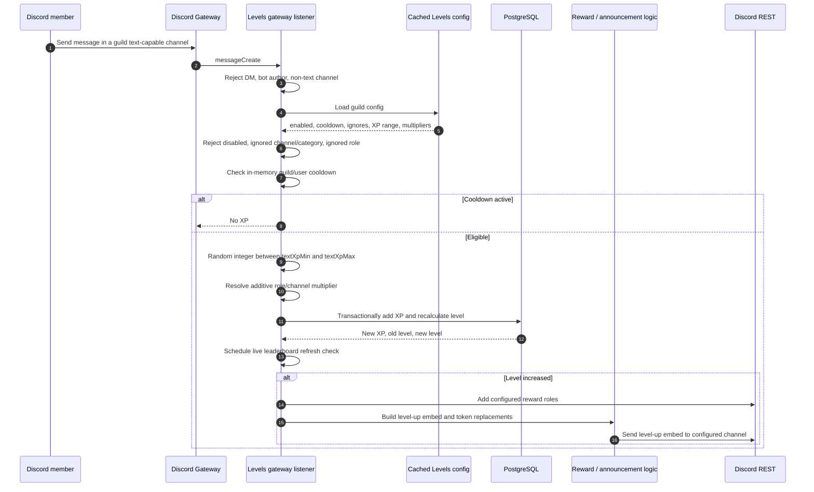

### Exact runtime decisions

1. DMs are ignored.
2. Bot authors are ignored.
3. Non-text channels are ignored.
4. The guild configuration must be enabled.
5. The message channel and its parent category are checked against ignored IDs.
6. Members with ignored roles are ignored.
7. A process-local `BoundedTtlMap` suppresses XP for the configured cooldown per guild/user.
8. A random text XP value is generated.
9. XP is written through a database transaction with a row lock on the user row.
10. A frozen user receives no XP.
11. A level increase causes reward-role assignment and a level-up announcement.

### Level-up announcement

The announcement runtime:

- reads the configured level-up channel;
- replaces `{user}`, `{username}`, `{level}`, `{server}`, and `{xp}`;
- sends an embed with configured title, message, color, and optional user avatar thumbnail;
- adds a rewards field when applicable;
- permits only the user mention when `{user}` is present;
- logs a warning rather than failing the XP write if the announcement cannot be sent.

The persisted image setting is not included in the outgoing embed by the current runtime.

## 1.3 Voice XP flow

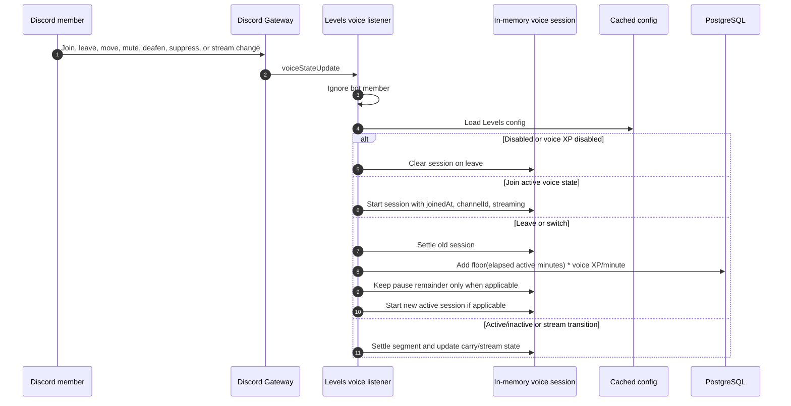

A member earns voice XP only while the current state is active. The implementation suppresses sessions for a member who is self-muted, server-muted, self-deafened, server-deafened, or suppressed in a stage context. Streaming can apply the configured stream multiplier.

For each settled segment:

```text
wholeMinutes = floor((elapsedMilliseconds + carryMilliseconds) / 60,000)
segmentXP = wholeMinutes * voiceXpPerMinute * effectiveMultiplier
```

Segments shorter than one minute do not grant XP. A remainder is retained when a pause/resume transition requires it, but the session map is process-local.

## 1.4 Rewards and leaderboard flow

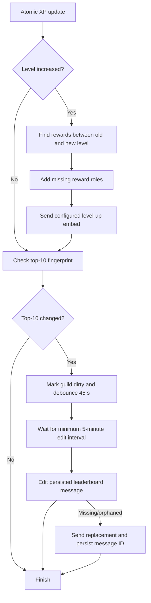

The HTTP leaderboard endpoint returns up to 100 rows, resolves member display names through Discord, and returns a total. The live leaderboard:

- renders the top 10;
- uses medals for the first three ranks;
- includes level and XP;
- applies `{total}` in the configured description;
- can show the guild icon as a thumbnail;
- updates only when the top-10 fingerprint changes;
- debounces changes for 45 seconds;
- enforces a five-minute minimum edit interval;
- edits the saved Discord message or recreates it if orphaned.

## 1.5 Levels data model

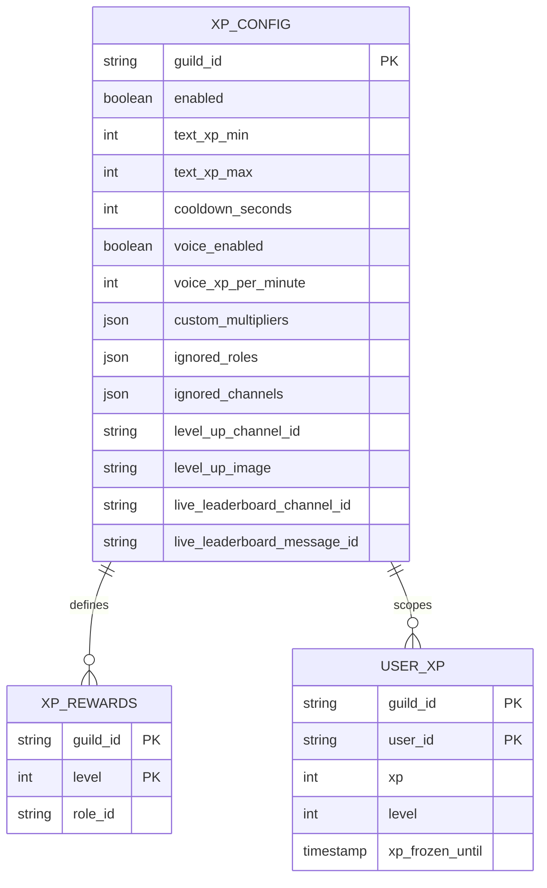

## 1.6 Current limitations

| ID | Current limitation |
|---|---|
| LVL-L1 | Text cooldowns are process-local; a restart or multiple backend instances can grant XP inconsistently. |
| LVL-L2 | Active voice sessions are process-local; a restart can lose active time and a multi-instance deployment can duplicate or miss settlement. |
| LVL-L3 | XP writes are durable, but there is no durable XP event ledger or idempotency key for replay/recovery. |
| LVL-L4 | `levelUpImage` is stored and editable but not rendered by the runtime announcement. |
| LVL-L5 | Runtime level-up output is embed-only; there is no effective plain-text mode. |
| LVL-L6 | Reward assignment is additive and only occurs on a level increase; there is no documented reconciliation/backfill pass for existing members. |
| LVL-L7 | The live leaderboard performs repeated top-10 reads and member resolution on change; high-volume guilds need centralized coalescing and observability. |
| LVL-L8 | The dashboard route currently does not mount `LevelsIsland`. |

---

# 2. Starboard

## 2.1 Current implementation

The module listens to:

- `messageReactionAdd`;
- `messageReactionRemove`;
- `messageReactionRemoveEmoji`;
- `messageReactionRemoveAll`;
- `messageDelete`;
- bulk message deletion.

The dashboard uses:

- `GET /api/starboard/`;
- `PATCH /api/starboard/settings`.

The configuration includes:

- enabled flag;
- destination text or announcement channel;
- one to ten counting emojis;
- threshold from `1..100`;
- whether the author can count their own reaction;
- whether bot users and bot-authored messages count;
- ignored source channels.

The destination channel is never treated as a source channel. The backend also skips messages already posted by the board.

## 2.2 Reaction-to-board flow

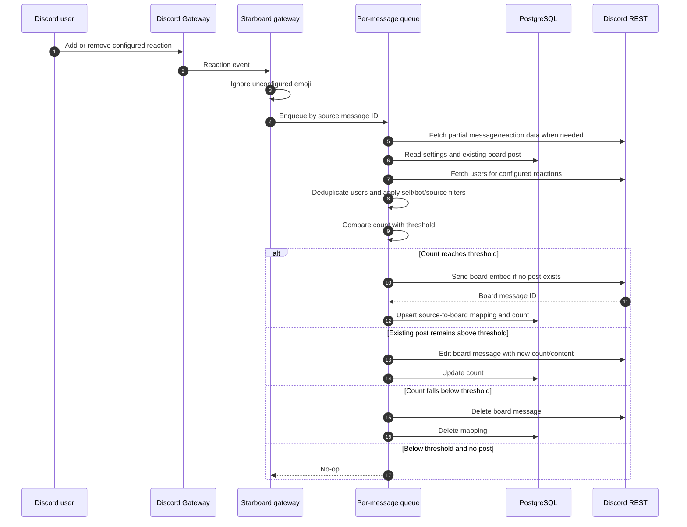

The per-message queue serializes concurrent reaction changes in one process, preventing two reaction events from simultaneously creating duplicate board posts.

## 2.3 Counting rules

The runtime:

1. Loads the guild settings.
2. Requires the module to be enabled and a valid destination channel.
3. Ignores source channels configured in `ignoreChannelIds`.
4. Ignores messages authored by bots unless `allowBots` is enabled.
5. Ignores bot reactors unless `allowBots` is enabled.
6. Ignores the message author’s reaction unless `allowSelfStar` is enabled.
7. Fetches each configured emoji’s users.
8. Deduplicates users across all configured emojis so one member contributes at most one star.
9. Posts or updates when the unique count is at least the threshold.
10. Deletes the board copy when the count drops below the threshold.

## 2.4 Board message payload

The current board copy contains:

- content: `<header emoji> **count** · <#source-channel>`;
- orange embed color;
- source author display name and avatar;
- source message content as the embed description, truncated to Discord’s embed description limit;
- first image found in an attachment or embedded image;
- source creation timestamp;
- footer containing the source message ID;
- a field linking back to the original Discord message.

The current implementation does not expose a configurable board message template; the payload is constructed in `board.ts`.

## 2.5 Deletion and repair behavior

- Deleting the source message deletes the board copy and local mapping.
- Deleting the board message removes the local mapping.
- A missing/orphaned board message causes the next qualifying reaction synchronization to create a replacement.
- Discord API failures are logged; the in-memory queue is not durable.

## 2.6 Starboard data model

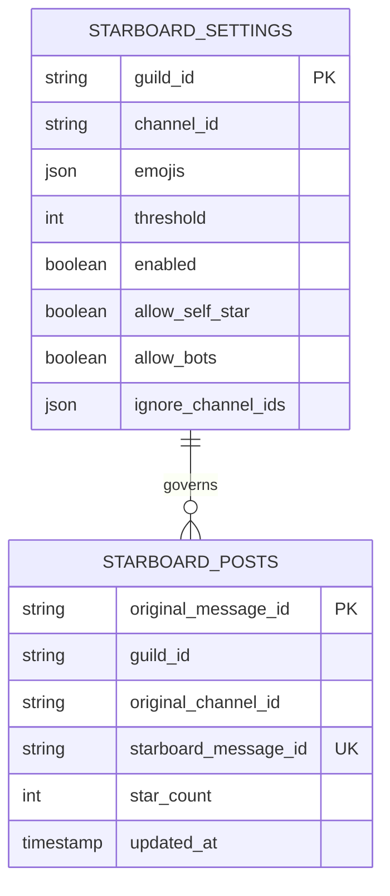

## 2.7 Current limitations

| ID | Current limitation |
|---|---|
| STAR-L1 | User enumeration is performed through reaction fetches during synchronization; this is accurate but can be expensive for high-volume boards. |
| STAR-L2 | Queue serialization is process-local; multiple workers can still race to create or update a board post. |
| STAR-L3 | There is no durable outbox, retry schedule, or periodic reconciliation for missed gateway events. |
| STAR-L4 | There is one board configuration per guild and one destination channel. |
| STAR-L5 | The board payload is hard-coded; no dashboard template, source preview, or configurable header/content fields exist. |
| STAR-L6 | There is no dedicated dashboard view of board posts or board statistics beyond the current post count. |
| STAR-L7 | The dashboard route currently does not mount `StarboardIsland`. |

---

# 3. Giveaways

## 3.1 Current implementation

The dashboard uses:

- `GET /api/giveaways/settings`;
- `PUT /api/giveaways/settings`;
- `GET /api/giveaways/`;
- `POST /api/giveaways/`;
- `GET /api/giveaways/:id`;
- `POST /api/giveaways/:id/end`;
- `POST /api/giveaways/:id/cancel`;
- `POST /api/giveaways/:id/reroll`;
- `POST /api/giveaways/:id/publish`.

The dashboard supports:

- prize and description;
- destination text/announcement channel;
- duration in minutes;
- winner count;
- required roles;
- blocked roles;
- minimum guild membership age;
- minimum Discord account age;
- manager roles setting;
- optional role mention at completion;
- optional winner DMs;
- list/detail view;
- end, cancel, reroll, and republish actions.

The current dashboard directly publishes a new giveaway. It does not expose a separate draft/publish lifecycle.

## 3.2 State machine

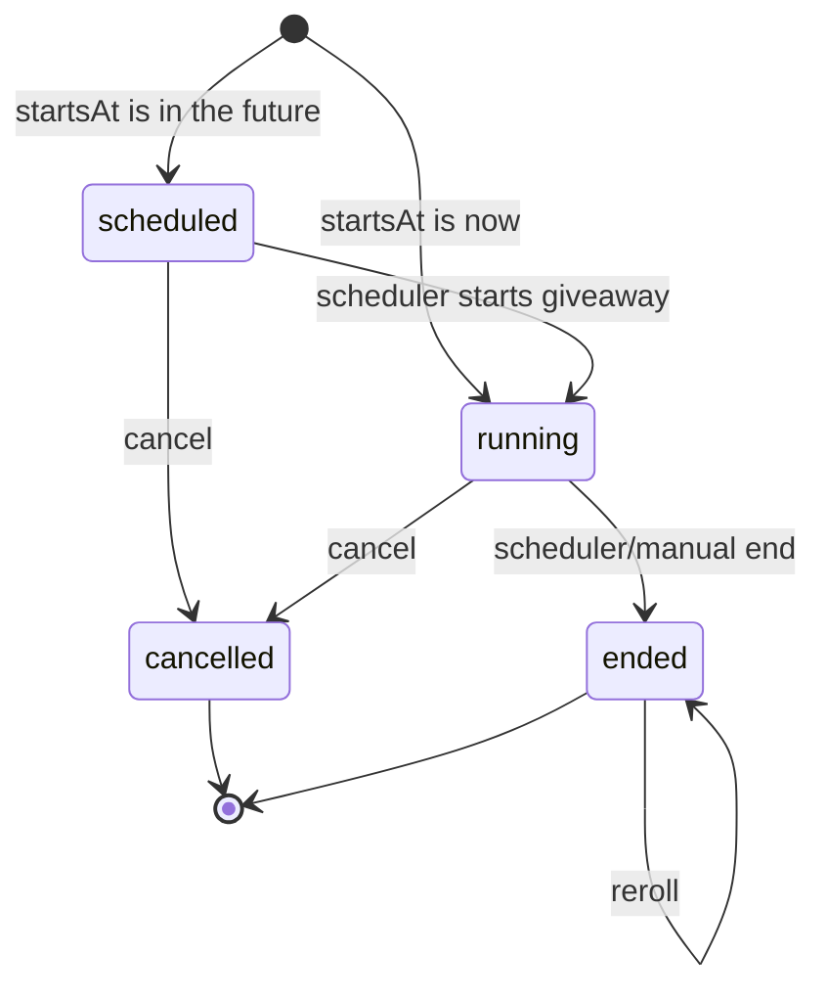

Current statuses are `scheduled`, `running`, `ended`, and `cancelled`.

## 3.3 Create and publish flow

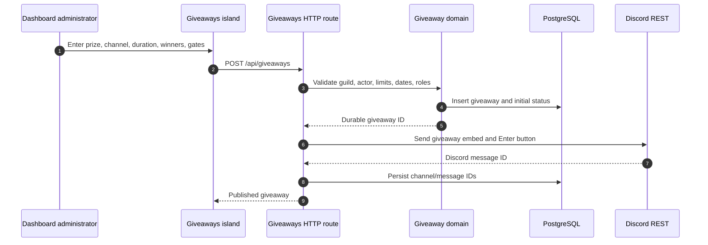

If publication fails after insertion, the current action cancels the giveaway row and returns an error. The operation is therefore intended to avoid leaving an active giveaway without a message, but its external side effect is not an outbox transaction.

## 3.4 Entry flow

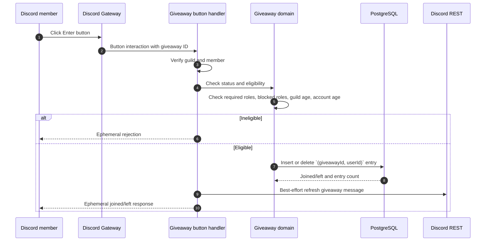

Entries are stored with a composite primary key `(giveawayId, userId)`. Clicking again toggles the entry while the giveaway is running.

## 3.5 Scheduling and completion

The module binds a scheduler that:

- runs an initial tick only on the leader;
- runs an interval every 15 seconds;
- claims due scheduled/running giveaways using `FOR UPDATE SKIP LOCKED`;
- leases each claim for two minutes;
- limits one claim batch to 50 rows;
- enqueues stable BullMQ-style job IDs in the `giveaways` queue;
- starts scheduled giveaways or ends running giveaways;
- clears the claim after successful processing;
- leaves the lease available for retry after failure.

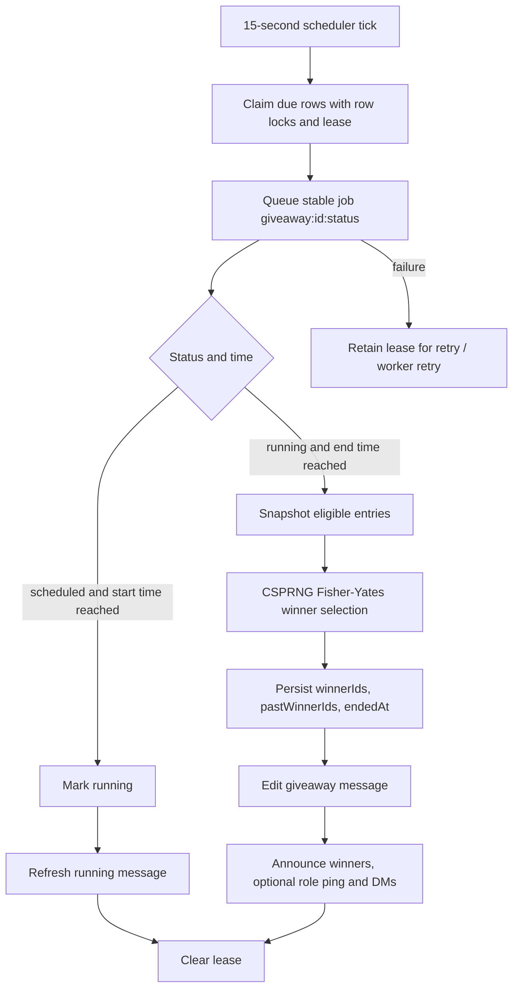

Winner selection excludes no users by default beyond the persisted entry set and uses a cryptographically secure random source with Fisher-Yates shuffling. Rerolls exclude `pastWinnerIds`.

## 3.6 Giveaway message and notifications

The published embed includes:

- current status;
- relative start/end timestamps;
- configured winner count;
- current entrant count;
- required role information;
- winner mentions after completion;
- a single Enter button while running.

At completion, the module can:

- announce winners in the giveaway channel;
- mention the configured ping role for a non-reroll completion;
- DM winners when enabled.

## 3.7 Current authorization limitation

The giveaway settings store `managerRoleIds`, and the dashboard labels them as “Manager roles (in addition to Manage Guild)”. The reviewed HTTP routes call `actorIdOf` to record `createdBy`, but do not call a manager-role authorization check before settings mutation, create, end, cancel, reroll, or republish. The member-facing Discord button has eligibility checks, not dashboard manager authorization.

Therefore:

- `IMPLEMENTED`: manager role IDs are persisted and configurable;
- `LIMITATION`: enforcement of those roles is not evidenced in the giveaway HTTP route path;
- `NEW — RECOMMENDED`: centralize and enforce a server-scoped authorization policy before every manager mutation.

## 3.8 Giveaway data model

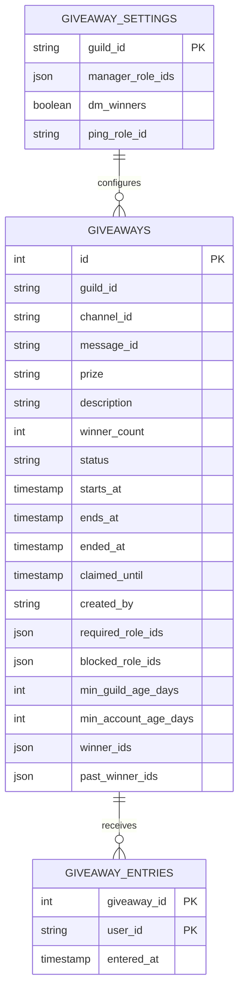

## 3.9 Current limitations

| ID | Current limitation |
|---|---|
| GW-L1 | The HTTP mutation routes do not visibly enforce the configured manager roles. |
| GW-L2 | The state transition path should use an atomic version/compare-and-set guard; simultaneous manual and scheduled actions can otherwise compete. |
| GW-L3 | Winner selection is durable after the update, but there is no explicit immutable eligibility snapshot or completion idempotency record. |
| GW-L4 | Discord message editing, winner announcement, role mention, and DMs are separate side effects without a durable outbox. |
| GW-L5 | Dashboard creation is publish-immediately; no draft, preview, scheduled publication, image, custom entry copy, or winner-role/XP/currency prize is exposed. |
| GW-L6 | The current create UI exposes at most 20 winners while some external products support larger limits. |
| GW-L7 | A member can toggle entry only while status is running; there is no visible participant list or self-service eligibility explanation beyond the interaction response. |
| GW-L8 | The dashboard route currently does not mount `GiveawaysIsland`. |

---

# 4. Forms

## 4.1 Current implementation

The module supports up to 25 forms per guild and up to five questions per form.

The dashboard provides:

- form list and create/edit tabs;
- base invitation embed builder;
- modal question builder;
- reception settings;
- required and blocked role gates;
- cooldown or one-submission mode;
- enabled/closed state;
- optional ping role;
- optional role on acceptance;
- thank-you message;
- image and thumbnail values, including `/uploads/` assets or HTTP(S) URLs;
- Discord-style embed and modal previews;
- response list, expanded response detail, and CSV download;
- save and publish actions.

Question styles currently are:

- short text;
- paragraph text;
- single-select dropdown;
- file upload.

## 4.2 Builder and publish flow

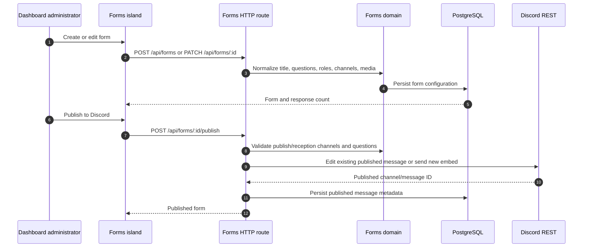

Publishing requires:

- a ready Discord gateway;
- a publish channel;
- a reception channel belonging to the same guild;
- at least one question;
- a text or announcement publish channel.

The published message contains the configured embed and one `Open Form` button. If the previous Discord message is missing, a new message is sent. If the message exists in the same channel, it is edited in place.

## 4.3 Member submission flow

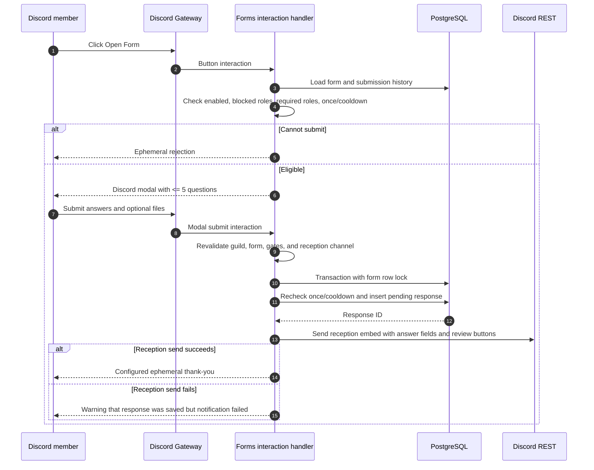

The handler revalidates eligibility at modal submission time, not only when the modal opens. This prevents a stale modal from bypassing role or timing policy.

Answer normalization:

- text input is stored as its submitted value;
- select values are joined;
- file upload URLs are joined by newline;
- required answers are enforced;
- the response stores question label/value pairs plus username, display name, and avatar metadata.

## 4.4 Review flow

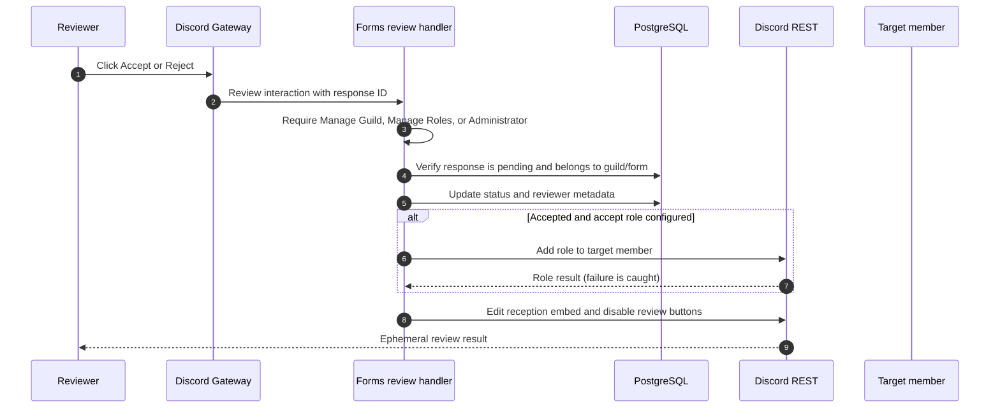

The review state is `pending`, `accepted`, or `rejected`. The current role assignment is a separate Discord side effect and failures are caught without reverting the accepted database status.

## 4.5 Forms data model

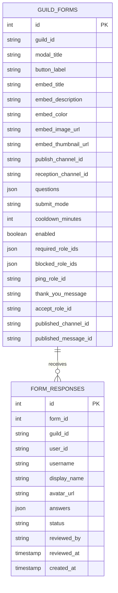

## 4.6 Current limitations

| ID | Current limitation |
|---|---|
| FORM-L1 | A response is durable before the reception notification is sent, but there is no durable retry/outbox record for a failed notification. |
| FORM-L2 | Acceptance is persisted before the optional role mutation; a role failure is silently caught and is not represented as a retryable pending effect. |
| FORM-L3 | The dashboard response list is bounded by the shared response-list limit and has no cursor-based pagination in the reviewed route. |
| FORM-L4 | There is no anonymous submission mode, per-form reviewer/viewer role set, member-only switch, thread-per-response option, or response reaction automation. |
| FORM-L5 | Question types are limited to short text, paragraph, dropdown, and file upload; there is no checkbox/multi-select or richer validation model. |
| FORM-L6 | Forms do not have immutable published versions; editing a form can change the behavior of an already published message. |
| FORM-L7 | The frontend can preview the invitation embed and modal, but there is no end-user submission preview or test submission flow. |
| FORM-L8 | The dashboard route currently does not mount `FormsIsland`. |

---

# 5. Voice Rooms

## 5.1 Current implementation

Voice Rooms are configured as Join-to-Create generators.

The dashboard uses:

- `GET /api/voice-rooms`;
- `POST /api/voice-rooms/generators`;
- `PATCH /api/voice-rooms/generators/:id`;
- `DELETE /api/voice-rooms/generators/:id`.

Each generator configures:

- one hub voice channel;
- optional category, otherwise the hub’s parent category;
- room name template with `{user}` / `{username}` replacement;
- default user limit, where `0` means unlimited;
- default bitrate, where `0` means Discord default;
- optional automatic private text channel;
- enabled state;
- per-action owner permissions.

The shared action catalog includes name, limit, lock, claim, permit, reject, transfer, ghost, bitrate, text, invite, and status. The owner uses `/voice`; staff with `ManageChannels` can control rooms even when an owner action is disabled.

## 5.2 Join-to-create flow

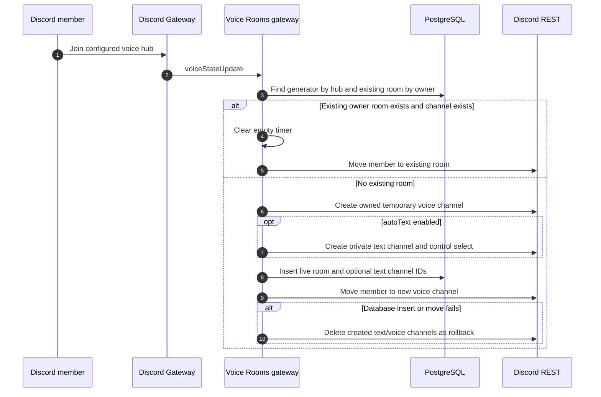

Room creation applies an owner permission overwrite allowing View Channel, Connect, Speak, Stream, and Use Voice Activity. The hub is never deleted.

## 5.3 Linked text channel behavior

When `autoText` is enabled, the module creates a private text channel associated with the temporary voice room:

- `@everyone` is denied `ViewChannel`;
- the owner receives View, Send, and Read History;
- current voice-room members receive access;
- a control select message is posted;
- joining the voice room grants linked text permissions;
- leaving removes non-owner linked text permissions.

The owner can also request a text channel later with `/voice text` when one does not already exist.

## 5.4 Room controls

```mermaid
flowchart TD
    CMD[/voice command or control select] --> CTX[Load room, generator, voice channel, member]
    CTX --> STAFF{ManageChannels?}
    STAFF -- Yes --> EXEC[Execute permitted staff action]
    STAFF -- No --> OWNER{Actor is owner?}
    OWNER -- No --> DENY[Ephemeral denial]
    OWNER -- Yes --> ENABLED{Generator action enabled?}
    ENABLED -- No --> DENY
    ENABLED -- Yes --> EXEC
    EXEC --> ACTIONS[Name, limit, lock, ghost, bitrate, status, text, permit, reject, transfer, invite, claim]
    ACTIONS --> SYNC[Apply Discord overwrites/channel changes]
    SYNC --> DB[Persist room owner/lock/ghost/text metadata]
```

Implemented action behavior:

| Action | Current behavior |
|---|---|
| Name | Sanitizes and updates the voice channel name |
| Limit | Clamps user limit; `0` means unlimited |
| Lock/unlock | Changes `@everyone` Connect permission |
| Ghost/unghost | Changes `@everyone` View Channel permission |
| Bitrate | Clamps to the guild maximum |
| Status | Updates channel status after non-empty validation |
| Text | Creates the linked private text channel once |
| Permit | Grants a user or role access |
| Reject | Denies a user or role and disconnects matching members where applicable |
| Transfer | Transfers owner overwrites to a member currently in the room, subject to one-room-per-owner constraint |
| Invite | Creates a one-use, one-hour invite and attempts to DM the target |
| Claim | Lets a member in the room claim ownership only when the previous owner is absent |

## 5.5 Empty-room lifecycle and reconciliation

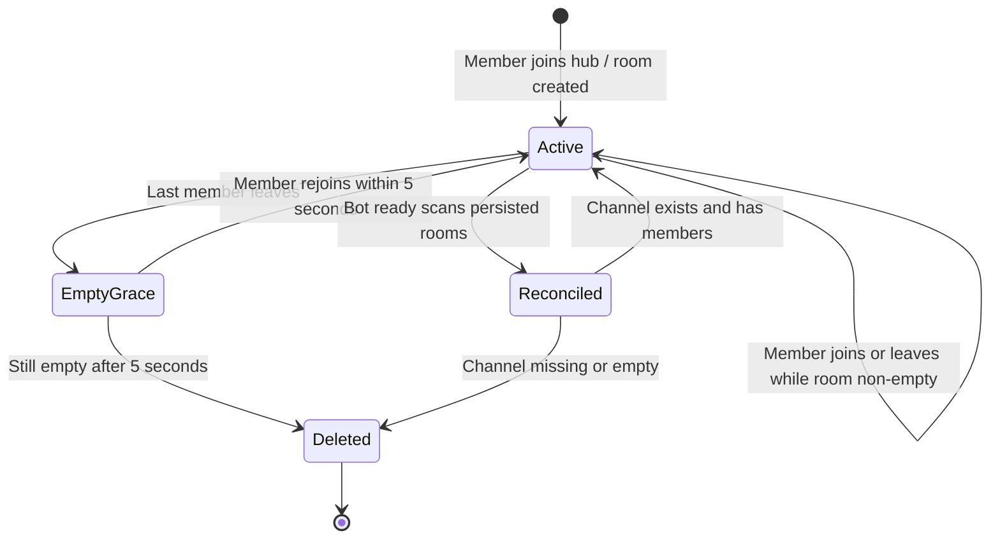

The current empty grace period is a shared constant of approximately five seconds. Empty timers are process-local. On bot ready, the module scans persisted rooms and removes missing or empty rooms and linked text channels.

Deleting a generator also deletes its live rooms through the domain path.

## 5.6 Voice Rooms data model

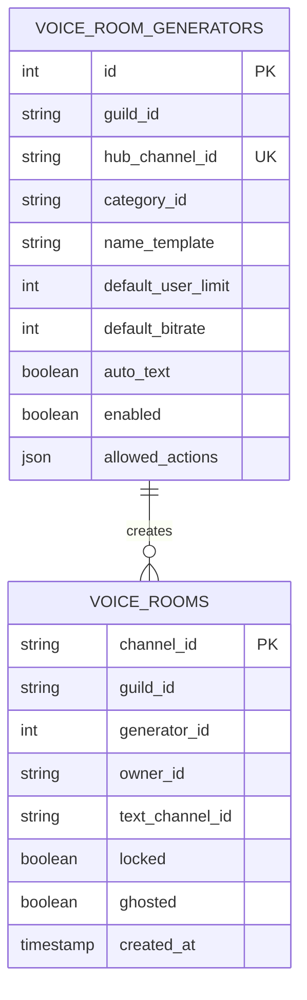

## 5.7 Current limitations

| ID | Current limitation |
|---|---|
| VR-L1 | Empty timers are process-local and there is no durable deletion job or distributed lock. |
| VR-L2 | Two concurrent joins can race between “find existing owner room” and “insert room”, despite a database uniqueness constraint; the Discord channel side effect may need cleanup. |
| VR-L3 | Reconciliation runs at ready and on some local events, but there is no periodic repair loop for permission drift or orphaned channels. |
| VR-L4 | Empty deletion is fixed at approximately five seconds; it is not configurable per generator. |
| VR-L5 | The dashboard does not expose room-level live operations, cleanup status, or repair controls. |
| VR-L6 | Permission changes are applied to Discord and then selected metadata is persisted; partial failures can leave Discord and the row temporarily divergent. |
| VR-L7 | There is no configurable maximum room count, explicit clone/template sequence, archive behavior, or room-level audit history. |
| VR-L8 | The dashboard route currently does not mount `VoiceRoomsIsland`. |

---

# 6. External comparison

## 6.1 Evidence policy

The comparison below uses official product documentation, official help centers, official documentation repositories, or official product pages where available. A product is marked `NOT EVIDENCED` when the reviewed official material did not document the exact capability sufficiently enough to claim parity. CommunityOne pages, search snippets, and user-generated server posts are not treated as authoritative behavioral specifications.

## 6.2 Levels and XP comparison

| Product | Publicly documented behavior relevant to this scope | Project status |
|---|---|---|
| ProBot | Text/voice leveling, ignored roles/channels, level-up messages, role rewards, separate text/voice requirements, stack/remove reward options, DM option, role hierarchy requirements. [1] | `NEW — RESEARCH`: separate voice curve/requirements, DM option, reward replacement, hierarchy diagnostics |
| MEE6 | XP is documented around text chat, ignored roles/channels, level-up and role-reward troubleshooting, stack/remove behavior, and permission/hierarchy requirements. [2][3][4] | `NEW — RESEARCH`: richer reward reconciliation and permission diagnostics |
| Dyno | Activity XP, level-up messages, roles/rewards, ignored roles/channels, server rate, boosted channels/roles, combined or highest boost mode, stacked roles, profile/leaderboard commands. [5] | `NEW — RESEARCH`: boost composition mode, server rate, richer profile controls |
| Arcane | XP from messages, voice, reactions, and manual actions; multiple leaderboards; source-specific ranges/cooldowns; formulas; anti-AFK voice controls; restrictions; optional level-up image; manual XP management; role reward stack/highest modes. [6][7][8][9][10][11] | `NEW — RESEARCH`: reaction/manual XP, formulas, anti-AFK, weekly/monthly leaderboards, backfill and reward modes |
| Carl-bot | Message XP defaults, cooldown, blacklisted roles/channels, voice toggle, notifications, level rewards with stack/replace modes, manual XP operations, reset/restore and MEE6 import. [12] | `NEW — RESEARCH`: admin XP operations, reset/restore/import, reward replacement |
| Sapphire Bot | No sufficiently specific official public Levels/XP behavior documentation was found in this review. [13] | `NOT EVIDENCED` |
| CommunityOne | Official site is a community platform; no sufficiently specific official Levels/XP module specification was found. [14] | `NOT EVIDENCED` |
| Invite Tracker | Official documentation emphasizes invite/message tracking and giveaways; no sufficiently specific Levels/XP specification was found. [15] | `NOT EVIDENCED` |
| UnbelievaBoat | Official product page was found, but no sufficiently specific Levels/XP module specification was found in this review. [16] | `NOT EVIDENCED` |
| VoiceMaster | Not a Levels/XP comparison product; no Levels/XP behavior is considered. [17] | `NOT APPLICABLE` |

### Levels research-derived additions

These are not implemented unless already described in the current sections:

- `NEW — RESEARCH`: multiple XP source policies, including reactions and manual grants;
- `NEW — RESEARCH`: configurable level formula and maximum level;
- `NEW — RESEARCH`: weekly, monthly, voice, reaction, and overall leaderboards;
- `NEW — RESEARCH`: configurable message XP modes such as random versus per-word;
- `NEW — RESEARCH`: anti-AFK voice rules and minimum active-member thresholds;
- `NEW — RESEARCH`: role reward stack versus highest-only versus replacement behavior;
- `NEW — RESEARCH`: role hierarchy diagnostics and reward reconciliation on rejoin;
- `NEW — RESEARCH`: manual add/remove/set/reset/import operations;
- `NEW — RESEARCH`: actual level-up image rendering and configurable destination/DM policy.

## 6.3 Starboard comparison

| Product | Publicly documented behavior relevant to this scope | Project status |
|---|---|---|
| ProBot | Threshold-based starboard, enabled channels and roles, custom emoji on premium, plain/embed board message modes, self-star ignore, and an advanced option for reacting to the board post. [18] | `NEW — RESEARCH`: enabled-channel/role allowlists, plain mode, board-post reaction behavior |
| MEE6 | No sufficiently specific official standalone Starboard behavior page was found in this review. [4] | `NOT EVIDENCED` |
| Dyno | Starboard module is listed; `?star` exposes board link, count, deletion state, and first star users. Detailed settings behavior was not available in the reviewed official page. [19][20] | `NEW — RESEARCH`: message stats command and first-reactor history |
| Arcane | No sufficiently specific official Starboard behavior page was found in this review. [6] | `NOT EVIDENCED` |
| Carl-bot | No sufficiently specific official Starboard behavior page was found in the reviewed official documentation. [12] | `NOT EVIDENCED` |
| Sapphire Bot | No sufficiently specific official Starboard behavior documentation was found. [13] | `NOT EVIDENCED` |
| CommunityOne | No sufficiently specific official Starboard module specification was found. [14] | `NOT EVIDENCED` |
| Invite Tracker | No sufficiently specific official Starboard module specification was found. [15] | `NOT EVIDENCED` |
| UnbelievaBoat | No sufficiently specific official Starboard module specification was found. [16] | `NOT EVIDENCED` |
| VoiceMaster | Not a Starboard comparison product. [17] | `NOT APPLICABLE` |

### Starboard research-derived additions

- `NEW — RESEARCH`: source-channel allowlist in addition to the current ignore list;
- `NEW — RESEARCH`: source-role allowlist;
- `NEW — RESEARCH`: plain-text versus embed board mode;
- `NEW — RESEARCH`: board-post reaction/statistics command;
- `NEW — RECOMMENDED`: durable event repair and multi-worker idempotency;
- `NEW — RECOMMENDED`: board template preview and configurable payload fields.

## 6.4 Giveaways comparison

| Product | Publicly documented behavior relevant to this scope | Project status |
|---|---|---|
| ProBot | No standalone Giveaways module behavior was found in the reviewed official module documentation. [21] | `NOT EVIDENCED` |
| MEE6 | Dashboard-created giveaways with channel, name, prize, end date, winners, allowed roles, button entry, reroll, up to 100 giveaways, XP/coins prizes, and role-based odds. Deleting the Discord message returns the giveaway to draft state. [22] | `NEW — RESEARCH`: drafts, allowed-role odds, XP/coins prizes, 100 active/draft limit, deletion recovery |
| Dyno | Timed giveaways, dashboard/commands, buttons, DM winners, mentions, winner role, images, daily/referral entries, max entries per user, member/ineligible visibility controls, and documented limits. [23] | `NEW — RESEARCH`: weighted/referral/daily entries, images, winner role, visibility policy |
| Arcane | No sufficiently specific official Giveaways behavior page was found in this review. [6] | `NOT EVIDENCED` |
| Carl-bot | No sufficiently specific official Giveaways behavior page was found in this review. [12] | `NOT EVIDENCED` |
| Sapphire Bot | No sufficiently specific official Giveaways behavior documentation was found. [13] | `NOT EVIDENCED` |
| CommunityOne | No sufficiently specific official Giveaways module specification was found; community posts are not used as product specification. [14] | `NOT EVIDENCED` |
| Invite Tracker | Official docs explicitly mention giveaways as a capability, but the reviewed pages did not provide enough behavior detail for parity claims. [15] | `NEW — RESEARCH`: product-specific giveaway behavior remains to be verified |
| UnbelievaBoat | No sufficiently specific official Giveaways module specification was found. [16] | `NOT EVIDENCED` |
| VoiceMaster | Not a Giveaways comparison product. [17] | `NOT APPLICABLE` |

### Giveaway research-derived additions

- `NEW — RESEARCH`: draft versus published lifecycle;
- `NEW — RESEARCH`: weighted/role-based odds;
- `NEW — RESEARCH`: recurring, daily, referral, or multiple-entry policies;
- `NEW — RESEARCH`: image/custom message configuration;
- `NEW — RESEARCH`: winner role, XP, or currency prizes;
- `NEW — RESEARCH`: member-only and ineligible-member visibility controls;
- `NEW — RECOMMENDED`: atomic state transitions and immutable eligibility snapshot;
- `NEW — RECOMMENDED`: durable completion outbox for message update, announcement, role ping, and DMs.

## 6.5 Forms comparison

| Product | Publicly documented behavior relevant to this scope | Project status |
|---|---|---|
| ProBot | The reviewed official module catalog does not document a standalone Forms module; forms appear in ticket-related functionality. [21] | `NOT EVIDENCED` for standalone Forms |
| MEE6 | No sufficiently specific official standalone Forms behavior page was found in this review. [4] | `NOT EVIDENCED` |
| Dyno | Form builder, templates, submission channel, viewers/managers, member-only mode, allowed/ignored roles, anonymous submissions, one-per-user, cooldown, threads, role mentions, reactions, role changes, webhook-based delivery, and documented limits. [24] | `NEW — RESEARCH`: anonymous, viewer/manager roles, member-only, threads, reactions, role changes, webhook delivery |
| Arcane | No sufficiently specific official Forms behavior page was found. [6] | `NOT EVIDENCED` |
| Carl-bot | No sufficiently specific official Forms behavior page was found in the reviewed official documentation. [12] | `NOT EVIDENCED` |
| Sapphire Bot | No sufficiently specific official Forms behavior documentation was found. [13] | `NOT EVIDENCED` |
| CommunityOne | No sufficiently specific official Forms module specification was found. [14] | `NOT EVIDENCED` |
| Invite Tracker | No sufficiently specific official Forms module specification was found. [15] | `NOT EVIDENCED` |
| UnbelievaBoat | No sufficiently specific official Forms module specification was found. [16] | `NOT EVIDENCED` |
| VoiceMaster | Not a Forms comparison product. [17] | `NOT APPLICABLE` |

### Forms research-derived additions

- `NEW — RESEARCH`: anonymous submission mode;
- `NEW — RESEARCH`: member-only mode and explicit viewer/manager role policies;
- `NEW — RESEARCH`: thread per submission;
- `NEW — RESEARCH`: response reactions and automated role changes;
- `NEW — RESEARCH`: templates as first-class form artifacts;
- `NEW — RECOMMENDED`: paginated response retrieval and export;
- `NEW — RECOMMENDED`: durable notification and role-effect retries;
- `NEW — RECOMMENDED`: immutable published form versions.

## 6.6 Voice Rooms comparison

| Product | Publicly documented behavior relevant to this scope | Project status |
|---|---|---|
| ProBot | Temporary channels use a designated voice channel to create user-controlled rooms; documented options include deletion time after empty, maximum channels per user, maximum users per channel, and Move Members bypass. [25] | `NEW — RESEARCH`: configurable empty timeout, per-user room cap, max channel count, bypass policy |
| MEE6 | Temporary Channels is referenced in the official permission guide, but the reviewed material did not provide sufficient behavior detail for parity. [4] | `NOT EVIDENCED` |
| Dyno | Voice/Text Linking links an existing voice and text channel, grants text permissions on join, revokes them on leave, optionally sends join/leave messages, and can purge when voice is empty. [26] | `NEW — RESEARCH`: existing-channel linking, join/leave messages, purge policy |
| Arcane | No sufficiently specific official Voice Rooms behavior page was found. [6] | `NOT EVIDENCED` |
| Carl-bot | No sufficiently specific official Voice Rooms behavior page was found. [12] | `NOT EVIDENCED` |
| Sapphire Bot | No sufficiently specific official Voice Rooms behavior documentation was found. [13] | `NOT EVIDENCED` |
| CommunityOne | No sufficiently specific official Voice Rooms module specification was found. [14] | `NOT EVIDENCED` |
| Invite Tracker | No sufficiently specific official Voice Rooms module specification was found. [15] | `NOT EVIDENCED` |
| UnbelievaBoat | No sufficiently specific official Voice Rooms module specification was found. [16] | `NOT EVIDENCED` |
| VoiceMaster | Documents lock/unlock, name, limit, permit, reject, claim, ghost/unghost, invite, text, setup/presetup, sequence/clone, archive, and private temporary text behavior. [17][27] | `NEW — RESEARCH`: ghost, archive, richer setup/clone/sequence, private text controls |

### Voice Rooms research-derived additions

- `NEW — RESEARCH`: configurable empty-room deletion timeout;
- `NEW — RESEARCH`: per-user and total room caps;
- `NEW — RESEARCH`: linked existing voice/text mode;
- `NEW — RESEARCH`: join/leave message and empty-text purge policies;
- `NEW — RESEARCH`: archive behavior;
- `NEW — RESEARCH`: clone/sequence/preset setup;
- `NEW — RECOMMENDED`: durable cleanup jobs, distributed ownership, and permission reconciliation.

---

# 7. Consolidated gap and improvement register

The following register keeps external parity separate from platform reliability work.

## 7.1 P0 — correctness, authorization, and recovery

| ID | Area | New requirement | Reason |
|---|---|---|---|
| P0-1 | Dashboard | Mount and verify all five React islands from their Astro routes. | The current pages render only the layout shell. |
| P0-2 | Authorization | Introduce one guild-scoped authorization policy used by all Community HTTP mutations. Enforce `ManageGuild` plus configured manager roles where applicable. | Prevents configuration and destructive actions from relying on UI visibility. |
| P0-3 | Giveaways | Implement compare-and-set state transitions with a version or transition token. | Prevents manual end, scheduler end, reroll, and cancellation races. |
| P0-4 | Giveaways | Persist an immutable eligibility/entrant snapshot and a completion idempotency record before external announcements. | Makes winner selection reproducible and retry-safe. |
| P0-5 | Cross-cutting | Add a durable outbox for Discord side effects with stable operation keys, retry policy, backoff, and dead-letter state. | Discord REST calls cannot participate in the PostgreSQL transaction. |
| P0-6 | Starboard | Replace process-local post creation serialization with a durable per-message idempotency key or database lock. | Multiple workers can otherwise create duplicate board posts. |
| P0-7 | Voice Rooms | Serialize room creation/deletion per guild/member/hub and use a durable cleanup queue. | Prevents duplicate channels and lost timers across restarts/instances. |
| P0-8 | Forms | Model reception notification and accepted-role assignment as retryable effects. | A saved response must not silently lose its operational notification or role result. |

## 7.2 P1 — scalability and operational resilience

| ID | Area | New requirement | Reason |
|---|---|---|---|
| P1-1 | Levels | Store event identity and use a durable cooldown or event ledger; persist voice session checkpoints. | Makes XP deterministic across restarts and horizontally scaled workers. |
| P1-2 | Levels | Move live leaderboard refresh into a coalescing job keyed by guild, with a single Discord projector. | Avoids repeated reads/member resolution and Discord rate-limit pressure. |
| P1-3 | Starboard | Add periodic reconciliation for configured source messages/posts and explicit orphan repair. | Gateway delivery is not a complete synchronization guarantee. |
| P1-4 | Giveaways | Separate scheduler claim, domain transition, message projection, and winner notification. | Keeps the state machine correct when Discord is unavailable. |
| P1-5 | Forms | Add cursor pagination, export jobs, and response projection rather than loading all responses synchronously. | Prevents large forms from exceeding request or memory limits. |
| P1-6 | Voice Rooms | Add periodic reconciliation for channel existence, room membership, linked text permissions, and database drift. | Ready-time reconciliation alone does not repair long-lived drift. |
| P1-7 | Cross-cutting | Add metrics for event lag, Discord latency, retries, dead letters, orphan rows, and permission failures. | Makes resilience measurable rather than inferred from logs. |

## 7.3 P2 — product parity and UX

| Area | New functionality to evaluate |
|---|---|
| Levels and XP | Reactions/manual XP, configurable formulas, weekly/monthly boards, anti-AFK voice policy, reward stack/highest/replace, backfill, import, rank cards, level-up image rendering, DM/destination policy |
| Starboard | Source allowlists, role allowlists, plain/embed mode, board-post statistics, templates, previews, multiple boards |
| Giveaways | Draft/publish, weighted odds, daily/referral entries, image/template, winner role/XP/currency, participant visibility, larger winner limits |
| Forms | Anonymous/member-only modes, manager/viewer roles, threads, reactions, automated roles, richer field types, versioning, test submission |
| Voice Rooms | Configurable empty timeout, room caps, existing-channel linking, join/leave messages, text purge, archive, clone/sequence, room-level repair/audit |

---

# 8. Recommended design pattern

## 8.1 Pattern choice

The best fit is an event-driven modular monolith with durable domain state, transactional outbox, idempotent Discord projectors, and partitioned background workers. It preserves the current repository’s module boundaries while making external Discord side effects recoverable and horizontally scalable.

This is preferable to putting Discord calls directly inside database mutations because Discord REST operations are remote, rate-limited, partially successful, and not transactional with PostgreSQL.

## 8.2 Target architecture

```mermaid
flowchart TB
    subgraph Inputs
        DASH[Dashboard command]
        GWE[Discord gateway event]
        INT[Discord interaction]
        TICK[Scheduler tick]
    end

    subgraph Core[Reusable Community core]
        AUTH[Guild authorization policy]
        ENV[Event envelope and idempotency key]
        POL[Eligibility/policy engine]
        DOM[Feature domain aggregates]
        TX[(PostgreSQL transaction)]
        OUT[(Transactional outbox)]
        CACHE[Bounded cache with invalidation]
    end

    subgraph Workers
        XPW[XP settlement worker]
        SBW[Starboard projection worker]
        GWW[Giveaway scheduler/completion worker]
        FMW[Form notification/effect worker]
        VRW[Voice lifecycle/cleanup worker]
        REC[Reconciliation worker]
    end

    subgraph DiscordProjection[Discord projection boundary]
        RL[Rate-limit aware REST executor]
        PRJ[Idempotent message/channel projector]
    end

    DASH --> AUTH --> ENV
    GWE --> ENV
    INT --> ENV
    TICK --> ENV
    ENV --> POL --> DOM
    DOM --> TX
    TX --> OUT
    DOM --> CACHE
    OUT --> XPW
    OUT --> SBW
    OUT --> GWW
    OUT --> FMW
    OUT --> VRW
    REC --> DOM
    XPW --> PRJ
    SBW --> PRJ
    GWW --> PRJ
    FMW --> PRJ
    VRW --> PRJ
    PRJ --> RL --> Discord[(Discord REST)]
```

## 8.3 Reusable core pieces

These are intentionally core primitives, not additional documented product features:

### A. Guild authorization policy

One policy service should answer:

```text
canManageCommunityFeature(actor, guild, feature, action)
```

It should combine:

- authenticated panel user identity;
- guild membership;
- Discord permission flags;
- configured feature manager roles;
- role hierarchy checks for roles the bot must assign;
- channel access checks for destinations;
- explicit action name for auditability.

The same policy can later serve moderation, roles, welcome events, scheduled messages, and other dashboard features without duplicating authorization rules.

### B. Event envelope and idempotency

Every input should become a normalized envelope:

```text
eventId
eventType
guildId
actorId / subjectId
sourceMessageId / interactionId / channelId
occurredAt
payloadVersion
idempotencyKey
```

Store the idempotency key before applying a non-repeatable domain mutation. Discord interaction IDs, message IDs plus event type, giveaway transition IDs, and room lifecycle keys are suitable natural keys when combined with the guild.

### C. Eligibility/policy engine

The current code already has repeated policy concepts: ignored roles/channels, required/blocked roles, age gates, cooldown/once submission, owner/staff checks, and bot/member exclusions. Centralize these as pure policy evaluators that return:

```text
{ allowed: boolean, reasonCode, details }
```

This makes the user-facing explanation, audit event, test cases, and server-side enforcement use the same decision.

### D. Durable scheduler and lease

Use a shared job abstraction with:

- durable due time;
- claim lease and worker identity;
- compare-and-set status transition;
- attempt count;
- next retry time;
- exponential backoff with jitter;
- dead-letter state;
- stable job key.

Giveaways, voice-room deletion, live leaderboard refresh, starboard repair, and form notifications can use the same scheduler without sharing feature semantics.

### E. Discord projector

Domain code should emit desired effects, for example:

```text
EditMessage(guildId, channelId, messageId, payload)
SendMessage(guildId, channelId, idempotencyKey, payload)
DeleteMessage(guildId, channelId, messageId)
CreateChannel(guildId, idempotencyKey, spec)
SetMemberRole(guildId, userId, roleId, operationKey)
```

The projector owns:

- Discord REST retries;
- rate-limit handling;
- permission/error classification;
- orphan detection;
- stable request keys;
- metrics;
- dead-letter handoff.

### F. Reconciliation framework

Each feature should implement a bounded reconciler:

```text
reconcileGuild(guildId, cursor)
```

Examples within this scope:

- compare starboard rows to board messages;
- compare giveaway statuses and due times to message state;
- compare pending form effects to reception/review state;
- compare voice room rows to actual channels and permissions;
- compare level leaderboard pointer to the actual message.

## 8.4 Target end-to-end mutation flow

```mermaid
sequenceDiagram
    autonumber
    participant I as Input: dashboard/event/interaction
    participant A as Authorization policy
    participant E as Event envelope
    participant D as Domain aggregate
    participant DB as PostgreSQL transaction
    participant O as Outbox
    participant W as Worker
    participant P as Discord projector
    participant DC as Discord

    I->>A: Request feature action
    A-->>I: Allow or structured denial
    I->>E: Normalize event and idempotency key
    E->>D: Apply domain command
    D->>DB: Lock aggregate / compare-and-set state
    DB->>DB: Persist state and event effect records
    DB->>O: Commit outbox rows atomically
    O-->>W: Claim effect with lease
    W->>P: Execute idempotent Discord effect
    P->>DC: Rate-limit aware REST request
    DC-->>P: Success, orphan, permission error, or retryable failure
    P->>DB: Mark effect done, retryable, or dead letter
    W-->>O: Release/renew lease
```

## 8.5 Feature-specific target patterns

### Levels and XP

- Persist an XP event or deterministic settlement key.
- Use a database-backed cooldown keyed by `(guildId, userId, source, bucket)` or a fast distributed store with a durable fallback.
- Store voice session start/checkpoint/end events so a worker can settle after restart.
- Emit `LevelReached` and `RewardDue` domain events.
- Project roles and announcements asynchronously.
- Coalesce leaderboard refreshes per guild.

### Starboard

- Treat `(guildId, sourceMessageId)` as the aggregate key.
- Persist a reaction-count snapshot/version and a projection operation key.
- Recompute or increment counts under a per-message lock.
- Project the board message with create/update/delete idempotency.
- Reconcile only active/configured source ranges, not the entire guild.

### Giveaways

- Treat the giveaway row as a strict state machine.
- Require `UPDATE ... WHERE status = expectedStatus AND version = expectedVersion` for transitions.
- Freeze the eligible entrant set at completion time and record a draw version/seed metadata without exposing private randomness.
- Persist winner selection before announcing.
- Project the final message and notifications independently with retryable effects.

### Forms

- Treat a published form as a versioned immutable schema.
- Use a current draft pointer and published version pointer.
- Store submission answers against the published version, not mutable draft JSON.
- Persist `ResponseReceived`, `ReceptionMessagePending`, `ReviewChanged`, and `AcceptedRolePending` effects.
- Return a response receipt even if Discord reception delivery is temporarily unavailable.

### Voice Rooms

- Treat `(guildId, generatorId, ownerId)` as a creation idempotency key.
- Claim creation before calling Discord, then persist channel IDs after success.
- Use a durable delayed-delete effect with a generation token so a rejoin cancels the correct deletion.
- Reconcile channel existence, membership, permissions, and linked text access.
- Keep Discord channel IDs as external resources with explicit orphan cleanup states.

## 8.6 Invariants

The implementation should preserve these invariants:

1. A dashboard mutation is authorized on the backend, independently of UI visibility.
2. A domain state transition is committed before external Discord effects are attempted.
3. Every external effect is retryable or explicitly dead-lettered.
4. Replaying the same gateway event or interaction does not duplicate durable state or Discord messages.
5. Discord failure cannot silently erase a user submission, giveaway result, board state, or room ownership.
6. Every persisted external Discord ID is scoped to a guild and feature aggregate.
7. Every role mutation verifies bot role hierarchy before execution and records failures.
8. Every cleanup operation is safe to retry.
9. Reconciliation can repair missing messages/channels without duplicating them.
10. Operational state exposes lag, retry, and orphan metrics.

---

# 9. Audited repository sources

The current-state claims in this document were based on the following repository areas:

| Capability | Backend | Shared / database | Frontend |
|---|---|---|---|
| Levels and XP | `backend/src/modules/levels/{module,gateway,liveLeaderboard}.ts`, `backend/src/modules/levels/domain/levels.ts`, `backend/src/modules/levels/http/*` | `backend/src/db/schema/levels.ts`, `packages/shared/src/levels.ts` | `frontend/src/features/levels/*`, `frontend/src/lib/api/levels.ts`, `frontend/src/pages/dashboard/community/levels.astro` |
| Starboard | `backend/src/modules/starboard/{module,gateway,board}.ts`, `backend/src/modules/starboard/domain/starboard.ts`, `backend/src/modules/starboard/http/*` | `backend/src/db/schema/starboard.ts`, `packages/shared/src/starboard.ts` | `frontend/src/features/starboard/*`, `frontend/src/lib/api/starboard.ts`, `frontend/src/pages/dashboard/community/starboard.astro` |
| Giveaways | `backend/src/modules/giveaways/{module,actions,discord,gateway,handlers,jobs}.ts`, `backend/src/modules/giveaways/domain/giveaways.ts`, `backend/src/modules/giveaways/http/*` | `backend/src/db/schema/giveaways.ts`, `packages/shared/src/giveaways.ts` | `frontend/src/features/giveaways/*`, `frontend/src/lib/api/giveaways.ts`, `frontend/src/pages/dashboard/community/giveaways.astro` |
| Forms | `backend/src/modules/forms/{module,handlers,publish}.ts`, `backend/src/modules/forms/domain/forms.ts`, `backend/src/modules/forms/http/*` | `backend/src/db/schema/forms.ts`, `packages/shared/src/forms.ts` | `frontend/src/features/forms/*`, `frontend/src/lib/api/forms.ts`, `frontend/src/pages/dashboard/community/forms.astro` |
| Voice Rooms | `backend/src/modules/voice-rooms/{module,gateway,rooms,actions,commands}.ts`, `backend/src/modules/voice-rooms/domain/voice-rooms.ts`, `backend/src/modules/voice-rooms/http/*` | `backend/src/db/schema/voiceRooms.ts`, `packages/shared/src/voice-rooms.ts` | `frontend/src/features/voice-rooms/*`, `frontend/src/lib/api/voice-rooms.ts`, `frontend/src/pages/dashboard/community/voice-rooms.astro` |

The codebase-memory index reported no recorded coverage issue for the cited files except a best-effort parse-partial range in `backend/src/modules/levels/gateway.ts` and an unrelated test-file range in `backend/src/modules/voice-rooms/actions.test.ts`; the flagged source range was verified directly before documenting the claims above.

---

# 10. External sources

1. [ProBot — Level System](https://docs.probot.io/de/docs/modules/level_system)
2. [MEE6 — Fix members not getting XP](https://help.mee6.xyz/support/solutions/articles/101000469306-how-to-fix-server-members-not-getting-xp)
3. [MEE6 — Role rewards troubleshooting](https://help.mee6.xyz/support/solutions/articles/101000385397-mee6-isn-t-giving-role-rewards)
4. [MEE6 — Required permissions](https://help.mee6.xyz/support/solutions/articles/101000484903-what-permissions-does-mee6-need-)
5. [Dyno — Levels](https://docs.dyno.gg/en/modules/levels)
6. [Arcane — Leveling overview](https://docs.arcane.bot/plugins/leveling/)
7. [Arcane — XP options](https://docs.arcane.bot/plugins/leveling/setup/xp-options)
8. [Arcane — Restrictions](https://docs.arcane.bot/plugins/leveling/setup/restrictions)
9. [Arcane — Level-up message](https://docs.arcane.bot/plugins/leveling/setup/levelup-message)
10. [Arcane — Role rewards](https://docs.arcane.bot/plugins/leveling/setup/role-rewards)
11. [Arcane — Level management and debugging](https://docs.arcane.bot/plugins/leveling/management)
12. [Carl-bot — Levels documentation](https://github.com/botlabs-gg/carlbot-docs/blob/master/docs/levels.md)
13. [Sapphire Bot — Discord application listing](https://discord.com/discovery/applications/678344927997853742)
14. [CommunityOne — Official site](https://communityone.io/)
15. [Invite Tracker — Official documentation](https://docs.invite-tracker.com/)
16. [UnbelievaBoat — Official site](https://unbelievaboat.com/)
17. [VoiceMaster — Help and command documentation](https://voicemaster.gitbook.io/voicemaster/help/help_eng)
18. [ProBot — Starboard](https://docs.probot.io/docs/modules/starboard)
19. [Dyno — `?star` command](https://docs.dyno.gg/en/commands/star)
20. [Dyno — Module index](https://docs.dyno.gg/en/modules)
21. [ProBot — Official module catalog](https://docs.probot.io/docs/category/modules)
22. [MEE6 — Giveaways plugin](https://help.mee6.xyz/support/solutions/articles/101000446107-mee6-giveaways-plugin-for-discord)
23. [Dyno — Giveaways](https://docs.dyno.gg/en/modules/giveaways)
24. [Dyno — Forms](https://docs.dyno.gg/modules/forms)
25. [ProBot — Temporary Channels](https://docs.probot.io/docs/modules/temporary_channels)
26. [Dyno — Voice/Text Linking](https://docs.dyno.gg/en/modules/voicetextlinking)
27. [VoiceMaster — Premium temporary text behavior](https://voicemaster.xyz/premium)

