# Economy Module

## Scope

This document covers only the following Economy capabilities:

1. Bank and Settings
2. Income and Jobs
3. Shop
4. Casino

It describes the current implementation in this repository, the end-to-end path from the dashboard or a Discord user to the backend and Discord, an external comparison with the requested bots, and a future design recommendation.

No code is changed by this document. Recommendations are explicitly marked `NEW` and are not part of the current implementation.

## Status vocabulary

| Marker | Meaning |
|---|---|
| `IMPLEMENTED` | Behavior verified in the current repository source. |
| `NEW — RESEARCH` | A capability observed in an external product's public documentation and not currently evidenced in this repository. |
| `NEW — RECOMMENDED` | A design, reliability, security, scalability, or UX improvement recommended for this project. |
| `NOT EVIDENCED` | No sufficiently specific public behavior documentation was found for the requested product/capability. This is not proof that the product does not have it. |
| `LIMITATION` | A current behavior that is narrower, incomplete, or operationally risky. |

## Executive summary

| Capability | Current implementation | Durable state | Discord-side effect |
|---|---|---|---|
| Bank and Settings | Guild economy activation, currency label/symbol, starting wallet, transfer tax, wallet/bank operations, transfers, balance, leaderboard, administrator balance adjustments | `economy_config`, `user_economy`, `economy_cooldowns` | User-facing slash-command responses; no automatic economy audit message is currently evidenced |
| Income and Jobs | Daily/weekly/monthly claims, daily streak, role salaries, selectable/random jobs, crime, optional wallet-only robbery | `economy_income`, `user_economy`, `economy_cooldowns` | Slash commands, select menus, button responses, wallet credits/debits |
| Shop | Paginated catalog, finite/unlimited stock, role/channel/XP-or-economy boost/manual rewards, wallet-then-bank payment, durable pending purchase, compensation, timed expiration | `economy_shop_items`, `economy_purchases`, owned role/channel/boost tables | Role assignment, private channel creation, boost creation, manual staff ticket, expiration cleanup |
| Casino | Configurable global limits and game settings; Coinflip, European Roulette, Slots, Blackjack; cryptographic randomness; owner-only controls; durable Blackjack stake recovery | `economy_casino`, `economy_cooldowns`, `economy_blackjack_open`; some active game state is in memory | Interactive Discord buttons/select menus and wallet payouts |

## Current integration topology

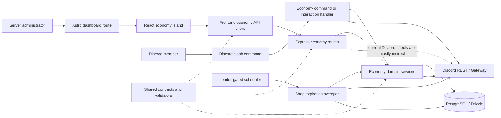

### Current dashboard availability

The React islands and API client code exist, but the Astro route files currently leave their island imports and `client:load` mounts commented out:

| Route | Current route behavior | Current island mount |
|---|---|---|
| `/dashboard/economy/settings` | Layout shell with page metadata | `EconomySettingsIsland` commented out |
| `/dashboard/economy/jobs` | Layout shell with page metadata | `EconomyJobsIsland` commented out |
| `/dashboard/economy/income` | Redirects to `/dashboard/economy/jobs` | No separate income island |
| `/dashboard/economy/shop` | Layout shell with page metadata | `EconomyShopIsland` commented out |
| `/dashboard/economy/casino` | Layout shell with page metadata | `EconomyCasinoIsland` commented out |
| `/dashboard/economy` | Redirects to `/dashboard/economy/settings` | None |

Therefore, the backend and dashboard feature implementations are present in source, but the reviewed Economy dashboard pages are not currently hydrated by their Astro route files.

### Current HTTP surface

| Method | Endpoint | Capability | Current purpose |
|---|---|---|---|
| `GET` | `/api/economy/config` | Bank and Settings | Read guild economy configuration. |
| `PUT` | `/api/economy/config` | Bank and Settings | Validate and update guild economy configuration. |
| `GET` | `/api/economy/income` | Income and Jobs | Read income, role salary, job, crime, and robbery configuration. |
| `PUT` | `/api/economy/income` | Income and Jobs | Validate and update income configuration. |
| `GET` | `/api/economy/casino` | Casino | Read casino configuration. |
| `PUT` | `/api/economy/casino` | Casino | Validate and update casino configuration. |
| `GET` | `/api/economy/shop/items` | Shop | List guild shop items. |
| `POST` | `/api/economy/shop/items` | Shop | Create a shop item. |
| `PUT` | `/api/economy/shop/items/:itemId` | Shop | Update a shop item. |
| `DELETE` | `/api/economy/shop/items/:itemId` | Shop | Delete a shop item. |
| `GET` | `/api/economy/leaderboard?limit=100` | Bank and Settings | Read the wealth leaderboard with resolved member display data. |
| `POST` | `/api/economy/funds` | Bank and Settings | Add, remove, or set a member's wallet or bank balance. |

The routes are guild-scoped through `guildIdOf(req)`. The reviewed Economy route module does not itself expose a feature-specific administrator guard; authorization must therefore be verified in shared middleware or added explicitly before treating these endpoints as safe for production administration.

---

# 1. Bank and Settings

## 1.1 Implemented configuration

`economy_config` is scoped by guild and contains:

| Setting | Current behavior |
|---|---|
| `isActive` | Default `false`; user economy commands require the module to be active. |
| `currencyName` | Default `Adobos Coins`; maximum length 64. |
| `currencySymbol` | Default `🪙`; maximum length 16. The dashboard also supports an uploaded symbol URL. |
| `startBalance` | Non-negative; applied to the new member's wallet when a `user_economy` row is first created. |
| `transferTax` | Percentage from `0` to `100`; applied to wallet-to-wallet `/pay`. |
| Maximum balance | Wallet and bank values are bounded by the shared maximum of `2,000,000,000`. |

The dashboard settings component also exposes a leaderboard view. The leaderboard is sorted by `wallet + bank` and returns up to 100 rows with resolved member display information.

## 1.2 Dashboard save flow

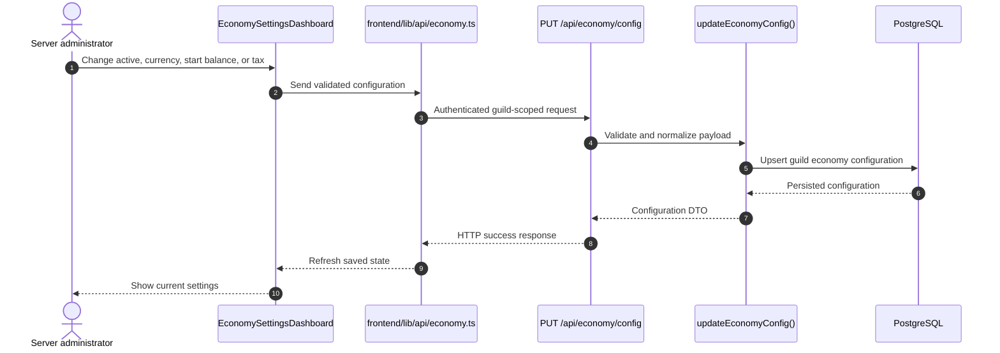

The route exposes `GET /api/economy/config` and `PUT /api/economy/config`. The module resolves the guild from the authenticated request and passes it to the domain service.

## 1.3 User balance and bank operations

The implementation separates a user's `wallet` from their `bank`:

| Operation | Source | Destination | Current rule |
|---|---|---|---|
| `/balance [user]` | None | Read wallet and bank | Displays wallet, bank, and net worth. |
| `/deposit amount` | Wallet | Bank | Supports a positive integer or `all`; must have enough wallet funds. |
| `/withdraw amount` | Bank | Wallet | Supports a positive integer or `all`; must have enough bank funds. |
| `/pay user amount` | Sender wallet | Recipient wallet | Wallet-only transfer; transfer tax is computed from the amount. |
| `/baltop` | None | Read many users | Sorts by wallet plus bank. |
| `/addmoney`, `/removemoney`, `/setmoney` | Target wallet or bank | Admin adjustment | Uses an atomic database transaction and supports wallet/bank target selection. |

All money mutations use PostgreSQL transactions and lock the affected `user_economy` row before changing funds. The transfer path locks both users in a deterministic order to reduce deadlock risk.

```mermaid
sequenceDiagram
    autonumber
    actor Member as Discord member
    participant Discord as Discord interaction
    participant Handler as income.ts command handler
    participant Funds as funds.ts
    participant DB as PostgreSQL
    participant Response as Discord response

    Member->>Discord: /deposit, /withdraw, /pay, or /balance
    Discord->>Handler: Interaction with guild/user/amount
    Handler->>Funds: Parse amount and resolve economy account
    Funds->>DB: BEGIN; lock affected user row(s)
    alt Read operation
        DB-->>Funds: Wallet and bank values
    else Valid mutation
        Funds->>DB: Validate balance and tax
        Funds->>DB: Update wallet/bank atomically
        DB-->>Funds: New balances
    else Invalid mutation
        DB-->>Funds: Insufficient funds or invalid amount
    end
    Funds-->>Handler: Result or domain error
    Handler->>Response: Reply with balance, transfer, or error
```

### Transfer tax semantics

The shared `computePayTax` function calculates the tax from the transfer amount. The source is the sender's wallet; the recipient receives the post-tax amount according to the current implementation. The document intentionally treats this as the existing contract and does not infer a separate treasury or burn account because no such destination is evidenced in the reviewed economy sources.

## 1.4 Administrator balance adjustments

The settings dashboard leaderboard provides an edit action for an individual member. The modal can target `wallet` or `bank`, with `add`, `remove`, or `set`. The backend applies the change atomically and clamps values to the configured shared bounds.

```mermaid
sequenceDiagram
    autonumber
    actor Admin as Server administrator
    participant UI as Leaderboard edit modal
    participant Route as POST /api/economy/funds
    participant Funds as adjustEconomyFunds()
    participant DB as PostgreSQL

    Admin->>UI: Select member, wallet/bank, action, amount
    UI->>Route: Authenticated funds adjustment
    Route->>Funds: Validate target and action
    Funds->>DB: BEGIN; SELECT target user FOR UPDATE
    Funds->>DB: Apply add, remove, or set
    Funds->>DB: COMMIT
    DB-->>Funds: Updated balance
    Funds-->>Route: Updated wallet and bank
    Route-->>UI: Adjustment result
```

### Current limitation: authorization evidence

`backend/src/modules/economy/http/routes.ts` resolves the guild and invokes economy domain operations. A feature-specific administrator permission guard is not visible in that module route path. A global authentication/authorization middleware may exist elsewhere, but it was not assumed as proof for this module. The balance-adjustment route therefore requires an explicit authorization audit before production use.

## 1.5 Bank and Settings data flow

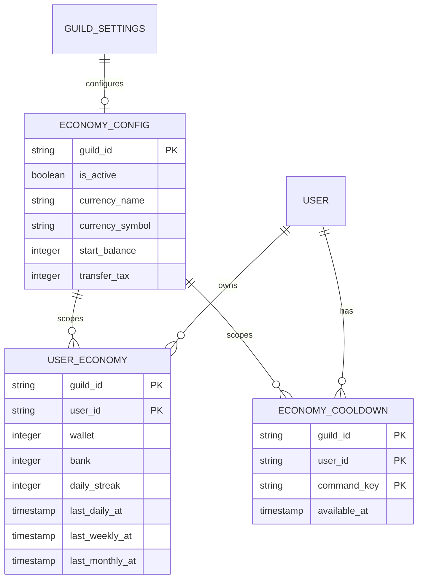

---

# 2. Income and Jobs

## 2.1 Implemented dashboard configuration

The Jobs dashboard component has four tabs:

1. Fixed income: daily, weekly, and monthly amounts.
2. Role salaries: daily or weekly amounts for matching Discord roles.
3. Jobs and crimes: configurable payout, cooldown, messages, and crime probability/fines.
4. Robbery: optional wallet-only robbery configuration.

The backend stores this configuration in one guild-scoped `economy_income` record with normalized arrays. It limits the configured collection sizes to 50 role salaries, 40 jobs, and 40 crimes.

## 2.2 Fixed income and daily streak

`/daily`, `/weekly`, and `/monthly` use durable timestamps in `user_economy`:

| Command | Claim period | Extra behavior |
|---|---:|---|
| `/daily` | 24 hours | May increment a daily streak and add the configured percentage bonus. |
| `/weekly` | 7 days | No daily-streak bonus. |
| `/monthly` | 30 days | No daily-streak bonus. |

The daily streak increments when the previous daily claim is within 48 hours. If the user misses that continuity window, the streak resets according to the current service logic. The resulting amount is credited to the wallet inside a transaction that locks the user row.

```mermaid
sequenceDiagram
    autonumber
    actor Member as Discord member
    participant Discord as Discord interaction
    participant Handler as /daily, /weekly, or /monthly
    participant Funds as claimFixedIncome()
    participant DB as PostgreSQL

    Member->>Discord: Claim fixed income
    Discord->>Handler: guildId + userId
    Handler->>Funds: Request configured period
    Funds->>DB: BEGIN; lock user_economy row
    Funds->>DB: Check durable period timestamp
    alt Cooldown available
        Funds->>DB: Calculate base amount and optional daily streak bonus
        Funds->>DB: Credit wallet and update claim timestamp
        DB-->>Funds: New wallet and streak
    else Period not available
        DB-->>Funds: Next available timestamp
    end
    Funds-->>Handler: Claim result
    Handler-->>Discord: Payout or cooldown response
```

## 2.3 Role salaries

`/collect-income` matches the member's current Discord roles against configured role salaries. Each salary has its own durable cooldown key (`salary:<id>`), so multiple matching salaries can be collected independently. Only configured matching roles produce a payout.

```mermaid
flowchart TD
    Start[/collect-income] --> Resolve[Resolve member roles]
    Resolve --> Match[Find configured role salaries]
    Match --> Any{Any matching salary?}
    Any -- No --> Empty[Return no income available]
    Any -- Yes --> Each[For each matching salary]
    Each --> Cooldown{Salary cooldown available?}
    Cooldown -- No --> Skip[Skip salary and keep its next time]
    Cooldown -- Yes --> Tx[Lock user row and credit wallet]
    Tx --> Set[Set salary-specific cooldown]
    Set --> More{More salaries?}
    Skip --> More
    More -- Yes --> Each
    More -- No --> Reply[Return collected and skipped results]
```

## 2.4 Jobs

`/work` uses the configured jobs and a shared choice-mode rule:

| Number of configured jobs | Selection behavior |
|---:|---|
| 0 | Return a configuration error. |
| 1 | Automatically use the only job. |
| 2–5 | Show a Discord select menu. |
| More than 5 | Select a job randomly. |

After selection, the service chooses an integer payout between `minPay` and `maxPay`, credits the wallet, stores a durable command cooldown, and renders the configured success template with `{job}`, `{payout}`, and `{currency}` placeholders.

```mermaid
sequenceDiagram
    autonumber
    actor Member as Discord member
    participant Discord as Discord
    participant Handler as /work handler
    participant Cooldown as Durable cooldown service
    participant DB as PostgreSQL

    Member->>Discord: /work
    Discord->>Handler: Command interaction
    Handler->>Cooldown: Assert work cooldown
    alt Cooldown unavailable
        Cooldown-->>Handler: Next available time
        Handler-->>Discord: Cooldown response
    else Available
        Handler->>Handler: Apply auto/select/random choice mode
        alt Select menu required
            Handler-->>Discord: Render job select menu
            Member->>Discord: Select job
            Discord->>Handler: Owned selection interaction
        end
        Handler->>Handler: Generate payout in configured range
        Handler->>DB: BEGIN; lock user and credit wallet
        Handler->>Cooldown: Set job cooldown
        Handler-->>Discord: Render success template
    end
```

## 2.5 Crimes

`/crime` follows the same selection policy as `/work`, but settlement uses a random `1..100` roll:

- If the roll is at or below `successChance`, the user receives a random reward in the configured reward range.
- Otherwise, the user is charged a random fine in the configured fine range, limited by the wallet balance.
- The fine is wallet-only; there is no evidence that the bank is debited for a crime.
- The durable cooldown is set after settlement.

```mermaid
flowchart TD
    Start[/crime] --> Guard[Check economy, crime list, and cooldown]
    Guard --> Choice[Resolve single, select, or random crime]
    Choice --> Roll[Generate cryptographic 1..100 result]
    Roll --> Success{Roll <= successChance?}
    Success -- Yes --> Reward[Generate reward and credit wallet]
    Success -- No --> Fine[Generate fine and debit available wallet]
    Reward --> Cooldown[Persist crime cooldown]
    Fine --> Cooldown
    Cooldown --> Message[Render success or fail template]
```

## 2.6 Optional robbery

Robbery is disabled by default. When enabled, `/rob user`:

1. Rejects bots and self-targets.
2. Requires the victim wallet to meet `minTargetWallet`.
3. Uses a configured success chance.
4. On success, transfers a random percentage of the victim's wallet to the robber.
5. On failure, charges a configured percentage of the robber's wallet.
6. Never robs the victim's bank in the current implementation.
7. Locks both user rows in one transaction.

```mermaid
sequenceDiagram
    autonumber
    actor Robber as Robber
    participant Discord as Discord interaction
    participant Handler as /rob handler
    participant Funds as robWallet()
    participant DB as PostgreSQL

    Robber->>Discord: /rob target
    Discord->>Handler: Resolve target and robbery config
    Handler->>Handler: Reject bot/self and check cooldown
    Handler->>DB: Read target wallet threshold
    alt Target does not qualify
        Handler-->>Discord: Reject robbery
    else Target qualifies
        Handler->>Handler: Roll success and steal/fine percentage
        Funds->>DB: BEGIN; lock robber and target in stable order
        alt Success
            Funds->>DB: Debit target wallet and credit robber wallet
        else Failure
            Funds->>DB: Debit available robber wallet
        end
        Funds->>DB: COMMIT
        Handler-->>Discord: Render result
    end
```

## 2.7 Income data flow

```mermaid
erDiagram
    ECONOMY_CONFIG ||--o| ECONOMY_INCOME : configures
    ECONOMY_INCOME ||--o{ ROLE_SALARY : contains
    ECONOMY_INCOME ||--o{ JOB : contains
    ECONOMY_INCOME ||--o{ CRIME : contains
    ECONOMY_INCOME ||--o| ROB_CONFIG : contains
    USER_ECONOMY ||--o{ ECONOMY_COOLDOWN : receives

    ECONOMY_INCOME {
        string guild_id PK
        integer daily_pay
        integer weekly_pay
        integer monthly_pay
        boolean streak_enabled
        integer streak_bonus_percent
    }
    ROLE_SALARY {
        string id
        string role_id
        integer amount
        string frequency
    }
    JOB {
        string id
        string name
        integer min_pay
        integer max_pay
        integer cooldown_minutes
    }
    CRIME {
        string id
        string name
        integer success_chance
        integer min_reward
        integer max_reward
        integer min_fine
        integer max_fine
    }
    ROB_CONFIG {
        boolean enabled
        integer success_chance
        integer min_target_wallet
        integer min_steal_percent
        integer max_steal_percent
        integer fail_fine_percent
    }
```

---

# 3. Shop

## 3.1 Implemented item model

The shop supports active, ordered items with nullable stock (`null` means unlimited). Each item must have at least one reward. Supported reward types are:

| Reward | Current effect |
|---|---|
| Role | Assign an existing Discord role, optionally temporary. |
| Private channel | Create a private text channel, optionally under a selected category, optionally temporary. |
| Boost | Create an XP or Economy boost with a multiplier and optional duration. XP boosts require the Levels module to be active during preflight. |
| Manual | Create a staff-facing ticket/log message with instructions, log channel, ping role, and optional thread. It intentionally remains pending for manual fulfillment. |

The shared contract supports reward metadata for ownership and expiration. Prices are bounded to 1 billion; stock may be finite or unlimited; boost multipliers are bounded by the shared contract.

## 3.2 Dashboard builder flow

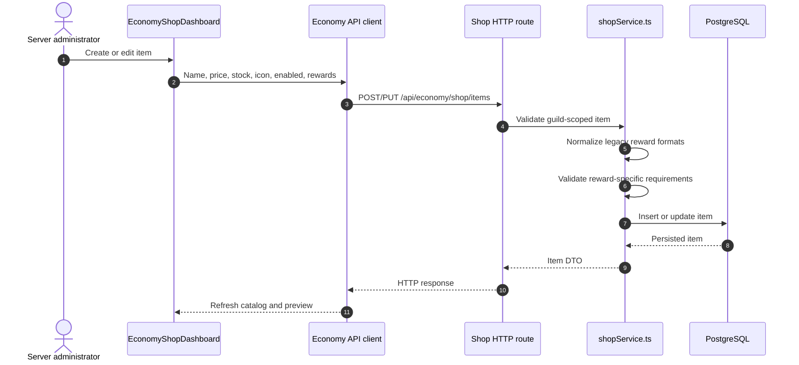

The builder exposes appearance, stock, and reward tabs. It can select existing roles/channels and preview the Discord presentation. The current Astro page does not mount the React island, so this builder is not active through the reviewed route file until that mount is enabled.

## 3.3 User catalog flow

`/shop` lists only enabled items that are in stock. It renders up to five items per page, shows stock and benefits, and uses Discord buttons for pagination and purchase. `/buy` supports item autocomplete and the same purchase service as the button path.

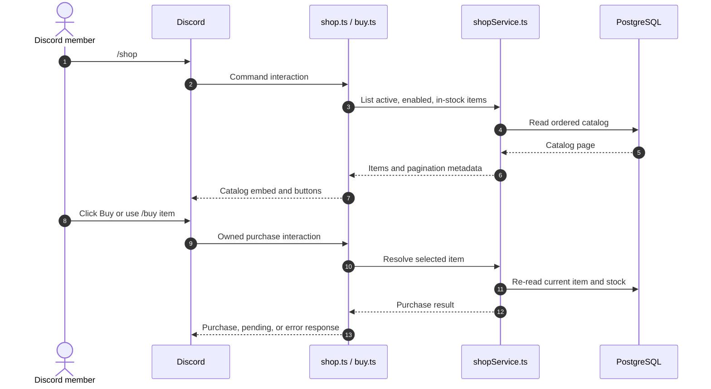

The item icon can be an emoji or an uploaded/HTTP image. Image resolution affects the Discord presentation only; the purchase authorization and settlement remain backend/database operations.

## 3.4 Purchase transaction and reward fulfillment

The purchase path is the most transactionally complete part of the current Economy module:

1. Verify Economy is active, the item is enabled, and stock remains available.
2. Preflight reward prerequisites, including Levels being active for XP boosts.
3. Lock the item and the user account in a database transaction.
4. Debit wallet first, then bank, and decrement finite stock in the same transaction.
5. Insert an `economy_purchases` record with `pending` status before Discord side effects.
6. Fulfill enabled rewards sequentially.
7. If all automatic effects succeed, mark the purchase `fulfilled`; manual rewards can remain `pending`.
8. If a later effect fails, compensate earlier effects in reverse order.
9. Refund only if all compensation succeeds; otherwise mark `needs_reconciliation`.

```mermaid
sequenceDiagram
    autonumber
    actor Member as Discord member
    participant Handler as /buy or Buy button
    participant Purchase as purchaseService.ts
    participant DB as PostgreSQL
    participant Discord as Discord API

    Member->>Handler: Select shop item
    Handler->>Purchase: purchaseItem(guildId, userId, itemId)
    Purchase->>DB: Read active item and economy state
    Purchase->>DB: BEGIN; lock item and user account
    Purchase->>DB: Debit wallet first, then bank
    Purchase->>DB: Decrement stock when finite
    Purchase->>DB: Insert purchase(status=pending)
    Purchase->>DB: COMMIT financial reservation

    loop Enabled rewards in order
        Purchase->>Discord: Assign role, create channel, create boost, or create manual ticket
        alt Effect succeeds
            Discord-->>Purchase: Discord resource/result
        else Effect fails
            Discord-->>Purchase: Error
            Purchase->>Discord: Compensate completed effects in reverse order
            alt All compensation succeeds
                Purchase->>DB: Mark refunded
                Purchase->>DB: Restore stock and funds
            else Compensation is incomplete
                Purchase->>DB: Mark needs_reconciliation
            end
        end
    end
    Purchase->>DB: Mark fulfilled or pending and save reward metadata
    Purchase-->>Handler: Purchase status and purchase ID
    Handler-->>Member: Discord result embed
```

### Financial and Discord boundary

The financial reservation is durable before external Discord effects begin. This prevents a process restart from losing the fact that money was taken. The Discord effects themselves are not currently an outbox-driven distributed workflow; the compensation path is synchronous within the purchase request.

## 3.5 Expiration and cleanup

The module starts a shop expiration sweeper on each worker replica, but each tick checks worker leadership before processing. The sweep interval is 60 seconds. It handles expired roles, channels, and boosts.

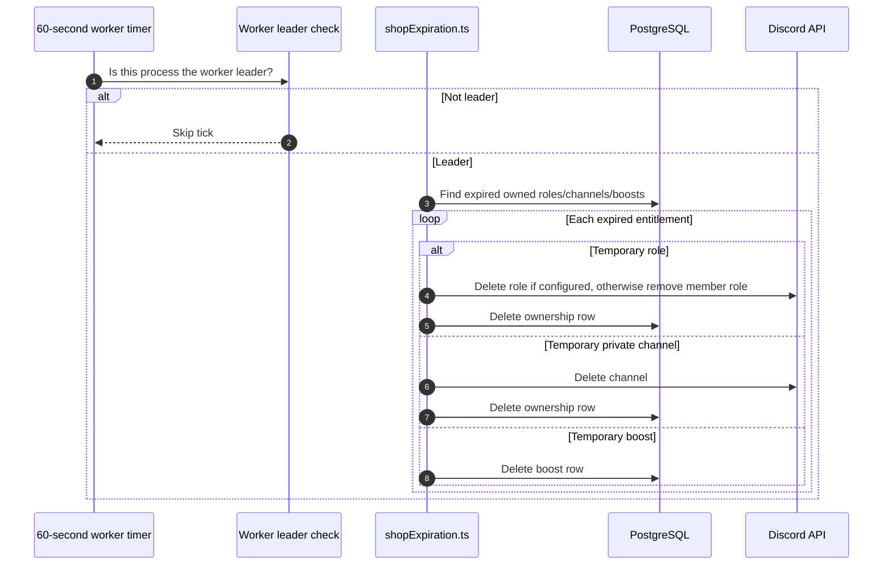

### Expiration limitation

The current sweeper deletes the database ownership row after attempting the Discord operation. A failed Discord deletion/removal can therefore lose the retryable record. This is a concrete reliability gap, not an inferred absence.

## 3.6 Shop data flow

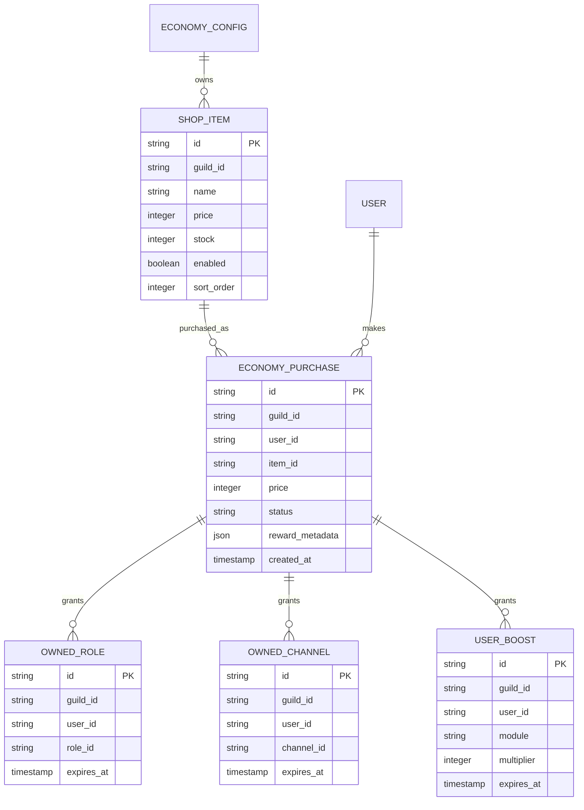

---

# 4. Casino

## 4.1 Implemented configuration

The Casino dashboard exposes global, Coinflip, Roulette, Blackjack, and Slots settings. The global guard requires both Economy and Casino to be active, and validates integer bets against configured minimum and maximum values.

| Game | Current implementation |
|---|---|
| Coinflip | Heads/tails prompt, cryptographic result, configurable multiplier/message, wallet stake and payout. |
| Roulette | European `0–36`, red/black/green/number bets, configurable multipliers, last-five in-memory history. |
| Blackjack | One-to-eight-deck CSPRNG shoe, dealer rules, natural payout, hit/stand/double/split where enabled, durable open stake. |
| Slots | Three independently weighted symbols, configured payout table, wallet stake and payout. |

Several persisted fields are intentionally not live gameplay controls: `allowDoubleOrNothing` is deprecated/unused, and Roulette's `bettingTimeSeconds` has no live table behavior in the current command flow.

## 4.2 Common interaction lifecycle

All games use Discord interactions with an owner check. Active gameplay state is kept in memory, so the process that owns a pending game must remain available for interaction. Idle tables expire after five minutes. Cooldowns are durable after settlement, while most active table state is not.

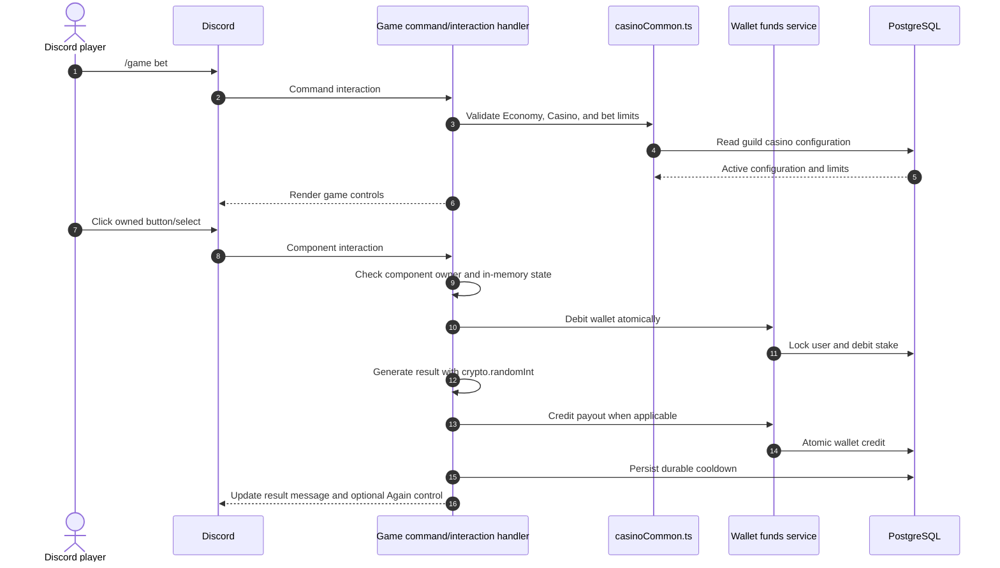

## 4.3 Coinflip

`/coinflip bet [side]` can render Heads/Tails buttons when the side is not supplied. The selected interaction is restricted to the initiating user. The stake is charged on play, the result is generated with the Node crypto random generator, and a winning payout is credited to the wallet. The result message can expose an owner-only `Again` action.

Current payout behavior is `floor(bet × configured multiplier)`. The persisted double-or-nothing flag is not used by the runtime.

## 4.4 Roulette

`/roulette bet [type] [number]` supports red, black, green, and exact number selection. The wheel uses European numbers `0–36` and standard color mapping. The result is settled immediately after selection. A per-guild last-five history is maintained in memory and displayed only when `showNumberHistory` is enabled.

The current code does not implement a persistent/live betting table, despite the presence of a persisted `bettingTimeSeconds` setting.

## 4.5 Slots

`/slots bet` charges the wallet, generates three independent weighted symbols using the cryptographic RNG, applies the configured payout rules, and credits the resulting payout. The visible multipliers include pair `×1.7`, with triple multipliers ranging from `×3` to `×80` depending on the symbol table.

The expected-return helper exists for analysis, but no dashboard risk/return validation is evidenced in the current flow.

## 4.6 Blackjack

`/blackjack bet` creates a game with a shoe of 1, 2, 4, 6, or 8 decks. The implementation supports:

- Natural blackjack payout.
- Hit and stand.
- Optional double down.
- Optional split for exact same ranks.
- Dealer behavior below 17 and configurable soft-17 handling.
- Owner-only controls and inactivity timeout.

Blackjack differs from the other games because the initial stake is recorded in `economy_blackjack_open`. On startup, the initial worker leader refunds abandoned open stakes. The gameplay state itself remains in memory, so a process loss can still interrupt a hand; the durable open-stake table is the recovery mechanism for that case.

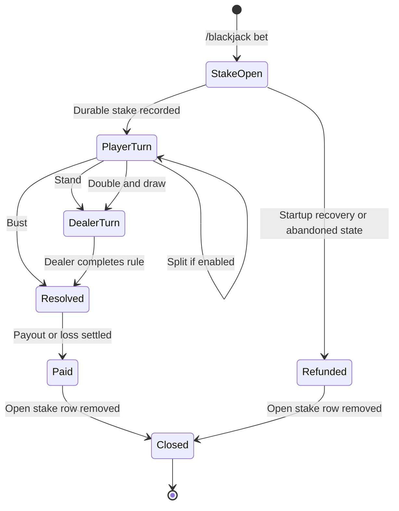

## 4.7 Casino data flow

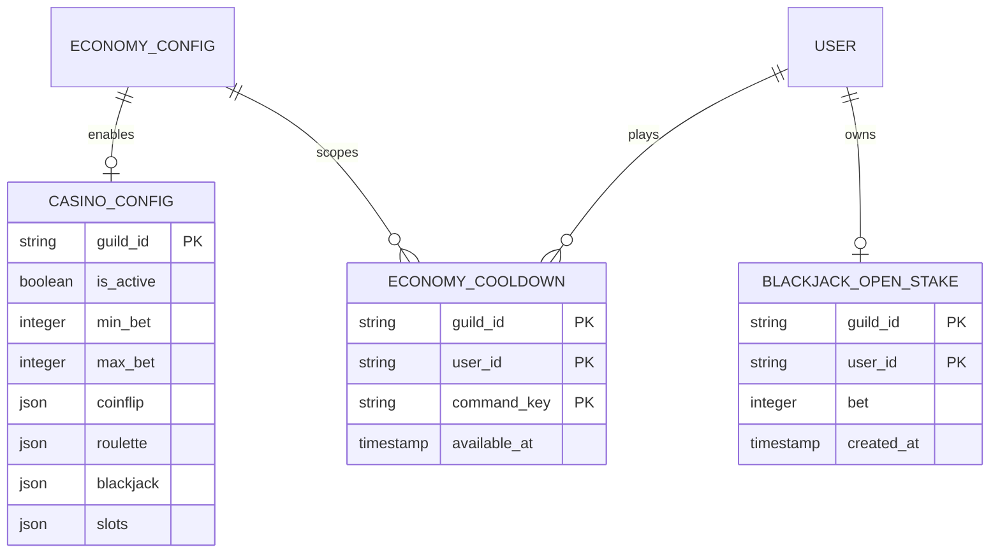

---

# 5. Current implementation boundaries

These are implementation facts that affect the end-to-end behavior of all four requested areas:

| Boundary | Current behavior | Impact |
|---|---|---|
| Money consistency | Wallet/bank mutations use row locks and transactions. | Strong local balance consistency. |
| Money history | No general immutable double-entry ledger is evidenced; `economy_purchases` is purchase history, not a complete money ledger. | Auditing, reconciliation, and dispute investigation are limited. |
| External Discord effects | Shop effects happen after financial reservation; compensation is synchronous. | A process failure can leave Discord and database state requiring manual reconciliation. |
| Idempotency | Purchase status exists, but no general idempotency key/outbox consumer is evidenced. | Retries could repeat or partially repeat remote effects unless callers guard them. |
| Active game state | Most casino tables and Roulette history are in memory. | Restart or multi-worker routing can interrupt interactive sessions. |
| Scheduler | Shop expiration is leader-gated per tick. | Duplicate sweeps are reduced, but failure retry state is not durable enough for all effects. |
| HTTP authorization | Economy routes resolve a guild but do not show a feature-specific administrator check in the reviewed route module. | Admin endpoints need explicit authorization verification. |
| Frontend delivery | Economy Astro routes do not mount their React islands. | Source-level builders exist, but the documented dashboard pages are currently shells. |
| Configuration truth | Some persisted casino settings are deprecated or not wired to live behavior. | The UI should distinguish active controls from compatibility fields. |

---

# 6. External comparison

## 6.1 Research method

The comparison uses public product documentation and official help/documentation pages where available. `NOT EVIDENCED` means that the reviewed official material did not provide a sufficiently specific description of the requested Economy behavior; it does not claim that the product cannot implement it privately or through undocumented commands.

## 6.2 Feature comparison

| Product | Bank and Settings | Income and Jobs | Shop | Casino | Evidence status |
|---|---|---|---|---|---|
| Sapphire Bot | `NOT EVIDENCED` | `NOT EVIDENCED` | `NOT EVIDENCED` | `NOT EVIDENCED` | Public Discord application listing reviewed; no sufficiently detailed official Economy specification found.[^sapphire] |
| ProBot | `NOT EVIDENCED` | `NOT EVIDENCED` | `NOT EVIDENCED` | `NOT EVIDENCED` | Official module documentation reviewed; no sufficiently detailed Economy specification found.[^probot] |
| CommunityOne | `NOT EVIDENCED` | `NOT EVIDENCED` | `NOT EVIDENCED` | `NOT EVIDENCED` | Public official site reviewed; no sufficiently detailed Economy specification found.[^communityone] |
| MEE6 | `NOT EVIDENCED` | `NOT EVIDENCED` | `NOT EVIDENCED` | `NOT EVIDENCED` | Official help material reviewed; the reviewed material did not specify these Economy capabilities.[^mee6] |
| Dyno | `NOT EVIDENCED` | `NOT EVIDENCED` | `NOT EVIDENCED` | `NOT EVIDENCED` | Official module documentation reviewed; no sufficiently detailed Economy specification found.[^dyno] |
| Carl-bot | `NOT EVIDENCED` | `NOT EVIDENCED` | `NOT EVIDENCED` | `NOT EVIDENCED` | Official documentation reviewed; the public docs describe Levels but not these Economy capabilities.[^carl] |
| Arcane | `NOT EVIDENCED` | `NOT EVIDENCED` | `NOT EVIDENCED` | `NOT EVIDENCED` | Official documentation reviewed; no sufficiently detailed Economy specification found.[^arcane] |
| Invite Tracker | `NOT EVIDENCED` | `NOT EVIDENCED` | `NOT EVIDENCED` | `NOT EVIDENCED` | Official documentation reviewed; no sufficiently detailed Economy specification found.[^invite] |
| UnbelievaBoat | Implemented externally: currency, starting balance, maximum cash/bank, audit logging, deposits/withdrawals, transfers, leaderboard, permission controls | Implemented externally: work, crime, rob, role income, chat income, cooldowns | Implemented externally: roles, balance/inventory/messages, requirements, categories, timed reversal, item limits | Implemented externally: documented blackjack, roulette, slot machine, and other games | Detailed official FAQ, command, API, and product documentation available.[^ub-settings][^ub-role-income][^ub-store][^ub-earn] |

## 6.3 What the external reference makes explicit

UnbelievaBoat is the only requested reference for which the reviewed official material described a comparable full economy surface. The most relevant documented behaviors are:

| Area | External behavior | Project gap or difference |
|---|---|---|
| Bank configuration | Currency symbol, starting bank balance, maximum cash/bank, and a money audit log sent to a configured channel | Adobos has wallet/bank and a balance cap, but no evidenced immutable money audit log or separate configurable cash/bank caps. |
| Role income | Fixed or percentage role income, scheduled or collectable modes, role stacking, automatic `@everyone`, announcements, and role-based cooldowns | Adobos supports fixed daily/weekly salaries with independent cooldowns, but not the documented percentage, scheduled automatic distribution, announcement, or full policy surface. |
| Store | Role, balance, inventory, and message actions; requirements; categories; timed reversal; item/action limits | Adobos has stronger reward diversity in the current source, including channels and boosts, but lacks a documented requirements/eligibility layer and durable retry projector. |
| Earning/risk | Work, crime, robbery, role income, chat income, and game income with configurable cooldowns | Adobos has work, crime, optional robbery, fixed income, role salaries, and casino, but no evidenced chat-income source. Chat income is a candidate extension only if it remains within the Economy scope. |
| Permissions | Per-user and per-role command allow/deny, management defaults, and Bot Commander-style trusted management | Adobos needs an explicit Economy policy layer for management and member command controls. |

---

# 7. Gaps and proposed additions

This section deliberately separates external/reference capabilities and engineering recommendations from the current implementation.

## 7.1 `NEW — RESEARCH`: feature gaps suggested by the comparison

These are capabilities that are documented by the UnbelievaBoat reference and are not currently evidenced in Adobos:

| ID | Proposed addition | Applies to | Why it matters |
|---|---|---|---|
| R-01 | Immutable money audit log with actor, reason, source, before/after balances, and correlation ID | Bank and Settings, all money-producing features | Enables moderator investigation, fraud review, and reconciliation. |
| R-02 | Separate configurable wallet and bank maximums | Bank and Settings | Lets servers define risk and storage behavior independently. |
| R-03 | Economy permission policies by command, role, and user | Bank and Settings, Income, Casino, Shop management | Makes admin and high-risk commands explicit instead of relying on implicit route assumptions. |
| R-04 | Role salary modes: scheduled automatic payout, collectable payout, fixed or percentage, stacking policy, and announcements | Income and Jobs | Covers common role-based earning models while preserving current fixed salaries. |
| R-05 | Store eligibility requirements by role, balance, or owned item; categories and purchase limits | Shop | Prevents accidental or abusive purchases and supports progression gating. |
| R-06 | Timed reversal as a first-class shop action | Shop | Makes temporary roles, channels, boosts, and other entitlements consistent. |
| R-07 | Optional activity/chat income with strict anti-spam controls | Income and Jobs | Adds a common earning source, but should be added only with rate limits and anti-farming controls. |

## 7.2 `NEW — RECOMMENDED`: reliability and scale improvements

These are architecture improvements, not claims about the external products:

| ID | Recommendation | Current reason |
|---|---|---|
| A-01 | Add an immutable append-only double-entry economy ledger and derive balances or reconcile them against it | Current wallet/bank tables are mutable balances without a complete money history. |
| A-02 | Add an idempotency key to every user money command and purchase settlement | Prevents duplicate payouts/debits after retries or Discord interaction redelivery. |
| A-03 | Move Discord reward effects behind a transactional outbox and retryable worker | Shop compensation is currently synchronous and can leave partial remote state. |
| A-04 | Make entitlement expiration retryable: retain failed rows, record last error/attempt, and retry with backoff | Current expiration cleanup removes ownership rows after attempting Discord operations. |
| A-05 | Persist casino session state or route a guild/user session to a durable single-owner coordinator | In-memory game state is vulnerable to restart and multi-worker ownership changes. |
| A-06 | Make Blackjack recovery state sufficient to resume or safely settle a hand, not only refund the open stake | A durable stake prevents silent loss but does not preserve the in-progress game. |
| A-07 | Add authoritative server-side configuration versioning and publish cache invalidation events | Avoids stale workers using old payout, tax, or eligibility rules. |
| A-08 | Add explicit HTTP authorization policies and audit every configuration/funds mutation | The reviewed Economy route module does not make its admin guard visible. |
| A-09 | Add observability: ledger correlation ID, purchase ID, Discord resource IDs, retry counters, and metrics | Makes distributed Discord effects diagnosable. |
| A-10 | Add invariant and property tests for non-negative balances, caps, atomic transfer, payout bounds, and compensation | The module handles high-value state transitions and needs regression protection. |

## 7.3 `NEW — RECOMMENDED`: frontend and product corrections

| ID | Recommendation | Current reason |
|---|---|---|
| F-01 | Mount the Economy React islands from the Astro routes or remove inactive shells until ready | All four feature islands are currently commented out at the route level. |
| F-02 | Show a capability matrix in each builder: persisted, live, deprecated, and unavailable | Casino contains persisted settings that are not live controls. |
| F-03 | Add a dry-run/validation panel for shop rewards and Discord permissions | Reward fulfillment depends on role hierarchy, channel permissions, and module activation. |
| F-04 | Display pending, refunded, and reconciliation-required purchases to administrators | The backend has these statuses, but an operational UI is needed to act on them. |
| F-05 | Add a preview and test-settlement mode that cannot mutate real balances | Allows administrators to validate payout templates and reward effects safely. |

---

# 8. Recommended design pattern

## 8.1 Decision

The best fit is an **event-driven modular monolith with transactional boundaries and durable projections**:

- Keep Economy as one bounded module with domain services for money, income, catalog, entitlements, and games.
- Use PostgreSQL transactions for authoritative state.
- Use an append-only ledger for all monetary events.
- Use a transactional outbox for Discord side effects.
- Use idempotent workers for Discord effects and expiration.
- Use a single durable session coordinator for interactive casino games.
- Expose reusable core services for other future bot modules without adding those other modules to this document.

This preserves low-latency local transactions while isolating Discord's external API, rate limits, retries, and partial failures.

## 8.2 Target architecture

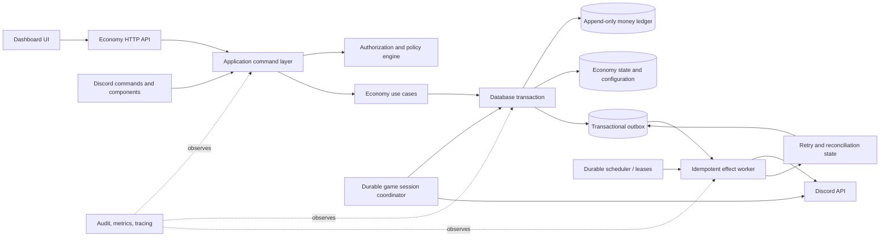

## 8.3 End-to-end target money flow

```mermaid
sequenceDiagram
    autonumber
    actor User as Discord user or administrator
    participant Edge as Command/API edge
    participant Policy as Policy engine
    participant UseCase as Economy use case
    participant DB as PostgreSQL transaction
    participant Ledger as Money ledger
    participant Outbox as Transactional outbox
    participant Worker as Effect worker
    participant Discord as Discord API

    User->>Edge: Request payout, transfer, purchase, or game settlement
    Edge->>Policy: Validate guild, actor, command, and limits
    Policy-->>Edge: Authorized request
    Edge->>UseCase: Execute with idempotency key
    UseCase->>DB: BEGIN; lock relevant aggregate(s)
    DB->>Ledger: Append debit/credit entries
    DB->>DB: Update projections and business state
    DB->>Outbox: Append required Discord effect
    DB-->>UseCase: COMMIT
    UseCase-->>Edge: Durable result
    Edge-->>User: Immediate response
    Worker->>Outbox: Claim effect with lease
    Worker->>Discord: Execute idempotently
    Discord-->>Worker: Resource ID or error
    Worker->>Outbox: Mark completed or retryable/terminal failure
    Worker->>Ledger: Append compensation/reconciliation entry if required
```

## 8.4 Reusable core pieces

These pieces are intentionally general enough to serve future bot modules without documenting those modules here:

| Core piece | Responsibility | Economy usage |
|---|---|---|
| `TenantPolicy` | Guild boundary, actor permissions, command enablement | Protect config, funds, shop management, and high-risk commands. |
| `MoneyLedger` | Immutable debit/credit entries, currency, reason, source, correlation ID | Fixed income, salaries, jobs, crime, robbery, shop, casino, transfers. |
| `AtomicBalance` | Transactional projection with cap and non-negative invariants | Wallet and bank reads/writes. |
| `IdempotencyStore` | One result per `(guild, user, operation, idempotencyKey)` | Discord retries, `/buy`, payouts, administrator adjustments. |
| `CooldownPolicy` | Durable availability, scope, reset, and message metadata | Daily/weekly/monthly, jobs, crime, robbery, salaries, casino. |
| `EffectOutbox` | Durable external side-effect intent and status | Roles, channels, boosts, manual shop fulfillment, expiration. |
| `DiscordEffectExecutor` | Permission-aware, retryable, idempotent Discord mutations | All shop entitlements and future event-driven features. |
| `EntitlementRegistry` | Ownership, expiry, source purchase, reversal policy | Temporary roles, channels, boosts, and timed store actions. |
| `SessionCoordinator` | Durable owner, state version, timeout, and resume/settle policy | Blackjack and future interactive games. |
| `AuditContext` | Actor, guild, source command, request ID, Discord IDs | Operator investigation and metrics across modules. |

## 8.5 Feature-specific target flows

### Bank and Settings

- Treat wallet and bank as two accounts in one ledger, not independent mutable integers only.
- Decide explicitly whether transfer tax is burned or credited to a treasury account; record that destination in the ledger.
- Make maximums, permissions, and audit destinations configuration data with versioning.

### Income and Jobs

- Represent every income source as a policy-driven `IncomeAction` with a payout formula, cooldown key, and ledger reason.
- Keep random generation server-side and record the random outcome or settlement metadata for auditability.
- Make role matching and stacking an explicit policy instead of an incidental loop.

### Shop

- Separate `PurchaseOrder`, `PaymentSettlement`, and `EntitlementGrant`.
- Let the outbox grant Discord rewards after the payment transaction commits.
- Make every grant and reversal idempotent by purchase ID plus reward ID.
- Keep pending/manual fulfillment visible and operable from the dashboard.

### Casino

- Make a game session a durable aggregate with state versioning and a single active owner.
- Settle one wager exactly once through the ledger, with a recorded outcome and payout formula version.
- Never use an in-memory result/history as the only source required to recover money.

## 8.6 Invariants to enforce

```mermaid
flowchart TD
    Request[Economy request] --> Validate[Validate guild, actor, config, and idempotency]
    Validate --> Lock[Lock required aggregate rows]
    Lock --> Invariants{Invariants hold?}
    Invariants -- No --> Reject[Reject without ledger mutation]
    Invariants -- Yes --> Ledger[Append balanced ledger entries]
    Ledger --> Projection[Update balance/session/stock projection]
    Projection --> Outbox[Create external effect intent]
    Outbox --> Commit[Commit once]
    Commit --> Worker[Execute and reconcile external effects]
```

Minimum invariants:

- No wallet or bank balance becomes negative.
- No account exceeds its configured maximum.
- A transfer has exactly one source debit and one recipient credit, plus an explicit tax destination if tax exists.
- A purchase cannot consume more stock than exists.
- A purchase cannot charge twice for the same idempotency key.
- A casino wager settles exactly once.
- A temporary entitlement cannot be reversed twice.
- A failed Discord effect remains retryable or becomes explicitly reconciled; it is never silently forgotten.

---

# 9. Audited repository sources

The current implementation statements in this document were checked against the following repository areas:

| Area | Primary files |
|---|---|
| Module wiring and routes | `backend/src/modules/economy/module.ts`, `backend/src/modules/economy/http/routes.ts`, `backend/src/modules/economy/http/schema.ts` |
| Bank and funds | `backend/src/modules/economy/domain/economy.ts`, `backend/src/modules/economy/domain/funds.ts`, `backend/src/modules/economy/domain/cooldowns.ts`, `backend/src/modules/economy/commands/income.ts` |
| Income configuration | `backend/src/modules/economy/domain/incomeService.ts`, `packages/shared/src/economy.ts` |
| Shop configuration and settlement | `backend/src/modules/economy/domain/shopService.ts`, `backend/src/modules/economy/purchaseService.ts`, `backend/src/modules/economy/shopExpiration.ts`, `backend/src/modules/economy/commands/shop.ts`, `backend/src/modules/economy/commands/buy.ts`, `packages/shared/src/economy-shop.ts` |
| Casino | `backend/src/modules/economy/domain/casinoService.ts`, `backend/src/modules/economy/commands/casinoCommon.ts`, `backend/src/modules/economy/commands/coinflip.ts`, `roulette.ts`, `slots.ts`, `blackjack.ts`, `backend/src/modules/economy/casino/*`, `packages/shared/src/economy-casino.ts` |
| Persistence | `backend/src/db/schema/economy.ts` |
| Dashboard | `frontend/src/features/economy/*`, `frontend/src/lib/api/economy.ts`, `frontend/src/pages/dashboard/economy/*`, `frontend/src/components/providers/islands.tsx` |

The codebase-memory coverage check reported no recorded issue for the cited production files. It reported one parse-partial line in `backend/src/modules/economy/purchaseService.test.ts`; that test file is not used as evidence for the runtime behavior described above.

# 10. External sources

[^sapphire]: [Sapphire Bot — Discord application listing](https://discord.com/discovery/applications/678344927997853742).
[^probot]: [ProBot — official module documentation](https://docs.probot.io/docs/category/modules).
[^communityone]: [CommunityOne — official site](https://communityone.io/).
[^mee6]: [MEE6 — official help center](https://help.mee6.xyz/).
[^dyno]: [Dyno — official module documentation](https://docs.dyno.gg/en/modules).
[^carl]: [Carl-bot — official documentation repository](https://github.com/botlabs-gg/carlbot-docs/blob/master/docs/index.md).
[^arcane]: [Arcane — official documentation](https://docs.arcane.bot/).
[^invite]: [Invite Tracker — official documentation](https://docs.invite-tracker.com/).
[^ub-settings]: [UnbelievaBoat — Economy settings](https://faq.unbelievaboat.com/dashboard/economy-settings/).
[^ub-role-income]: [UnbelievaBoat — Role income](https://faq.unbelievaboat.com/dashboard/role-income/).
[^ub-store]: [UnbelievaBoat — Store](https://faq.unbelievaboat.com/dashboard/store/).
[^ub-earn]: [UnbelievaBoat — How to earn money](https://faq.unbelievaboat.com/common-questions/how-to-earn-money/).
[^ub-cooldowns]: [UnbelievaBoat — Command cooldowns](https://faq.unbelievaboat.com/common-questions/command-cooldowns/).
[^ub-permissions]: [UnbelievaBoat — User and role permissions](https://faq.unbelievaboat.com/permissions/user-role/).
[^ub-api]: [UnbelievaBoat — API reference](https://api-docs.unbelievaboat.com/reference/reference).
[^ub-commands]: [UnbelievaBoat — Commands](https://unbelievaboat.com/commands?nonsfw=true).
