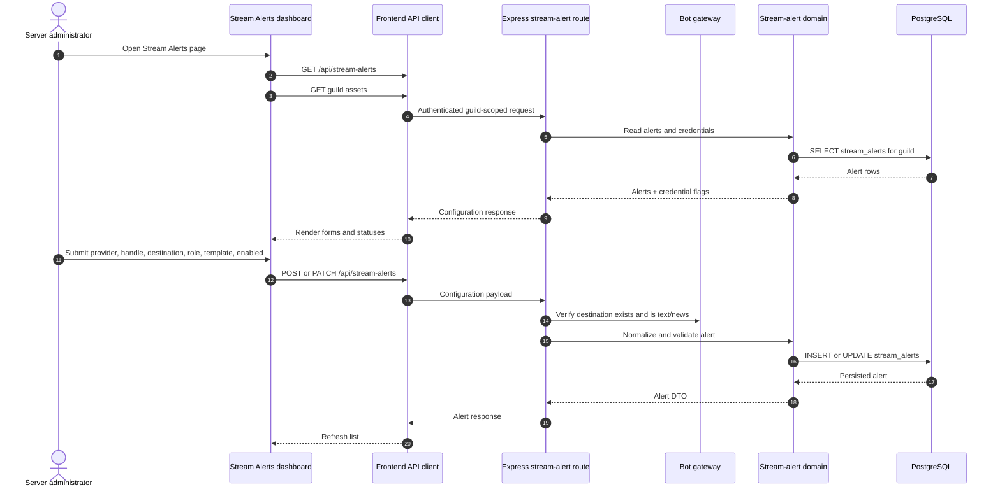
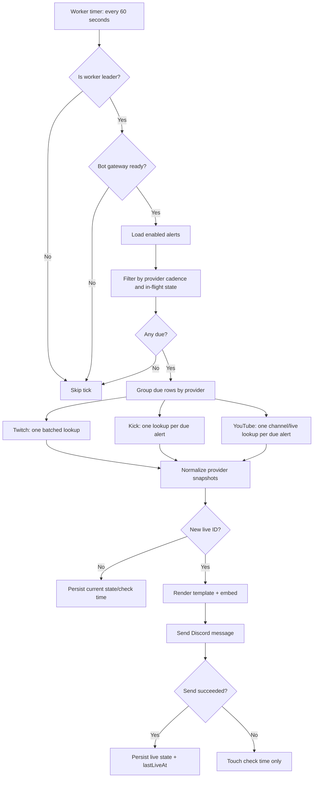
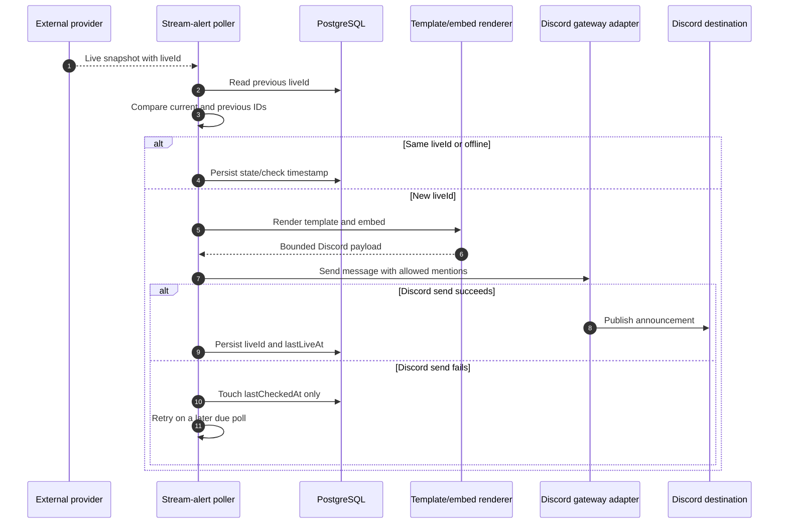
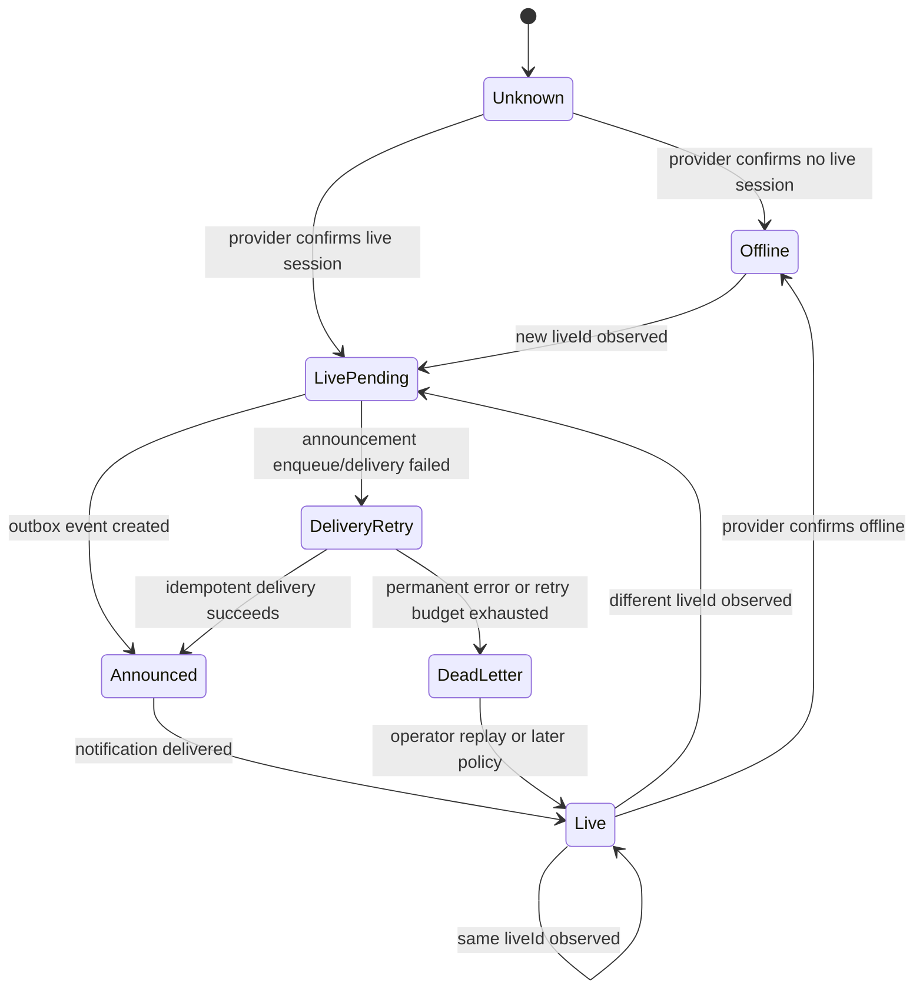
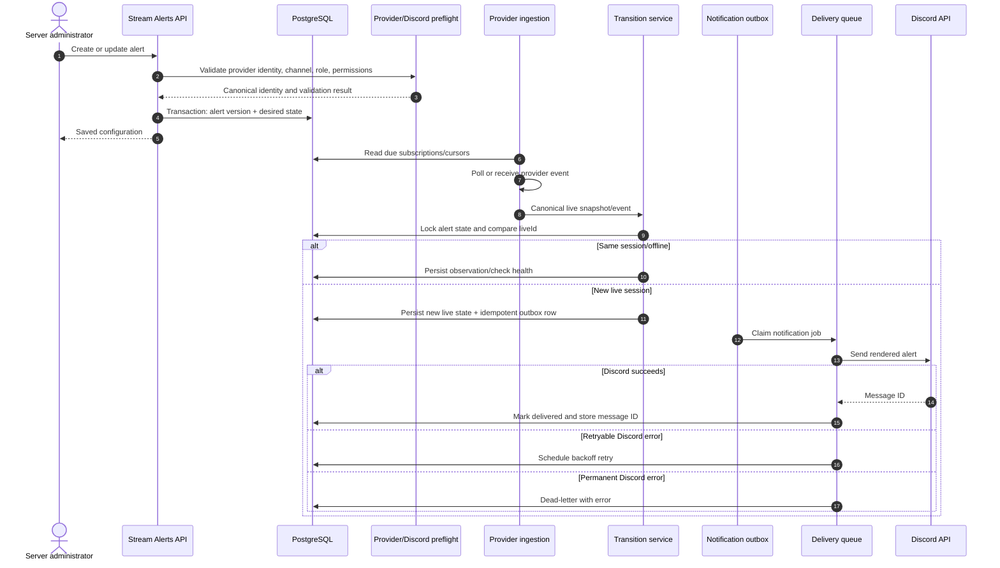

# Integrations Module

## Scope

This document covers only **Stream Alerts**.

It describes the current repository implementation, the end-to-end path from the dashboard to the backend, external provider APIs, Discord delivery, the comparison with the requested bots, the missing capabilities, and the recommended scalable design.

No application code is changed by this document. Future capabilities are explicitly marked `NEW` and are not part of the current implementation.

## Status vocabulary

| Marker | Meaning |
|---|---|
| `IMPLEMENTED` | Behavior verified in the current repository source. |
| `LIMITATION` | Current behavior that is narrower, incomplete, or operationally risky. |
| `NEW — RESEARCH` | A capability documented by an external bot and not evidenced in this repository. |
| `NEW — RECOMMENDED` | A reliability, security, scalability, or architecture improvement recommended for this project. |
| `NOT EVIDENCED` | No sufficiently specific public documentation was found for the requested bot/capability. This does not prove that the bot lacks it. |

## Executive summary

| Capability | Current implementation | Durable state | Discord-side effect |
|---|---|---|---|
| Stream Alerts | Guild-scoped alerts for Twitch, YouTube, and Kick; provider polling; transition detection by live-session ID; customizable text and embed | `stream_alerts` | One Discord embed/message when a monitored channel changes to a new live session |
| Dashboard | React builder with provider, handle/URL, destination channel, optional role mention, template, and enabled state | API-backed through the module | Saves configuration; does not publish a test alert |
| Worker | Leader-only poller; 60-second base tick; YouTube throttled to 5 minutes | `lastCheckedAt`, `isLive`, `liveId`, `lastLiveAt` | Reads providers and sends only on a new live ID |

The current module is a **polling-based live-start notifier**. It is not a generic social-feed integration, not a webhook receiver, and not a scheduled announcement system. It does not announce stream-offline transitions, edit/delete previous alerts, or send alerts for ordinary uploaded videos.

---

## Evidence and current dashboard status

The behavior in this document was verified against:

- `backend/src/modules/stream-alerts/module.ts`
- `backend/src/modules/stream-alerts/poller.ts`
- `backend/src/modules/stream-alerts/providers.ts`
- `backend/src/modules/stream-alerts/domain/stream-alerts.ts`
- `backend/src/modules/stream-alerts/http/routes.ts`
- `backend/src/modules/stream-alerts/http/schema.ts`
- `backend/src/db/schema/streamAlerts.ts`
- `packages/shared/src/stream-alerts.ts`
- `frontend/src/features/stream-alerts/StreamAlertsDashboard.tsx`
- `frontend/src/lib/api/stream-alerts.ts`
- `frontend/src/pages/dashboard/integrations/alerts.astro`
- `frontend/src/pages/dashboard/plugins/alerts.astro`

The React feature is exported as `StreamAlertsIsland`, but the current Astro page leaves its import and `client:load` mount commented out.

| Route | Current behavior | Status |
|---|---|---|
| `/dashboard/integrations/alerts` | Renders `DashboardLayout` and metadata only | Island not mounted |
| `/dashboard/plugins/alerts` | Redirects to the integrations route | Compatibility redirect |
| API `/api/stream-alerts` | Backend CRUD/configuration surface | Implemented |
| Worker | Leader-only polling and Discord delivery | Implemented |

This means the backend, API client, and React builder exist in source, but the current dashboard route does not hydrate the builder.

---

# 1. Current implementation

## 1.1 Supported providers

The shared contract supports exactly three platforms:

| Platform | User input accepted | Provider check | Current availability |
|---|---|---|---|
| Twitch | Login, `@handle`, `twitch.tv/<login>` URL | Twitch Helix `GET /helix/streams` | Requires `TWITCH_CLIENT_ID` and `TWITCH_CLIENT_SECRET` |
| YouTube | `UC...` channel ID, `@handle`, channel URL | YouTube Data API v3 channel resolution plus live search | Requires `YOUTUBE_API_KEY` |
| Kick | Slug, `@slug`, `kick.com/<slug>` URL | Kick channel API | Marked available without a key |

The API exposes these credentials as a boolean capability response:

- `twitch: true` only when both Twitch environment variables are present;
- `youtube: true` only when the YouTube API key is present;
- `kick: true` unconditionally.

The dashboard uses this response to display setup guidance. A `true` Kick credential flag means no configured key is needed; it does not guarantee that the upstream Kick endpoint is reachable.

## 1.2 Handle normalization

The shared normalizer converts user input to a canonical provider handle before persistence.

### Twitch

- Removes an optional `@`.
- Lowercases the login.
- Accepts 2–25 characters matching `[a-z0-9_]`.
- Accepts a `twitch.tv` URL after removing `www.`.
- Rejects URLs from other hosts.

### Kick

- Removes an optional `@`.
- Lowercases the slug.
- Accepts 3–50 characters matching `[a-z0-9_-]`.
- Accepts a `kick.com` URL.
- Rejects other hosts.

### YouTube

- Accepts a canonical channel ID matching `UC...`.
- Accepts an `@handle` or plain handle, which is stored with the `@` prefix.
- Accepts `youtube.com/channel/<UC...>`.
- Accepts `youtube.com/@handle`.
- Rejects `youtu.be` video URLs because the feature monitors channels, not individual videos.

The normalized handle and display name are stored, so repeated polling does not need to parse the originally submitted URL.

## 1.3 Destination and message contract

A Stream Alert requires a Discord destination channel. The route resolves the channel through the bot gateway and accepts only:

- Guild text channels;
- Guild announcement/news channels.

Voice, stage, category, forum, and media channels are rejected by the API.

The optional mention role is validated as a Discord Snowflake format. The current backend does not verify that the role exists in the guild before saving it; the dashboard filters its selector from guild role assets.

The alert template is:

- trimmed;
- defaulted to `{name} is live: {title}\n{url}` when empty;
- capped at 500 characters before persistence;
- rendered and capped at 2,000 characters at delivery.

Supported placeholders are:

| Placeholder | Runtime value |
|---|---|
| `{name}` | Provider display name, then stored display name or handle |
| `{title}` | Current live title |
| `{url}` | Provider watch URL |
| `{game}` | Current category/game when provided |
| `{handle}` | Canonical stored handle |
| `{platform}` | `Twitch`, `YouTube`, or `Kick` |

Unknown placeholders remain unchanged because rendering replaces only the supported tokens.

## 1.4 Persistence model

The `stream_alerts` table is guild-scoped:

| Field | Current behavior |
|---|---|
| `id` | Identity integer primary key |
| `guildId` | Required guild ID; cascades with `guild_settings` |
| `platform` | Provider identifier |
| `handle` | Canonical provider handle |
| `displayName` | Display fallback used by notifications/UI |
| `discordChannelId` | Discord destination |
| `mentionRoleId` | Optional role to mention |
| `template` | Capped notification text |
| `enabled` | Controls whether the poller selects the row |
| `isLive` | Last known live/offline state |
| `liveId` | Last known provider live-session identifier |
| `lastTitle` | Last observed title |
| `lastCheckedAt` | Last provider check or failure touch |
| `lastLiveAt` | Last successful live announcement time |
| `createdAt`, `updatedAt` | Timestamps |

The unique index is `(guildId, platform, handle)`, so one guild cannot monitor the same provider channel twice.

The `liveId` field is the deduplication key used to avoid re-announcing the same stream after a restart or a repeated provider response.

---

# 2. Dashboard and API flow

## 2.1 Dashboard behavior

The React dashboard loads, in parallel:

1. Stream alert configuration and provider credential availability.
2. Guild channels and roles from the shared guild-assets endpoint.

It provides:

- provider selector;
- channel/login/URL input;
- Discord destination selector;
- optional role mention selector;
- template textarea with placeholder reference;
- enabled switch;
- live/offline badge from persisted state;
- create, save, and delete operations;
- plan/entitlement count;
- provider setup warnings.

The dashboard does not expose:

- a test notification;
- per-alert polling interval;
- provider error state;
- last provider error;
- alert delivery history;
- edit/delete-after-stream behavior;
- different templates for online/offline;
- a preview rendered with real provider data.

## 2.2 API surface

| Method | Endpoint | Purpose |
|---|---|---|
| `GET` | `/api/stream-alerts` | Return guild alerts plus provider credential availability |
| `POST` | `/api/stream-alerts` | Validate destination and create an alert |
| `PATCH` | `/api/stream-alerts/:id` | Update an alert; destination is revalidated when changed |
| `DELETE` | `/api/stream-alerts/:id` | Delete a guild-scoped alert |

The API validates:

- platform enum;
- handle string length 1–128;
- destination Discord Snowflake;
- optional role Snowflake or null;
- template length up to 500;
- optional boolean `enabled`.

The domain additionally normalizes handles, applies entitlement limits, checks duplicate provider identities, and persists the result.

The route module itself does not display a feature-specific administrator guard. Any global dashboard authorization must be verified before treating these endpoints as the complete authorization boundary.

## 2.3 Configuration flow



Creation and updates do not trigger an immediate provider check or test Discord message. The first provider check occurs on the worker poller.

---

# 3. Provider polling and state transitions

## 3.1 Worker registration

The module registers:

- HTTP route `/api/stream-alerts`;
- no slash command;
- no button/select/modal handler;
- a leader-gated job named `stream-alerts:poll`.

At worker startup, it runs one initial poll. It then schedules a timer using `STREAM_ALERT_POLL_MS = 60,000` milliseconds. Non-leader workers skip the tick.

The current module does not use the shared durable queue for Stream Alerts. Provider checks and Discord sends happen in the poller process.

## 3.2 Poll eligibility

The shared `shouldPollStreamAlert` policy uses `lastCheckedAt`:

| Provider | Base minimum interval |
|---|---:|
| Twitch | 60 seconds |
| Kick | 60 seconds |
| YouTube | 300 seconds |

A row becomes eligible at approximately 90% of its minimum interval. This compensates for timer drift while keeping the intended provider cadence.

Disabled rows are not loaded by `listEnabledStreamAlerts`. An in-process `inFlight` set prevents the same alert from being processed concurrently inside one worker process.

## 3.3 Provider calls

### Twitch

The poller collects all due Twitch logins and makes one batched Helix request:

1. Obtain an app access token from `id.twitch.tv/oauth2/token`.
2. Cache the token in memory until shortly before expiry.
3. Request `GET https://api.twitch.tv/helix/streams` with repeated `user_login` parameters.
4. Parse live rows into a map keyed by lowercase login.
5. Treat logins absent from the response as offline.

The current implementation sends at most the first 100 due logins in one request, matching Twitch's documented maximum per request. It does not paginate or chunk beyond 100 in the same poll.

### Kick

For each due Kick alert, the provider calls:

`https://kick.com/api/v2/channels/<slug>`

The parser reads:

- `user.username`;
- `livestream.id`;
- `livestream.session_title` or title;
- first category name;
- thumbnail URL.

No API key is configured in the current implementation.

### YouTube

For each due YouTube alert:

1. Resolve a handle to a channel ID with `channels.list?forHandle=...` when the stored value is not already a `UC...` ID.
2. Query `search.list` with:
   - `type=video`;
   - `eventType=live`;
   - `channelId=<channelId>`;
   - `maxResults=1`;
   - `part=snippet`.
3. Treat the first `videoId` as the live session identifier.
4. Return offline when no matching item exists.

The current YouTube implementation therefore monitors active live broadcasts, not ordinary uploaded videos, shorts, scheduled broadcasts, or playlists.

Every provider request uses an eight-second abort timeout. Provider errors are logged and converted into a failure/offline decision path without crashing the entire poll tick.

## 3.4 State transition policy

The core transition function is:

`shouldAnnounceLive({ isLive, previousLiveId, liveId })`

It returns true only when:

- the current snapshot is live;
- a live ID exists;
- the live ID differs from the stored `liveId`.

| Previous state | Current provider state | Result |
|---|---|---|
| Offline/no live ID | Live with `L1` | Announce `L1` |
| Live with `L1` | Live with `L1` | Do not announce again |
| Live with `L1` | Live with `L2` | Announce new session `L2` |
| Live with `L1` | Offline | Persist offline; no Discord message |
| Offline/no live ID | Offline | Persist offline; no Discord message |

A successful snapshot updates `isLive`, `liveId`, `lastTitle`, `lastCheckedAt`, and, when an alert is successfully sent, `lastLiveAt`.

If the provider fails, or if the Discord announcement fails, the implementation touches `lastCheckedAt` but does not apply the new snapshot. This prevents a failing notification from being marked as successfully announced and allows a later poll to retry.

## 3.5 Poller flow



The loop processes due alerts sequentially after the provider lookups. A provider failure for one alert is logged and isolated; the outer tick continues with other alerts.

## 3.6 Announcement payload

When a new live session is detected, the poller builds:

- optional content: role mention plus rendered template;
- one embed;
- platform-specific embed color;
- embed title from the stream title, capped at 256;
- author from the stream display name;
- link to the provider watch URL;
- description `Jugando a <game>` when a game/category exists;
- thumbnail from the provider when available.

Allowed mentions are deliberately restricted:

- with a configured role: `roles: [mentionRoleId]` and empty parse list;
- without a role: empty parse list.

Therefore raw `@everyone` or `@here` text in the template is not automatically authorized as a ping.



---

# 4. Current limitations

| Limitation | Consequence |
|---|---|
| Dashboard island is not mounted in the Astro route | Administrators cannot use the reviewed React builder through the current route shell |
| Polling is the only provider transport | Detection latency depends on polling cadence; no near-real-time provider events |
| Twitch requests are capped at 100 logins without chunking | More than 100 due Twitch alerts are not fully checked in that poll; later rows may be interpreted as offline |
| YouTube resolves `@handle` to channel ID during live polling | Repeated channel-resolution requests add latency and quota pressure |
| YouTube uses `search.list` for live detection | The upstream quota cost and polling interval constrain scale |
| Kick integration depends on an undocumented/public endpoint in the reviewed code | Upstream changes or blocking can silently stop Kick detection |
| Provider failure is only represented by a timestamp touch and log | There is no durable provider health, error code, backoff state, or operator warning |
| `inFlight` is process-local | Multiple workers can poll the same alert unless leader exclusivity is perfectly maintained; restarts discard in-flight state |
| There is no durable per-event delivery record | Duplicate prevention and delivery audit rely mainly on `liveId` and current row state |
| Discord delivery occurs directly inside the poller | Slow Discord API calls block subsequent alert processing; no durable delivery retry queue exists |
| Notification failure does not have a bounded attempt/dead-letter model | A live alert can remain unannounced until the next provider cycle without a visible terminal outcome |
| No role existence or hierarchy check is performed at save time | A missing/inaccessible role may produce an announcement without the intended mention |
| No permissions preflight is performed for sending/embeds | The alert can be saved even if the bot cannot post or embed in the destination |
| Only live-start messages exist | No offline notification, stream-ended cleanup, auto-delete, or update/edit behavior |
| `lastCheckedAt` is also touched after errors | Operators cannot distinguish a healthy offline result from a failed provider check by reading the row alone |
| No test notification exists | Configuration errors are discovered only when a real transition occurs |
| Dashboard loads the entire alert list | No pagination or server-side filtering is defined for larger tenants |
| Route-level administrator authorization is not visible | The global dashboard authorization layer must be verified separately |
| No provider identity metadata is stored beyond the submitted handle | Renames, canonical display changes, and provider ID migrations are harder to manage |

---

# 5. External comparison

The comparison uses official product documentation or official documentation repositories. `NOT EVIDENCED` means that no sufficiently specific public page was found; it is not proof that a product lacks the capability.

## 5.1 Provider and alert behavior comparison

| Bot | Publicly documented behavior | Difference versus current project |
|---|---|---|
| Sapphire Bot | The official Discord application listing advertises customizable notifications for YouTube, Twitch, and Twitter. | `NEW — RESEARCH`: broader provider coverage is documented, but the public listing does not expose the exact live-transition, retry, or delivery model. |
| ProBot | Official ProBot documentation advertises social media notifications at product level, but a specific Twitch/YouTube/Kick alert implementation page was not found in the reviewed docs. [NOT EVIDENCED] | No exact field or reliability parity claim. |
| CommunityOne | The official site documents YouTube Discord integration, and an official update mentions automatic YouTube transcripts and future/full YouTube channel syncing. | `NEW — RESEARCH`: provider/channel synchronization concepts are evidenced, but a live-stream alert contract was not found. Do not infer live alerts from the YouTube integration alone. |
| MEE6 | Twitch Alerts accept channel names or URLs, allow a custom message and destination channel, support role replacement for the default mention, and expose auto-refresh/auto-delete options. MEE6 publishes platform limits and notes that delivery delays vary. | `NEW — RESEARCH`: provider search/linking, configurable auto-refresh, auto-delete after stream end, explicit limits, and visible delivery expectations. |
| Dyno | Twitch subscriptions use a selected Discord channel and custom message. Documented variables include stream title, link, game, streamer, avatar, and preview. Dyno states that the module uses webhooks and documents required Discord permissions. Dyno also lists YouTube and Kick modules. | `NEW — RESEARCH`: provider-specific richer metadata, preview/avatar fields, webhook delivery, and explicit permission diagnostics. |
| Carl-bot | The reviewed official documentation repository and utility pages do not provide a specific stream-alert feature page. [NOT EVIDENCED] | No exact parity claim. |
| Arcane | YouTube Notifications support new videos, streams, and shorts, require a YouTube channel ID, support URL/title/author tags and role/everyone mentions, and publish free/premium alert limits. | `NEW — RESEARCH`: content-type selection, richer tags, explicit plan limits, and documented mention behavior. Current project is live-stream-only and role-only for pings. |
| Invite Tracker | Official documentation focuses on invite/message tracking, join messages, and server statistics. Stream Alerts were not evidenced. [NOT EVIDENCED] | No parity requirement. |
| UnbelievaBoat | Official documentation covers economy and command permission systems; Stream Alerts were not evidenced. [NOT EVIDENCED] | No parity requirement. |

## 5.2 External design patterns relevant to this module

The public sources show four recurring product patterns:

1. **Dashboard subscription model:** choose a provider identity, Discord destination, and custom message.
2. **Provider-specific capabilities:** variables and supported content differ by Twitch, YouTube, and other providers.
3. **Lifecycle controls:** auto-refresh, auto-delete, content-type selection, and platform limits are exposed as product settings.
4. **Operational prerequisites:** provider credentials, Discord permissions, webhooks, public/searchable accounts, and rate/quota limits materially affect delivery.

The current project implements the first pattern and part of the second. It does not yet implement the lifecycle and operational visibility patterns consistently.

---

# 6. Gaps and new requirements

## 6.1 `NEW — RESEARCH`: capabilities observed in comparable bots

These are not implemented in the reviewed code:

### Alert lifecycle

- Optional auto-delete of the announcement after the stream ends.
- Optional update/refresh of the announcement while the stream remains live.
- Separate online and offline message policies.
- Explicit suppression of short or transient live sessions, if desired.

### Message composition

- Provider-specific variables for streamer avatar, preview image, viewer metadata, and content type.
- A dashboard preview using a representative provider snapshot.
- Per-alert mention policy for a role, `@everyone`, `@here`, or no mention, with explicit authorization checks.
- Provider-specific embed fields rather than one common game/title model.

### Provider configuration

- Provider search or OAuth-assisted channel selection instead of only manual handle/URL input.
- Canonical provider IDs stored at setup time.
- Platform-specific alert limits and quota status surfaced in the dashboard.
- Explicit support matrix showing whether a provider supports live streams, videos, shorts, or other content. Only live-stream behavior remains in this module's scope.

### Operations

- Test notification button.
- Provider health state and last error visible to administrators.
- Discord destination permission preflight.
- Alert delivery history and last notification message ID.
- Automatic retry policy with terminal failure visibility.

## 6.2 `NEW — RECOMMENDED`: resilience, scale, and safety

- Replace process-local polling ownership with a durable provider scheduler using leases or a single leader with fencing.
- Chunk Twitch requests in groups of 100 and persist canonical Twitch user IDs after resolution.
- Cache YouTube channel ID resolution independently from live-state polling.
- Add provider-specific rate-limiters and circuit breakers; do not treat every provider error as offline.
- Separate provider ingestion from Discord delivery through a transactional notification outbox.
- Add an idempotency key such as `<alertId>:<providerEventId>`, enforced by a unique database constraint.
- Persist provider-check status separately from `lastCheckedAt` so healthy offline, quota exhaustion, unauthorized credentials, and upstream outages are distinguishable.
- Persist delivery attempts, Discord error codes, selected message ID, and terminal status.
- Add lease fencing to prevent an old worker from sending after ownership has changed.
- Add destination permission and role hierarchy preflight before an alert is enabled.
- Make the announcement renderer provider-aware but constrained by Discord content/embed limits.
- Add per-guild and per-provider concurrency limits so one large guild cannot monopolize upstream or Discord capacity.
- Add paginated API responses for alert administration.
- Add authorization tests for create, update, delete, and provider-test actions.
- Add a reconciliation job that verifies enabled alerts, provider subscriptions/cache, and undelivered notification outbox rows.

---

# 7. Recommended design pattern

## 7.1 Pattern: provider adapter + durable state machine + notification outbox

The best design is a **hybrid provider-ingestion architecture**:

- Use provider events/webhooks where the provider supports reliable live-transition events.
- Keep polling as a fallback and for providers that do not expose an appropriate event transport.
- Normalize every provider into the same canonical live snapshot/event contract.
- Persist a state transition before or together with creating a notification outbox record.
- Deliver Discord notifications asynchronously and idempotently.

Twitch officially exposes EventSub `stream.online` and `stream.offline` events, while its Helix `Get Streams` endpoint supports at most 100 user logins per request. YouTube's `search.list` supports `eventType=live` but has a material quota cost, so it should remain quota-aware and not be called once per alert without caching. These provider characteristics support a hybrid rather than a single universal polling strategy. [Twitch EventSub](https://dev.twitch.tv/docs/eventsub/eventsub-subscription-types/), [Twitch Get Streams](https://dev.twitch.tv/docs/api/reference), [YouTube Search: list](https://developers.google.com/youtube/v3/docs/search/list), [YouTube quota guidance](https://developers.google.com/youtube/v3/getting-started)

```mermaid
flowchart LR
    Admin[Dashboard administrator] --> API[Guild-scoped Stream Alerts API]
    API --> Config[(Alert subscriptions)]
    API --> Preflight[Provider and Discord preflight]
    Preflight --> Config

    Config --> Scheduler[Durable provider scheduler]
    Scheduler --> TwitchAdapter[Twitch adapter]
    Scheduler --> YouTubeAdapter[YouTube adapter]
    Scheduler --> KickAdapter[Kick adapter]

    TwitchEvents[Twitch EventSub] --> TwitchAdapter
    TwitchAdapter --> Normalize[Canonical snapshot/event normalizer]
    YouTubeAdapter --> Normalize
    KickAdapter --> Normalize

    Normalize --> Transition[Durable live-session transition detector]
    Transition --> Outbox[(Notification outbox)]
    Outbox --> Queue[Delivery queue]
    Queue --> Renderer[Versioned alert renderer]
    Renderer --> Discord[Discord delivery adapter]
    Discord --> Channel[Discord destination]

    Transition --> State[(Provider state + event ledger)]
    Queue --> Delivery[(Delivery attempts/history)]
```



## 7.2 Canonical provider contract

Every adapter should produce a common result without exposing provider-specific response shapes to the domain:

```text
ProviderIdentity
  provider: "twitch" | "youtube" | "kick"
  canonicalId
  handle
  displayName
  watchUrl

LiveSnapshot
  provider
  canonicalId
  liveId
  isLive
  title
  category
  startedAt
  thumbnailUrl
  watchUrl
  observedAt
  sourceCursor / sourceEventId

ProviderCheckResult
  status: "live" | "offline" | "unchanged" | "rate_limited" | "unauthorized" | "unavailable"
  snapshot
  retryAt
  providerRequestId
```

The current `StreamLiveSnapshot` is a useful starting point, but it lacks canonical provider identity, start time, provider event ID, check status, and error classification.

## 7.3 Durable live-session state machine



The critical invariant is that a live transition and its notification intent must be durable. A process-local `inFlight` set is not sufficient for multi-worker delivery correctness.

## 7.4 End-to-end target flow



## 7.5 Core pieces reusable by other modules

These are cross-cutting pieces only; they do not add extra Integrations features:

| Core piece | Responsibility | Reuse value |
|---|---|---|
| `ProviderAdapter` | Authenticate, fetch/receive, normalize, classify provider results | Any future external integration |
| `CanonicalExternalIdentity` | Store stable provider IDs separately from display handles | Renames and provider migrations |
| `ProviderRateLimiter` | Enforce request quotas and per-provider concurrency | Prevents one provider or guild from exhausting capacity |
| `CircuitBreaker` | Open after repeated upstream failures and schedule recovery probes | Avoids hammering unhealthy providers |
| `DurablePollLease` | Claim provider work with expiry and fencing token | Safe multi-worker scheduling |
| `TransitionDetector` | Compare durable previous/current external state | Reusable for any “notify on change” integration |
| `NotificationOutbox` | Persist intent before external delivery | Survives process/API/Discord failures |
| `IdempotencyLedger` | Enforce one notification per logical external event | Prevents duplicate alerts |
| `MessageRenderer` | Version templates and enforce Discord limits/mention policy | Reusable for all provider notifications |
| `DeliveryAttempt` | Store provider/Discord errors, retries, and terminal state | Operational diagnosis and replay |

## 7.6 Optimization strategy

1. Keep the current normalized handle/template contract.
2. Add provider status and error classification without changing the dashboard model.
3. Chunk Twitch checks and cache provider identity resolution.
4. Add durable event/outbox records and idempotent Discord delivery.
5. Add Twitch EventSub as the low-latency path, with polling reconciliation.
6. Add test notification and permission preflight.
7. Add optional lifecycle features only if required: auto-delete, message refresh, or offline alerts.

This preserves the current simple user experience while removing the main scale and reliability risks.

---

# 8. Sources

## Product documentation

- [Sapphire official Discord application listing](https://discord.com/discovery/applications/678344927997853742)
- [ProBot official documentation](https://docs.probot.io/)
- [ProBot modules index](https://docs.probot.io/docs/category/modules)
- [CommunityOne official site](https://communityone.io/)
- [CommunityOne official YouTube integration update](https://communityone.io/servers/943932308283588628/discord-builders-hub/news/communityone-support-safety-youtube-update-2026-04-07/)
- [MEE6 Twitch Alerts](https://help.mee6.xyz/support/solutions/articles/101000385384-how-to-twitch-alerts)
- [MEE6 Social Alerts limits and restrictions](https://help.mee6.xyz/support/solutions/articles/101000490834-mee6-social-alerts-for-discord-limits-and-restrictions)
- [MEE6 Social Alerts troubleshooting](https://help.mee6.xyz/support/solutions/articles/101000539349-social-media-alerts-not-working-troubleshooting-guide)
- [Dyno Twitch module](https://docs.dyno.gg/en/modules/twitch)
- [Dyno module list](https://docs.dyno.gg/en/modules)
- [Dyno release notes](https://docs.dyno.gg/en/whats-new)
- [Carl-bot official documentation repository](https://github.com/botlabs-gg/carlbot-docs)
- [Arcane YouTube Notifications](https://docs.arcane.bot/plugins/youtube)
- [Arcane premium feature limits](https://docs.arcane.bot/premium)
- [Invite Tracker official documentation](https://docs.invite-tracker.com/)
- [UnbelievaBoat official guide](https://faq.unbelievaboat.com/)

## Provider and platform documentation

- [Twitch Helix API reference — Get Streams](https://dev.twitch.tv/docs/api/reference)
- [Twitch EventSub subscription types](https://dev.twitch.tv/docs/eventsub/eventsub-subscription-types/)
- [Twitch managing EventSub subscriptions](https://dev.twitch.tv/docs/eventsub/manage-subscriptions/)
- [YouTube Data API Search: list](https://developers.google.com/youtube/v3/docs/search/list)
- [YouTube Data API quota guidance](https://developers.google.com/youtube/v3/getting-started)
- [YouTube Data API Videos resource and live metadata](https://developers.google.com/youtube/v3/docs/videos)
- [Discord Server Integrations overview](https://support.discord.com/hc/en-us/articles/360045093012-Server-Integrations-Page)

## Repository evidence note

The repository index reported no recorded coverage issue for the cited Stream Alerts paths. Coverage is best-effort and does not replace direct source review.

