# Messages

This document describes the end-to-end implementation of the four message capabilities currently exposed by Adobos Bot:

- Plain Text messages
- Embeds
- Scheduled Messages
- Auto-Replies

It follows the actual implementation across the dashboard, shared contracts, Express routes, backend services, persistence, queues, gateway events, and Discord.

> **Status labels in this document**
>
> - **Implemented** describes behavior verified in the current repository.
> - **NEW — RESEARCH** describes behavior documented by the external products reviewed below.
> - **NEW — RECOMMENDED** describes the proposed target behavior for Adobos Bot. It is not implemented yet.

## Scope and components

The four capabilities are implemented across three backend modules: the shared `messages` module handles Plain Text and Embeds, while Scheduled Messages and Auto-Replies have dedicated modules.

| Capability | Dashboard/API client | Backend entry point | Discord interaction |
|---|---|---|---|
| Plain Text | `frontend/src/features/messages/MessageSender.tsx` and `frontend/src/lib/api/messages.ts` | `backend/src/modules/messages/http/controller.ts` | `BotGateway.sendMessage` |
| Embeds | `frontend/src/features/messages/EmbedBuilder.tsx` and `frontend/src/lib/api/messages.ts` | `backend/src/modules/messages/http/controller.ts` and `library.ts` | `BotGateway.sendMessage`, `editMessage`, `deleteMessage` |
| Scheduled Messages | `frontend/src/features/scheduled-messages/ScheduledDashboard.tsx` and `frontend/src/lib/api/scheduled-messages.ts` | `backend/src/modules/scheduled-messages/domain` and `jobs.ts` | `BotGateway.getChannel`, `sendMessage` |
| Auto-Replies | `frontend/src/features/auto-replies/AutoRepliesDashboard.tsx` and `frontend/src/lib/api/auto-replies.ts` | `backend/src/modules/auto-replies/domain`, `gateway.ts` | Discord `messageCreate`, `Message.reply` or channel `send` |

All HTTP routes receive the current guild through `guildIdOf(req)`. Backend operations use that guild as the tenant boundary when reading or writing configuration and message records.

## Plain Text Messages

### What is implemented

Plain Text sends one string to one Discord text-compatible channel. It does not create a local history record and it does not use the embed library.

The public contract is:

```ts
type SendMessageRequest = {
  channelId: string;
  content: string;
};
```

The content limit is 2,000 characters, matching Discord's message limit.

### End-to-end flow

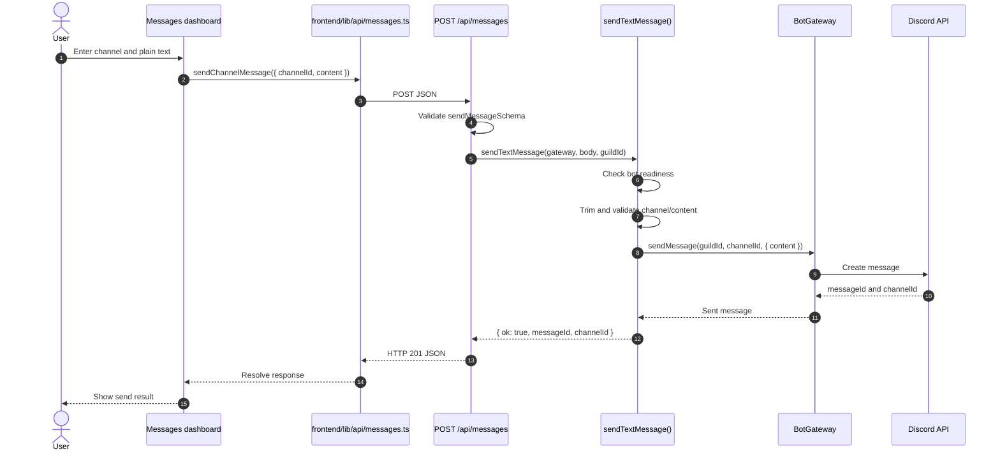

### Validation and failure behavior

Validation happens twice at different boundaries:

1. `sendMessageSchema` validates the HTTP body with Zod.
2. `sendTextMessage` validates after extracting the guild context and before calling Discord.

The controller:

- Rejects an unavailable bot with `503 BOT_NOT_READY`.
- Requires a numeric Discord snowflake for `channelId`.
- Trims the content.
- Rejects empty content with `400 EMPTY_CONTENT`.
- Rejects content longer than 2,000 characters with `400 CONTENT_TOO_LONG`.
- Passes known `BotGatewayError` instances through.
- Converts other send failures to a `502` `MessageSendError`.

Implementation references:

- [`messageRoutes`](../../backend/src/modules/messages/http/routes.ts#L10)
- [`sendTextMessage`](../../backend/src/modules/messages/http/controller.ts#L417)
- [`SendMessageRequest`](../../packages/shared/src/messages.ts#L1)

## Embeds

### What is implemented

Embeds support a complete manual embed composition flow. A request may contain:

- Optional message content outside the embed.
- Title and title URL.
- Description.
- Hex color.
- Author name and icon.
- Thumbnail.
- Main image.
- Footer text and icon.
- A timestamp set to the current backend time.
- Up to 25 fields.
- Link buttons in up to 5 action rows.

The request contract extends `EmbedPayload` with `channelId`:

```ts
type SendEmbedRequest = EmbedPayload & {
  channelId: string;
};
```

The implementation accepts media as either an HTTP(S) URL or an uploaded file. Uploaded files are attached to the Discord request; the resulting Discord CDN URL is preferred when the sent embed is persisted.

### Composition and send flow

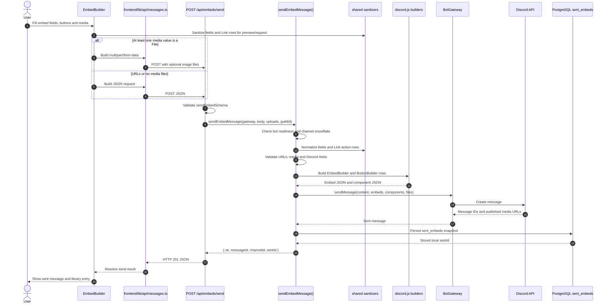

### Embed preparation

`prepareEmbed()` performs the canonical backend preparation:

1. Trims text values and treats empty values as absent.
2. Validates the title URL as HTTP(S).
3. Resolves each media field from either an upload or a URL.
4. Parses the color as exactly six hexadecimal digits, with or without `#`.
5. Sanitizes fields and Link action rows using shared helpers.
6. Enforces individual and aggregate character limits.
7. Rejects a request with no embed body, content, or components.
8. Creates an `EmbedBuilder` only when there is an actual embed body.
9. Creates Discord link buttons from sanitized rows.

The embed can therefore be content-only or component-only; an `EmbedBuilder` is not emitted in those cases.

### Supported limits

| Value | Limit |
|---|---:|
| Message content | 2,000 characters |
| Title | 256 characters |
| Description | 4,096 characters |
| Author name | 256 characters |
| Footer text | 2,048 characters |
| Total textual embed content | 6,000 characters |
| Fields | 25 |
| Action rows | 5 |
| Link buttons per row | 5 |
| Button label | 80 characters |

The aggregate count includes title, description, author, footer, and field names/values. It does not count media URLs or button labels.

### Button behavior

The shared type declares several Discord button styles, but the current message implementation intentionally keeps only `style: "Link"`. Link buttons require an HTTP(S) URL. Custom-ID interaction buttons are not created or handled by this module.

### Sent embed library

Successful embed sends are persisted in `sent_embeds` with:

- A generated local `sentId`.
- Guild ID.
- Channel ID.
- Discord message ID.
- A short title label.
- A normalized embed snapshot.
- Creation and update timestamps.

The library is exposed through:

| Operation | Route |
|---|---|
| List sent embeds and templates | `GET /api/embeds/library` |
| Send and register embed | `POST /api/embeds/send` |
| Edit a sent embed | `PUT /api/embeds/edit-sent/:id` |
| Delete a sent embed | `DELETE /api/embeds/sent/:id` |

Edit and delete are two-stage operations: the backend first operates on Discord, then updates or deletes the local record. If Discord reports that the message is already gone, the local record is removed and the response marks it as `orphaned`.

Implementation references:

- [`prepareEmbed` and send/edit/delete controllers](../../backend/src/modules/messages/http/controller.ts#L232)
- [`embedLibraryRoutes`](../../backend/src/modules/messages/http/libraryRoutes.ts#L18)
- [`getEmbedLibrary`, `editSentEmbed`, and `deleteSentEmbed`](../../backend/src/modules/messages/library.ts#L55)
- [`EmbedPayload` and shared sanitizers](../../packages/shared/src/messages.ts#L22)

### Embed templates

Templates are part of the Embed workflow. They are not a separate message delivery mechanism.

The template API supports:

- Listing templates for the current guild.
- Reading one template.
- Creating a template.
- Updating an existing template by ID.
- Deleting a template.
- Saving uploaded image, thumbnail, author-icon, and footer-icon assets.

Templates store a sanitized `EmbedPayload` without `channelId`. The UI can load a template into the editor, and Scheduled Messages can map its title, description, color, and image into the scheduled-message mini-embed.

Template routes are registered under `/api/embeds/templates` in [`templateRoutes.ts`](../../backend/src/modules/messages/http/templateRoutes.ts#L89). Template persistence and sanitization live in [`service.ts`](../../backend/src/modules/messages/templates/service.ts#L144).

## Scheduled Messages

### What is implemented

Scheduled Messages persist a message definition and repeatedly evaluate when it is due. Each scheduled definition contains:

- Destination channel.
- IANA timezone.
- Frequency definition.
- A reduced embed: title, description, color, and one image.
- Optional plain text content.
- Optional role mention.
- Active/inactive state.
- Persisted next and last execution timestamps.

The scheduled feature does not reuse the full manual EmbedBuilder. It intentionally sends one reduced embed and does not support fields, buttons, author, footer, thumbnail, title URL, or timestamp.

### User configuration flow

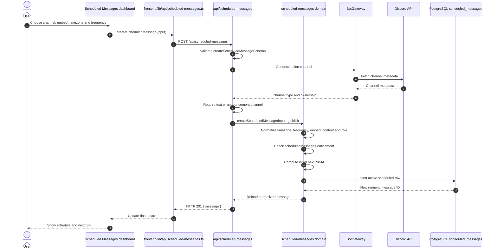

### Frequency model

The shared frequency contract supports:

| Type | Behavior |
|---|---|
| `daily` | Every day at `HH:mm` in the configured timezone |
| `weekly` | Selected weekdays at `HH:mm`; an empty day list behaves as daily |
| `monthly` | Selected day of month at `HH:mm`; the day is clamped to the month's last day |
| `monthly` with `lastDayOfMonth` | Last civil day of every month |
| `specific_date` | One date at `HH:mm`, then deactivates |
| `specific_date` with `repeatYearly` | Same month/day every year; invalid month-end days are clamped |
| `interval` | Every N minutes, from 15 through 10,080 minutes |

`computeNextRunAt()` calculates civil times in the configured IANA timezone and converts them to UTC `Date` values for persistence. It supports catch-up: if a civil occurrence is already due and `lastSentAt` is older, that occurrence is returned as the next run.

### Runtime scheduler flow

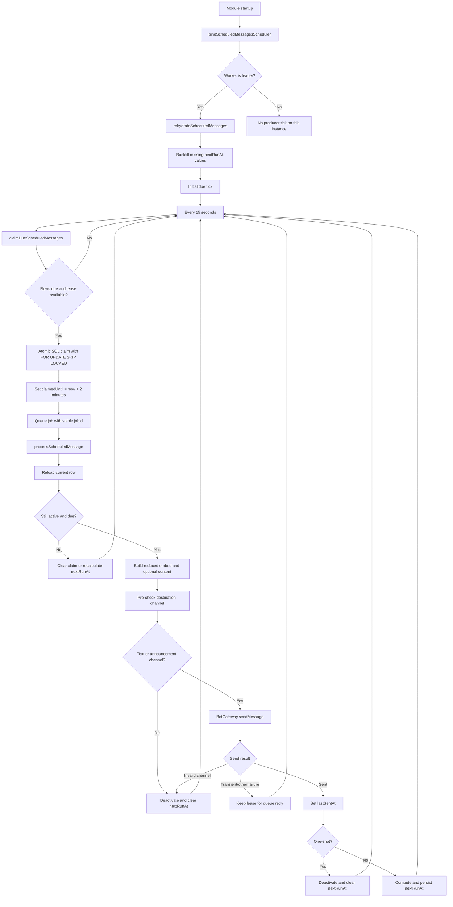

### Delivery details

`buildSendPayload()`:

1. Resolves the optional scheduled image as a URL or attachment.
2. Logs and ignores invalid media rather than failing the complete job.
3. Creates one `EmbedBuilder` with a fallback title and zero-width-space description when needed.
4. Joins the optional role mention and plain text content.
5. Truncates combined content to 2,000 characters.
6. Uses `allowedMentions: { roles: [pingRoleId] }` when a role is configured; otherwise parsing is disabled.

The scheduler accepts only `GuildText` and `GuildAnnouncement` channels. A missing channel, missing guild, non-sendable channel, or unsupported channel type pauses the schedule. Other delivery failures are logged and allowed to follow the queue retry behavior.

### Immediate send

`POST /api/scheduled-messages/:id/send-now` sends the current stored definition immediately. It checks bot readiness, loads the guild-scoped record, sends the same reduced payload, and updates `lastSentAt`.

The immediate operation does not consume a one-shot schedule. The next normal scheduler evaluation uses the updated `lastSentAt` when calculating the next due occurrence.

Implementation references:

- [`scheduledMessagesRoutes`](../../backend/src/modules/scheduled-messages/http/routes.ts#L40)
- [`createScheduledMessage` and schedule persistence](../../backend/src/modules/scheduled-messages/domain/scheduled-messages.ts#L236)
- [`computeNextRunAt`](../../packages/shared/src/scheduled-messages/schedule.ts#L407)
- [`processDueScheduledMessages` and `processScheduledMessage`](../../backend/src/modules/scheduled-messages/jobs.ts#L210)
- [`scheduledMessagesModule`](../../backend/src/modules/scheduled-messages/module.ts#L12)

## Auto-Replies

### What is implemented

Auto-Replies are guild-scoped rules evaluated for every eligible Discord `messageCreate` event. A rule contains:

- Trigger text.
- Response text.
- Match mode.
- Enabled state.
- Case sensitivity.
- Whole-word matching.
- Reply-versus-channel-send behavior.
- Per-user cooldown.
- Allowed channel IDs.
- Ignored channel IDs.

The backend caches the guild rule list for 60 seconds and invalidates that list after create/update/delete operations.

### Configuration flow

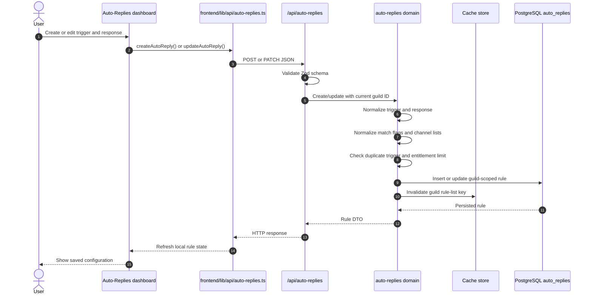

### Incoming-message flow

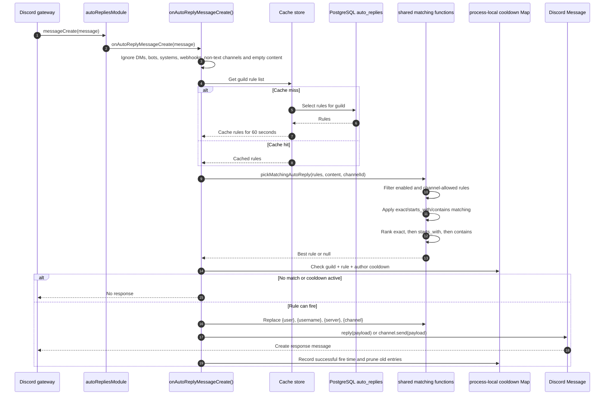

### Matching behavior

Supported match modes are:

- `exact`: trims the message and compares the complete value.
- `starts_with`: trims only the start and checks the prefix.
- `contains`: checks whether the trigger occurs anywhere.

Case-insensitive matching is the default. With `wholeWord`, the implementation treats letters, numbers, and underscore as word characters, so a trigger does not match inside another word.

When more than one enabled rule matches, selection is deterministic:

1. Exact mode wins.
2. Starts-with wins over contains.
3. The longer trigger wins within the same mode.
4. The lower database ID wins if everything else is equal.

Allowed channels act as an allow-list when non-empty. Ignored channels always win and block the rule.

### Response behavior and mention safety

The response is trimmed and limited to 2,000 characters. Supported substitutions are:

| Token | Value |
|---|---|
| `{user}` | `<@authorId>` |
| `{username}` | Member display name, or Discord username |
| `{server}` | Guild name |
| `{channel}` | Channel name, or channel ID when no name is available |

If `{user}` appears in the original response template, only that author ID is placed in `allowedMentions.users`. Arbitrary mention parsing, role mentions, and everyone mentions are disabled.

If `useReply` is true, the bot replies to the triggering message. Otherwise it sends a normal message to the channel.

### Cooldown behavior

Cooldown state is keyed by:

```text
guildId:replyId:userId
```

The maximum configured cooldown is 3,600 seconds. The timestamp is written only after Discord accepts the response.

The rule list is cached, but cooldown state is held in a process-local `Map` capped at 8,000 entries. Therefore cooldowns reset on process restart and are not shared between multiple backend instances.

Implementation references:

- [`autoRepliesModule`](../../backend/src/modules/auto-replies/module.ts#L7)
- [`onAutoReplyMessageCreate`](../../backend/src/modules/auto-replies/gateway.ts#L32)
- [`pickMatchingAutoReply`](../../packages/shared/src/auto-replies.ts#L173)
- [`applyAutoReplyTokens`](../../packages/shared/src/auto-replies.ts#L224)
- [`createAutoReply` and update/delete persistence](../../backend/src/modules/auto-replies/domain/auto-replies.ts#L139)

## Cross-cutting end-to-end boundaries

The four capabilities share these implementation boundaries:

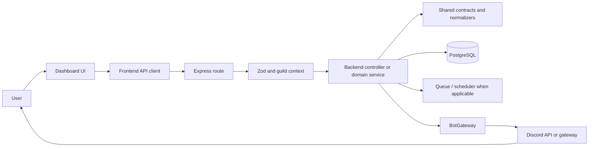

The important distinction is the delivery direction:

- Plain Text and Embeds begin with a user HTTP action and immediately call Discord.
- Scheduled Messages begin with a user configuration action, then later originate from the leader scheduler and queue.
- Auto-Replies begin with an incoming Discord gateway event, then optionally call Discord after reading cached guild configuration.

## NEW — RESEARCH: Comparable bot capabilities

This section records capabilities found in public product documentation for the named bots. It is a benchmark, not a claim that every product supports every capability. Where no public documentation was found for a capability, the correct conclusion is **not documented in the reviewed sources**, not that the product definitely lacks it.

### Product-by-product findings

| Product | Plain Text / message delivery | Embed/message composition | Scheduled or timed messages | Auto-reply / trigger behavior |
|---|---|---|---|---|
| [Sapphire](https://discord.com/discovery/applications/678344927997853742) | Public listing says its Messages feature can customize messages and create scheduled ones. | Public listing confirms fully customizable messages, but does not expose the field-level implementation. | Scheduled messages are explicitly advertised. | The reviewed official Sapphire Bot listing does not expose a detailed keyword auto-reply contract. |
| [ProBot](https://docs.probot.io/) | Dashboard-created messages can be sent to a selected channel. | Dedicated builder supports title, description, URL, image, thumbnail, author, color, footer, fields, preview, send, save, and edit. It documents Discord limits ([embed docs](https://docs.probot.io/docs/modules/embed)). | No comparable scheduled-message page was found in the reviewed ProBot documentation. | Supports wildcard/contains matching, Discord replies, optional author ping, variables, and an unbounded list of random responses ([auto responder](https://docs.probot.io/docs/modules/auto_repsonder), [variables](https://docs.probot.io/docs/getting-started/variables)). |
| [CommunityOne](https://communityone.io/) | Its public product is focused on AI support answers rather than a generic message composer. | No generic embed builder was found in the reviewed public documentation. | No generic scheduled-message feature was found in the reviewed public documentation. | Spark answers member questions from documentation and Discord conversation knowledge; the product also reports content gaps and automated support ([product overview](https://communityone.io/), [pricing and limits](https://communityone.io/pricing/)). |
| [MEE6](https://help.mee6.xyz/) | Custom commands send the configured message; the legacy public documentation also lists Timers for predefined intervals ([legacy repository](https://github.com/Mee6/Mee6-documentation)). | Custom commands and Automations can send configured messages; MEE6 documents hyperlinks and embed-related behavior ([hyperlinks](https://help.mee6.xyz/support/solutions/articles/101000469342-how-to-use-hyperlinks-with-mee6)). | The reviewed public product help documents Automations and the legacy documentation lists Timers. Treat the legacy Timer entry as historical unless confirmed in the current dashboard. | Automations use a trigger → condition → action model. Message content and channel conditions can trigger a send, role change, delete, or button action. Automations ignore bot actions, have documented channel limitations, and are subject to Discord rate limits ([Automations](https://help.mee6.xyz/support/solutions/articles/101000546996-getting-started-with-mee6-automations)). |
| [Dyno](https://docs.dyno.gg/en/modules) | Custom Commands send plain text and can redirect output to another channel or DM; Additional Responses can send to multiple channels ([Custom Commands](https://docs.dyno.gg/modules/customcommands)). | Embed builder supports author, title, title URL, footer, fields, image, thumbnail, description, color, and variables ([Embed Customization](https://docs.dyno.gg/en/embeds)). | The reviewed current Dyno documentation did not provide a complete scheduler contract for this comparison. | Autoresponder supports message or reaction responses, wildcard matching, embeds, variables, and only the first matched trigger; it documents channel permissions and limits ([Autoresponder](https://docs.dyno.gg/modules/autoresponder)). |
| [Carl-bot](https://github.com/botlabs-gg/carlbot-docs/blob/master/docs/embeds.md) | Embed commands can target a channel; the public docs focus on embed delivery. | Dashboard builder, raw JSON import/export, `embedsource`, send, and edit are documented. The builder enforces URL dependencies and the 6,000-character aggregate limit. | No scheduled-message capability was found in the reviewed official documentation. | The reviewed official documentation did not provide a current trigger/autoresponder contract. |
| [Arcane](https://docs.arcane.bot/) | Custom commands can output static or scriptable text and use message or slash commands. | Tag System v2 can compose title, description, footer, fields, color, timestamp, author, and image; variables expose user, guild, channel, target, and arguments ([tag reference](https://docs.arcane.bot/tag-system/reference)). | No generic scheduled-message capability was found in the reviewed official documentation. | Custom commands support cooldowns and requirements for roles, channels, users, and permissions. They are command-triggered rather than a documented generic keyword auto-responder ([custom command setup](https://docs.arcane.bot/plugins/custom-commands/setup)). |
| [Invite Tracker](https://docs.invite-tracker.com/dashboard/messages/) | Join, join-DM, and leave messages support normal text, testing, channel selection, and reactions. | Rich embeds support author, author icon/URL, title/URL, description, fields, images, thumbnails, footer, footer icon, timestamp, JSON editing, live preview, and random color for join/leave messages; join DMs cannot use embeds. Dynamic welcome banners add text, images, shapes, layers, and avatar placeholders ([messages](https://docs.invite-tracker.com/dashboard/messages/), [variables](https://docs.invite-tracker.com/dashboard/messages/variables), [welcome banners](https://docs.invite-tracker.com/dashboard/welcome-banner)). | Not a generic scheduled-message product in the reviewed documentation. | Its documented message variables are event-context driven: member, inviter, invite, guild, counts, and random color. |
| [UnbelievaBoat](https://faq.unbelievaboat.com/dashboard/store/) | Store items can send custom messages in the channel where an item is bought or used. | Store actions can carry a Discord message object with content and embeds ([item structure](https://legacy-api-docs.unbelievaboat.com/reference/item-object)). | No generic scheduled-message capability was found in the reviewed documentation. | Custom messages are action-triggered by item buy/use; custom success/failure replies and per-command cooldowns are documented ([store](https://faq.unbelievaboat.com/dashboard/store/), [custom replies](https://faq.unbelievaboat.com/dashboard/work-slut-crime-rob/)). |

### Reusable patterns found in the benchmark

> **NEW — RESEARCH**: The most relevant patterns for these four Adobos capabilities are:

1. **One message vocabulary reused by many triggers.** ProBot, Dyno, Arcane, and Invite Tracker expose similar rich-message fields rather than separate one-off formats for every feature; the sources do not prove that their internal implementations share one builder.
2. **Preview and test before delivery.** ProBot and Invite Tracker provide a visual preview or test-message action. This reduces permission, formatting, and mention surprises.
3. **Variables are first-class.** ProBot, MEE6, Arcane, Dyno, and Invite Tracker expose event context such as user, guild, channel, arguments, member count, inviter, or message content.
4. **Trigger, condition, action separation.** MEE6 makes this explicit by separating the event trigger, conditions, and resulting action.
5. **Multiple responses and randomized output.** ProBot documents an unbounded random-response list. Dyno supports additional responses and multiple output channels for custom commands.
6. **Operational controls.** Dyno, Arcane, ProBot, and MEE6 document cooldowns, channel/role permissions, response deletion, or rate-limit constraints.
7. **Event-specific rendering.** Invite Tracker demonstrates that one message template can be rendered against different contexts such as join, leave, and join-DM, with different variable availability.
8. **Dynamic visual assets.** Invite Tracker's banners demonstrate a separate image-rendering path for messages that need richer visual composition than Discord embeds.
9. **Knowledge-backed replies.** CommunityOne extends a trigger/reply model with documentation and conversation retrieval. This is an optional advanced auto-reply mode, not a requirement for the deterministic keyword engine.

## NEW — RECOMMENDED: Gap analysis for Adobos

The following items are explicitly **not implemented in the current repository**. They are recommendations derived from the benchmark, Discord's current API documentation, and the resilience goals for this project.

### Priority 0 — Reliability and correctness foundations

| Gap | Why it matters | Target behavior |
|---|---|---|
| No common message definition | Manual Embeds and Scheduled Messages use different payload models. Auto-Replies only produce plain text. | Introduce one canonical `MessageDefinition` for content, embeds, components, attachments, variables, and mention policy. Keep feature-specific scheduling and triggering outside the definition. |
| No durable delivery record | Scheduled rows record schedule state, but not each delivery attempt, Discord response, or failure reason. | Add an outbox/delivery-attempt model with idempotency key, status, attempt count, next retry, provider message ID, and normalized error. |
| Auto-reply cooldown is process-local | Restarts and multiple replicas can reset or bypass cooldowns. | Move cooldown reservations to a shared atomic store, preferably Redis, or a database-backed expiry table when Redis is unavailable. |
| Weak idempotency for HTTP sends | Repeated browser requests can create duplicate Discord messages. | Accept an idempotency key for user-initiated sends and persist the result before returning it. |
| No unified Discord permission preflight | Invalid permissions are discovered only during delivery. | Preflight `View Channel`, `Send Messages`, `Embed Links`, `Attach Files`, `Read Message History` for replies, and relevant mention permissions; expose actionable diagnostics. |
| No delivery observability surface | Users cannot distinguish queued, sent, retried, paused, orphaned, or permanently failed. | Expose per-message status, last attempt, next attempt, error category, and a bounded delivery history. |

### Priority 1 — Message functionality

| Gap | Benchmark signal | Target behavior |
|---|---|---|
| Scheduled Messages use a reduced embed | ProBot, Dyno, Arcane, and Invite Tracker expose the full rich-message vocabulary. | Let schedules store and render the same canonical message definition as manual Embeds: fields, author, footer, thumbnail, title URL, timestamp, components, and attachments. |
| Scheduled Messages cannot schedule plain-text-only content | Timed-message products support plain text; the current implementation always emits an embed. | Permit `content`, `embeds`, or both, while rejecting a completely empty message. |
| Scheduled media only supports one image | Rich-message systems support multiple media roles and uploaded assets. | Support the canonical attachment list and explicit embed media references, with upload lifecycle management. |
| Auto-Replies only emit plain text | Dyno documents embed autoresponses; ProBot supports response variation; Arcane supports embed tags. | Allow an Auto-Reply to render a full `MessageDefinition`, not only `content`. |
| No random response pool | ProBot explicitly supports multiple random responses. | Store an ordered response pool with selection policy: random, sequential, weighted, or no-repeat-while-possible. |
| No response redirect | Dyno supports response channels/DMs for custom commands; MEE6 uses actions and predefined channels. | Allow an explicit destination policy: source channel, configured channel, thread, or DM where Discord permits it. Keep this permission-checked. |
| No delayed delete / TTL | Dyno documents delete-after controls and scheduled-message products commonly support cleanup. | Allow optional `deleteAfterSeconds` for bot-created responses and delivery records that can safely schedule deletion. |
| No event-context variables in scheduled messages | Other systems expose member/guild/channel/event variables. | Add a small, typed variable resolver for schedule context; never allow arbitrary code execution or unrestricted mention parsing. |
| Limited Auto-Reply conditions | MEE6 and Sapphire support compound filters beyond one trigger string. | Add typed AND conditions for channel/category, role, user, bot status, mention state, attachment presence, and message content. |
| One winner only with no explainability | Current matching picks one rule deterministically but gives no diagnostic reason. | Preserve deterministic winner selection, and expose preview/debug output showing matched rules, ranking, and the selected rule without sending. |
| No test/preview execution endpoint | ProBot and Invite Tracker provide preview/test actions. | Add server-side preview and permission-aware test delivery, with explicit “test” metadata so it is not confused with production delivery. |
| No reusable message versioning | Embed snapshots exist, but templates and schedule edits do not provide revision history. | Add immutable message-definition revisions and a draft/published model; scheduled deliveries pin a revision or explicitly follow the latest published revision. |

### Priority 2 — Scale and product quality

| Gap | Target behavior |
|---|---|
| Linear Auto-Reply scan | Compile/index rules by normalized trigger and match mode; use a candidate index before applying full conditions. |
| Cache stampede risk | Use stale-while-revalidate or single-flight guild configuration loading, with versioned invalidation. |
| Fixed 15-second scheduler scan | Keep the durable database as authority, but use a wake-up mechanism for the nearest due time and retain a bounded safety sweep. |
| Leader-only producer dependency | Use a distributed lease/leader election with renewal and fencing token; allow workers to consume independently. |
| Lease and queue state are not unified | Make the delivery attempt/outbox state authoritative and use queue messages as wake-up work, not as the only record of work. |
| No explicit misfire policy | Configure per schedule: catch up one occurrence, skip missed occurrences, or coalesce missed occurrences into one send. |
| No rate-limit-aware delivery policy in the feature layer | Centralize Discord rate-limit handling, retry-after parsing, exponential backoff with jitter, and global/per-route concurrency. |
| No bulk management | Add bounded bulk pause/resume/delete/test operations with per-item results, not one unbounded transaction or unbounded Discord burst. |
| No message lifecycle cleanup | Track uploaded assets and Discord message ownership so orphaned files, stale records, and scheduled output can be cleaned safely. |
| No localization-ready template metadata | Store locale, timezone, and variable availability separately from raw message content so future localization does not fork delivery logic. |

### Explicitly out of scope for this document

The benchmark mentions features such as welcome banners, analytics, moderation, economy actions, roles, and AI support. They are not proposed as part of this message-module implementation unless they consume the reusable message core described below. They remain outside the four audited capabilities.

## NEW — RECOMMENDED: Target design pattern

The best fit is a **declarative message definition + trigger/condition/action pipeline + durable delivery outbox**. This keeps the user-facing capabilities small while allowing future modules to reuse the message core.

### Core concepts

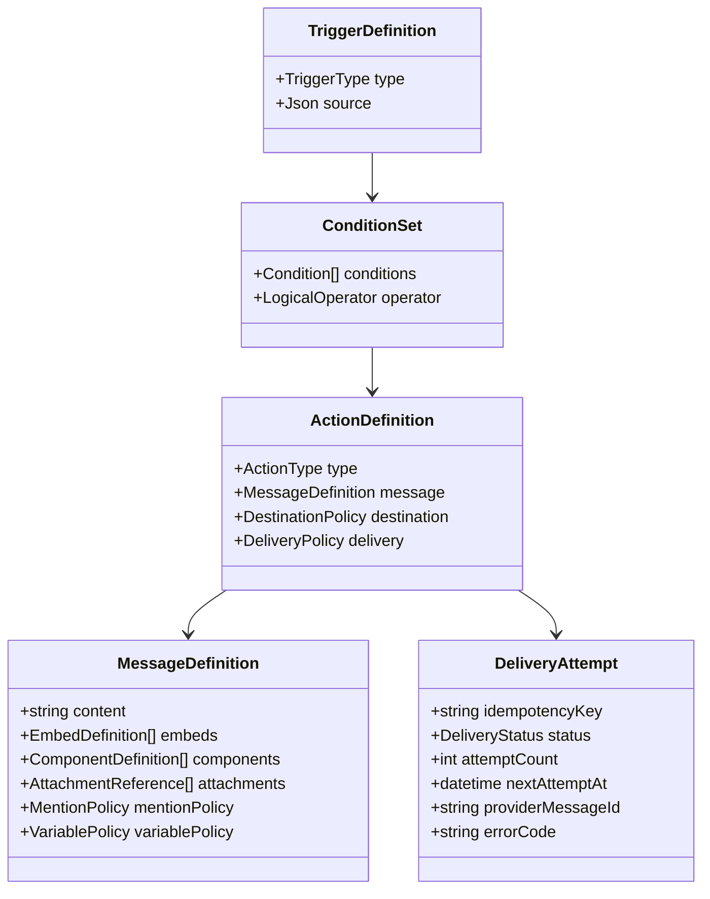

The reusable core should own:

- Message schema and versioning.
- Validation and normalization.
- Variable resolution and escaping.
- Mention policy.
- Media/attachment resolution.
- Discord payload rendering.
- Permission preflight.
- Delivery idempotency.
- Retry classification.
- Delivery status and audit metadata.

The feature modules should own only their trigger semantics:

- **Plain Text:** immediate HTTP trigger with a simple `MessageDefinition`.
- **Embeds:** immediate HTTP trigger plus library/template management.
- **Scheduled Messages:** time trigger and recurrence calculation.
- **Auto-Replies:** Discord `messageCreate` trigger, matching, conditions, cooldown reservation, and response action.

### Recommended end-to-end pipeline

```mermaid
flowchart LR
    Trigger[User action or Discord event] --> Scope[Resolve guild and actor scope]
    Scope --> Candidate[Load candidate rule or message definition]
    Candidate --> Conditions[Evaluate typed conditions]
    Conditions -->|No match| Stop[Stop without delivery]
    Conditions -->|Match| Reserve[Reserve idempotency key and cooldown atomically]
    Reserve -->|Already reserved| Stop2[Return existing result or suppress duplicate]
    Reserve --> Render[Resolve variables and render message]
    Render --> Validate[Validate Discord payload and mention policy]
    Validate --> Preflight[Check destination and permissions]
    Preflight --> Outbox[Persist delivery intent / outbox row]
    Outbox --> Queue[Enqueue wake-up job]
    Queue --> Worker[Delivery worker]
    Worker --> Transport[Central Discord transport]
    Transport --> Discord[Discord API]
    Discord --> Result{Provider result}
    Result -->|Success| Succeeded[Mark sent and store provider IDs]
    Result -->|Retryable| Retry[Backoff with jitter and reschedule]
    Result -->|Invalid destination/permissions| Paused[Pause or require user action]
    Result -->|Permanent invalid payload| Failed[Mark failed with actionable error]
```

### Why this pattern is resilient

1. **At-least-once execution with idempotent effects.** Queue retries are safe because every delivery has a stable idempotency key such as `feature:entity:revision:occurrence`.
2. **Database authority, queue acceleration.** The database records the intended delivery and its state; the queue only wakes workers. A lost queue message can be reconstructed by a sweeper.
3. **Atomic reservation.** Cooldowns and idempotency are reserved before delivery using an atomic operation. A failed send releases or expires the reservation according to the error class.
4. **Fenced leadership.** A scheduler lease must include a fencing token so an expired leader cannot continue writing after another leader takes over.
5. **Central transport.** Every feature uses the same Discord transport for permissions, payload limits, rate limits, retries, `Retry-After`, and error normalization.
6. **Bounded concurrency.** Apply global, guild, channel, and route-level limits. Never turn a bulk configuration operation into an unbounded burst of Discord requests.
7. **Explicit misfire semantics.** Schedules declare whether missed occurrences are skipped, caught up once, or coalesced. This prevents accidental message storms after downtime.
8. **Safe rendering.** Variables resolve from a typed context; user-controlled values are escaped where appropriate; `allowed_mentions` is generated from explicit policy rather than inferred from arbitrary text.
9. **Rebuildable state.** Cache entries, queue jobs, and in-memory indexes can be discarded and rebuilt from guild configuration and delivery rows.

### Recommended scheduling model

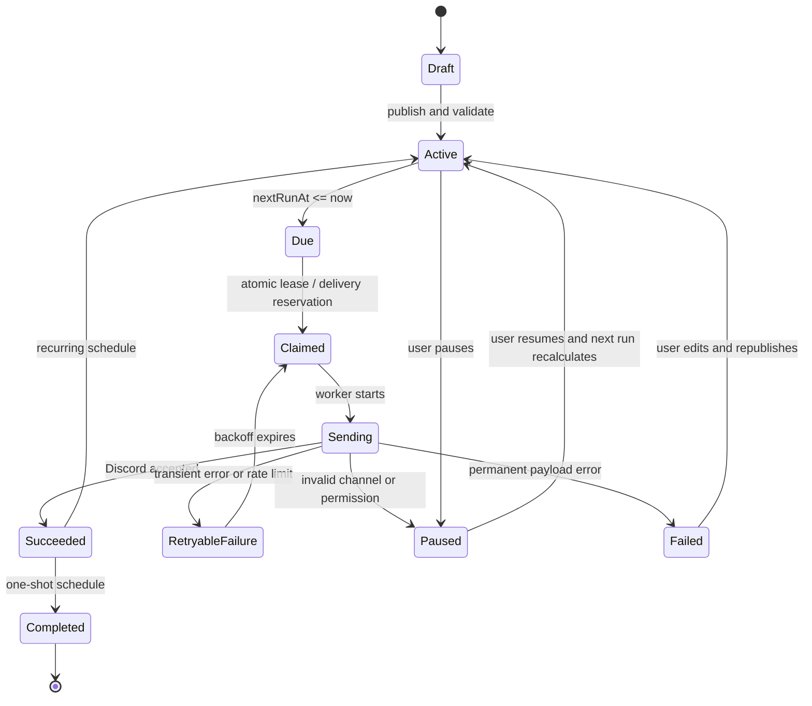

For each occurrence, persist:

- Schedule ID and immutable definition revision.
- Occurrence key.
- Intended UTC send time.
- Timezone and recurrence metadata used to calculate it.
- Misfire decision.
- Delivery status.
- Attempt count and next retry.
- Discord channel/message IDs when available.
- Normalized failure category.

### Recommended Auto-Reply model

Auto-Replies should use the same delivery pipeline but keep matching separate from rendering:

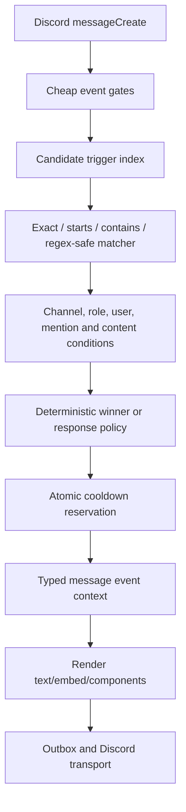

Recommended matching rules:

- Keep the existing deterministic precedence as the default: exact, starts-with, contains, longer trigger, lower ID.
- Add explicit rule priority rather than making users depend on database IDs.
- Compile case-insensitive and whole-word matchers once per configuration version.
- Keep regex as an opt-in mode with syntax validation, execution limits, and no catastrophic backtracking.
- Support multiple response variants without changing trigger evaluation.
- Do not recursively process messages authored by the bot or by delivery retries.

### Recommended message core API boundary

The future core should expose conceptual operations like these, without coupling callers to Discord.js builders:

```ts
type RenderContext = {
  guildId: string;
  channelId: string;
  actorId?: string;
  variables: Record<string, string>;
};

type RenderedMessage = {
  content?: string;
  embeds?: DiscordEmbed[];
  components?: DiscordComponent[];
  files?: ResolvedAttachment[];
  allowedMentions: AllowedMentions;
};

// Conceptual boundary for the future reusable core.
validateMessageDefinition(definition);
renderMessageDefinition(definition, context);
preflightMessageDelivery(renderedMessage, destination);
enqueueMessageDelivery(deliveryIntent);
```

The important design constraint is that feature modules should not construct Discord.js payloads independently. One renderer and one transport prevent Scheduled Messages, Auto-Replies, future welcome messages, and other modules from drifting apart in limits, mentions, media handling, and retry behavior.

## NEW — RECOMMENDED: Prioritized implementation target

The recommended target sequence is intentionally limited to the four scoped capabilities:

| Priority | Target |
|---:|---|
| P0 | Extract a canonical versioned `MessageDefinition`, shared renderer, mention policy, validation, and central Discord transport. |
| P0 | Add durable delivery intents/attempts, idempotency keys, retry classification, rate-limit handling, and observable statuses. |
| P0 | Move Auto-Reply cooldown reservations out of process memory and make them atomic across instances. |
| P1 | Upgrade Scheduled Messages to use the canonical message definition and support plain-text-only delivery. |
| P1 | Upgrade Auto-Replies to render embeds/components, support response pools, and add typed conditions and preview. |
| P1 | Add permission preflight, server-side preview/test delivery, and actionable diagnostics. |
| P1 | Add schedule misfire policy, fencing-aware leadership, and a rebuildable due-work sweeper. |
| P2 | Add response TTL/deletion, message revision history, attachment lifecycle management, and indexed matching. |
| P2 | Add bulk operations with bounded concurrency and per-item results. |

These recommendations are not part of the current implementation. They are the proposed design baseline for future code work.

## External references

The external research in this document was based on the following public sources, accessed September 2026:

- [Discord Message Resource](https://docs.discord.com/developers/resources/message) — message creation, embeds, attachments, allowed mentions, and payload limits.
- [Discord Gateway documentation](https://docs.discord.com/developers/events/gateway) — Gateway intents and the privileged Message Content intent.
- [ProBot Embed Messages](https://docs.probot.io/docs/modules/embed) and [Auto Responder](https://docs.probot.io/docs/modules/auto_repsonder).
- [Dyno Embed Customization](https://docs.dyno.gg/en/embeds), [Custom Commands](https://docs.dyno.gg/modules/customcommands), and [Autoresponder](https://docs.dyno.gg/modules/autoresponder).
- [MEE6 Automations](https://help.mee6.xyz/support/solutions/articles/101000546996-getting-started-with-mee6-automations) and [MEE6 documentation repository](https://github.com/Mee6/Mee6-documentation).
- [Carl-bot embed documentation](https://github.com/botlabs-gg/carlbot-docs/blob/master/docs/embeds.md).
- [Arcane Custom Commands](https://docs.arcane.bot/plugins/custom-commands/), [setup](https://docs.arcane.bot/plugins/custom-commands/setup), and [Tag System v2](https://docs.arcane.bot/tag-system/reference).
- [Invite Tracker messages](https://docs.invite-tracker.com/dashboard/messages/), [variables](https://docs.invite-tracker.com/dashboard/messages/variables), and [welcome banners](https://docs.invite-tracker.com/dashboard/welcome-banner).
- [UnbelievaBoat Store](https://faq.unbelievaboat.com/dashboard/store/), [custom replies](https://faq.unbelievaboat.com/dashboard/work-slut-crime-rob/), and [item message structure](https://legacy-api-docs.unbelievaboat.com/reference/item-object).
- [CommunityOne product overview](https://communityone.io/) and [pricing/capabilities](https://communityone.io/pricing/).
- [Sapphire Discord application listing](https://discord.com/discovery/applications/678344927997853742).
