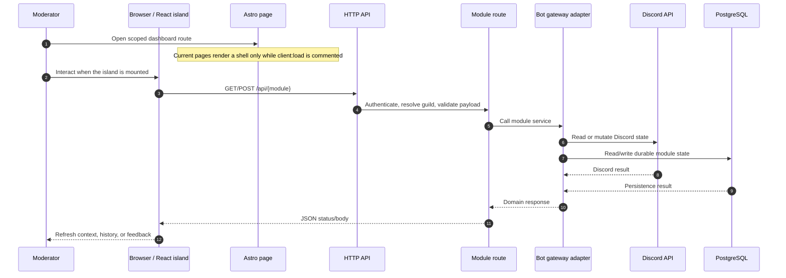
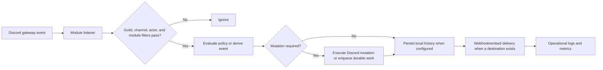
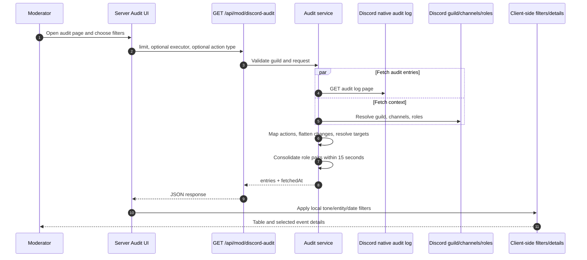
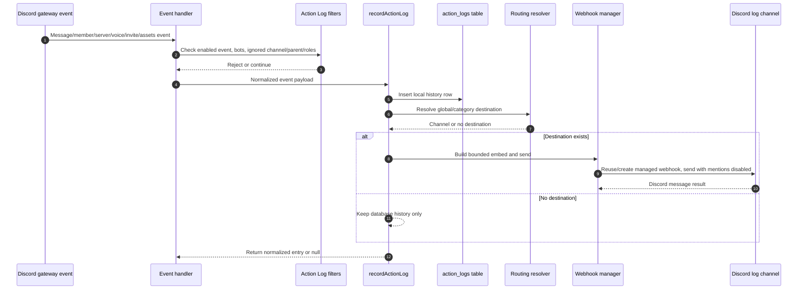
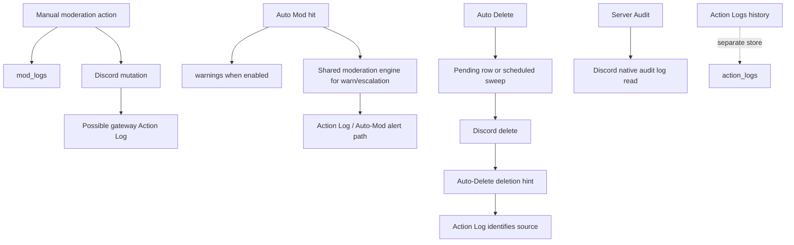
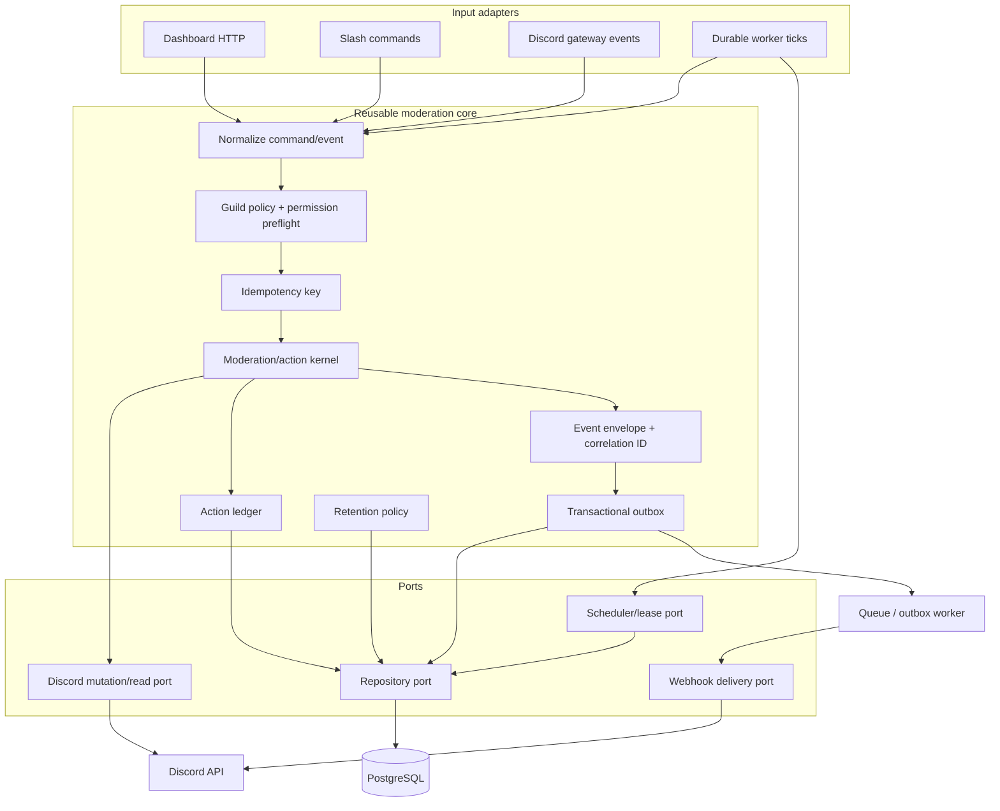
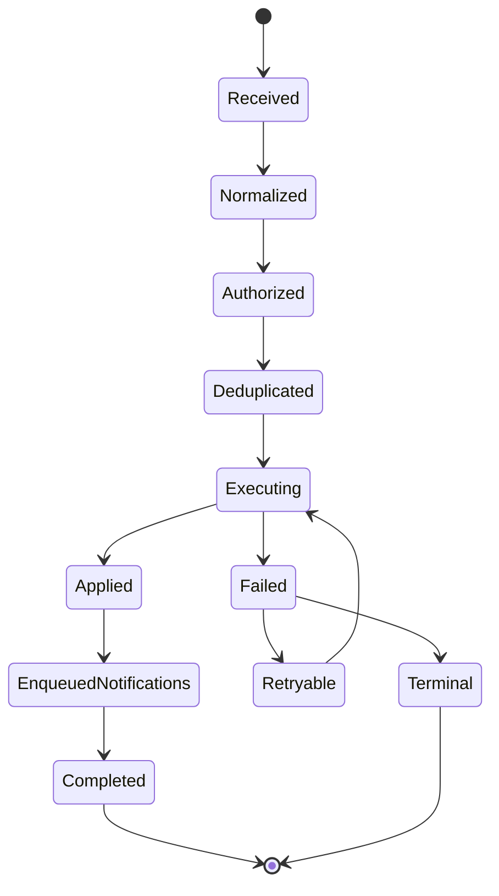

# Moderation Module

**Scope:** `Tools`, `Server Audit`, `Action Logs`, `Auto Mod`, and `Auto Delete` only.

**Document status:** code audit plus external capability comparison. This document does not change application code.

All diagrams use Mermaid 2026-compatible syntax.

**Status labels**

- `IMPLEMENTED`: behavior observed in the current repository.
- `NEW — RESEARCH`: behavior observed in the cited public documentation of another bot or Discord.
- `NEW — RECOMMENDED`: a proposed capability, correction, or architectural improvement; it is not implemented today.

## 1. Executive summary

The module has two different execution families:

1. **Operator actions**: a dashboard or slash command requests a moderation mutation. The backend authorizes it, calls Discord, optionally sends a sanction DM, and records a moderation row.
2. **Event-driven safety**: Discord gateway events are evaluated by Auto Mod or Auto Delete. The backend either blocks/deletes a message immediately or schedules a deletion, then emits an operational log.

`Server Audit` and `Action Logs` are intentionally different:

- **Server Audit** reads Discord's native audit-log history on demand.
- **Action Logs** observes gateway events, normalizes them, stores a local history row, and optionally forwards an embed to a configured Discord channel through a managed webhook.

### Important current UI state

The React islands and API clients exist, but the five Astro entry pages currently comment out their mounts:

| Page | Island import/mount | Current consequence |
|---|---|---|
| `/dashboard/moderation` | `ModerationIsland` commented | The page shell renders; the Tools UI is not mounted. |
| `/dashboard/server-audit` | `ServerAuditIsland` commented | The page shell renders; the audit UI is not mounted. |
| `/dashboard/moderation/action-logs` | `ActionLogsIsland` commented | The page shell renders; the Action Logs UI is not mounted. |
| `/dashboard/moderation/auto-mod` | `AutoModIsland` commented | The page shell renders; the Auto Mod UI is not mounted. |
| `/dashboard/moderation/auto-delete` | `AutoDeleteIsland` commented | The page shell renders; the Auto Delete UI is not mounted. |

The backend modules, HTTP routes, gateway listeners, workers, and slash-command paths are separate from this UI mounting state.

## 2. Current system boundary

### 2.1 Dashboard request path



### 2.2 Runtime event path



### 2.3 Module source map

| Capability | Frontend | HTTP/API | Runtime | Durable state |
|---|---|---|---|---|
| Tools | `frontend/src/features/moderation` | `/api/mod` | `moderation/discord.ts`, slash commands | `warnings`, `mod_logs`, templates |
| Server Audit | `moderation/ServerAuditLog.tsx` | `/api/mod/discord-audit` | `moderation/audit.ts` | Discord audit log; no local audit-history table |
| Action Logs | `features/action-logs` | `/api/logs` | `action-logs/gateway*`, `discord.ts` | `action_logs_config`, `action_logs` |
| Auto Mod | `features/auto-mod` | `/api/auto-mod` | `auto-mod/gateway.ts` | `auto_mod_config`, shared moderation warnings |
| Auto Delete | `features/auto-delete` | `/api/auto-delete` | `auto-delete/gateway.ts`, `jobs.ts`, `pending.ts` | `auto_delete_config`, `auto_delete_pending` |

## 3. Shared authorization and validation

### IMPLEMENTED

All scoped HTTP routes resolve the guild from the authenticated panel request and use the module route definition. The mutation route additionally requires a panel session and calls the moderation authorization layer.

The Tools capability map is:

| Requested action | Required capability |
|---|---|
| `warn`, `clearwarns` | `moderation.warn` |
| `kick` | `moderation.kick` |
| `ban`, `unban` | `moderation.ban` |
| `timeout`, `untimeout` | `moderation.timeout` |
| `purge` | `moderation.purge` |
| `slowmode`, `lock`, `unlock` | `channels.write` |

For member-targeted actions, the actor must also outrank the target. Discord-side failures are mapped to stable API errors such as missing permissions or invalid parameters.

The shared request schema validates, among other limits:

- reason: maximum 512 characters;
- timeout: 1 second to 28 days;
- ban message deletion: 0 to 7 days;
- purge: 1 to 100 messages;
- slowmode: 0 to 21,600 seconds;
- DM text: maximum 2,000 characters;
- DM mode: `none`, `text`, or `template`.

### NEW — RECOMMENDED

Add one reusable permission preflight contract for every mutation and every destination channel. It should return the exact missing permission, target hierarchy result, and feature-specific warning before execution. The same result should be used by Tools, Auto Mod, Auto Delete, and Action Logs configuration validation.

## 4. Tools

### 4.1 Operator experience

### IMPLEMENTED

When mounted, `ModerationTools` exposes three tabs:

- **Users**: search a guild member by name or ID, load a dossier, and run `Warn`, `Timeout`, `Kick`, or `Ban`.
- **Channels**: search text/announcement channels, inspect channel context, then run purge, slowmode, lock, or unlock.
- **Active sanctions**: load active bans and timeouts and select a user for further action.

The member dossier can display avatar, username, ID, join date, roles, timeout expiry, and persisted warnings. `Clear record` calls `clearwarns`.

The channel context can display channel name, type, slowmode, NSFW flag, and topic.

The backend also exposes read helpers for member/channel search, member/channel information, active bans, active timeouts, fetched messages, and embed-template summaries. The current Tools component does not visibly expose every read helper; `fetch-message` is an API capability, not a rendered control in the audited component.

### 4.2 Mutation contract

The dashboard sends `POST /api/mod/action`. The slash-command handlers use the same `executeModAction` engine, so the execution rules are shared rather than duplicated.

```mermaid
sequenceDiagram
    autonumber
    participant U as Moderator
    participant UI as Moderation Tools UI
    participant API as POST /api/mod/action
    participant AZ as AuthZ + hierarchy
    participant ENG as executeModAction
    participant DM as Sanction DM adapter
    participant DC as Discord
    participant DB as PostgreSQL

    U->>UI: Select member/channel, action, reason, options
    UI->>API: Validated action payload
    API->>AZ: Check capability and target hierarchy
    AZ-->>API: Authorized / rejected
    API->>ENG: Execute normalized command
    ENG->>DM: Optional DM for warn, timeout, kick, ban
    DM->>DC: Send text/template DM
    Note over DM,DC: DM failure does not cancel the moderation action
    ENG->>DC: Apply warn/kick/ban/timeout/unban/purge/lock/slowmode
    DC-->>ENG: Success or Discord error
    ENG->>DB: Write mod_logs; write warnings for warn
    DB-->>ENG: Persisted result
    ENG-->>API: Success or partial success
    API-->>UI: 200 or 206 when action succeeded but DM failed
    UI-->>U: Feedback and targeted context refresh
```

### 4.3 Action behavior

| Action | Current behavior |
|---|---|
| `warn` | Requires a member; inserts a warning with guild, user, moderator, reason, and timestamp. |
| `kick` | Requires an actionable member; calls Discord kick. |
| `ban` | Requires an actionable member when present; optionally deletes recent messages from 0–7 days, then bans. |
| `unban` | Calls Discord unban; target may be outside the guild. |
| `timeout` | Requires an actionable member; accepts 1 second–28 days. |
| `untimeout` | Requires an actionable member; clears the timeout. |
| `clearwarns` | Deletes all persisted warnings for the guild/user. |
| `purge` | Deletes 1–100 messages in a selected channel; optional user filtering; supports text, announcement, voice, stage, and thread channel types. |
| `slowmode` | Updates text/announcement slowmode from 0–21,600 seconds. |
| `lock` | Removes `SendMessages` from `@everyone` while preserving other overwrite bits. |
| `unlock` | Restores `SendMessages` for `@everyone`. |

For purge, Discord's bulk-delete age restriction applies. The implementation reports that filtered cleanup cannot bulk-delete messages older than 14 days; the scheduled Auto Delete path separately falls back to individual deletion for older messages.

### 4.4 Sanction DM behavior

### IMPLEMENTED

DM is available for `warn`, `timeout`, `kick`, and `ban`:

- `none`: no DM;
- `text`: interpolated text, capped at 2,000 characters;
- `template`: loads an embed template, interpolates variables, builds the embed, and sends template attachments.

Supported text variables include `{user}`, `{reason}`, `{moderator}`, `{server}`, and `{action}`. For a kick, the backend attempts to create a one-use invite valid for 24 hours from the first usable text/announcement channel and attaches it to the DM.

The DM is attempted before the Discord mutation in the current engine. If it fails, the mutation still proceeds and the response is `206` with a DM-failure indication.

### 4.5 Current boundaries

The current moderation row is `mod_logs`; it is not the same table as `action_logs`. A later Discord gateway event may produce an Action Log entry for the resulting ban, timeout, message deletion, or channel change, but `executeModAction` does not atomically create an Action Log row.

### NEW — RESEARCH

The public moderation products reviewed commonly add structured cases, persistent case numbers, moderator notes, protected roles, configurable DM behavior, warnings-to-punishment escalation, and permission overrides. Dyno documents protected roles, moderation DM settings, warning punishments, and native timeouts; UnbelievaBoat documents cases, reasoned actions, purge, lock-down, slowmode, and moderator-role overrides. See [Dyno moderation](https://docs.dyno.gg/modules/moderation) and [UnbelievaBoat moderator permissions](https://faq.unbelievaboat.com/permissions/mod-role/).

### NEW — RECOMMENDED

- Introduce an immutable moderation case ledger with a stable case ID, action status, executor, target, reason, source, and correlation ID.
- Add protected-role configuration in addition to Discord's live hierarchy check.
- Add idempotency keys for dashboard retries and slash-command replays.
- Move DM delivery after the critical Discord action and make it an outbox job; preserve the current non-blocking failure semantics without delaying moderation.
- Correlate the moderation case with the resulting Action Log and Discord audit entry when Discord provides enough identity to match them.

## 5. Server Audit

### 5.1 What it is

### IMPLEMENTED

`GET /api/mod/discord-audit` reads Discord's native audit log through the bot gateway. It is not a local event store and does not use `action_logs`.

The backend validates guild/user/action parameters, fetches the audit page, and in parallel loads guild context, channels, and roles. It maps raw entries into a stable model containing action label/category/tone, executor, target, reason, changes, and target kind. Role add/remove pairs for the same executor and target within a 15-second window are consolidated into one readable role-change event.

The current UI requests up to 100 entries and then applies executor, create/update/delete, entity, and date filters in the browser. Selecting a row opens a details sheet. There is no UI pagination or local persistence of Discord audit entries in this component.



### 5.2 Discord constraints

Viewing audit logs requires Discord's `VIEW_AUDIT_LOG` permission. Discord documents audit entries as retained for 45 days and exposes AutoMod-related actions such as block message, flag to channel, timeout, and quarantine. See [Discord Audit Log](https://docs.discord.com/developers/resources/audit-log).

### NEW — RESEARCH

MEE6 documents a different operational model: it audits a broad set of member, message, invite, role, voice, server, and channel changes, audits approximately every minute, and publishes batches every 1–5 minutes to reduce rate-limit pressure. ProBot documents per-event log toggles, per-log channels, embed colors, and immediate server-action logs. Arcane documents moderation logs that can include actions from Discord, Arcane, or other bots. See [MEE6 audit logs](https://help.mee6.xyz/support/solutions/articles/101000475709-how-to-use-audit-logs-to-track-your-members-actions), [ProBot logs](https://docs.probot.io/docs/modules/logs), and [Arcane moderation setup](https://docs.arcane.bot/plugins/moderation/setup).

### NEW — RECOMMENDED

- Add cursor-based audit pagination instead of a single 100-entry fetch.
- Move date/entity filtering into the backend when the requested window exceeds one Discord page.
- Show an explicit permission/preflight state and distinguish “no events” from “audit log inaccessible.”
- Persist only an optional normalized correlation index, not a second unbounded copy of Discord's full audit history.

## 6. Action Logs

### 6.1 Configuration and user flow

### IMPLEMENTED

When mounted, the dashboard has:

- a master enable switch;
- routing configuration: simple/global or category-oriented mappings;
- a global fallback channel;
- category channel mappings for messages, members, roles, channels, invites, voice, and assets;
- ignored channels and roles;
- `ignoreBots`;
- per-event enable/disable switches;
- data-retention selection;
- a test-embed action;
- a paginated local history tab with search, category, and date filters.

The API surface is:

| Method | Route | Purpose |
|---|---|---|
| `GET` | `/api/logs/config` | Load normalized configuration. |
| `POST` | `/api/logs/config` | Persist configuration and synchronize legacy log-channel state. |
| `GET` | `/api/logs/history` | Query local history with category/search/date/page/limit. |
| `POST` | `/api/logs/test` | Send a test embed through the resolved destination. |

### 6.2 Event coverage

| Category | Current event keys |
|---|---|
| Messages | delete, edit, attachment delete, bulk delete |
| Members | join, leave, kick, nickname update, role update, timeout, timeout removal, ban, unban |
| Roles | create, delete, update |
| Channels | create, delete, update, thread create/delete/update, guild update |
| Assets | emoji and sticker create/delete/update, soundboard create/delete/update |
| Voice | join, leave, forced disconnect, move |
| Invites | create, delete |

### 6.3 Event-to-storage-to-webhook flow



### 6.4 Current implementation details

- Configuration is cached for approximately 5 seconds; saved configuration invalidates the cache.
- Filters run before the database insert and before webhook work.
- Message deletes preserve cached content and attachment URLs when available; partial messages are marked as unavailable.
- Message delete and bulk-delete events can consume an Auto Delete hint so the log identifies `Auto-Delete` instead of incorrectly attributing the action to an audit-log executor.
- Most executor attribution is resolved from Discord audit logs; when Discord cannot identify an executor, the entry is marked unknown.
- Embeds include category color, executor author, target/channel context, changes, old/new content, and bounded field values.
- A managed webhook is reused per channel. If the stored webhook is unknown/deleted, the implementation forgets it and recreates one attempt.
- The webhook payload disables parsed mentions.
- The local history is paginated at 50 rows per page by the service, even though the request schema accepts a larger maximum.
- Retention is purged opportunistically on history reads and hourly by the worker leader. Entitlement limits can reduce the configured retention.
- Webhook delivery is best-effort after the local insert; a send failure is logged but does not remove the durable history row.

### NEW — RESEARCH

Dyno documents dashboard logs for bot setting changes, moderation, AutoMod, commands, and warnings. Its Action Log documents message delete/edit/image delete/bulk delete, invites, and moderation commands with category/channel ignores. ProBot documents per-event toggles, per-event channels, embed colors, and the need for `Manage Webhooks`, `View Channel`, and `Send Messages`. Carl-bot's official docs describe event routing groups covering deletes, edits, purges, invites, roles, bans, timeouts, members, channels, server changes, emoji, and voice. See [Dyno dashboard logs](https://docs.dyno.gg/en/dashboard/logs), [Dyno Action Log](https://docs.dyno.gg/en/modules/actionlog), [ProBot logs](https://docs.probot.io/docs/modules/logs), and [Carl-bot logging](https://github.com/botlabs-gg/carlbot-docs/blob/master/docs/logging.md?plain=1).

UnbelievaBoat documents case logging, deleted/edited-message logs, message-log ignores, moderator permission overrides, and bounded message-log retention. See [UnbelievaBoat](https://unbelievaboat.com/) and [message-log retention](https://unbelievaboat.com/premium).

### NEW — RECOMMENDED

- Add a durable delivery record (`pending`, `sent`, `retrying`, `dead-letter`) for every webhook attempt.
- Add bounded retry with Discord `429`/5xx classification, backoff, and per-channel rate limiting.
- Add a normalized correlation ID linking a manual case, gateway event, Discord audit entry, Auto Mod hit, and Auto Delete deletion when related.
- Make message-content retention an explicit privacy policy separate from event retention; redact or hash content when configured.
- Add a delivery-health panel showing missing permissions, webhook creation failure, backlog, and last successful send.
- Use server-side cursors for history and indexes for `(guild_id, created_at)`, category, event type, executor, and target.

## 7. Auto Mod

### 7.1 Configuration

### IMPLEMENTED

The dashboard configuration contains filters, sanctions, and exclusions:

| Group | Current controls |
|---|---|
| Text | Zalgo, excessive caps with percentage/minimum length, banned words |
| Links | Anti-links with allowed domains, anti-invites |
| Spam | Five messages in four seconds, repeated identical text three times in twelve seconds |
| Flood | Maximum characters and maximum lines |
| Mentions | Mention-count limit |
| Exclusions | Ignored channels, ignored roles, skip staff with Administrator or Manage Messages |
| Response | Auto-Mod alert channel, warn on hit, DM on warn |
| Escalation | Warning decay of 0/14/30/60/90 days; exact active-warning thresholds for timeout, kick, ban, XP removal, or XP freeze |

The backend normalizes bounded lists to 200 banned words and 50 allowed links, with length limits on each value. Configuration is cached for approximately 60 seconds and invalidated after save.

### 7.2 Filter semantics

The bot-side evaluator normalizes spoilers and zero-width characters. Anti-invite detection also deobfuscates common leetspeak and Cyrillic lookalikes. Native Discord attachment hosts are excluded from anti-link detection.

One message produces at most one hit, in this order:

1. anti-invites, then anti-links;
2. banned words;
3. excessive caps, then Zalgo;
4. text flood;
5. mention spam, message spam, then repeated text.

The message-spam and repeated-text buckets are bounded in memory per backend process. They are not currently shared between replicas.

### 7.3 Native Discord and bot-side paths

On save, the backend synchronizes only AutoMod rules whose names carry the bot-owned `Adobos ·` prefix:

- banned words;
- anti-invites;
- mention spam.

Native rules use Discord block-message actions and configured exempt roles/channels. Zalgo, caps, flood, message spam, repeated text, and anti-link logic remain bot-side. If native synchronization fails because of permissions, rule caps, or Discord rejection, bot-side filtering remains active.

Discord's native AutoMod can block unwanted content before it is posted. Discord also supports alert-message and blocked-member-interaction actions; the current native sync uses block-message behavior. See [Discord AutoMod FAQ](https://support.discord.com/hc/en-us/articles/4421269296535-AutoMod-FAQ), [Auto Moderation API](https://docs.discord.com/developers/resources/auto-moderation), and [Discord audit action types](https://docs.discord.com/developers/resources/audit-log).

```mermaid
sequenceDiagram
    autonumber
    participant D as Discord message / AutoMod event
    participant G as Auto Mod gateway
    participant C as Cached guild config
    participant E as Filter evaluator
    participant X as Enforcement
    participant M as Moderation engine
    participant DC as Discord API
    participant L as Alert logger

    D->>G: messageCreate or autoModerationActionExecution
    G->>C: Load normalized config
    G->>G: Ignore bot/system/webhook, excluded channel/role, or staff
    G->>E: Evaluate bot-side filters or map native rule
    E-->>G: No hit / one filter hit
    alt Bot-side visible message
        X->>DC: Delete message, best effort
    else Native Discord block
        X-->>X: Do not delete; Discord already blocked it
    end
    opt warnOnHit
        X->>M: executeModAction(warn)
        M->>DC: Persist warning and optionally DM
        X->>X: Apply exact-threshold punishment
    end
    X->>L: Dispatch Auto-Mod alert
    L-->>DC: Dedicated alert channel or Action Logs fallback
```

### 7.4 Enforcement and escalation

### IMPLEMENTED

For a bot-side hit, the implementation attempts to delete the visible message. If `warnOnHit` is enabled, it calls the shared moderation engine with a warning reason and optionally sends a DM. If the warning succeeds, it checks exact active-warning thresholds and applies the configured timeout, kick, ban, XP removal, or XP freeze. XP actions only take effect when Levels is enabled.

The alert embed includes the member, channel, filter, message ID, original content up to 1,000 characters, and whether the event was native or bot-deleted. It uses the dedicated Auto-Mod channel first and falls back to the Action Logs global channel.

### NEW — RESEARCH

Dyno documents ignored channels/roles, many filters including caps, bad words, duplicate text, emoji/image spam, fast-message spam, and invite links, plus warn/delete/mute/ban actions and custom responses. Arcane documents custom words, profanity, mention, invite, emote, anti-spam, caps, and suspicious-spam filters, with optional punishments and log channels built on Discord AutoMod. CommunityOne documents text and image analysis for scams, spam, and raids, with warn/delete/timeout/quarantine/kick/ban actions, strikes, searchable moderation history, preserved message context, exemptions, and custom rules. Sapphire advertises Auto Moderation and advanced moderation/logging in its official Discord application listing, but the reviewed public listing does not specify detailed filter semantics. See [Dyno AutoMod](https://docs.dyno.gg/modules/automod), [Arcane moderation setup](https://docs.arcane.bot/plugins/moderation/setup), [CommunityOne moderation](https://communityone.io/en/discord-moderation-bot/), and [Sapphire's official Discord listing](https://discord.com/discovery/applications/678344927997853742).

Invite Tracker's documented Honeypot is an adjacent anti-abuse pattern rather than a generic Auto Mod filter: it can kick/purge by default, optionally log/ban/timeout, exempt roles/channels, and protect against misfires. See [Invite Tracker Honeypot](https://docs.invite-tracker.com/dashboard/honeypot).

### NEW — RECOMMENDED

- Add rule-level actions and responses instead of one global `warnOnHit`/DM policy.
- Add a durable Auto-Mod incident row with message ID, filter, detection path, action outcome, and correlation ID.
- Move spam/repeated-text state to a shared store or guild-partitioned durable counter for multi-replica correctness.
- Add dry-run/test mode, per-rule previews, false-positive review, and configurable cooldowns.
- Add per-rule channel/role scopes while preserving a single normalized policy evaluator.
- Add image/attachment analysis only as an explicit, separately metered policy; do not silently inspect all media.
- Make native-vs-bot ownership explicit per filter and deduplicate native execution events so one violation cannot create two warnings or punishments.

## 8. Auto Delete

### 8.1 Configuration

### IMPLEMENTED

The dashboard allows up to 25 channel rules. Each rule contains:

- target channel;
- `COUNTDOWN` or `SCHEDULED` mode;
- countdown delay in seconds, minutes, or hours, capped at 24 hours;
- scheduled `HH:mm`, selected weekdays, and an IANA timezone;
- filter: `all`, `bots_only`, or `no_attachments`.

Pinned messages are never deleted. A channel cannot be configured in more than one UI rule, and the backend normalizes rules before persistence.

### 8.2 Countdown flow

```mermaid
sequenceDiagram
    autonumber
    participant D as Discord messageCreate
    participant G as Auto Delete listener
    participant C as Cached config
    participant F as Rule/filter matcher
    participant DB as auto_delete_pending
    participant T as Worker tick
    participant DC as Discord API
    participant AL as Action Logs hint

    D->>G: New guild text-based message
    G->>C: Load config
    G->>F: Resolve channel/parent COUNTDOWN rule
    F-->>G: Skip disabled, pinned, nonmatching, system, or non-text
    G->>DB: Insert message ID + deleteAt; conflict ignored
    loop Every countdown tick
        T->>DB: Claim due rows with SKIP LOCKED and 2-minute lease
        T->>DC: Fetch message
        alt Message exists and is not pinned
            T->>AL: Remember Auto-Delete message ID
            T->>DC: Delete message
            T->>DB: Remove pending row
        else Missing, inaccessible, or pinned
            T->>DB: Remove pending row
        end
    end
```

The pending table is keyed by `(guildId, messageId)`, uses `FOR UPDATE SKIP LOCKED`, processes batches of 50, and leases claims for two minutes. Transient failures leave the row for another tick after lease expiry. Known missing/inaccessible errors drop the row.

### 8.3 Scheduled flow

```mermaid
sequenceDiagram
    autonumber
    participant DB as auto_delete_config
    participant J as In-memory scheduled registry
    participant T as Scheduler tick
    participant DC as Discord API
    participant S as Channel/thread sweep
    participant AL as Action Logs hint

    DB->>J: Rehydrate scheduled rules at startup
    DB->>J: Replace guild rules after config save
    T->>J: Inspect current local time in rule timezone
    T->>J: Match HH:mm and weekday; deduplicate per guild/channel/minute
    T->>DC: Resolve sweepable parent channel
    T->>S: Page up to 25 × 100 messages and active child threads
    S->>S: Exclude pinned messages and apply filter
    alt Message age within Discord bulk window
        S->>AL: Remember IDs
        S->>DC: Bulk delete matching messages
    else Older than bulk window
        S->>AL: Remember each ID
        S->>DC: Delete individually
    end
```

Scheduled cleanup supports text, announcement, forum, and media parents where the gateway adapter can sweep them; text and announcement parents are directly paged, and active child threads are swept. It pauses between batches and splits messages at Discord's 14-day bulk-delete boundary. The scheduled registry is in memory and is rehydrated from PostgreSQL on startup.

### 8.4 Current failure boundaries

- Countdown work is durable in PostgreSQL and lease-safe across workers.
- Scheduled rule ownership and per-minute deduplication are process-local.
- A scheduled page fetch failure is converted to an empty page, which can make that sweep silently incomplete.
- A scheduled individual delete failure is swallowed after logging only at the outer job boundary.
- Countdown rows have lease-based retry but no explicit attempt count, dead-letter state, or operator-visible failure reason.
- Auto Delete remembers its own message IDs so Action Logs can identify the deletion source.

### NEW — RESEARCH

Dyno documents Auto Purge as channel-specific periodic cleanup, up to 5,000 messages, with a maximum one-week delay and required view/manage-message permissions. Discord documents that bulk deletion cannot operate on messages older than 14 days, which is why the current implementation's individual-delete fallback is necessary. See [Dyno Auto Purge](https://docs.dyno.gg/modules/autopurge) and [Dyno FAQ](https://docs.dyno.gg/faq).

### NEW — RECOMMENDED

- Add durable scheduled-job ownership/leases so multiple replicas cannot run the same scheduled sweep.
- Persist run status, counts, last successful run, partial failures, and next run time.
- Add attempt count plus dead-letter state for both pending countdown deletes and scheduled sweep pages.
- Make page-fetch failures retryable and visible instead of treating them as empty pages.
- Add a bounded rate limiter and adaptive batching for large scheduled sweeps.
- Add a dry-run preview showing estimated matching messages before enabling a rule.

## 9. Cross-feature behavior

### IMPLEMENTED



The current system therefore has three audit-like records with different guarantees:

| Record | Source | Durability | Main purpose |
|---|---|---|---|
| `mod_logs` | Moderation engine | PostgreSQL | Manual/engine moderation action record |
| `action_logs` | Gateway event normalization | PostgreSQL plus optional webhook | Searchable operational history |
| Discord audit log | Discord | Discord retention policy | Native executor/change attribution |

### NEW — RECOMMENDED

Use one normalized internal event envelope and correlation ID across these records without collapsing their ownership. This preserves the source-specific semantics while allowing an operator to follow one action end to end.

## 10. Capability comparison with other bots

The comparison below reports only behavior supported by the linked public source. `Not evidenced` means that the reviewed public documentation did not establish that capability; it does not prove the product lacks it.

| Product | Manual moderation / cases | Audit and action logs | Auto Mod | Auto Delete / cleanup |
|---|---|---|---|---|
| Sapphire Bot | Official listing advertises advanced moderation; detailed case behavior not specified in the reviewed source. | Official listing advertises monitoring every action. | Official listing advertises Auto Moderation. | Not evidenced in reviewed official source. |
| ProBot | Moderation actions are referenced through its log events; detailed case model not established. | Per-event toggles, per-log channels, embed colors, immediate server-action logging; webhook permissions documented. | Not evidenced in the reviewed official log source. | Not evidenced in reviewed official source. |
| CommunityOne | Warn/delete/timeout/quarantine/kick/ban, strikes, moderator CRM, searchable moderation history, custom action rules. | Searchable moderation history preserves original message context. | AI text/image analysis for scams, spam, and raids. | Not evidenced as a standalone scheduled cleanup feature. |
| MEE6 | Moderator plugin includes bad words and audit logs; detailed case model not established in cited source. | Broad audit coverage; approximately one-minute audit cadence and 1–5 minute batches; ignores bots in audit. | Bad-words moderation documented at plugin level. | Not evidenced in cited sources. |
| Dyno | Protected roles, moderation log channel, DMs, native timeouts, warn escalation. | Dashboard logs for settings/moderation/AutoMod/commands; Action Log for message and server events. | Large filter set, ignored roles/channels, warn/delete/mute/ban, custom responses, expiring violations. | Channel Auto Purge, delay/permission/age limits documented. |
| Carl Bot | Detailed manual moderation parity not established in reviewed official logging source. | Official logging docs cover broad events and routing groups. | Not evidenced in cited official logging source. | Not evidenced in cited official logging source. |
| Arcane | Moderation commands and logs; actions can come from Arcane, other bots, or Discord UI. | Broad event logging, exempt channels, message retention tiers, voice debouncer. | Discord AutoMod-based custom words/profanity/mentions/invites/emotes/anti-spam/caps/suspicious spam. | Not evidenced as a standalone feature. |
| Invite Tracker | Honeypot provides an anti-abuse action pattern, not general moderation cases. | Honeypot trigger history/logging documented. | Honeypot can kick/purge and, by tier, log/ban/timeout with exemptions and misfire protection. | Honeypot deletion/purge is documented; generic cleanup is not. |
| UnbelievaBoat | Moderator role permissions include warn/kick/mute/temp-ban/ban/unban/cases/purge/lockdown/slowmode and permission overrides. | Deleted/edited-message logs, ignores, case logs, bounded retention. | Automated filters are advertised; exact filter matrix not established in cited sources. | Not evidenced as a separate scheduled cleanup feature. |

## 11. Missing capabilities and improvements

The following items are intentionally marked as new. They are not claims that the current code already provides them.

### P0 — correctness and resilience

| Gap | Why it matters | Affected scope |
|---|---|---|
| No durable delivery state for Action Log webhooks | A local row can exist while the Discord notification is lost with no retry or operator state. | Action Logs |
| In-memory Auto Mod spam state | Replicas can disagree and restart resets protection. | Auto Mod |
| Process-local scheduled-job deduplication | Multiple replicas can execute the same scheduled sweep. | Auto Delete |
| No explicit idempotency ledger | UI retries, gateway redelivery, or native/bot overlap can duplicate warnings, sanctions, or logs. | Tools, Auto Mod, Action Logs, Auto Delete |
| Auto Delete lacks dead-letter/attempt visibility | Permanent permission/channel failures can remain operationally opaque. | Auto Delete |
| Config save does not provide a unified permission preflight | A saved configuration can fail later at runtime because a log/alert channel or Discord feature is unusable. | All five |

### P1 — capability parity and operator control

| New capability | Reference signal |
|---|---|
| Case IDs, notes, protected roles, configurable escalation, and moderator overrides | Dyno and UnbelievaBoat |
| Cursor-based audit browsing and clearer audit permission diagnostics | Discord, MEE6, ProBot |
| Per-event delivery health and explicit event routing | ProBot, Carl-bot, Dyno, Arcane |
| Per-rule Auto Mod action, response, scope, cooldown, dry run, and incident history | Dyno, Arcane, CommunityOne |
| Optional media/image inspection with privacy and cost controls | CommunityOne |
| Durable scheduled cleanup status and preview | Needed for the current Auto Delete model; no code support today |

### P2 — scale and operations

- Queue webhook and moderation notifications with backpressure.
- Add metrics for filter hits, deletion latency, action success/failure, Discord rate limits, webhook backlog, and scheduled sweep completeness.
- Add structured privacy controls for message content, attachment URLs, and retention.
- Add bounded indexes and server-side cursor pagination for all local histories.

## 12. Recommended design pattern

### 12.1 Pattern choice

The best fit is a **policy-driven moderation kernel using Ports and Adapters, event-driven ingestion, a durable action ledger, and a transactional outbox**.

This keeps the existing shared moderation engine as the single mutation authority while giving HTTP, slash commands, native AutoMod events, bot-side AutoMod, and Auto Delete separate adapters. It avoids duplicating Discord permission logic and makes retries safe.

### 12.2 Recommended architecture



### 12.3 Minimal critical path

The optimized path should be:



For manual actions, DM and Action Log delivery are notification work after the Discord mutation, not prerequisites for the sanction. For Auto Mod, the rule decision remains synchronous; warnings/escalations and alerts use the same ledger/outbox. For Auto Delete, message IDs are claimed through a durable lease before deletion and finalized only after the outcome is known.

### 12.4 Reusable core pieces

These are core building blocks for the five audited capabilities only; they do not add unrelated user-facing features:

| Core piece | Reuse |
|---|---|
| `GuildPolicyResolver` | Resolve guild config, exclusions, staff bypass, protected roles, and entitlement limits. |
| `PermissionPreflight` | Explain whether the bot/actor can mutate a target or deliver to a channel. |
| `ModerationCommand` | Normalize dashboard, slash, Auto Mod escalation, and internal actions. |
| `ActionKernel` | One authorization, hierarchy, idempotency, Discord mutation, and outcome path. |
| `EventEnvelope` | Common guild/source/actor/target/channel/reason/correlation representation. |
| `ActionLedger` | Durable state and outcome for sanctions, violations, deletions, and delivery attempts. |
| `IdempotencyStore` | Prevent duplicate manual actions, Auto Mod escalations, and Auto Delete deletions. |
| `DeliveryRouter` | Route Action Logs and Auto Mod alerts to dedicated/category/global destinations. |
| `WebhookManager` | Reuse, validate, rotate, rate-limit, retry, and observe managed webhooks. |
| `DurableLeaseScheduler` | Coordinate countdown claims and scheduled sweeps across replicas. |
| `RetentionPolicy` | Apply entitlement, privacy, age, and storage limits consistently. |
| `DiscordErrorClassifier` | Separate retryable rate limits/5xx from terminal permission/not-found errors. |

### 12.5 Design decisions

1. **One mutation kernel**: Tools, slash commands, and Auto Mod escalations call the same command executor.
2. **One event envelope**: Action Logs, Auto Mod alerts, and moderation correlation consume normalized events rather than bespoke payloads.
3. **Native ownership is explicit**: Discord native AutoMod owns only the filters synchronized to native rules; bot-side Auto Mod owns the rest.
4. **Durability before asynchronous delivery**: write the action/outcome and outbox record before relying on a webhook or DM.
5. **Idempotency at message/action level**: use guild-scoped keys such as `guildId:messageId:filterKey` and `guildId:messageId:auto-delete`.
6. **Leases for all workers**: both scheduled sweeps and countdown deletes must have durable ownership.
7. **Bounded data**: cap content, attachment URLs, embeds, history pages, retries, queue depth, and per-guild scheduled work.
8. **Observable partial success**: distinguish applied sanction, failed DM, failed log delivery, partial sweep, and terminal Discord rejection.

## 13. Verification notes

The code audit used the repository's codebase graph for symbol discovery and call tracing, then read the relevant source files directly. The current index reports no recorded issue for the cited files, with parse-partial ranges in the Action Logs, Auto Mod, and Auto Delete listener registration files; those ranges were verified from the filesystem before making claims.

The external comparison uses official product documentation or official product listings where available. Public documentation is uneven: a missing detail is recorded as `Not evidenced`, not as a definitive product limitation.

No application source code was modified for this document.
