# Roles Module

## Scope

This document covers only the following Roles capabilities:

- **Auto Roles**: roles assigned automatically when a member joins.
- **Reaction Roles**: self-assignable roles through reactions, buttons, or select menus.
- **Roles Builder**: creation, editing, deletion, and hierarchy management for Discord roles.

It covers the dashboard user journey, frontend/backend contracts, Discord Gateway and REST behavior, persistence, current limitations, external product comparison, missing capabilities, and the recommended scalable design.

It does not document moderation, welcome messages, embeds as a standalone module, security, logging, permissions outside role management, or any unrelated bot capability.

## Status vocabulary

- **IMPLEMENTED** — evidenced in the current repository.
- **NEW — RESEARCH** — capability documented by a referenced external product or by Discord’s official platform documentation; it is not implied to exist in this repository.
- **NEW — RECOMMENDED** — proposed gap closure, hardening, or architecture; it is not implemented today.
- **CURRENT RISK** — an implementation condition that can produce an operational defect or ambiguous behavior.

The diagrams use standard Mermaid `flowchart`, `sequenceDiagram`, `stateDiagram-v2`, and `erDiagram` syntax intended for Mermaid 2026 renderers.

## Executive summary

### Current implementation

| Capability | Current entry point | Current behavior | Current persistence |
|---|---|---|---|
| Auto Roles | Dashboard AutoRoleBuilder → `POST /api/roles/auto` | Stores separate human and bot role lists; on `guildMemberAdd`, assigns the matching list if each role is assignable | One `auto_roles` row per guild |
| Reaction Roles — reactions | AutoRoleBuilder → create/update registry | Stores `(message, emoji) → role`; add/remove events add/remove that role | `reaction_roles`, plus registry records |
| Reaction Roles — buttons | AutoRoleBuilder → create/update registry | A button uses `autorole_<roleId>`; click toggles that role | `autoroles_registry`; legacy interactive-menu row is also written |
| Reaction Roles — select | AutoRoleBuilder → create/update registry | A select uses `autorole_select`; selected role is added and other mapped roles are removed | `autoroles_registry`; legacy interactive-menu row is also written |
| Roles Builder — create | RolesBuilderDashboard → `POST /api/roles/create` | Creates a non-managed role below the bot’s highest role | Discord only; no local role snapshot or mutation ledger |
| Roles Builder — update | RolesBuilderDashboard → `PATCH /api/roles/:roleId` | Updates name, color, permissions, hoist, and mentionable state | Discord only |
| Roles Builder — hierarchy | RolesBuilderDashboard → `PATCH /api/roles/positions` | Reorders editable roles below the bot’s highest role while preserving locked slots | Discord only |
| Roles Builder — delete | RolesBuilderDashboard → `DELETE /api/roles/:roleId` | Deletes an editable, non-managed role | Discord only |

### Most important current boundaries

1. **The two builders are different features.** `AutoRoleBuilder` publishes member-facing role menus and configures join roles. `RolesBuilderDashboard` manages Discord role resources and hierarchy.
2. **The two backend modules both mount `/api/roles`.** The autoroles module registers `/api/roles/auto` and `/api/roles/interactive`, while the roles-builder module registers `/api/roles/list`, `/api/roles/create`, `/api/roles/positions`, `PATCH /api/roles/:roleId`, and `DELETE /api/roles/:roleId`. The declarations are verified; the final behavior depends on the application’s module mount composition. This is a namespace collision risk and must be removed before production hardening.
3. **The dashboard route shells exist, but both current Astro pages have their React island mounts commented out.** The feature code and API clients exist, but the UI is not active through those shells until the mounts are enabled.
4. **Member assignment is synchronous and best effort.** Join and interaction handlers call Discord directly. There is no durable assignment job, retry record, reconciliation cursor, or per-assignment outcome ledger.
5. **Publication is multi-step.** Sending or editing a Discord message, storing mappings, placing reactions, and updating the local registry are separate operations. A failure between those operations can leave a partially configured panel.

## Current topology

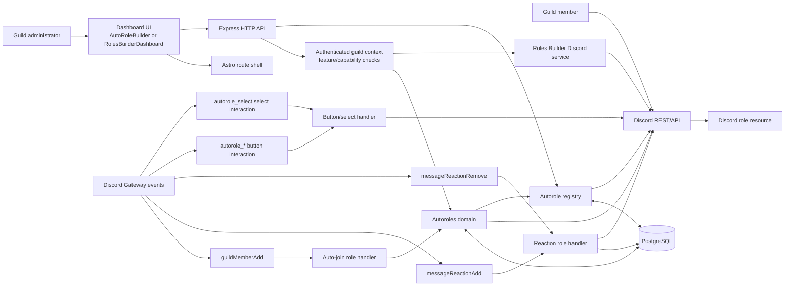

## Dashboard entry points and current hydration

### Auto Roles and Reaction Roles dashboard

**IMPLEMENTED — feature code**

`frontend/src/features/autoroles/AutoRoleBuilder.tsx` provides three tabs:

- **Registry**: lists active role panels, detects deleted/orphaned messages, opens mapping/content editing, and deletes a panel.
- **Create**: creates a reaction, button, or select panel from a template, an existing message, or plain content.
- **Auto Join**: selects human and bot roles that should be assigned on join.

The component loads guild assets, embed templates, current auto-join roles, and active panel registry entries in parallel through the dashboard query layer. Channel selection is limited to guild text and announcement channels. Role selection excludes managed and premium-subscriber/booster roles.

Current dashboard routes:

| Route | Current behavior |
|---|---|
| `/dashboard/roles/autoroles` | Astro shell exists; `AutoRoleIsland` mount is currently commented out |
| `/dashboard/autoroles` | Redirects to `/dashboard/roles/autoroles` |
| `/dashboard/community/autoroles` | Redirects to `/dashboard/roles/autoroles` |

### Roles Builder dashboard

**IMPLEMENTED — feature code**

`frontend/src/features/roles-builder/RolesBuilderDashboard.tsx` provides:

- live role list and bot hierarchy context;
- role count and Discord role-limit display;
- create form for name, color, hoist, mentionable, and supported permission groups;
- edit form for editable roles;
- drag-and-drop hierarchy ordering with locked slots;
- delete confirmation and refresh after each mutation.

Current dashboard routes:

| Route | Current behavior |
|---|---|
| `/dashboard/roles/roles-builder` | Astro shell exists; `RolesBuilderIsland` mount is currently commented out |
| `/dashboard/community/roles-builder` | Redirects to `/dashboard/roles/roles-builder` |

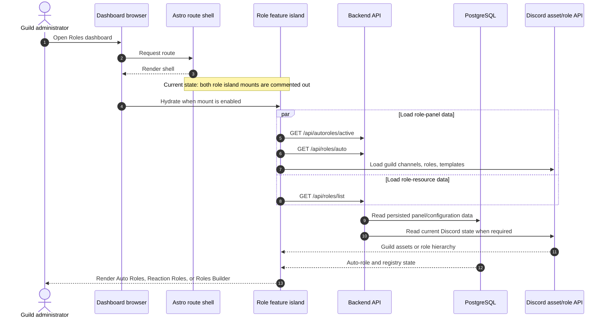

## Auto Roles

### Definition of the current feature

Auto Roles assigns configured roles when Discord emits `guildMemberAdd`. The current policy has exactly two buckets:

- `humanRoles`: selected roles for non-bot members;
- `botRoles`: selected roles for bot members.

There are no additional current predicates such as account age, invite, membership-screening state, channel verification, role delay, role duration, rejoin history, or user-specific exceptions.

### Configure flow: dashboard to database

**IMPLEMENTED**

The frontend calls:

```http
GET  /api/roles/auto
POST /api/roles/auto
```

The backend flow is:

1. Resolve the authenticated guild ID from the request context.
2. Parse and validate every role ID as a Discord Snowflake.
3. Limit each human/bot list to `AUTOROLE_JOIN_ROLES_MAX = 25`.
4. Validate that every selected role is assignable through the gateway.
5. Ensure the base guild row exists.
6. Upsert one `auto_roles` row with `humanRoles`, `botRoles`, and `updatedAt`.
7. Return the saved configuration.

If no row exists, `GET` returns an empty configuration rather than creating a row.

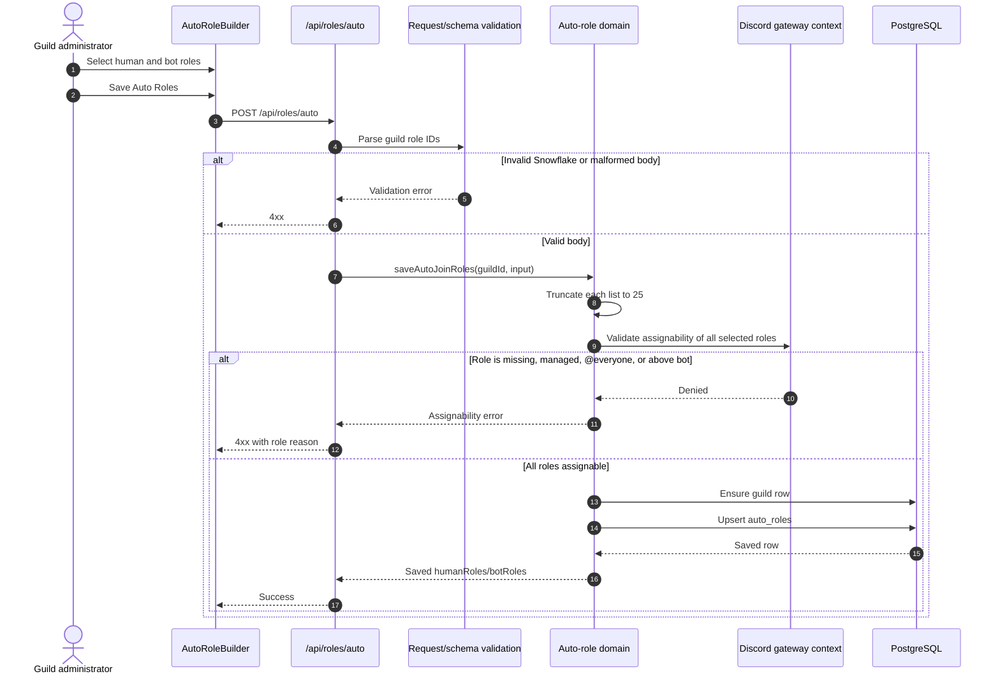

### Join flow: Discord event to member role mutation

**IMPLEMENTED**

The module registers `GuildMembers` intent and listens for `guildMemberAdd`.

1. Discord sends the member-join event.
2. `onGuildMemberAddAutoRoles` loads the guild’s `auto_roles` row.
3. It selects `botRoles` when `member.user.bot === true`; otherwise it selects `humanRoles`.
4. If the selected list is empty, it returns.
5. It obtains the bot member from cache or API.
6. It filters out roles that do not exist, are already present, or are not assignable by the bot.
7. It calls one bulk role-add operation for the remaining roles.
8. The operation uses the audit reason `Adobos auto-roles on join`.
9. Errors are caught and logged as warnings. There is no durable retry or user-facing failure state.

```mermaid
sequenceDiagram
    autonumber
    participant Discord as Discord Gateway
    participant Handler as guildMemberAdd handler
    participant DB as PostgreSQL
    participant Guild as Discord guild/member API
    participant Member as New guild member

    Discord->>Handler: guildMemberAdd(member)
    Handler->>DB: Load auto_roles by guildId
    DB-->>Handler: humanRoles and botRoles
    Handler->>Handler: Choose botRoles or humanRoles
    alt Selected list is empty
        Handler-->>Discord: Return
    else Roles configured
        Handler->>Guild: Resolve bot member/cache
        Guild-->>Handler: Bot highest role and guild roles
        Handler->>Handler: Keep existing, present, and assignable roles only
        alt No roles remain after filtering
            Handler-->>Discord: Return
        else At least one role remains
            Handler->>Member: Bulk add roles
            Member-->>Handler: Discord success or failure
            alt Discord failure
                Handler->>Handler: Log warning; no durable retry
            end
        end
    end
```

### Current Auto Roles behavior matrix

| Condition | Current result |
|---|---|
| Human member joins | Use `humanRoles` |
| Bot member joins | Use `botRoles` |
| Role is already held | Skip it |
| Role was deleted | Skip it |
| Role is managed, @everyone, or above bot | Skip it during event processing; configuration validation should reject it |
| No configured roles | Return without Discord mutation |
| Discord API failure | Log warning; no persistent retry |
| Member joins through a particular invite | No current special handling |
| Member leaves and rejoins | No current sticky/reassignment policy beyond the normal join event |
| Role should be delayed or temporary | Not implemented |
| Existing members need backfill | Not implemented |

## Reaction Roles

### Supported current panel types

The AutoRoleBuilder can create three panel types:

| Type | Discord interaction | Current member behavior | Mapping limit |
|---|---|---|---:|
| `REACTIONS` | Add/remove a reaction on a specific message | Add role on reaction add; remove role on reaction remove | 20 mappings |
| `BUTTONS` | Click a button with `autorole_<roleId>` | Toggle one mapped role | 25 buttons |
| `SELECT` | Submit `autorole_select` with one selected value | Add selected role and remove other roles mapped by the same select | 25 options |

The limits follow the shared package constants and Discord component boundaries used by the current implementation.

### Panel creation sources

The create wizard supports:

- **Template**: load an existing guild embed template.
- **Existing message**: target an existing message by channel and message ID.
- **Plain**: send plain content, optionally combined with an embed payload.

The selected channel must be a guild text or announcement channel. Role pickers exclude managed and premium-subscriber/booster roles. The frontend can fetch an existing message, preview its content, and autocomplete its reactions; it warns when a reaction mapping is already configured.

### Create and publish flow

Relevant frontend/backend operations include:

```http
GET    /api/autoroles/active
POST   /api/autoroles/create
POST   /api/autoroles/reactions
PUT    /api/autoroles/update-mapping/:id
PUT    /api/autoroles/edit-content/:id
DELETE /api/autoroles/delete/:id
```

The current backend sequence is:

1. Require a ready gateway.
2. Validate guild, channel, message, role, emoji, and mapping input.
3. Validate role assignability through the gateway.
4. Resolve the target sendable channel.
5. For a new panel, send the message with content/embed/attachments.
6. For reactions, save mappings keyed by `(messageId, emojiKey)` and then place the bot’s reactions sequentially.
7. For buttons, create button rows and edit/send the message with components.
8. For select menus, create the message and then edit it with select components.
9. Upsert an `autoroles_registry` row.
10. Also write the legacy `reaction_roles_menus` representation used by older interactive flows.

The steps are not one distributed transaction. A failure after message creation can leave a Discord message without a complete local registry, or a local mapping without all visual reactions.

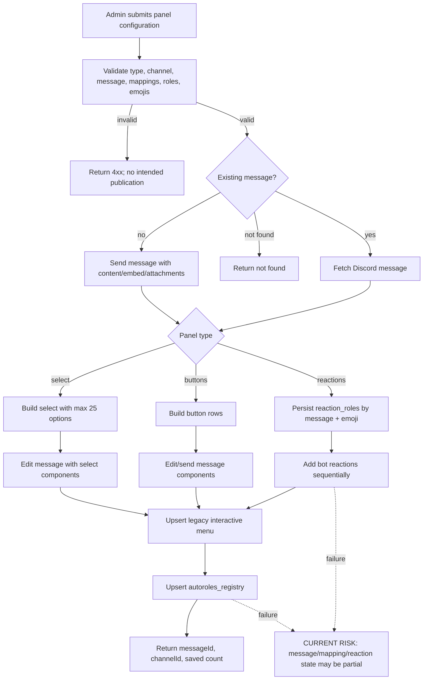

### Reaction mapping persistence

**IMPLEMENTED**

`reaction_roles` stores:

- guild ID;
- channel ID;
- message ID;
- normalized emoji key;
- target role ID;
- creation timestamp.

The composite identity is `(messageId, emojiKey)`. Saving a mapping set deletes existing rows for that message and upserts the normalized set. The current maximum is 20 mappings.

`autoroles_registry` stores the managed panel’s title, type, message ID, channel ID, and JSON role mapping. It is the current dashboard registry used to list, edit, detect orphaned messages, and delete panels.

`reaction_roles_menus` is still written by the current flow as a deprecated/legacy interactive-menu representation. It should not become a second source of truth in a future implementation.

### Reaction add/remove flow

**IMPLEMENTED**

The module registers `GuildMessageReactions` intent and listens for `messageReactionAdd` and `messageReactionRemove`.

For either event:

1. Resolve partial reaction and user objects when necessary.
2. Ignore events outside a guild.
3. Ignore bot users.
4. Normalize the emoji key.
5. Look up `(messageId, emojiKey)` in `reaction_roles`.
6. Resolve the guild member from cache/API.
7. Check role assignability.
8. Add the mapped role on reaction add, or remove it on reaction remove.
9. Use the audit reason `Adobos reaction role`.
10. Catch and log failures without a user-facing response.

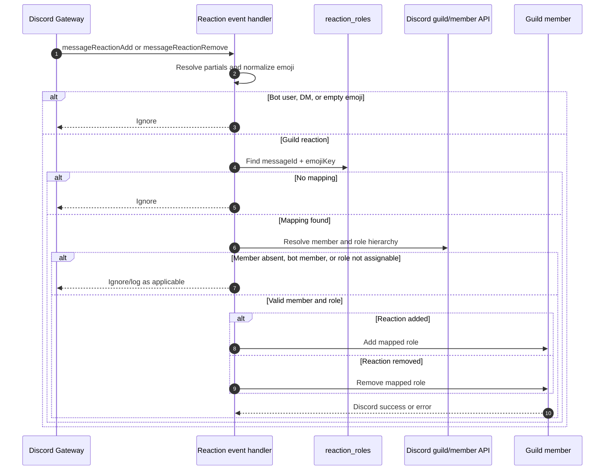

### Button flow

**IMPLEMENTED**

The module handles component interactions whose custom ID starts with `autorole_`. For a button:

1. Validate guild context and role ID.
2. Resolve bot member and target member.
3. Ignore bot users.
4. Check role assignability.
5. If the member has the role, remove it; otherwise add it.
6. Use the audit reason `Adobos autorole`.
7. Reply ephemerally with `Role assigned!` or `Role removed.`.

If the role cannot be managed, the handler replies with an assignability-skip message.

### Select flow

**IMPLEMENTED**

The select menu uses the exact custom ID `autorole_select`.

1. Validate guild context and resolve the bot member.
2. Read all role IDs from the component’s options and the selected value.
3. Use `exclusiveSelectRoleIds` to make the selection exclusive within that menu.
4. Validate the selected role.
5. Resolve the member and ignore bot users.
6. Remove other currently held mapped roles when they are assignable.
7. Add the selected role if absent.
8. Reply ephemerally with `Role assigned!`.

If the selected role is invalid or a Discord operation fails, the handler replies with an assignability-skip message. There is no current explicit “clear selection” option; a user cannot remove the selected role through the select menu without another mapped selection or a separate button/reaction behavior.

### Update, edit, delete, and orphan behavior

**IMPLEMENTED**

| Operation | Current behavior |
|---|---|
| Update mapping | Validate guild ownership and role assignability; update Discord components/reactions first; then update registry mapping JSON |
| Edit content | Fetch message; only bot-authored messages are editable; merge content/embed/attachment patch; mark unknown message orphaned |
| Delete reaction panel | Delete local reaction mappings and clear Discord reactions; nonfatal Discord failure marks orphaned and the registry row is deleted |
| Delete button/select panel | Clear components; nonfatal Discord failure marks orphaned and the registry row is deleted |
| List registry | Fetch each registered message and channel to report channel name, bot authorship, and orphaned state |
| Deleted role | Current event handlers skip or fail assignability; registry mapping is not automatically repaired |
| Manually deleted message | Registry can report it as orphaned when listed or mutated; no background repair job exists |

## Roles Builder

### Definition of the current feature

Roles Builder manages Discord role resources directly. It is not the member-facing role-panel builder.

The backend module is `rolesBuilderModule`, mounted at `/api/roles`, and uses the authenticated guild context. Mutation routes require the `roles.write` guild capability and then independently verify Discord `Manage Roles` and role hierarchy.

### API contract

| Method | Path | Current operation | Authorization |
|---|---|---|---|
| `GET` | `/api/roles/list` | List guild roles, bot hierarchy, role count/limit, and permission groups | Authenticated guild context |
| `POST` | `/api/roles/create` | Create a role | `roles.write` + Discord `Manage Roles` |
| `PATCH` | `/api/roles/:roleId` | Update role fields | `roles.write` + Discord `Manage Roles` + editable role |
| `DELETE` | `/api/roles/:roleId` | Delete role | `roles.write` + Discord `Manage Roles` + editable role |
| `PATCH` | `/api/roles/positions` | Set multiple role positions | `roles.write` + Discord `Manage Roles` + editable positions |

The same `/api/roles` prefix is also used by the autoroles module for `/auto` and `/interactive`; this is a current namespace design risk.

### List flow

**IMPLEMENTED**

`GET /api/roles/list` loads the guild context and returns:

- guild ID and name;
- bot highest role ID, name, and position;
- whether the bot can manage roles;
- current role count and Discord role limit (`250`, including `@everyone`);
- role records with ID, name, color/hex color, position, managed state, hoist, mentionable state, permission keys, and administrator flag;
- permission groups used by the builder.

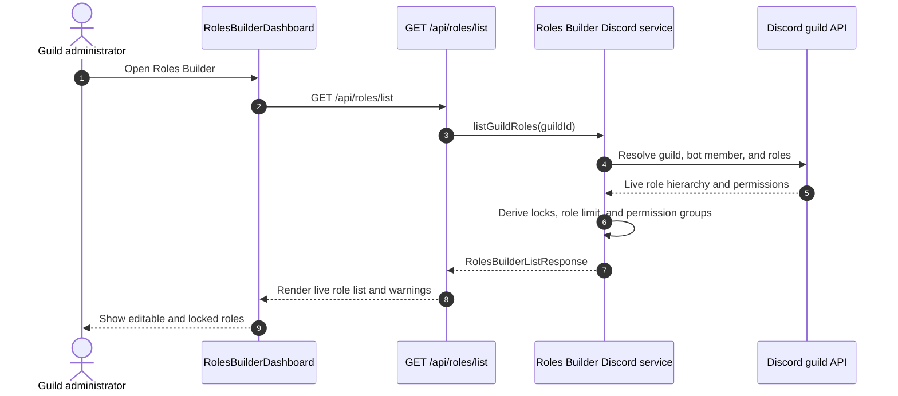

### Create flow

**IMPLEMENTED**

The create schema accepts:

- `name`: 1–100 characters;
- nullable optional `color`;
- allowlisted permission keys;
- optional `hoist`;
- optional `mentionable`.

The backend:

1. Loads the guild and bot role context.
2. Requires `Manage Roles`.
3. Checks the Discord role limit.
4. Resolves name, color, and allowlisted permissions.
5. Computes an initial position using `max(0, botHighestPosition - 1)`.
6. Creates the role with the fixed audit reason.
7. Returns the created role and a warning if Discord placed it at a different position.

The shared permission conversion intentionally ignores `Administrator` even if supplied in the create payload.

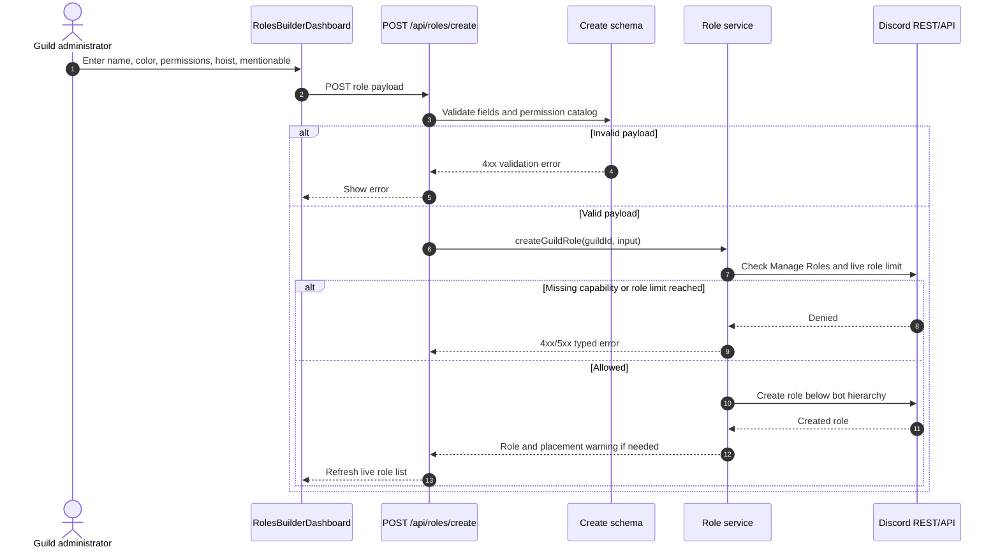

### Update flow

**IMPLEMENTED**

The update schema requires at least one patch field and can update name, color, permissions, hoist, and mentionable state.

The backend rejects a permission patch when the current role already has `Administrator`, using `PERMISSIONS_ADMIN_LOCKED`. The UI also avoids sending permissions for an Administrator role. The backend remains the authoritative guard.

The role must exist, be non-managed, and be below the bot’s highest role.

### Delete flow

**IMPLEMENTED**

The backend requires `Manage Roles`, resolves the role, rejects managed roles, rejects roles at or above the bot hierarchy, and deletes the role through Discord with a fixed audit reason. There is no local deletion ledger, undo record, or automatic recovery.

### Hierarchy flow

**IMPLEMENTED**

The frontend preserves locked slots for:

- the bot’s highest role;
- managed/integration roles;
- roles at or above the bot’s highest position.

`buildPositionPayload` excludes managed and above-bot roles and sends only editable roles below the bot. The backend validates:

- a non-empty position list;
- Snowflake role IDs;
- non-negative integer positions;
- positions below the bot’s highest position;
- editability of every referenced role.

It then calls Discord’s bulk role-position endpoint with a fixed audit reason.

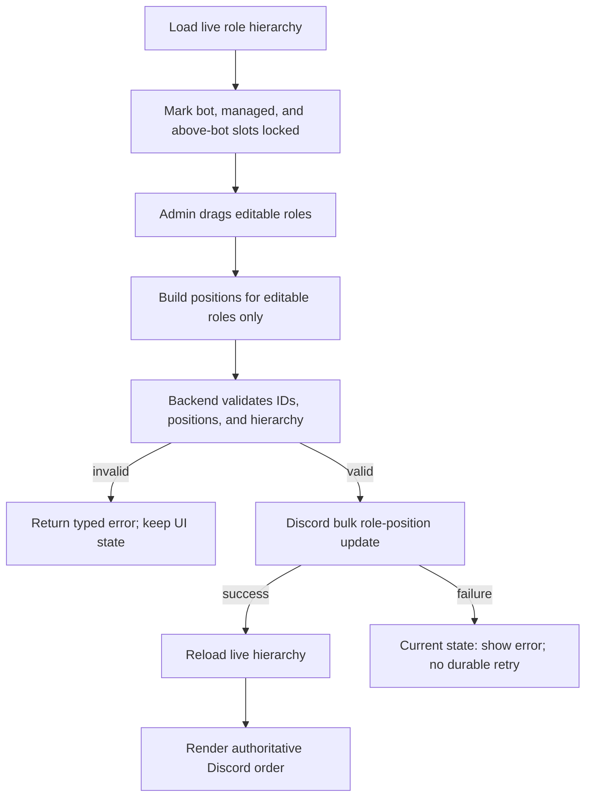

### Roles Builder behavior matrix

| Role/resource condition | Current result |
|---|---|
| Managed integration role | Locked; cannot be edited, moved, or deleted |
| Role at or above bot’s highest role | Locked/rejected |
| Bot lacks `Manage Roles` | Read/list can expose the warning; mutations are rejected |
| Role has Administrator and permission patch is requested | Update rejected |
| Create payload contains Administrator | Permission conversion ignores it |
| Discord role limit reached | Create rejected |
| Discord changes outside the dashboard | Next live list refresh reflects them; no local event ledger |
| Concurrent administrator edits hierarchy | No version/ETag conflict check; last Discord operation may win |

## Current persistence model

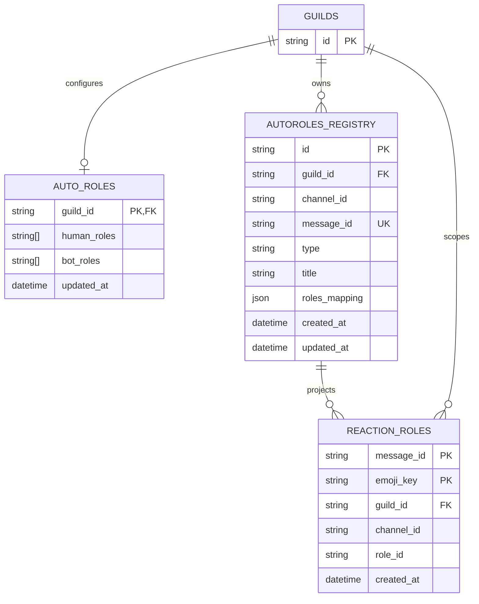

### Current source-of-truth boundaries

| Data | Current source of truth |
|---|---|
| Auto-join role lists | `auto_roles` row |
| Reaction-to-role event lookup | `reaction_roles` rows |
| Dashboard panel inventory and content mapping | `autoroles_registry` rows plus live Discord message inspection |
| Legacy interactive panel representation | `reaction_roles_menus`; currently written but should not remain authoritative |
| Discord role name, color, permission, hierarchy | Discord live state; no local Roles Builder table |

## External product comparison

The comparison below uses public documentation or official product material. “Not evidenced” means no behavior-level source was found in the reviewed official material; it does not prove the product lacks the capability.

### Auto Roles

| Product | Publicly documented behavior relevant to this scope | Implication for this project |
|---|---|---|
| Sapphire Bot | The official Discord listing advertises Join Roles for every new server member and says membership-screening verification is respected. It also advertises reaction roles. | Consider assignment timing after Discord verification/screening, not only raw join time. [Sapphire listing](https://discord.com/discovery/applications/678344927997853742) |
| ProBot | Dashboard auto roles can assign one or multiple roles to new users; premium supports invite-specific role sets; bot hierarchy and membership-screening caveats are explicit; administrative roles are not assigned. | Add invite-specific policies, explicit post-screening semantics, and an Administrator safety rule. [ProBot Auto-Roles](https://docs.probot.io/docs/modules/auto_role) |
| CommunityOne | No dedicated official behavior-level Auto Roles documentation was found in the reviewed product material. | No reliable product-specific requirement inferred. [CommunityOne](https://communityone.io/) |
| MEE6 | Auto role assigns a role to new members; more than one role is supported; bot hierarchy and Manage Roles are required; community servers may assign after rules acceptance. | Add multiple-role clarity, preflight permissions, and membership-screening behavior. [MEE6 Welcome Role](https://help.mee6.xyz/support/solutions/articles/101000381835-how-to-give-a-role-to-new-members-welcome-role-) |
| Dyno | Auto roles can add/remove on join immediately or after a delay; Joinable Ranks allow members to opt in/out, with an optional one-rank limit. Dyno documents rate-limit backlog during large raids. | Add delayed assignment only if needed, plus queue/backpressure and operational visibility. [Dyno Autoroles](https://docs.dyno.gg/modules/autoroles) |
| Carl Bot | Autoroles assign on join; sticky/reassign roles can restore roles on rejoin within a stated 30-day period; blacklist roles and timed roles are documented. | Add explicit rejoin policy, exclusions, and temporary role lifecycle. [Carl-bot roles](https://github.com/botlabs-gg/carlbot-docs/blob/master/docs/roles.md?plain=1) |
| Arcane | Auto roles are dashboard-configured and assigned on member join; one or more member roles are supported with plan-based limits. | The current human/bot split is useful, but role policy should be generalized and visible. [Arcane Auto Roles](https://docs.arcane.bot/plugins/roles/setup/auto-roles) |
| Invite Tracker | Dashboard Auto Roles are supported, and invite labels can add an invite-specific role in addition to administration auto roles. | Add invite attribution as an optional policy input, not hard-code it into the join handler. [Invite Tracker Administration](https://docs.invite-tracker.com/dashboard/administration), [Invite Tracking](https://docs.invite-tracker.com/dashboard/invite-tracking) |
| UnbelievaBoat | Official product material advertises auto roles and self-assignable roles; detailed Auto Roles semantics were not found. | Treat the capability as evidenced, but do not infer timing or conditions. [UnbelievaBoat](https://unbelievaboat.com/) |

### Reaction Roles

| Product | Publicly documented behavior relevant to this scope | Implication for this project |
|---|---|---|
| Sapphire Bot | Official listing advertises reaction roles for self-assignment and also advertises button/select interactions. Detailed role-mode semantics were not found in that listing. | Keep all three interaction transports, but formalize a shared policy model. [Sapphire listing](https://discord.com/discovery/applications/678344927997853742) |
| ProBot | Supports buttons, select menus, and reactions; select options include placeholder, emoji, title, description, and role; reaction modes include Toggle, Give, and Take; notification can be silent or ephemeral; one message supports up to 25 buttons and 20 select options. | Add explicit per-panel mode, user notifications, select descriptions, and per-user role limits. [ProBot Self-Assignable Roles](https://docs.probot.io/docs/modules/self-assignable-roles) |
| CommunityOne | No dedicated official Reaction Roles documentation was found. Reviewed community pages were not treated as product specifications. | No reliable product-specific requirement inferred. [CommunityOne](https://communityone.io/) |
| MEE6 | Reaction Roles can work as a verification gate; supports text/embed/both and button, emoji, or dropdown interactions; multiple roles can be enabled/disabled; required Discord permissions are documented. | Add verification-oriented configuration, permission preflight, and explicit interaction mode. [MEE6 Reaction Roles](https://help.mee6.xyz/support/solutions/articles/101000473019-how-to-use-reaction-roles-as-a-verification-gate-for-your-community), [MEE6 permissions](https://help.mee6.xyz/support/solutions/articles/101000484903-what-permissions-does-mee6-need-) |
| Dyno | Supports reactions, buttons, and dropdowns; Normal, Add Only, Remove Only; multiple-role behavior; existing-message workflows; menu limits; cloning/edit restrictions; external emoji permission requirements. | Add mode semantics, existing-message compatibility checks, cloning/repair, and external-emoji preflight. [Dyno Reaction Roles](https://docs.dyno.gg/en/modules/reactionroles), [Dyno Premium limits](https://docs.dyno.gg/en/premium) |
| Carl Bot | Supports normal, verify, drop, reversed, and lock modes; linked messages can enforce one role across messages; temporary reaction roles are documented. | Add a mode/policy layer, group lock, verification mode, and optional temporary expiry. [Carl-bot roles](https://github.com/botlabs-gg/carlbot-docs/blob/master/docs/roles.md?plain=1) |
| Arcane | Supports Default, Toggle, Group Lock, Persistent, and Reverse reaction-role types; dashboard can use a linked message or send one; deleting a panel may require manual reaction cleanup; plan limits are documented. | Add explicit group behavior, persistent/reverse semantics, and cleanup/reconciliation states. [Arcane Reaction Roles](https://docs.arcane.bot/plugins/roles/setup/reaction-roles) |
| Invite Tracker | No dedicated official Reaction Roles documentation was found. | No reliable product-specific requirement inferred. [Invite Tracker](https://docs.invite-tracker.com/) |
| Unbelievaboat | Official material documents role add/remove actions in Store items, role requirements, and timed removal; detailed Reaction Roles behavior was not found. | Treat timed role removal as a reusable role-assignment primitive, but do not conflate Store actions with Reaction Roles. [UnbelievaBoat Store](https://faq.unbelievaboat.com/dashboard/store/), [Adding a role](https://faq.unbelievaboat.com/common-questions/adding-role-to-store/) |

### Roles Builder / role resource management

| Product | Publicly documented behavior relevant to this scope | Implication for this project |
|---|---|---|
| Sapphire Bot | No dedicated Role Builder specification was found in the official listing. | No product-specific builder requirement inferred. [Sapphire listing](https://discord.com/discovery/applications/678344927997853742) |
| ProBot | Public role documentation reviewed focuses on auto/self-assignable roles, not a dedicated role creation and hierarchy builder. | Current builder scope is broader than the evidenced ProBot material. [ProBot docs](https://docs.probot.io/docs/modules/self-assignable-roles) |
| CommunityOne | No dedicated official Role Builder documentation was found. | No product-specific builder requirement inferred. [CommunityOne](https://communityone.io/) |
| MEE6 | No dedicated official Role Builder documentation was found in the reviewed material. | No product-specific builder requirement inferred. [MEE6 help center](https://help.mee6.xyz/) |
| Dyno | Official commands document role add/remove/toggle and role administration, but not a dashboard builder with live drag-and-drop hierarchy. | Current builder can remain dashboard-first; command parity is not required for this scope. [Dyno role commands](https://docs.dyno.gg/commands/role), [Dyno roles](https://docs.dyno.gg/en/commands/roles) |
| Carl Bot | Official docs document role creation and role management commands, including name/color/mentionable/hoist and hierarchy warnings; no rich dedicated builder UI was evidenced. | Current fields align with command-level role management; add local mutation history and live conflict handling. [Carl-bot roles](https://github.com/botlabs-gg/carlbot-docs/blob/master/docs/roles.md?plain=1) |
| Arcane | Public role documentation focuses on Auto Roles and Reaction Roles; no dedicated Role Builder page was found. | No product-specific builder requirement inferred. [Arcane Roles](https://docs.arcane.bot/plugins/roles/) |
| Invite Tracker | No dedicated official Role Builder documentation was found. | No product-specific builder requirement inferred. [Invite Tracker](https://docs.invite-tracker.com/) |
| UnbelievaBoat | Store actions support role requirements, adding/removing roles, and timed removal; no dedicated role resource builder was found. | Timed lifecycle is a possible shared primitive, not a builder requirement. [UnbelievaBoat Store](https://faq.unbelievaboat.com/dashboard/store/) |

### Discord platform constraints

Discord’s official documentation states that `MANAGE_ROLES` allows a bot to create/manage roles below its highest role; equal or higher roles cannot be managed, and channel permissions can override role permissions. These are platform constraints, not optional product behavior. [Discord Server and Channel Management](https://docs.discord.com/developers/platform/server-and-channel-management), [Discord Roles and Permissions](https://support.discord.com/hc/en-us/articles/214836687-Discord-Roles-and-Permissions)

## Gaps and improvements

The following items are deliberately separated from the current implementation. None of them should be read as already available.

### P0 — correctness and resilience

| ID | Status | Gap | Recommended behavior |
|---|---|---|---|
| R-001 | **NEW — RECOMMENDED** | `/api/roles` is declared by both the autoroles and roles-builder modules | Give each bounded context a unique prefix, for example `/api/autoroles` for all panel and auto-join operations and `/api/role-resources` for role CRUD. Add a route-collision test that fails on duplicate method/path registrations. |
| R-002 | **NEW — RECOMMENDED** | Join/reaction/button/select assignments are direct best-effort Discord calls | Persist an idempotent `role_assignment_job` or outbox record containing guild, member, role, source, event ID, desired state, attempts, and last error. Process it through a bounded queue with exponential backoff and Discord rate-limit awareness. |
| R-003 | **NEW — RECOMMENDED** | No durable result when a role assignment fails or the process restarts | Make assignment outcomes observable: `pending`, `applied`, `already_applied`, `skipped_not_assignable`, `skipped_missing`, `retryable_failure`, `permanent_failure`. Expose only the appropriate summary in the dashboard, but preserve the full operational record. |
| R-004 | **NEW — RECOMMENDED** | Panel publication is not atomic across Discord and PostgreSQL | Use a publication state machine and idempotency key. Persist `draft → publishing → published` (or `degraded`) and reconcile message, mapping, reactions/components, and registry before reporting success. |
| R-005 | **NEW — RECOMMENDED** | Mapping updates can change Discord first and local state second | Use a versioned panel aggregate. Validate the complete desired state, apply it through a projector, record the Discord result, and commit the new version only after the projector reaches the expected state. A repair job handles partial publication. |
| R-006 | **NEW — RECOMMENDED** | Missed `guildMemberAdd` events are not repaired | Add a bounded reconciliation command/job for configured auto roles. It should scan eligible members in pages, compare desired vs actual roles, and enqueue only missing assignments. Do not blindly rewrite every member. |
| R-007 | **NEW — RECOMMENDED** | Role deletions and hierarchy changes can invalidate existing mappings | Revalidate mapped roles at panel read/update time and asynchronously mark mappings `invalid_role` or `unassignable`. Do not silently keep a panel appearing healthy when its target role disappeared or moved above the bot. |
| R-008 | **NEW — RECOMMENDED** | No concurrency protection for dashboard edits | Add aggregate version/ETag checks for auto-role config and panel edits. Return `409` when the administrator edits stale data, then reload authoritative state. |

### P1 — feature parity and operator safety

| ID | Status | Gap | Recommended behavior |
|---|---|---|---|
| R-009 | **NEW — RESEARCH / RECOMMENDED** | Auto Roles only distinguish human vs bot | Generalize to a policy predicate model while keeping human/bot as the first built-in predicate. Future predicates may include membership-screening completion, invite attribution, account age, allow/deny role, or explicit member exception. |
| R-010 | **NEW — RESEARCH / RECOMMENDED** | No delayed, temporary, or timed assignment | Add optional `delay` and `expiresAt` through a durable scheduler. Use this only for policies that need it; immediate assignment remains the default. |
| R-011 | **NEW — RESEARCH / RECOMMENDED** | No rejoin/sticky role policy | Add an explicit opt-in retention policy with a bounded retention period and privacy-conscious storage. Do not infer sticky behavior from a normal `guildMemberAdd`. |
| R-012 | **NEW — RESEARCH / RECOMMENDED** | No invite-specific role policy | Add an invite-attribution adapter that resolves the invite before planning roles. Keep it optional and separate from core assignment so normal joins do not depend on invite tracking. Discord also supports invite `role_ids` that automatically assign roles when an invite is accepted; those roles persist after invite deletion/expiration and need explicit cleanup policy. [Discord Community Invites](https://docs.discord.com/developers/tutorials/using-community-invites) |
| R-013 | **NEW — RESEARCH / RECOMMENDED** | Reaction roles always implement one fixed semantic per transport | Model panel policy explicitly: `toggle`, `add_only`, `remove_only`, `verify`, `drop`, `reverse`, `persistent`, and `group_lock`. Implement only the modes product requirements justify, with tests for add/remove behavior. |
| R-014 | **NEW — RESEARCH / RECOMMENDED** | Select menus have no explicit clear option, descriptions, or per-user limit | Add select option descriptions, configurable placeholder, optional clear action, and a per-user maximum. Preserve exclusive selection as a panel-level policy rather than an accidental handler detail. |
| R-015 | **NEW — RESEARCH / RECOMMENDED** | No notification policy for component interactions | Add `silent`, `assigned`, `removed`, and `unchanged` ephemeral response templates. Reactions may remain silent because they have no interaction response channel. |
| R-016 | **NEW — RESEARCH / RECOMMENDED** | Existing-message and external-emoji constraints are not a formal preflight | Before publication, validate message ownership/editability, channel permissions, reaction permissions, external emoji permission, component compatibility, and target-role hierarchy. Return all actionable issues in one response. |
| R-017 | **NEW — RECOMMENDED** | Legacy `reaction_roles_menus` is written alongside current registry/mappings | Choose one authoritative panel aggregate. Keep a one-way migration reader/writer only for a defined transition period, then remove dual writes. |
| R-018 | **NEW — RECOMMENDED** | No explicit verification of `Administrator` for Auto Roles/Reaction Roles | Reject Administrator roles in all member self-assignment and auto-join policies. The current Roles Builder create path ignores Administrator in the permission conversion and the update path locks existing Administrator roles; the same safety policy should be explicit in panel configuration. |

### P2 — user experience and maintenance

| ID | Status | Gap | Recommended behavior |
|---|---|---|---|
| R-019 | **NEW — RECOMMENDED** | Custom IDs are not versioned or message-scoped in their encoding | Use a compact versioned custom ID containing panel ID and action, while keeping the server-side registry authoritative. Validate that the clicked component belongs to the configured panel. |
| R-020 | **NEW — RECOMMENDED** | Deleted messages are discovered only during list/mutation | Add a low-frequency panel health reconciler that marks orphaned panels and optionally offers repair or clone. Never delete a registry record automatically without an explicit retention rule. |
| R-021 | **NEW — RECOMMENDED** | Roles Builder has no undo, audit history, or dry run | Add a role mutation ledger, before/after snapshot, actor, Discord audit correlation where available, and a preview of hierarchy changes before applying them. |
| R-022 | **NEW — RECOMMENDED** | Live role hierarchy can change between load and save | Send a list version or role fingerprint with position mutations. Re-read and reject stale payloads rather than applying an order based on an old screen. |
| R-023 | **NEW — RECOMMENDED** | Route shells can silently render no feature because mounts are commented | Enable the intended islands through a separate frontend delivery change and add an end-to-end smoke test for each route. This document does not modify that code. |

## Recommended design pattern

### Design decision

The best fit is a **policy-driven Role Assignment and Role Resource architecture** composed of:

- a **Role Policy aggregate** for Auto Roles and Reaction Roles;
- a **Role Assignment Planner** that calculates desired state without calling Discord;
- a **Role Mutation Executor** that performs idempotent Discord mutations;
- a **Panel Projector** that publishes Discord messages/components/reactions from a panel aggregate;
- a separate **Role Resource Service** for role CRUD and hierarchy;
- a durable **outbox/job layer** and **reconciliation workers** around all asynchronous Discord effects.

This separates “what roles should this member have?” from “how do we deliver that state through a Discord API call?” It also lets future modules reuse assignment, hierarchy, scheduling, idempotency, and audit primitives without coupling them to Reaction Roles.

### Target architecture

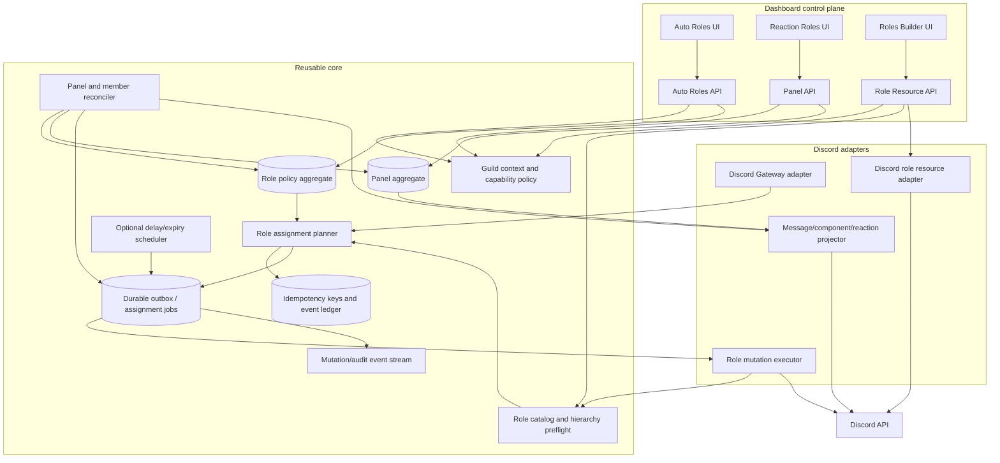

### Core components to build once

These are deliberately cross-module primitives, not additional documented user features.

| Core piece | Responsibility | Reusable by future modules |
|---|---|---|
| `GuildContext` | Resolve authenticated guild, actor, installed bot, and capability | Every dashboard mutation |
| `RoleCatalog` | Cache/read live roles, bot hierarchy, managed state, and assignability | Moderation targets, onboarding, automation |
| `RolePolicy` | Versioned desired-role rules and exclusions | Any event-driven role policy |
| `RoleAssignmentPlanner` | Produce idempotent add/remove intents from event + policy + current state | Welcome, verification, subscriptions, achievements |
| `RoleMutationExecutor` | Execute one role add/remove with hierarchy checks, rate-limit handling, and typed outcomes | All role-changing features |
| `AssignmentJob` | Durable retryable work item with deduplication key | All Discord side effects |
| `PanelAggregate` | One source of truth for message, transport, mappings, mode, and version | Any interactive Discord panel |
| `PanelProjector` | Reconcile aggregate to Discord content/components/reactions | Menus, forms, dashboards, verification panels |
| `PreflightReport` | Return all role/channel/message/permission problems before mutation | All dashboard publishers |
| `ReconciliationCursor` | Bounded repair over members, panels, and roles | Recovery from missed events/deletions |
| `MutationLedger` | Actor, intent, before/after, result, Discord IDs, and error | Audit, support, undo, incident analysis |

### End-to-end target flow: Auto Roles

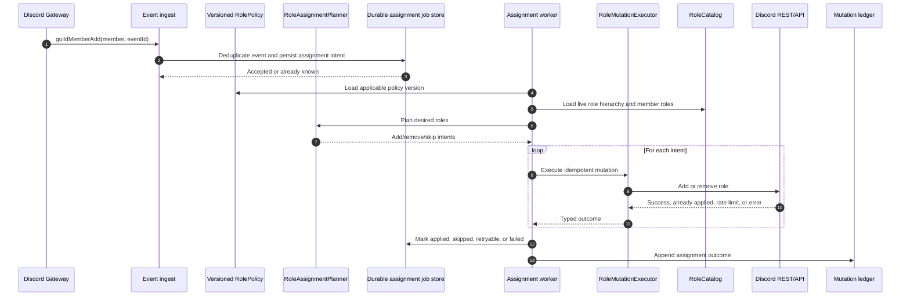

### End-to-end target flow: Reaction Role panel

```mermaid
sequenceDiagram
    autonumber
    actor Admin as Guild administrator
    participant UI as Reaction Roles builder
    participant API as Panel API
    participant Preflight as PreflightReport
    participant Store as Panel aggregate store
    participant Outbox as Publication outbox
    participant Projector as PanelProjector
    participant Discord as Discord API

    Admin->>UI: Define transport, mappings, mode, content, and channel
    UI->>API: Submit desired panel + idempotency key
    API->>Preflight: Validate roles, hierarchy, channel, message, emoji, permissions
    alt Preflight errors
        Preflight-->>API: Complete actionable error list
        API-->>UI: 4xx; no publication
    else Valid
        API->>Store: Save versioned panel as publishing
        API->>Outbox: Enqueue publish(panelId, version)
        API-->>UI: Accepted/publishing state
        Outbox->>Projector: Publish desired version
        Projector->>Discord: Send or edit message
        Projector->>Discord: Set components or place reactions
        Discord-->>Projector: Per-operation outcomes
        alt All required operations succeed
            Projector->>Store: Mark published with Discord IDs/fingerprint
        else Partial outcome
            Projector->>Store: Mark degraded with repair instructions
            Projector->>Outbox: Schedule bounded retry
        end
        UI->>API: Poll/read panel state
        API-->>UI: published, degraded, or orphaned
    end
```

### End-to-end target flow: Roles Builder mutation

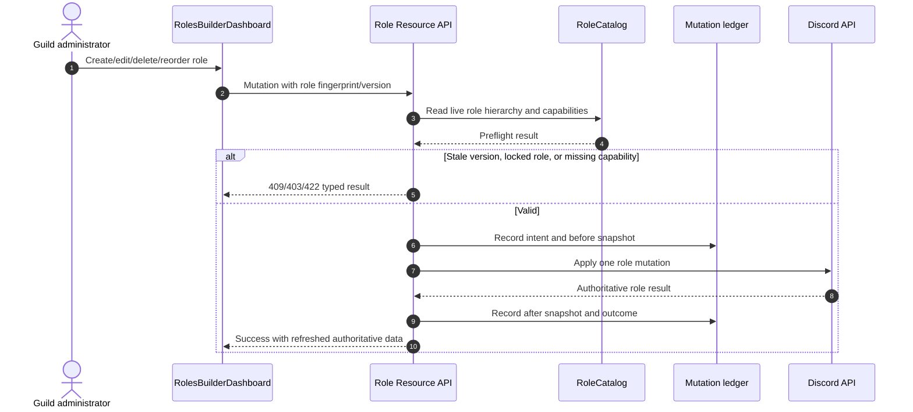

### State model for panel publication

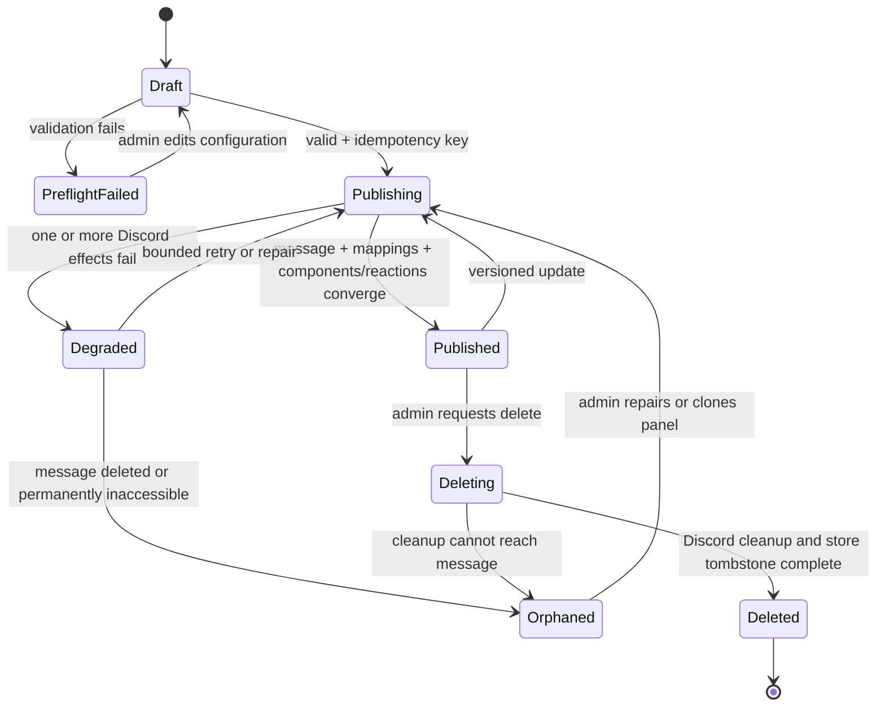

## Recommended invariants

1. A role assignment intent is idempotent by `(guildId, memberId, roleId, policyVersion, desiredState, sourceEventId)`.
2. A panel mapping is unique by `(panelId, transportKey)`; for reactions, `transportKey` is the normalized emoji key.
3. A panel has one authoritative aggregate; legacy tables are migration projections only.
4. A role is assignable only when it exists, is not managed, is not `@everyone`, is below the bot’s highest role, and passes the module’s safety policy.
5. Every Discord mutation has a typed result and a retry classification.
6. Dashboard writes use version checks and never overwrite a newer configuration silently.
7. The worker never depends on a dashboard request remaining open.
8. Reconciliation is bounded, resumable, and safe to run more than once.
9. Discord live state is authoritative for role hierarchy and role fields; local state is authoritative for desired policies and panel definitions.
10. A successful API response means the requested state is durably accepted or converged, not merely that a Discord request was started.

## Implementation sequence recommended for a future code phase

This is an architecture order, not an implementation performed by this documentation task:

1. Remove the `/api/roles` collision and define bounded-context route prefixes.
2. Define one versioned panel aggregate and migrate legacy interactive-menu data into it.
3. Extract `RoleCatalog`, assignability preflight, and shared `RoleMutationExecutor`.
4. Add durable assignment jobs/outbox and idempotent worker outcomes.
5. Convert auto-join and reaction/component handlers to create assignment intents.
6. Add panel publication state, repair, and orphan reconciliation.
7. Add explicit parity policies only where product requirements demand them: modes, delayed/timed roles, invite rules, rejoin behavior, limits, and notifications.
8. Add Roles Builder mutation ledger, stale-write protection, and hierarchy preview.
9. Enable the dashboard islands through a separate frontend change and add route smoke tests.

No code changes were made as part of this document.

## Audited repository sources

The current-state sections are based on these repository areas:

- `backend/src/modules/autoroles/module.ts`
- `backend/src/modules/autoroles/autoJoin.ts`
- `backend/src/modules/autoroles/gateway/guildMemberAdd.ts`
- `backend/src/modules/autoroles/gateway/messageReactionAdd.ts`
- `backend/src/modules/autoroles/gateway/messageReactionRemove.ts`
- `backend/src/modules/autoroles/gateway/reactionRoleShared.ts`
- `backend/src/modules/autoroles/http/routes.ts`
- `backend/src/modules/autoroles/http/roles.routes.ts`
- `backend/src/modules/autoroles/http/controller.ts`
- `backend/src/modules/autoroles/http/schema.ts`
- `backend/src/modules/autoroles/domain/reactionRoles.ts`
- `backend/src/modules/autoroles/registry.ts`
- `backend/src/modules/autoroles/assignable.ts`
- `backend/src/db/schema/autoroles.ts`
- `packages/shared/src/autoroles.ts`
- `packages/shared/src/autoroles.test.ts`
- `frontend/src/features/autoroles/AutoRoleBuilder.tsx`
- `frontend/src/features/autoroles/README.md`
- `frontend/src/lib/api/autoroles.ts`
- `frontend/src/pages/dashboard/roles/autoroles.astro`
- `frontend/src/pages/dashboard/autoroles.astro`
- `frontend/src/pages/dashboard/community/autoroles.astro`
- `backend/src/modules/roles-builder/module.ts`
- `backend/src/modules/roles-builder/http/routes.ts`
- `backend/src/modules/roles-builder/http/schema.ts`
- `backend/src/modules/roles-builder/discord.ts`
- `frontend/src/features/roles-builder/RolesBuilderDashboard.tsx`
- `frontend/src/lib/api/roles-builder.ts`
- `frontend/src/pages/dashboard/roles/roles-builder.astro`
- `frontend/src/pages/dashboard/community/roles-builder.astro`
- `frontend/src/components/providers/islands.tsx`
- `packages/shared/src/roles-builder.ts`

The repository index reported no recorded coverage gaps for the cited paths or bounded module scopes at the time of this audit. That is a best-effort index signal, not proof that source analysis can never miss a construct.

## External sources

### Product documentation

- [Sapphire — official Discord listing](https://discord.com/discovery/applications/678344927997853742)
- [ProBot — Auto-Roles](https://docs.probot.io/docs/modules/auto_role)
- [ProBot — Self-Assignable Roles](https://docs.probot.io/docs/modules/self-assignable-roles)
- [CommunityOne — official site](https://communityone.io/)
- [MEE6 — Welcome Role / Auto Role](https://help.mee6.xyz/support/solutions/articles/101000381835-how-to-give-a-role-to-new-members-welcome-role-)
- [MEE6 — Reaction Roles verification gate](https://help.mee6.xyz/support/solutions/articles/101000473019-how-to-use-reaction-roles-as-a-verification-gate-for-your-community)
- [MEE6 — required permissions](https://help.mee6.xyz/support/solutions/articles/101000484903-what-permissions-does-mee6-need-)
- [Dyno — Autoroles](https://docs.dyno.gg/modules/autoroles)
- [Dyno — Reaction Roles](https://docs.dyno.gg/en/modules/reactionroles)
- [Dyno — Premium limits](https://docs.dyno.gg/en/premium)
- [Dyno — role commands](https://docs.dyno.gg/commands/role)
- [Dyno — roles commands](https://docs.dyno.gg/en/commands/roles)
- [Carl-bot — roles documentation](https://github.com/botlabs-gg/carlbot-docs/blob/master/docs/roles.md?plain=1)
- [Carl-bot — official dashboard listing](https://carl.gg/?v=1.0.26)
- [Arcane — Roles overview](https://docs.arcane.bot/plugins/roles/)
- [Arcane — Auto Roles](https://docs.arcane.bot/plugins/roles/setup/auto-roles)
- [Arcane — Reaction Roles](https://docs.arcane.bot/plugins/roles/setup/reaction-roles)
- [Arcane — role-management changelog](https://docs.arcane.bot/changelogs/4-14-2026/)
- [Invite Tracker — official documentation](https://docs.invite-tracker.com/)
- [Invite Tracker — administration / Auto Roles](https://docs.invite-tracker.com/dashboard/administration)
- [Invite Tracker — invite tracking roles](https://docs.invite-tracker.com/dashboard/invite-tracking)
- [Invite Tracker — FAQ](https://docs.invite-tracker.com/faq)
- [UnbelievaBoat — official site](https://unbelievaboat.com/)
- [UnbelievaBoat — Store](https://faq.unbelievaboat.com/dashboard/store/)
- [UnbelievaBoat — adding a role to a Store item](https://faq.unbelievaboat.com/common-questions/adding-role-to-store/)
- [UnbelievaBoat — dashboard access](https://faq.unbelievaboat.com/dashboard/dashboard-access/)

### Discord platform documentation

- [Discord — Server and Channel Management](https://docs.discord.com/developers/platform/server-and-channel-management)
- [Discord Support — Roles and Permissions](https://support.discord.com/hc/en-us/articles/214836687-Discord-Roles-and-Permissions)
- [Discord — Community Invites](https://docs.discord.com/developers/tutorials/using-community-invites)

