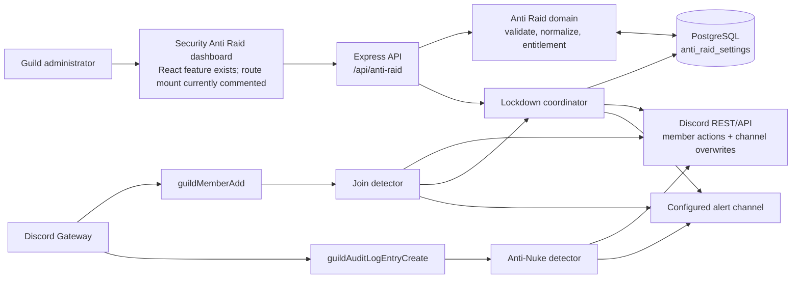
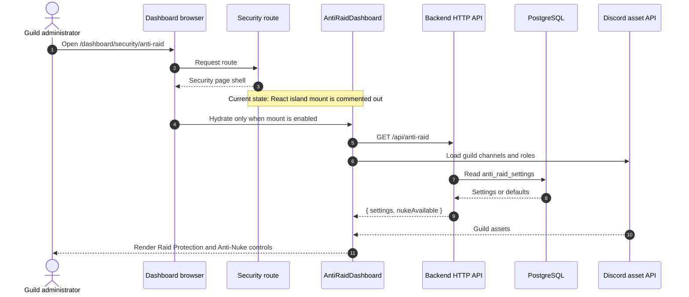
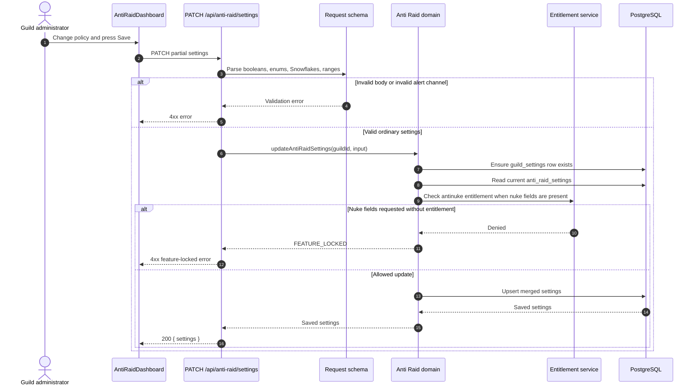
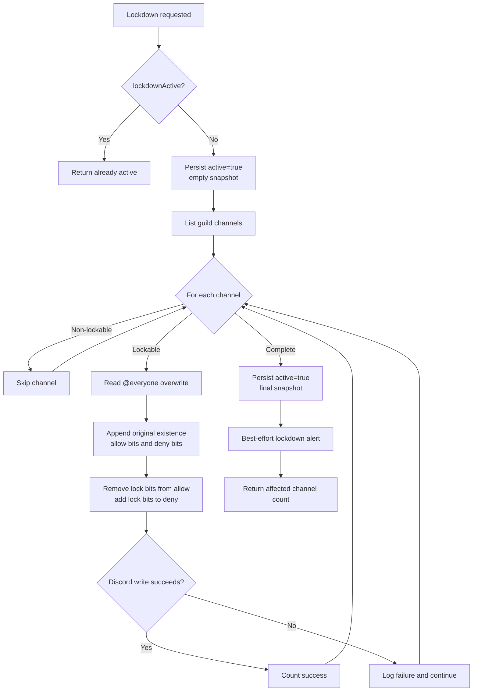
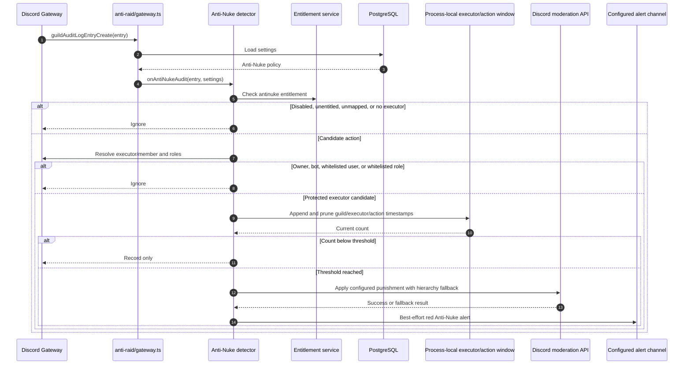
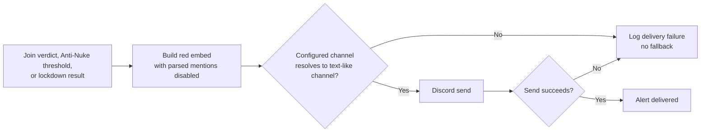
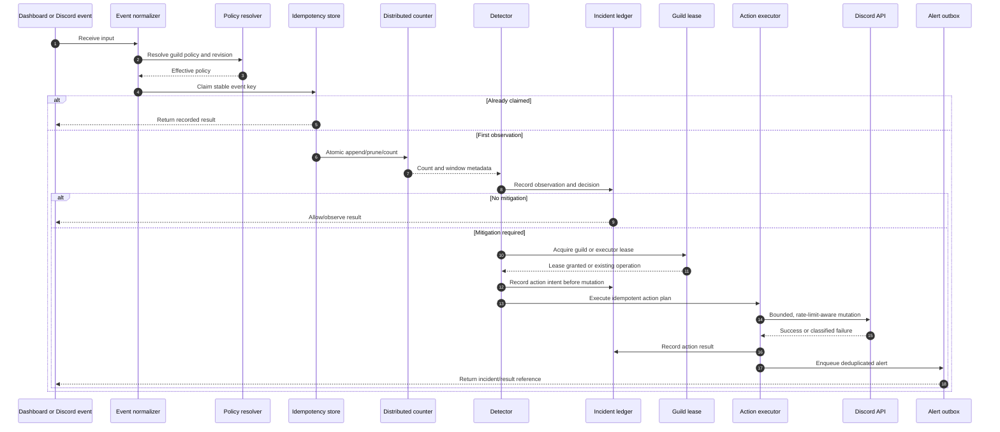
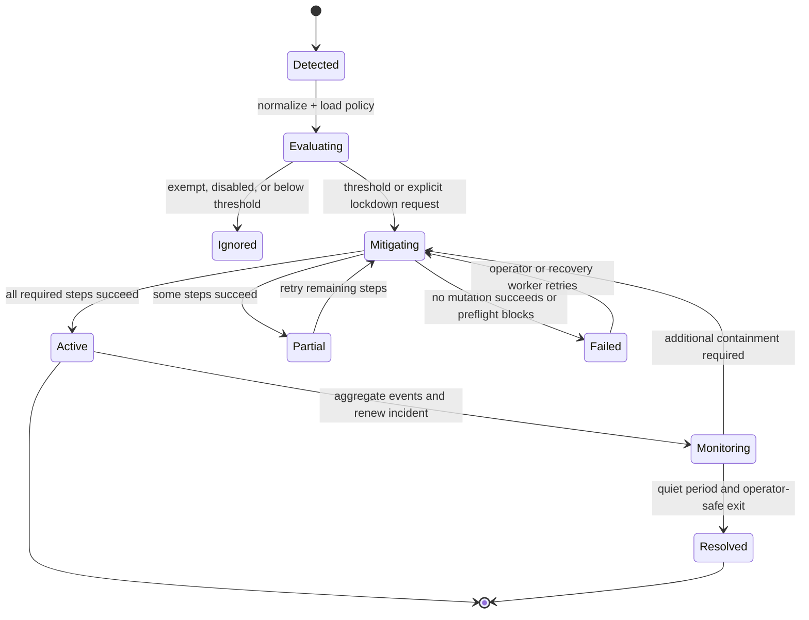

# Security Module — Anti Raid

## Scope

This document covers only the `Security → Anti Raid` capability:

- Join-flood and new-account protection.
- Emergency guild lockdown.
- Anti-Nuke protection exposed by the same Anti Raid dashboard.
- Configuration, persistence, Discord event handling, actions, alerts, and operational boundaries required by those capabilities.

It does not document other Security, Moderation, logging, or automated-message features.

The word **Anti-Nuke** appears here because it is implemented inside the current Anti Raid module and is configured from the same page. It is treated as a sub-capability, not as a separate undocumented module.

## Status vocabulary

- **IMPLEMENTED** — evidenced in the current repository.
- **NEW — RESEARCH** — behavior observed in public documentation or official product material from another bot or from Discord.
- **NEW — RECOMMENDED** — a proposed gap closure, hardening measure, or architecture decision. It is not implemented today.

The diagrams use standard Mermaid flowcharts, sequence diagrams, state diagrams, and entity-relationship diagrams compatible with Mermaid 2026 renderers.

## Executive summary

### What is implemented

| Capability | Trigger | Current decision | Current mutation | Current state |
|---|---|---|---|---|
| Join flood protection | Discord `guildMemberAdd` | Count non-bot joins inside a per-guild in-memory sliding window | Kick, ban, or activate lockdown | Counter exists only in the bot process |
| New-account protection | Discord `guildMemberAdd` | Compare account creation time with configured minimum age | Kick or timeout | Configuration is persisted per guild |
| Lockdown | Dashboard, `/lockdown`, or a join-flood verdict | Deny selected `@everyone` permissions in lockable channels | Prevent sending, threads, reactions, voice connection, and voice speaking | Active state plus overwrite snapshot is persisted |
| Anti-Nuke | Discord `guildAuditLogEntryCreate` | Count selected destructive actions by executor in a per-user/action in-memory window | Strip dangerous roles, kick, or ban | Entitlement-gated; counters exist only in the bot process |
| Security alerts | Automatic verdict, nuke punishment, or lockdown operation | Resolve the configured alert channel | Send a red embed | Best-effort delivery; no durable alert/outbox record |

### Important current boundary

The dashboard component exists, but the current Astro page at `/dashboard/security/anti-raid` has its React island import and mount commented out. The legacy `/dashboard/moderation/anti-raid` page redirects to the Security path. Therefore, the backend and frontend feature code are present, but the current Security route is not hydrated by the dashboard UI until that mount is enabled.

## Current topology

### Repository map

| Layer | Current source | Responsibility |
|---|---|---|
| Module registration | `backend/src/modules/anti-raid/module.ts` | Registers the `anti-raid` module, HTTP mount, gateway listeners, and `/lockdown` command. |
| Dashboard API | `backend/src/modules/anti-raid/http/routes.ts` | Reads configuration, validates updates, and starts/stops lockdown. |
| HTTP validation | `backend/src/modules/anti-raid/http/schema.ts` | Validates booleans, Snowflakes, ranges, enums, thresholds, and whitelist sizes. |
| Domain configuration | `backend/src/modules/anti-raid/domain/anti-raid.ts` | Loads defaults, normalizes values, checks the Anti-Nuke entitlement, and persists settings. |
| Shared policy | `packages/shared/src/anti-raid.ts` | Defines contracts, defaults, boundaries, immunity, timestamp windows, and verdict precedence. |
| Join detector | `backend/src/modules/anti-raid/raid.ts` | Processes new members, records the join window, decides a verdict, executes it, and alerts. |
| Gateway adapter | `backend/src/modules/anti-raid/gateway.ts` | Converts Discord events into join and audit-log processing calls. |
| Lockdown coordinator | `backend/src/modules/anti-raid/lockdown.ts` | Applies and restores channel permission overwrites and stores a snapshot. |
| Anti-Nuke detector | `backend/src/modules/anti-raid/nuke.ts` | Maps audit-log actions, counts executors, applies punishment, and alerts. |
| Alerts | `backend/src/modules/anti-raid/alerts.ts` | Resolves the configured text-based channel and sends a red embed. |
| Persistence | `backend/src/db/schema/antiRaid.ts` | Stores per-guild policy and lockdown state/snapshot. |
| Dashboard feature | `frontend/src/features/anti-raid/AntiRaidDashboard.tsx` | Renders Raid Protection and Anti-Nuke controls and calls the API. |
| Dashboard API client | `frontend/src/lib/api/anti-raid.ts` | Calls `GET`, `PATCH`, and `POST` Anti Raid endpoints. |
| Current route | `frontend/src/pages/dashboard/security/anti-raid.astro` | Security page shell; the island mount is currently commented. |

### Runtime topology



## User and dashboard flow

### Dashboard route and hydration

**IMPLEMENTED**

1. The intended dashboard route is `/dashboard/security/anti-raid`.
2. The feature component is `AntiRaidDashboard`.
3. The component loads the Anti Raid configuration and guild assets in parallel.
4. Guild assets provide the channels and roles displayed by the selectors.
5. The current Astro route contains the shell but comments out the `AntiRaidIsland` import and `<AntiRaidIsland client:load />` mount.
6. The old Moderation route redirects to the Security route.



### Read configuration

**IMPLEMENTED**

`GET /api/anti-raid/`:

- Uses the authenticated guild selected by the dashboard context.
- Reads `anti_raid_settings`.
- Returns default settings when the guild has no row yet.
- Returns `nukeAvailable`, based on the `antinuke` entitlement.

Response shape:

```json
{
  "settings": {
    "enabled": false,
    "alertChannelId": null,
    "joinFloodEnabled": true,
    "joinCount": 10,
    "joinWindowSeconds": 10,
    "joinAction": "kick",
    "accountAgeEnabled": false,
    "accountAgeDays": 7,
    "accountAgeAction": "kick",
    "lockdownJoinAction": "timeout",
    "timeoutSeconds": 3600,
    "whitelistRoleIds": [],
    "nukeEnabled": false,
    "nukeWindowSeconds": 10,
    "nukePunishment": "strip",
    "nukeThresholds": {},
    "nukeWhitelistUserIds": [],
    "nukeWhitelistRoleIds": [],
    "lockdownActive": false
  },
  "nukeAvailable": false
}
```

The effective Anti-Nuke thresholds are populated from the shared defaults when a value is not explicitly stored. The exact returned serialization is controlled by the backend contract; the object above is representative of the default policy, not a promise that omitted threshold keys are returned as an empty object.

### Save configuration

**IMPLEMENTED**

`PATCH /api/anti-raid/settings` accepts a partial settings object. The backend:

1. Validates the request body with the Anti Raid schema.
2. Validates `alertChannelId` when present. It must identify an existing guild text or announcement channel.
3. Ensures the base `guild_settings` row exists.
4. Loads the current Anti Raid settings and merges the validated changes.
5. Always persists ordinary join/lockdown settings.
6. Persists Anti-Nuke settings only when the guild has the `antinuke` entitlement.
7. Rejects an Anti-Nuke update without that entitlement with a feature-locked error.
8. Preserves lockdown state and its snapshot while updating policy fields.
9. Returns the saved settings.



### Current setting contract

**IMPLEMENTED**

| Field | Current behavior and validation |
|---|---|
| `enabled` | Master switch; default `false`. |
| `alertChannelId` | Nullable Snowflake; must be a guild text or announcement channel. No fallback channel is selected. |
| `joinFloodEnabled` | Enables join-window counting; default `true`. |
| `joinCount` | Inclusive threshold from `3` to `50`; default `10`. |
| `joinWindowSeconds` | Sliding window from `3` to `120`; default `10`. |
| `joinAction` | `kick`, `ban`, or `lockdown`; default `kick`. |
| `accountAgeEnabled` | Enables per-member account-age evaluation; default `false`. |
| `accountAgeDays` | Minimum age from `1` to `365` days; default `7`. |
| `accountAgeAction` | `kick` or `timeout`; default `kick`. |
| `lockdownJoinAction` | Behavior for joins while lockdown is active: `kick`, `timeout`, or `none`; default `timeout`. |
| `timeoutSeconds` | `60` seconds to `28` days; default `3600` seconds. |
| `whitelistRoleIds` | Up to 50 role IDs exempt from join protection. |
| `nukeEnabled` | Enables Anti-Nuke event evaluation; entitlement-gated; default `false`. |
| `nukeWindowSeconds` | Anti-Nuke sliding window from `3` to `120` seconds; default `10`. |
| `nukePunishment` | `strip`, `kick`, or `ban`; default `strip`. |
| `nukeThresholds` | Per-action inclusive thresholds from `1` to `50`. |
| `nukeWhitelistUserIds` | Up to 50 executor user IDs exempt from Anti-Nuke. |
| `nukeWhitelistRoleIds` | Up to 50 executor role IDs exempt from Anti-Nuke. |

## Join protection

### Event-to-verdict flow

**IMPLEMENTED**

The gateway listener receives `guildMemberAdd` and delegates to `onAntiRaidMemberAdd`.

The current order is:

1. Load the guild settings.
2. Allow bots immediately. Bot joins are not counted in the join window.
3. Determine immunity from guild owner status and configured whitelist roles. The join handler passes no whitelist user IDs, so join protection currently has no user-ID whitelist input.
4. Record the timestamp for every non-bot join in a process-local per-guild array.
5. Prune timestamps older than the configured window.
6. Evaluate the configured policy in this precedence:
   - disabled or immune → allow;
   - active lockdown → `lockdownJoinAction`;
   - account too new → `accountAgeAction`;
   - join flood reached → `joinAction`;
   - otherwise → allow.
7. Execute the verdict if it is not `allow`.
8. Attempt a red alert in the configured alert channel.

```mermaid
sequenceDiagram
    autonumber
    participant Discord as Discord Gateway
    participant Gateway as anti-raid/gateway.ts
    participant Raid as Join detector
    participant DB as PostgreSQL
    participant Window as Process-local join window
    participant Policy as Shared policy
    participant Action as Discord member action
    participant Alert as Configured alert channel

    Discord->>Gateway: guildMemberAdd(member)
    Gateway->>DB: Load Anti Raid settings
    DB-->>Gateway: Effective settings
    Gateway->>Raid: onAntiRaidMemberAdd(member, settings)
    alt Member is a bot
        Raid-->>Discord: Allow; do not count
    else Human member
        Raid->>Raid: Check owner/whitelist-role immunity
        Raid->>Window: Append now and prune old timestamps
        Window-->>Raid: Current join count
        Raid->>Policy: Evaluate lockdown, account age, and flood precedence
        Policy-->>Raid: allow, kick, ban, timeout, or lockdown
        alt allow
            Raid-->>Discord: No mutation
        else Action required
            Raid->>Action: Apply verdict if Discord hierarchy allows
            Action-->>Raid: Success or swallowed per-member failure
            Raid->>Alert: Best-effort red embed
        end
    end
```

### Join-window semantics

**IMPLEMENTED**

- The counter is a `Map<guildId, number[]>` in the bot process.
- Each non-bot join appends the current timestamp.
- Timestamps older than `joinWindowSeconds` are pruned.
- The threshold is inclusive: a count equal to `joinCount` triggers the flood verdict.
- The counter is not persisted in PostgreSQL.
- The counter is not shared between bot replicas.
- A process restart clears all counters.
- The current implementation counts all non-bot joins, not only accounts that fail the account-age test.
- The map has no durable bounded-retention or cross-process coordination mechanism.

That last point matters when comparing this behavior to products that define a raid as a burst of accounts matching an age-risk condition. In this project, account age and flood detection are independent checks, and the flood counter is broader.

### Account-age semantics

**IMPLEMENTED**

- Discord member creation time is used as the account creation timestamp.
- `accountAgeTooNew` compares the account age against `accountAgeDays`.
- The check is per member.
- When the member is too new, the configured action is `kick` or `timeout`.
- Account age is evaluated after the active-lockdown branch and before the join-flood branch.
- Owner and configured whitelist-role members bypass the check.

### Join action behavior

**IMPLEMENTED**

| Verdict | Current operation |
|---|---|
| `allow` | No Discord mutation and no automatic alert. |
| `kick` | Kick only if the member is kickable. Failure is swallowed for that member. |
| `ban` | Ban only if the member is bannable; message deletion is `0` seconds. Failure is swallowed. |
| `timeout` | Timeout only if the member is moderatable, using `timeoutSeconds`. Failure is swallowed. |
| `lockdown` | Activate guild lockdown if not already active, then kick the triggering member if kickable. |

The alert is attempted even when the member action fails. Alert delivery itself is also best-effort.

### Current join-protection limitations

**IMPLEMENTED — CURRENT LIMITATION**

- No join user-ID whitelist exists; only owner and role-based immunity are available to this path.
- No quarantine role, verification gate, CAPTCHA flow, or “observe only” join action exists.
- No aggregation of account age, invite source, verification state, or join velocity exists.
- There is no explicit raid-start or raid-end incident state. Alerts are per action/member.
- There is no cooldown/latch that prevents repeated actions while a threshold remains satisfied.
- In a multi-instance deployment, each process sees only its own join timestamps.

## Emergency lockdown

### Entry points

**IMPLEMENTED**

Lockdown can be requested from:

- `POST /api/anti-raid/lockdown` with `{ "active": true }`.
- `POST /api/anti-raid/lockdown` with `{ "active": false }`.
- `/lockdown on [reason]`.
- `/lockdown off`.
- A join-flood verdict whose `joinAction` is `lockdown`.

The dashboard route returns the updated configuration after the operation. The slash command responds ephemerally and reports the number of channels affected or restored.

### Authorization

**IMPLEMENTED**

- Dashboard access is subject to the existing authenticated guild context and route authorization.
- The slash command is guild-only.
- The slash command requires `Manage Guild` or `Administrator` at runtime.
- The command body is registered with default member permission value `32` (`Manage Guild`).
- The API endpoint delegates to the backend’s authenticated guild context; the route itself does not expose an arbitrary guild ID parameter.

### Apply flow

**IMPLEMENTED**

The lockdown coordinator:

1. Returns immediately if the guild is already active.
2. Persists `lockdownActive = true` with an initially empty snapshot.
3. Lists guild channels.
4. Processes only numeric channel types `0`, `5`, `2`, and `13` (text, announcement, voice, and stage).
5. Reads the `@everyone` permission overwrite for each lockable channel.
6. Stores whether the overwrite existed and its original allow/deny bitfields.
7. Removes lockdown bits from the allowed set and adds them to the denied set.
8. Writes the overwrite with reason `Anti-Raid lockdown`.
9. Logs individual channel failures and continues.
10. Persists the final snapshot and returns the number of successful channel changes.

The locked permission bits are:

- `SendMessages`
- `AddReactions`
- `SendMessagesInThreads`
- `CreatePublicThreads`
- `CreatePrivateThreads`
- `Connect`
- `Speak`



### Restore flow

**IMPLEMENTED**

When lockdown is lifted:

1. Load and validate the stored snapshot.
2. For every snapshotted channel, read the current permission overwrites.
3. If an original `@everyone` overwrite existed, restore its original allow and deny bitfields.
4. If no original overwrite existed, remove the `@everyone` overwrite.
5. Log per-channel restore failures and continue.
6. Persist `lockdownActive = false` and clear the snapshot and actor state.
7. Send a best-effort alert.

```mermaid
sequenceDiagram
    autonumber
    actor Operator as Administrator or flood detector
    participant Coordinator as Lockdown coordinator
    participant DB as PostgreSQL
    participant Discord as Discord channel API
    participant Alert as Alert channel

    Operator->>Coordinator: liftGuildLockdown(guildId)
    Coordinator->>DB: Read lockdown snapshot
    DB-->>Coordinator: Channel overwrite snapshots
    loop Each snapshotted channel
        Coordinator->>Discord: Read current @everyone overwrite
        alt Original overwrite existed
            Coordinator->>Discord: Restore original allow/deny bits
        else No original overwrite
            Coordinator->>Discord: Remove @everyone overwrite
        end
        Note over Coordinator,Discord: Individual failures are logged; processing continues
    end
    Coordinator->>DB: Persist inactive and clear snapshot
    Coordinator->>Alert: Best-effort restored alert
    Coordinator-->>Operator: Restored-channel count
```

### Lockdown consistency boundary

**IMPLEMENTED — CURRENT LIMITATION**

Lockdown state is marked active before channel enumeration and mutation finishes. This creates two failure cases:

- If the process fails after the initial write, the database can say `active = true` with an empty or incomplete snapshot.
- If individual restore operations fail, the coordinator still clears the active state after the loop, so the UI can report inactive while some channel overwrites remain locked.

The current response reports counts, but it does not persist a per-channel operation result or expose a recoverable partial state.

### Lockdown reason propagation

**IMPLEMENTED — CURRENT LIMITATION**

The optional slash-command reason is included in the alert text. The actual channel overwrite operation uses the fixed Discord audit reason `Anti-Raid lockdown`; the operator’s reason is not propagated to that Discord audit-log reason.

## Anti-Nuke sub-capability

### Activation and entitlement

**IMPLEMENTED**

- Anti-Nuke is configured on the same dashboard card.
- The UI displays Pro/entitlement gating through `nukeAvailable` and the `antinuke` entitlement.
- The backend refuses nuke-field updates without that entitlement.
- Runtime processing also checks the entitlement before evaluating audit events.
- Anti-Nuke is disabled unless both the setting and entitlement checks pass.

### Covered audit actions

**IMPLEMENTED**

The current mapping evaluates these Discord audit-log actions:

| Discord audit action | Internal action key |
|---|---|
| `ChannelCreate` | `channelCreate` |
| `ChannelDelete` | `channelDelete` |
| `RoleCreate` | `roleCreate` |
| `RoleDelete` | `roleDelete` |
| `MemberBanAdd` | `memberBan` |
| `MemberKick` | `memberKick` |
| `BotAdd` | `botAdd` |
| `WebhookCreate` | `webhookCreate` |

Unmapped audit actions and entries without an executor are ignored.

### Anti-Nuke event flow

**IMPLEMENTED**

1. Discord emits `guildAuditLogEntryCreate`.
2. The gateway listener loads the current Anti Raid settings.
3. The detector returns if Anti-Nuke is disabled or the guild lacks the entitlement.
4. The audit action is mapped to one of the eight supported keys.
5. The executor is identified and fetched as a guild member when needed.
6. The executor is exempt if it is the guild owner, a bot, in the user whitelist, or has a whitelisted role.
7. The detector records the action in a process-local key of `guildId:executorId:action`.
8. Old timestamps are pruned using `nukeWindowSeconds`.
9. A count equal to or above the action threshold triggers punishment.
10. The detector attempts a red alert.



### Punishment behavior

**IMPLEMENTED**

The configured punishment is `strip`, `kick`, or `ban`:

- `ban`: ban when the executor is bannable.
- `kick`: kick when the executor is kickable.
- `strip`: remove editable roles containing any of these dangerous permissions:
  - `Administrator`
  - `ManageGuild`
  - `ManageChannels`
  - `ManageRoles`
  - `BanMembers`
  - `KickMembers`
  - `ManageWebhooks`
- After role stripping, the detector attempts a one-hour timeout when the member is moderatable.
- If the configured ban or kick cannot be applied because of hierarchy or Discord capability limits, the implementation falls back to dangerous-role stripping.
- Roles above the bot’s highest role and otherwise uneditable roles cannot be stripped.

### Threshold behavior and current limitation

**IMPLEMENTED — CURRENT LIMITATION**

- Thresholds are inclusive.
- Windows are keyed by guild, executor, and action; different executors and action types do not share a counter.
- Counters are process-local and are lost on restart.
- There is no durable Anti-Nuke incident row.
- There is no incident latch or cooldown after punishment. Once the count is at or above threshold, later audit events in the same window can trigger punishment again.
- The current mapping does not cover every potentially destructive Discord audit action, such as permission-overwrite changes, role-permission changes, webhook deletion/update, or mass permission changes.

## Alerts

### Current delivery

**IMPLEMENTED**

Alerts are sent only when `alertChannelId` is configured and resolves to a non-DM text-based channel. The alert sender:

- Uses a red embed.
- Includes a timestamp.
- Disables parsed mentions.
- Is used for join verdicts, Anti-Nuke punishments, and lockdown operations.
- Catches and logs delivery errors.
- Does not retry through a queue or fallback channel.

Automatic join alerts include the action, member mention/ID, and reason. Current reasons distinguish join flood, active lockdown, and account age. Anti-Nuke alerts include punishment, action, count, and window.



## Persistence and operational boundaries

### Persistent data

**IMPLEMENTED**

`anti_raid_settings` is keyed by guild and stores:

- Join protection settings.
- Account-age settings.
- Lockdown join behavior and timeout duration.
- Join whitelist role IDs.
- Anti-Nuke enablement, window, punishment, thresholds, and user/role whitelists.
- `lockdownActive`.
- Lockdown start timestamp.
- User who started lockdown.
- JSONB lockdown overwrite snapshot.
- Update timestamp.

There is no local table for join observations, Anti-Nuke events, incidents, action attempts, alert deliveries, or per-channel lockdown results.

### Process-local data

**IMPLEMENTED**

The following are held in memory by each bot process:

- Guild join timestamps.
- Guild/executor/action Anti-Nuke timestamps.

This means the current design is correct only for a single live process with best-effort, non-durable detection windows. Horizontal scaling, rolling deploys, restarts, or multiple gateway consumers can split the observed event stream.

### Discord capability boundaries

**IMPLEMENTED — EXTERNAL CONSTRAINT**

Actual moderation depends on Discord’s intents, permissions, object cache/API visibility, role hierarchy, channel overwrites, and rate limits. The module requests `Guilds`, `GuildMembers`, and `GuildModeration` intents. The bot still cannot kick, ban, timeout, edit overwrites, or remove roles when Discord rejects the operation or the bot’s hierarchy is insufficient.

Audit-log event visibility also depends on the bot having access to the guild audit log. Discord’s audit-log API retains entries for 45 days and supports paginated retrieval, but this module reacts to the gateway audit-log event rather than backfilling a durable local ledger.

## External comparison

This section records only behavior evidenced in the reviewed public sources. “Not evidenced” means the reviewed public material did not document a dedicated Anti-Raid feature; it is not a claim that the product can never implement one privately or under another name.

### Compared products

| Product | Publicly evidenced behavior | Difference from this implementation |
|---|---|---|
| [Sapphire Bot](https://discord.com/discovery/applications/678344927997853742) | Official Discord listing advertises Auto Moderation, advanced moderation tools, and logging/monitoring. A dedicated Anti-Raid policy was not evidenced in the reviewed listing. | This project has an explicit join-window detector, account-age detector, lockdown, and Anti-Nuke sub-capability. Sapphire’s reviewed public listing does not provide a behavior-level comparison for those controls. |
| [ProBot Anti-Raid](https://docs.probot.io/docs/modules/anti_raid) | Configurable account-age filters (one week, one month, three months, or none), raid list length, time-to-fill window, actions including none/mute/ban with durations, optional welcome suppression, and start/end channel messages. | ProBot documents a raid pattern tied to a burst of age-filtered accounts. This project’s join counter counts all non-bot joins, has no age-filtered counter, no mute/none join action, no configured duration for ban, no welcome suppression, and no start/end lifecycle messages. |
| [CommunityOne](https://communityone.io/) | Public product material describes AI-powered moderation that detects scams, spam, and raids using contextual/intent signals and images. | The project uses deterministic thresholds and Discord audit events; it has no AI/content/image signal in Anti Raid. The reviewed material does not expose a precise configuration contract to copy. |
| [MEE6](https://mee6.xyz/) | A dedicated Anti-Raid behavior was not evidenced in the reviewed public product material. | No reliable public behavior-level comparison was available for this scope. |
| [Dyno FAQ](https://docs.dyno.gg/en/faq) | The official FAQ states that Dyno does not currently offer anti-nuke/anti-raid protection intended to prevent moderators or administrators from nuking a server; normal spam, bad words, and pings are handled through AutoMod. | This project has a dedicated Anti-Nuke path and join-flood/lockdown logic. Dyno is a useful negative comparison for keeping high-risk privileged-action protection distinct from ordinary message AutoMod. |
| [Carl-bot moderation](https://github.com/botlabs-gg/carlbot-docs/blob/master/docs/moderation.md) | Documents a lockdown command that removes `Send Messages` from roles except `@everyone` (premium), plus manual moderation actions and mass-ban safeguards. Its reviewed public docs also describe AutoMod/honeypot-adjacent controls. | Carl-bot’s documented lockdown is narrower than this project’s multi-permission channel snapshot/restore. A dedicated automatic join-flood Anti-Raid behavior was not evidenced in the reviewed docs. |
| [Arcane moderation](https://docs.arcane.bot/plugins/moderation/setup) | Uses Discord AutoMod and documents word, profanity, mention, invite, emote, anti-spam, caps, and suspicious-spam filters, with optional punishment/log channels. | Arcane’s reviewed documentation is message/content moderation, not a dedicated join-flood or audit-action Anti-Raid detector. This project should integrate with native Discord controls rather than duplicate message filtering here. |
| [Invite Tracker honeypot](https://docs.invite-tracker.com/dashboard/honeypot) | Documents a trap-channel anti-abuse control with configurable kick/purge behavior, optional logging/ban/timeout, exemptions, deletion window, misfire protection, and trigger history. | Honeypot is a useful adjacent containment pattern, but it does not replace join velocity, account age, or privileged audit-action detection. This project currently has no honeypot-equivalent signal. |
| [UnbelievaBoat](https://unbelievaboat.com/) | Public material advertises moderation tools, automated filters, case logging, and permission overrides. A dedicated Anti-Raid behavior was not evidenced in the reviewed public material. | This project’s current Anti Raid is more specialized around join bursts, lockdown, and Anti-Nuke, but has less durable incident/audit state than a case-oriented moderation design. |

### Discord platform capabilities relevant to Anti Raid

**NEW — RESEARCH**

Discord’s own guidance provides capabilities that should be considered part of a resilient Anti-Raid strategy:

- [Raid Protection guidance](https://support.discord.com/hc/en-us/articles/10989121220631-How-to-Protect-Your-Server-from-Raids-101) describes ML-based raid alerts, a dedicated alert destination, and CAPTCHA challenges for new joiners for the following hour.
- The same guidance recommends stronger verification, pausing invites, AutoMod alerts/blocking/timeouts, and slowmode as layered controls.
- [Guild resources](https://docs.discord.com/developers/resources/guild) expose verification levels and incident actions such as pausing invites for up to 24 hours where the bot/application has the required permission and API support.
- [Auto Moderation resources](https://docs.discord.com/developers/resources/auto-moderation) include mention-spam raid protection with a configurable mention limit and allow list.
- [Gateway events](https://docs.discord.com/developers/events/gateway-events) expose member-add and audit-log-entry-create events; audit-log event delivery requires audit-log visibility.
- [Audit Log resources](https://docs.discord.com/developers/resources/audit-log) document the action history, 45-day retention, pagination, and audit-log reason support.

These platform features complement this module. They are not currently wired into the project’s Anti Raid flow.

## Missing capabilities and improvements

The following items are intentionally marked as new. None of them should be read as implemented.

### Priority P0 — correctness and resilience

**NEW — RECOMMENDED**

#### 1. Distributed detection windows

Replace process-local timestamp arrays with an atomic shared sliding-window counter backed by a durable coordination layer. The counter must support:

- Atomic append + prune + count.
- Guild-level join windows.
- Guild/executor/action Anti-Nuke windows.
- TTL equal to or slightly greater than the configured window.
- Bounded cardinality and cleanup.
- Replica-safe behavior during rolling deploys.

Without this, two bot replicas can each see only part of a raid and a restart resets detection state.

#### 2. Durable event and incident ledger

Add a bounded, queryable record for:

- Normalized trigger event.
- Guild, subject, executor, action key, and detection window.
- Policy version used.
- Threshold and observed count.
- Selected verdict.
- Action intent and Discord result.
- Alert intent and delivery result.
- Incident state and timestamps.

This is needed for operator explanation, support, replay, metrics, and recovery. The current settings table is not an incident ledger.

#### 3. Idempotency and punishment cooldown

Give each Discord event a stable idempotency key. For audit entries, use the audit entry ID when available; for member joins, derive a key from guild/member/join event identity. Before executing a punishment, atomically claim the event/incident. Add a cooldown or incident latch so every event above a threshold does not repeatedly kick, ban, or strip the same executor.

#### 4. Transactional lockdown orchestration

Replace the current “persist active with empty snapshot, then mutate channels” sequence with a recoverable state machine:

- `requested`
- `snapshotting`
- `applying`
- `active`
- `partial`
- `restoring`
- `inactive`
- `restore_partial`

Persist every channel operation and make retries idempotent. A crash must leave enough state to resume or safely roll back. The system must never report a clean inactive state while known channel restores failed.

#### 5. Permission preflight and capability report

Before a high-impact action, evaluate and persist a preflight result for:

- Required bot permissions.
- Role hierarchy.
- Channel overwrite editability.
- Ability to send the configured alert.
- Ability to pause invites or change verification level if those integrations are enabled later.

Show actionable failures to the operator. The current alert-channel validation checks channel type but does not prove that the bot can send there.

#### 6. Reliable alert delivery

Use an outbox/queue for alerts with:

- Retry with exponential backoff and Discord rate-limit handling.
- A fallback security channel or owner-visible delivery path.
- Delivery status and last error.
- Deduplication by incident and alert type.
- A compact summary when many members trigger the same incident.

The current best-effort single-channel send can silently leave operators unaware during the exact failure that matters most.

### Priority P1 — detection and operator control

**NEW — RECOMMENDED**

#### 7. Separate raw join velocity from risky-join velocity

Keep the current raw non-bot join counter as one policy input, but add a second counter for members matching configurable risk predicates such as minimum account age. This supports both:

- A high-volume legitimate event signal.
- A concentrated burst of newly created accounts.

The policy should explicitly declare which counter triggers the verdict. This removes the ambiguity between the current independent age and flood checks and the age-filtered behavior documented by ProBot.

#### 8. Join user whitelist and richer containment modes

Add a join user-ID whitelist, then consider safe modes such as:

- `observe` — alert without mutation.
- `quarantine` — apply a configured role or deny access until verification.
- `timeout`.
- `kick`.
- `ban`.
- `lockdown`.

Any new mode must have an explicit hierarchy and failure result. The current join path supports only role-based whitelist immunity and the existing action set.

#### 9. Raid incident lifecycle

Create a single raid incident when a threshold is reached, aggregate subsequent joins, and emit lifecycle events:

- Raid started.
- Raid active and updated.
- Raid contained.
- Raid resolved after a quiet period.
- Raid partially contained or failed.

This should replace a stream of repetitive per-member alerts while retaining individual action records.

#### 10. Discord-native incident integration

Add opt-in adapters for Discord-native controls documented by Discord:

- Pause invites.
- Raise verification level.
- Use membership screening state where appropriate.
- Coordinate with native AutoMod mention-raid protection.
- Enable CAPTCHA/Discord Raid Protection where Discord exposes the required control to the application.

These actions should be policy steps, not hard-coded side effects, so an operator can choose the containment level.

#### 11. Expand Anti-Nuke coverage deliberately

Add policy keys only after confirming Discord event/audit semantics and role hierarchy for each action. Candidates include:

- Role permission updates.
- Channel permission-overwrite changes.
- Webhook delete/update.
- Integration changes.
- Mass role grants or dangerous permission changes.

Each action needs its own threshold, allow list, idempotency key, punishment cooldown, and safe fallback.

#### 12. Correct lockdown audit reason propagation

Pass the operator’s reason through the lockdown coordinator and use a bounded, encoded Discord audit reason. Keep the stable module prefix, but append the sanitized operator reason where supported.

#### 13. Preview and dry-run mode

Add a non-mutating preflight preview that shows:

- Channels that would be locked.
- Members/actions that would be targeted.
- Missing permissions or hierarchy blockers.
- The exact policy threshold and counter source.
- Alert destination readiness.

This reduces accidental server-wide lockouts and makes the dashboard understandable before activation.

### Priority P2 — operability and cost control

**NEW — RECOMMENDED**

- Metrics for event rate, detection latency, action success, Discord rate limits, partial lockdowns, and alert failures.
- Bounded retention for raw observations and incident records.
- Redacted audit views that do not expose unnecessary member data.
- Per-guild concurrency limits and a global Discord request budget.
- Backpressure and coalescing for large raids.
- A recovery command/API that resumes a partial apply or restore safely.
- Policy revision numbers so an in-flight event is evaluated against a known configuration version.

## Recommended design pattern

### Decision

**NEW — RECOMMENDED**

Use a **policy-driven security incident pipeline** implemented with:

- Ports and adapters for Discord, persistence, counters, and delivery.
- A durable state machine for raid and lockdown incidents.
- Atomic distributed counters for time-window detection.
- Idempotent action commands with leases for guild-wide operations.
- An outbox for alerts and asynchronous side effects.

This keeps detection fast and deterministic while making high-impact mutation recoverable. It also allows the same core primitives to be reused by future modules without adding those future modules to this document.

### Logical architecture

```mermaid
flowchart TD
    subgraph Inputs[Event inputs]
        Dashboard[Dashboard command]
        Slash[/lockdown command]
        MemberAdd[guildMemberAdd]
        Audit[guildAuditLogEntryCreate]
    end

    Normalize[Event normalizer<br/>canonical guild/actor/subject/action]
    Policy[SecurityPolicyResolver<br/>current policy + entitlement + revision]
    Dedupe[IdempotencyStore<br/>claim event or incident]
    Window[DistributedSlidingWindowCounter<br/>atomic TTL counters]
    Detect[Detector layer<br/>join or Anti-Nuke]
    Ledger[IncidentLedger<br/>append event + decision]
    Lease[GuildLeaseCoordinator<br/>serialize lockdown]
    Preflight[PermissionPreflight<br/>permissions + hierarchy + readiness]
    Plan[ActionPlan<br/>ordered, explicit, bounded steps]
    Execute[ActionExecutor<br/>Discord adapter + result classification]
    Snapshot[LockdownSnapshotRepository<br/>per-channel reversible state]
    Outbox[AlertOutbox<br/>retry, backoff, dedupe]
    Discord[Discord API]
    Alerts[Alert delivery adapter]
    Metrics[Metrics and audit read model]

    Inputs --> Normalize
    Normalize --> Policy
    Policy --> Dedupe
    Dedupe --> Window
    Window --> Detect
    Detect --> Ledger
    Detect --> Lease
    Lease --> Preflight
    Preflight --> Plan
    Plan --> Execute
    Execute --> Discord
    Execute --> Ledger
    Lease <--> Snapshot
    Detect --> Outbox
    Execute --> Outbox
    Outbox --> Alerts
    Ledger --> Metrics
    Outbox --> Metrics
```

### End-to-end recommended flow

**NEW — RECOMMENDED**



### State model

**NEW — RECOMMENDED**



### Core primitives reusable by future modules

These are deliberately generic building blocks, not extra features to implement or document now:

| Core primitive | Anti Raid responsibility | Future reuse boundary |
|---|---|---|
| `SecurityPolicyResolver` | Resolve guild policy, entitlement, and revision. | Any policy-based security or moderation rule. |
| `SlidingWindowCounter` | Atomically count joins and executor actions with TTL. | Rate limits, spam bursts, repeated failures, or other event velocity. |
| `IdempotencyStore` | Prevent duplicate punishment and duplicate lockdown requests. | Any retried event consumer or webhook handler. |
| `IncidentLedger` | Store observations, decisions, action intents, results, and states. | Any operator-visible incident or case workflow. |
| `ActionExecutor` | Execute typed Discord actions and classify failures. | Other Discord mutations with hierarchy/rate-limit concerns. |
| `PermissionPreflight` | Verify permissions, role hierarchy, channel editability, and alert readiness. | Every feature that mutates Discord state. |
| `GuildLeaseCoordinator` | Serialize guild-wide lockdown/apply/restore operations. | Other guild-wide workflows requiring one active operation. |
| `LockdownSnapshotRepository` | Store reversible per-channel overwrite state and operation progress. | Any reversible bulk Discord configuration change. |
| `AlertOutbox` | Retry, deduplicate, and audit security alerts. | Future notifications and operational events. |
| `DiscordErrorClassifier` | Distinguish hierarchy, permission, missing-resource, rate-limit, and transient failures. | All Discord API integrations. |

### Recommended action-plan ordering

For a high-impact event, the minimal safe order is:

1. Normalize the event.
2. Resolve policy and entitlement.
3. Claim idempotency key.
4. Atomically update the relevant window.
5. Decide the verdict.
6. Persist the incident and action intent.
7. Acquire the required guild/executor lease.
8. Run permission preflight.
9. Execute only the selected bounded action plan.
10. Persist every result.
11. Enqueue one deduplicated alert.

The alert is asynchronous after the action intent/result is recorded. Detection and containment do not wait for an alert channel send, but operators can still see whether delivery is pending, delivered, or failed.

### Resilience rules

**NEW — RECOMMENDED**

- Treat Discord events as at-least-once; never assume one delivery.
- Make every mutation idempotent or guarded by an incident lease.
- Never use an unbounded in-memory map for security-critical windows in a horizontally scaled deployment.
- Store policy revision with every decision so later configuration changes do not rewrite history.
- Prefer bounded concurrency per guild over an unbounded Promise fan-out during a raid.
- Preserve partial operation state until all required steps finish or an operator explicitly acknowledges failure.
- Retry only errors classified as transient or rate-limited; do not retry hierarchy or permission failures blindly.
- Aggregate repeated alerts for one incident while preserving individual action records.
- Keep raw event retention bounded and redact member data not required for operator action.

## Verification evidence and limitations

The current implementation assessment was verified against the Anti Raid module, shared contract, database schema, dashboard feature, API client, routes, and relevant tests. The codebase knowledge graph reported no recorded coverage issue for the cited Anti Raid paths or the bounded Anti Raid scopes at the time of review. That is a best-effort indexing signal, not proof that source analysis can never miss an edge; direct source behavior is the authority for the implementation statements above.

The external comparison is limited to public, reviewed product documentation or official product listings. Where a bot did not publish a dedicated Anti-Raid contract in the reviewed sources, the document says “not evidenced” instead of asserting that the product has no such capability.

## Sources

### Discord

1. [How to Protect Your Server from Raids 101 — Discord Support](https://support.discord.com/hc/en-us/articles/10989121220631-How-to-Protect-Your-Server-from-Raids-101)
2. [Audit Log Resource — Discord Developer Documentation](https://docs.discord.com/developers/resources/audit-log)
3. [Gateway Events — Discord Developer Documentation](https://docs.discord.com/developers/events/gateway-events)
4. [Guild Resource — Discord Developer Documentation](https://docs.discord.com/developers/resources/guild)
5. [Auto Moderation Resource — Discord Developer Documentation](https://docs.discord.com/developers/resources/auto-moderation)
6. [AutoMod in Discord — Discord Safety](https://discord.com/safety/auto-moderation-in-discord)

### Bot products

7. [Anti-Raid — ProBot Documentation](https://docs.probot.io/docs/modules/anti_raid)
8. [Sapphire Bot — Official Discord App Listing](https://discord.com/discovery/applications/678344927997853742)
9. [CommunityOne — Official Product Site](https://communityone.io/)
10. [Dyno FAQ](https://docs.dyno.gg/en/faq)
11. [Carl-bot Moderation Documentation](https://github.com/botlabs-gg/carlbot-docs/blob/master/docs/moderation.md)
12. [Carl-bot AutoMod Documentation](https://github.com/botlabs-gg/carlbot-docs/blob/master/docs/automod.md?plain=1)
13. [Arcane Moderation Setup](https://docs.arcane.bot/plugins/moderation/setup)
14. [Invite Tracker Honeypot](https://docs.invite-tracker.com/dashboard/honeypot)
15. [UnbelievaBoat — Official Product Site](https://unbelievaboat.com/)
16. [UnbelievaBoat Moderator Role and Permissions](https://faq.unbelievaboat.com/permissions/mod-role/)
