# Support Module

## Scope

This document covers only the following Support capabilities:

1. Panels
2. Ticket Settings

It describes the current repository implementation, the end-to-end path from the dashboard or a Discord member to the backend and Discord, an external comparison with the requested bots, and a resilient/scalable target design.

Ticket lifecycle operations are mentioned only when they are required to explain how a panel uses Ticket Settings. This document does not audit unrelated Support, moderation, forms, logs, or dashboard modules.

No code is changed by this document. All future behavior is explicitly marked `NEW`.

## Status vocabulary

| Marker | Meaning |
|---|---|
| `IMPLEMENTED` | Behavior verified in the current repository source. |
| `PARTIAL — RESEARCH` | An external product publicly documents part of the capability, but not enough detail for a complete comparison. |
| `NEW — RESEARCH` | A capability documented by an external product and not currently evidenced in this repository. |
| `NEW — RECOMMENDED` | A design, reliability, security, scalability, or UX improvement recommended for this project. |
| `NOT EVIDENCED` | No sufficiently specific public documentation was found for the requested product/capability. This is not proof that the product does not have it. |
| `LIMITATION` | A current behavior that is narrower, incomplete, or operationally risky. |

## Executive summary

| Capability | Current implementation | Durable state | Discord-side effect |
|---|---|---|---|
| Panels | Up to 10 guild panels; up to 5 unique ticket-type buttons per panel; configurable publish channel, title, description, color, labels, and button styles; create/update/delete/publish; republish edits the known message or sends a replacement if the old message is orphaned | `ticket_panels` | A Discord embed with buttons using `ticket_open_{panelId}_{typeKey}` custom IDs |
| Ticket Settings | Private category, staff roles, channel-name template, per-user open-ticket cap, log channel, and opener-close permission | `ticket_settings` | Controls private channel permissions, channel names, opening caps, staff authorization, logs, and whether the opener may close |
| Panel open path | Validates the panel and type, checks caps and required settings, allocates a sequential ticket number, creates a private text channel, stores the channel ID, posts an opening message and controls, and optionally logs the opening | `tickets`, `ticket_events`, `ticket_participants` plus `ticket_settings` | Private Discord text channel with opener/staff access and bot controls |

## Current integration topology

```mermaid
flowchart LR
    Admin[Server administrator] --> Route[Astro support route]
    Route --> Island[React TicketsDashboard island]
    Island --> Client[frontend/lib/api/tickets.ts]
    Client --> HTTP[Express /api/tickets routes]
    HTTP --> Domain[Ticket domain services]
    Domain --> DB[(PostgreSQL / Drizzle)]
    HTTP --> Publish[Panel publisher]
    Publish --> Discord[Discord REST / Gateway]

    Member[Discord member] --> PanelMessage[Published panel message]
    PanelMessage --> Button[Ticket-type button]
    Button --> Gateway[Discord interaction handler]
    Gateway --> Open[openTicket()]
    Open --> Domain
    Open --> Discord
    Open --> DB

    Events[Discord channelDelete/messageCreate] --> TicketGateway[Ticket gateway handlers]
    TicketGateway --> Domain
    TicketGateway --> DB
```

## Current dashboard availability

The feature component and API client exist, but the two Astro route files currently leave the `TicketsIsland` import and `client:load` mount commented out:

| Route | Intended tab | Current route behavior |
|---|---|---|
| `/dashboard/support/panels` | Panels | Renders the dashboard layout shell only. |
| `/dashboard/support/settings` | Ticket Settings | Renders the dashboard layout shell only. |

`frontend/src/features/tickets/TicketsDashboard.tsx` supports `inbox`, `panels`, and `settings` tabs. Only the Panels and Settings tabs are documented here, but neither reviewed route currently hydrates the island.

### Current HTTP surface for this scope

All routes are mounted under `/api/tickets` and resolve the guild from the authenticated request through `guildIdOf(req)`.

| Method | Endpoint | Capability | Current purpose |
|---|---|---|---|
| `GET` | `/api/tickets/settings` | Ticket Settings | Read guild ticket settings. |
| `PUT` | `/api/tickets/settings` | Ticket Settings | Validate, normalize, and save guild ticket settings. |
| `GET` | `/api/tickets/panels` | Panels | List guild panel definitions. |
| `POST` | `/api/tickets/panels` | Panels | Create a panel. |
| `PATCH` | `/api/tickets/panels/:id` | Panels | Update a guild-owned panel. |
| `DELETE` | `/api/tickets/panels/:id` | Panels | Delete a guild-owned panel record. |
| `POST` | `/api/tickets/panels/:id/publish` | Panels | Apply an optional panel patch and publish or update its Discord message. |

The reviewed feature route module does not visibly apply a Support-specific administrator guard before settings/panel mutations. Shared authentication may exist outside this module, but it should not be assumed as proof of feature authorization.

---

# 1. Panels

## 1.1 What is implemented

A panel is a persisted definition for one Discord message that lets members choose a ticket type. The current panel is an embed followed by one Discord button row.

### Panel fields

| Field | Current behavior |
|---|---|
| `id` | Database identity used in the button custom ID. |
| `guildId` | Tenant boundary. Panel reads and mutations are guild-scoped. |
| `channelId` | Discord text or announcement channel where the panel is published. Nullable before configuration. |
| `messageId` | Discord message ID after the first successful publication. Nullable before publication. |
| `embedTitle` | Default `Tickets`; maximum 256 characters. |
| `embedDescription` | Default `Press a button to open a ticket.`; maximum 4,096 characters. |
| `embedColor` | Normalized six-digit hexadecimal color; default `#5865F2`. |
| `buttons` | Up to five unique ticket-type buttons. |
| timestamps | `createdAt` and `updatedAt` are persisted. |

### Button fields

| Field | Current behavior |
|---|---|
| `typeKey` | Lowercase `[a-z0-9-]`, 1–32 characters, unique within the panel. It becomes part of the component custom ID and the ticket record. |
| `label` | Required, maximum 80 characters. |
| `style` | `Primary`, `Secondary`, `Success`, or `Danger`. |

The backend normalizes invalid or duplicate entries and ensures a panel always has at least the default `support` button when the normalized input contains no usable button. A guild can have at most 10 panels.

## 1.2 Dashboard builder flow

The React builder exposes:

- Publish channel selector.
- Embed title.
- Embed description.
- Embed color.
- Up to five button definitions.
- Save, Publish, and Delete actions.

The current builder does not expose a panel name, dropdown/select component, emoji, intake form, preview, schedule, enabled/disabled switch, or template binding. Those are discussed only as `NEW` items later.

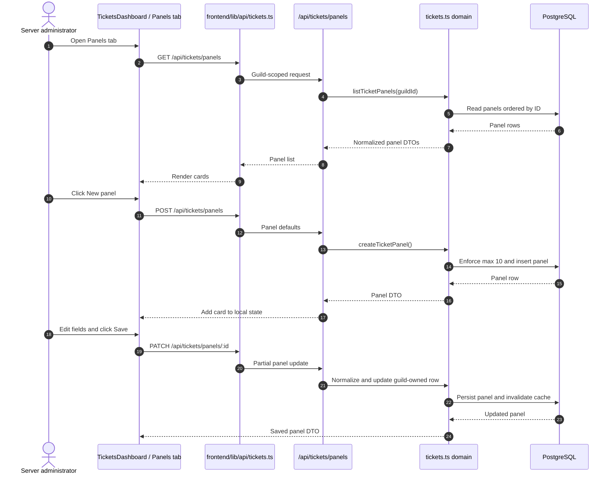

## 1.3 Publishing a panel to Discord

`POST /api/tickets/panels/:id/publish` accepts the same editable panel fields. The current publisher:

1. Requires the Discord bot to be ready.
2. Applies the optional panel patch before publishing.
3. Requires a configured `channelId`.
4. Requires at least one normalized button.
5. Requires a guild text or announcement channel.
6. Builds an embed and one button row.
7. Uses `ticket_open_{panelId}_{typeKey}` as the custom ID for each button.
8. Edits the previously stored message when `messageId` exists.
9. If the edit reports the message as orphaned, sends a new message.
10. If no message exists, sends a new message.
11. Stores the final Discord `channelId` and `messageId` in `ticket_panels`.

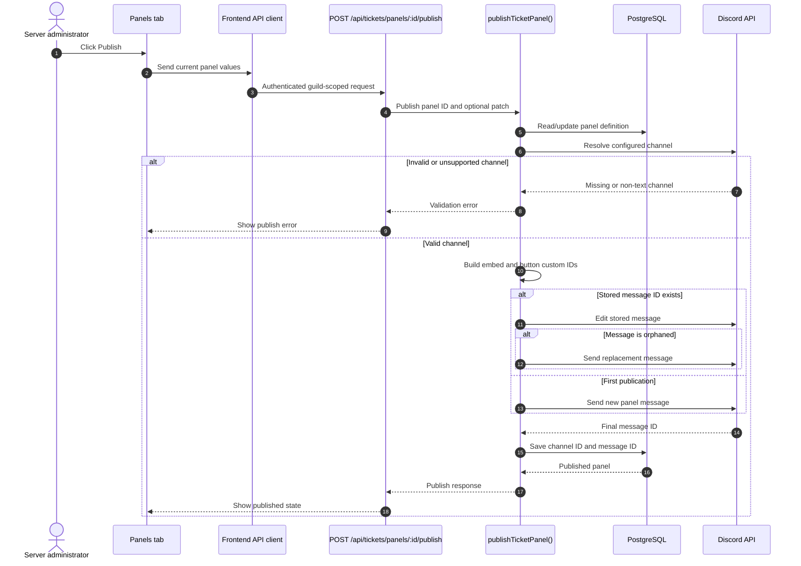

### Panel message ownership

The message is operationally owned by the bot identity that publishes it. The button custom IDs are interpreted by the current bot's interaction router. A panel copied from another bot cannot be assumed to work with this bot without republishing it.

## 1.4 Member click flow

The panel's purpose is to create a private ticket channel. The interaction handler verifies the current database definition instead of trusting only the button payload:

1. Parse `panelId` and `typeKey` from the custom ID.
2. Load the panel.
3. Verify the panel belongs to the current guild.
4. Verify the button type still exists in the current panel definition.
5. Verify the interaction member can be read.
6. Defer an ephemeral response.
7. Apply Ticket Settings and open-ticket limits.
8. Allocate a sequential number in a locked settings transaction.
9. Create the private channel using the configured category, staff roles, and name template.
10. Persist the channel ID.
11. Send the opening message, ticket control message, and optional log.
12. Return the new channel mention ephemerally to the opener.

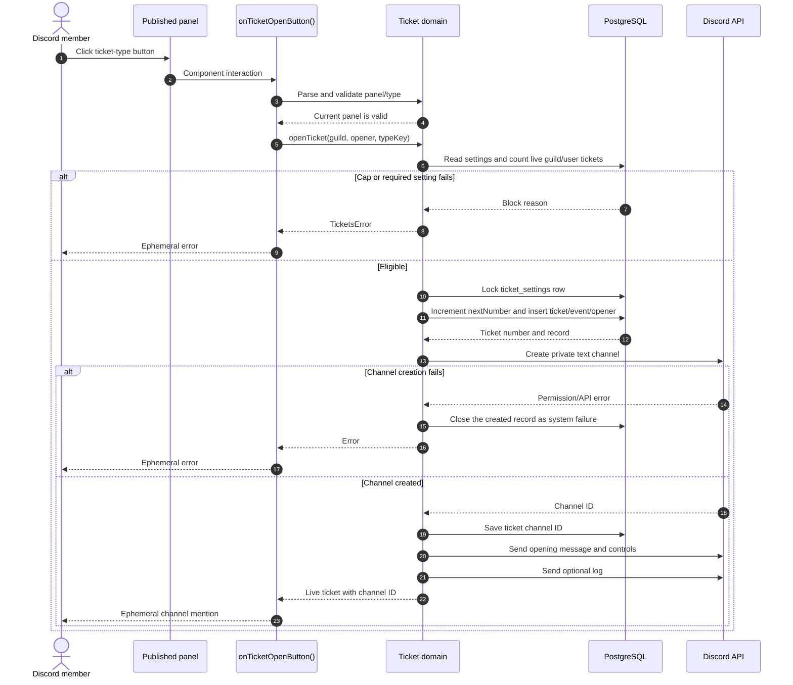

## 1.5 Private channel provisioning

The current channel creator creates a `GuildText` channel under the configured category. Its permission overwrites are:

| Principal | Current permission behavior |
|---|---|
| `@everyone` / guild ID | Deny `ViewChannel`. |
| Bot user | Ticket access plus `ManageChannels` and `ManageMessages`. |
| Opener | `ViewChannel`, `SendMessages`, `ReadMessageHistory`, `AttachFiles`, and `EmbedLinks`. |
| Configured staff roles | The same ticket access permissions as the opener. |

The channel name is rendered from the settings template using `{n}`, `{user}`, and `{type}`. The rendered name is lowercased, sanitized, and limited to Discord's 100-character channel-name limit.

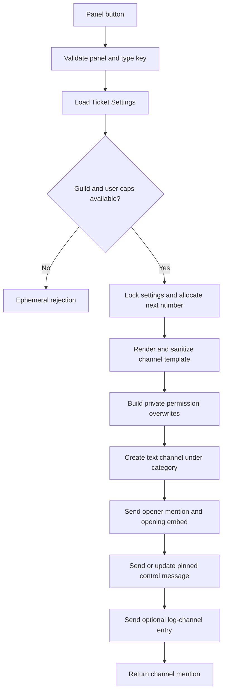

## 1.6 Panel deletion and stale messages

Deleting a panel deletes only the `ticket_panels` database record. The current delete path does not delete the previously published Discord message. The old message can remain visible, but its button no longer resolves to a valid panel and the handler returns an ephemeral invalid-panel error.

This is a concrete `LIMITATION`. A future design should either remove the message, disable its components, or retain a tombstone that intentionally renders the panel unavailable.

---

# 2. Ticket Settings

## 2.1 Implemented settings

`ticket_settings` is one guild-scoped row. The dashboard's Settings tab edits the following fields:

| Setting | Default / limits | Runtime effect |
|---|---|---|
| Ticket category | `null` until selected | Required parent category for newly created ticket channels and reopened tickets. |
| Staff roles | Empty list; maximum 20 normalized Discord role IDs | Grants ticket-channel access and authorizes staff actions. |
| Channel name template | `ticket-{n}-{user}`; maximum 80 characters | Rendered with `{n}`, `{user}`, and `{type}` before channel-name sanitization. |
| Max open per user | Default `1`, allowed `1..5` | Limits simultaneous live tickets for each opener. |
| Log channel | `null` by default | Receives ticket open/claim/close/reopen log embeds when configured. |
| Next number | Starts at `1`; not directly editable in the current UI | Allocates unique sequential numbers per guild under a row lock. |
| Opener can close | Default `true` | Allows the opener to close their own live ticket; staff can still use staff actions. |
| `updatedAt` | Server-managed timestamp | Tracks settings updates. |

The system also enforces a hard maximum of 50 live tickets per guild. This guild cap is shared by all panels and cannot currently be configured from the dashboard.

## 2.2 Settings save flow

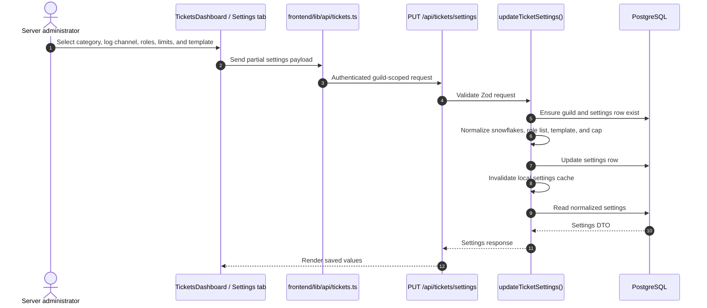

The settings service uses a bounded 60-second in-process cache for reads and invalidates the local cache after writes. Cache invalidation is not shown as cross-process or event-bus based in the reviewed implementation.

## 2.3 Staff authorization

For Discord ticket controls, the handler reads the interacting member's roles and applies this policy:

- `ManageGuild` is sufficient for staff actions.
- Otherwise, the member must have at least one configured staff role.
- Staff-only actions include claim, unclaim, waiting, unwaiting, and adding/removing participants.
- The opener can close their own ticket only when `openerCanClose` is true.
- `openerCanClose` does not grant the opener staff permissions.

The policy is evaluated at interaction time using current member roles and current settings. It is not encoded permanently into the panel message.

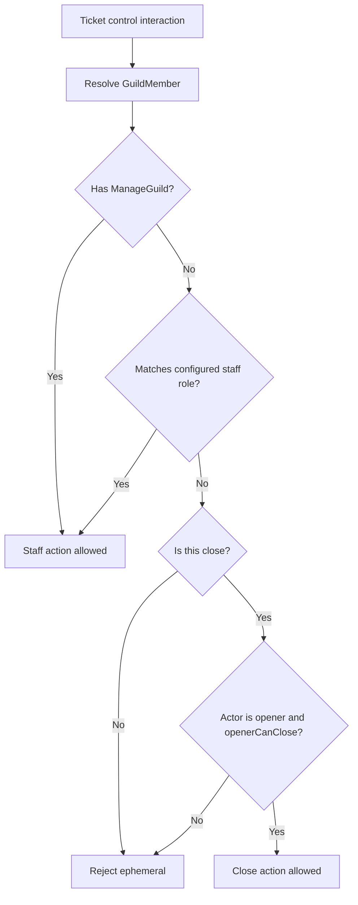

## 2.4 Opening caps and prerequisites

Before creating a ticket, `assertCanOpenTicket`:

1. Loads current settings.
2. Counts live tickets in statuses `open`, `claimed`, and `waiting` for the guild.
3. Counts live tickets for the opener.
4. Blocks at 50 live guild tickets.
5. Blocks when the opener has reached the configured `maxOpenPerUser`.
6. Requires a category.
7. Requires at least one staff role.

`countLiveTickets` and `insertOpenedTicket` are separate operations. The ticket number allocation is locked, but the cap check is not currently part of the same serialized transaction. Concurrent clicks can therefore race around the cap boundary.

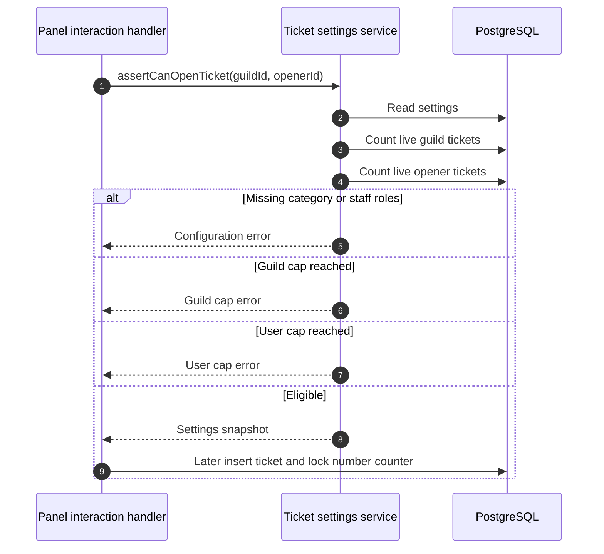

## 2.5 Ticket Settings data flow

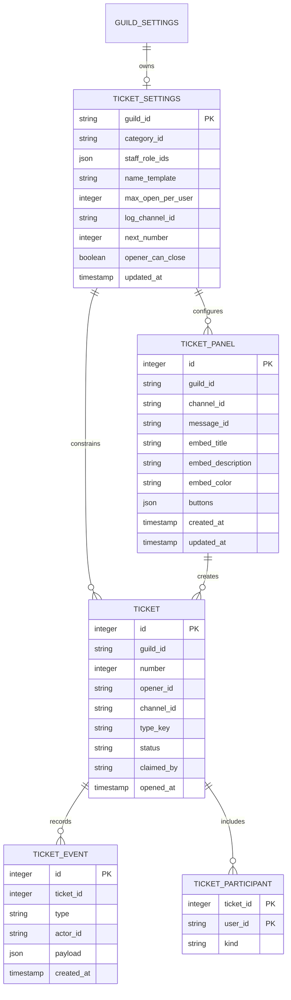

## 2.6 Current settings limitations

| Limitation | Current consequence |
|---|---|
| No configurable ticket cooldown | A member can open another ticket as soon as their live-ticket count permits it. |
| No blacklist/whitelist or bypass roles | Eligibility is based on live-ticket caps and server membership, not role policy. |
| No panel-specific category or staff-role override | All panels use one guild-level category and staff-role set. |
| No explicit bot-permission preflight | The system discovers missing Discord permissions during channel creation or messaging. |
| No configurable ping roles | Staff roles receive channel access, but there is no separate “mention on open” setting. |
| No configurable opening schedule | Panels are available whenever the message and bot are available. |
| No cross-worker cache invalidation | One worker can retain stale settings for up to the local TTL after another worker changes them. |
| No atomic cap reservation | Concurrent opening attempts can pass the count check before either insert is visible. |
| No settings version or audit revision | Consumers cannot identify which settings revision produced a panel or ticket. |

---

# 3. External comparison

## 3.1 Research method

The comparison uses official product documentation, official help centers, official repositories, and official product pages where available. `NOT EVIDENCED` means the reviewed public sources did not describe a comparable behavior with enough specificity; it does not prove that a private or undocumented implementation does not exist.

## 3.2 Panels and Ticket Settings comparison

| Product | Panels | Ticket Settings | Evidence status |
|---|---|---|---|
| Sapphire Bot | `NOT EVIDENCED`; its official Discord application listing describes buttons/select menus and customizable messages, but not a ticket panel system | `NOT EVIDENCED` | Public discovery listing only; no detailed ticket documentation found.[^1] |
| ProBot | Buttons or dropdowns, multiple panels, attached panels, labels/styles, and panel-specific creation settings | Categories, staff/admin/blacklist/whitelist/ping roles, auto-close/delete, pinning, forms, lifecycle messages, transcripts, claiming modes, and event logs | Fully documented in official ticket documentation.[^2] |
| CommunityOne | `NOT EVIDENCED` as a native CommunityOne bot capability | `NOT EVIDENCED` as a native CommunityOne bot capability | The reviewed CommunityOne page is an announcement about Dyno Tickets hosted on a CommunityOne server, not a CommunityOne ticket-system specification.[^3] |
| MEE6 | Ticketing panel and panel message are publicly evidenced | Partial public evidence for ticket introduction messages, required permissions, and bot/message ownership; the full setting surface was not available in the reviewed docs | `PARTIAL — RESEARCH`.[^4][^5][^6] |
| Dyno | Dashboard-created panels; one or multiple panels depending on plan; button or linked-panel presentation; customizable panel message | Open/claimed/closed routing, staff roles, ticket limits, form settings, transcript channel, custom messages, button styles, and panel-specific channel naming | Fully documented in official ticket documentation.[^7] |
| Carl Bot | `NOT EVIDENCED` in the reviewed official documentation | `NOT EVIDENCED` | Official repository documents general Carl-bot modules, but no sufficiently specific ticket-panel documentation was found.[^8] |
| Arcane | `NOT EVIDENCED` | `NOT EVIDENCED` | No sufficiently specific public ticket documentation found in the reviewed official docs.[^9] |
| Invite Tracker | Panels with buttons or one select menu; panel-to-template bindings; editable published message; panel schedules | Templates define category, names, support roles, messages, forms, transcripts, claiming, escalation, logs, and automation; schedules and bypass roles are documented | Fully documented in official ticket documentation.[^10][^11] |
| UnbelievaBoat | `NOT EVIDENCED` | `NOT EVIDENCED` | Official public docs reviewed for Economy, not ticket panels or ticket settings.[^12] |

## 3.3 External capabilities most relevant to this scope

| Reference behavior | Products documenting it | Current Adobos status |
|---|---|---|
| Select/dropdown ticket panel | ProBot, Invite Tracker | `NEW — RESEARCH` |
| Separate template from panel option | Invite Tracker | `NEW — RESEARCH` |
| Multiple panels linked into one published message | ProBot, Dyno | `NEW — RESEARCH` |
| Panel enable/disable state | ProBot | `NEW — RESEARCH` |
| Ticket cooldown | ProBot | `NEW — RESEARCH` |
| Blacklisted/whitelisted/bypass roles | ProBot, Invite Tracker schedules | `NEW — RESEARCH` |
| Panel or template-specific categories and support roles | ProBot, Dyno, Invite Tracker | `NEW — RESEARCH` |
| Intake modal/forms before channel creation | ProBot, Dyno, Invite Tracker | `NEW — RESEARCH` |
| Configurable panel and in-ticket lifecycle messages | ProBot, Dyno, MEE6 | `NEW — RESEARCH` |
| Transcript format/retention choices | ProBot, Dyno, Invite Tracker | `NEW — RESEARCH` |
| Opening hours and bypass roles | Invite Tracker | `NEW — RESEARCH` |
| Auto-close/auto-delete and overflow routing | ProBot, Dyno, Invite Tracker | `NEW — RESEARCH` |
| Response-time, staff-performance, or satisfaction analytics | ProBot, Invite Tracker | `NEW — RESEARCH` |

The comparison suggests that the current implementation has the basic panel-to-private-channel path, but its configuration model is intentionally smaller than the leading documented systems.

---

# 4. Gaps and proposed additions

This section separates feature gaps observed in external products from engineering recommendations. None of the items below are implemented merely because they appear in this document.

## 4.1 `NEW — RESEARCH`: feature gaps

| ID | Proposed addition | Scope | Why it matters |
|---|---|---|---|
| R-01 | Add a select-menu panel mode with option description, placeholder, and emoji | Panels | Supports more than five ticket types without compressing all choices into buttons. |
| R-02 | Separate panel presentation from ticket-type templates and bind each option to a template | Panels / Ticket Settings | Allows different categories, staff roles, names, forms, messages, and limits per ticket type. |
| R-03 | Add panel name, enabled state, publish revision, and duplicate action | Panels | Makes panel lifecycle and message ownership explicit. |
| R-04 | Add per-panel or per-template ticket cooldown | Ticket Settings | Reduces repeated ticket creation after close or abuse. |
| R-05 | Add blacklist, whitelist, and bypass role policies | Ticket Settings | Makes eligibility more expressive than a live-ticket count. |
| R-06 | Add configurable ping roles separate from access roles | Ticket Settings | Separates who can see a ticket from who should be notified. |
| R-07 | Add an optional Discord modal intake form before channel creation | Panels / Ticket Settings | Captures a subject and structured context before staff joins the conversation. |
| R-08 | Add panel/template-specific category routing and overflow categories | Ticket Settings | Prevents a single category from becoming a capacity bottleneck. |
| R-09 | Add configurable opening hours and bypass roles | Panels / Ticket Settings | Allows support availability windows without deleting or disabling the panel message. |
| R-10 | Add configurable panel and opening messages with validated variables | Panels | Makes the user-facing flow consistent with server branding and ticket context. |
| R-11 | Add transcript policy settings: destination, format, retention, and optional opener DM | Ticket Settings | Makes retention and privacy behavior explicit instead of fixed. |
| R-12 | Add configurable auto-close/auto-delete and a documented closed/resolved route | Ticket Settings | Prevents abandoned tickets from consuming category capacity indefinitely. |
| R-13 | Add panel and support analytics such as ticket count, response time, and staff activity | Panels / Ticket Settings | Helps operators understand demand and staffing. |

## 4.2 `NEW — RECOMMENDED`: resilience and scalability

| ID | Recommendation | Current reason |
|---|---|---|
| A-01 | Use a transactional outbox for panel publish/edit/delete effects | The publisher calls Discord directly and persists the message ID afterward. A process failure can leave Discord and Postgres out of sync. |
| A-02 | Add panel revision and idempotency keys | Concurrent Publish clicks or retries can create duplicate replacement messages. |
| A-03 | Add a durable message repair/reconciliation job | A deleted or externally edited panel should be detectable and repairable without an administrator manually republishing. |
| A-04 | Serialize opening-cap reservation with ticket creation | Current cap checks and inserts are separate, so concurrent button clicks can race at the limit. |
| A-05 | Add a unique active-ticket constraint or advisory lock strategy | Enforces the per-user cap at the database boundary rather than relying only on a prior count. |
| A-06 | Add permission preflight and store the result with the panel/settings revision | Channel creation currently discovers missing permissions at runtime. |
| A-07 | Replace process-local caches with shared invalidation or short authoritative reads | Settings and panels can be stale across worker replicas for the local TTL. |
| A-08 | Persist Discord resource operations as idempotent effects | Channel creation, message send, overwrite changes, and pinning can partially succeed. |
| A-09 | Preserve failed cleanup state and retry it | A failed message/channel repair must remain visible as retryable work. |
| A-10 | Add structured Support audit events with actor, source, revision, Discord IDs, and correlation ID | Current ticket events cover ticket state but panel/settings mutations are not evidenced as an immutable audit stream. |
| A-11 | Add optimistic concurrency control to settings and panels | Prevents one dashboard tab from silently overwriting another administrator's changes. |
| A-12 | Add property and integration tests for custom-ID parsing, guild isolation, limits, permissions, publication repair, and concurrent opens | These boundaries are security- and state-sensitive. |

## 4.3 `NEW — RECOMMENDED`: frontend corrections

| ID | Recommendation | Current reason |
|---|---|---|
| F-01 | Hydrate `TicketsIsland` from both Support Astro routes | The current route files render shells with the island mount commented out. |
| F-02 | Add a panel preview that renders the exact embed and components that will be published | The current builder edits values but does not show a Discord preview in the reviewed feature. |
| F-03 | Add a settings validation panel for category, staff roles, log channel, bot permissions, and role hierarchy | Avoids discovering configuration errors only after a member clicks the panel. |
| F-04 | Show publish status, revision, message ID, last publish error, and repair action | The current UI only distinguishes published versus not published by `messageId`. |
| F-05 | Make destructive panel deletion explicit and offer “disable components” or “delete published message” choices | Current delete removes the database record but leaves a stale Discord message. |

---

# 5. Recommended design pattern

## 5.1 Decision

The best fit is a **durable, event-driven modular monolith with a versioned panel aggregate and idempotent Discord projection**.

The central design rule is:

> PostgreSQL is authoritative for panel/settings state and Support records; Discord is a projected user interface that is reconciled through durable effects.

This keeps the existing low-complexity module boundary while making publication, channel provisioning, retries, multi-worker execution, and Discord rate limits explicit.

## 5.2 Target architecture

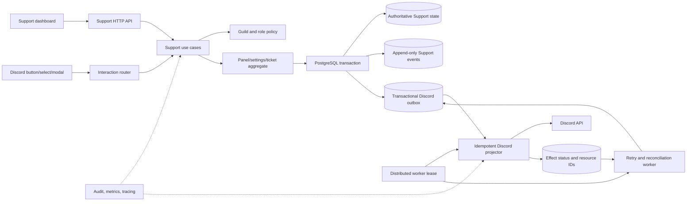

## 5.3 Recommended panel aggregate

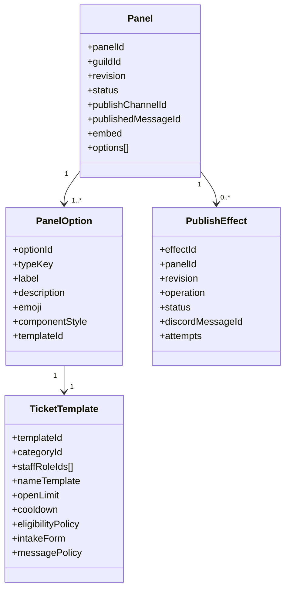

The current implementation combines panel presentation and ticket type configuration in one `ticket_settings` row plus button `typeKey`s. The recommended model separates them so the panel can remain a stable message while each option resolves to a versioned template.

## 5.4 Target end-to-end flow

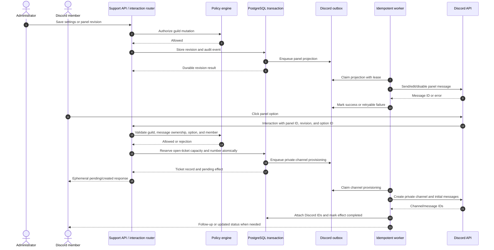

## 5.5 Reusable core pieces

These pieces are intentionally generic so future bot modules can reuse them without expanding this Support audit:

| Core piece | Responsibility | Support usage |
|---|---|---|
| `TenantPolicy` | Guild isolation and administrator/member authorization | Protect settings, panels, and interactions. |
| `VersionedDefinition` | Revisioned, optimistic-concurrency-controlled configuration | Panel revisions and Ticket Settings revisions. |
| `ComponentRegistry` | Namespaced custom IDs, ownership, parsing, and version validation | Panel buttons, select options, and future modals. |
| `ResourceProvisioner` | Idempotent external resource creation/update/deletion | Discord messages, channels, permission overwrites, and pins. |
| `ExternalEffectOutbox` | Durable intent, lease, retry, backoff, and terminal failure | Panel publication and ticket-channel provisioning. |
| `AccessPolicy` | Role, permission, opener, staff, blacklist, and bypass decisions | Ticket Settings and panel eligibility. |
| `StateMachine` | Legal transitions and conflict handling | Ticket open/close/claim paths that panels initiate. |
| `EventJournal` | Append-only domain event with actor and correlation context | Settings/panel changes and ticket state history. |
| `ReconciliationJob` | Detects missing/deleted Discord resources and repairs or reports them | Stale panel messages and missing ticket channels. |
| `AuditContext` | Request ID, guild ID, actor ID, source, revision, and Discord IDs | Cross-module observability and support investigations. |

## 5.6 Invariants to enforce

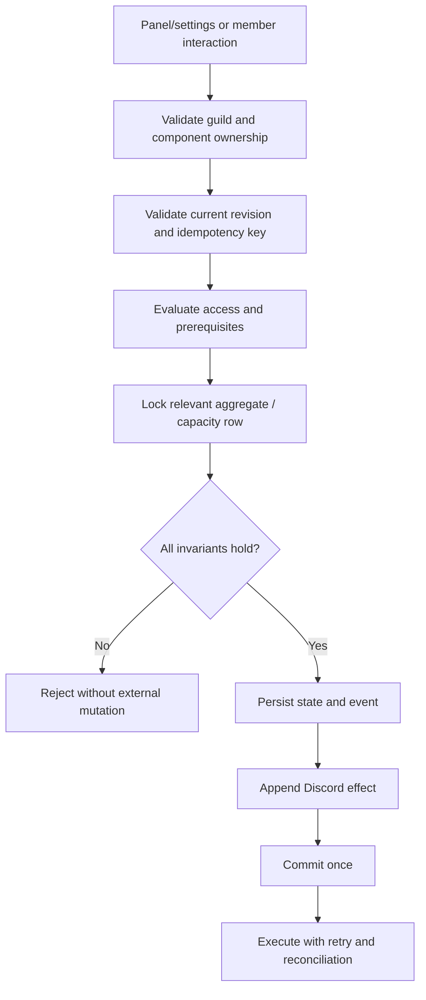

Minimum invariants:

- A panel mutation is scoped to one guild and one authorized actor.
- A published message belongs to the current bot identity and panel revision.
- A component cannot open a ticket for a different guild or deleted option.
- A member cannot exceed the configured open-ticket cap, even under concurrent clicks.
- A ticket number is unique per guild.
- A channel-creation effect is executed at most once logically, even if the worker retries.
- A failed external Discord effect remains retryable or is explicitly marked terminal; it is never silently discarded.
- A deleted panel is either disabled in Discord, removed from Discord, or retained as an explicit tombstone.
- Settings changes cannot silently overwrite a newer revision.
- All mutations include actor, source, revision, and correlation metadata.

---

# 6. Audited repository sources

The current implementation statements in this document were checked against these repository areas:

| Area | Primary files |
|---|---|
| Module wiring and Discord events | `backend/src/modules/tickets/module.ts`, `backend/src/modules/tickets/gateway.ts`, `backend/src/modules/tickets/handlers.ts` |
| Panel publication | `backend/src/modules/tickets/publish.ts`, `backend/src/modules/tickets/domain/tickets.ts` |
| Ticket Settings and opening policy | `backend/src/modules/tickets/domain/tickets.ts`, `backend/src/modules/tickets/actions.ts`, `packages/shared/src/tickets.ts` |
| HTTP validation and routes | `backend/src/modules/tickets/http/routes.ts`, `backend/src/modules/tickets/http/schema.ts` |
| Persistence | `backend/src/db/schema/tickets.ts` |
| Dashboard and API client | `frontend/src/features/tickets/TicketsDashboard.tsx`, `frontend/src/lib/api/tickets.ts`, `frontend/src/pages/dashboard/support/panels.astro`, `frontend/src/pages/dashboard/support/settings.astro`, `frontend/src/components/providers/islands.tsx` |
| Navigation | `frontend/src/lib/nav.ts` |

The codebase-memory coverage check reported no recorded issue for the cited Support production files or the bounded Support/shared/schema scopes. The result is best-effort metadata and is not a mathematical proof of source completeness.

# 7. External sources

[^1]: [Sapphire — official Discord application listing](https://discord.com/discovery/applications/678344927997853742). The listing documents general interactions and customizable messages, but no detailed ticket-panel or Ticket Settings behavior.
[^2]: [ProBot — Tickets documentation](https://docs.probot.io/ku/docs/modules/tickets). The page documents ticket panels, dropdowns, categories, roles, automation, forms, messages, transcripts, claiming, and ticket logs.
[^3]: [CommunityOne-hosted Dyno Tickets announcement](https://communityone.io/servers/1026884833139490958/lucidjx-community/news/dyno-tickets-module-release-2026-06-01/). This is a CommunityOne-hosted announcement describing Dyno's Tickets module, not evidence of a native CommunityOne ticket implementation.
[^4]: [MEE6 — default plugin settings](https://help.mee6.xyz/support/solutions/articles/101000529703-default-settings-for-mee6-plugins). The public page includes Ticketing panel and ticket introduction messages.
[^5]: [MEE6 — permissions required by plugins](https://help.mee6.xyz/support/solutions/articles/101000484903-what-permissions-does-mee6-need-). The public page identifies Ticketing permissions including channel/message/permission management and pinning.
[^6]: [MEE6 — interaction failure for Ticketing panels and custom bots](https://help.mee6.xyz/support/solutions/articles/101000539350--this-interaction-failed-error-with-mee6-ticketing-embeds-or-reaction-roles). The page documents bot identity ownership and the need to duplicate panels after switching bot identities.
[^7]: [Dyno — Tickets module](https://docs.dyno.gg/en/modules/tickets). The official page documents dashboard panels, routing, roles, forms, transcript logs, messages, buttons, and ticket automation.
[^8]: [Carl-bot — official documentation repository](https://github.com/botlabs-gg/carlbot-docs). The reviewed public documentation lists general Carl-bot features but did not provide a sufficiently specific ticket-panel specification.
[^9]: [Arcane — official documentation](https://docs.arcane.bot/). The reviewed public documentation did not provide a sufficiently specific ticket-panel or Ticket Settings specification.
[^10]: [Invite Tracker — Tickets](https://docs.invite-tracker.com/dashboard/tickets/). The official page documents templates, panels, history, forms, claiming, escalation, logs, automation, transcripts, schedules, and permissions.
[^11]: [Invite Tracker — Ticket Panels](https://docs.invite-tracker.com/dashboard/tickets/panels). The official page documents button/select panels, template bindings, panel publication, editing sent panels, and opening-hour schedules.
[^12]: [UnbelievaBoat — official guide](https://faq.unbelievaboat.com/). The reviewed public documentation is focused on Economy, income, games, dashboard access, and permissions; no comparable ticket-panel or Ticket Settings documentation was found.

