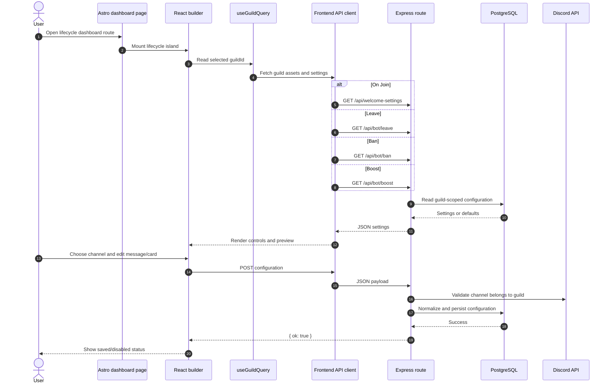
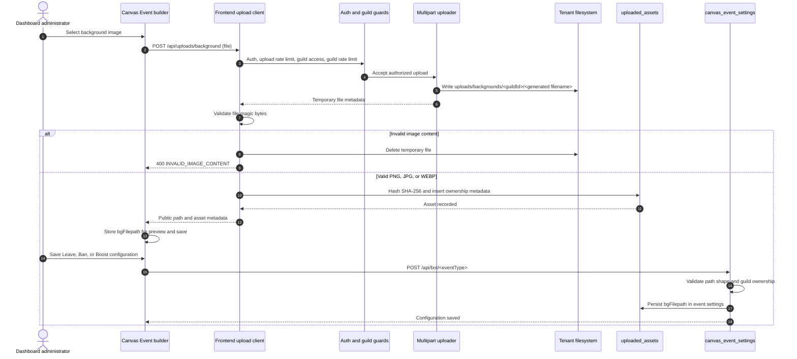
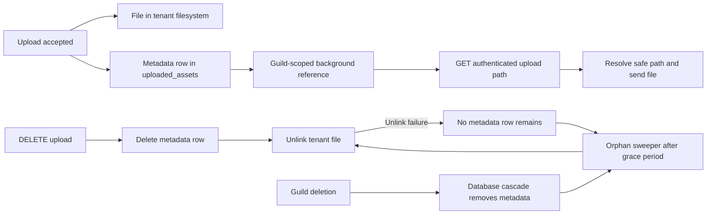
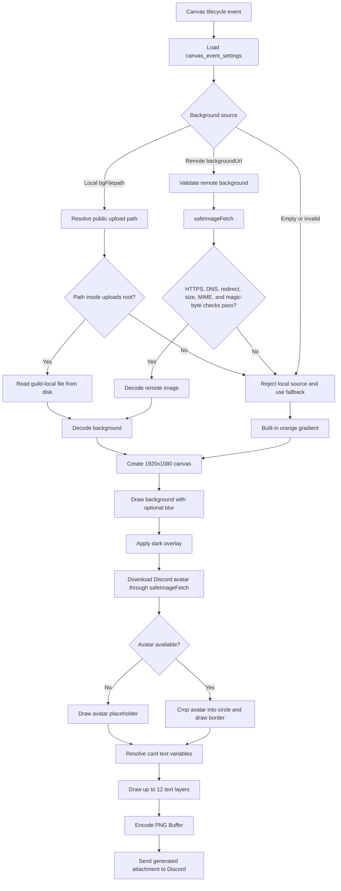
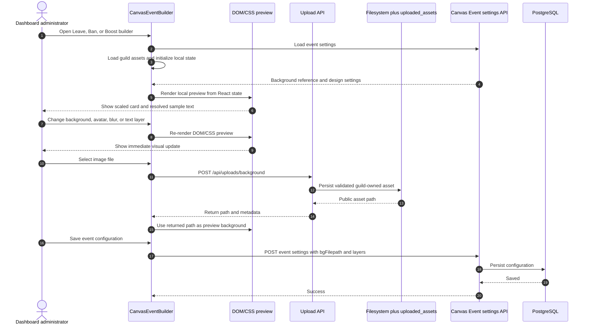
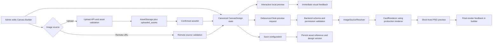
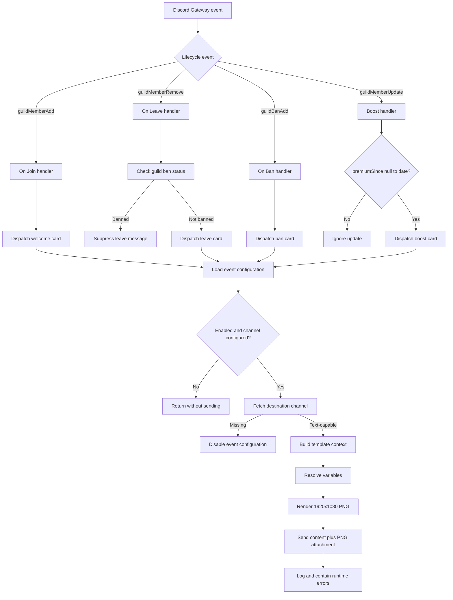
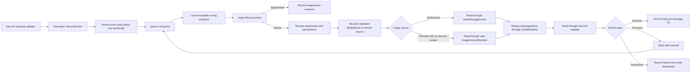
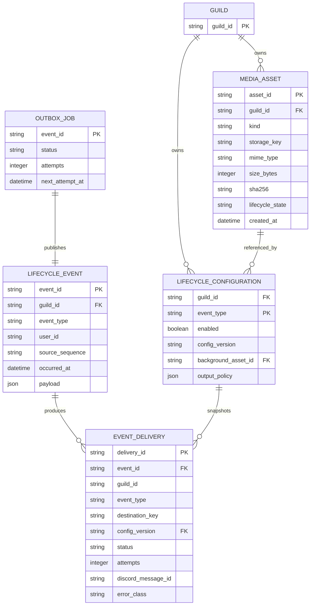
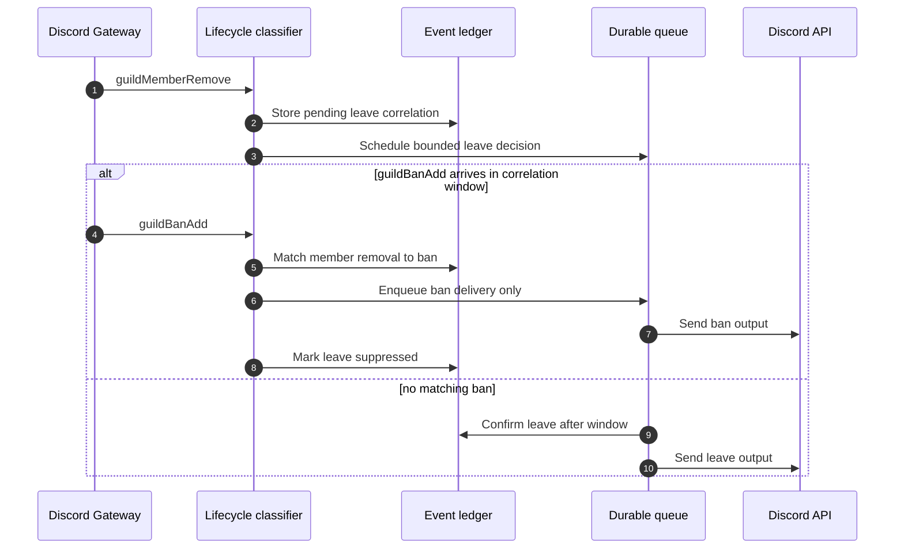

# Lifecycle Messages and Canvas Events

This document covers only the following automated Discord lifecycle messages:

- On Join
- On Leave
- On Ban
- Boosts

It describes the current repository implementation, compares the same scope with the requested bots, identifies missing capabilities, and defines a proposed resilient and scalable design. It does not document unrelated bot features.

All diagrams use Mermaid 2026-compatible syntax.

## Status labels

- **IMPLEMENTED** — Verified in the current repository.
- **NEW — RESEARCH** — Capability documented by an external bot's official public documentation.
- **NEW — RECOMMENDED** — Proposed behavior for this bot. It is not implemented yet.

## Executive summary

The repository has two backend modules for these four dashboard entries:

| Dashboard capability | Current backend module | Discord event | Configuration storage | Current output |
|---|---|---|---|---|
| On Join | `welcome` | `guildMemberAdd` | `welcome_settings` | Optional message content plus a generated PNG card |
| On Leave | `canvas-events` | `guildMemberRemove` | `canvas_event_settings`, `eventType = leave` | Optional message content plus a generated PNG card |
| On Ban | `canvas-events` | `guildBanAdd` | `canvas_event_settings`, `eventType = ban` | Optional message content plus a generated PNG card |
| Boosts | `canvas-events` | `guildMemberUpdate` | `canvas_event_settings`, `eventType = boost` | Optional message content plus a generated PNG card |

The `welcome` module registers only `guildMemberAdd`. Leave, ban, and boost use a separate `canvas-events` module that reuses the welcome card renderer and welcome template helpers.

The backend delivery path is implemented, but the four Astro dashboard pages currently render only their layout: the React islands are commented out. The builders exist and are ready to be mounted, but the configuration UI is not currently connected to these routes.

## Current ownership and source map

| Responsibility | Current source |
|---|---|
| On Join module registration | [`backend/src/modules/welcome/module.ts`](../../backend/src/modules/welcome/module.ts#L6-L20) |
| On Join gateway handler | [`backend/src/modules/welcome/gateway/guildMemberAdd.ts`](../../backend/src/modules/welcome/gateway/guildMemberAdd.ts#L21-L103) |
| On Join configuration routes | [`backend/src/modules/welcome/http/routes.ts`](../../backend/src/modules/welcome/http/routes.ts#L9-L36) |
| On Join persistence and normalization | [`backend/src/modules/welcome/domain/welcome.ts`](../../backend/src/modules/welcome/domain/welcome.ts#L190-L377) |
| Shared card renderer | [`backend/src/modules/welcome/card/WelcomeCardBuilder.ts`](../../backend/src/modules/welcome/card/WelcomeCardBuilder.ts#L313-L366) |
| Safe remote image loader | [`backend/src/core/http/safeImageFetch.ts`](../../backend/src/core/http/safeImageFetch.ts#L1-L365) |
| Card-render worker pool | [`backend/src/core/workers/welcomeCardPool.ts`](../../backend/src/core/workers/welcomeCardPool.ts#L1-L115) |
| Shared image upload HTTP API | [`backend/src/core/http/uploads.ts`](../../backend/src/core/http/uploads.ts#L1-L179) |
| Asset ownership, quotas, deletion, and orphan cleanup | [`backend/src/lib/uploadedAssets.ts`](../../backend/src/lib/uploadedAssets.ts#L1-L188) |
| Tenant upload paths and traversal protection | [`backend/src/lib/dataPaths.ts`](../../backend/src/lib/dataPaths.ts#L1-L71) |
| Uploaded asset metadata | [`backend/src/db/schema/uploads.ts`](../../backend/src/db/schema/uploads.ts#L1-L36) |
| Authenticated upload serving route | [`backend/src/core/http/createApp.ts`](../../backend/src/core/http/createApp.ts#L212-L232) |
| Frontend background upload client | [`frontend/src/lib/api/uploads.ts`](../../frontend/src/lib/api/uploads.ts#L1-L25) |
| Leave, ban, and boost registration | [`backend/src/modules/canvas-events/module.ts`](../../backend/src/modules/canvas-events/module.ts#L11-L49) |
| Leave handler | [`backend/src/modules/canvas-events/gateway/guildMemberRemove.ts`](../../backend/src/modules/canvas-events/gateway/guildMemberRemove.ts#L7-L41) |
| Ban handler | [`backend/src/modules/canvas-events/gateway/guildBanAdd.ts`](../../backend/src/modules/canvas-events/gateway/guildBanAdd.ts#L7-L16) |
| Boost handler | [`backend/src/modules/canvas-events/gateway/guildMemberUpdate.ts`](../../backend/src/modules/canvas-events/gateway/guildMemberUpdate.ts#L10-L26) |
| Shared lifecycle delivery | [`backend/src/modules/canvas-events/sendCard.ts`](../../backend/src/modules/canvas-events/sendCard.ts#L39-L120) |
| Leave/ban/boost persistence | [`backend/src/modules/canvas-events/domain/canvas-events.ts`](../../backend/src/modules/canvas-events/domain/canvas-events.ts#L191-L400) |
| Shared database shape | [`backend/src/db/schema/canvasEvents.ts`](../../backend/src/db/schema/canvasEvents.ts#L16-L48) |
| On Join builder | [`frontend/src/features/welcome/WelcomeBuilder.tsx`](../../frontend/src/features/welcome/WelcomeBuilder.tsx#L474-L939) |
| Leave/ban/boost builder | [`frontend/src/features/canvas-events/CanvasEventBuilder.tsx`](../../frontend/src/features/canvas-events/CanvasEventBuilder.tsx#L535-L1031) |
| Event-specific UI configuration | [`frontend/src/features/canvas-events/configs.ts`](../../frontend/src/features/canvas-events/configs.ts#L7-L53) |
| Shared contracts and variables | [`packages/shared/src/welcome.ts`](../../packages/shared/src/welcome.ts#L3-L212) and [`packages/shared/src/canvas-event.ts`](../../packages/shared/src/canvas-event.ts#L3-L46) |

## Current dashboard-to-backend flow

### Current UI behavior

When mounted, each builder uses the selected guild from `useGuildQuery`. It loads guild assets and the event settings in parallel, displays a preview, and submits the configuration through the matching API client.



### Important current UI limitation

The four page files contain commented island mounts:

- [`frontend/src/pages/dashboard/welcome/index.astro`](../../frontend/src/pages/dashboard/welcome/index.astro#L7-L12)
- [`frontend/src/pages/dashboard/leave/index.astro`](../../frontend/src/pages/dashboard/leave/index.astro#L7-L11)
- [`frontend/src/pages/dashboard/ban/index.astro`](../../frontend/src/pages/dashboard/ban/index.astro#L7-L11)
- [`frontend/src/pages/dashboard/boost/index.astro`](../../frontend/src/pages/dashboard/boost/index.astro#L7-L11)

Therefore, the current backend can process a previously saved configuration, but an administrator cannot configure these features through those routes until the corresponding islands are mounted.

## Canvas Events image subsystem — IMPLEMENTED

`canvas-events` does not own a separate image-storage system. It reuses the core upload service and the Welcome card renderer. For Leave, Ban, and Boost, the configured image is an optional background; the event-specific configuration stores the background reference and the renderer creates a new event card at delivery time.

There are four different image lifecycles:

| Image | Origin | Persisted? | Used by Canvas Events |
|---|---|---:|---|
| Guild background upload | Dashboard file upload | Yes: filesystem plus `uploaded_assets` metadata | Loaded during card rendering |
| Remote background URL | Dashboard configuration | Yes: URL in event settings | Downloaded during card rendering through `safeImageFetch` |
| Member avatar | Discord CDN URL in the event payload | No | Downloaded during card rendering and embedded in the generated PNG |
| Generated event card | `@napi-rs/canvas` output | No | Held as a `Buffer` and sent as a Discord attachment |

### Background upload and storage flow

The Canvas Event builder uploads a background immediately when the administrator selects a file. The returned public path is then submitted as `bgFilepath` when the event configuration is saved.



### Current upload and storage behavior

1. The authenticated API mounts upload routes under `/api/uploads`. The relevant Canvas Event endpoint is `POST /api/uploads/background`; the generic `POST /api/uploads/image` endpoint is shared with other dashboard features and is not required by Canvas Events.
2. Before `multer` writes the file, the backend checks the guild's recorded asset count and byte total using the request `Content-Length` as an upper bound.
3. `multer` writes to `DATA_DIR/uploads/backgrounds/<guildId>/`. If `DATA_DIR` is not configured, the data root is `./data`.
4. The filename is generated by the backend from the current timestamp, a UUID fragment, and a normalized image extension. The original filename is not used as the storage filename.
5. The upload accepts one file, with a maximum of 5 MiB, and the declared MIME type must be PNG, JPEG/JPG, or WEBP. The backend then runs `sniffImageFile` so the file content must also have a recognized image signature.
6. The backend computes a SHA-256 hash and records `guildId`, uploader `ownerId`, kind, filename, MIME type, byte size, hash, and creation time in `uploaded_assets`.
7. The response contains a path such as `/uploads/backgrounds/<guildId>/<filename>`. The Canvas Event builder keeps this path as `bgFilepath`.
8. Saving a Canvas Event accepts a local background only when the path resolves below the uploads root and its guild path segment matches the current guild. The current validation is path-based; it does not perform a foreign-key lookup from `canvas_event_settings` to a specific `uploaded_assets.id`.
9. Serving the path is authenticated and guild-scoped through `GET /uploads/<kind>/<guildId>/<filename>`. Path traversal is rejected before `sendFile` resolves the file.
10. Deleting `DELETE /api/uploads/<kind>/<filename>` removes the metadata row first and then attempts to unlink the tenant file. The delete operation is restricted to the authorized guild.
11. An orphan sweeper scans `backgrounds` and `images` every 30 minutes. Files without a matching metadata row are retained for a one-hour grace period and then deleted. This protects against crashes between the disk write and metadata insert.

Deleting an uploaded background does not clear `bgFilepath` from the Canvas Event settings that reference it, because the current settings schema stores a path string rather than an asset foreign key. The next render fails to load that local file and falls back to the remote source or built-in gradient.



The filesystem and database are therefore coordinated by application logic rather than by one database transaction. The orphan sweep is the recovery mechanism for crashes, failed inserts, failed deletes, and guild metadata cascades that leave a file on disk.

The current local-disk design is tenant-scoped and guarded, but it is not an object-storage abstraction. A multi-replica deployment must ensure that every API, gateway, and rendering worker can read the same upload volume, or the local path will not be portable between replicas.

### Current card-generation and image-processing flow

Canvas Events calls the shared `renderWelcomeCard` function. The function selects a worker in a pool of at most two workers. The worker calls `buildWelcomeCard`, which performs the image reads, rasterization, and PNG encoding.



The renderer's exact behavior is:

- A local guild upload is attempted first when `bgFilepath` is present.
- If the local image cannot be read or decoded, rendering falls back to the configured remote URL, if valid.
- `isWelcomeRemoteBackground` accepts an HTTP(S)-shaped URL, while `safeImageFetch` enforces HTTPS at request time. Therefore, an `http://` URL can pass configuration normalization but fail during rendering and fall back to the built-in gradient.
- Remote downloads use a maximum of 8 MiB, a 12-second total timeout, bounded redirects, DNS/IP checks, content-type checks, and magic-byte validation. These controls protect the renderer from malformed image data and SSRF targets.
- The background is resized to cover the fixed canvas, optionally blurred from 0 to 10, and then darkened with a gradient overlay.
- The member avatar is downloaded from Discord through the same safe image-fetch path. If it fails, the card still renders with a colored placeholder.
- Text layers are normalized before rendering; empty text is skipped, coordinates and font sizes are clamped, and the renderer draws the configured weight, color, and alignment.
- The generated PNG is returned as an in-memory `Buffer`. It is not inserted into `uploaded_assets`, written to the uploads directory, or retained after the send path finishes.
- There is no explicit generated-PNG byte limit before the buffer is passed to Discord. A large encoded result can therefore fail later at Discord's attachment/request limits instead of being rejected by the renderer with a typed size error.

The current worker pool prevents synchronous canvas rasterization and PNG encoding from blocking the Gateway/API event loop. If the pool cannot start or inline mode is enabled, rendering runs in the caller process as a slower fallback. There is no persistent render queue, render-result cache, or generated-card retention policy.

## Frontend Canvas Builder and image preview

The Canvas Builder is part of the image feature, not merely a configuration form. It is the surface where an administrator selects the image source, positions the avatar, edits text layers, controls blur and borders, and verifies the result before enabling an event.

### Current frontend implementation — IMPLEMENTED

`CanvasEventBuilder` is a shared React builder configured for `leave`, `ban`, and `boost`. It currently:

- Loads guild assets and the selected event settings in parallel.
- Uploads a selected background immediately through `POST /api/uploads/background`.
- Stores the returned `bgFilepath` in local React state and submits it with the event configuration.
- Provides a scaled 1,920 × 1,080 preview area.
- Displays the selected background or fallback gradient.
- Renders the avatar position, size, border, color, blur value, and up to 12 text layers.
- Resolves preview variables with a synthetic context such as `NewMember`, `tobot`, and member count `128`.
- Shows the resolved Discord message separately from the image preview.
- Displays upload, loading, save, and error feedback.

The current `CanvasCardPreview` is a DOM/CSS preview composed of HTML elements. It is not an HTML `<canvas>` and it does not call the backend `WelcomeCardBuilder`. The preview uses a placeholder `N` avatar rather than downloading the real Discord avatar, and its CSS blur, image sizing, font loading, and text rasterization are not guaranteed to match the backend's `@napi-rs/canvas` output pixel-for-pixel.

The current preview is therefore useful for editing layout, but it is not a final-render verification. A background can look correct in the browser and still render differently in the generated PNG because the browser preview and backend renderer use different image and text pipelines.



### Required robust builder — NEW — RECOMMENDED

For image-based lifecycle messages, the frontend should provide a production-grade Canvas Builder with two complementary preview modes:

1. **Interactive preview:** fast, local, and responsive while the administrator moves sliders, edits layers, changes colors, or selects a background.
2. **Final-render preview:** generated by the same backend rendering contract used for a real event, so the administrator can verify the actual PNG before saving or enabling the event.

The builder should treat the following as one canonical design document:

```text
CanvasDesign
├── canvas: width, height, fit mode, blur
├── background: assetId or validated remote source
├── avatar: source, position, size, border
├── textLayers: ordered text, position, font, color, weight, alignment
├── templateContext: synthetic preview values
└── output: PNG constraints and selected presentation mode
```

Required behavior:

- **Canonical contract:** use the same shared schema, limits, variable semantics, coordinates, colors, and layer ordering in the browser and backend.
- **Asset-aware preview:** preview a server-confirmed `assetId` or secure asset URL, show upload progress, reject invalid content clearly, and distinguish an unsaved upload from the asset currently referenced by the event.
- **Renderer parity:** use a backend preview endpoint or a shared rendering implementation for final verification. The browser preview must not be presented as exact when it is only an approximation.
- **Realistic test context:** show the event-specific synthetic user, guild, member count, and avatar used by the preview. Mark the preview as sample data and allow a controlled test delivery through the same render/delivery validation path.
- **Image safety feedback:** report unsupported format, file-size/quota, unreadable asset, remote URL, timeout, and unsafe remote-source failures before the administrator enables the event.
- **Layout safeguards:** show the 1,920 × 1,080 coordinate space, prevent or warn about off-canvas layers, detect text overflow, enforce the 12-layer maximum, and preview the final scaled output without changing coordinates.
- **State safety:** preserve unsaved changes, prevent duplicate saves/uploads, handle a deleted or stale asset reference, and show whether the current preview is local-only or server-verified.
- **Responsive and accessible editing:** keep the preview usable at narrow widths, expose numeric values alongside sliders, label every control, and provide keyboard-accessible layer editing.
- **Performance:** update the interactive preview locally, debounce server-rendered preview requests, cancel obsolete requests, and avoid sending the original image repeatedly when only text or coordinates changed.
- **Deterministic output:** include the selected asset reference and configuration version in the final-render request so the preview can be reproduced by the delivery worker.

The final-render preview should not persist a generated PNG as a guild asset. It should return a short-lived preview artifact or image response. Only administrator-selected source assets belong in the asset store; generated event cards remain delivery artifacts.



The two preview paths must converge on the same `CanvasDesign` contract. The local preview optimizes interaction latency; the final-render preview is the authority for backend image fidelity, asset readability, and output-size validation.

## Current runtime delivery flow



## Common current behavior

### Configuration validation

Both configuration APIs use the same Zod schema shape. Enabling an event without a channel returns `MISSING_CHANNEL`. Channel validation checks that the channel exists in the selected guild and is either a Discord text channel or announcement channel.

The current channel validation does not preflight the bot's effective `View Channel`, `Send Messages`, `Embed Links`, or `Attach Files` permissions. A permission failure is discovered only when Discord rejects the runtime send.

The relevant implementation is [`backend/src/modules/welcome/channel.ts`](../../backend/src/modules/welcome/channel.ts#L6-L48) and the shared request schema is [`backend/src/modules/welcome/http/schema.ts`](../../backend/src/modules/welcome/http/schema.ts#L4-L31).

### Stored settings

The three canvas events use a composite key: `(guildId, eventType)`. Each event has an independent enabled state, destination channel, message content, background, avatar settings, and text layers.

The current stored limits are:

| Setting | Current behavior |
|---|---|
| Message content | Trimmed and persisted up to 500 characters; runtime output is capped at 2,000 characters |
| Text layers | Maximum 12 layers; each layer's text is trimmed to 200 characters |
| Card size | Fixed at 1,920 × 1,080 pixels |
| Blur | Clamped to 0–10 |
| Avatar size | Clamped to 280–720 pixels |
| Avatar border | Width 0–40 pixels and `#RRGGBB` color |
| Background URL | Only validated HTTP(S) URLs are accepted |
| Local background | Must resolve under the public upload path and belong to the same guild |
| Destination | Only text and announcement channels |

Legacy `primaryText`, `secondaryText`, coordinates, font, and color columns are retained as fallback mirrors. New configurations store the normalized `textLayers` JSON document and also populate the legacy columns.

### Variable behavior

The shared variable resolver is [`packages/shared/src/welcome.ts`](../../packages/shared/src/welcome.ts#L102-L117):

| Variable | Discord message | Card text |
|---|---|---|
| `{user}` | User mention, for example `<@123>` | Display name, falling back to username |
| `{username}` | Username | Username |
| `{displayname}` / `{displayName}` | Display name | Display name |
| `{server}` | Guild name | Guild name |
| `{membercount}` / `{memberCount}` | Current guild member count | Current guild member count |

No event-specific variables currently exist for ban reason, moderator, boost count, boost tier, invite source, account age, or DM target.

### Rendering and delivery

The renderer:

1. Loads a guild-local background if configured.
2. Otherwise loads a validated remote background if configured.
3. Falls back to the built-in orange gradient when no background is usable.
4. Applies a dark overlay.
5. Loads the user's static PNG avatar, with a fallback avatar area if loading fails.
6. Draws the configured text layers.
7. Encodes the result as a PNG.

Rendering is normally sent to a small `worker_threads` pool. If workers cannot start, it falls back to inline rendering. See [`backend/src/core/workers/welcomeCardPool.ts`](../../backend/src/core/workers/welcomeCardPool.ts#L1-L115).

The final Discord payload is always structurally equivalent to:

```ts
{
  content: resolvedMessageContent,
  files: [generatedPng]
}
```

The code does not construct a Discord `EmbedBuilder`. The database comments mentioning an embed are historical; the current runtime sends plain message content plus a PNG attachment.

## Event-by-event implementation

### On Join — IMPLEMENTED

The `welcome` module requests `GuildMembers`, registers `guildMemberAdd`, and calls `onGuildMemberAdd`.[`welcomeModule`](../../backend/src/modules/welcome/module.ts#L6-L20)

The handler:

1. Ignores bot accounts.
2. Reads the guild's row from `welcome_settings`.
3. Stops if the row is missing, disabled, or has no channel.
4. Fetches the configured channel.
5. Disables Welcome if the channel no longer exists.
6. Rejects unsupported channel types at runtime.
7. Builds a context from the joining member.
8. Resolves message variables using mention semantics.
9. Resolves card variables using display-name semantics.
10. Renders and sends `welcome-card.png`.

The complete handler is [`onGuildMemberAdd`](../../backend/src/modules/welcome/gateway/guildMemberAdd.ts#L21-L103).

### On Leave — IMPLEMENTED

The `canvas-events` module registers `guildMemberRemove` and requests `GuildMembers`.[`canvasEventsModule`](../../backend/src/modules/canvas-events/module.ts#L11-L25)

The handler:

1. Ignores bot accounts.
2. Calls `guild.bans.fetch(userId)`.
3. Suppresses the leave card if Discord reports the user as banned.
4. Uses the member's display name, or the user's global name/username as fallback.
5. Dispatches the `leave` canvas configuration.

This is intended to avoid a leave message when the member was removed by a ban. A failed ban lookup is treated as “not banned,” so a transient permission/API failure can incorrectly allow a leave message.

The handler and suppression rule are [`guildMemberRemove.ts`](../../backend/src/modules/canvas-events/gateway/guildMemberRemove.ts#L7-L41) and [`shouldDispatchLeave`](../../packages/shared/src/welcome.ts#L119-L122).

### On Ban — IMPLEMENTED

The module registers `guildBanAdd` and requests `GuildModeration`.[`canvasEventsModule`](../../backend/src/modules/canvas-events/module.ts#L14-L24)

The handler:

1. Ignores bot accounts.
2. Receives the `GuildBan` object.
3. Builds a user payload from the banned user.
4. Dispatches the `ban` canvas configuration.

The current event payload contains no ban reason, moderator, duration, or audit-log correlation. The implementation is [`guildBanAdd.ts`](../../backend/src/modules/canvas-events/gateway/guildBanAdd.ts#L7-L16).

### Boosts — IMPLEMENTED

Boosts are detected through `guildMemberUpdate`, not through a separate boost event. The handler compares `premiumSince` before and after the update:

```text
oldMember.premiumSince == null
newMember.premiumSince != null
```

Only that transition dispatches a boost card. A member who remains a booster does not trigger more cards for unrelated member updates. Leaving and later starting to boost again triggers a new card.

The implementation is [`guildMemberUpdate.ts`](../../backend/src/modules/canvas-events/gateway/guildMemberUpdate.ts#L10-L26). It does not expose boost count, boost tier, first-boost status, or server-level boost changes.

## Current failure behavior

All four runtime delivery paths are intentionally fail-contained:

- Database lookup errors are caught by the event handler.
- Missing destination channels disable the related configuration.
- Unsupported channel types log a warning and stop.
- Background/avatar load failures fall back to the gradient or avatar placeholder.
- Worker failures fall back to inline rendering.
- Invalid uploaded image content is deleted immediately; files left without metadata are handled by the orphan sweeper after its grace period.
- A deleted or unreadable configured background does not disable the event; rendering falls back to the remote source or built-in gradient.
- Discord send failures are logged and not retried.

The current implementation has no persistent event record, delivery record, retry queue, dead-letter queue, idempotency key, or administrator-facing delivery status.

## External capability comparison — NEW — RESEARCH

The following comparison is limited to join, leave, ban, boost, message format, destination, variables, and lifecycle-specific delivery behavior. “Not evidenced” means that the reviewed official public documentation did not describe the capability; it is not a claim about undocumented or private behavior.

| Bot | Join | Leave | Ban | Boost | Relevant documented capabilities |
|---|---:|---:|---:|---:|---|
| Sapphire | Yes | Yes | Not evidenced | Yes | Channel or DM messages on join, leave, and boost; dynamic images; also role-update messages. [^1] |
| ProBot | Yes | Yes | Not evidenced | Not evidenced | Channel or DM text; images with text, before text, or to a channel; configurable avatar, username, and text layout. [^2] |
| CommunityOne | Not evidenced | Not evidenced | Not evidenced | Not evidenced | Official public material reviewed focuses on AI support, analytics, moderation, and community growth; no lifecycle-message module was documented. [^3] |
| MEE6 | Yes | Yes | Not evidenced | Not evidenced | Welcome and goodbye messages; selected channel; variables; welcome card public and DM defaults; welcome roles. [^4] |
| Dyno | Yes | Not evidenced | Not evidenced | No dedicated feature documented | Message, embed, embed-plus-text, custom image, and optional DM; ignores bots; documents required channel permissions. Dyno's FAQ says it does not currently provide a dedicated boost message and suggests an autoresponder workaround. [^5] |
| Carl-bot | Yes | Yes | Yes | Not evidenced | Welcome, farewell, ban message, join DM, embeds, test command, random blocks, and member-count variables. [^6] |
| Arcane | Yes | Yes | Not evidenced | Not evidenced | Welcome/goodbye messages, embeds, images, tags, and reactions; multiple or random reactions are documented. [^7] |
| Invite Tracker | Yes | Yes | Not evidenced | Not evidenced | Join, join DM, leave, welcome banner, and join subtypes such as normal, vanity, bot, no-permission, and unknown. [^8] |
| UnbelievaBoat | Not evidenced | Not evidenced | Not evidenced | Not evidenced | Current official public material reviewed documents economy, games, moderation, roles, reminders, and dashboard functionality, but no dedicated lifecycle-message module. [^9] |

### Research-derived capability groups

#### Output and destination modes

**NEW — RESEARCH:** The strongest recurring pattern is that lifecycle messages are not limited to one output shape. ProBot, Dyno, Carl-bot, Arcane, and MEE6 document combinations of plain text, embeds, images, or welcome cards. Sapphire, ProBot, Dyno, MEE6, Carl-bot, and Invite Tracker document some form of DM or join-DM capability.

**Gap in this repository:** The current implementation always produces one PNG attachment and optional message content. It has no first-class embed model, no standalone plain-text mode, and no DM target.

#### Lifecycle context

**NEW — RESEARCH:** Carl-bot documents ban messages, Invite Tracker documents join subtypes and permission/unknown states, and ProBot/Dyno/MEE6 document richer member/server variables. Sapphire documents role-update lifecycle messages in addition to join, leave, and boost.

**Gap in this repository:** Ban and boost messages only know the user. Join and leave have a small shared variable set, with no invite, account-age, role-update, ban-reason, moderator, boost-tier, or boost-count context.

#### Customization and testing

**NEW — RESEARCH:** ProBot and Dyno document image layout controls, Arcane documents reactions, Carl-bot documents test output and random blocks, and Invite Tracker documents a welcome banner.

**Gap in this repository:** The card editor is relatively strong, but there is no actual “send test” action, no variants/random selection, no reactions, and no configurable bot inclusion policy.

#### Reliability and operational feedback

**NEW — RESEARCH:** Dyno documents a permission checklist and a diagnostic command. Invite Tracker documents explicit no-permission and unknown message states and explains invite-cache limitations.

**Gap in this repository:** The API validates channel existence/type but not effective permissions. Runtime failures are logged and swallowed, without retry state or dashboard diagnostics.

## Missing capabilities and recommended improvements — NEW — RECOMMENDED

The following are proposals, not current behavior.

### Priority P0 — correctness and availability

1. **Mount the four dashboard islands.** The backend implementation cannot be configured from the current pages while the Astro mounts remain commented.
2. **Replace leave-time ban REST probing with event correlation.** Store a short-lived lifecycle event record and correlate `guildMemberRemove` with `guildBanAdd`. A leave event should be delayed only for a small bounded correlation window; a confirmed ban suppresses the leave delivery. A failed lookup must not be interpreted as proof that no ban occurred.
3. **Add idempotency and a delivery ledger.** Each normalized lifecycle event needs a stable event key. A unique constraint must prevent the same `(guild, event, user, source-event)` from creating duplicate deliveries.
4. **Use a durable outbox/queue.** Gateway listeners should enqueue work and return quickly. Rendering and Discord sends should run outside the Gateway callback, with bounded concurrency and retryable failure handling.
5. **Classify failures.** Retry transient Discord/API/network errors with exponential backoff and jitter. Mark permission, deleted-channel, invalid-configuration, and unsupported-channel errors as non-retryable. Expose the final status in the dashboard.
6. **Run a permission preflight.** Validate `View Channel`, `Send Messages`, and `Attach Files` before enabling a destination. If embeds are enabled later, also validate `Embed Links`. Discord requires `SEND_MESSAGES` for guild message creation and recommends explicit `allowed_mentions` handling for user-generated content.[^10]
7. **Make asset references durable and explicit.** Store a validated `assetId` (or a provider-neutral asset reference) in the event configuration instead of relying only on a path string. Verify that the asset exists, belongs to the guild, and is still readable before activation.
8. **Bound the generated artifact.** Enforce an output-byte ceiling before Discord delivery, classify an oversized card as a permanent rendering/configuration failure, and expose that reason to the dashboard.

### Priority P1 — feature parity and better lifecycle context

1. **Add explicit output modes:** `plain_text`, `embed`, `image`, and `image_plus_text`. Keep the current card as the image mode.
2. **Add independent public-channel and DM destinations.** DM failure should be an independently reported delivery result and must not prevent a configured public-channel delivery.
3. **Expand the typed template context per event.** Add only values that are valid for that event, such as:
   - Join: invite source, inviter, account age, first join/rejoin state.
   - Leave: departure kind when known, remaining member count.
   - Ban: reason and moderator when audit-log correlation is available.
   - Boost: first boost, current boost count, server boost level, and whether the user just started boosting.
4. **Make bot handling configurable.** The current hard-coded bot exclusion is safe, but a guild should be able to choose whether bot joins/leaves/bans/boosts are announced.
5. **Add preview and test delivery.** The existing preview is local-only. A test action should use a synthetic, clearly marked context and the same validation, rendering, and delivery path.
6. **Add message variants.** Allow a bounded list of templates or card designs and select them deterministically or randomly per event. The selection must be recorded with the delivery for reproducibility.
7. **Add optional reactions as a post-send action.** Reactions must be separate from core message creation so a failed reaction does not invalidate a successful message delivery.

### Priority P2 — scale and operations

1. **Cache immutable rendering inputs.** Cache validated fonts, remote backgrounds, and guild assets with bounded TTL and size limits.
2. **Version configurations.** Persist a configuration version with every delivery so an event can be explained using the exact template and card settings used at send time.
3. **Add metrics and structured logs.** At minimum: events received, suppressed, queued, rendered, sent, retried, permanently failed, and disabled due to destination problems.
4. **Make the worker pool bounded and observable.** Track queue depth, render latency, worker failures, and rejected jobs. Backpressure must prevent a burst of joins or boosts from exhausting memory.
5. **Support shard-safe coordination.** When multiple gateway workers can observe the same guild, idempotency must be enforced in shared storage rather than process memory.
6. **Introduce a storage port.** Keep the current tenant path and metadata rules behind an `AssetStorage` interface. Use a shared durable volume or object storage for multi-replica deployments; do not make worker placement determine whether a background is readable.
7. **Add asset lifecycle state.** Track referenced, unreferenced, deleting, and deleted assets. Clean up replaced backgrounds and failed uploads deterministically, while preserving the current orphan grace period as a recovery safeguard.
8. **Cache immutable image inputs.** Cache validated background bytes and Discord avatars with bounded TTL, size, and memory limits. Cache misses and eviction must return to the same safe loader and never bypass SSRF or magic-byte checks.

## Recommended design pattern — NEW — RECOMMENDED

### Decision

The best fit is a **policy-driven event dispatcher using Ports and Adapters, backed by a transactional outbox and an idempotent delivery ledger**.

This combines four useful properties:

- **Event-driven adapters** translate Discord gateway events into canonical lifecycle events.
- **Policy-driven dispatch** decides whether an event should produce a leave, ban, boost, or join message and which configuration applies.
- **Ports and Adapters** keep Discord, PostgreSQL, image rendering, and queue infrastructure outside the reusable core.
- **Transactional outbox plus idempotent delivery** makes event processing recoverable without sending duplicates after reconnects or process failures.

This is preferable to keeping separate event handlers that each perform database reads, image rendering, and Discord sends. It also removes the current coupling where `canvas-events` imports channel validation, template parsing, and text helpers from the `welcome` module.

### Proposed core boundaries

These are reusable core pieces, not additional documented bot features:

| Core piece | Responsibility |
|---|---|
| `LifecycleEvent` | Canonical event envelope: guild, user, event type, source sequence, occurrence time, and event payload |
| `LifecycleClassifier` | Converts Discord events into `join`, `leave`, `ban`, or `boost` decisions |
| `LifecyclePolicy` | Applies bot filtering, ban/leave correlation, enablement, and event-specific rules |
| `TemplateContext` | Typed, event-aware values available to message and card templates |
| `MessageIntent` | Provider-neutral output: content, embed data, image artifact, allowed mentions, and destination |
| `TemplateRenderer` | Resolves variables and creates the selected output artifact |
| `MediaAsset` | Provider-neutral identity, guild ownership, MIME type, size, hash, lifecycle state, and reference metadata |
| `AssetStorage` | Reads, writes, deletes, and atomically finalizes guild-owned image assets |
| `AssetValidator` | Enforces file size, MIME, magic bytes, dimensions, and safe remote-source rules |
| `ImageSourceResolver` | Resolves a local asset, remote background, or Discord avatar into bounded image bytes |
| `CardRenderer` | Rasterizes the validated inputs into a bounded image artifact without owning persistence |
| `DestinationResolver` | Verifies guild/channel/DM target and effective permissions |
| `DeliveryService` | Sends a `MessageIntent` through the Discord adapter and classifies the result |
| `DeliveryLedger` | Records idempotency key, attempts, message IDs, status, error class, and configuration version |
| `OutboxPublisher` | Publishes committed events to the durable work queue |
| `RetryPolicy` | Handles transient failures, backoff, jitter, maximum attempts, and dead-letter state |

### Proposed target flow



### Proposed event model



The important invariants are:

1. A Gateway event is acknowledged by the application after it is normalized and queued, not after image rendering finishes.
2. The event and outbox record are committed atomically.
3. Delivery is idempotent by a shared-storage unique key.
4. Configuration is snapshotted for each delivery.
5. A permanent failure is not retried forever.
6. A renderer failure cannot block unrelated lifecycle events.

### Leave/ban correlation



The correlation window should be short and bounded. It is not a general scheduler; it exists only to resolve Discord's two related lifecycle signals without a blocking ban lookup on every departure.

### Discord Gateway and API constraints

Discord documents that `GUILD_MEMBERS` is required for guild member add, update, and remove events, while `GUILD_MODERATION` carries guild ban events. Discord also documents `premium_since` on Guild Member Update as the time the user started boosting the guild.[^11]

Discord Gateway connections can disconnect and resume, replaying missed events. That is why event identity and idempotency belong in shared durable storage rather than only in process memory.[^12]

Discord message creation requires `SEND_MESSAGES` in guild channels, caps content at 2,000 characters, supports up to 10 embeds, and supports an `enforce_nonce` option for nonce-based duplicate protection at the API boundary. The proposed ledger remains necessary because one lifecycle event may involve rendering, multiple destinations, or retries before a Discord message exists.[^10]

## Recommended target behavior by capability

| Capability | Keep from current implementation | Add in target design |
|---|---|---|
| On Join | Guild member event, bot filtering, variables, custom card, worker rendering | Mounted UI, output modes, optional DM, invite/context variables, durable delivery, test send |
| On Leave | Member removal event, separate event configuration, remaining member count | Event correlation instead of per-leave ban REST lookup, deterministic suppression, durable delivery |
| On Ban | Dedicated ban event and separate configuration | Ban reason/moderator context when available, explicit delivery status, configurable bot policy |
| Boosts | `premiumSince` transition detection and separate configuration | Boost metadata, first-boost/count context, idempotency, explicit reboost policy |

## Verification notes

The repository's current module tests verify module identity only. Shared tests cover variable semantics, layer normalization, background URL handling, channel-type handling, and leave suppression. There is currently no end-to-end test that drives a Discord event through configuration lookup, rendering, and channel delivery.

Recommended test layers for the target design:

1. Pure classifier tests for join, leave, ban, boost, and boost transitions.
2. Leave/ban correlation tests for ordering, timeout, and lookup failure.
3. Template contract tests for every event-specific variable.
4. Renderer tests for fallback background, avatar failure, and worker failure.
5. Idempotency tests across duplicate gateway deliveries and concurrent consumers.
6. Discord adapter contract tests for permission, rate-limit, transient, and permanent errors.
7. One end-to-end test per lifecycle event using a fake Discord adapter.

## Sources

### External official sources

[^1]: [Sapphire official Discord application listing](https://discord.com/discovery/applications/678344927997853742).
[^2]: [ProBot — Welcome & Goodbye](https://docs.probot.io/docs/modules/welcome) and [Embed Messages](https://docs.probot.io/docs/modules/embed).
[^3]: [CommunityOne official documentation](https://communityone.gitbook.io/communityone) and [official product site](https://communityone.io/).
[^4]: [MEE6 — Goodbye Messages](https://help.mee6.xyz/support/solutions/articles/101000381837-send-a-message-when-a-user-leaves-the-server-goodbye-message-) and [MEE6 default settings](https://help.mee6.xyz/support/solutions/articles/101000529703-default-settings-for-mee6-plugins).
[^5]: [Dyno — Welcome](https://docs.dyno.gg/modules/welcome), [Dyno FAQ](https://docs.dyno.gg/faq), and [Dyno Premium](https://docs.dyno.gg/en/premium).
[^6]: [Carl-bot — Welcome and leave messages](https://github.com/CarlGroth/carlbot-docs/blob/master/logging/welcome-and-leave-messages.md) and [Carl-bot dashboard overview](https://carl.gg/about).
[^7]: [Arcane — Welcomer](https://docs.arcane.bot/plugins/welcomer/) and [Welcomer setup](https://docs.arcane.bot/plugins/welcomer/setup).
[^8]: [Invite Tracker — Introduction](https://docs.invite-tracker.com/) and [message types](https://docs.invite-tracker.com/dashboard/messages/types).
[^9]: [UnbelievaBoat official site](https://unbelievaboat.com/) and [official guide](https://faq.unbelievaboat.com/).
[^10]: [Discord — Message Resource](https://docs.discord.com/developers/resources/message).
[^11]: [Discord — Gateway Intents](https://docs.discord.com/developers/events/gateway) and [Gateway Events](https://docs.discord.com/developers/events/gateway-events).
[^12]: [Discord — Gateway reconnecting and resuming](https://docs.discord.com/developers/topics/gateway).
